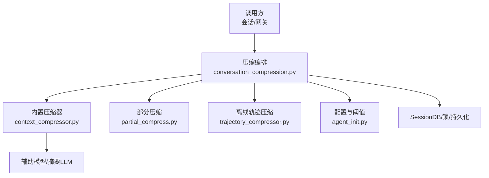
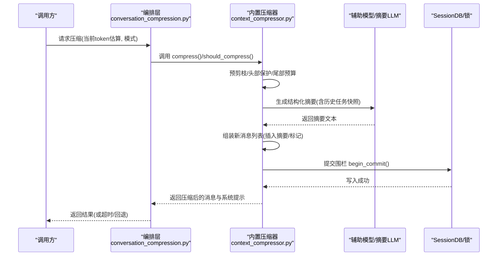
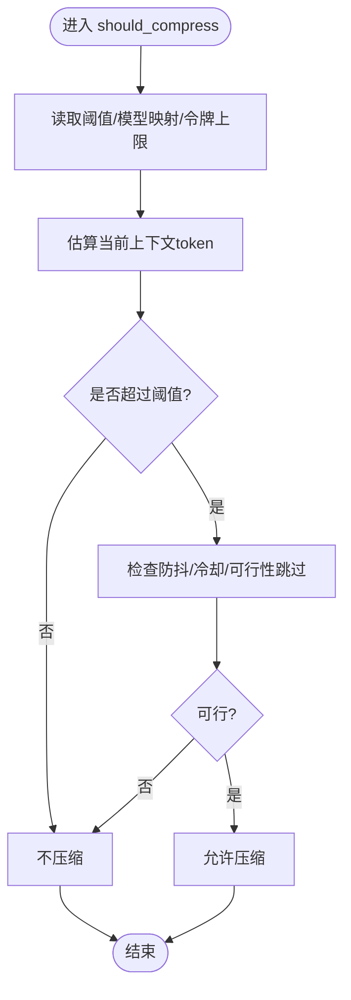
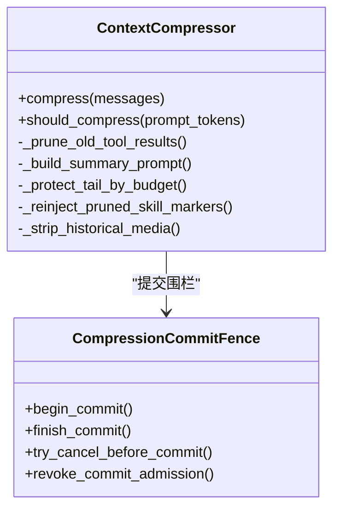
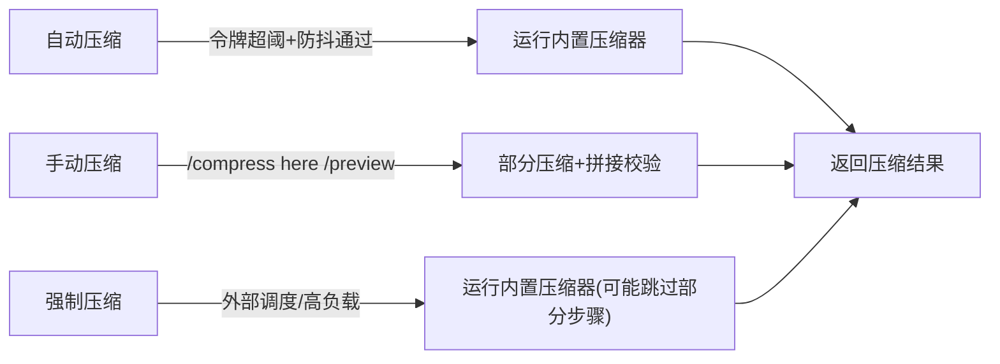
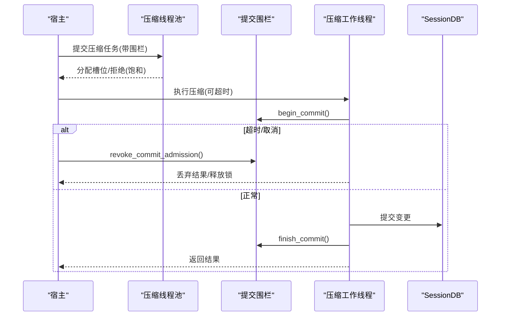
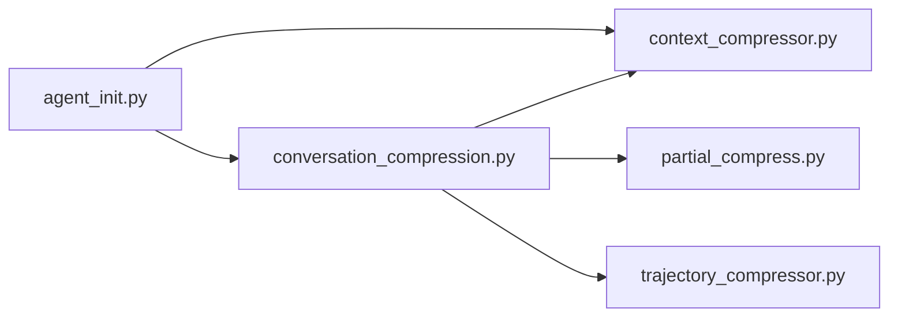

# 对话压缩优化

<cite>
**本文引用的文件**
- [conversation_compression.py](file://agent/conversation_compression.py)
- [context_compressor.py](file://agent/context_compressor.py)
- [trajectory_compressor.py](file://trajectory_compressor.py)
- [partial_compress.py](file://hermes_cli/partial_compress.py)
- [agent_init.py](file://agent/agent_init.py)
</cite>

## 目录
1. [简介](#简介)
2. [项目结构](#项目结构)
3. [核心组件](#核心组件)
4. [架构总览](#架构总览)
5. [详细组件分析](#详细组件分析)
6. [依赖关系分析](#依赖关系分析)
7. [性能与资源控制](#性能与资源控制)
8. [故障排查指南](#故障排查指南)
9. [结论](#结论)
10. [附录：配置参数与高级扩展](#附录：配置参数与高级扩展)

## 简介
本文件系统性梳理 Hermes Agent 的“对话压缩优化”能力，覆盖触发条件、压缩策略、摘要生成、关键信息保留、内存与并发控制、质量评估与回滚机制，以及可配置项与第三方集成方式。重点解释 should_compress() 的判断逻辑（令牌使用监控、阈值计算、防抖保护），并说明自动/手动/强制等压缩模式的使用场景。

## 项目结构
围绕对话压缩的关键代码分布在以下模块：
- agent/conversation_compression.py：压缩编排、超时与提交围栏、活动心跳、锁租约刷新、遥测与状态恢复。
- agent/context_compressor.py：内置上下文压缩器（ContextCompressor）实现，含摘要模板、工具输出裁剪、尾部保护、微压缩、失败冷却与回退。
- trajectory_compressor.py：离线轨迹压缩脚本，用于训练数据后处理。
- hermes_cli/partial_compress.py：边界感知的“部分压缩”（保留最近若干轮）与预览/干跑。
- agent/agent_init.py：启动期压缩阈值解析、模型阈值映射、压缩相关配置注入。

**图表来源**
- [conversation_compression.py:819-1089](file://agent/conversation_compression.py#L819-L1089)
- [context_compressor.py:1447-1599](file://agent/context_compressor.py#L1447-L1599)
- [partial_compress.py:213-325](file://hermes_cli/partial_compress.py#L213-L325)
- [trajectory_compressor.py:332-800](file://trajectory_compressor.py#L332-L800)
- [agent_init.py:1868-2033](file://agent/agent_init.py#L1868-L2033)

**章节来源**
- [conversation_compression.py:1-150](file://agent/conversation_compression.py#L1-L150)
- [context_compressor.py:1-180](file://agent/context_compressor.py#L1-L180)
- [trajectory_compressor.py:1-120](file://trajectory_compressor.py#L1-L120)
- [partial_compress.py:1-50](file://hermes_cli/partial_compress.py#L1-L50)
- [agent_init.py:1868-2033](file://agent/agent_init.py#L1868-L2033)

## 核心组件
- 压缩编排层（conversation_compression.py）
  - 提供带进度感知的超时执行、提交围栏（CompressionCommitFence）、活动心跳、锁租约刷新、失败冷却与状态恢复、遥测上报。
- 内置压缩器（context_compressor.py）
  - 负责消息分片（头/中/尾）、工具结果预剪枝、结构化摘要生成、滚动微压缩、失败冷却与回退、技能指令防幽灵丢失、图片/媒体裁剪等。
- 部分压缩（partial_compress.py）
  - 支持“保留最近 N 轮”的边界感知压缩，提供预览/干跑与拼接合法性保障。
- 离线轨迹压缩（trajectory_compressor.py）
  - 面向训练数据的批处理压缩，保护首尾回合，对中间区域进行摘要替换。
- 配置与阈值（agent_init.py）
  - 解析全局阈值、按模型阈值映射、令牌上限、微压缩阈值等。

**章节来源**
- [conversation_compression.py:819-1089](file://agent/conversation_compression.py#L819-L1089)
- [context_compressor.py:1447-1599](file://agent/context_compressor.py#L1447-L1599)
- [partial_compress.py:213-325](file://hermes_cli/partial_compress.py#L213-L325)
- [trajectory_compressor.py:332-800](file://trajectory_compressor.py#L332-L800)
- [agent_init.py:1868-2033](file://agent/agent_init.py#L1868-L2033)

## 架构总览
压缩流程由编排层驱动，内部通过内置压缩器完成摘要生成与消息重组；同时支持部分压缩与离线轨迹压缩两种补充路径。所有持久化变更在提交围栏内原子完成，避免超时或取消导致的状态不一致。

**图表来源**
- [conversation_compression.py:819-1089](file://agent/conversation_compression.py#L819-L1089)
- [context_compressor.py:1447-1599](file://agent/context_compressor.py#L1447-L1599)

## 详细组件分析

### should_compress() 判断逻辑（触发条件）
- 令牌使用监控
  - 基于当前估计 token 数与有效阈值比较；阈值可按模型名映射调整，且对小上下文窗口模型有更高触发比例。
- 阈值计算
  - 支持全局阈值与 per-model 阈值；当主模型上下文较小，会提高触发比例以避免频繁无效压缩。
- 防抖保护
  - 维护连续失败计数、冷却截止时间、不可效压缩次数、回退连击等，避免在异常或低收益情况下反复触发。
- 可行性跳过
  - 当可压缩中段极小且历史显示无效时，直接跳过 LLM 摘要调用，仅做确定性裁剪。

**图表来源**
- [context_compressor.py:1421-1445](file://agent/context_compressor.py#L1421-L1445)
- [context_compressor.py:2776-2850](file://agent/context_compressor.py#L2776-L2850)
- [agent_init.py:1868-2033](file://agent/agent_init.py#L1868-L2033)

**章节来源**
- [context_compressor.py:1421-1445](file://agent/context_compressor.py#L1421-L1445)
- [context_compressor.py:2776-2850](file://agent/context_compressor.py#L2776-L2850)
- [agent_init.py:1868-2033](file://agent/agent_init.py#L1868-L2033)

### 压缩算法核心技术
- 摘要生成
  - 使用结构化提示词，包含“历史任务快照”“待解决问题”等分区，明确“参考而非指令”的语义约束，防止模型误将摘要当作活跃任务。
  - 支持迭代更新：后续压缩会在已有摘要基础上增量更新，避免信息丢失。
- DAG 构建与关键信息提取
  - 通过工具调用/结果的结构化摘要、路径提及收集、技能指令标记注入，确保关键实体（文件路径、工具行为、用户意图）被保留。
  - 对大段工具输出进行“先裁剪再摘要”，减少输入长度并提升摘要质量。
- 语义保留策略
  - 严格的角色交替校验与合并边界处理，避免模板拒绝。
  - 图片/多媒体内容在历史中被替换为占位或标签，避免重复传输大体积 base64。
  - 技能指令“幽灵防护”：若技能指令被压缩掉，注入重加载提示，保证模型仍可获取必要指令。

**图表来源**
- [context_compressor.py:1447-1599](file://agent/context_compressor.py#L1447-L1599)
- [conversation_compression.py:445-691](file://agent/conversation_compression.py#L445-L691)

**章节来源**
- [context_compressor.py:100-180](file://agent/context_compressor.py#L100-L180)
- [context_compressor.py:585-621](file://agent/context_compressor.py#L585-L621)
- [context_compressor.py:1118-1176](file://agent/context_compressor.py#L1118-L1176)
- [conversation_compression.py:445-691](file://agent/conversation_compression.py#L445-L691)

### 压缩模式选择
- 自动压缩
  - 由 should_compress() 根据令牌阈值与防抖策略决定；适合长会话持续增长的常规场景。
- 手动压缩
  - 通过 CLI/网关命令触发，支持“保留最近 N 轮”的部分压缩与预览/干跑，便于用户精确控制边界。
- 强制压缩
  - 在外部压力或紧急情况下，可通过 force 标志或外部调度触发；仍受提交围栏与超时保护。

**图表来源**
- [partial_compress.py:55-143](file://hermes_cli/partial_compress.py#L55-L143)
- [partial_compress.py:213-325](file://hermes_cli/partial_compress.py#L213-L325)
- [context_compressor.py:1447-1599](file://agent/context_compressor.py#L1447-L1599)

**章节来源**
- [partial_compress.py:55-143](file://hermes_cli/partial_compress.py#L55-L143)
- [partial_compress.py:213-325](file://hermes_cli/partial_compress.py#L213-L325)
- [context_compressor.py:1447-1599](file://agent/context_compressor.py#L1447-L1599)

### 内存管理、性能优化与资源控制
- 进度感知超时与总上限
  - 以“空闲超时 + 总上限”双预算控制压缩过程；流式摘要期间通过 touch_progress 延长等待，但不会无限等待。
- 提交围栏（CompressionCommitFence）
  - 保证摘要完成后才进入 SessionDB 提交；若超时/取消，可在提交前拦截，或在提交阶段记录越界告警但不中断已开始的写操作。
- 并发池与准入限制
  - 共享线程池限制最大工作数，避免队列无限增长；饱和时快速失败并继续无压缩对话。
- 锁租约刷新
  - 持有压缩锁的后台线程周期性续租，防止长时间阻塞导致死锁；失败容忍有限次数，避免永久占用。
- 活动心跳
  - 在压缩期间定期刷新活动状态，避免被误判为空闲；终止时发布终态，防止僵尸心跳。

**图表来源**
- [conversation_compression.py:738-774](file://agent/conversation_compression.py#L738-L774)
- [conversation_compression.py:819-1089](file://agent/conversation_compression.py#L819-L1089)
- [conversation_compression.py:1508-1599](file://agent/conversation_compression.py#L1508-L1599)

**章节来源**
- [conversation_compression.py:738-774](file://agent/conversation_compression.py#L738-L774)
- [conversation_compression.py:819-1089](file://agent/conversation_compression.py#L819-L1089)
- [conversation_compression.py:1508-1599](file://agent/conversation_compression.py#L1508-L1599)

### 质量监控、评估指标与回滚策略
- 遥测与日志
  - 每次压缩尝试记录事件（attempt_id、session_id、触发源、各阶段耗时、是否回退、提交状态等）。
- 失败冷却与回退
  - 对认证/配额错误采用非重试策略；对网络/速率限制则重试；连续失败触发冷却，避免雪崩。
- 回滚与恢复
  - 提交前取消可安全回滚；提交阶段若超时，记录越界告警并继续等待；支持从子会话恢复（压缩旋转后切换至最新子会话）。

**章节来源**
- [conversation_compression.py:1152-1187](file://agent/conversation_compression.py#L1152-L1187)
- [conversation_compression.py:1292-1345](file://agent/conversation_compression.py#L1292-L1345)
- [context_compressor.py:73-95](file://agent/context_compressor.py#L73-L95)

## 依赖关系分析
- conversation_compression.py 依赖 context_compressor.py 的具体压缩实现，并通过 CompressionCommitFence 协调提交。
- partial_compress.py 提供纯函数式拆分与拼接逻辑，供 CLI/网关复用。
- trajectory_compressor.py 独立于在线压缩，用于离线数据处理。
- agent_init.py 提供阈值与模型映射配置，影响 should_compress() 决策。

**图表来源**
- [conversation_compression.py:819-1089](file://agent/conversation_compression.py#L819-L1089)
- [context_compressor.py:1447-1599](file://agent/context_compressor.py#L1447-L1599)
- [partial_compress.py:213-325](file://hermes_cli/partial_compress.py#L213-L325)
- [trajectory_compressor.py:332-800](file://trajectory_compressor.py#L332-L800)
- [agent_init.py:1868-2033](file://agent/agent_init.py#L1868-L2033)

**章节来源**
- [conversation_compression.py:819-1089](file://agent/conversation_compression.py#L819-L1089)
- [context_compressor.py:1447-1599](file://agent/context_compressor.py#L1447-L1599)
- [partial_compress.py:213-325](file://hermes_cli/partial_compress.py#L213-L325)
- [trajectory_compressor.py:332-800](file://trajectory_compressor.py#L332-L800)
- [agent_init.py:1868-2033](file://agent/agent_init.py#L1868-L2033)

## 性能与资源控制
- 预估与裁剪
  - 对工具调用参数 JSON 进行安全截断，避免非法 JSON 导致后端拒绝；对多模态内容按图像等价字符计入预算，避免低估。
- 尾部保护
  - 按 token 预算保护最近消息，避免过度压缩导致关键交互丢失。
- 并发与队列
  - 固定大小的线程池与准入计数，避免队列膨胀；饱和时快速失败，保持对话可用性。
- 超时与越界
  - 空闲超时与总上限双重保护；提交阶段越界会记录告警并逐步升级日志级别，确保可观测性。

**章节来源**
- [context_compressor.py:1021-1065](file://agent/context_compressor.py#L1021-L1065)
- [context_compressor.py:814-845](file://agent/context_compressor.py#L814-L845)
- [conversation_compression.py:738-774](file://agent/conversation_compression.py#L738-L774)
- [conversation_compression.py:994-1051](file://agent/conversation_compression.py#L994-L1051)

## 故障排查指南
- 常见问题定位
  - 压缩未触发：检查阈值配置、模型阈值映射、防抖冷却状态。
  - 压缩卡住：查看提交围栏是否进入提交阶段；观察越界告警与活动心跳。
  - 摘要质量差：检查工具输出裁剪、技能指令标记注入、图片/媒体剥离是否生效。
  - 权限/配额错误：认证或配额类错误为非重试类型，需修复凭证或额度。
- 建议操作
  - 使用 /compress --preview 预览将要压缩的范围与效果。
  - 使用 /compress here 指定保留最近若干轮，降低风险。
  - 关注遥测日志中的 failure_class、commit_status、split_status 字段。

**章节来源**
- [partial_compress.py:111-143](file://hermes_cli/partial_compress.py#L111-L143)
- [conversation_compression.py:1152-1187](file://agent/conversation_compression.py#L1152-L1187)
- [context_compressor.py:73-95](file://agent/context_compressor.py#L73-L95)

## 结论
Hermes 的对话压缩体系以“安全优先、质量可控、资源受限”为原则，通过 should_compress() 的智能触发、结构化摘要与关键信息保留、严格的提交围栏与并发控制，实现了在高负载与长会话下的稳定压缩能力。配合部分压缩与离线轨迹压缩，覆盖了在线与离线多种场景。通过完善的遥测与回滚机制，确保压缩过程可观测、可恢复。

## 附录：配置参数与高级扩展

### 配置参数要点
- 压缩频率与阈值
  - 全局阈值、按模型阈值映射、令牌上限、小上下文窗口的高触发比例。
- 摘要长度与预算
  - 摘要最小/最大 token、输入字符上限、工具输出裁剪阈值。
- 超时与上限
  - 空闲超时、总上限、提交阶段越界处理。
- 微压缩与防抖
  - 微压缩失败连续次数、不可效压缩计数、回退连击、冷却时间。

**章节来源**
- [agent_init.py:1868-2033](file://agent/agent_init.py#L1868-L2033)
- [context_compressor.py:417-444](file://agent/context_compressor.py#L417-L444)
- [conversation_compression.py:776-816](file://agent/conversation_compression.py#L776-L816)

### 高级用户扩展指南
- 自定义压缩算法
  - 实现 ContextEngine 接口，遵循可选参数签名（current_tokens、focus_topic、force、memory_context），通过 _supported_compression_kwargs 动态适配。
  - 在 on_session_start/on_session_reset 中初始化状态，在 compress() 中实现摘要与消息重组逻辑。
- 集成第三方压缩引擎
  - 通过插件注册新的上下文引擎；确保线程安全（压缩可能在独立线程执行），避免共享可变状态。
  - 利用 CompressionCommitFence 保证提交边界一致性；必要时实现 holder-qualified 锁释放钩子。
- 质量与监控
  - 记录 attempt_id、trigger_source、aux_provider/model、duration_ms、fallback_used 等字段，便于追踪与调优。
  - 结合 /compress --preview 与日志，验证压缩范围与效果。

**章节来源**
- [conversation_compression.py:1367-1404](file://agent/conversation_compression.py#L1367-L1404)
- [context_compressor.py:1447-1599](file://agent/context_compressor.py#L1447-L1599)
- [conversation_compression.py:1152-1187](file://agent/conversation_compression.py#L1152-L1187)