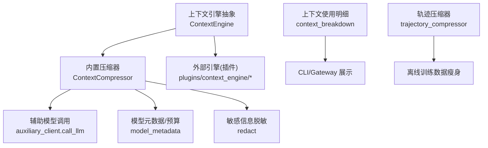
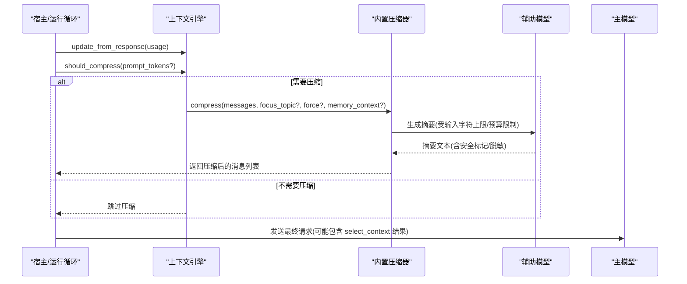
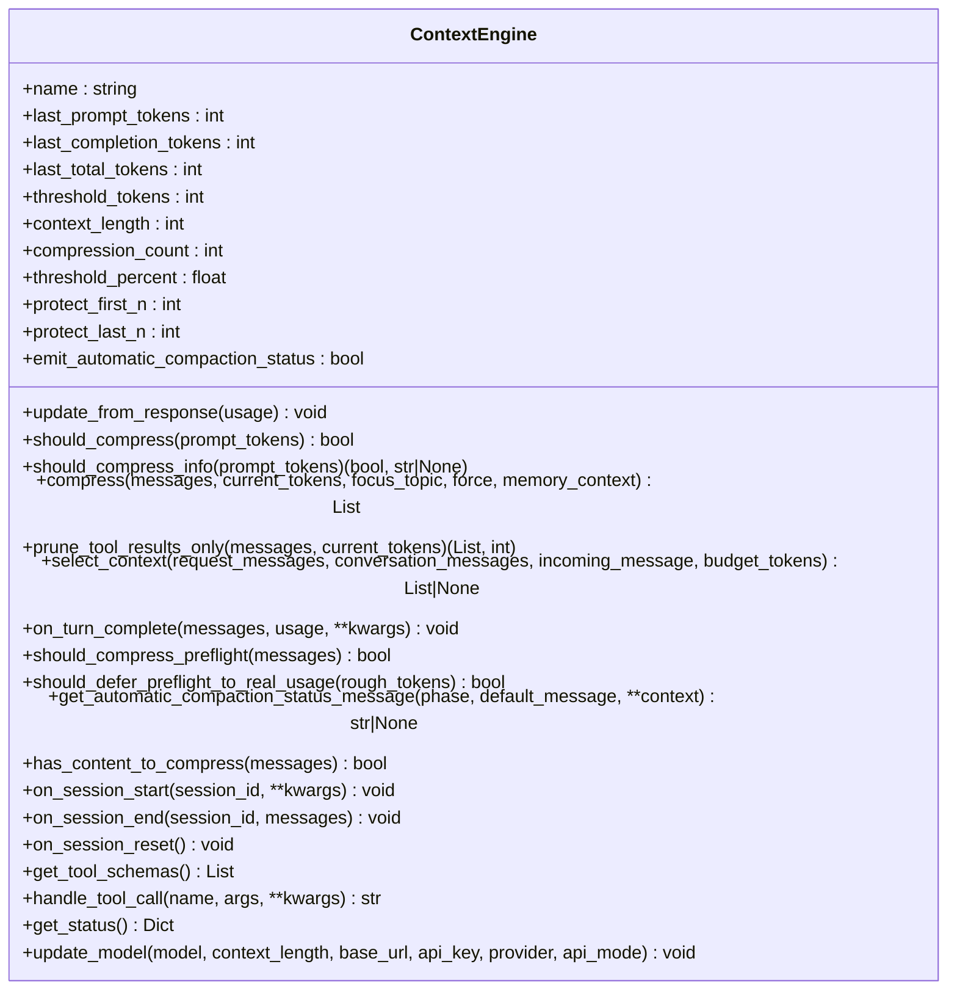
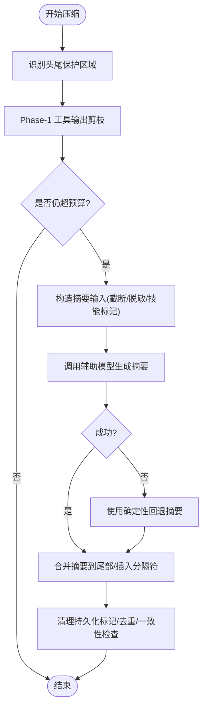
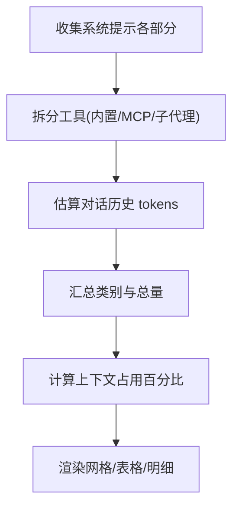
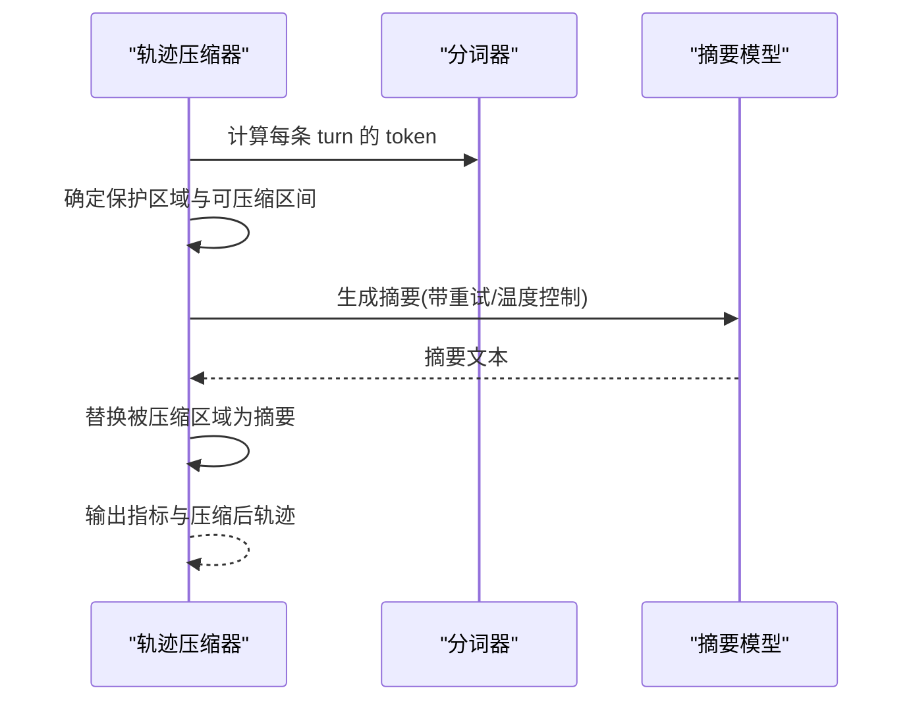
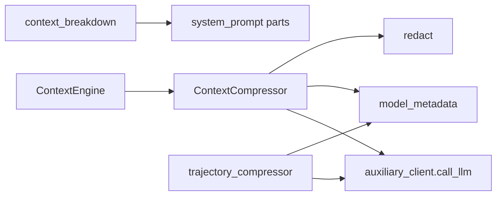

# 上下文分解与重组

<cite>
**本文引用的文件**
- [agent/context_engine.py](file://agent/context_engine.py)
- [agent/context_compressor.py](file://agent/context_compressor.py)
- [agent/context_breakdown.py](file://agent/context_breakdown.py)
- [trajectory_compressor.py](file://trajectory_compressor.py)
</cite>

## 目录
1. [简介](#简介)
2. [项目结构](#项目结构)
3. [核心组件](#核心组件)
4. [架构总览](#架构总览)
5. [详细组件分析](#详细组件分析)
6. [依赖关系分析](#依赖关系分析)
7. [性能考量](#性能考量)
8. [故障排查指南](#故障排查指南)
9. [结论](#结论)
10. [附录](#附录)

## 简介
本文件围绕“上下文分解与重组”展开，系统性说明会话上下文的分割策略、语义边界识别、内容保留原则、压缩时的信息优先级与重要性评估、片段索引与快速检索、合并去重与一致性检查、质量评估与完整性验证、性能优化，以及面向开发者的扩展点与自定义算法集成方法。文档基于仓库中的上下文引擎抽象、内置压缩器、上下文使用明细统计与轨迹后处理压缩器等实现进行解读。

## 项目结构
与上下文处理相关的核心代码集中在 agent 目录下：
- 上下文引擎抽象层：定义插件化上下文管理接口（何时触发压缩、如何压缩、可选工具、状态跟踪等）。
- 内置上下文压缩器：实现自动化的对话压缩，包含摘要生成、头尾保护、工具输出剪枝、技能指令防丢失、失败回退等。
- 上下文使用明细：对系统提示、规则、技能、MCP/子代理工具、记忆、对话历史等进行分类估算与可视化。
- 轨迹压缩器：离线对已完成轨迹进行压缩，用于训练数据瘦身与信号保留。

**图示来源**
- [agent/context_engine.py:89-490](file://agent/context_engine.py#L89-L490)
- [agent/context_compressor.py:1-180](file://agent/context_compressor.py#L1-L180)
- [agent/context_breakdown.py:89-156](file://agent/context_breakdown.py#L89-L156)
- [trajectory_compressor.py:332-412](file://trajectory_compressor.py#L332-L412)

**章节来源**
- [agent/context_engine.py:1-490](file://agent/context_engine.py#L1-L490)
- [agent/context_compressor.py:1-800](file://agent/context_compressor.py#L1-L800)
- [agent/context_breakdown.py:1-361](file://agent/context_breakdown.py#L1-L361)
- [trajectory_compressor.py:1-800](file://trajectory_compressor.py#L1-L800)

## 核心组件
- 上下文引擎抽象（ContextEngine）
  - 生命周期：on_session_start → update_from_response → should_compress → compress → on_session_end
  - 关键能力：should_compress/should_compress_info、compress、select_context（每轮选择上下文）、prune_tool_results_only（低成本剪枝）、on_turn_complete（观察完成轮次）、status/get_status、get_tool_schemas/handle_tool_call、update_model（按模型调整阈值）
- 内置上下文压缩器（ContextCompressor）
  - 头尾保护、中间区域摘要、工具输出剪枝、技能指令防丢失、失败回退、微压缩与冷却、输入字符上限、图片成本估算、小窗口阈值提升等
- 上下文使用明细（context_breakdown）
  - 将系统提示、规则、技能、MCP/子代理工具、记忆、对话历史等分类估算 token，并渲染网格/表格视图
- 轨迹压缩器（trajectory_compressor）
  - 离线压缩：保护首尾、仅压缩中间、用单条人类摘要替换被压缩区域、可配置目标 token、并发与重试、指标统计

**章节来源**
- [agent/context_engine.py:89-490](file://agent/context_engine.py#L89-L490)
- [agent/context_compressor.py:1-800](file://agent/context_compressor.py#L1-L800)
- [agent/context_breakdown.py:89-361](file://agent/context_breakdown.py#L89-L361)
- [trajectory_compressor.py:332-800](file://trajectory_compressor.py#L332-L800)

## 架构总览
上下文处理在运行时由“上下文引擎”统一调度；默认实现为内置压缩器，支持通过插件替换。压缩过程以“头尾保护 + 中间摘要”为核心，辅以低成本预剪枝与失败回退，确保会话不中断且信息不丢失。同时提供“每轮上下文选择”钩子，使引擎可在请求前动态挑选或路由上下文。

**图示来源**
- [agent/context_engine.py:131-190](file://agent/context_engine.py#L131-L190)
- [agent/context_compressor.py:100-180](file://agent/context_compressor.py#L100-L180)

## 详细组件分析

### 上下文引擎抽象（ContextEngine）
- 设计要点
  - 明确生命周期与回调顺序，避免将压缩与“每轮上下文选择”混为一谈
  - 暴露轻量级预剪枝 prune_tool_results_only，降低大窗口的重复传输成本
  - 提供 per-turn 的 select_context，允许检索/路由/分支切换而不改变持久历史
  - 提供 on_turn_complete 观察完成轮次，便于构建索引/主题/路由状态
  - 提供 get_status 和 update_model，便于监控与按模型调参
- 复杂度与影响
  - 接口稳定，插件可独立实现压缩策略，不影响宿主流程
  - 通过 should_compress_info 返回原因，便于用户可见的静默溢出告警

**图示来源**
- [agent/context_engine.py:89-490](file://agent/context_engine.py#L89-L490)

**章节来源**
- [agent/context_engine.py:89-490](file://agent/context_engine.py#L89-L490)

### 内置上下文压缩器（ContextCompressor）
- 分割与重组策略
  - 头尾保护：固定保护前 N 条非系统消息与最近若干条消息，保证任务起点与当前交互不被破坏
  - 中间摘要：对可压缩区域生成结构化摘要，采用严格的前缀/分隔符/结束标记，避免模型误读为活跃指令
  - 工具输出剪枝：先做低成本 Phase-1 剪枝，再进入 LLM 摘要，减少输入体积与超时风险
  - 技能指令防丢失：检测 skill_view 调用与结果，必要时注入“已剪枝”标记，防止“幽灵技能”误导
  - 失败回退：当摘要不可用时，使用确定性回退文本保留关键锚点，避免会话卡死
  - 小窗口优化：对小上下文窗口提高触发阈值，避免频繁无意义压缩
  - 图片成本估算：按图片估算 token 计入预算，保持预算真实
- 信息优先级与重要性评估
  - 高优先：系统提示、规则、最近用户询问、活跃工具调用/结果、技能指令（近期加载/尾部）
  - 中优先：历史任务快照、进行中状态、待办事项、剩余工作
  - 低优先：旧工具输出、长技能详情、历史对话细节
- 合并、去重与一致性
  - 摘要前缀/分隔符/结束标记确保边界清晰
  - 历史前缀兼容多版本，避免残留指令污染
  - 去重追加逻辑避免重复条目
  - 清理持久化标记，避免写入新子会话时遗漏
- 复杂度与性能
  - 输入字符上限限制摘要 prompt，避免慢后端超时
  - 微压缩连续失败计数，避免忙循环
  - 压力降级：即使受保护区域也适度降级大型已完成输出，但保留最近若干条完整消息

**图示来源**
- [agent/context_compressor.py:100-180](file://agent/context_compressor.py#L100-L180)
- [agent/context_compressor.py:417-740](file://agent/context_compressor.py#L417-L740)
- [agent/context_compressor.py:764-800](file://agent/context_compressor.py#L764-L800)

**章节来源**
- [agent/context_compressor.py:1-800](file://agent/context_compressor.py#L1-L800)

### 上下文使用明细（context_breakdown）
- 功能
  - 将系统提示、规则、技能、MCP/子代理工具、记忆、对话历史等分类估算 token
  - 计算上下文窗口占用百分比，并提供 CLI/Gateway 的网格与表格渲染
  - 支持“/context all”展开技能与工具集的成本明细
- 价值
  - 帮助开发者定位上下文膨胀来源（如工具 schema、技能索引/详情、长对话历史）
  - 与压缩阈值对齐（chars/4 启发式），便于预测压缩触发点

**图示来源**
- [agent/context_breakdown.py:89-156](file://agent/context_breakdown.py#L89-L156)
- [agent/context_breakdown.py:190-361](file://agent/context_breakdown.py#L190-L361)

**章节来源**
- [agent/context_breakdown.py:89-361](file://agent/context_breakdown.py#L89-L361)

### 轨迹压缩器（trajectory_compressor）
- 功能
  - 离线压缩已完成轨迹，保护首尾，仅压缩中间，用单条人类摘要替换被压缩区域
  - 可配置目标 token、摘要长度、并发度、重试与指标统计
  - 支持通过集中提供者路由或直连 OpenAI 客户端
- 适用场景
  - 训练数据瘦身、回放压缩、批量处理 JSONL 轨迹

**图示来源**
- [trajectory_compressor.py:332-412](file://trajectory_compressor.py#L332-L412)
- [trajectory_compressor.py:605-742](file://trajectory_compressor.py#L605-L742)
- [trajectory_compressor.py:743-800](file://trajectory_compressor.py#L743-L800)

**章节来源**
- [trajectory_compressor.py:1-800](file://trajectory_compressor.py#L1-L800)

## 依赖关系分析
- 上下文引擎与压缩器
  - 压缩器依赖辅助模型调用、模型元数据（上下文长度/阈值）、敏感信息脱敏、错误分类等
- 上下文使用明细
  - 复用系统提示构建与 prompt-size 归因机制，估算技能与工具集成本
- 轨迹压缩器
  - 可选择集中提供者路由或直接 OpenAI 客户端，具备重试与并发控制

**图示来源**
- [agent/context_engine.py:89-490](file://agent/context_engine.py#L89-L490)
- [agent/context_compressor.py:1-180](file://agent/context_compressor.py#L1-L180)
- [agent/context_breakdown.py:89-156](file://agent/context_breakdown.py#L89-L156)
- [trajectory_compressor.py:332-412](file://trajectory_compressor.py#L332-L412)

**章节来源**
- [agent/context_engine.py:89-490](file://agent/context_engine.py#L89-L490)
- [agent/context_compressor.py:1-180](file://agent/context_compressor.py#L1-L180)
- [agent/context_breakdown.py:89-156](file://agent/context_breakdown.py#L89-L156)
- [trajectory_compressor.py:332-412](file://trajectory_compressor.py#L332-L412)

## 性能考量
- 触发时机与阈值
  - 小窗口模型提高触发阈值，避免频繁压缩导致“只压缩不节省”的抖动
  - 预飞行检查与真实用量结合，避免噪声估计导致的误触发
- 输入规模控制
  - 摘要输入字符上限，防止慢后端超时
  - 工具输出剪枝与图片成本估算，降低无效负载
- 失败与冷却
  - 微压缩连续失败计数，跳过卡住交换
  - 摘要失败回退，保证会话连续性
- 资源与并发
  - 轨迹压缩支持并发与重试，适合批量离线处理
- 观测与诊断
  - 使用上下文使用明细定位膨胀来源，配合 /context all 展开技能与工具集成本

[本节为通用指导，无需特定文件引用]

## 故障排查指南
- 常见问题
  - 摘要失败或配额不足：检查认证/配额错误分类与回退路径
  - 模板角色交替错误：摘要角色需考虑模板忽略的 tool/tool_calls 行，避免 user/user 冲突
  - 技能“幽灵化”：确认技能指令被正确标记或保留，必要时重新加载
  - 小窗口频繁压缩：调整阈值或等待真实用量稳定后再触发
- 定位步骤
  - 查看上下文使用明细，识别最大消耗类别
  - 检查压缩日志与状态（last_prompt_tokens、threshold_tokens、context_length、usage_percent）
  - 对轨迹压缩，检查摘要 API 调用次数与错误数、压缩比与仍超限比例

**章节来源**
- [agent/context_compressor.py:73-95](file://agent/context_compressor.py#L73-L95)
- [agent/context_compressor.py:201-228](file://agent/context_compressor.py#L201-L228)
- [agent/context_compressor.py:417-740](file://agent/context_compressor.py#L417-L740)
- [agent/context_engine.py:435-454](file://agent/context_engine.py#L435-L454)
- [trajectory_compressor.py:605-742](file://trajectory_compressor.py#L605-L742)

## 结论
该上下文处理体系通过“引擎抽象 + 内置压缩器 + 使用明细 + 轨迹压缩”的组合，实现了运行时与离线场景下的上下文高效管理与重组。其核心在于：明确的头尾保护、可控的中间摘要、严格的边界与一致性保障、完善的失败回退与观测能力。开发者可通过扩展点接入自定义压缩策略或每轮上下文选择逻辑，满足多样化业务需求。

[本节为总结性内容，无需特定文件引用]

## 附录

### 开发者扩展点与自定义集成
- 自定义上下文引擎
  - 实现 ContextEngine 接口，覆盖 should_compress/compress/select_context/prune_tool_results_only/on_turn_complete 等
  - 通过插件目录 plugins/context_engine/<name>/ 注册，或在配置中选择 engine
- 自定义压缩策略
  - 在 compress 中实现 DAG 构建、检索增强、主题路由等
  - 利用 select_context 在请求前动态替换上下文，而不改变持久历史
- 自定义工具
  - 通过 get_tool_schemas/handle_tool_call 暴露引擎自有工具（如 lcm_grep）
- 监控与诊断
  - 使用 get_status 获取压缩计数、阈值、上下文长度与使用率
  - 结合 context_breakdown 定位上下文膨胀来源

**章节来源**
- [agent/context_engine.py:131-490](file://agent/context_engine.py#L131-L490)
- [agent/context_breakdown.py:89-361](file://agent/context_breakdown.py#L89-L361)