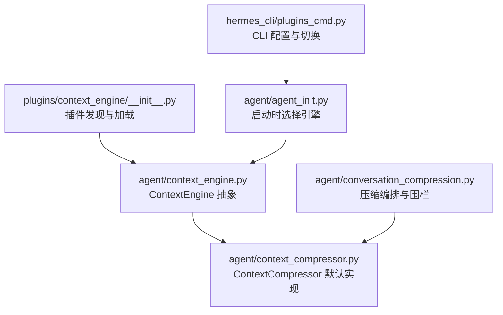
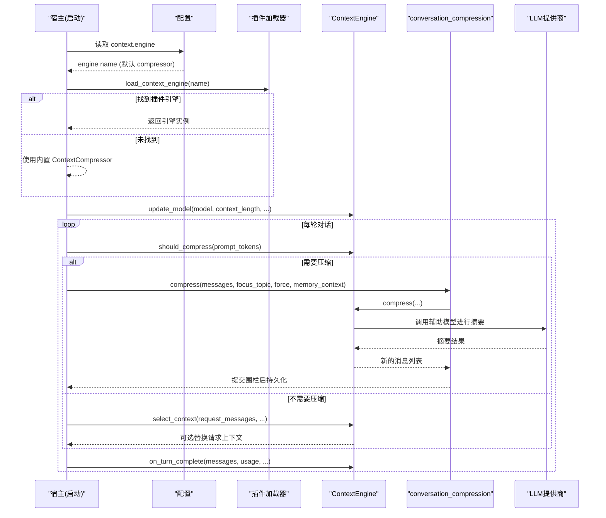
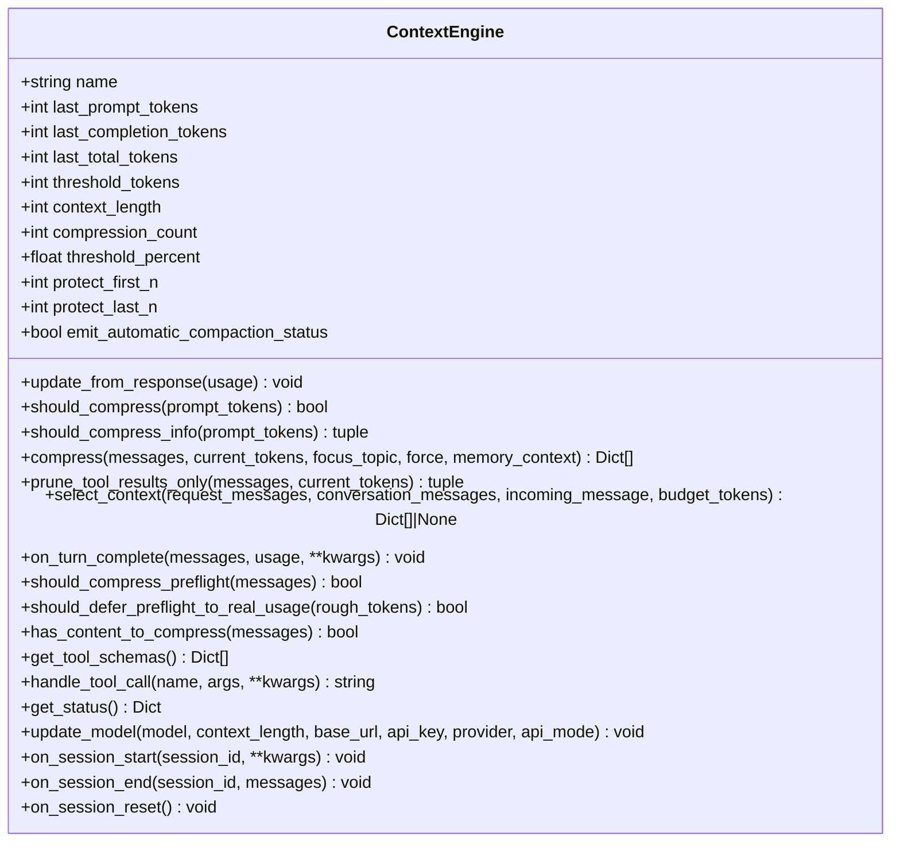
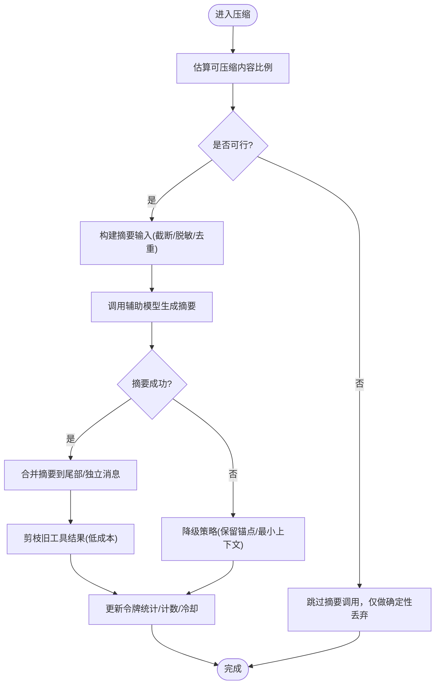
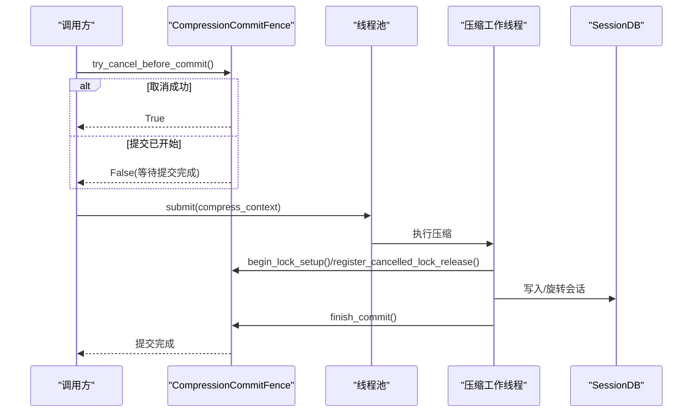
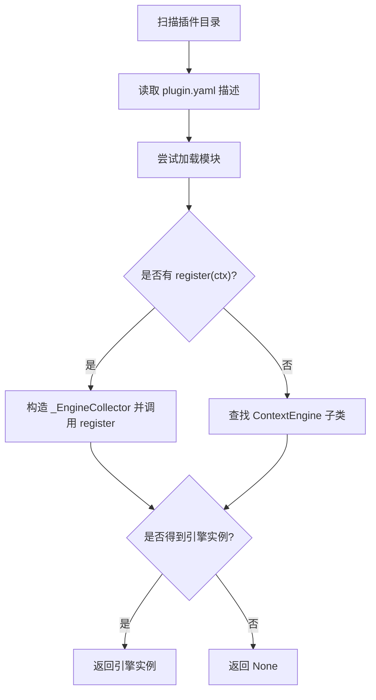
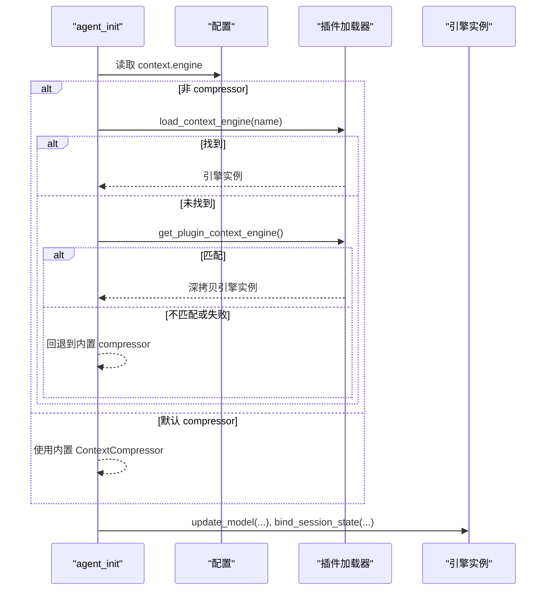
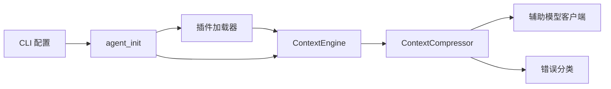

# 上下文引擎架构

<cite>
**本文引用的文件**
- [agent/context_engine.py](file://agent/context_engine.py)
- [agent/context_compressor.py](file://agent/context_compressor.py)
- [agent/conversation_compression.py](file://agent/conversation_compression.py)
- [plugins/context_engine/__init__.py](file://plugins/context_engine/__init__.py)
- [agent/agent_init.py](file://agent/agent_init.py)
- [hermes_cli/plugins_cmd.py](file://hermes_cli/plugins_cmd.py)
</cite>

## 目录
1. [简介](#简介)
2. [项目结构](#项目结构)
3. [核心组件](#核心组件)
4. [架构总览](#架构总览)
5. [详细组件分析](#详细组件分析)
6. [依赖关系分析](#依赖关系分析)
7. [性能考量](#性能考量)
8. [故障排查指南](#故障排查指南)
9. [结论](#结论)
10. [附录：自定义上下文引擎开发指南与最佳实践](#附录自定义上下文引擎开发指南与最佳实践)

## 简介
本文件系统性阐述 Hermes Agent 的“上下文引擎”抽象设计与插件化架构，覆盖以下主题：
- ContextEngine 基类的核心接口与生命周期管理
- 上下文压缩决策机制、阈值控制与保护策略
- 引擎注册机制、配置驱动的选择逻辑与多引擎支持
- 上下文状态跟踪、令牌使用统计与性能监控
- 引擎间通信、数据共享与状态同步的实现模式
- 自定义上下文引擎的开发指南与最佳实践

## 项目结构
上下文引擎相关代码主要分布在 agent 与 plugins 两个层次：
- agent/context_engine.py：定义 ContextEngine 抽象基类与通用工具（如内存上下文清洗、自动压缩状态消息）
- agent/context_compressor.py：内置默认实现 ContextCompressor，负责摘要式压缩、保护头尾、工具结果剪枝等
- agent/conversation_compression.py：编排压缩流程、超时与提交围栏、状态发布、线程安全与并发控制
- plugins/context_engine/__init__.py：插件发现与加载机制，支持按目录扫描与 register(ctx) 模式
- agent/agent_init.py：启动时根据配置选择并实例化具体引擎，注入模型参数与阈值
- hermes_cli/plugins_cmd.py：提供交互式 CLI 以查看和切换当前 context.engine

**图表来源**
- [agent/context_engine.py:89-490](file://agent/context_engine.py#L89-L490)
- [agent/context_compressor.py:1447-1600](file://agent/context_compressor.py#L1447-L1600)
- [plugins/context_engine/__init__.py:33-196](file://plugins/context_engine/__init__.py#L33-L196)
- [agent/agent_init.py:2398-2517](file://agent/agent_init.py#L2398-L2517)
- [agent/conversation_compression.py:445-691](file://agent/conversation_compression.py#L445-L691)
- [hermes_cli/plugins_cmd.py:1302-1405](file://hermes_cli/plugins_cmd.py#L1302-L1405)

**章节来源**
- [agent/context_engine.py:1-490](file://agent/context_engine.py#L1-L490)
- [plugins/context_engine/__init__.py:1-286](file://plugins/context_engine/__init__.py#L1-L286)
- [agent/agent_init.py:2398-2517](file://agent/agent_init.py#L2398-L2517)
- [hermes_cli/plugins_cmd.py:1302-1405](file://hermes_cli/plugins_cmd.py#L1302-L1405)

## 核心组件
- ContextEngine 抽象基类：定义统一接口，包括名称、令牌统计、压缩决策、压缩执行、可选的工具暴露、会话生命周期钩子、预检与状态展示等。
- ContextCompressor 默认实现：基于辅助模型的摘要压缩，具备保护头尾、工具输出剪枝、微压缩、失败冷却、反抖动等能力。
- conversation_compression 编排层：负责压缩流程调度、超时与提交围栏、并发池限制、状态发布与回滚。
- 插件发现与加载：扫描 plugins/context_engine/<name>/，支持 register(ctx) 或继承 ContextEngine 的方式注册。
- 启动选择逻辑：从配置读取 context.engine，优先尝试插件目录，再尝试通用插件系统，最后回退到内置 compressor。

**章节来源**
- [agent/context_engine.py:89-490](file://agent/context_engine.py#L89-L490)
- [agent/context_compressor.py:1-800](file://agent/context_compressor.py#L1-L800)
- [agent/conversation_compression.py:1-800](file://agent/conversation_compression.py#L1-L800)
- [plugins/context_engine/__init__.py:33-196](file://plugins/context_engine/__init__.py#L33-L196)
- [agent/agent_init.py:2398-2517](file://agent/agent_init.py#L2398-L2517)

## 架构总览
上下文引擎采用“抽象基类 + 默认实现 + 插件扩展”的分层设计：
- 抽象层：ContextEngine 定义契约，屏蔽不同压缩策略的差异
- 默认层：ContextCompressor 提供开箱即用的摘要压缩方案
- 编排层：conversation_compression 负责调用时机、超时、提交围栏与并发控制
- 插件层：通过目录扫描与动态导入，将第三方引擎接入同一接口
- 配置层：context.engine 决定激活哪个引擎；CLI 提供交互切换

**图表来源**
- [agent/agent_init.py:2398-2517](file://agent/agent_init.py#L2398-L2517)
- [plugins/context_engine/__init__.py:79-196](file://plugins/context_engine/__init__.py#L79-L196)
- [agent/context_engine.py:133-338](file://agent/context_engine.py#L133-L338)
- [agent/conversation_compression.py:445-691](file://agent/conversation_compression.py#L445-L691)

## 详细组件分析

### ContextEngine 抽象基类
- 身份与状态字段：name、last_prompt_tokens、last_completion_tokens、last_total_tokens、threshold_tokens、context_length、compression_count
- 压缩参数：threshold_percent、protect_first_n、protect_last_n、emit_automatic_compaction_status
- 核心接口：
  - update_from_response(usage)：更新令牌统计
  - should_compress(prompt_tokens)：决定是否触发压缩
  - should_compress_info(prompt_tokens)：返回是否压缩及原因
  - compress(messages, current_tokens, focus_topic, force, memory_context)：执行压缩
  - prune_tool_results_only(messages, current_tokens)：低成本剪枝旧工具结果
  - select_context(request_messages, conversation_messages, incoming_message, budget_tokens)：每轮请求前选择上下文
  - on_turn_complete(messages, usage, **kwargs)：回合结束观察
  - should_compress_preflight / should_defer_preflight_to_real_usage：预检优化
  - has_content_to_compress：/compress 命令预检
  - get_tool_schemas / handle_tool_call：暴露工具
  - get_status：状态展示
  - update_model：模型切换时的阈值与上下文长度更新
  - on_session_start / on_session_end / on_session_reset：会话生命周期

**图表来源**
- [agent/context_engine.py:89-490](file://agent/context_engine.py#L89-L490)

**章节来源**
- [agent/context_engine.py:89-490](file://agent/context_engine.py#L89-L490)

### ContextCompressor 默认实现
- 摘要压缩：使用辅助模型对中间历史进行摘要，保留头部与尾部关键信息
- 保护策略：
  - protect_first_n：固定保护前 N 条非系统消息
  - protect_last_n：保护尾部 N 条消息，避免丢失最新上下文
  - 工具结果剪枝：在 LLM 摘要之前先做低成本剪枝，减少输入大小
- 微压缩与反抖动：滚动摘要、失败冷却、防抖计数器，避免频繁压缩
- 元数据与标记：为摘要消息添加元数据键，便于前端识别与过滤
- 技能指令保护：检测即将丢失的技能指令，插入重加载提示

**图表来源**
- [agent/context_compressor.py:1-800](file://agent/context_compressor.py#L1-L800)

**章节来源**
- [agent/context_compressor.py:1-800](file://agent/context_compressor.py#L1-L800)

### 压缩编排与并发控制
- CompressionCommitFence：确保提交边界原子性，支持取消、进度追踪与锁释放
- 线程池与限流：daemon 线程池限制并发压缩任务数，防止阻塞
- 超时与总上限：idle_timeout_seconds 与 total_ceiling_seconds 控制压缩时长
- 状态发布：压缩开始/完成/重试等状态通过 status_callback 上报
- 回滚与恢复：快照与恢复压缩尝试状态，保证异常路径一致性

**图表来源**
- [agent/conversation_compression.py:445-691](file://agent/conversation_compression.py#L445-L691)

**章节来源**
- [agent/conversation_compression.py:445-691](file://agent/conversation_compression.py#L445-L691)

### 插件发现与加载
- 扫描 plugins/context_engine/<name>/ 目录，读取 plugin.yaml 描述
- 支持两种注册方式：
  - register(ctx)：通过收集器捕获 register_context_engine 与命令注册
  - 直接导出 ContextEngine 子类并实例化
- 可用性检查：尝试加载并调用 is_available()
- 冲突处理：避免与内置命令冲突

**图表来源**
- [plugins/context_engine/__init__.py:33-196](file://plugins/context_engine/__init__.py#L33-L196)

**章节来源**
- [plugins/context_engine/__init__.py:33-196](file://plugins/context_engine/__init__.py#L33-L196)

### 启动时引擎选择与配置驱动
- 读取配置 context.engine，默认 compressor
- 优先从 plugins/context_engine/<name>/ 加载
- 其次尝试通用插件系统 get_plugin_context_engine()
- 若失败则回退到内置 ContextCompressor
- 注入模型上下文长度、阈值与 per-model 阈值覆盖
- 绑定会话状态（bind_session_state），启用微压缩开关

**图表来源**
- [agent/agent_init.py:2398-2517](file://agent/agent_init.py#L2398-L2517)
- [plugins/context_engine/__init__.py:79-196](file://plugins/context_engine/__init__.py#L79-L196)

**章节来源**
- [agent/agent_init.py:2398-2517](file://agent/agent_init.py#L2398-L2517)

## 依赖关系分析
- ContextEngine 被 conversation_compression 与 agent_init 共同依赖
- ContextCompressor 作为默认实现，依赖辅助模型客户端与错误分类
- 插件加载器依赖 importlib 与 yaml，动态导入引擎模块
- CLI 提供用户界面，读写 config.yaml 中的 context.engine

**图表来源**
- [agent/context_engine.py:89-490](file://agent/context_engine.py#L89-L490)
- [agent/context_compressor.py:1-800](file://agent/context_compressor.py#L1-L800)
- [plugins/context_engine/__init__.py:33-196](file://plugins/context_engine/__init__.py#L33-L196)
- [agent/agent_init.py:2398-2517](file://agent/agent_init.py#L2398-L2517)
- [hermes_cli/plugins_cmd.py:1302-1405](file://hermes_cli/plugins_cmd.py#L1302-L1405)

**章节来源**
- [agent/context_engine.py:89-490](file://agent/context_engine.py#L89-L490)
- [agent/context_compressor.py:1-800](file://agent/context_compressor.py#L1-L800)
- [plugins/context_engine/__init__.py:33-196](file://plugins/context_engine/__init__.py#L33-L196)
- [agent/agent_init.py:2398-2517](file://agent/agent_init.py#L2398-L2517)
- [hermes_cli/plugins_cmd.py:1302-1405](file://hermes_cli/plugins_cmd.py#L1302-L1405)

## 性能考量
- 低开销剪枝：prune_tool_results_only 在不调用 LLM 的情况下回收旧工具输出，降低后续压缩压力
- 可行性跳过：当可压缩内容比例过低且近期无效压缩存在时，跳过摘要调用，避免无意义成本
- 并发限制：压缩池最大工作数为 4，避免过多任务排队导致延迟
- 超时与上限：idle_timeout_seconds 与 total_ceiling_seconds 控制压缩耗时，防止长时间阻塞
- 摘要输入上限：限制摘要输入字符数，避免慢后端上下文溢出或超时
- 失败冷却：摘要失败冷却时间避免反复重试造成雪崩

[本节为通用指导，无需特定文件引用]

## 故障排查指南
- 压缩被阻止：当上下文超过阈值但压缩被冷却或反抖动阻止时，会发出可见警告，建议 /new 或 /compress 重试
- 摘要失败：记录错误类型（认证、配额、网络），并在冷却期内避免重复调用
- 提交围栏卡住：若 SessionDB 写入挂起，fence 会等待并提交完成后释放；主机侧可观测 commit_in_flight 并告警
- 插件加载失败：检查插件目录结构与 __init__.py，确认是否存在 register(ctx) 或 ContextEngine 子类
- 配置未生效：确认 context.engine 值与已安装插件名一致，必要时通过 CLI 重新选择

**章节来源**
- [agent/conversation_compression.py:150-180](file://agent/conversation_compression.py#L150-L180)
- [agent/context_compressor.py:73-95](file://agent/context_compressor.py#L73-L95)
- [agent/conversation_compression.py:445-691](file://agent/conversation_compression.py#L445-L691)
- [plugins/context_engine/__init__.py:79-196](file://plugins/context_engine/__init__.py#L79-L196)

## 结论
上下文引擎通过清晰的抽象与插件化机制，实现了灵活可扩展的上下文管理策略。默认实现提供稳健的摘要压缩与保护策略，编排层确保高可用与可观测性，插件体系允许第三方引擎无缝接入。配置驱动与 CLI 支持使得引擎切换与维护便捷高效。

[本节为总结，无需特定文件引用]

## 附录：自定义上下文引擎开发指南与最佳实践
- 实现 ContextEngine 抽象类：至少实现 name、update_from_response、should_compress、compress
- 可选增强：
  - 实现 select_context 实现每轮上下文选择（检索、路由、角色/分支切换）
  - 实现 on_turn_complete 进行索引、摘要或路由状态更新
  - 实现 prune_tool_results_only 提供低成本剪枝
  - 实现 get_tool_schemas/handle_tool_call 暴露工具（如 lcm_grep）
  - 实现 get_automatic_compaction_status_message 定制用户可见状态
- 插件目录结构：
  - 在 plugins/context_engine/<your_engine>/__init__.py 中实现引擎
  - 可选择提供 plugin.yaml 描述信息
  - 支持 register(ctx) 模式或导出 ContextEngine 子类
- 配置与选择：
  - 在 config.yaml 设置 context.engine = "<your_engine>"
  - 或通过 CLI 交互选择
- 状态与监控：
  - 维护 last_prompt_tokens、last_completion_tokens、last_total_tokens、threshold_tokens、context_length、compression_count
  - 通过 get_status 提供状态字典供 UI/日志消费
- 线程安全与并发：
  - 压缩过程可能在独立线程运行，确保引擎内部状态线程安全
  - 避免持有不可深拷贝的资源（锁、连接），如需则实现 __deepcopy__
- 最佳实践：
  - 保持 should_compress 判断轻量，复杂逻辑放在 compress 或 select_context
  - 合理使用 protect_first_n/protect_last_n 保护关键上下文
  - 对摘要输入进行脱敏与截断，避免敏感信息泄露与超大输入
  - 处理失败与冷却，避免频繁重试导致资源耗尽
  - 通过 on_session_start/on_session_end/on_session_reset 管理会话级资源

**章节来源**
- [agent/context_engine.py:89-490](file://agent/context_engine.py#L89-L490)
- [plugins/context_engine/__init__.py:33-196](file://plugins/context_engine/__init__.py#L33-L196)
- [agent/agent_init.py:2398-2517](file://agent/agent_init.py#L2398-L2517)
- [hermes_cli/plugins_cmd.py:1302-1405](file://hermes_cli/plugins_cmd.py#L1302-L1405)