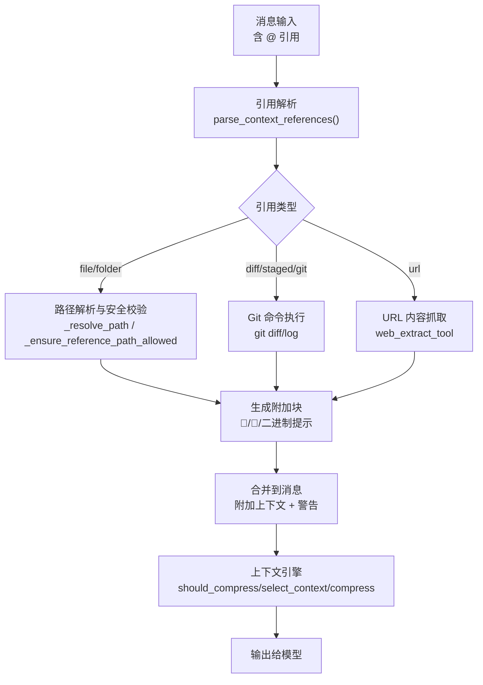
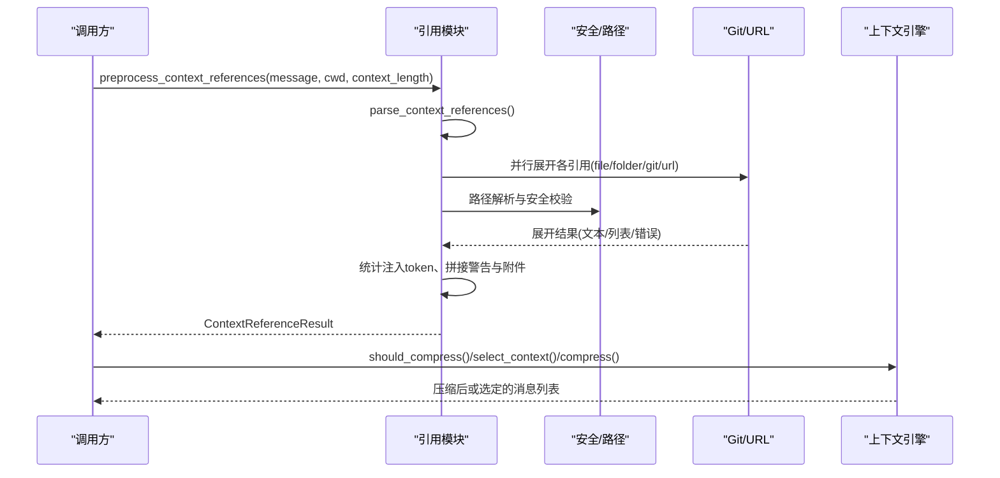
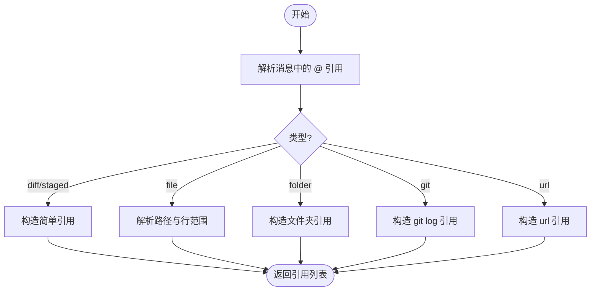
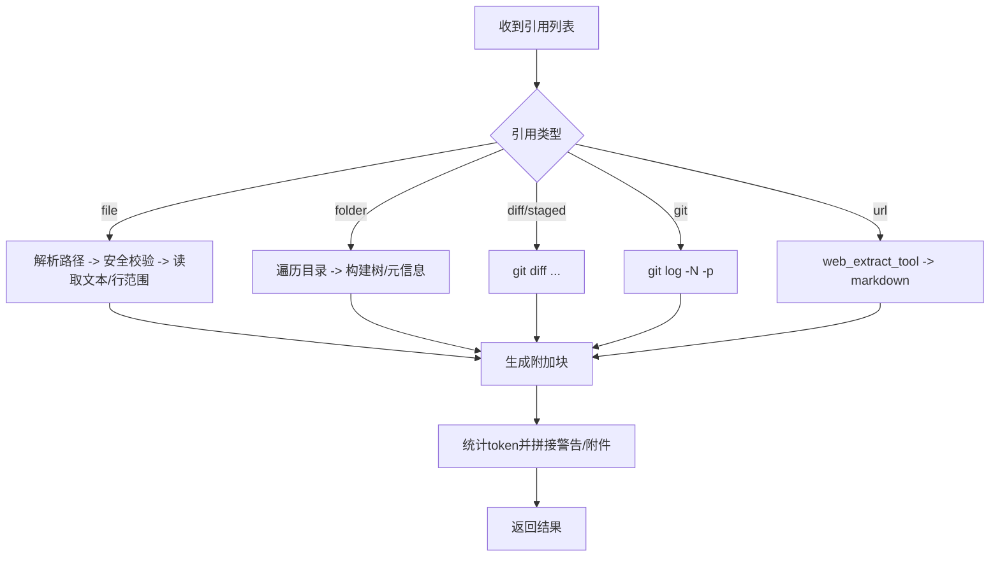
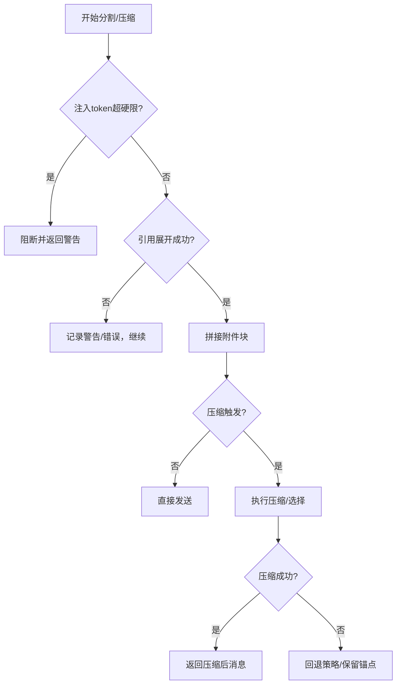
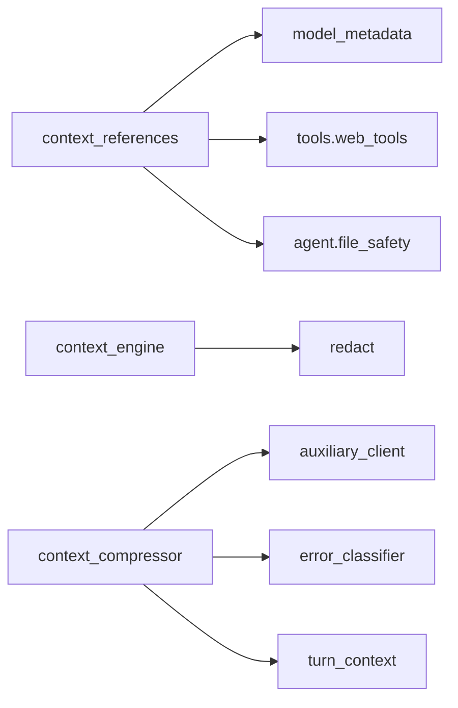

# 上下文引用管理

<cite>
**本文引用的文件**
- [agent/context_references.py](file://agent/context_references.py)
- [agent/context_engine.py](file://agent/context_engine.py)
- [agent/context_compressor.py](file://agent/context_compressor.py)
- [agent/delegation_context.py](file://agent/delegation_context.py)
- [tests/agent/test_context_references.py](file://tests/agent/test_context_references.py)
</cite>

## 目录
1. [简介](#简介)
2. [项目结构](#项目结构)
3. [核心组件](#核心组件)
4. [架构总览](#架构总览)
5. [详细组件分析](#详细组件分析)
6. [依赖关系分析](#依赖关系分析)
7. [性能考量](#性能考量)
8. [故障排查指南](#故障排查指南)
9. [结论](#结论)
10. [附录](#附录)

## 简介
本文件系统性说明“上下文引用管理”的机制与实现，覆盖以下主题：
- 上下文引用的创建、维护与解析
- 引用类型系统与引用关系图
- 依赖追踪与完整性保证（尤其在上下文分割时）
- 引用缓存策略、版本控制与冲突解决
- 引用查询接口、过滤机制与搜索能力
- 引用损坏检测、修复机制与恢复策略
- 面向开发者的扩展与自定义处理指导

该子系统由“引用解析与展开”和“上下文引擎压缩/选择”两部分组成：前者负责将消息中的 @ 引用识别并安全地展开为可注入的文本块；后者在对话接近模型上下文上限时进行压缩或按轮次选择上下文，确保长期会话稳定运行。

## 项目结构
围绕上下文引用管理的代码主要分布在 agent 目录下：
- 上下文引用解析与展开：agent/context_references.py
- 上下文引擎抽象与默认行为：agent/context_engine.py
- 内置上下文压缩器（滚动摘要、工具结果裁剪等）：agent/context_compressor.py
- 委托子进程/非调度器上下文隔离（影响路径可见性与环境）：agent/delegation_context.py
- 针对引用模块的测试用例：tests/agent/test_context_references.py

**图表来源**
- [agent/context_references.py:80-236](file://agent/context_references.py#L80-L236)
- [agent/context_engine.py:133-279](file://agent/context_engine.py#L133-L279)

**章节来源**
- [agent/context_references.py:1-622](file://agent/context_references.py#L1-L622)
- [agent/context_engine.py:1-490](file://agent/context_engine.py#L1-L490)

## 核心组件
- 引用数据模型与解析
  - ContextReference：描述一个引用（原始片段、类型、目标、位置、行范围）。
  - ContextReferenceResult：返回展开结果（最终消息、原始消息、引用列表、警告、注入 token 数、是否展开/被阻断）。
  - parse_context_references：基于正则从消息中提取所有 @ 引用，支持简单类型（diff/staged）与带类型的 file/folder/git/url。
- 引用展开与安全检查
  - preprocess_context_references / preprocess_context_references_async：并发展开多个引用，统计注入 token，应用软/硬限制，追加警告与附件块。
  - 文件/文件夹展开：读取文本或构建目录树，二进制文件以提示块形式给出容器内可见路径。
  - Git 展开：执行 git diff/log，超时或失败则返回错误信息。
  - URL 展开：通过 web_extract_tool 获取 markdown 内容。
  - 路径安全：强制工作区锚定、敏感目录/文件拒绝、调用统一读拒绝名单，异常时关闭式拒绝。
- 上下文引擎
  - ContextEngine：定义压缩触发、压缩、每轮上下文选择、工具暴露、状态更新等钩子。
  - ContextCompressor：内置压缩器，提供滚动摘要、工具结果裁剪、保护头尾、失败回退、技能指令防幽灵等。
- 委托上下文隔离
  - delegation_context：在子任务或非调度器上下文中隔离 Kanban 环境变量，避免误用全局状态。

**章节来源**
- [agent/context_references.py:43-236](file://agent/context_references.py#L43-L236)
- [agent/context_engine.py:89-490](file://agent/context_engine.py#L89-L490)
- [agent/context_compressor.py:1-800](file://agent/context_compressor.py#L1-L800)
- [agent/delegation_context.py:1-162](file://agent/delegation_context.py#L1-L162)

## 架构总览
上下文引用管理采用“解析-展开-注入-压缩/选择”的分层架构：
- 解析层：从用户消息中抽取 @ 引用，形成结构化对象。
- 展开层：按类型执行资源读取/命令执行/网络抓取，并进行严格的安全检查。
- 注入层：将展开结果作为“附加上下文”追加到消息末尾，同时记录警告与 token 用量。
- 压缩/选择层：根据上下文长度与阈值决定是否压缩，或在每轮请求前选择合适上下文。

**图表来源**
- [agent/context_references.py:123-236](file://agent/context_references.py#L123-L236)
- [agent/context_engine.py:133-279](file://agent/context_engine.py#L133-L279)

## 详细组件分析

### 引用解析与类型系统
- 支持的引用类型
  - 简单类型：@diff、@staged（直接取差异或暂存区）
  - 文件：@file:"path[:line_start[-line_end]]"
  - 文件夹：@folder:"path"
  - Git：@git:N（最近 N 条日志）
  - URL：@url:"https://..."
- 解析规则
  - 使用正则匹配 @ 开头的引用，自动剥离尾部标点与引号包裹。
  - 文件引用支持行范围语法，便于精确注入片段。
- 复杂度
  - 解析时间 O(n)，n 为消息长度；引用数量通常较小。

**图表来源**
- [agent/context_references.py:18-120](file://agent/context_references.py#L18-L120)

**章节来源**
- [agent/context_references.py:18-120](file://agent/context_references.py#L18-L120)
- [tests/agent/test_context_references.py:57-73](file://tests/agent/test_context_references.py#L57-L73)

### 引用展开流程与安全边界
- 并发展开
  - 对每个引用独立展开，使用 asyncio.gather 保持顺序并提升吞吐。
- 安全边界
  - 路径必须位于 allowed_root 下（默认 cwd），防止逃逸。
  - 拒绝敏感目录/文件（如 .ssh、.aws、.hermes 内部路径等），并复用统一的读拒绝名单。
  - 若安全校验失败，采用“关闭式拒绝”，不泄露任何敏感内容。
- 二进制文件处理
  - 不直接内联二进制内容，而是返回包含 MIME、大小与容器内可见路径的提示块，引导工具链处理。
- URL 抓取
  - 通过 web_extract_tool 获取 markdown，失败时返回空内容并提示无提取结果。

**图表来源**
- [agent/context_references.py:150-236](file://agent/context_references.py#L150-L236)
- [agent/context_references.py:239-370](file://agent/context_references.py#L239-L370)
- [agent/context_references.py:372-434](file://agent/context_references.py#L372-L434)
- [agent/context_references.py:481-604](file://agent/context_references.py#L481-L604)

**章节来源**
- [agent/context_references.py:150-434](file://agent/context_references.py#L150-L434)
- [agent/context_references.py:481-604](file://agent/context_references.py#L481-L604)
- [tests/agent/test_context_references.py:81-176](file://tests/agent/test_context_references.py#L81-L176)
- [tests/agent/test_context_references.py:193-281](file://tests/agent/test_context_references.py#L193-L281)

### 上下文分割时的完整性保证与断链处理
- 完整性保证
  - 路径锚定与拒绝名单确保不会意外读取敏感内容。
  - 注入 token 有软/硬限制，超过硬限直接阻断并返回警告。
  - 二进制文件以“可操作提示”替代内联，避免丢失上下文但也不污染提示。
- 断链处理
  - 文件不存在、路径非法、git 命令失败、URL 抓取失败均返回明确警告，不中断整体流程。
  - 安全校验异常时“关闭式拒绝”，避免潜在漏洞。
- 压缩阶段的连续性
  - 压缩器维护历史摘要与微压缩标记，确保跨轮次连续性。
  - 当压缩失败或不可用时，采用回退策略保留关键锚点。

**图表来源**
- [agent/context_references.py:196-236](file://agent/context_references.py#L196-L236)
- [agent/context_engine.py:133-279](file://agent/context_engine.py#L133-L279)
- [agent/context_compressor.py:100-180](file://agent/context_compressor.py#L100-L180)

**章节来源**
- [agent/context_references.py:196-236](file://agent/context_references.py#L196-L236)
- [agent/context_engine.py:133-279](file://agent/context_engine.py#L133-L279)
- [agent/context_compressor.py:100-180](file://agent/context_compressor.py#L100-L180)

### 引用缓存策略、版本控制与冲突解决
- 缓存策略
  - 当前实现未引入显式引用缓存；URL 抓取与 git 命令每次执行。
  - 可通过外部缓存层（如 LRU 缓存 URL 结果、git 输出缓存）优化重复引用场景。
- 版本控制
  - 文件/文件夹引用基于文件系统快照；Git 引用基于仓库状态。
  - 建议在调用侧传入稳定的 allowed_root 与 cwd，避免跨版本漂移。
- 冲突解决
  - 多引用展开顺序固定，警告与附件按原引用顺序拼接。
  - 若同一文件多次引用，各自独立展开；如需去重，可在上层聚合。

[本节为通用建议，不直接分析具体文件]

### 引用查询接口、过滤机制与搜索功能
- 查询接口
  - parse_context_references：返回引用列表，可用于前端渲染或二次处理。
  - preprocess_context_references：返回完整结果（消息、警告、注入 token、是否展开/阻断）。
- 过滤机制
  - 安全过滤：路径必须在允许范围内，且不在敏感目录/文件中。
  - 类型过滤：可按 kind 筛选（file/folder/git/url/diff/staged）。
- 搜索能力
  - 当前模块不提供全文检索；可在上层结合搜索引擎（如 fts5）对已展开内容进行索引与检索。

**章节来源**
- [agent/context_references.py:80-120](file://agent/context_references.py#L80-L120)
- [agent/context_references.py:123-236](file://agent/context_references.py#L123-L236)

### 引用损坏检测、修复机制与恢复策略
- 损坏检测
  - 文件不存在、路径非法、git 命令失败、URL 抓取失败均产生警告。
  - 安全校验异常时拒绝并告警。
- 修复机制
  - 二进制文件以“容器内可见路径”提示，引导工具链正确读取。
  - 目录列举失败时回退到 os.walk。
- 恢复策略
  - 即使部分引用失败，整体流程继续；最终消息包含警告，便于上层决策。
  - 压缩阶段失败时，回退策略保留关键锚点，避免会话中断。

**章节来源**
- [agent/context_references.py:239-370](file://agent/context_references.py#L239-L370)
- [agent/context_references.py:481-604](file://agent/context_references.py#L481-L604)
- [agent/context_compressor.py:100-180](file://agent/context_compressor.py#L100-L180)

### 开发者扩展与自定义处理指导
- 扩展引用类型
  - 在 _expand_reference 中添加新分支，实现对应展开逻辑。
  - 注意路径安全校验与 token 估算。
- 自定义 URL 抓取
  - 通过 url_fetcher 参数注入自定义抓取函数，支持同步/异步。
- 自定义安全策略
  - 扩展 _ensure_reference_path_allowed，增加更多拒绝规则。
- 集成上下文引擎
  - 实现 ContextEngine 接口，提供 select_context/compress 等钩子。
  - 利用 on_turn_complete 观察已完成轮次，更新路由/索引。
- 委托上下文隔离
  - 在子任务中使用 delegated_child_context/non_dispatcher_owned_context 隔离环境，避免污染父进程。

**章节来源**
- [agent/context_references.py:239-370](file://agent/context_references.py#L239-L370)
- [agent/context_engine.py:133-490](file://agent/context_engine.py#L133-L490)
- [agent/delegation_context.py:48-162](file://agent/delegation_context.py#L48-L162)

## 依赖关系分析
- 模块内依赖
  - context_references 依赖 model_metadata（token 估算）、tools.web_tools（URL 抓取）、agent.file_safety（读拒绝名单）。
  - context_engine 依赖 redact（敏感信息脱敏）、model_metadata（上下文长度）。
  - context_compressor 依赖 auxiliary_client（辅助模型调用）、error_classifier（错误分类）、turn_context（清理过期内容）。
- 外部依赖
  - git 命令、rg（可选，用于快速列举目录）、web_extract_tool。
- 耦合与内聚
  - 引用模块高内聚：解析、展开、安全、注入集中在单一模块。
  - 上下文引擎解耦：通过抽象接口替换实现，便于插件化。

**图表来源**
- [agent/context_references.py:14-16](file://agent/context_references.py#L14-L16)
- [agent/context_references.py:348-370](file://agent/context_references.py#L348-L370)
- [agent/context_engine.py:31-37](file://agent/context_engine.py#L31-L37)
- [agent/context_compressor.py:28-44](file://agent/context_compressor.py#L28-L44)

**章节来源**
- [agent/context_references.py:14-16](file://agent/context_references.py#L14-L16)
- [agent/context_engine.py:31-37](file://agent/context_engine.py#L31-L37)
- [agent/context_compressor.py:28-44](file://agent/context_compressor.py#L28-L44)

## 性能考量
- 并发展开：使用 asyncio.gather 并行处理多个引用，减少串行等待。
- Token 预算：注入 token 超过软/硬限时发出警告或阻断，避免上下文爆炸。
- 目录列举：优先使用 rg 快速列举，失败时回退到 os.walk。
- 压缩效率：压缩器采用滚动摘要与工具结果裁剪，降低重复传输成本。
- 建议
  - 对高频 URL 添加缓存层。
  - 对大目录列举设置合理 limit。
  - 监控注入 token 趋势，调整上下文长度阈值。

[本节为通用建议，不直接分析具体文件]

## 故障排查指南
- 常见问题
  - 文件不存在：检查路径与工作区根，确认 allowed_root 配置。
  - 权限不足：检查 rg/git 命令是否可用，必要时回退。
  - 敏感文件被拒绝：确认路径不在拒绝名单，或调整 allowed_root。
  - URL 抓取失败：检查网络与 web_extract_tool 可用性。
- 定位方法
  - 查看 ContextReferenceResult.warnings 与 injected_tokens。
  - 检查 expand_reference 返回的错误信息。
  - 验证路径安全校验逻辑。
- 恢复步骤
  - 修正路径或权限。
  - 调整上下文长度阈值。
  - 启用/禁用特定引用类型。

**章节来源**
- [agent/context_references.py:196-236](file://agent/context_references.py#L196-L236)
- [agent/context_references.py:239-370](file://agent/context_references.py#L239-L370)
- [tests/agent/test_context_references.py:110-176](file://tests/agent/test_context_references.py#L110-L176)

## 结论
上下文引用管理通过严格的解析、安全校验与灵活的展开机制，实现了安全、可控的上下文注入。结合上下文引擎的压缩与选择能力，系统在长会话中保持稳定与高效。未来可通过缓存、更精细的过滤与更强的搜索能力进一步提升体验。

[本节为总结性内容，不直接分析具体文件]

## 附录
- 参考实现路径
  - 引用解析与展开：[agent/context_references.py:80-236](file://agent/context_references.py#L80-L236)
  - 上下文引擎接口：[agent/context_engine.py:133-279](file://agent/context_engine.py#L133-L279)
  - 内置压缩器：[agent/context_compressor.py:100-180](file://agent/context_compressor.py#L100-L180)
  - 委托上下文隔离：[agent/delegation_context.py:48-162](file://agent/delegation_context.py#L48-L162)
  - 测试用例：[tests/agent/test_context_references.py:57-281](file://tests/agent/test_context_references.py#L57-L281)