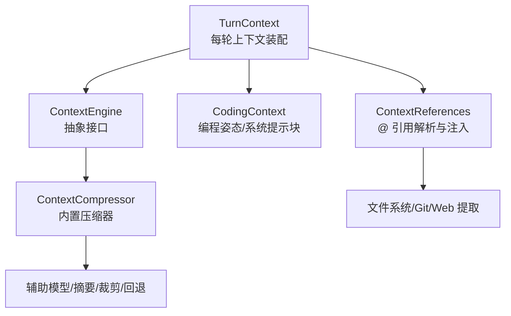
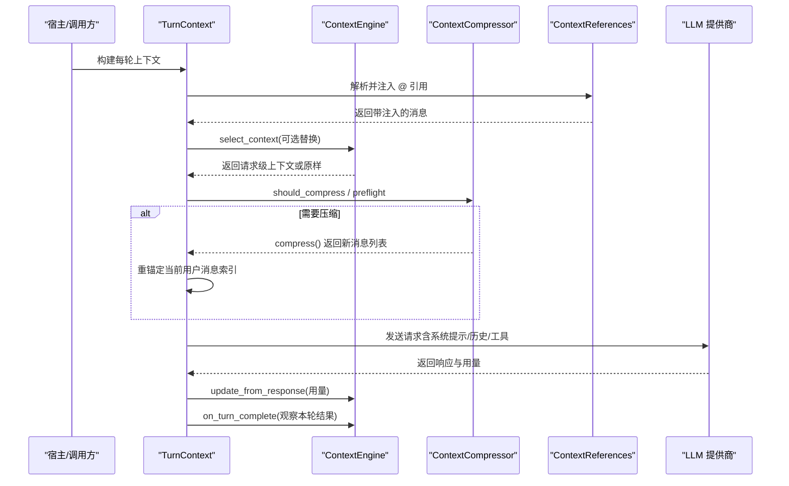
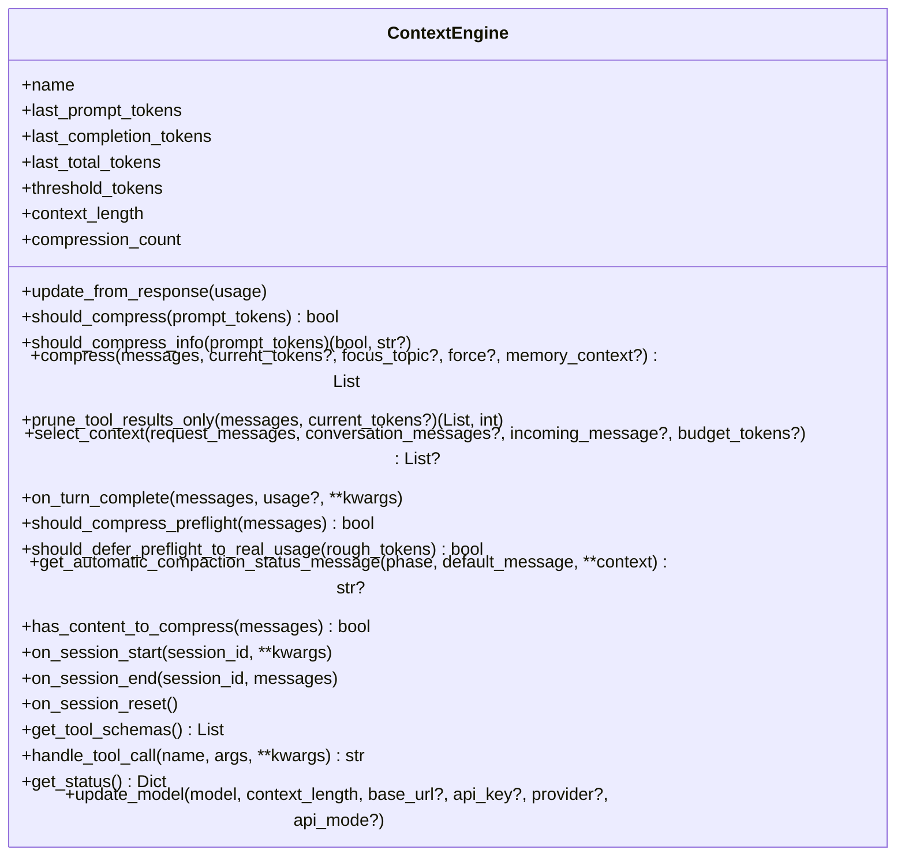
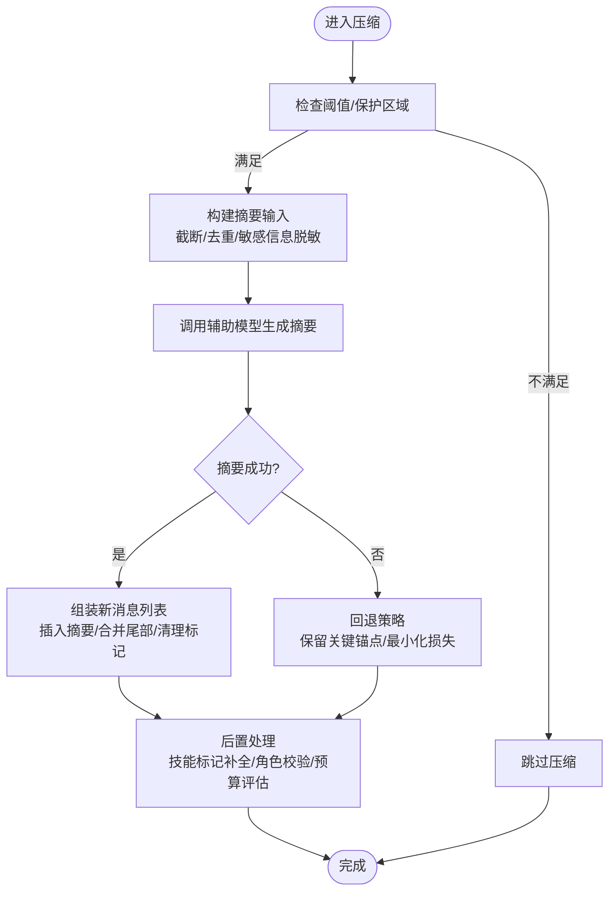
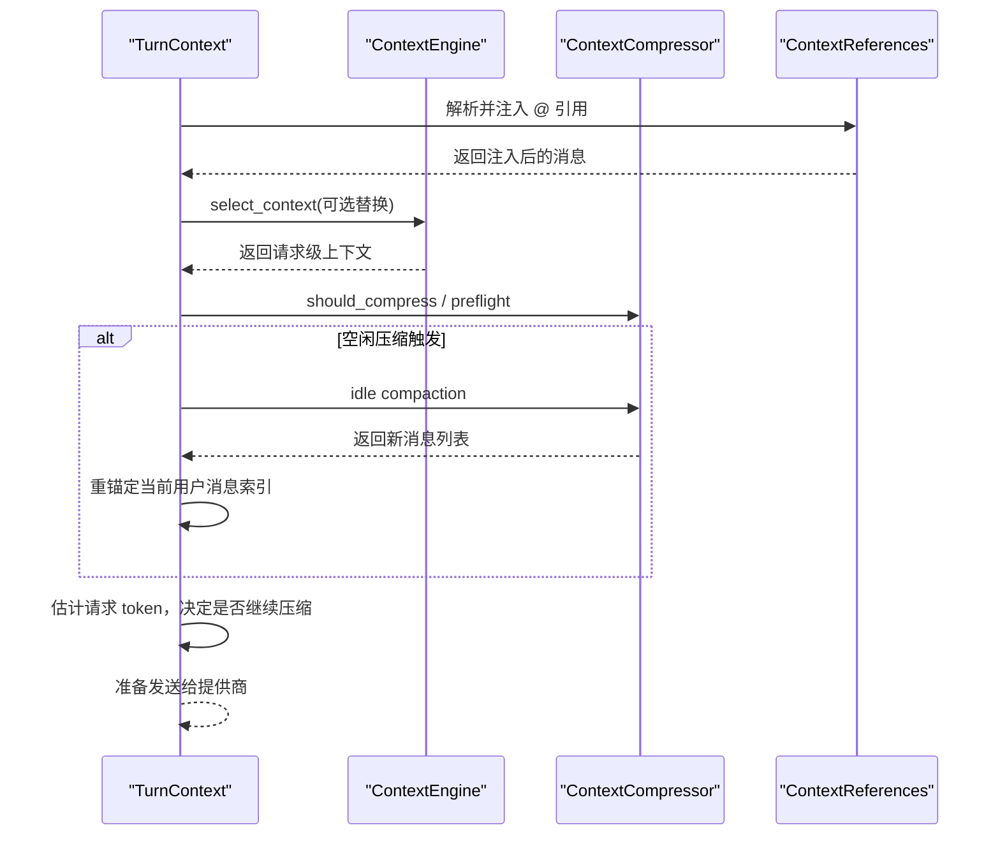
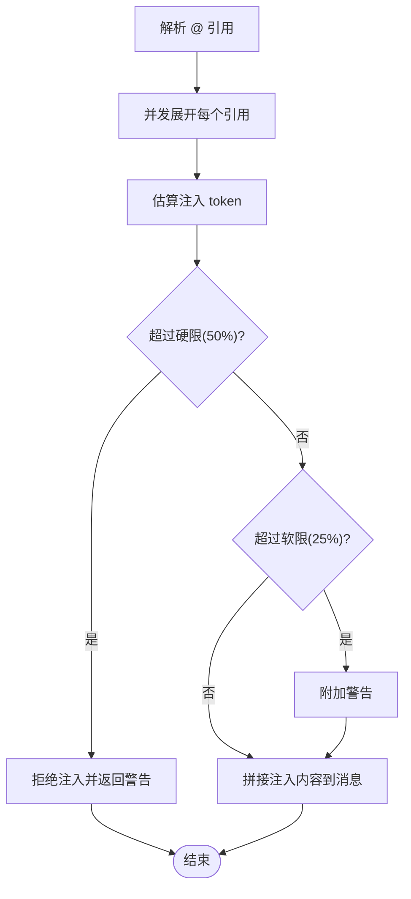
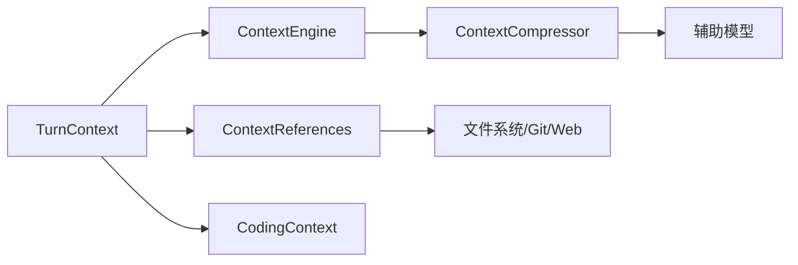

# 上下文管理

<cite>
**本文引用的文件**
- [agent/context_engine.py](file://agent/context_engine.py)
- [agent/context_compressor.py](file://agent/context_compressor.py)
- [agent/turn_context.py](file://agent/turn_context.py)
- [agent/coding_context.py](file://agent/coding_context.py)
- [agent/context_references.py](file://agent/context_references.py)
</cite>

## 目录
1. [简介](#简介)
2. [项目结构](#项目结构)
3. [核心组件](#核心组件)
4. [架构总览](#架构总览)
5. [详细组件分析](#详细组件分析)
6. [依赖关系分析](#依赖关系分析)
7. [性能与内存优化](#性能与内存优化)
8. [故障排查指南](#故障排查指南)
9. [结论](#结论)
10. [附录：扩展与自定义开发指南](#附录：扩展与自定义开发指南)

## 简介
本文件系统性梳理 Hermes Agent 的“上下文管理系统”，覆盖上下文生命周期、构建与缓存、引用注入与过滤、压缩（分割/合并/重组）、版本与一致性、查询与搜索、损坏检测与恢复，以及面向开发者的扩展点。目标是帮助读者在不深入源码的情况下理解系统如何工作，并指导二次开发与调优。

## 项目结构
围绕上下文管理的核心模块如下：
- 上下文引擎抽象与生命周期：定义统一接口、触发时机、状态上报、工具暴露等。
- 内置压缩器：实现自动压缩、摘要生成、工具输出裁剪、技能信息保护、失败回退等。
- 每轮上下文装配：负责系统提示、预检压缩、空闲压缩、用户消息注入、索引重锚定等。
- 编码上下文模式：决定会话是否处于“编程姿态”，影响系统提示块、工具集与能力展示。
- 上下文引用注入：解析 @file/@folder/@git/@url 等引用，安全展开并注入到当前请求。

图表来源
- [agent/turn_context.py:343-800](file://agent/turn_context.py#L343-L800)
- [agent/context_engine.py:89-490](file://agent/context_engine.py#L89-L490)
- [agent/context_compressor.py:1-800](file://agent/context_compressor.py#L1-L800)
- [agent/coding_context.py:268-616](file://agent/coding_context.py#L268-L616)
- [agent/context_references.py:80-237](file://agent/context_references.py#L80-L237)

章节来源
- [agent/context_engine.py:89-490](file://agent/context_engine.py#L89-L490)
- [agent/context_compressor.py:1-800](file://agent/context_compressor.py#L1-L800)
- [agent/turn_context.py:343-800](file://agent/turn_context.py#L343-L800)
- [agent/coding_context.py:268-616](file://agent/coding_context.py#L268-L616)
- [agent/context_references.py:80-237](file://agent/context_references.py#L80-L237)

## 核心组件
- 上下文引擎（ContextEngine）
  - 职责：决定何时压缩、执行压缩、可选提供工具、跟踪 token 用量、暴露状态。
  - 关键方法：update_from_response、should_compress、compress、select_context、on_turn_complete、get_status、update_model 等。
  - 生命周期：session_start → 每次响应更新 → 每轮判断压缩 → 必要时压缩 → session_end。
- 内置压缩器（ContextCompressor）
  - 职责：在接近模型上下文上限时，对历史进行摘要、裁剪工具输出、保护头尾、维护滚动摘要、失败回退、技能信息防丢失等。
  - 关键策略：阈值触发、保护首尾、摘要预算比例、输入字符上限、冷却与反抖动、微压缩失败保护、持久化标记清理等。
- 每轮上下文装配（TurnContext）
  - 职责：组装系统提示、预检压缩、空闲压缩、用户消息注入、索引重锚定、压缩进度判定、再次预检决策。
- 编码上下文（CodingContext）
  - 职责：根据平台与工作区判断是否进入“编程姿态”，注入稳定系统提示块、控制工具集与技能类别展示。
- 上下文引用（ContextReferences）
  - 职责：解析 @file/@folder/@git/@url 等引用，安全展开并注入到当前请求；包含路径白名单/黑名单、大小限制、并发展开、警告与阻断。

章节来源
- [agent/context_engine.py:89-490](file://agent/context_engine.py#L89-L490)
- [agent/context_compressor.py:1-800](file://agent/context_compressor.py#L1-L800)
- [agent/turn_context.py:343-800](file://agent/turn_context.py#L343-L800)
- [agent/coding_context.py:268-616](file://agent/coding_context.py#L268-L616)
- [agent/context_references.py:80-237](file://agent/context_references.py#L80-L237)

## 架构总览
下图展示了从一轮请求开始到上下文选择、压缩、注入与最终发送的关键流程。

图表来源
- [agent/turn_context.py:343-800](file://agent/turn_context.py#L343-L800)
- [agent/context_engine.py:133-329](file://agent/context_engine.py#L133-L329)
- [agent/context_compressor.py:1-800](file://agent/context_compressor.py#L1-L800)
- [agent/context_references.py:123-237](file://agent/context_references.py#L123-L237)

## 详细组件分析

### 上下文引擎（ContextEngine）
- 设计要点
  - 统一抽象：所有上下文处理策略通过同一接口接入，便于插件化替换。
  - 生命周期钩子：session_start/end/reset、每轮 update、压缩前/后、工具调用、状态查询。
  - 选择与压缩分离：select_context 用于“按轮次选择上下文”，compress 用于“缩小上下文”。
- 关键行为
  - 用量更新：update_from_response 接收标准化用量字段，兼容新旧键名。
  - 压缩决策：should_compress 与 should_compress_info 提供可解释原因。
  - 压缩入口：compress 接收完整消息列表，返回满足预算的新列表。
  - 轻量裁剪：prune_tool_results_only 可在不调用 LLM 的前提下回收旧工具输出。
  - 状态与模型切换：get_status、update_model 支持运行时监控与模型切换时的阈值重算。

图表来源
- [agent/context_engine.py:89-490](file://agent/context_engine.py#L89-L490)

章节来源
- [agent/context_engine.py:89-490](file://agent/context_engine.py#L89-L490)

### 内置压缩器（ContextCompressor）
- 设计要点
  - 自动压缩：基于阈值与保护区域，对中间历史进行摘要，保留头部与尾部关键信息。
  - 摘要质量：结构化模板、任务快照、历史段落、结束边界、避免误激活指令。
  - 资源保护：工具输出裁剪、技能信息防丢失（幽灵技能防护）、图片估算成本。
  - 鲁棒性：失败冷却、回退摘要、输入字符上限、持久化标记清理、角色交替修复。
- 关键流程（压缩主流程）

图表来源
- [agent/context_compressor.py:1-800](file://agent/context_compressor.py#L1-L800)

章节来源
- [agent/context_compressor.py:1-800](file://agent/context_compressor.py#L1-L800)

### 每轮上下文装配（TurnContext）
- 职责
  - 系统提示恢复/构建、DB 会话行创建、MCP 工具刷新、用户消息注入、预检压缩、空闲压缩、索引重锚定、压缩进度判定。
- 关键流程（预检与空闲压缩）

图表来源
- [agent/turn_context.py:343-800](file://agent/turn_context.py#L343-L800)
- [agent/context_references.py:123-237](file://agent/context_references.py#L123-L237)
- [agent/context_engine.py:133-329](file://agent/context_engine.py#L133-L329)

章节来源
- [agent/turn_context.py:343-800](file://agent/turn_context.py#L343-L800)

### 编码上下文（CodingContext）
- 作用
  - 根据平台与工作区信号（git、项目标志文件、代码文件扫描）判断是否进入“编程姿态”。
  - 注入稳定的系统提示块（操作简报、编辑格式建议、工作区快照），并在 opt-in “focus” 模式下折叠工具集与技能类别。
- 关键点
  - 一次性解析、不可变对象，保证提示缓存稳定。
  - 支持配置开关 auto/focus/on/off，以及用户自定义指令追加。

章节来源
- [agent/coding_context.py:268-616](file://agent/coding_context.py#L268-L616)

### 上下文引用注入（ContextReferences）
- 功能
  - 解析 @file/@folder/@git/@url/diff/staged 等引用，并发展开，计算注入 token 并受软/硬限制保护。
  - 安全控制：路径白名单/黑名单、敏感目录与文件拦截、二进制文件提示、最大条目限制。
- 关键流程

图表来源
- [agent/context_references.py:80-237](file://agent/context_references.py#L80-L237)

章节来源
- [agent/context_references.py:80-237](file://agent/context_references.py#L80-L237)

## 依赖关系分析
- 组件耦合
  - TurnContext 依赖 ContextEngine 与 ContextCompressor 完成压缩决策与执行。
  - ContextReferences 独立于压缩器，但在 TurnContext 装配阶段被调用，注入到消息中。
  - CodingContext 提供系统提示块，与 TurnContext 的系统提示构建协同。
- 外部依赖
  - 辅助模型用于摘要生成。
  - Git/rg/web 工具用于引用展开。
  - 安全模块用于敏感信息与路径校验。

图表来源
- [agent/turn_context.py:343-800](file://agent/turn_context.py#L343-L800)
- [agent/context_engine.py:89-490](file://agent/context_engine.py#L89-L490)
- [agent/context_compressor.py:1-800](file://agent/context_compressor.py#L1-L800)
- [agent/context_references.py:80-237](file://agent/context_references.py#L80-L237)
- [agent/coding_context.py:268-616](file://agent/coding_context.py#L268-L616)

章节来源
- [agent/turn_context.py:343-800](file://agent/turn_context.py#L343-L800)
- [agent/context_engine.py:89-490](file://agent/context_engine.py#L89-L490)
- [agent/context_compressor.py:1-800](file://agent/context_compressor.py#L1-L800)
- [agent/context_references.py:80-237](file://agent/context_references.py#L80-L237)
- [agent/coding_context.py:268-616](file://agent/coding_context.py#L268-L616)

## 性能与内存优化
- 上下文大小控制
  - 阈值触发：基于模型上下文长度与阈值百分比动态计算 threshold_tokens。
  - 保护区域：固定保护首尾消息数量与 token 预算，避免关键信息丢失。
  - 输入上限：摘要输入字符上限防止过大的 prompt 导致超时或溢出。
- 内存使用优化
  - 工具输出裁剪：在不调用 LLM 的前提下回收旧工具输出，降低常驻上下文体积。
  - 技能信息保护：识别即将丢失的技能指令，注入恢复标记，避免“幽灵技能”。
  - 图片成本估算：为多图对话设置合理的 token 等价值，确保预算真实反映压力。
- 性能调优
  - 预检与空闲压缩：低成本预检 + 空闲时段压缩，减少热路径开销。
  - 失败冷却与反抖动：避免频繁失败的压缩造成反复重试与忙循环。
  - 并发展开引用：@ 引用并行展开，减少 I/O 等待时间。

章节来源
- [agent/context_engine.py:133-490](file://agent/context_engine.py#L133-L490)
- [agent/context_compressor.py:1-800](file://agent/context_compressor.py#L1-L800)
- [agent/turn_context.py:667-800](file://agent/turn_context.py#L667-L800)
- [agent/context_references.py:172-237](file://agent/context_references.py#L172-L237)

## 故障排查指南
- 常见问题定位
  - 压缩未触发：检查阈值、保护区域、预检条件与空闲压缩配置。
  - 摘要失败：查看失败冷却、回退策略、输入字符上限与辅助模型可用性。
  - 引用注入被拒：确认路径是否在允许范围内、是否命中敏感文件/目录、是否超过软/硬限制。
  - 角色交替错误：检查摘要角色与相邻消息角色是否符合模板要求。
- 诊断手段
  - 使用 get_status 获取上下文引擎状态（token 用量、阈值、压缩次数）。
  - 关注压缩日志与状态消息（自动压缩、空闲压缩、失败回退）。
  - 检查注入警告与阻断信息，定位引用展开失败原因。

章节来源
- [agent/context_engine.py:435-490](file://agent/context_engine.py#L435-L490)
- [agent/context_compressor.py:1-800](file://agent/context_compressor.py#L1-L800)
- [agent/context_references.py:196-237](file://agent/context_references.py#L196-L237)

## 结论
Hermes 的上下文管理系统以“引擎抽象 + 内置压缩器 + 每轮装配 + 引用注入 + 编码姿态”为核心，形成高内聚、可扩展、可观测的上下文生命周期闭环。通过阈值控制、保护区域、摘要预算、失败回退与安全注入，系统在长会话中保持稳定性与性能。开发者可通过引擎接口与引用机制扩展自定义逻辑，同时遵循缓存一致性与安全约束。

## 附录：扩展与自定义开发指南
- 自定义上下文引擎
  - 实现 ContextEngine 接口：至少实现 update_from_response、should_compress、compress。
  - 可选增强：select_context（按轮选择上下文）、prune_tool_results_only（低成本裁剪）、get_tool_schemas/handle_tool_call（暴露工具）。
  - 生命周期：在 session_start/end/reset 中加载/释放资源；在 on_turn_complete 中记录统计或索引。
- 自定义引用处理器
  - 在 ContextReferences 基础上扩展新的 @ 引用类型，注意路径安全、并发展开与 token 预算。
  - 复用现有安全校验与限制策略，确保不会泄露敏感信息或超出上下文预算。
- 最佳实践
  - 保持系统提示稳定：避免在热路径中变更提示，确保缓存命中。
  - 谨慎修改摘要模板：遵循“参考而非指令”的语义，避免误导模型。
  - 监控与可观测：利用 get_status 与状态消息，持续评估压缩效果与性能。

章节来源
- [agent/context_engine.py:89-490](file://agent/context_engine.py#L89-L490)
- [agent/context_references.py:80-237](file://agent/context_references.py#L80-L237)
- [agent/context_compressor.py:1-800](file://agent/context_compressor.py#L1-L800)