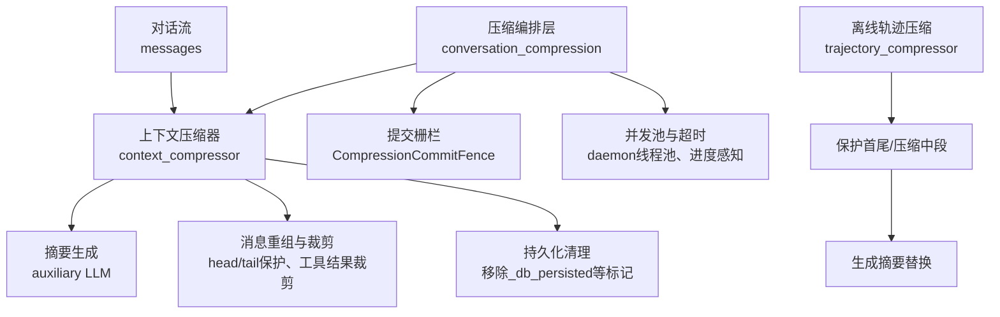
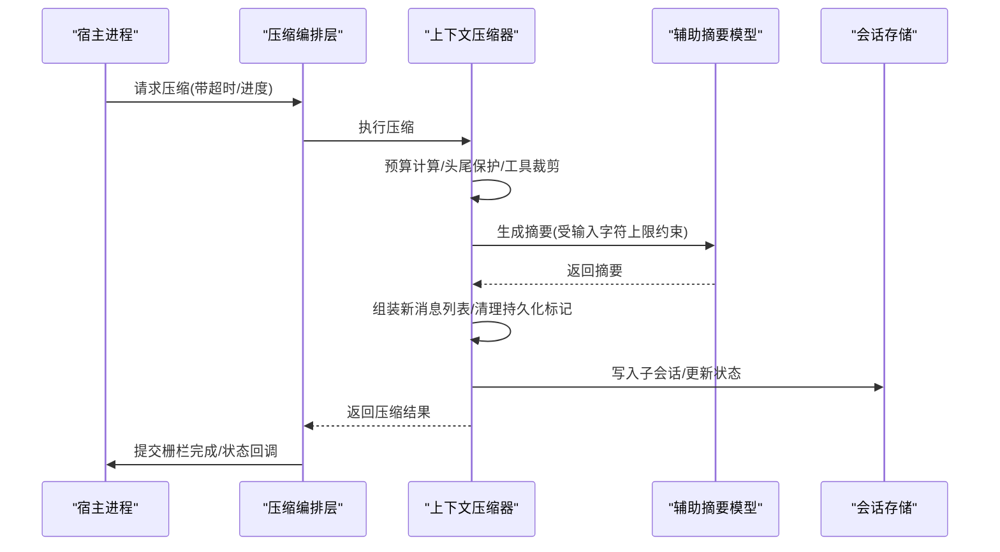
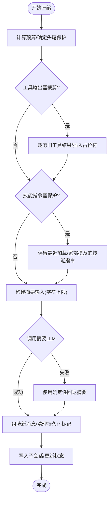
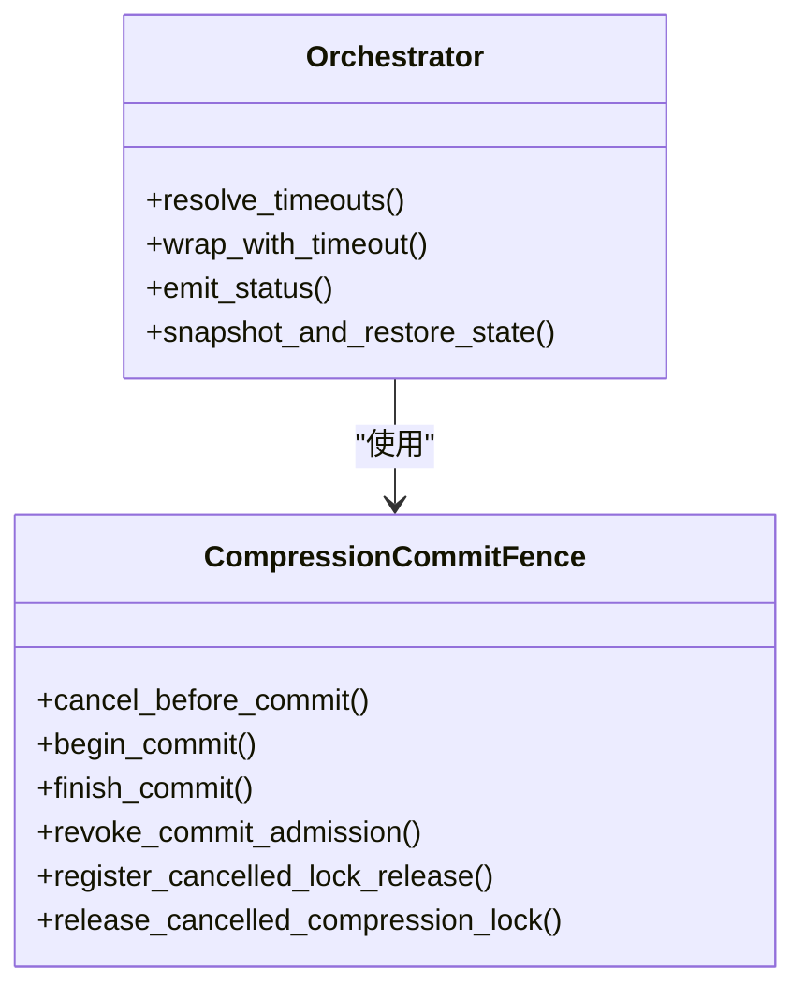
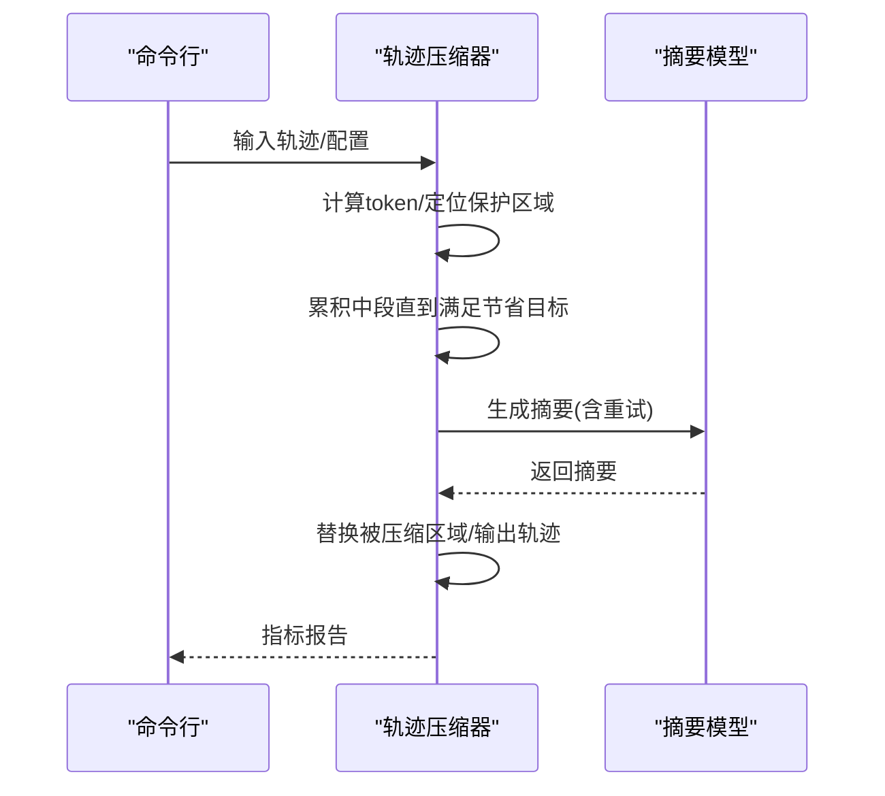
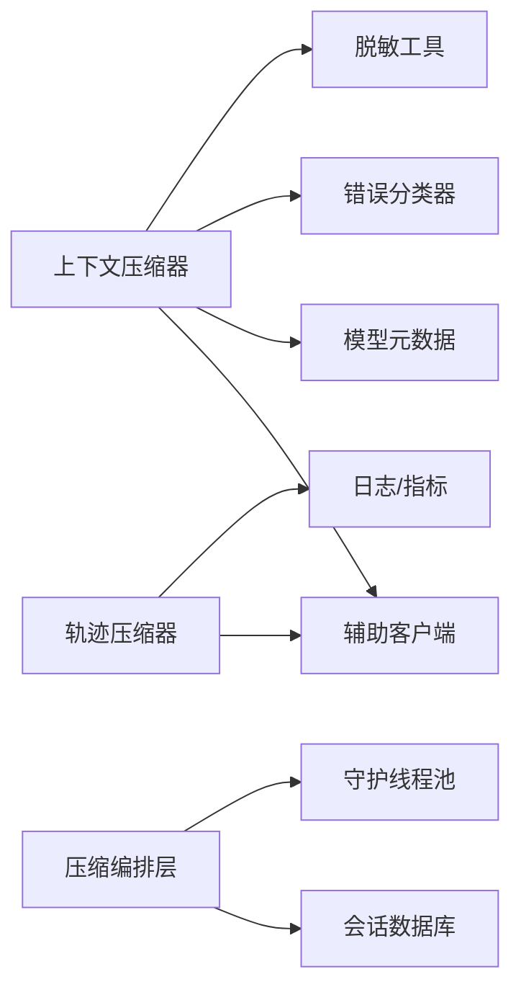

# 压缩优化

<cite>
**本文引用的文件**
- [agent/context_compressor.py](file://agent/context_compressor.py)
- [agent/conversation_compression.py](file://agent/conversation_compression.py)
- [agent/turn_summary.py](file://agent/turn_summary.py)
- [trajectory_compressor.py](file://trajectory_compressor.py)
</cite>

## 目录
1. [简介](#简介)
2. [项目结构](#项目结构)
3. [核心组件](#核心组件)
4. [架构总览](#架构总览)
5. [详细组件分析](#详细组件分析)
6. [依赖关系分析](#依赖关系分析)
7. [性能考量](#性能考量)
8. [故障排查指南](#故障排查指南)
9. [结论](#结论)
10. [附录](#附录)

## 简介
本文件面向“对话压缩与上下文优化”系统，系统性阐述其触发条件、阈值控制、渐进式压缩、LLM摘要质量控制、关键信息保留策略、语义完整性保证、压缩效果评估与基准测试、资源监控、压缩后上下文重建、引用关系维护、状态同步机制、配置选项与扩展方法，以及失败恢复、数据备份与质量检查流程。目标是帮助开发者理解并安全地调优该子系统，确保长会话在有限上下文窗口下稳定运行，同时保持任务连续性与可追溯性。

## 项目结构
围绕压缩优化的核心代码主要分布在以下模块：
- agent/context_compressor.py：在线会话的自动上下文压缩器，负责消息筛选、预算分配、工具输出裁剪、技能指令保护、摘要生成与回退、持久化标记清理等。
- agent/conversation_compression.py：压缩编排层，封装压缩调用、超时与进度感知、提交栅栏（commit fence）、并发池限制、状态快照与恢复、压缩提示与状态广播等。
- agent/turn_summary.py：回合级统计与展示辅助（用于CLI显示），不直接参与压缩逻辑，但体现对工具调用与编辑行数的统计能力。
- trajectory_compressor.py：离线轨迹压缩工具，用于训练数据后处理，按目标token预算压缩中间段，保留首尾关键轮次，并以单条人类摘要替换被压缩区域。

**图表来源**
- [agent/context_compressor.py:1-180](file://agent/context_compressor.py#L1-L180)
- [agent/conversation_compression.py:445-690](file://agent/conversation_compression.py#L445-L690)
- [trajectory_compressor.py:332-800](file://trajectory_compressor.py#L332-L800)

**章节来源**
- [agent/context_compressor.py:1-180](file://agent/context_compressor.py#L1-L180)
- [agent/conversation_compression.py:1-120](file://agent/conversation_compression.py#L1-L120)
- [trajectory_compressor.py:1-120](file://trajectory_compressor.py#L1-L120)

## 核心组件
- 在线压缩器（ContextCompressor）：实现消息预算计算、头尾保护、工具输出裁剪、技能指令保护、摘要模板与边界标记、回退策略、敏感信息脱敏、跨会话兼容性（历史前缀兼容）。
- 压缩编排（compress_context）：提供超时保护、进度感知、提交栅栏、并发池限制、状态回调、压缩前后系统提示一致性校验与重建。
- 离线轨迹压缩（TrajectoryCompressor）：针对训练轨迹进行分段压缩，保护首尾，压缩中段，生成摘要替换，附带指标统计。
- 回合统计（TurnSummaryCollector）：收集工具调用与编辑行数，用于CLI展示，不参与压缩核心逻辑。

**章节来源**
- [agent/context_compressor.py:180-800](file://agent/context_compressor.py#L180-L800)
- [agent/conversation_compression.py:445-800](file://agent/conversation_compression.py#L445-L800)
- [trajectory_compressor.py:332-800](file://trajectory_compressor.py#L332-L800)
- [agent/turn_summary.py:163-221](file://agent/turn_summary.py#L163-L221)

## 架构总览
压缩系统采用“编排+执行”的分层设计：
- 编排层负责调度、超时、并发、提交边界、状态广播与恢复。
- 执行层负责具体压缩算法：预算分配、消息裁剪、摘要生成、回退与持久化清理。
- 离线压缩作为独立工具，用于训练数据后处理，具备独立的配置与指标体系。

**图表来源**
- [agent/conversation_compression.py:445-690](file://agent/conversation_compression.py#L445-L690)
- [agent/context_compressor.py:180-800](file://agent/context_compressor.py#L180-L800)

## 详细组件分析

### 在线上下文压缩器（ContextCompressor）
- 触发与阈值
  - 基于模型上下文长度与软阈值（小窗口模型提高触发比例），避免频繁压缩导致空转。
  - 当受保护尾部工具体超出软预算时，启用压力降级，进一步裁剪已完成的大工具/文件输出，但仍保留最近若干条消息以保证活跃交互可读。
- 渐进式压缩
  - 多阶段裁剪：Phase-1/2/4逐步降低内容体积；对已压缩的历史摘要进行迭代更新，避免信息丢失。
  - 微压缩（micro-compaction）：对局部卡住的消息段设置连续失败计数，超过阈值则跳过以避免忙循环。
- 摘要质量控制
  - 结构化模板与历史区块标题，明确“参考而非指令”，防止模型误将历史摘要当作新任务。
  - 严格边界标记（总结结束分隔符、合并前文分隔符），避免弱模型误读。
  - 输入字符上限约束（约160K字符），防止慢速后端超限或超时。
  - 回退策略：当摘要LLM不可用时，使用确定性回退摘要，仅保留连续性锚点，限制最大字符数。
- 关键信息保留
  - 头尾保护：固定头部（系统提示、工具定义等）与尾部（最近用户问句与工具对）不被压缩。
  - 技能指令保护：检测skill_view调用与最近加载的技能，避免指令被摘要化导致“幽灵技能”。
  - 工具输出裁剪：旧工具结果占位符替换，保留必要上下文但不膨胀上下文。
- 语义完整性与引用关系
  - 摘要前缀与历史前缀兼容，确保跨版本摘要可被识别与标准化。
  - 元数据键（如压缩摘要标记）以“_”前缀避免透传到外部网关，防止未知字段拒绝。
  - 清理持久化标记（如_db_persisted），确保新子会话写入正确。
- 错误处理与恢复
  - 区分授权/配额/网络错误，非重试类错误立即停止压缩尝试。
  - 冷却期与反抖动：连续失败后进入冷却，避免反复触发无效压缩。
  - 提交栅栏：确保提交边界原子性，支持取消与回滚。

**图表来源**
- [agent/context_compressor.py:180-800](file://agent/context_compressor.py#L180-L800)

**章节来源**
- [agent/context_compressor.py:180-800](file://agent/context_compressor.py#L180-L800)

### 压缩编排层（compress_context）
- 超时与进度感知
  - 默认超时与总上限，支持空闲唤醒后的压缩。
  - 通过提交栅栏记录工作线程进度，区分缓慢但活跃的摘要与挂起情况。
- 并发与资源控制
  - 共享守护线程池限制并发压缩任务数量，避免队列无限增长。
  - 提交栅栏保障SessionDB写入的原子性，支持取消与释放锁。
- 状态同步与提示
  - 压缩前后系统提示一致性检查，必要时重建提示以保持内存块一致。
  - 发布压缩状态（如“正在压缩…”、“压缩完成”），便于前端指示。
- 失败恢复与快照
  - 捕获压缩尝试的状态快照，支持在硬取消后恢复冷却期与失败计数。
  - 权威冷却期读取与回滚，避免第三方压缩器干扰。

**图表来源**
- [agent/conversation_compression.py:445-690](file://agent/conversation_compression.py#L445-L690)

**章节来源**
- [agent/conversation_compression.py:445-800](file://agent/conversation_compression.py#L445-L800)

### 离线轨迹压缩器（TrajectoryCompressor）
- 策略
  - 保护首段（系统、人类、首个助手与工具响应）与尾段（最后N轮）。
  - 仅压缩中段起始于第二个工具响应，逐步累积直到达到节省目标。
  - 用单条人类摘要替换被压缩区域，保持后续工具调用完整。
- 配置与指标
  - 支持从YAML加载配置，包括目标token、摘要目标token、保护轮次、并发请求数、指标输出等。
  - 每轨迹指标与聚合指标，包含压缩率、节省token、API调用与错误统计。
- 摘要生成
  - 通过统一辅助客户端或直接OpenAI客户端生成摘要，支持温度适配与重试。
  - 失败时回退为基本摘要文本，保证输出可用性。

**图表来源**
- [trajectory_compressor.py:332-800](file://trajectory_compressor.py#L332-L800)

**章节来源**
- [trajectory_compressor.py:332-800](file://trajectory_compressor.py#L332-L800)

### 回合统计（TurnSummaryCollector）
- 功能
  - 收集工具调用与编辑行数，形成回合摘要行，用于CLI展示。
  - 纯函数格式化，无副作用，便于单元测试。
- 与压缩的关系
  - 不参与压缩核心逻辑，但体现系统对工具行为的观测与呈现能力。

**章节来源**
- [agent/turn_summary.py:163-221](file://agent/turn_summary.py#L163-L221)

## 依赖关系分析
- 在线压缩器依赖：
  - 辅助客户端（call_llm/async_call_llm）用于摘要生成。
  - 模型元数据（上下文长度估计、token估算）用于预算计算。
  - 错误分类器用于授权/配额/网络错误判断。
  - 脱敏工具用于摘要边界文本的敏感信息过滤。
- 编排层依赖：
  - 会话活动与来源规范化用于状态追踪。
  - 守护线程池用于并发压缩任务。
  - 会话数据库接口用于提交与锁管理。
- 离线压缩器依赖：
  - 统一辅助客户端或直接OpenAI客户端。
  - 指标与日志用于过程监控。

**图表来源**
- [agent/context_compressor.py:180-800](file://agent/context_compressor.py#L180-L800)
- [agent/conversation_compression.py:445-800](file://agent/conversation_compression.py#L445-L800)
- [trajectory_compressor.py:332-800](file://trajectory_compressor.py#L332-L800)

**章节来源**
- [agent/context_compressor.py:180-800](file://agent/context_compressor.py#L180-L800)
- [agent/conversation_compression.py:445-800](file://agent/conversation_compression.py#L445-L800)
- [trajectory_compressor.py:332-800](file://trajectory_compressor.py#L332-L800)

## 性能考量
- 预算与触发
  - 小窗口模型提高触发比例，避免频繁压缩导致的空转。
  - 压力降级在尾部工具体超限时进一步裁剪，但仍保留最近消息以保证交互。
- 输入约束
  - 摘要输入字符上限（约160K字符），防止慢速后端超限或超时。
  - 摘要token上下限（2K-10K），避免摘要本身成为上下文压力源。
- 并发与超时
  - 共享线程池限制并发压缩任务数量，避免队列无限增长。
  - 进度感知超时区分缓慢但活跃的摘要与挂起情况。
- 回退与冷却
  - 摘要失败时使用确定性回退，限制最大字符数。
  - 连续失败进入冷却期，避免忙循环。

[本节为通用性能指导，无需特定文件来源]

## 故障排查指南
- 常见问题
  - 授权/配额错误：非重试类错误立即停止压缩尝试，检查密钥与账户余额。
  - 网络超时：启用重试与回退，观察进度感知超时是否合理。
  - 摘要过大：检查输入字符上限与摘要token上限，调整模型或提示。
  - 技能指令丢失：确认技能保护逻辑是否生效，检查最近加载与尾部提及。
  - 持久化标记泄漏：确保清理_db_persisted等标记，避免子会话写入跳过。
- 恢复策略
  - 提交栅栏取消与回滚：在硬取消后恢复冷却期与失败计数。
  - 权威冷却期读取：确保第三方压缩器不干扰冷却状态。
  - 回退摘要：在摘要LLM不可用时，使用确定性回退保持连续性。

**章节来源**
- [agent/context_compressor.py:180-800](file://agent/context_compressor.py#L180-L800)
- [agent/conversation_compression.py:445-800](file://agent/conversation_compression.py#L445-L800)

## 结论
压缩优化系统通过分层架构与精细化的预算控制、摘要质量控制、关键信息保护与回退机制，确保长会话在有限上下文窗口下稳定运行。在线压缩器与编排层协同工作，提供超时保护、并发控制与状态同步；离线压缩器为训练数据后处理提供高效工具。开发者可通过配置与扩展点调优压缩效果，结合指标与监控持续优化系统性能与可靠性。

[本节为总结性内容，无需特定文件来源]

## 附录
- 配置选项（在线压缩）
  - context_timeout_seconds：单次压缩超时时间。
  - total_ceiling_seconds：总压缩时间上限。
  - small_ctx_threshold_percent：小窗口模型触发比例。
  - summary_input_max_chars：摘要输入字符上限。
  - summary_tokens_ceiling：摘要token上限。
- 配置选项（离线压缩）
  - target_max_tokens：目标token预算。
  - summary_target_tokens：摘要目标token。
  - protect_last_n_turns：保护最后N轮。
  - max_concurrent_requests：并发请求数。
  - metrics_output_file：指标输出文件。
- 扩展建议
  - 自定义摘要提示与模板，增强领域适应性。
  - 扩展技能指令保护规则，覆盖更多工具类型。
  - 集成更多指标采集点，提升可观测性。

[本节为配置与扩展指导，无需特定文件来源]