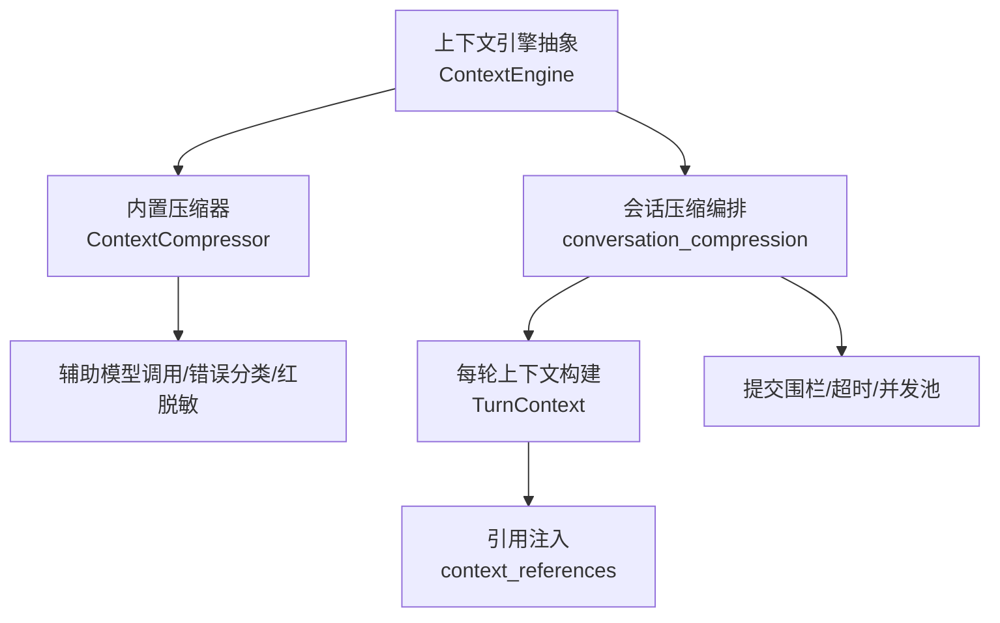
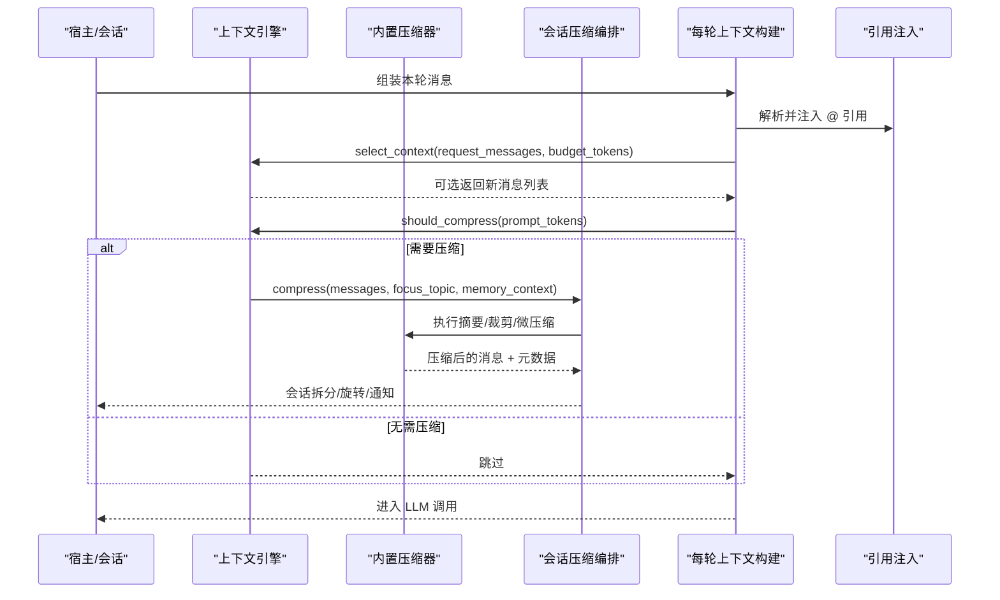
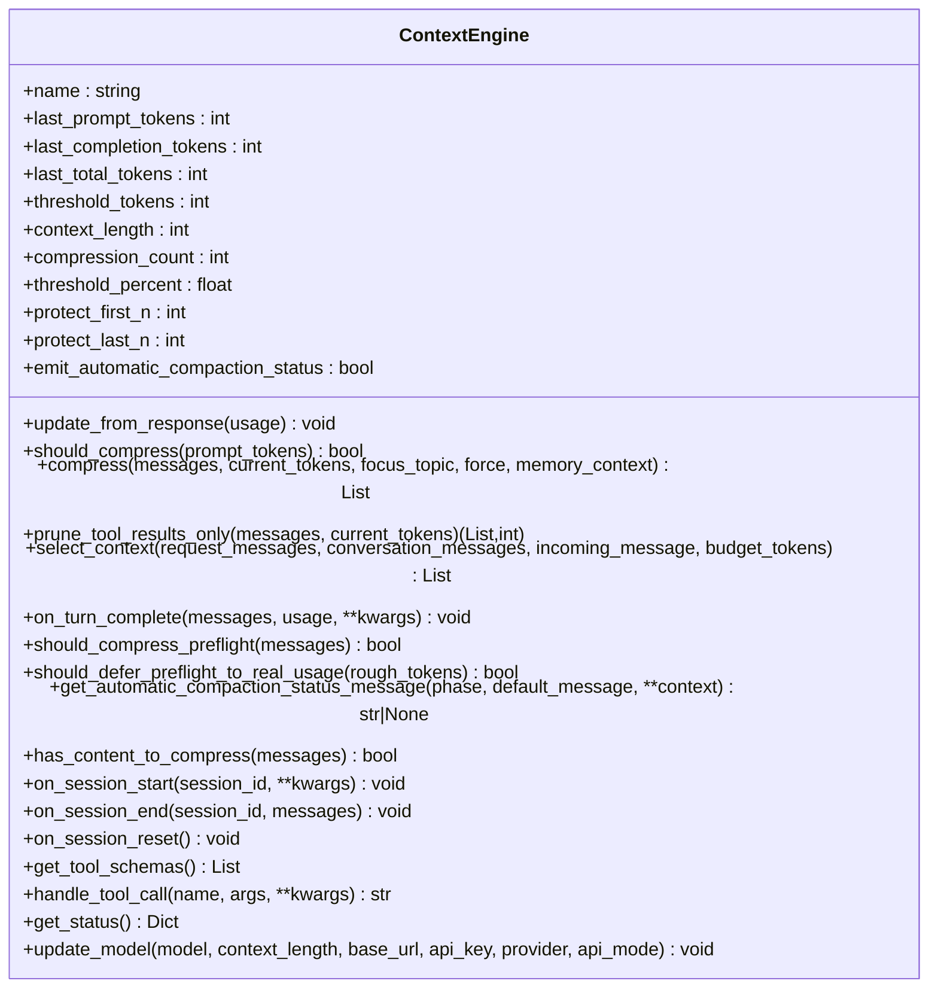
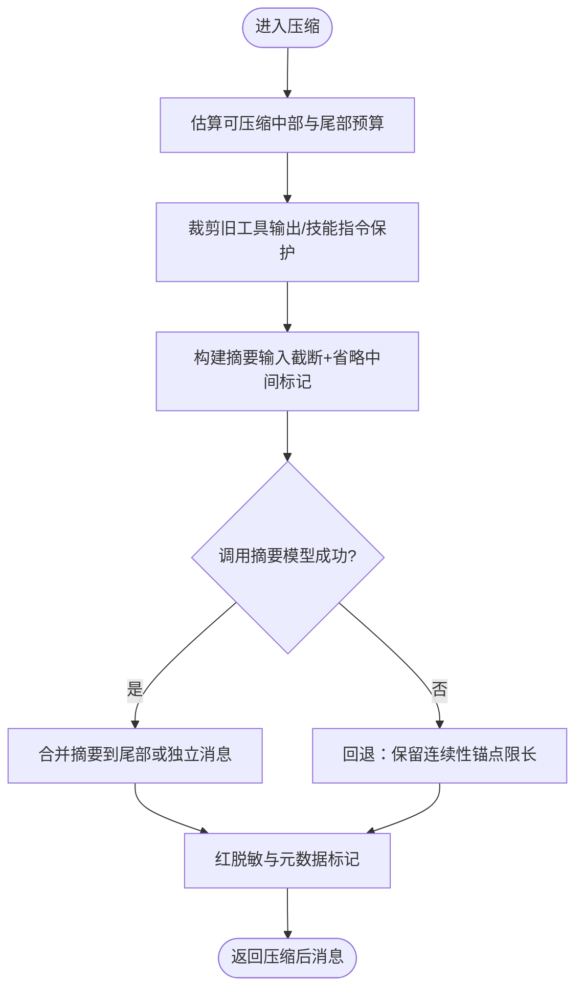
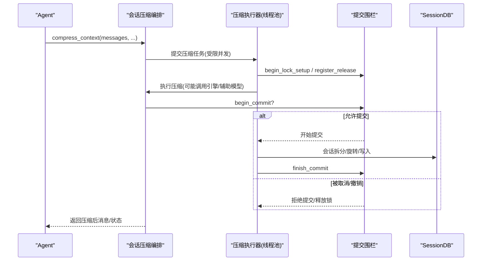
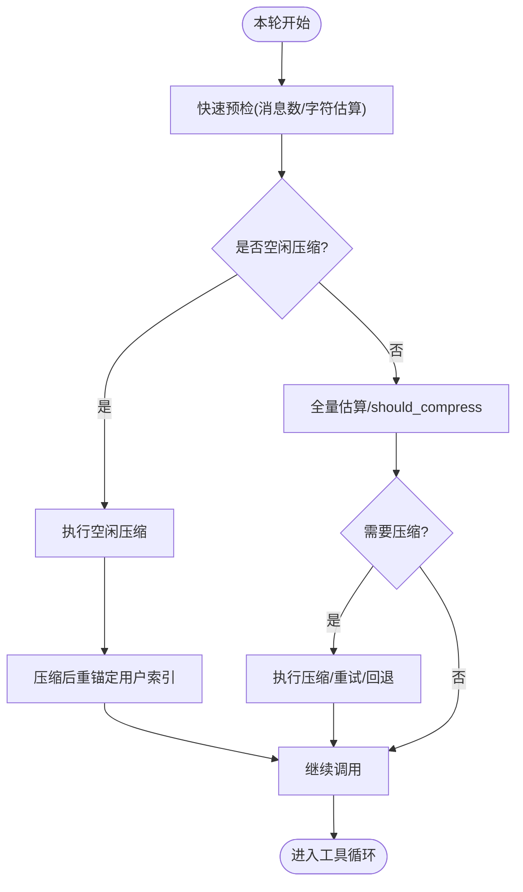
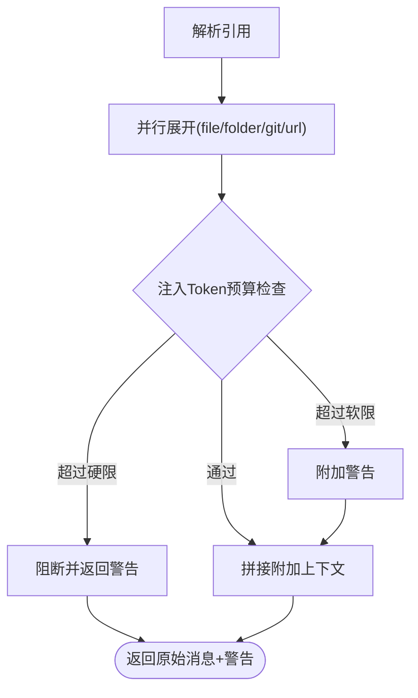
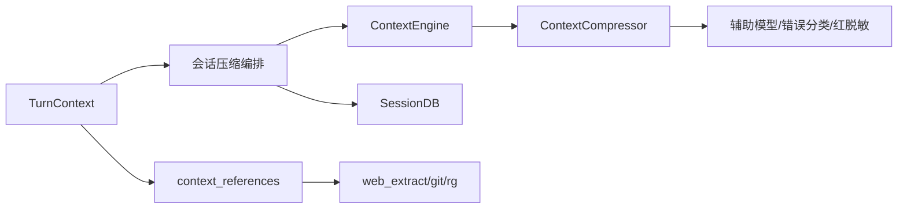

# 上下文处理器

<cite>
**本文引用的文件**
- [context_engine.py](file://agent/context_engine.py)
- [context_compressor.py](file://agent/context_compressor.py)
- [conversation_compression.py](file://agent/conversation_compression.py)
- [turn_context.py](file://agent/turn_context.py)
- [context_references.py](file://agent/context_references.py)
</cite>

## 目录
1. [简介](#简介)
2. [项目结构](#项目结构)
3. [核心组件](#核心组件)
4. [架构总览](#架构总览)
5. [详细组件分析](#详细组件分析)
6. [依赖关系分析](#依赖关系分析)
7. [性能考量](#性能考量)
8. [故障排查指南](#故障排查指南)
9. [结论](#结论)
10. [附录](#附录)

## 简介
本文件面向“上下文处理器”的完整技术文档，聚焦对话上下文的解析、转换与管理机制。内容涵盖：
- 上下文结构与消息类型处理
- 元数据管理与压缩标记
- 上下文压缩触发条件、优先级与选择性保留策略
- 上下文大小估算、内存占用优化与垃圾回收
- 引用关系维护、依赖追踪与一致性保证
- 配置选项、性能调优参数与监控指标
- 上下文损坏修复、备份恢复与数据迁移
- 扩展上下文处理器与性能优化指导

## 项目结构
上下文处理由“引擎抽象 + 内置压缩器 + 会话压缩编排 + 每轮上下文构建 + 引用注入”五层组成：
- 引擎抽象：定义统一接口（压缩、选择、工具、生命周期）
- 内置压缩器：实现自动摘要、工具结果裁剪、技能保护、微压缩等
- 会话压缩编排：负责超时、并发、提交围栏、冷却与状态持久化
- 每轮上下文构建：预检、空闲压缩、系统提示缓存、用户消息注入
- 引用注入：@file/@folder/@git/@url 等引用解析与安全注入

**图表来源**
- [context_engine.py:89-490](file://agent/context_engine.py#L89-L490)
- [context_compressor.py:1-800](file://agent/context_compressor.py#L1-L800)
- [conversation_compression.py:1-800](file://agent/conversation_compression.py#L1-L800)
- [turn_context.py:314-800](file://agent/turn_context.py#L314-L800)
- [context_references.py:1-237](file://agent/context_references.py#L1-L237)

**章节来源**
- [context_engine.py:89-490](file://agent/context_engine.py#L89-L490)
- [conversation_compression.py:1-800](file://agent/conversation_compression.py#L1-L800)
- [turn_context.py:314-800](file://agent/turn_context.py#L314-L800)
- [context_references.py:1-237](file://agent/context_references.py#L1-L237)

## 核心组件
- 上下文引擎抽象（ContextEngine）
  - 职责：决定何时压缩、执行压缩、可选提供工具、跟踪用量、会话生命周期钩子、每轮上下文选择与观察
  - 关键接口：update_from_response、should_compress、compress、select_context、on_turn_complete、get_tool_schemas/handle_tool_call、on_session_start/end/reset、update_model
- 内置压缩器（ContextCompressor）
  - 职责：自动摘要、工具输出裁剪、技能指令保护、微压缩、失败回退、冷却与反抖动、元数据标记
  - 关键常量与策略：保护头尾、摘要配额、输入上限、失败冷却、小窗口阈值、压力降级
- 会话压缩编排（conversation_compression）
  - 职责：启动探测、压缩调用、SQLite 会话拆分与旋转、插件/记忆提供者通知、图像缩小恢复、超时与并发控制、提交围栏、冷却持久化
- 每轮上下文构建（TurnContext）
  - 职责：预检估算、空闲压缩、系统提示缓存、用户消息注入、索引重锚定、压缩进度判定
- 引用注入（context_references）
  - 职责：解析 @file/@folder/@git/@url 等引用，安全校验、并行展开、token 预算限制、注入警告与附加块

**章节来源**
- [context_engine.py:89-490](file://agent/context_engine.py#L89-L490)
- [context_compressor.py:1-800](file://agent/context_compressor.py#L1-L800)
- [conversation_compression.py:1-800](file://agent/conversation_compression.py#L1-L800)
- [turn_context.py:314-800](file://agent/turn_context.py#L314-L800)
- [context_references.py:1-237](file://agent/context_references.py#L1-L237)

## 架构总览
上下文处理在“请求前选择 + 请求后压缩”的双通道中运行：
- 请求前：select_context 可替换本次请求的上下文（检索/路由/分支切换），不影响持久历史
- 请求后：should_compress 判断是否触发压缩；compress 生成更短的消息序列并持久化

**图表来源**
- [context_engine.py:215-279](file://agent/context_engine.py#L215-L279)
- [conversation_compression.py:1-800](file://agent/conversation_compression.py#L1-L800)
- [turn_context.py:667-800](file://agent/turn_context.py#L667-L800)
- [context_references.py:150-237](file://agent/context_references.py#L150-L237)

## 详细组件分析

### 上下文引擎抽象（ContextEngine）
- 设计要点
  - 统一的压缩与选择接口，支持第三方引擎替换
  - 通过 update_from_response 累计用量，should_compress 决策触发
  - select_context 用于“按轮次选择上下文”，不改变持久历史
  - on_turn_complete 用于“事后观察”，便于索引/主题/路由更新
  - get_tool_schemas/handle_tool_call 暴露引擎工具（如 lcm_grep）
  - on_session_start/end/reset 管理会话级状态
  - update_model 根据模型上下文长度与阈值计算触发点
- 复杂度与影响
  - 选择与压缩解耦，避免滥用 should_compress 作为通用回调
  - 默认无副作用，非实现引擎对缓存稳定性无影响

**图表来源**
- [context_engine.py:89-490](file://agent/context_engine.py#L89-L490)

**章节来源**
- [context_engine.py:89-490](file://agent/context_engine.py#L89-L490)

### 内置压缩器（ContextCompressor）
- 关键策略
  - 摘要模板与历史任务快照，避免将历史误认为当前任务
  - 工具输出裁剪（Phase-1/2/4）与技能指令保护（防止幽灵技能）
  - 微压缩（滚动摘要）与失败回退（有限字符保留连续性）
  - 严格红脱敏边界（强制模式、URL 凭据脱敏）
  - 元数据标记（_compressed_summary、_micro_compact_marker、_db_persisted 清理）
  - 小窗口模型阈值下界与压力降级（受保护尾部仍超限时的进一步裁剪）
- 复杂度与影响
  - 摘要输入上限（约 160K 字符）避免慢后端超时
  - 失败冷却与反抖避免频繁无效压缩
  - 技能保护与最近窗口避免丢失关键指令

**图表来源**
- [context_compressor.py:100-180](file://agent/context_compressor.py#L100-L180)
- [context_compressor.py:417-444](file://agent/context_compressor.py#L417-L444)
- [context_compressor.py:764-782](file://agent/context_compressor.py#L764-L782)

**章节来源**
- [context_compressor.py:1-800](file://agent/context_compressor.py#L1-L800)

### 会话压缩编排（conversation_compression）
- 职责
  - 启动时探测辅助模型可行性，必要时降低阈值或拒绝不可用 aux
  - 执行压缩调用，拆分 SQLite 会话、旋转 session_id，通知插件/记忆提供者
  - 图像过大恢复（base64 重编码）以重试
  - 超时与并发控制：进程级守护线程池、提交围栏、锁释放钩子、饱和保护
  - 冷却与持久化：失败冷却行读取/恢复、回滚快照、权威状态捕获
- 关键流程

**图表来源**
- [conversation_compression.py:445-691](file://agent/conversation_compression.py#L445-L691)
- [conversation_compression.py:738-773](file://agent/conversation_compression.py#L738-L773)

**章节来源**
- [conversation_compression.py:1-800](file://agent/conversation_compression.py#L1-L800)

### 每轮上下文构建（TurnContext）
- 职责
  - 预检估算：基于消息数与粗略字符估计决定是否进行昂贵的全量估算
  - 空闲压缩：长时间空闲后主动压缩累积历史
  - 系统提示缓存：保持字节稳定以利于缓存命中
  - 用户消息注入：外部记忆预取与插件上下文追加
  - 压缩后索引重锚定：确保本轮用户消息位置正确
  - 压缩进度判定：基于行数与 token 减少（>5%）判断有效进展
- 关键流程

**图表来源**
- [turn_context.py:252-312](file://agent/turn_context.py#L252-L312)
- [turn_context.py:667-800](file://agent/turn_context.py#L667-L800)

**章节来源**
- [turn_context.py:314-800](file://agent/turn_context.py#L314-L800)

### 引用注入（context_references）
- 功能
  - 解析 @file/@folder/@git/@url/diff/staged 等引用
  - 安全校验：敏感路径/凭据白名单、工作区根限制、二进制检测
  - 并行展开：并发抓取 URL/文件/目录/仓库信息
  - Token 预算：硬限 50%、软限 25%，超限则阻断或告警
  - 注入格式：附加代码块/目录树/差异文本，附带 token 估算
- 关键流程

**图表来源**
- [context_references.py:80-148](file://agent/context_references.py#L80-L148)
- [context_references.py:150-237](file://agent/context_references.py#L150-L237)
- [context_references.py:239-346](file://agent/context_references.py#L239-L346)
- [context_references.py:372-434](file://agent/context_references.py#L372-L434)

**章节来源**
- [context_references.py:1-237](file://agent/context_references.py#L1-L237)
- [context_references.py:239-434](file://agent/context_references.py#L239-L434)

## 依赖关系分析
- 组件耦合
  - ContextEngine 为松耦合抽象，ContextCompressor 为其具体实现
  - conversation_compression 协调引擎与数据库、线程池、围栏
  - TurnContext 驱动预检与空闲压缩，并与引用注入协作
  - context_references 依赖安全模块与工具链（web 提取、git、rg）
- 外部依赖
  - 辅助模型（摘要）、错误分类、红脱敏、SessionDB、DaemonThreadPoolExecutor
- 潜在循环
  - 通过函数式传递与延迟导入避免循环依赖（例如 turn_context 与 conversation_loop 的解耦）

**图表来源**
- [context_engine.py:89-490](file://agent/context_engine.py#L89-L490)
- [conversation_compression.py:1-800](file://agent/conversation_compression.py#L1-L800)
- [turn_context.py:314-800](file://agent/turn_context.py#L314-L800)
- [context_references.py:1-237](file://agent/context_references.py#L1-L237)

**章节来源**
- [context_engine.py:89-490](file://agent/context_engine.py#L89-L490)
- [conversation_compression.py:1-800](file://agent/conversation_compression.py#L1-L800)
- [turn_context.py:314-800](file://agent/turn_context.py#L314-L800)
- [context_references.py:1-237](file://agent/context_references.py#L1-L237)

## 性能考量
- 触发条件与优先级
  - 预检快速门：消息数超保护范围或字符估算超阈值即进入全量估算
  - 空闲压缩：基于空闲时长与 token 下限，避免重复读大上下文
  - 每轮选择：select_context 可在请求前替换上下文，避免不必要的压缩
- 大小估算与内存优化
  - 粗略估算（estimate_messages_tokens_rough/estimate_request_tokens_rough）
  - 摘要输入上限（~160K 字符）避免慢后端超时
  - 工具输出裁剪与技能保护减少不必要的大块内容
  - 图像过大时重编码以降低 provider 上限
- 垃圾回收与并发
  - 压缩任务在守护线程池中运行，避免阻塞事件循环
  - 提交围栏确保提交阶段原子性，取消时可安全释放锁
  - 饱和保护限制并发提交，避免队列无限增长
- 监控指标
  - 引擎状态：last_prompt_tokens、threshold_tokens、context_length、usage_percent、compression_count
  - 压缩状态：COMPACTION_STATUS、COMPRESSION_RETRY_* 模板、CONTEXT_OVERFLOW_BLOCKED_WARNING_TEMPLATE

[本节为通用性能讨论，不直接分析具体文件]

## 故障排查指南
- 常见问题
  - 压缩被阻止：摘要模型冷却/反抖/配额不足导致跳过，需等待冷却或手动 /compress
  - 上下文溢出但无法压缩：显示 CONTEXT_OVERFLOW_BLOCKED_WARNING_TEMPLATE，建议 /new 或 /compress
  - 会话旋转后索引错乱：使用 reanchor_current_turn_user_idx 重新定位本轮用户消息
  - 引用注入被阻断：检查 @ 引用 token 预算与工作区根限制，查看警告信息
- 修复策略
  - 冷却恢复：读取/恢复权威冷却行，避免误清
  - 回退摘要：失败时使用有限字符的连续性锚点，避免中断
  - 图像恢复：尝试缩略 base64 图片以重试
  - 红脱敏：跨边界文本强制脱敏，避免凭据泄露

**章节来源**
- [conversation_compression.py:115-180](file://agent/conversation_compression.py#L115-L180)
- [conversation_compression.py:284-443](file://agent/conversation_compression.py#L284-L443)
- [turn_context.py:173-203](file://agent/turn_context.py#L173-L203)
- [context_references.py:196-237](file://agent/context_references.py#L196-L237)

## 结论
上下文处理器通过“引擎抽象 + 内置压缩器 + 编排 + 每轮构建 + 引用注入”的分层设计，实现了高内聚、低耦合的上下文管理能力。其核心优势在于：
- 明确的触发与选择机制，避免过度压缩与缓存失效
- 严格的元数据与红脱敏边界，保障一致性与安全性
- 健壮的超时、并发与提交围栏，提升鲁棒性
- 可扩展的引擎接口与工具能力，便于定制与演进

[本节为总结，不直接分析具体文件]

## 附录

### 配置选项与调优参数
- 引擎选择：context.engine（默认 compressor）
- 阈值与保护：threshold_percent、protect_first_n、protect_last_n
- 空闲压缩：compression_idle_compact_after_seconds
- 超时与并发：compression.context_timeout_seconds、DEFAULT_CONTEXT_TOTAL_CEILING_SECONDS
- 引用注入预算：硬限 50%、软限 25%（context_references）
- 小窗口模型：_SMALL_CTX_WINDOW_LIMIT、_SMALL_CTX_THRESHOLD_PERCENT

**章节来源**
- [context_engine.py:121-129](file://agent/context_engine.py#L121-L129)
- [turn_context.py:667-701](file://agent/turn_context.py#L667-L701)
- [conversation_compression.py:693-700](file://agent/conversation_compression.py#L693-L700)
- [context_references.py:196-215](file://agent/context_references.py#L196-L215)
- [context_compressor.py:742-750](file://agent/context_compressor.py#L742-L750)

### 扩展与优化指导
- 自定义引擎
  - 实现 ContextEngine 接口，覆盖 compress/select_context/on_turn_complete
  - 提供 get_tool_schemas/handle_tool_call 暴露引擎工具
  - 通过 plugin 注册或放置于 plugins/context_engine/<name>/
- 性能优化
  - 合理设置 threshold_percent 与 protect_first_n/protect_last_n
  - 启用空闲压缩以减少冷启动开销
  - 利用 select_context 做检索/路由，避免每次都走压缩
  - 关注摘要输入上限与失败冷却，避免慢后端阻塞
- 监控与诊断
  - 使用 get_status 获取引擎状态
  - 关注 COMPACTION_STATUS 与重试模板，结合日志定位问题
  - 使用 reanchor_current_turn_user_idx 修复索引错位

**章节来源**
- [context_engine.py:413-490](file://agent/context_engine.py#L413-L490)
- [conversation_compression.py:115-180](file://agent/conversation_compression.py#L115-L180)
- [turn_context.py:173-203](file://agent/turn_context.py#L173-L203)