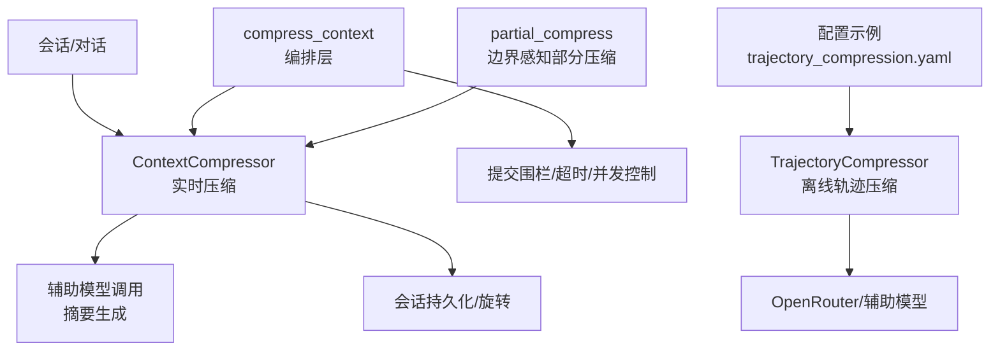
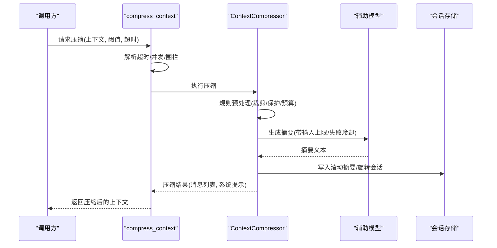
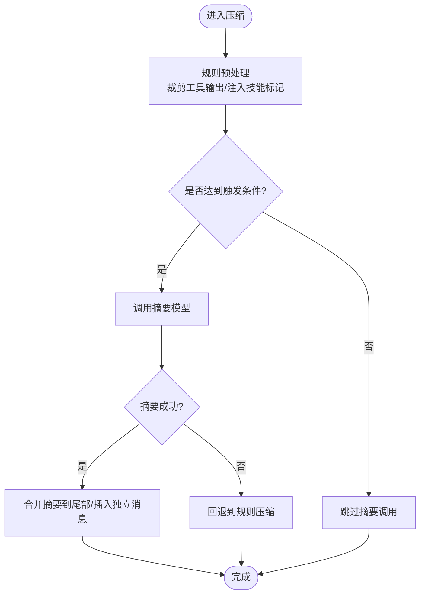
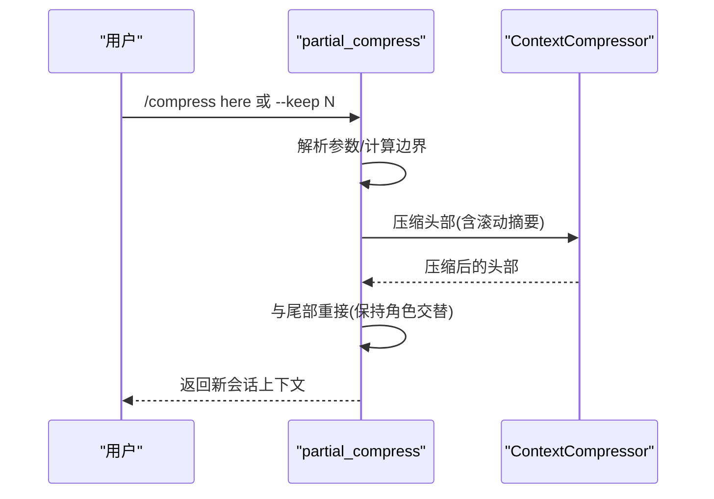
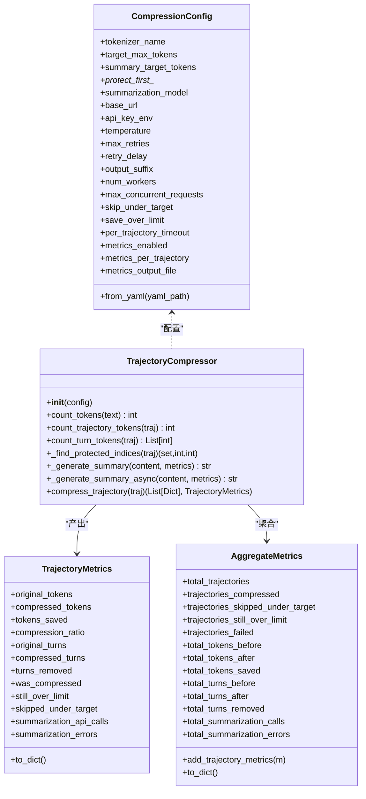
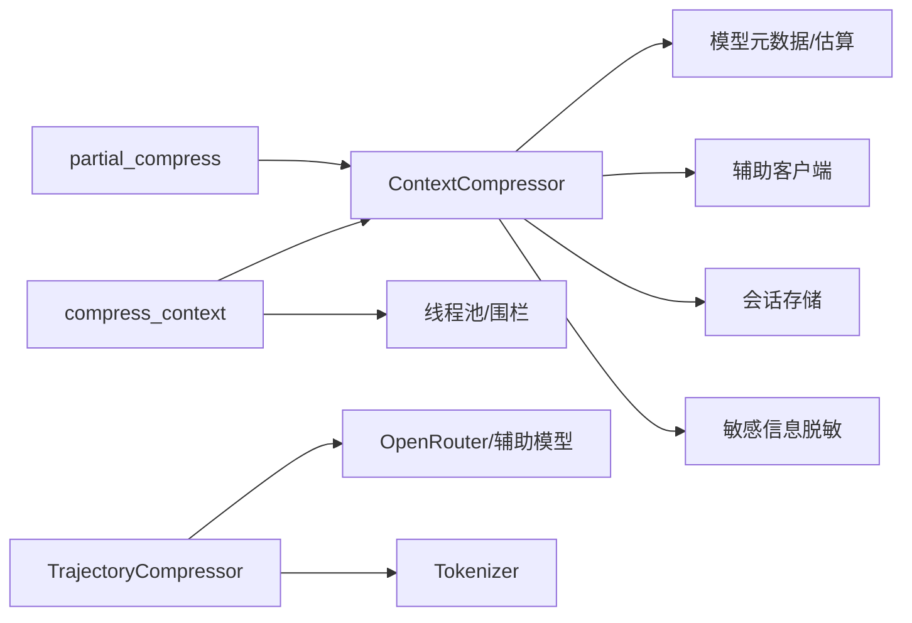

# 压缩策略

<cite>
**本文引用的文件**
- [agent/context_compressor.py](file://agent/context_compressor.py)
- [agent/conversation_compression.py](file://agent/conversation_compression.py)
- [agent/manual_compression_feedback.py](file://agent/manual_compression_feedback.py)
- [hermes_cli/partial_compress.py](file://hermes_cli/partial_compress.py)
- [trajectory_compressor.py](file://trajectory_compressor.py)
- [datagen-config-examples/trajectory_compression.yaml](file://datagen-config-examples/trajectory_compression.yaml)
</cite>

## 目录
1. [简介](#简介)
2. [项目结构](#项目结构)
3. [核心组件](#核心组件)
4. [架构总览](#架构总览)
5. [详细组件分析](#详细组件分析)
6. [依赖关系分析](#依赖关系分析)
7. [性能考量](#性能考量)
8. [故障排查指南](#故障排查指南)
9. [结论](#结论)
10. [附录](#附录)

## 简介
本文件系统化梳理 Hermes Agent 的“上下文压缩策略”，覆盖三类策略：基于规则的压缩、基于内容的压缩与混合策略；解释自动选择压缩级别、动态调整与回退机制；给出效率评估、资源消耗分析与性能对比；提供配置模板、预设方案与自定义规则；并说明执行监控指标、效果分析与优化建议，以及冲突解决、兼容性检查与版本管理。最后为开发者扩展新策略和优化现有策略提供指导。

## 项目结构
围绕压缩的核心代码分布在以下模块：
- 会话内实时压缩：agent/context_compressor.py（实现 ContextCompressor）
- 压缩编排与超时/并发控制：agent/conversation_compression.py（封装 compress_context、提交围栏、执行器池等）
- 手动压缩反馈：agent/manual_compression_feedback.py（用户可见摘要与状态）
- 边界感知部分压缩：hermes_cli/partial_compress.py（支持“在此处折叠”）
- 轨迹后处理压缩：trajectory_compressor.py（离线批量压缩训练轨迹）
- 轨迹压缩配置示例：datagen-config-examples/trajectory_compression.yaml

图表来源
- [agent/context_compressor.py:1-180](file://agent/context_compressor.py#L1-L180)
- [agent/conversation_compression.py:776-800](file://agent/conversation_compression.py#L776-L800)
- [hermes_cli/partial_compress.py:213-266](file://hermes_cli/partial_compress.py#L213-L266)
- [trajectory_compressor.py:332-412](file://trajectory_compressor.py#L332-L412)
- [datagen-config-examples/trajectory_compression.yaml:1-102](file://datagen-config-examples/trajectory_compression.yaml#L1-L102)

章节来源
- [agent/context_compressor.py:1-180](file://agent/context_compressor.py#L1-L180)
- [agent/conversation_compression.py:776-800](file://agent/conversation_compression.py#L776-L800)
- [hermes_cli/partial_compress.py:213-266](file://hermes_cli/partial_compress.py#L213-L266)
- [trajectory_compressor.py:332-412](file://trajectory_compressor.py#L332-L412)
- [datagen-config-examples/trajectory_compression.yaml:1-102](file://datagen-config-examples/trajectory_compression.yaml#L1-L102)

## 核心组件
- ContextCompressor（agent/context_compressor.py）
  - 负责将历史消息中可压缩区域进行内容摘要，保留头部与尾部关键信息，维护滚动摘要、工具输出裁剪、技能指令防丢失标记、摘要失败冷却与回退等。
- compress_context（agent/conversation_compression.py）
  - 对外暴露压缩入口，统一处理超时、并发、提交围栏、状态快照/恢复、冷却持久化、进度上报与重试提示等。
- partial_compress（hermes_cli/partial_compress.py）
  - 支持“在此处折叠”的部分压缩，解析参数、计算边界、合并头尾以维持角色交替合法性。
- TrajectoryCompressor（trajectory_compressor.py）
  - 离线对已完成轨迹进行压缩，保护首尾，仅对中间区域按需压缩并用单条人类摘要替换，附带丰富指标。
- manual_compression_feedback（agent/manual_compression_feedback.py）
  - 将压缩结果、失败原因、回退使用等信息转化为面向用户的稳定文案。

章节来源
- [agent/context_compressor.py:1-180](file://agent/context_compressor.py#L1-L180)
- [agent/conversation_compression.py:776-800](file://agent/conversation_compression.py#L776-L800)
- [hermes_cli/partial_compress.py:55-108](file://hermes_cli/partial_compress.py#L55-L108)
- [trajectory_compressor.py:332-412](file://trajectory_compressor.py#L332-L412)
- [agent/manual_compression_feedback.py:40-121](file://agent/manual_compression_feedback.py#L40-L121)

## 架构总览
压缩系统由“编排层 + 策略实现 + 外部模型 + 持久化/监控”构成。编排层负责并发、超时、提交围栏与状态一致性；策略实现包含基于规则与基于内容的压缩；外部模型用于摘要生成；持久化负责会话旋转与滚动摘要保存；监控提供指标与用户可见状态。

图表来源
- [agent/conversation_compression.py:445-691](file://agent/conversation_compression.py#L445-L691)
- [agent/context_compressor.py:100-180](file://agent/context_compressor.py#L100-L180)
- [agent/context_compressor.py:764-782](file://agent/context_compressor.py#L764-L782)

## 详细组件分析

### 基于规则的压缩（ContextCompressor）
- 目标：在不调用 LLM 的情况下，通过规则快速降低上下文体积，避免触发昂贵的摘要调用或作为摘要失败时的兜底。
- 关键机制
  - 保护头部与尾部：确保系统提示、最近交互不被误删。
  - 工具输出裁剪：对旧工具结果进行占位替换，减少冗余。
  - 技能指令防丢失：检测即将被丢弃的 skill_view 指令，注入“已裁剪”标记以便后续重新加载。
  - 输入上限：限制送入摘要模型的输入字符数，防止慢后端超窗或超时。
  - 可行性跳过：当可压缩区域过小且之前无效时，直接跳过 LLM 调用。
- 复杂度与影响
  - 时间复杂度近似 O(N)（N 为消息数），空间复杂度 O(N)（构建新消息列表）。
  - 显著降低 LLM 调用成本与延迟，适合高频短轮次场景。

图表来源
- [agent/context_compressor.py:417-444](file://agent/context_compressor.py#L417-L444)
- [agent/context_compressor.py:486-524](file://agent/context_compressor.py#L486-L524)
- [agent/context_compressor.py:585-621](file://agent/context_compressor.py#L585-L621)

章节来源
- [agent/context_compressor.py:417-444](file://agent/context_compressor.py#L417-L444)
- [agent/context_compressor.py:486-524](file://agent/context_compressor.py#L486-L524)
- [agent/context_compressor.py:585-621](file://agent/context_compressor.py#L585-L621)

### 基于内容的压缩（ContextCompressor 摘要路径）
- 目标：利用辅助模型对历史中段进行高质量摘要，保留语义与任务线索，同时严格控制摘要长度与输入规模。
- 关键机制
  - 结构化摘要模板：包含“历史任务快照”“待解决问题”等分区，增强可读性与可追踪性。
  - 安全前缀与结束标记：明确区分“参考摘要”与“当前任务”，避免模型误把摘要当作新指令。
  - 输入约束：按字符上限截断摘要输入，避免慢后端超限。
  - 失败冷却与回退：连续失败时冷却，必要时降级为轻量回退摘要。
- 复杂度与影响
  - 主要开销在 LLM 调用，时间与成本取决于模型与输入规模。
  - 通过比例分配摘要预算（如压缩内容的固定比例）与绝对上限，平衡质量与成本。

章节来源
- [agent/context_compressor.py:97-180](file://agent/context_compressor.py#L97-L180)
- [agent/context_compressor.py:764-782](file://agent/context_compressor.py#L764-L782)

### 混合压缩策略（规则 + 内容）
- 设计思想：优先尝试低成本规则压缩；若仍不足或需要更高保真度，则调用摘要模型；失败时回退至规则压缩。
- 自动级别选择与动态调整
  - 根据上下文大小、模型窗口、历史有效性统计，动态决定是否需要摘要、摘要预算与输入上限。
  - 小窗口模型提高触发阈值，避免频繁无意义压缩。
- 回退机制
  - 摘要失败时，采用轻量回退摘要（限制最大字符数），保证会话连续性。
  - 冷却期内避免重复失败导致的抖动。

章节来源
- [agent/context_compressor.py:417-444](file://agent/context_compressor.py#L417-L444)
- [agent/context_compressor.py:715-724](file://agent/context_compressor.py#L715-L724)

### 边界感知部分压缩（Partial Compress）
- 目标：允许用户指定“在此处折叠”，保留最近若干完整交换（user+assistant/tool）为原文，其余头部压缩。
- 关键机制
  - 参数解析：支持 here / up to here / --keep N 等语法。
  - 边界计算：从末尾回溯找到第 N 个 user 起始位置，确保拼接后角色交替合法。
  - 头尾重接：若出现非法相邻角色，自动合并或插入桥接消息。
- 适用场景：长会话中希望保留最新交互细节，同时压缩更早历史。

图表来源
- [hermes_cli/partial_compress.py:55-108](file://hermes_cli/partial_compress.py#L55-L108)
- [hermes_cli/partial_compress.py:213-266](file://hermes_cli/partial_compress.py#L213-L266)
- [hermes_cli/partial_compress.py:269-325](file://hermes_cli/partial_compress.py#L269-L325)

章节来源
- [hermes_cli/partial_compress.py:55-108](file://hermes_cli/partial_compress.py#L55-L108)
- [hermes_cli/partial_compress.py:213-266](file://hermes_cli/partial_compress.py#L213-L266)
- [hermes_cli/partial_compress.py:269-325](file://hermes_cli/partial_compress.py#L269-L325)

### 轨迹后处理压缩（离线批量）
- 目标：对已完成轨迹进行压缩，满足训练数据 token 预算，同时保留首尾关键信息与工具调用链。
- 关键机制
  - 保护首尾：system/human/gpt/tool 的首条与最后若干条不压缩。
  - 中间区域按需压缩：仅压缩到满足目标 token 即可，剩余中间段保留。
  - 摘要生成：通过 OpenRouter/辅助模型生成中性视角摘要，追加必要提示。
  - 指标收集：记录压缩比、节省 token、API 调用次数与错误率等。
- 配置：YAML 定义 tokenizer、目标 token、摘要模型、并发与输出等。

图表来源
- [trajectory_compressor.py:82-179](file://trajectory_compressor.py#L82-L179)
- [trajectory_compressor.py:182-329](file://trajectory_compressor.py#L182-L329)
- [trajectory_compressor.py:332-412](file://trajectory_compressor.py#L332-L412)
- [trajectory_compressor.py:743-800](file://trajectory_compressor.py#L743-L800)

章节来源
- [trajectory_compressor.py:82-179](file://trajectory_compressor.py#L82-L179)
- [trajectory_compressor.py:182-329](file://trajectory_compressor.py#L182-L329)
- [trajectory_compressor.py:332-412](file://trajectory_compressor.py#L332-L412)
- [trajectory_compressor.py:743-800](file://trajectory_compressor.py#L743-L800)
- [datagen-config-examples/trajectory_compression.yaml:1-102](file://datagen-config-examples/trajectory_compression.yaml#L1-L102)

## 依赖关系分析
- 内部依赖
  - ContextCompressor 依赖模型元数据（上下文长度估算）、辅助客户端、敏感信息脱敏、会话状态等。
  - compress_context 依赖线程池、提交围栏、活动溯源、状态快照/恢复等。
  - partial_compress 与 ContextCompressor 协作，确保角色交替与边界正确。
  - TrajectoryCompressor 依赖 OpenRouter/辅助模型与 tokenizer。
- 外部依赖
  - 辅助模型（摘要生成）：通过统一路由或直连 OpenAI 兼容接口。
  - 会话存储：SQLite/SessionDB 用于滚动摘要与旋转。
- 耦合与内聚
  - 压缩策略集中在 ContextCompressor，内聚度高；编排层解耦并发与超时，便于测试与替换。
  - 轨迹压缩与在线压缩职责分离，避免互相干扰。

图表来源
- [agent/context_compressor.py:28-44](file://agent/context_compressor.py#L28-L44)
- [agent/conversation_compression.py:54-76](file://agent/conversation_compression.py#L54-L76)
- [trajectory_compressor.py:44-56](file://trajectory_compressor.py#L44-L56)

章节来源
- [agent/context_compressor.py:28-44](file://agent/context_compressor.py#L28-L44)
- [agent/conversation_compression.py:54-76](file://agent/conversation_compression.py#L54-L76)
- [trajectory_compressor.py:44-56](file://trajectory_compressor.py#L44-L56)

## 性能考量
- 压缩效率评估
  - 指标：压缩比、节省 token、摘要 API 调用次数、失败率、耗时。
  - 在线压缩：关注超时、冷却期、回退使用频率；离线压缩：关注整体压缩率与指标分布。
- 资源消耗分析
  - CPU/内存：规则压缩线性开销；摘要调用受模型与输入规模影响。
  - 网络：摘要调用次数与重试策略直接影响延迟与成本。
- 性能对比
  - 规则压缩：低延迟、低成本，但保真度有限。
  - 内容压缩：高保真，成本高；通过输入上限与失败冷却控制风险。
  - 混合策略：在大多数场景下取得性价比最优。
- 优化建议
  - 合理设置触发阈值与摘要预算，避免频繁无意义压缩。
  - 启用输入字符上限，防止慢后端超时。
  - 使用部分压缩聚焦最近交互，减少不必要摘要。
  - 对轨迹压缩设置合适的并发与超时，提升吞吐。

[本节为通用指导，无需具体文件引用]

## 故障排查指南
- 常见问题
  - 摘要失败：检查认证、配额、网络；查看冷却期与回退使用情况。
  - 压缩未生效：确认触发阈值、可压缩区域大小、可行性跳过条件。
  - 角色交替异常：检查部分压缩边界与重接逻辑。
  - 长时间阻塞：关注提交围栏、执行器饱和、超时配置。
- 诊断要点
  - 查看用户可见反馈（manual_compression_feedback），定位是否回退或被中止。
  - 检查压缩状态标志（进行中、完成、冷却、失败原因）。
  - 核对配置项（阈值、超时、并发、摘要模型）。
- 修复步骤
  - 调整阈值与超时，降低负载。
  - 清理冷却期（等待或重启）。
  - 修正部分压缩参数，确保边界合法。
  - 更换或降级摘要模型，提升稳定性。

章节来源
- [agent/manual_compression_feedback.py:40-121](file://agent/manual_compression_feedback.py#L40-L121)
- [agent/conversation_compression.py:776-800](file://agent/conversation_compression.py#L776-L800)

## 结论
Hermes Agent 的压缩体系以 ContextCompressor 为核心，结合规则与内容两种策略，并通过编排层提供稳定的并发、超时与一致性保障。部分压缩与轨迹压缩分别覆盖在线与离线场景，形成完整的上下文管理闭环。通过合理的配置与监控，可在成本、延迟与保真度之间取得良好平衡。

[本节为总结，无需具体文件引用]

## 附录

### 策略配置模板与预设方案
- 在线压缩（ContextCompressor）
  - 阈值：可按模型窗口比例或绝对 token 值设定。
  - 摘要预算：按压缩内容比例与绝对上限双重约束。
  - 输入上限：限制摘要输入字符数，避免慢后端问题。
  - 冷却期：失败冷却，防止抖动。
- 离线压缩（TrajectoryCompressor）
  - YAML 配置项：tokenizer、目标 token、摘要模型、温度、重试、并发、输出后缀、指标开关等。
  - 保护首尾：确保关键信息不被压缩。
  - 指标输出：每轨迹与聚合指标，便于评估与调优。

章节来源
- [datagen-config-examples/trajectory_compression.yaml:1-102](file://datagen-config-examples/trajectory_compression.yaml#L1-L102)

### 监控指标与效果分析
- 在线压缩
  - 指标：压缩次数、失败次数、回退使用、冷却期、摘要模型、token 变化。
  - 用户可见：压缩进行中、完成、失败原因、回退说明。
- 离线压缩
  - 指标：压缩比、节省 token、API 调用次数、错误率、处理时长。
  - 输出：每轨迹指标与聚合报告，便于趋势分析。

章节来源
- [agent/conversation_compression.py:79-180](file://agent/conversation_compression.py#L79-L180)
- [trajectory_compressor.py:182-329](file://trajectory_compressor.py#L182-L329)

### 策略冲突解决、兼容性检查与版本管理
- 冲突解决
  - 部分压缩与全量压缩互斥；优先级由命令参数决定。
  - 摘要失败时回退到规则压缩，避免中断。
- 兼容性检查
  - 角色交替：部分压缩重接逻辑确保合法。
  - 元数据键：压缩摘要携带特定元数据键，需兼容网关与前端过滤。
- 版本管理
  - 历史摘要前缀：维护多代前缀以兼容历史摘要，避免语义漂移。
  - 配置迁移：YAML 字段向后兼容，新增字段有默认值。

章节来源
- [hermes_cli/partial_compress.py:269-325](file://hermes_cli/partial_compress.py#L269-L325)
- [agent/context_compressor.py:137-159](file://agent/context_compressor.py#L137-L159)
- [agent/context_compressor.py:268-409](file://agent/context_compressor.py#L268-L409)

### 开发者扩展与优化指导
- 扩展新策略
  - 在 ContextCompressor 中增加新的规则阶段（如更细粒度的工具输出裁剪）。
  - 在 compress_context 中接入新的超时/并发策略（如自适应并发）。
  - 在 partial_compress 中扩展边界算法（如按主题分段）。
  - 在 TrajectoryCompressor 中增加新的摘要模板与指标。
- 优化现有策略
  - 调整阈值与预算，减少无效摘要。
  - 优化输入上限与重试策略，降低失败率。
  - 增强回退摘要质量，提升用户体验。
  - 完善指标采集，支持 A/B 测试与回归验证。

章节来源
- [agent/context_compressor.py:417-444](file://agent/context_compressor.py#L417-L444)
- [agent/conversation_compression.py:776-800](file://agent/conversation_compression.py#L776-L800)
- [hermes_cli/partial_compress.py:55-108](file://hermes_cli/partial_compress.py#L55-L108)
- [trajectory_compressor.py:332-412](file://trajectory_compressor.py#L332-L412)