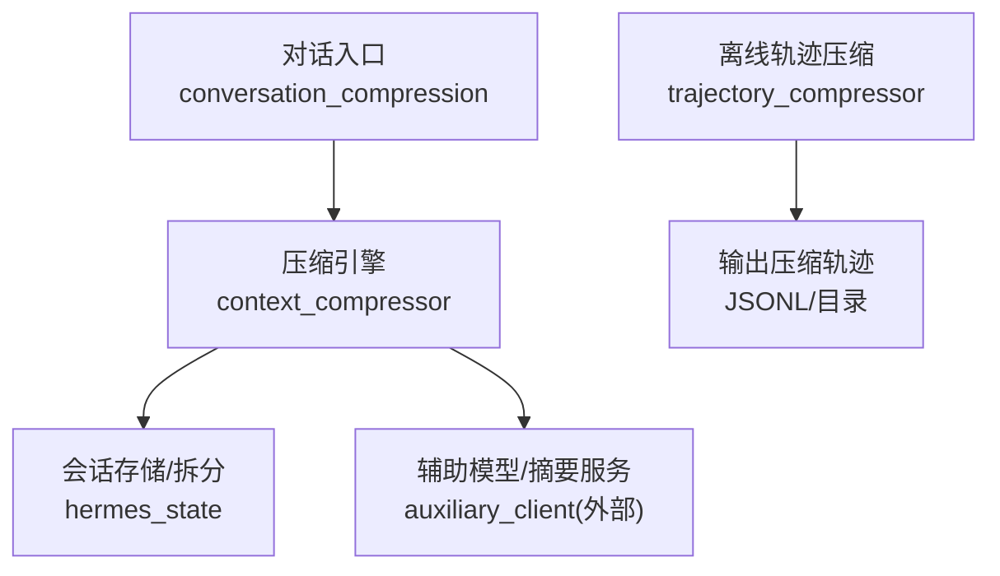
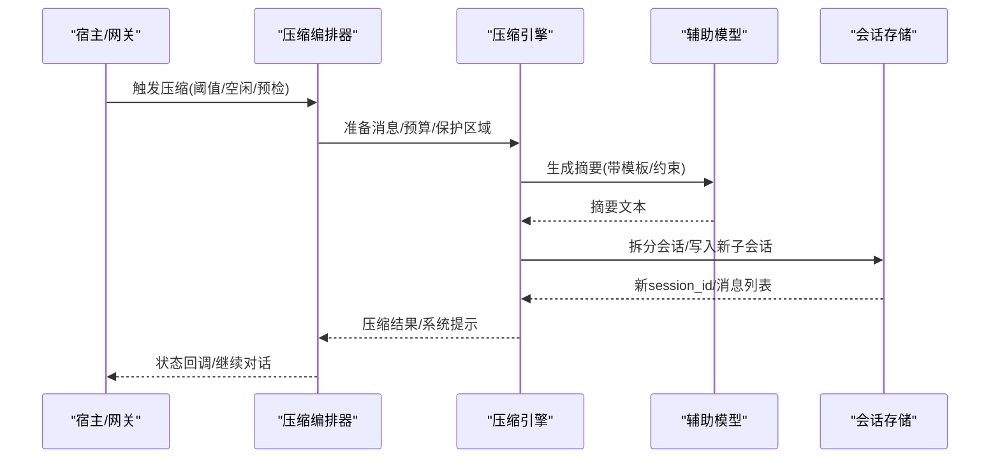
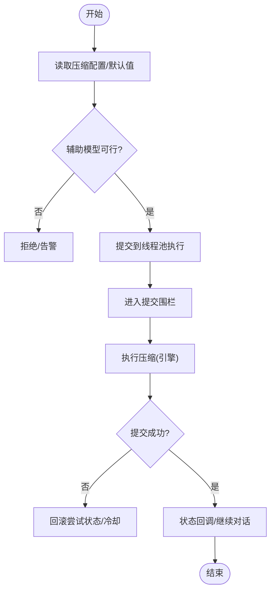
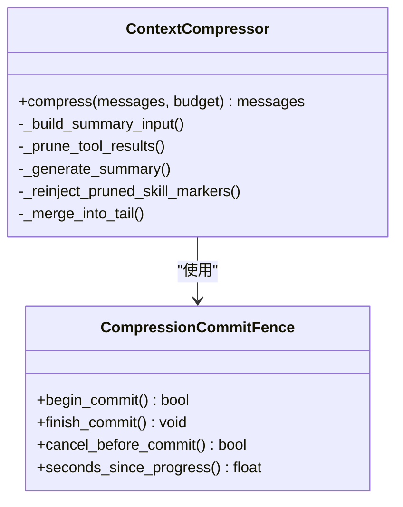
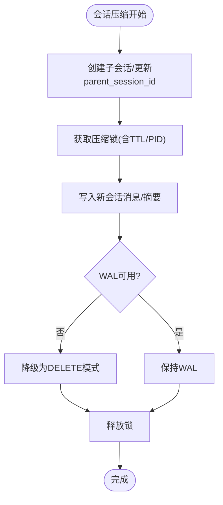
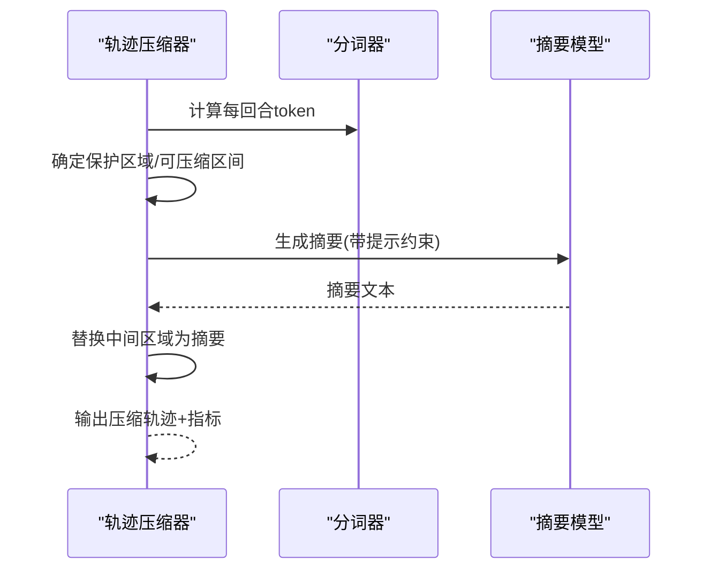
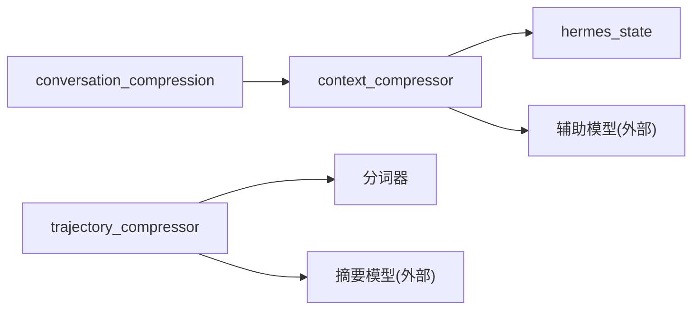

# 压缩算法实现

<cite>
**本文引用的文件**
- [agent/conversation_compression.py](file://agent/conversation_compression.py)
- [agent/context_compressor.py](file://agent/context_compressor.py)
- [trajectory_compressor.py](file://trajectory_compressor.py)
- [hermes_state.py](file://hermes_state.py)
</cite>

## 目录
1. [简介](#简介)
2. [项目结构](#项目结构)
3. [核心组件](#核心组件)
4. [架构总览](#架构总览)
5. [详细组件分析](#详细组件分析)
6. [依赖关系分析](#依赖关系分析)
7. [性能考量](#性能考量)
8. [故障排查指南](#故障排查指南)
9. [结论](#结论)
10. [附录](#附录)

## 简介
本文件系统性梳理 Hermes Agent 的对话压缩与轨迹压缩两大子系统，覆盖触发条件、阈值控制、渐进式压缩、LLM 摘要质量控制、关键信息保留策略、语义完整性保证、上下文重建与引用维护、状态同步、配置选项、性能基准与资源监控、失败恢复与质量检查，以及扩展与优化指导。目标是帮助开发者理解并安全地定制/扩展压缩能力，同时保障长会话下的稳定性与可观测性。

## 项目结构
- 运行时对话压缩：由 agent/conversation_compression.py 编排，调用 agent/context_compressor.py 执行具体压缩逻辑，并通过 hermes_state.py 完成会话拆分与持久化。
- 离线轨迹压缩：trajectory_compressor.py 提供对已完成轨迹的后处理压缩，用于训练数据瘦身与质量保留。
- 状态存储与并发：hermes_state.py 提供 SQLite 会话存储、WAL/DELETE 模式选择、压缩锁与会话链管理，确保压缩过程在并发环境中的安全性。

图示来源
- [agent/conversation_compression.py:1-120](file://agent/conversation_compression.py#L1-L120)
- [agent/context_compressor.py:1-180](file://agent/context_compressor.py#L1-L180)
- [hermes_state.py:813-1027](file://hermes_state.py#L813-L1027)

章节来源
- [agent/conversation_compression.py:1-120](file://agent/conversation_compression.py#L1-L120)
- [agent/context_compressor.py:1-180](file://agent/context_compressor.py#L1-L180)
- [hermes_state.py:813-1027](file://hermes_state.py#L813-L1027)

## 核心组件
- 压缩编排器（conversation_compression）：负责启动探测、超时与进度感知、提交围栏（CompressionCommitFence）、线程池隔离、状态提示与重试策略。
- 压缩引擎（context_compressor）：实现消息分片、保护头尾、工具输出裁剪、技能指令防“幽灵”丢失、摘要模板与边界标记、回退摘要、微压缩等。
- 状态存储（hermes_state）：会话拆分、父/子会话链、压缩锁、WAL/DELETE 模式选择与降级、并发安全。
- 轨迹压缩器（trajectory_compressor）：离线场景下按目标 token 预算压缩轨迹，保护首尾回合，中间区域替换为单条人类摘要。

章节来源
- [agent/conversation_compression.py:1-120](file://agent/conversation_compression.py#L1-L120)
- [agent/context_compressor.py:1-180](file://agent/context_compressor.py#L1-L180)
- [hermes_state.py:813-1027](file://hermes_state.py#L813-L1027)
- [trajectory_compressor.py:1-120](file://trajectory_compressor.py#L1-L120)

## 架构总览
对话压缩采用“编排 + 引擎 + 存储”的分层设计：
- 编排层：统一入口、超时控制、提交围栏、线程池隔离、状态通知。
- 引擎层：消息预处理、预算分配、摘要生成、回退策略、元数据注入。
- 存储层：会话拆分、父子链、压缩锁、WAL/DELETE 模式适配。

图示来源
- [agent/conversation_compression.py:445-691](file://agent/conversation_compression.py#L445-L691)
- [agent/context_compressor.py:100-180](file://agent/context_compressor.py#L100-L180)
- [hermes_state.py:813-1027](file://hermes_state.py#L813-L1027)

## 详细组件分析

### 压缩编排器（conversation_compression）
- 启动可行性探测：校验辅助压缩模型的上下文窗口是否满足阈值，必要时自动下调会话阈值或拒绝不合规辅助模型。
- 进度感知与超时：通过独立守护线程池执行压缩，避免阻塞主对话线程；支持空闲超时与总上限，防止长时间占用。
- 提交围栏（CompressionCommitFence）：确保取消与提交的原子性，避免部分提交导致的状态不一致；支持持有者限定锁释放，防止竞争。
- 状态提示与噪声过滤：定义标准提示模板，便于前端展示“正在压缩”，并在聊天平台屏蔽噪音。
- 重试与冷却：记录压缩节省比例、无效压缩次数、失败冷却时间，避免频繁触发导致的抖动。

图示来源
- [agent/conversation_compression.py:776-800](file://agent/conversation_compression.py#L776-L800)
- [agent/conversation_compression.py:445-691](file://agent/conversation_compression.py#L445-L691)

章节来源
- [agent/conversation_compression.py:1-120](file://agent/conversation_compression.py#L1-L120)
- [agent/conversation_compression.py:445-691](file://agent/conversation_compression.py#L445-L691)
- [agent/conversation_compression.py:776-800](file://agent/conversation_compression.py#L776-L800)

### 压缩引擎（context_compressor）
- 摘要质量控制：
  - 结构化模板：包含历史任务快照、待解决问题、剩余工作等分区，明确“仅参考非指令”。
  - 前缀/分隔符：使用稳定前缀与结束标记，避免模型误读为活跃任务。
  - 输入约束：限制摘要输入字符上限，避免慢后端超限或超时。
  - 最小摘要长度与比例：设定最低 token 数与比例，确保摘要具备足够信息密度。
- 关键信息保留策略：
  - 保护头尾：固定保护最近 N 条消息与系统提示、工具 schema 等不可压缩内容。
  - 工具输出裁剪：先做低成本预剪枝，再交给 LLM 摘要，减少冗余。
  - 技能指令防丢失：检测即将丢失的技能指令，插入“已裁剪”标记，必要时重注入。
- 语义完整性保证：
  - 角色交替兼容：针对 Mistral 家族模板的角色交替规则，调整摘要角色以避免请求被拒。
  - 合并尾部策略：当必须合并到第一条尾部消息时，使用分隔符包裹先前上下文，避免混淆。
  - 回退摘要：当 LLM 摘要失败时，使用确定性回退策略保留连续性锚点。
- 渐进式压缩与微压缩：
  - 微压缩失败保护：连续失败跳过卡住交换，避免忙循环。
  - 压力降级：在受保护区域内仍进行必要降级，但保留最近若干条完整消息。

图示来源
- [agent/context_compressor.py:100-180](file://agent/context_compressor.py#L100-L180)
- [agent/context_compressor.py:417-444](file://agent/context_compressor.py#L417-L444)
- [agent/context_compressor.py:585-621](file://agent/context_compressor.py#L585-L621)
- [agent/conversation_compression.py:445-691](file://agent/conversation_compression.py#L445-L691)

章节来源
- [agent/context_compressor.py:100-180](file://agent/context_compressor.py#L100-L180)
- [agent/context_compressor.py:417-444](file://agent/context_compressor.py#L417-L444)
- [agent/context_compressor.py:585-621](file://agent/context_compressor.py#L585-L621)
- [agent/conversation_compression.py:445-691](file://agent/conversation_compression.py#L445-L691)

### 状态存储与会话拆分（hermes_state）
- 会话拆分与父子链：压缩后创建子会话，维持 parent_session_id 链，便于回溯与导出。
- 压缩锁与会话并发：通过进程级 PID 标识与 TTL 机制，避免多进程竞争；支持死进程回收。
- WAL/DELETE 模式选择：根据文件系统兼容性自动选择 journal_mode，必要时降级至 DELETE，保证可用性。
- 测试隔离与生产保护：防止测试误写生产数据库，提供严格路径白名单与错误提示。

图示来源
- [hermes_state.py:813-1027](file://hermes_state.py#L813-L1027)
- [hermes_state.py:160-212](file://hermes_state.py#L160-L212)

章节来源
- [hermes_state.py:160-212](file://hermes_state.py#L160-L212)
- [hermes_state.py:813-1027](file://hermes_state.py#L813-L1027)

### 离线轨迹压缩（trajectory_compressor）
- 保护策略：保护首个 system/human/gpt/tool 与最后 N 条回合，仅压缩中间区域。
- 摘要生成：将中间区域转为单条人类摘要，保留工具调用与关键结果，目标 token 可控。
- 指标统计：记录原始/压缩 token、回合数、API 调用与错误率，便于评估与调优。
- 并发与重试：支持异步摘要与指数退避重试，提升吞吐与鲁棒性。

图示来源
- [trajectory_compressor.py:332-476](file://trajectory_compressor.py#L332-L476)
- [trajectory_compressor.py:605-742](file://trajectory_compressor.py#L605-L742)

章节来源
- [trajectory_compressor.py:332-476](file://trajectory_compressor.py#L332-L476)
- [trajectory_compressor.py:605-742](file://trajectory_compressor.py#L605-L742)

## 依赖关系分析
- conversation_compression 依赖 context_compressor 执行具体压缩，依赖 hermes_state 完成持久化与并发控制。
- context_compressor 依赖辅助模型客户端进行摘要生成，依赖模型元数据估算 token 与上下文长度。
- trajectory_compressor 依赖分词器与摘要模型，输出压缩后的轨迹与指标。

图示来源
- [agent/conversation_compression.py:1-120](file://agent/conversation_compression.py#L1-L120)
- [agent/context_compressor.py:1-180](file://agent/context_compressor.py#L1-L180)
- [hermes_state.py:813-1027](file://hermes_state.py#L813-L1027)
- [trajectory_compressor.py:332-476](file://trajectory_compressor.py#L332-L476)

章节来源
- [agent/conversation_compression.py:1-120](file://agent/conversation_compression.py#L1-L120)
- [agent/context_compressor.py:1-180](file://agent/context_compressor.py#L1-L180)
- [hermes_state.py:813-1027](file://hermes_state.py#L813-L1027)
- [trajectory_compressor.py:332-476](file://trajectory_compressor.py#L332-L476)

## 性能考量
- 线程池隔离与限流：压缩任务在守护线程池中执行，限制最大并发，避免队列无限增长；提交围栏确保取消与提交边界清晰。
- 进度感知与超时：支持空闲超时与总上限，结合进度标记区分“缓慢但活跃”与“挂起”，避免误杀慢模型。
- 摘要输入约束：限制摘要输入字符上限，降低慢后端风险；设置最小摘要长度与比例，平衡信息密度与成本。
- 工具输出裁剪：先做低成本预剪枝，减少 LLM 输入规模，提高吞吐。
- 存储模式选择：根据文件系统特性选择 WAL 或降级为 DELETE，保证可用性；在 macOS 上启用更严格的同步策略。

[本节提供通用指导，无需特定文件引用]

## 故障排查指南
- 压缩被阻止：当上下文超过阈值但压缩被冷却或反抖保护阻止时，会发出可见警告；建议等待冷却或手动触发 /compress。
- 摘要失败回退：若 LLM 摘要失败，将使用确定性回退摘要，保留连续性锚点；检查辅助模型凭据与配额。
- 技能指令丢失：若技能指令被裁剪，会在摘要中注入“已裁剪”标记；后续可通过 skill_view 重新加载。
- 会话存储不可用：若 state.db 初始化失败，会返回原因提示（如 NFS/SMB 不支持 WAL），并提供修复建议。
- 压缩锁冲突：若压缩锁持有进程已死亡，系统将尝试回收；否则等待 TTL 过期。

章节来源
- [agent/conversation_compression.py:150-180](file://agent/conversation_compression.py#L150-L180)
- [agent/context_compressor.py:73-95](file://agent/context_compressor.py#L73-L95)
- [hermes_state.py:674-694](file://hermes_state.py#L674-L694)
- [hermes_state.py:160-212](file://hermes_state.py#L160-L212)

## 结论
Hermes Agent 的压缩体系通过分层设计与严格的安全边界，实现了长会话的高效压缩与语义完整性保障。编排层提供超时与提交围栏，引擎层实现高质量摘要与关键信息保留，存储层确保并发安全与模式适配。离线轨迹压缩则为训练数据瘦身提供了可靠工具。开发者可基于现有接口扩展自定义规则与优化策略，同时利用指标与日志进行性能调优与问题定位。

[本节为总结性内容，无需特定文件引用]

## 附录
- 压缩配置选项（运行时）：
  - context_timeout_seconds：单次压缩空闲超时（秒），≤0 禁用进度感知包装。
  - total_ceiling_seconds：总上限（秒），用于整体压缩耗时控制。
  - 其他：保护头尾消息数、摘要比例、最小摘要 token、输入字符上限等。
- 扩展建议：
  - 自定义摘要模板：在 context_compressor 中调整提示结构与约束。
  - 自定义裁剪规则：在工具输出裁剪阶段加入领域知识。
  - 自定义回退策略：在摘要失败时提供更丰富的连续性信息。
- 性能调优：
  - 调整线程池大小与并发限制，匹配部署环境。
  - 根据模型能力调整摘要输入上限与最小长度。
  - 监控摘要 API 调用与错误率，优化重试与冷却策略。

[本节为通用指导，无需特定文件引用]