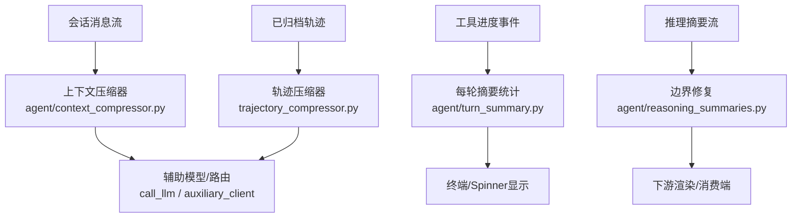
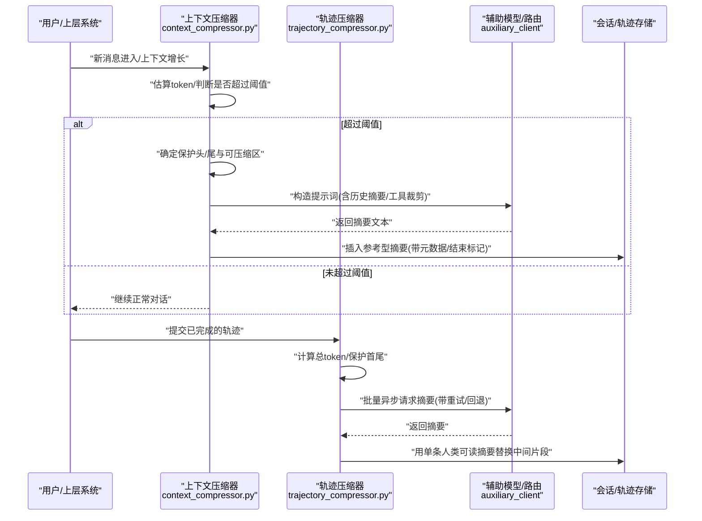
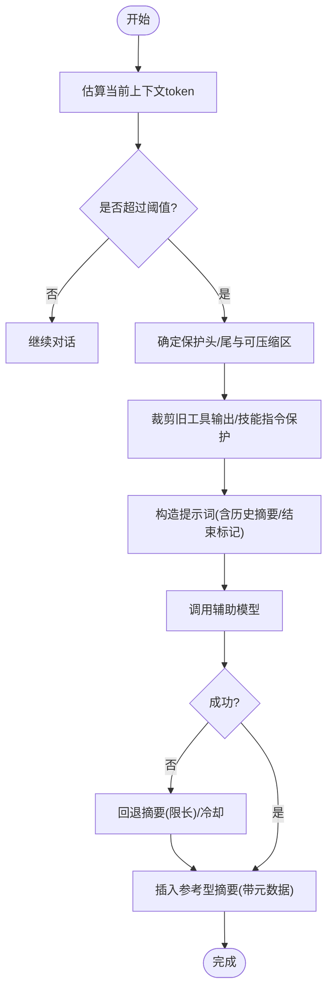
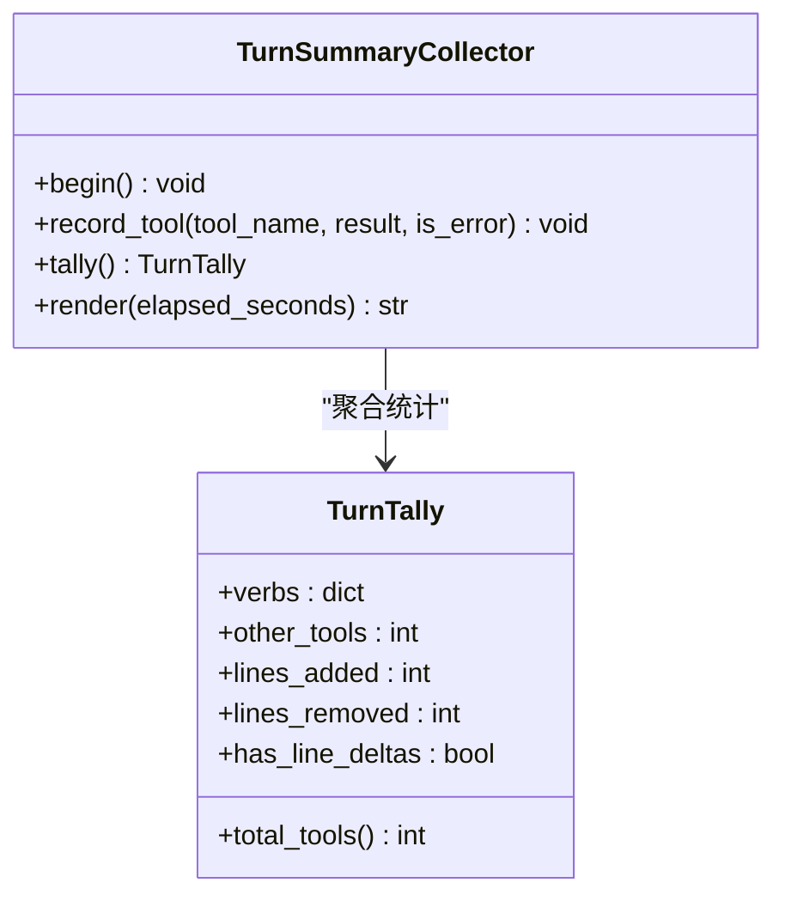
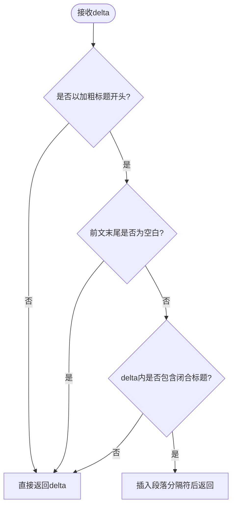
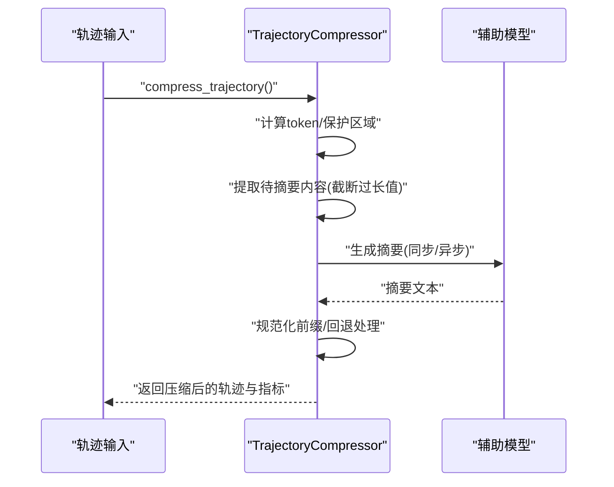
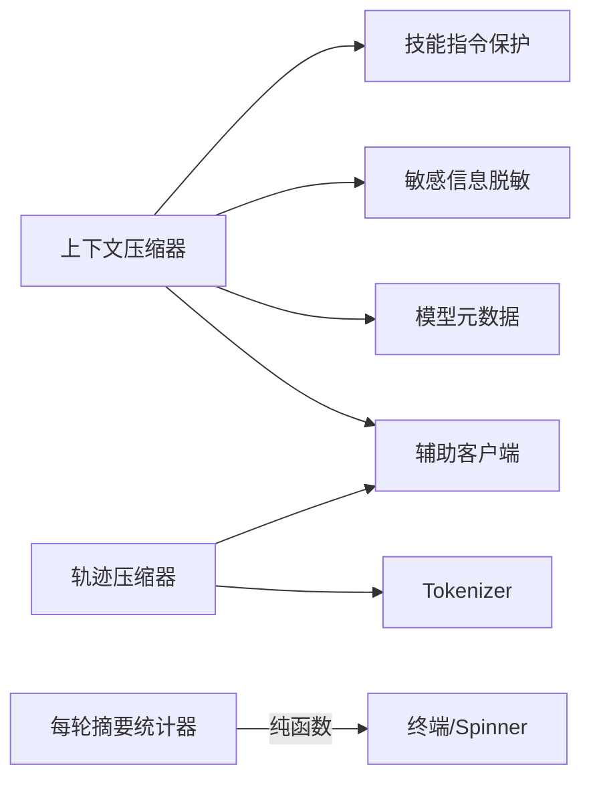

# 摘要生成器

<cite>
**本文引用的文件**
- [agent/context_compressor.py](file://agent/context_compressor.py)
- [agent/turn_summary.py](file://agent/turn_summary.py)
- [agent/reasoning_summaries.py](file://agent/reasoning_summaries.py)
- [trajectory_compressor.py](file://trajectory_compressor.py)
- [tests/agent/test_turn_summary.py](file://tests/agent/test_turn_summary.py)
</cite>

## 目录
1. [简介](#简介)
2. [项目结构](#项目结构)
3. [核心组件](#核心组件)
4. [架构总览](#架构总览)
5. [详细组件分析](#详细组件分析)
6. [依赖关系分析](#依赖关系分析)
7. [性能考量](#性能考量)
8. [故障排查指南](#故障排查指南)
9. [结论](#结论)
10. [附录](#附录)

## 简介
本文件面向“摘要生成器”的完整技术文档，聚焦于大模型（LLM）驱动的对话与轨迹摘要能力。内容覆盖：
- 摘要质量评估标准、关键信息保留策略与语义完整性保证
- 触发条件、阈值控制与渐进式优化机制
- 效果评估指标、性能基准测试与资源消耗监控
- 摘要缓存、增量更新与版本管理
- 灵活配置项、自定义规则与性能调优
- 失败恢复、降级机制与质量检查流程
- 扩展算法与优化效果的开发者指导

本仓库实现了两类摘要能力：
- 会话级上下文压缩摘要：在长对话中自动压缩中间轮次，保护首尾关键上下文，输出结构化参考型摘要并持续迭代更新
- 轨迹级离线压缩摘要：对已完成轨迹进行批处理压缩，将中间多轮替换为单条人类可读摘要，便于训练或归档

## 项目结构
围绕摘要生成的核心代码分布在以下模块：
- agent/context_compressor.py：在线会话上下文压缩摘要主逻辑，包含触发阈值、保护区域、提示词模板、工具结果裁剪、技能指令防丢失、失败回退等
- agent/turn_summary.py：每轮工具调用统计与展示行格式化（CLI/Spinner），用于可观测性与用户反馈
- agent/reasoning_summaries.py：修复推理摘要流拼接边界问题，确保段落分隔正确
- trajectory_compressor.py：离线轨迹压缩器，按目标token预算选择可压缩区域，调用辅助模型生成摘要并替换原片段
- tests/agent/test_turn_summary.py：针对每轮摘要统计器的单元测试，验证行为与边界

**图表来源**
- [agent/context_compressor.py:100-160](file://agent/context_compressor.py#L100-L160)
- [agent/turn_summary.py:163-220](file://agent/turn_summary.py#L163-L220)
- [agent/reasoning_summaries.py:37-67](file://agent/reasoning_summaries.py#L37-L67)
- [trajectory_compressor.py:332-412](file://trajectory_compressor.py#L332-L412)

**章节来源**
- [agent/context_compressor.py:100-160](file://agent/context_compressor.py#L100-L160)
- [agent/turn_summary.py:163-220](file://agent/turn_summary.py#L163-L220)
- [agent/reasoning_summaries.py:37-67](file://agent/reasoning_summaries.py#L37-L67)
- [trajectory_compressor.py:332-412](file://trajectory_compressor.py#L332-L412)

## 核心组件
- 上下文压缩摘要器（在线）
  - 负责检测上下文压力、选择可压缩区域、构造提示词、调用辅助模型生成摘要、维护历史快照与技能指令标记、失败回退与冷却
- 每轮摘要统计器（CLI/Spinner）
  - 收集工具调用计数、差异行数、耗时，生成一行可读摘要；支持节流与最小无工具轮阈值
- 推理摘要边界修复
  - 识别摘要块边界，避免多段拼接导致格式损坏
- 轨迹压缩器（离线）
  - 计算token预算、保护首尾、选择中间区域、批量异步调用辅助模型生成摘要、写入带前缀的人类可读摘要

**章节来源**
- [agent/context_compressor.py:100-160](file://agent/context_compressor.py#L100-L160)
- [agent/turn_summary.py:88-107](file://agent/turn_summary.py#L88-L107)
- [agent/reasoning_summaries.py:37-67](file://agent/reasoning_summaries.py#L37-L67)
- [trajectory_compressor.py:82-119](file://trajectory_compressor.py#L82-L119)

## 架构总览
下图展示了在线与离线两条摘要路径以及它们如何与辅助模型交互，并体现保护区域、阈值控制与失败回退。

**图表来源**
- [agent/context_compressor.py:100-160](file://agent/context_compressor.py#L100-L160)
- [trajectory_compressor.py:605-741](file://trajectory_compressor.py#L605-L741)

## 详细组件分析

### 上下文压缩摘要器（在线）
- 触发条件与阈值
  - 基于模型上下文长度与当前占用估算，当接近或超过阈值时触发压缩
  - 小窗口模型采用更高阈值比例以避免频繁压缩
- 保护区域
  - 保护系统提示、首轮人类与助手、最近N条消息（按token预算而非固定数量）
  - 通过“可见角色”计算规避模板交替校验导致的拒绝
- 提示词与模板
  - 使用强约束的前缀说明该摘要是“参考”，不执行其中任务
  - 附加明确的“摘要结束”标记，防止模型误读
  - 历史任务快照标题替代活跃指令，避免被当作新任务
- 工具结果裁剪与技能指令保护
  - 压缩前对旧工具输出进行裁剪，减少提示词体积
  - 对skill_view指令进行保护与重注入，防止“幽灵技能”
- 失败回退与冷却
  - 非重试错误（鉴权/配额）直接跳过
  - 连续失败冷却，避免忙循环
  - 回退摘要限制最大字符数，保持连续性但不膨胀
- 增量更新与版本管理
  - 滚动微压缩标记与批次压缩标记区分，支持续传与重组
  - 历史前缀兼容列表，确保跨版本重建时能正确识别与标准化

**图表来源**
- [agent/context_compressor.py:100-160](file://agent/context_compressor.py#L100-L160)
- [agent/context_compressor.py:417-443](file://agent/context_compressor.py#L417-L443)
- [agent/context_compressor.py:764-782](file://agent/context_compressor.py#L764-L782)

**章节来源**
- [agent/context_compressor.py:100-160](file://agent/context_compressor.py#L100-L160)
- [agent/context_compressor.py:417-443](file://agent/context_compressor.py#L417-L443)
- [agent/context_compressor.py:764-782](file://agent/context_compressor.py#L764-L782)

### 每轮摘要统计器（CLI/Spinner）
- 功能
  - 记录工具调用次数、编辑差异行数、耗时
  - 生成一行可读摘要，支持最多分段截断与“更多”尾部
  - 无工具且耗时低于阈值的轮次不输出，避免噪音
- 关键点
  - 仅统计成功的工具调用，避免夸大
  - 差异行数从工具结果中提取，未知时不显示误导性的“+0 -0”
  - 支持累计token流显示，提升可观测性

**图表来源**
- [agent/turn_summary.py:88-107](file://agent/turn_summary.py#L88-L107)
- [agent/turn_summary.py:163-220](file://agent/turn_summary.py#L163-L220)

**章节来源**
- [agent/turn_summary.py:88-107](file://agent/turn_summary.py#L88-L107)
- [agent/turn_summary.py:163-220](file://agent/turn_summary.py#L163-L220)
- [tests/agent/test_turn_summary.py:50-86](file://tests/agent/test_turn_summary.py#L50-L86)
- [tests/agent/test_turn_summary.py:208-231](file://tests/agent/test_turn_summary.py#L208-L231)

### 推理摘要边界修复
- 问题
  - 某些提供商以“摘要块”形式流式返回，Chat Completions通道缺少分界字段，导致相邻块拼接成无空格的半粗体段落
- 解决
  - 检测新块以加粗标题开头且与前文未换行时，插入段落分隔符
  - 对token流式摘要（自带空白）不做修改

**图表来源**
- [agent/reasoning_summaries.py:37-67](file://agent/reasoning_summaries.py#L37-L67)

**章节来源**
- [agent/reasoning_summaries.py:37-67](file://agent/reasoning_summaries.py#L37-L67)

### 轨迹压缩器（离线）
- 策略
  - 保护首轮系统/人类/助手/工具，保护尾部N轮
  - 仅压缩中间区域，从第二个工具响应开始
  - 将压缩区域替换为单条人类可读摘要，保留后续工具调用
- 配置
  - 目标token预算、摘要目标token、温度、重试次数、并发度、超时、指标开关等
- 实现要点
  - 使用HuggingFace tokenizer计数
  - 通过统一辅助客户端或OpenAI直连调用
  - 失败重试与指数退避，最终回退到基础摘要
  - 指标记录：原始/压缩token、压缩比、API调用与错误数

**图表来源**
- [trajectory_compressor.py:743-800](file://trajectory_compressor.py#L743-L800)
- [trajectory_compressor.py:605-741](file://trajectory_compressor.py#L605-L741)

**章节来源**
- [trajectory_compressor.py:82-119](file://trajectory_compressor.py#L82-L119)
- [trajectory_compressor.py:332-412](file://trajectory_compressor.py#L332-L412)
- [trajectory_compressor.py:605-741](file://trajectory_compressor.py#L605-L741)
- [trajectory_compressor.py:743-800](file://trajectory_compressor.py#L743-L800)

## 依赖关系分析
- 上下文压缩摘要器依赖：
  - 辅助模型路由（call_llm/async_call_llm）
  - 模型元数据（上下文长度估计）
  - 敏感信息脱敏（redact_sensitive_text）
  - 工具/技能相关逻辑（skill_view调用点、技能指令保护）
- 轨迹压缩器依赖：
  - HuggingFace tokenizer
  - OpenAI客户端或统一辅助客户端
  - 重试与退避工具
- CLI摘要统计器：
  - 纯函数与数据结构，无外部I/O，便于测试

**图表来源**
- [agent/context_compressor.py:28-43](file://agent/context_compressor.py#L28-L43)
- [trajectory_compressor.py:357-412](file://trajectory_compressor.py#L357-L412)
- [agent/turn_summary.py:163-220](file://agent/turn_summary.py#L163-L220)

**章节来源**
- [agent/context_compressor.py:28-43](file://agent/context_compressor.py#L28-L43)
- [trajectory_compressor.py:357-412](file://trajectory_compressor.py#L357-L412)
- [agent/turn_summary.py:163-220](file://agent/turn_summary.py#L163-L220)

## 性能考量
- 触发与阈值
  - 小窗口模型提高阈值比例，避免频繁压缩
  - 可压缩区域最小分数阈值，低于阈值则跳过LLM调用
- 提示词体积控制
  - 摘要输入字符上限，避免慢后端超时
  - 工具输出裁剪与技能指令保护，减少无效内容
- 并发与重试
  - 轨迹压缩支持并发请求与指数退避
  - 失败冷却与回退，保障稳定性
- 资源监控
  - 指标记录：token节省、压缩比、API调用与错误率、处理时长
  - 每轨迹指标与聚合指标，便于定位瓶颈

[本节提供通用指导，无需特定文件引用]

## 故障排查指南
- 鉴权/配额错误
  - 非重试错误直接跳过压缩，避免阻塞会话
- 摘要失败回退
  - 多次重试后回退到基础摘要，限制字符数，保持连续性
- 技能指令丢失
  - 通过“剪枝标记”检测与重注入，确保技能可用
- 模板交替错误
  - 使用“可见角色”计算避免Mistral家族模板拒绝
- 推理摘要拼接问题
  - 边界修复函数确保段落分隔正确

**章节来源**
- [agent/context_compressor.py:73-95](file://agent/context_compressor.py#L73-L95)
- [agent/context_compressor.py:713-724](file://agent/context_compressor.py#L713-L724)
- [agent/context_compressor.py:585-621](file://agent/context_compressor.py#L585-L621)
- [agent/context_compressor.py:201-228](file://agent/context_compressor.py#L201-L228)
- [agent/reasoning_summaries.py:37-67](file://agent/reasoning_summaries.py#L37-L67)

## 结论
本项目的摘要生成器提供了在线与离线两种模式，具备严格的触发阈值、保护区域、提示词工程、失败回退与指标监控。通过技能指令保护、工具输出裁剪与推理摘要边界修复，确保了关键信息保留与语义完整性。开发者可基于现有配置与接口扩展自定义规则与算法，进一步优化摘要效果与性能。

[本节总结性内容，无需特定文件引用]

## 附录

### 摘要质量评估指标
- 压缩比：压缩后token/原始token
- 节省token：原始token-压缩后token
- API成功率：成功调用/总调用
- 处理时长：单次/批量处理时间
- 摘要长度分布：平均/中位数/方差

**章节来源**
- [trajectory_compressor.py:182-329](file://trajectory_compressor.py#L182-L329)

### 配置选项与调优建议
- 目标token预算与摘要目标token：平衡压缩强度与摘要质量
- 温度与max_tokens：控制摘要创造性与长度
- 重试次数与延迟：提高鲁棒性
- 并发度与超时：提升吞吐与稳定性
- 指标开关：开启详细度量以便分析

**章节来源**
- [trajectory_compressor.py:82-119](file://trajectory_compressor.py#L82-L119)

### 开发者扩展指南
- 自定义摘要规则
  - 调整提示词模板与历史摘要前缀，强化领域知识
  - 增加技能指令白名单或黑名单
- 算法扩展
  - 替换辅助模型或路由，适配不同提供商
  - 引入更精细的工具输出裁剪策略
- 性能调优
  - 调整并发度与超时，匹配后端能力
  - 启用指标监控，定位瓶颈

[本节提供通用指导，无需特定文件引用]