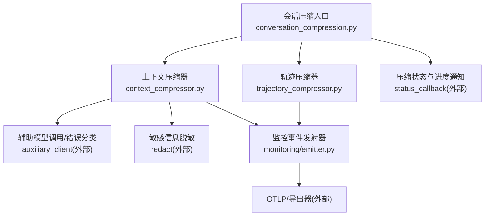
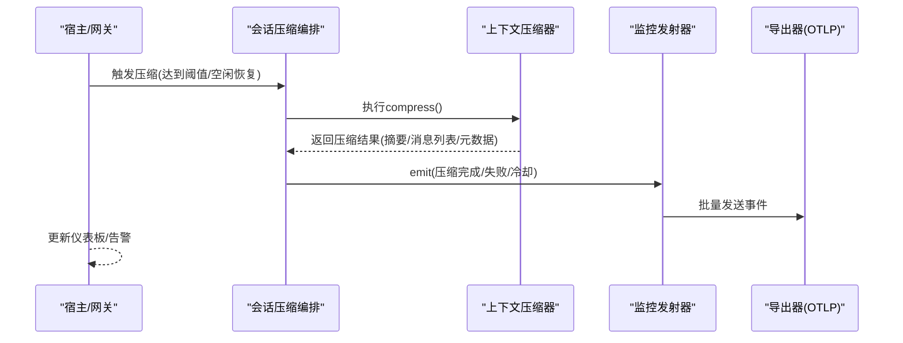
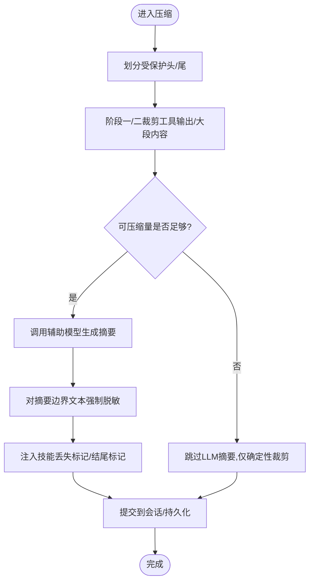
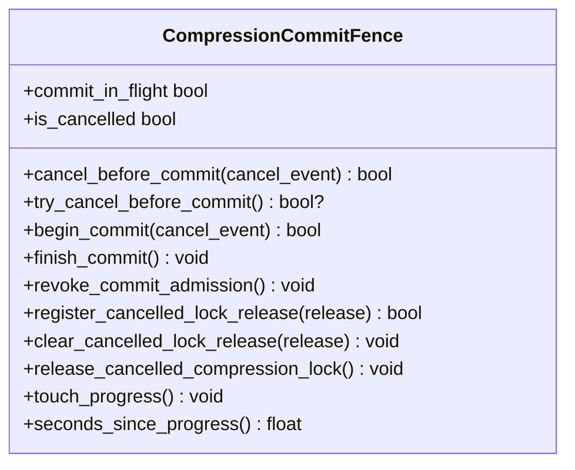
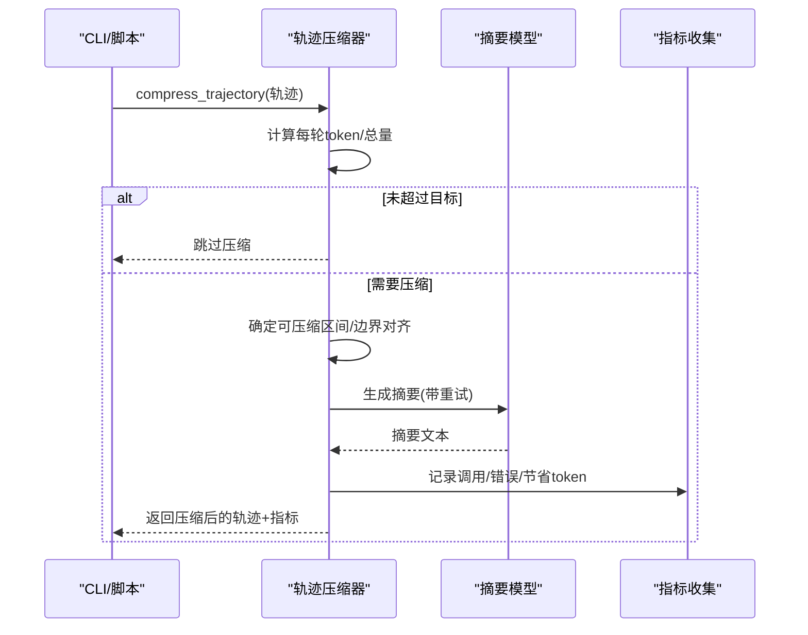
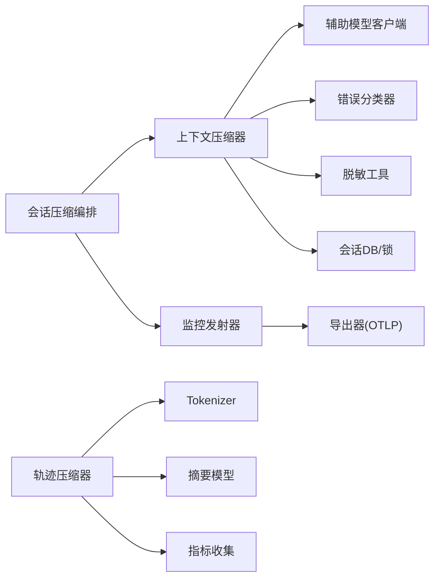

# 质量评估器

<cite>
**本文引用的文件**
- [agent/context_compressor.py](file://agent/context_compressor.py)
- [agent/conversation_compression.py](file://agent/conversation_compression.py)
- [agent/manual_compression_feedback.py](file://agent/manual_compression_feedback.py)
- [trajectory_compressor.py](file://trajectory_compressor.py)
- [agent/monitoring/emitter.py](file://agent/monitoring/emitter.py)
- [agent/monitoring/events.py](file://agent/monitoring/events.py)
</cite>

## 目录
1. [简介](#简介)
2. [项目结构](#项目结构)
3. [核心组件](#核心组件)
4. [架构总览](#架构总览)
5. [详细组件分析](#详细组件分析)
6. [依赖关系分析](#依赖关系分析)
7. [性能考量](#性能考量)
8. [故障排查指南](#故障排查指南)
9. [结论](#结论)
10. [附录](#附录)

## 简介
本文件围绕“压缩质量评估”构建一套可操作、可扩展的评估体系，覆盖评分模型、评估维度与权重、一致性检查、语义完整性验证、信息丢失检测、阈值动态调整、自适应评估与反馈学习，以及监控仪表板、告警机制与趋势分析。同时提供配置选项、自定义指标与规则扩展方法，并给出诊断工具、根因分析与修复建议，帮助开发者优化评估准确性与稳定性。

## 项目结构
仓库中与压缩质量评估直接相关的代码主要分布在以下模块：
- 会话上下文压缩与摘要生成：agent/context_compressor.py、agent/conversation_compression.py
- 轨迹离线压缩与指标统计：trajectory_compressor.py
- 用户侧压缩反馈与提示：agent/manual_compression_feedback.py
- 监控事件与发射器（用于质量指标上报）：agent/monitoring/emitter.py、agent/monitoring/events.py

图表来源
- [agent/conversation_compression.py:1-120](file://agent/conversation_compression.py#L1-L120)
- [agent/context_compressor.py:1-180](file://agent/context_compressor.py#L1-L180)
- [trajectory_compressor.py:1-120](file://trajectory_compressor.py#L1-L120)
- [agent/monitoring/emitter.py:1-120](file://agent/monitoring/emitter.py#L1-L120)

章节来源
- [agent/conversation_compression.py:1-120](file://agent/conversation_compression.py#L1-L120)
- [agent/context_compressor.py:1-180](file://agent/context_compressor.py#L1-L180)
- [trajectory_compressor.py:1-120](file://trajectory_compressor.py#L1-L120)
- [agent/monitoring/emitter.py:1-120](file://agent/monitoring/emitter.py#L1-L120)

## 核心组件
- 上下文压缩器（ContextCompressor）：负责在长对话中自动压缩中间历史，生成结构化摘要，保护首尾关键上下文，维护滚动摘要与技能指令保留标记，处理配额/鉴权失败等不可重试错误，并对跨边界文本进行严格脱敏。
- 会话压缩编排（conversation_compression）：封装压缩流程、超时与提交围栏（CompressionCommitFence）、并发池限制、状态模板与失败冷却期、回退策略与用户可见状态。
- 轨迹压缩器（TrajectoryCompressor）：对已完成轨迹进行离线压缩，按目标token预算裁剪中间区域，生成摘要替换被压缩区域，输出单条/聚合指标。
- 手动压缩反馈（manual_compression_feedback）：将压缩结果、是否中止、是否使用回退、token变化等信息组织为用户可读的反馈。
- 监控发射器（MonitoringEmitter）：非阻塞事件队列+后台分发，支持批量订阅与隔离失败；配合事件类型用于质量指标上报。

章节来源
- [agent/context_compressor.py:1-180](file://agent/context_compressor.py#L1-L180)
- [agent/conversation_compression.py:1-120](file://agent/conversation_compression.py#L1-L120)
- [trajectory_compressor.py:1-120](file://trajectory_compressor.py#L1-L120)
- [agent/manual_compression_feedback.py:1-121](file://agent/manual_compression_feedback.py#L1-L121)
- [agent/monitoring/emitter.py:1-120](file://agent/monitoring/emitter.py#L1-L120)

## 架构总览
质量评估由“压缩执行 + 指标采集 + 监控上报”三部分构成：
- 压缩执行：会话压缩与轨迹压缩分别在不同路径运行，均产出“压缩前/后”的元数据（消息数、token估算、摘要长度、是否回退、是否中止）。
- 指标采集：通过内置常量、状态字段与轨迹指标对象记录关键质量信号（如压缩比、丢弃消息数、摘要失败次数、冷却期等）。
- 监控上报：通过 MonitoringEmitter 将健康与诊断事件以批方式发送到 OTLP 或其他导出器，供仪表板与告警消费。

图表来源
- [agent/conversation_compression.py:1-120](file://agent/conversation_compression.py#L1-L120)
- [agent/context_compressor.py:1-180](file://agent/context_compressor.py#L1-L180)
- [agent/monitoring/emitter.py:1-120](file://agent/monitoring/emitter.py#L1-L120)

## 详细组件分析

### 上下文压缩器（ContextCompressor）
- 摘要生成与模板：为摘要注入强约束的前缀与结束标记，避免模型误把历史当作当前任务继续执行；维护“历史任务快照”等标题，防止旧任务被重新激活。
- 保护区域：保护头部与尾部（含最近消息、工具调用/结果），并在高压力场景下仍保留若干最近消息，确保活跃任务可被正确理解。
- 技能指令防幽灵丢失：识别即将被压缩的技能指令，插入确定性标记以便后续重加载；对已存在的标记做去重与上限控制。
- 安全与合规：跨摘要边界的文本强制脱敏，包含URL凭据；对鉴权/配额类错误进行不可重试判定，避免反复失败。
- 可行性跳过与输入截断：当可压缩内容过少时跳过LLM调用；对摘要输入字符总量做上限，避免慢后端超时或越界。

图表来源
- [agent/context_compressor.py:100-180](file://agent/context_compressor.py#L100-L180)
- [agent/context_compressor.py:417-453](file://agent/context_compressor.py#L417-L453)
- [agent/context_compressor.py:764-783](file://agent/context_compressor.py#L764-L783)

章节来源
- [agent/context_compressor.py:100-180](file://agent/context_compressor.py#L100-L180)
- [agent/context_compressor.py:417-453](file://agent/context_compressor.py#L417-L453)
- [agent/context_compressor.py:764-783](file://agent/context_compressor.py#L764-L783)

### 会话压缩编排（conversation_compression）
- 启动探测与阈值调整：探测辅助压缩模型的上下文窗口是否满足主模型阈值，必要时自动下调会话阈值或拒绝不满足的最小上下文。
- 超时与提交围栏：提供进度感知超时、总时长上限、提交围栏（begin_commit/finish_commit）与取消撤销，避免长时间挂起或中途篡改会话。
- 并发与饱和保护：限制压缩工作池大小，全部占用时快速失败，避免队列无限增长。
- 状态模板与可见性：定义各类压缩状态文案，屏蔽聊天平台噪音，但保留必要的失败警告。
- 回退与冷却：摘要失败时使用有限回退上下文，记录冷却期与失败原因，避免频繁重试。

图表来源
- [agent/conversation_compression.py:445-691](file://agent/conversation_compression.py#L445-L691)

章节来源
- [agent/conversation_compression.py:1-120](file://agent/conversation_compression.py#L1-L120)
- [agent/conversation_compression.py:445-691](file://agent/conversation_compression.py#L445-L691)
- [agent/conversation_compression.py:776-800](file://agent/conversation_compression.py#L776-L800)

### 轨迹压缩器（TrajectoryCompressor）
- 策略：保护系统/首轮人机/首轮工具，保护尾部N轮，仅压缩中间区域，用单条人类摘要替换被压缩区域，其余保持完整。
- Token计数与边界对齐：基于tokenizer统计token，边界对齐避免切断tool调用与其响应。
- 摘要生成：支持同步/异步调用，带重试与指数退避；失败时降级为固定提示。
- 指标：记录原始/压缩token、压缩比、删除轮次、摘要API调用与错误数等，并汇总为聚合指标。

图表来源
- [trajectory_compressor.py:332-458](file://trajectory_compressor.py#L332-L458)
- [trajectory_compressor.py:605-673](file://trajectory_compressor.py#L605-L673)
- [trajectory_compressor.py:743-800](file://trajectory_compressor.py#L743-L800)

章节来源
- [trajectory_compressor.py:82-124](file://trajectory_compressor.py#L82-L124)
- [trajectory_compressor.py:182-330](file://trajectory_compressor.py#L182-L330)
- [trajectory_compressor.py:332-458](file://trajectory_compressor.py#L332-L458)
- [trajectory_compressor.py:605-673](file://trajectory_compressor.py#L605-L673)
- [trajectory_compressor.py:743-800](file://trajectory_compressor.py#L743-L800)

### 手动压缩反馈（manual_compression_feedback）
- 将压缩前后消息数、token估算、是否中止/回退/无变更等信息组合为用户可读的反馈，并对失败原因进行强制脱敏，避免泄露凭据。

章节来源
- [agent/manual_compression_feedback.py:1-121](file://agent/manual_compression_feedback.py#L1-L121)

### 监控与事件（emitter/events）
- 发射器：非阻塞入队、后台批量分发、订阅者隔离失败；提供flush/stats/close等运维接口。
- 事件类型：网关健康、诊断、定时任务执行等，便于接入统一观测平台。

章节来源
- [agent/monitoring/emitter.py:1-212](file://agent/monitoring/emitter.py#L1-L212)
- [agent/monitoring/events.py:1-87](file://agent/monitoring/events.py#L1-L87)

## 依赖关系分析
- 上下文压缩器依赖：
  - 辅助模型客户端（用于摘要生成）
  - 错误分类器（鉴权/配额/速率限制）
  - 脱敏工具（跨边界文本强制脱敏）
  - 会话数据库/状态（持久化与锁）
- 会话压缩编排依赖：
  - 上下文压缩器
  - 监控发射器（上报压缩生命周期）
  - 状态回调（向TUI/桌面端展示“正在压缩”）
- 轨迹压缩器依赖：
  - tokenizer（token计数）
  - 摘要模型（OpenRouter/其他兼容接口）
  - 指标收集（单条/聚合）
- 监控层：
  - 所有压缩路径均可通过发射器上报健康/诊断事件，供仪表板与告警消费。

图表来源
- [agent/context_compressor.py:1-180](file://agent/context_compressor.py#L1-L180)
- [agent/conversation_compression.py:1-120](file://agent/conversation_compression.py#L1-L120)
- [trajectory_compressor.py:332-458](file://trajectory_compressor.py#L332-L458)
- [agent/monitoring/emitter.py:1-120](file://agent/monitoring/emitter.py#L1-L120)

章节来源
- [agent/context_compressor.py:1-180](file://agent/context_compressor.py#L1-L180)
- [agent/conversation_compression.py:1-120](file://agent/conversation_compression.py#L1-L120)
- [trajectory_compressor.py:332-458](file://trajectory_compressor.py#L332-L458)
- [agent/monitoring/emitter.py:1-120](file://agent/monitoring/emitter.py#L1-L120)

## 性能考量
- 摘要输入上限：对摘要输入字符总量设置上限，避免慢后端超时或超出上下文限制。
- 小上下文阈值下限：对小窗口模型提高触发阈值比例，减少频繁压缩导致的空转。
- 并发与饱和：压缩工作池有最大并发限制，全部占用时快速失败，避免队列膨胀。
- 提交围栏与超时：提供进度感知超时与总时长上限，避免长时间阻塞；提交阶段可观察是否卡住并告警。
- 摘要失败冷却：失败后进入冷却期，降低重试频率，减少无效开销。

[本节为通用性能指导，不直接分析具体文件]

## 故障排查指南
- 鉴权/配额错误：
  - 现象：摘要生成返回401/402/403或明确配额耗尽提示。
  - 处理：上下文压缩器将其视为不可重试错误，停止尝试；需检查密钥/额度。
- 摘要失败与回退：
  - 现象：摘要生成失败，使用回退上下文，消息数减少但可能仍超限。
  - 处理：查看压缩反馈中的“回退使用”和“失败原因”，必要时清理大工具输出或缩短尾部。
- 压缩被锁定：
  - 现象：手动压缩被跳过，提示存在持有者或获取锁失败。
  - 处理：等待已有压缩完成或排查锁子系统异常。
- 压缩超时/总时长超限：
  - 现象：压缩被终止或无法提交。
  - 处理：检查摘要模型响应速度、网络状况；适当调大超时或降低摘要输入规模。
- 技能指令丢失：
  - 现象：模型认为技能仍加载但实际指令已被压缩。
  - 处理：关注“已裁剪技能”标记，必要时重新加载技能。

章节来源
- [agent/context_compressor.py:73-95](file://agent/context_compressor.py#L73-L95)
- [agent/context_compressor.py:764-783](file://agent/context_compressor.py#L764-L783)
- [agent/manual_compression_feedback.py:40-121](file://agent/manual_compression_feedback.py#L40-L121)
- [agent/conversation_compression.py:445-691](file://agent/conversation_compression.py#L445-L691)

## 结论
本质量评估体系以“压缩执行 + 指标采集 + 监控上报”为核心，覆盖从触发、执行到反馈的全链路。通过严格的摘要模板、保护区域、脱敏与安全策略，结合超时/冷却/回退等鲁棒机制，保障压缩过程稳定可靠。借助轨迹压缩器的指标与监控发射器的事件，可实现可视化仪表板、告警与趋势分析，并为持续优化提供数据基础。

[本节为总结性内容，不直接分析具体文件]

## 附录

### 质量评分模型、评估维度与权重
- 维度建议
  - 压缩有效性：压缩后token/消息数下降幅度、是否达到目标预算。
  - 语义完整性：摘要是否保留关键事实、决策与数据；是否出现“技能指令丢失”。
  - 一致性：压缩前后任务意图一致，未误将历史作为新任务。
  - 安全性：跨边界文本是否脱敏，是否避免泄露凭据。
  - 稳定性：失败率、冷却期命中率、超时/饱和情况。
- 权重建议（可按场景调整）
  - 压缩有效性：30%
  - 语义完整性：30%
  - 一致性：20%
  - 安全性：10%
  - 稳定性：10%
- 评分方法
  - 将各维度量化为0-1分数，加权求和得到综合分；低于阈值则触发告警与回退策略。

[本节为概念性说明，不直接分析具体文件]

### 一致性检查、语义完整性验证与信息丢失检测
- 一致性检查
  - 通过摘要前缀与结束标记，确保模型只响应最新用户消息；历史部分不被当作新任务。
- 语义完整性验证
  - 保留关键事实、工具调用结果、文件名与数值；对技能指令进行标记与保护，避免“幽灵技能”。
- 信息丢失检测
  - 监测“已裁剪技能”标记数量与位置；若出现过多，调整裁剪策略或扩大保护区域。

章节来源
- [agent/context_compressor.py:100-180](file://agent/context_compressor.py#L100-L180)
- [agent/context_compressor.py:486-621](file://agent/context_compressor.py#L486-L621)

### 阈值动态调整、自适应评估与反馈学习
- 动态阈值
  - 根据辅助模型上下文窗口与主模型阈值，自动下调会话压缩阈值，避免过小窗口导致频繁压缩。
- 自适应评估
  - 基于历史压缩效果（如多次无效压缩）启用可行性跳过，减少无效LLM调用。
- 反馈学习
  - 利用压缩反馈（是否回退、失败原因、冷却期）调整触发条件与参数；结合监控事件进行趋势分析。

章节来源
- [agent/conversation_compression.py:1-120](file://agent/conversation_compression.py#L1-L120)
- [agent/context_compressor.py:417-453](file://agent/context_compressor.py#L417-L453)

### 质量监控仪表板、告警机制与趋势分析
- 仪表板
  - 展示压缩成功率、平均压缩比、失败率、冷却期命中、超时/饱和次数、技能丢失标记数量等。
- 告警
  - 当失败率/超时/饱和超过阈值，或出现鉴权/配额错误时触发告警。
- 趋势分析
  - 通过监控发射器上报的事件，长期跟踪质量指标变化，定位退化点。

章节来源
- [agent/monitoring/emitter.py:1-212](file://agent/monitoring/emitter.py#L1-L212)
- [agent/monitoring/events.py:1-87](file://agent/monitoring/events.py#L1-L87)

### 配置选项、自定义指标与评估规则
- 配置项（示例）
  - 摘要目标token、温度、重试次数、延迟
  - 保护首轮/尾部轮数
  - 是否添加摘要提示、输出后缀
  - 指标开关、每轨迹指标输出文件
- 自定义指标
  - 在轨迹压缩器中扩展指标对象，新增维度（如“工具输出占比”、“图片token估算”）。
- 评估规则
  - 在会话压缩编排中增加规则钩子，根据指标阈值决定是否回退或调整策略。

章节来源
- [trajectory_compressor.py:82-124](file://trajectory_compressor.py#L82-L124)
- [trajectory_compressor.py:182-330](file://trajectory_compressor.py#L182-L330)

### 诊断工具、根因分析与修复建议
- 诊断要点
  - 查看压缩反馈中的“中止/回退/失败原因”
  - 检查监控事件中的健康/诊断类别
  - 分析技能丢失标记与裁剪区域
- 根因分析
  - 鉴权/配额问题 → 检查密钥与额度
  - 摘要失败 → 检查模型可用性/网络/输入规模
  - 超时/饱和 → 调整超时、降低并发或输入规模
- 修复建议
  - 增大保护尾部、减少工具输出体积、启用可行性跳过、延长冷却期

章节来源
- [agent/manual_compression_feedback.py:40-121](file://agent/manual_compression_feedback.py#L40-L121)
- [agent/context_compressor.py:73-95](file://agent/context_compressor.py#L73-L95)
- [agent/conversation_compression.py:445-691](file://agent/conversation_compression.py#L445-L691)

### 开发者扩展指南
- 扩展评估算法
  - 在轨迹压缩器中新增指标字段，并在聚合中统计；在会话压缩编排中读取这些指标以驱动策略。
- 提升评估准确性
  - 强化摘要模板与结束标记，确保模型行为一致；完善技能指令保护与标记注入；对跨边界文本强制脱敏。
- 集成监控
  - 通过监控发射器上报压缩生命周期事件，接入统一观测平台，实现可视化与告警。

章节来源
- [trajectory_compressor.py:182-330](file://trajectory_compressor.py#L182-L330)
- [agent/context_compressor.py:100-180](file://agent/context_compressor.py#L100-L180)
- [agent/monitoring/emitter.py:1-212](file://agent/monitoring/emitter.py#L1-L212)