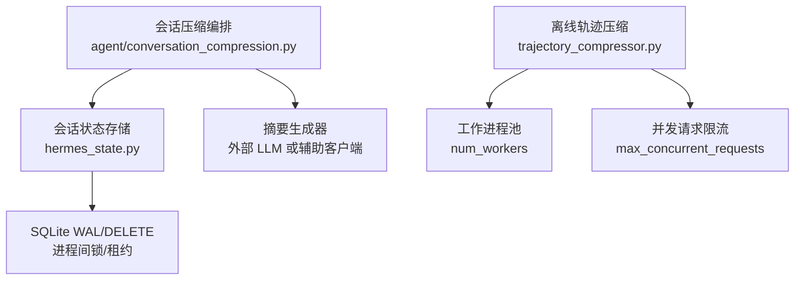
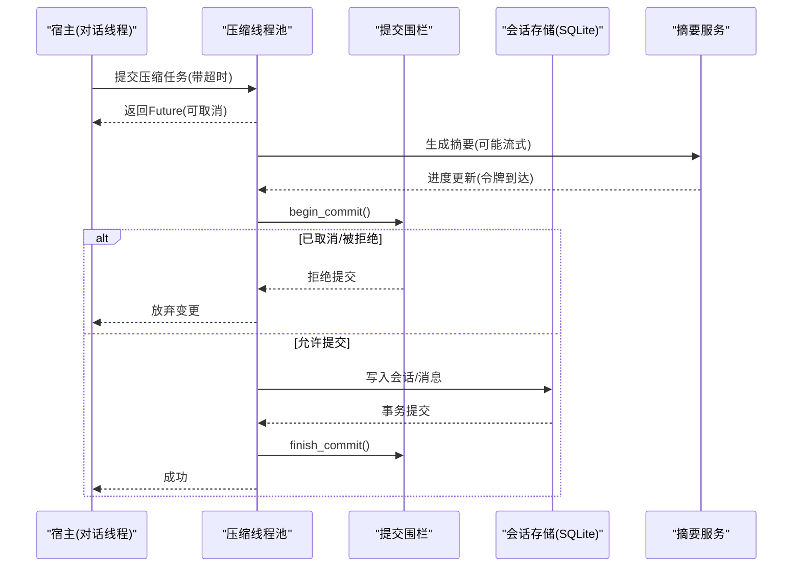
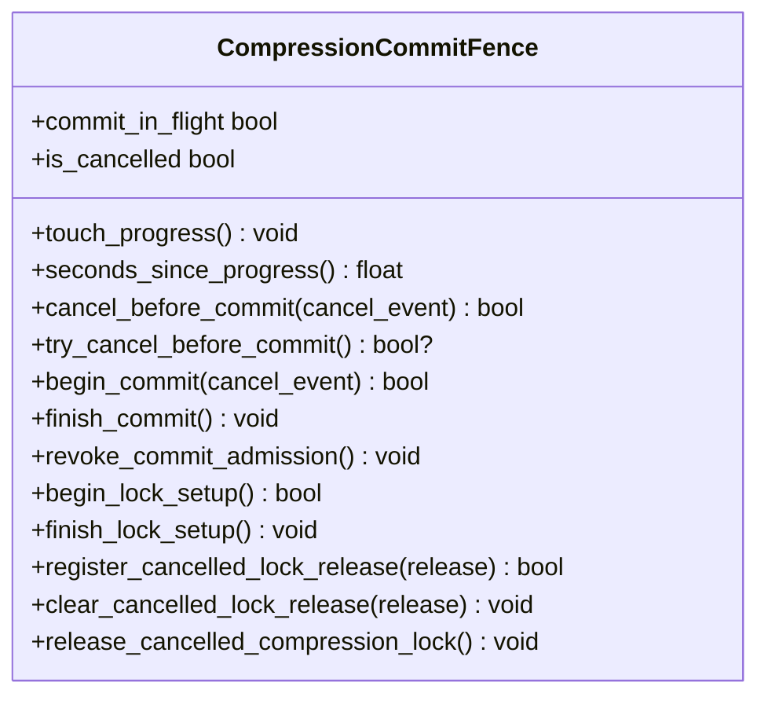
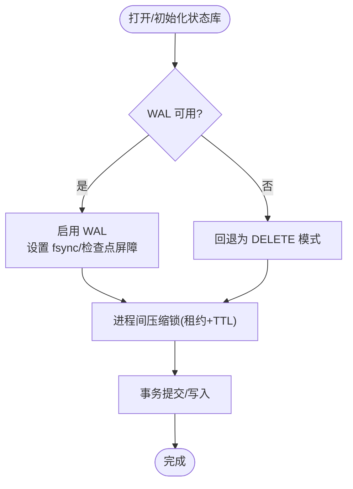
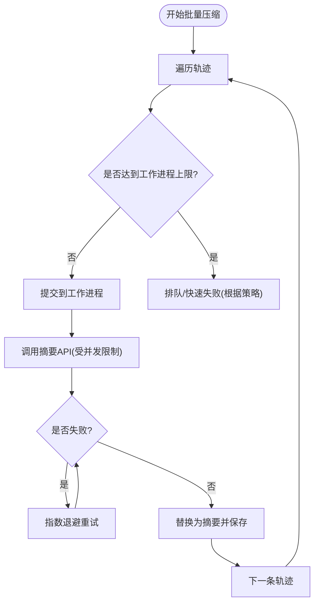
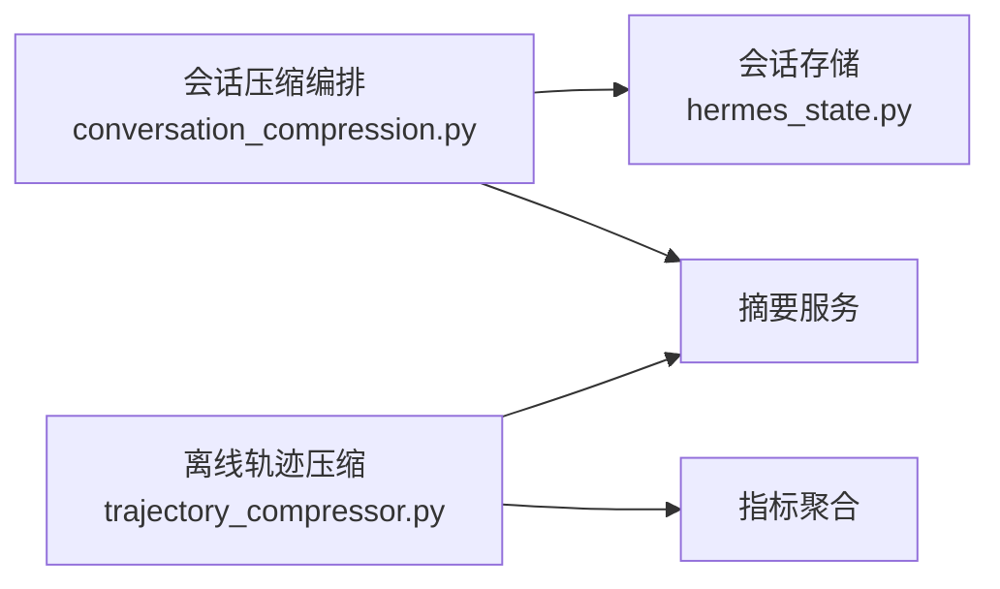

# 并发控制优化

<cite>
**本文引用的文件**
- [conversation_compression.py](file://agent/conversation_compression.py)
- [hermes_state.py](file://hermes_state.py)
- [trajectory_compressor.py](file://trajectory_compressor.py)
</cite>

## 目录
1. [简介](#简介)
2. [项目结构](#项目结构)
3. [核心组件](#核心组件)
4. [架构总览](#架构总览)
5. [详细组件分析](#详细组件分析)
6. [依赖关系分析](#依赖关系分析)
7. [性能考虑](#性能考虑)
8. [故障排查指南](#故障排查指南)
9. [结论](#结论)
10. [附录](#附录)

## 简介
本文件聚焦于压缩系统的并发模型、锁机制与同步策略，覆盖以下主题：
- 压缩任务的并行执行与任务调度
- 死锁预防与竞态条件处理
- 线程安全、数据一致性与事务管理
- 并发性能监控、阻塞点分析与吞吐量优化
- 不同并发场景下的配置优化、锁粒度调整与异步处理策略
- 并发异常处理、超时控制与重试机制
- 面向开发者的并发编程最佳实践与调试技巧

## 项目结构
围绕压缩的并发控制主要涉及三个层次：
- 会话级压缩编排与并发边界控制（进程内）：位于 agent/conversation_compression.py
- 持久化与会话状态存储（SQLite WAL/DELETE 模式、进程间锁）：位于 hermes_state.py
- 离线轨迹压缩批处理（多工作进程、并发 API 调用）：位于 trajectory_compressor.py

图表来源
- [conversation_compression.py:445-691](file://agent/conversation_compression.py#L445-L691)
- [hermes_state.py:485-538](file://hermes_state.py#L485-L538)
- [trajectory_compressor.py:82-124](file://trajectory_compressor.py#L82-L124)

章节来源
- [conversation_compression.py:1-100](file://agent/conversation_compression.py#L1-L100)
- [hermes_state.py:1-100](file://hermes_state.py#L1-L100)
- [trajectory_compressor.py:1-120](file://trajectory_compressor.py#L1-L120)

## 核心组件
- 压缩提交围栏（CompressionCommitFence）：用于在“摘要生成完成”到“会话状态写入”之间建立原子提交边界，支持取消、拒绝新提交、进度感知与持有者资格释放。
- 压缩执行器池与准入控制：使用固定大小的守护线程池承载压缩任务，配合有界准入计数防止队列无限增长。
- 会话状态与持久化：SQLite 作为会话存储，采用 WAL 模式并在不兼容文件系统上回退为 DELETE；提供进程间压缩锁（基于租约与 TTL），并具备 WAL 重置漏洞检测与 macOS 特定 fsync 强化。
- 离线轨迹压缩：按 num_workers 并行处理多条轨迹，对摘要 API 调用进行 max_concurrent_requests 限流，并提供 per_trajectory_timeout 等超时保护。

章节来源
- [conversation_compression.py:445-691](file://agent/conversation_compression.py#L445-L691)
- [conversation_compression.py:693-773](file://agent/conversation_compression.py#L693-L773)
- [hermes_state.py:485-538](file://hermes_state.py#L485-L538)
- [trajectory_compressor.py:82-124](file://trajectory_compressor.py#L82-L124)

## 架构总览
压缩系统由“会话内压缩”和“离线轨迹压缩”两条路径组成，二者共享一致的并发原则：明确边界、可观测进度、可取消、可恢复。

图表来源
- [conversation_compression.py:445-691](file://agent/conversation_compression.py#L445-L691)
- [conversation_compression.py:693-773](file://agent/conversation_compression.py#L693-L773)

## 详细组件分析

### 组件A：会话压缩并发与提交围栏
- 并发模型
  - 压缩任务在独立守护线程池中运行，避免阻塞对话主循环。
  - 通过有界准入计数限制同时进入的任务数，防止资源耗尽。
- 锁与同步
  - CompressionCommitFence 以内部锁保证“取消/拒绝”与“提交开始/结束”的原子性。
  - 支持非阻塞尝试取消、锁自由读取“提交进行中”标志，以及持有者资格释放钩子，避免死锁。
- 超时与进度
  - 支持空闲超时与总上限超时；通过进度标记区分“慢但活跃”的摘要服务与“卡住”的情况。
  - 当提交阶段超时时，按切片等待并持续上报，避免长时间静默。
- 数据一致性
  - 仅在围栏允许时进入提交阶段，确保会话状态不会在取消后部分写入。
  - 失败冷却与反抖动状态在提交前后保持一致，必要时可回滚到权威持久状态。

图表来源
- [conversation_compression.py:445-691](file://agent/conversation_compression.py#L445-L691)

章节来源
- [conversation_compression.py:445-691](file://agent/conversation_compression.py#L445-L691)
- [conversation_compression.py:693-773](file://agent/conversation_compression.py#L693-L773)

### 组件B：会话状态与持久化并发
- 并发模型
  - SQLite 默认启用 WAL 模式以支持多读一写；在不兼容网络文件系统或存在 WAL 重置漏洞时自动回退为 DELETE 模式。
  - 进程间压缩锁通过租约+TTL实现，结合 PID 存活探测快速回收死锁。
- 锁与同步
  - 使用线程锁保护全局错误信息与警告去重集合，避免并发日志污染。
  - 针对 macOS 平台强制 FULL fsync 与 checkpoint_fullfsync，降低崩溃后损坏风险。
- 数据一致性
  - 在 WAL 不可用时降级为顺序写，牺牲并发换取稳定性。
  - 测试隔离守卫阻止在 pytest 环境下误触生产数据库。

图表来源
- [hermes_state.py:485-538](file://hermes_state.py#L485-L538)
- [hermes_state.py:718-780](file://hermes_state.py#L718-L780)

章节来源
- [hermes_state.py:485-538](file://hermes_state.py#L485-L538)
- [hermes_state.py:718-780](file://hermes_state.py#L718-L780)

### 组件C：离线轨迹压缩并发与吞吐优化
- 并发模型
  - 使用 num_workers 控制并行处理的轨迹数量。
  - 对摘要 API 调用使用 max_concurrent_requests 做并发上限，避免压垮后端。
- 锁与同步
  - 每个轨迹独立处理，无跨轨迹共享可变状态；指标聚合在单进程内合并。
- 超时与重试
  - per_trajectory_timeout 限制单条轨迹处理时长。
  - 摘要调用支持最大重试次数与指数退避，失败时回退为兜底摘要文本。
- 吞吐优化
  - 合理设置 num_workers 与 max_concurrent_requests，平衡 CPU 与网络 I/O。
  - 对超长内容截断以减少提示词大小，提升单次请求成功率。

图表来源
- [trajectory_compressor.py:82-124](file://trajectory_compressor.py#L82-L124)
- [trajectory_compressor.py:605-741](file://trajectory_compressor.py#L605-L741)

章节来源
- [trajectory_compressor.py:82-124](file://trajectory_compressor.py#L82-L124)
- [trajectory_compressor.py:605-741](file://trajectory_compressor.py#L605-L741)

## 依赖关系分析
- conversation_compression.py 依赖 hermes_state.py 提供的会话持久化能力（WAL/DELETE、进程间锁）。
- conversation_compression.py 通过辅助客户端或直接 OpenAI 客户端调用摘要服务，受进度与超时围栏约束。
- trajectory_compressor.py 独立于会话压缩，专注于离线批处理，复用重试与超时策略。

图表来源
- [conversation_compression.py:445-691](file://agent/conversation_compression.py#L445-L691)
- [hermes_state.py:485-538](file://hermes_state.py#L485-L538)
- [trajectory_compressor.py:82-124](file://trajectory_compressor.py#L82-L124)

章节来源
- [conversation_compression.py:445-691](file://agent/conversation_compression.py#L445-L691)
- [hermes_state.py:485-538](file://hermes_state.py#L485-L538)
- [trajectory_compressor.py:82-124](file://trajectory_compressor.py#L82-L124)

## 性能考虑
- 线程池规模
  - 压缩线程池采用固定小容量（守护线程），避免过多上下文切换与资源争用。
- 准入控制
  - 通过有界准入计数防止所有工作线程被卡住的摘要请求占满，提高整体可用性。
- 提交阶段超时
  - 将“摘要生成”与“会话写入”解耦，提交阶段按切片等待并持续上报，减少长尾阻塞。
- 存储层选择
  - 在网络文件系统或存在 WAL 漏洞的环境下回退为 DELETE 模式，保证稳定性。
- 批处理吞吐
  - 调整 num_workers 与 max_concurrent_requests，使 CPU 与网络带宽得到均衡利用。
- 摘要内容裁剪
  - 对超长内容进行截断，降低提示词大小，提高成功率与速度。

[本节为通用指导，不直接分析具体文件]

## 故障排查指南
- 压缩被阻塞或超时
  - 检查提交围栏是否处于“提交进行中”，观察进度时间戳判断是否为慢响应。
  - 查看是否有大量任务被拒绝（准入饱和），适当调大线程池或降低并发。
- 会话存储不可用
  - 若出现 WAL 相关错误，确认文件系统兼容性；必要时接受回退为 DELETE 模式。
  - 检查 macOS 平台的 fsync 设置与 checkpoint 屏障是否生效。
- 摘要服务失败
  - 关注重试次数与退避策略；若多次失败，检查网络与鉴权。
  - 失败回退会生成兜底摘要，需评估对训练信号的影响。
- 进程间锁未释放
  - 检查租约持有者 PID 是否存活；若已死亡，应快速回收以避免假死锁。

章节来源
- [conversation_compression.py:445-691](file://agent/conversation_compression.py#L445-L691)
- [hermes_state.py:485-538](file://hermes_state.py#L485-L538)
- [trajectory_compressor.py:605-741](file://trajectory_compressor.py#L605-L741)

## 结论
该压缩系统通过“提交围栏 + 有界线程池 + 存储层回退 + 进度感知超时”的组合，实现了高可靠、可观测且可伸缩的并发控制。会话内压缩强调原子提交与可取消，离线批处理强调吞吐与容错。针对不同部署环境（网络文件系统、macOS、外部 LLM 不稳定），提供了稳健的回退与降级策略。

[本节为总结，不直接分析具体文件]

## 附录
- 并发编程最佳实践
  - 明确边界：将“计算”与“提交”分离，使用围栏统一入口。
  - 可取消：所有长耗时操作必须支持取消与超时。
  - 可观测：记录进度与关键事件，便于定位阻塞点。
  - 幂等与回滚：对外部副作用保持幂等，失败时可回滚到权威状态。
- 调试技巧
  - 打印围栏状态（是否取消、是否提交中）、线程池占用与准入计数。
  - 在存储层开启 WAL 日志或降级日志，观察锁竞争与回退路径。
  - 对摘要服务增加慢请求告警与采样日志，识别热点模型或端点。

[本节为通用指导，不直接分析具体文件]