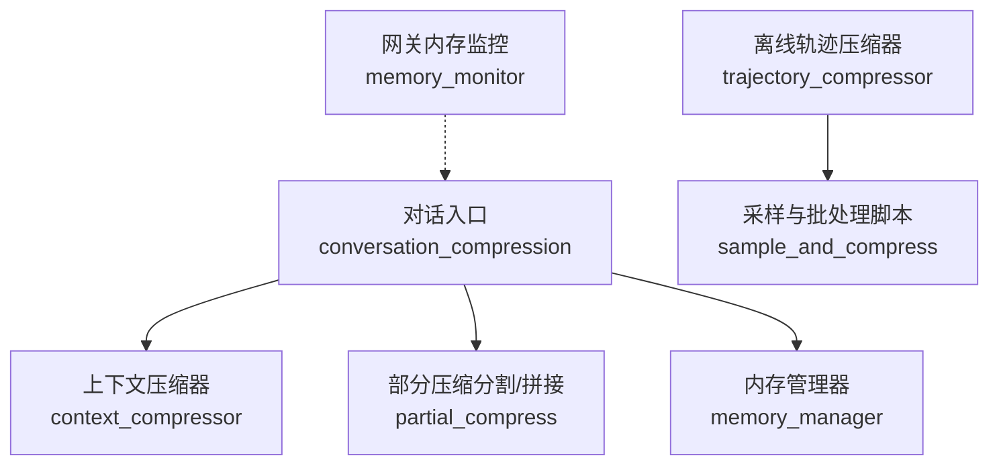
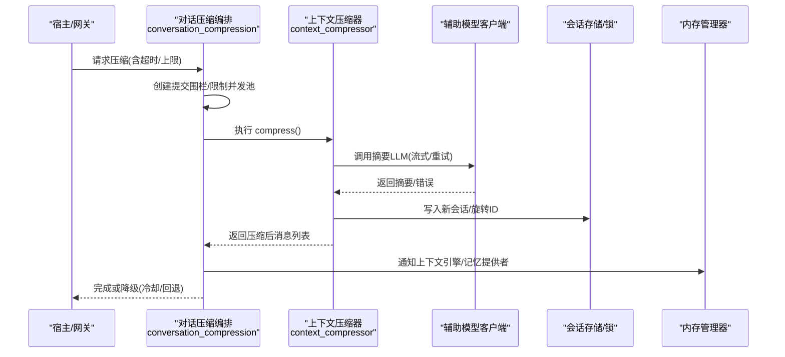
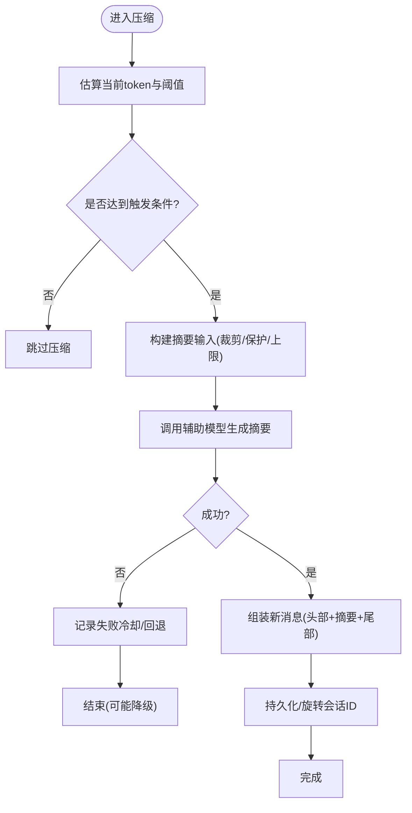
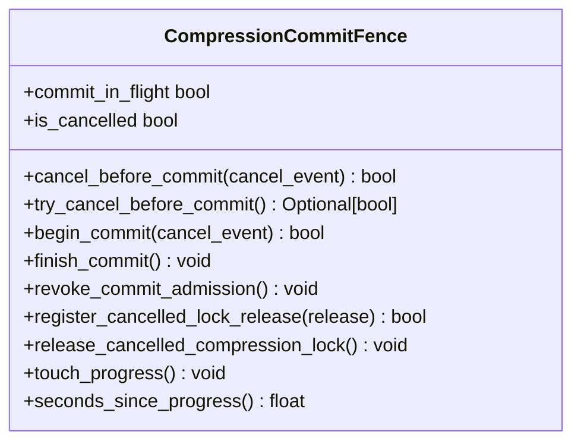
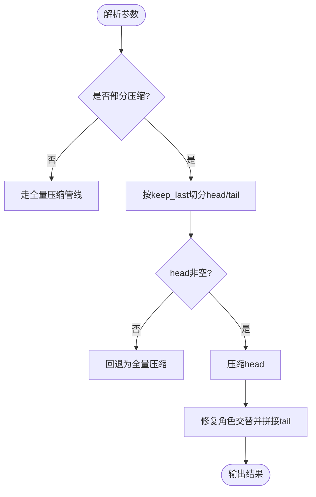
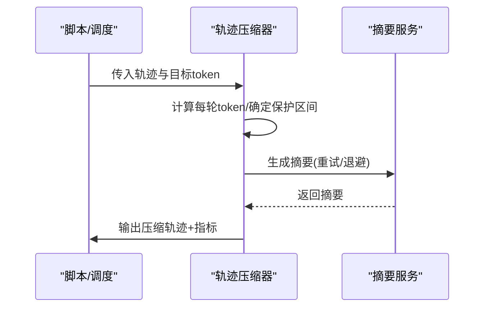
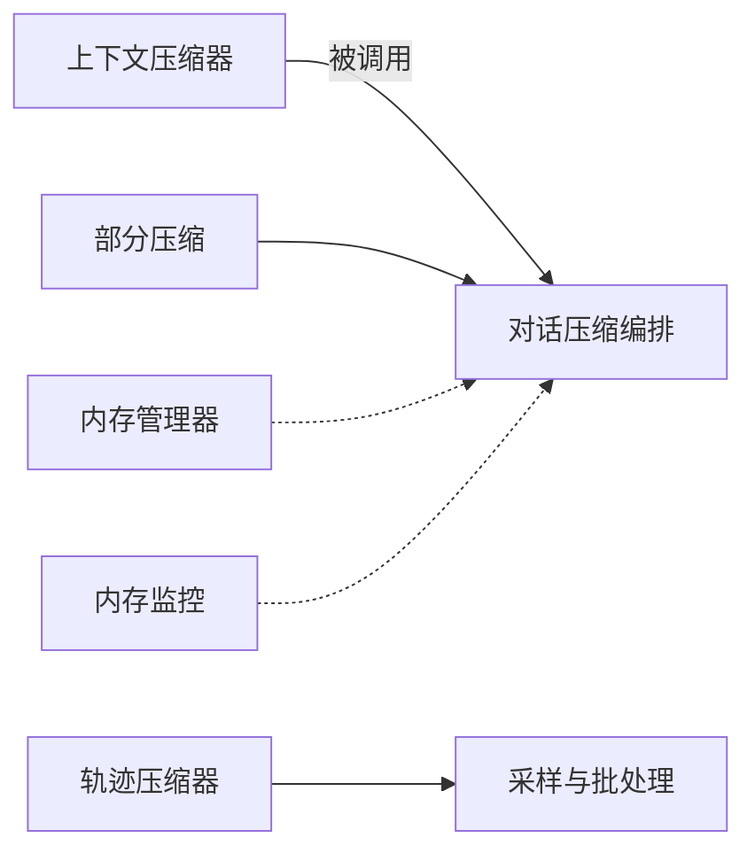

# 性能优化

<cite>
**本文引用的文件**
- [agent/context_compressor.py](file://agent/context_compressor.py)
- [agent/conversation_compression.py](file://agent/conversation_compression.py)
- [hermes_cli/partial_compress.py](file://hermes_cli/partial_compress.py)
- [trajectory_compressor.py](file://trajectory_compressor.py)
- [scripts/sample_and_compress.py](file://scripts/sample_and_compress.py)
- [agent/memory_manager.py](file://agent/memory_manager.py)
- [gateway/memory_monitor.py](file://gateway/memory_monitor.py)
</cite>

## 目录
1. [简介](#简介)
2. [项目结构](#项目结构)
3. [核心组件](#核心组件)
4. [架构总览](#架构总览)
5. [详细组件分析](#详细组件分析)
6. [依赖关系分析](#依赖关系分析)
7. [性能考量](#性能考量)
8. [故障排查指南](#故障排查指南)
9. [结论](#结论)
10. [附录](#附录)

## 简介
本文件聚焦于 Hermes Agent 的压缩系统性能优化，覆盖资源管理、内存优化与并发控制；解释压缩触发时机、批量处理与增量更新机制；提供监控指标、瓶颈分析与优化建议；给出不同场景下的配置调优与基准方法；并包含异常处理、故障恢复与服务降级策略，以及面向运维的监控告警与问题诊断指导。

## 项目结构
围绕“会话上下文压缩”和“轨迹离线压缩”两条主线：
- 在线会话压缩：由 conversation_compression 编排，调用 context_compressor 执行摘要与消息裁剪，并通过 partial_compress 支持用户指定边界的“部分压缩”。
- 离线轨迹压缩：trajectory_compressor 对历史轨迹进行批量化压缩，配合 sample_and_compress 从数据集采样与流水线化输出。
- 资源与并发：conversation_compression 使用受限线程池与提交围栏（CompressionCommitFence）保障超时、取消与提交边界安全；memory_manager 通过后台串行执行器避免阻塞主流程；gateway/memory_monitor 提供进程级内存观测。

图表来源
- [agent/conversation_compression.py:1-120](file://agent/conversation_compression.py#L1-L120)
- [agent/context_compressor.py:1-120](file://agent/context_compressor.py#L1-L120)
- [hermes_cli/partial_compress.py:1-60](file://hermes_cli/partial_compress.py#L1-L60)
- [trajectory_compressor.py:1-120](file://trajectory_compressor.py#L1-L120)
- [scripts/sample_and_compress.py:1-60](file://scripts/sample_and_compress.py#L1-L60)
- [agent/memory_manager.py:1-60](file://agent/memory_manager.py#L1-L60)
- [gateway/memory_monitor.py:1-40](file://gateway/memory_monitor.py#L1-L40)

章节来源
- [agent/conversation_compression.py:1-120](file://agent/conversation_compression.py#L1-L120)
- [agent/context_compressor.py:1-120](file://agent/context_compressor.py#L1-L120)
- [hermes_cli/partial_compress.py:1-60](file://hermes_cli/partial_compress.py#L1-L60)
- [trajectory_compressor.py:1-120](file://trajectory_compressor.py#L1-L120)
- [scripts/sample_and_compress.py:1-60](file://scripts/sample_and_compress.py#L1-L60)
- [agent/memory_manager.py:1-60](file://agent/memory_manager.py#L1-L60)
- [gateway/memory_monitor.py:1-40](file://gateway/memory_monitor.py#L1-L40)

## 核心组件
- 上下文压缩器（ContextCompressor）：负责在会话中识别可压缩区域、生成结构化摘要、保护头尾、工具输出剪枝、技能指令防幽灵丢失、失败冷却与回退路径等。
- 对话压缩编排（conversation_compression）：负责启动探测、超时/总时长上限、提交围栏、并发池限流、状态快照/恢复、冷却持久化、重试与提示文案。
- 部分压缩（partial_compress）：解析“在此处压缩”类命令，按用户意图保留最近若干轮次，保证角色交替合法性，并提供预览报告。
- 轨迹压缩器（TrajectoryCompressor）：离线批处理，保护首尾关键轮次，仅压缩中间区域，替换为单条人类可读摘要，统计指标与聚合。
- 采样与批处理脚本（sample_and_compress）：多数据集下载、过滤、并行分词计数、随机采样、分批保存与合并输出。
- 内存管理器（MemoryManager）：将记忆预取/同步任务放入后台串行执行器，避免阻塞主循环；外部预取带超时与去重；工具 schema 归一化与冲突防护。
- 网关内存监控（memory_monitor）：周期性记录 RSS/GC/线程数，便于泄漏检测与基线对比。

章节来源
- [agent/context_compressor.py:1-120](file://agent/context_compressor.py#L1-L120)
- [agent/conversation_compression.py:1-120](file://agent/conversation_compression.py#L1-L120)
- [hermes_cli/partial_compress.py:1-120](file://hermes_cli/partial_compress.py#L1-L120)
- [trajectory_compressor.py:1-120](file://trajectory_compressor.py#L1-L120)
- [scripts/sample_and_compress.py:1-120](file://scripts/sample_and_compress.py#L1-L120)
- [agent/memory_manager.py:1-120](file://agent/memory_manager.py#L1-L120)
- [gateway/memory_monitor.py:1-120](file://gateway/memory_monitor.py#L1-L120)

## 架构总览
下图展示在线压缩的关键调用链与并发边界：

图表来源
- [agent/conversation_compression.py:445-730](file://agent/conversation_compression.py#L445-L730)
- [agent/context_compressor.py:1-120](file://agent/context_compressor.py#L1-L120)
- [agent/memory_manager.py:638-758](file://agent/memory_manager.py#L638-L758)

## 详细组件分析

### 上下文压缩器（ContextCompressor）
- 触发与预算：基于模型上下文长度与软阈值估算，结合受保护头尾与滚动摘要，动态决定何时触发压缩与摘要 token 配额。
- 内容裁剪与保护：优先保留系统提示、工具模式、受保护尾部；对旧工具输出进行剪枝占位；对 skill_view 结果做“防幽灵”标记注入与保留窗口。
- 摘要质量与鲁棒性：结构化模板、历史任务快照、末尾分隔符、角色交替保护；失败冷却与回退摘要；输入字符上限防止慢后端超窗。
- 资源与并发：摘要调用走辅助客户端，具备连接错误分类、认证/配额错误快速失败、重试与节流。

图表来源
- [agent/context_compressor.py:417-453](file://agent/context_compressor.py#L417-L453)
- [agent/context_compressor.py:764-782](file://agent/context_compressor.py#L764-L782)

章节来源
- [agent/context_compressor.py:1-800](file://agent/context_compressor.py#L1-L800)

### 对话压缩编排（conversation_compression）
- 并发与超时：使用受限 DaemonThreadPoolExecutor（默认最多4个并发），提交前检查占用；提供 idle_timeout 与 total_ceiling 双层超时；提交阶段使用 CompressionCommitFence 确保原子性与可撤销性。
- 状态与恢复：尝试快照压缩器内部状态并在取消时恢复；捕获并还原冷却行，避免冷启动误判。
- 可观测性：统一的状态文案模板，便于网关噪声过滤与前端指示；失败/阻塞时发出可见警告。

图表来源
- [agent/conversation_compression.py:445-691](file://agent/conversation_compression.py#L445-L691)

章节来源
- [agent/conversation_compression.py:1-800](file://agent/conversation_compression.py#L1-L800)

### 部分压缩（partial_compress）
- 语义：支持“在此处压缩/保留最近N轮”，保证拼接后的角色交替合法；提供预览模式输出预估信息而不修改状态。
- 算法：逆向扫描 user 轮定位边界，若无法形成有效 head 则回退到全量压缩；拼接时对相邻同角色进行内容合并或插入桥接轮。

图表来源
- [hermes_cli/partial_compress.py:55-109](file://hermes_cli/partial_compress.py#L55-L109)
- [hermes_cli/partial_compress.py:213-325](file://hermes_cli/partial_compress.py#L213-L325)

章节来源
- [hermes_cli/partial_compress.py:1-325](file://hermes_cli/partial_compress.py#L1-L325)

### 轨迹压缩器（TrajectoryCompressor）
- 策略：保护首段（system/human/first gpt/tool）与末段 N 轮，仅压缩中间区域；用单条人类可读摘要替换被压缩区域；保持剩余轮次完整以便继续工作。
- 指标：逐条轨迹与聚合指标（tokens/轮次/成功率/耗时），便于回归检测与效果评估。
- 并发与容错：支持同步/异步摘要调用，重试与抖动退避；未知提供商回退直连 OpenAI 客户端。

图表来源
- [trajectory_compressor.py:332-412](file://trajectory_compressor.py#L332-L412)
- [trajectory_compressor.py:605-742](file://trajectory_compressor.py#L605-L742)

章节来源
- [trajectory_compressor.py:1-800](file://trajectory_compressor.py#L1-L800)

### 采样与批处理（sample_and_compress）
- 功能：从多个 HuggingFace 数据集加载、按最小 token 过滤、并行分词计数、随机采样、分批保存 JSONL、运行压缩并合并输出。
- 性能：使用 multiprocessing.Pool 并行计数，chunksize 控制吞吐；可配置 num_proc 与 batch_size。

章节来源
- [scripts/sample_and_compress.py:1-410](file://scripts/sample_and_compress.py#L1-L410)

### 内存管理与监控
- MemoryManager：将记忆预取/同步任务投递到单工作线程执行器，避免阻塞主循环；外部预取带超时与线程复用；工具 schema 归一化与冲突规避。
- memory_monitor：后台守护线程周期记录 RSS/GC/线程数，启动/关闭时输出基线与最终快照，便于泄漏检测。

章节来源
- [agent/memory_manager.py:1-800](file://agent/memory_manager.py#L1-L800)
- [gateway/memory_monitor.py:1-231](file://gateway/memory_monitor.py#L1-L231)

## 依赖关系分析
- conversation_compression 依赖 context_compressor 实现具体压缩逻辑，并通过 partial_compress 暴露用户可控边界能力。
- trajectory_compressor 独立于在线流程，用于离线数据压缩与训练集准备，可与 sample_and_compress 组合成端到端流水线。
- memory_manager 与 memory_monitor 分别提供运行时资源协调与可观测性支撑，不直接耦合压缩模块但影响整体吞吐与稳定性。

图表来源
- [agent/conversation_compression.py:1-120](file://agent/conversation_compression.py#L1-L120)
- [agent/context_compressor.py:1-120](file://agent/context_compressor.py#L1-L120)
- [hermes_cli/partial_compress.py:1-60](file://hermes_cli/partial_compress.py#L1-L60)
- [trajectory_compressor.py:1-120](file://trajectory_compressor.py#L1-L120)
- [scripts/sample_and_compress.py:1-60](file://scripts/sample_and_compress.py#L1-L60)
- [agent/memory_manager.py:1-60](file://agent/memory_manager.py#L1-L60)
- [gateway/memory_monitor.py:1-40](file://gateway/memory_monitor.py#L1-L40)

章节来源
- [agent/conversation_compression.py:1-120](file://agent/conversation_compression.py#L1-L120)
- [agent/context_compressor.py:1-120](file://agent/context_compressor.py#L1-L120)
- [hermes_cli/partial_compress.py:1-60](file://hermes_cli/partial_compress.py#L1-L60)
- [trajectory_compressor.py:1-120](file://trajectory_compressor.py#L1-L120)
- [scripts/sample_and_compress.py:1-60](file://scripts/sample_and_compress.py#L1-L60)
- [agent/memory_manager.py:1-60](file://agent/memory_manager.py#L1-L60)
- [gateway/memory_monitor.py:1-40](file://gateway/memory_monitor.py#L1-L40)

## 性能考量
- 触发时机与阈值
  - 小上下文窗口模型：提高触发阈值比例以避免频繁压缩导致“反复摘要”的开销。
  - 大上下文窗口模型：关注受保护尾部与系统提示的固定成本，合理设置摘要 token 上限。
- 资源管理
  - 摘要输入字符上限：避免慢后端上下文溢出与超时。
  - 工具输出剪枝与技能指令防幽灵：减少无效内容进入摘要，降低 LLM 负载。
- 并发控制
  - 压缩池最大并发：限制同时进行的压缩任务，避免队列无限增长；当所有槽位占用时快速失败，保障对话继续。
  - 提交围栏：确保取消/超时不会破坏已提交的会话变更；支持持有者限定释放，避免 ABA 问题。
- 内存优化
  - 后台串行执行器：记忆预取/同步不阻塞主循环，避免长时间“运行中”状态。
  - 进程级内存监控：定期记录 RSS/GC/线程数，发现缓慢泄漏。
- 批量与增量
  - 离线轨迹压缩：按目标 token 只压缩必要区域，保留其余轮次，最大化训练信号。
  - 在线增量：滚动摘要与失败冷却，避免对同一位置反复失败导致的忙循环。
- 监控指标
  - 压缩成功率、平均节省 token、摘要调用次数/错误率、超时/冷却次数、提交阶段耗时、RSS/GC/线程数。
- 瓶颈分析
  - 慢后端摘要：启用进度感知超时与流式 token 上报，避免误杀慢模型。
  - 数据库提交阻塞：提交阶段超过总上限时分段等待并记录告警。
- 优化建议
  - 调整摘要 token 上限与输入字符上限以匹配后端能力。
  - 根据模型上下文大小调高触发阈值，减少无意义压缩。
  - 开启部分压缩，让用户控制保留范围，提升交互体验。
  - 对高频 skill_view 结果设置保护窗口，避免重复加载。

[本节为通用性能讨论，无需特定文件引用]

## 故障排查指南
- 常见问题
  - 摘要失败/配额不足：快速失败并进入冷却期，避免持续重试；检查认证/计费配置。
  - 上下文过大仍无法压缩：检查受保护尾部与系统提示占比，必要时降低阈值或扩大模型上下文。
  - 提交阶段卡住：观察提交围栏是否处于进行中；若超过总上限，记录并逐步释放。
  - 内存泄漏：查看内存监控日志中的 RSS/GC/线程趋势，定位异常增长点。
- 诊断步骤
  - 查看压缩状态文案与失败原因，确认是否进入冷却或回退路径。
  - 检查并发池占用情况，是否存在大量挂起任务。
  - 核对摘要输入大小与后端限制，必要时降低输入上限。
  - 使用部分压缩预览功能，验证边界与预期效果。
- 恢复与降级
  - 冷却期内跳过压缩，继续对话；冷却结束后自动恢复。
  - 摘要失败时使用回退摘要，尽量保留关键锚点。
  - 并发饱和时拒绝新压缩任务，保证对话可用性。

章节来源
- [agent/context_compressor.py:73-95](file://agent/context_compressor.py#L73-L95)
- [agent/conversation_compression.py:776-800](file://agent/conversation_compression.py#L776-L800)
- [gateway/memory_monitor.py:83-127](file://gateway/memory_monitor.py#L83-L127)

## 结论
Hermes Agent 的压缩系统在在线与离线两个层面提供了高效、稳健且可观测的能力。通过合理的触发阈值、输入裁剪、并发限流与提交围栏，既保证了用户体验，又避免了资源耗尽与状态不一致。配合内存监控与指标体系，可在生产环境中持续优化并快速定位问题。建议在不同场景下按需调整阈值与并发参数，并结合部分压缩与离线批处理，达成最佳性价比。

[本节为总结性内容，无需特定文件引用]

## 附录
- 配置要点
  - 压缩超时与总上限：根据后端能力与业务容忍度设定 idle_timeout 与 total_ceiling。
  - 摘要 token 上限与输入字符上限：匹配辅助模型窗口，避免超时与溢出。
  - 并发池大小：默认较小，适合压缩低频但重型的特点；可按部署规模微调。
  - 内存监控间隔：默认 5 分钟，可根据日志容量与需求调整。
- 基准测试
  - 离线轨迹压缩：使用 sample_and_compress 从数据集采样，运行压缩并收集聚合指标，作为回归基线。
  - 在线压缩：在不同模型与上下文长度下测量压缩成功率、节省 token、超时率与延迟分布。
- 回归检测
  - 跟踪摘要调用次数/错误率、超时/冷却次数、RSS/GC/线程数，设置阈值告警。
  - 对关键指标建立基线，PR 前后对比，发现退化及时回滚。

[本节为补充说明，无需特定文件引用]