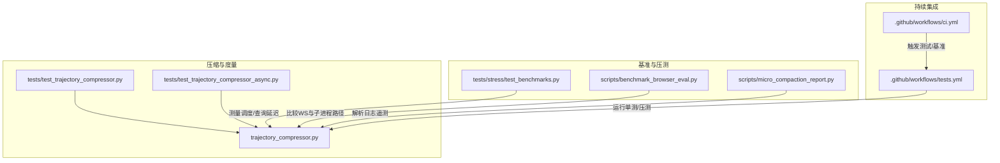
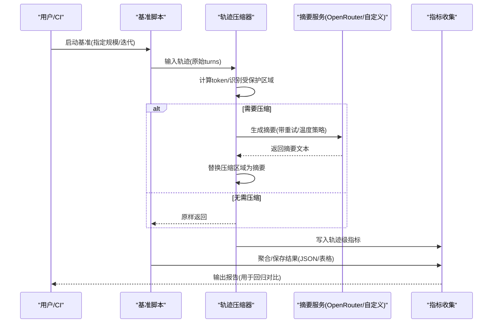
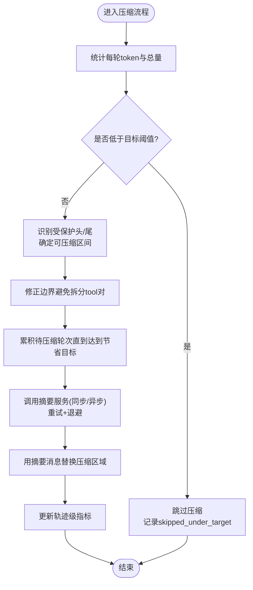
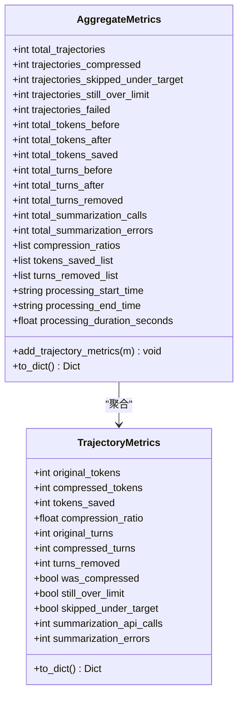
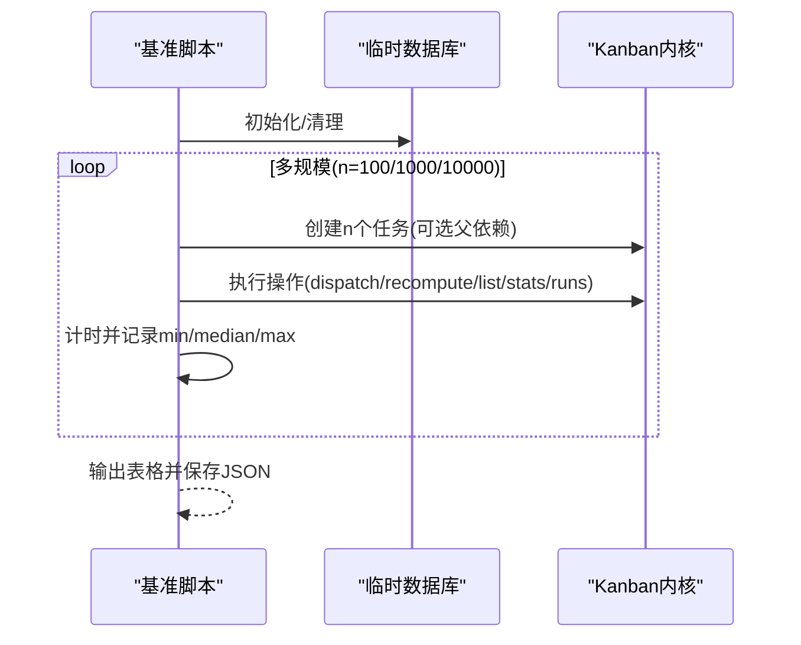
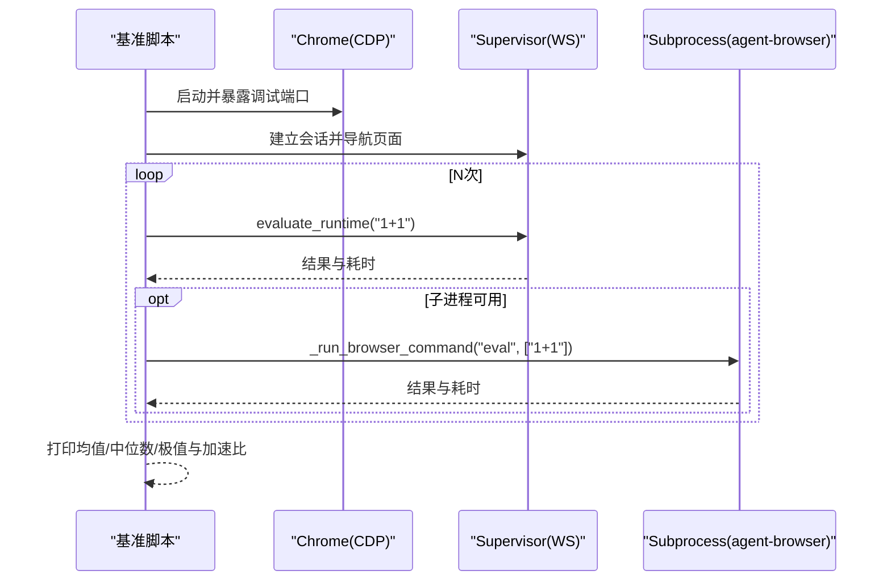
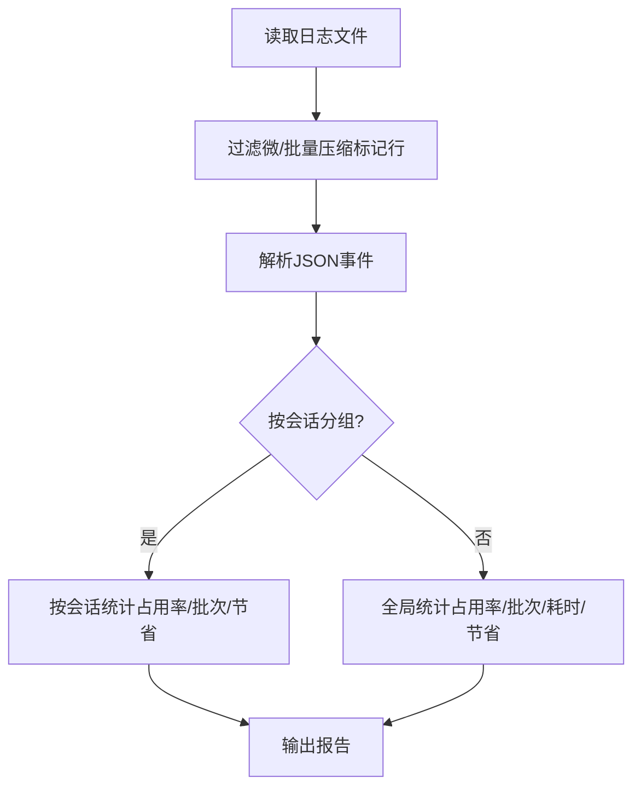
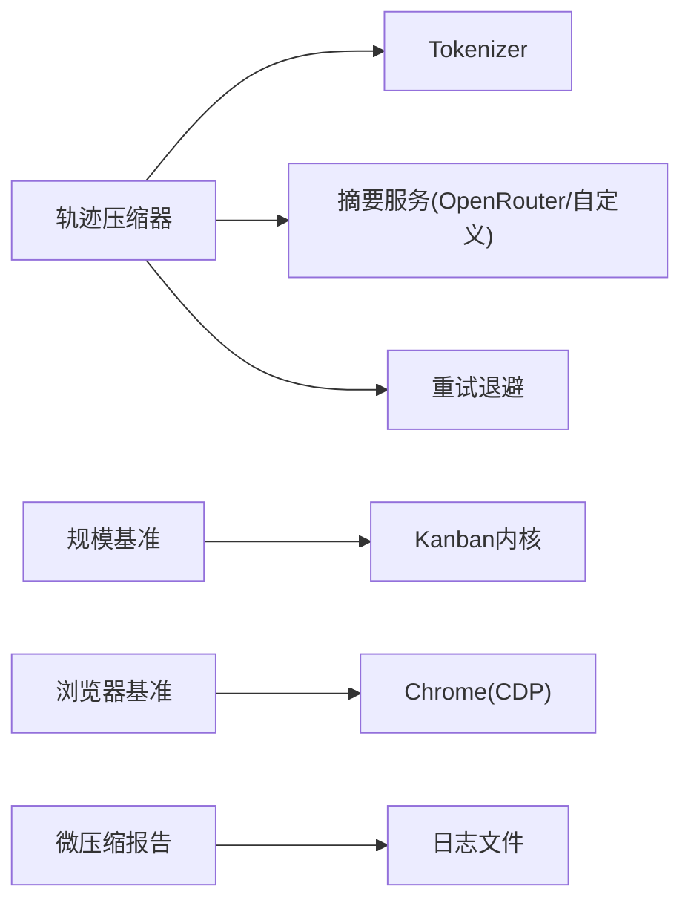

# 性能基准测试

<cite>
**本文引用的文件**
- [trajectory_compressor.py](file://trajectory_compressor.py)
- [test_trajectory_compressor.py](file://tests/test_trajectory_compressor.py)
- [test_trajectory_compressor_async.py](file://tests/test_trajectory_compressor_async.py)
- [test_benchmarks.py](file://tests/stress/test_benchmarks.py)
- [benchmark_browser_eval.py](file://scripts/benchmark_browser_eval.py)
- [micro_compaction_report.py](file://scripts/micro_compaction_report.py)
- [ci.yml](file://.github/workflows/ci.yml)
- [tests.yml](file://.github/workflows/tests.yml)
</cite>

## 目录
1. [简介](#简介)
2. [项目结构](#项目结构)
3. [核心组件](#核心组件)
4. [架构总览](#架构总览)
5. [详细组件分析](#详细组件分析)
6. [依赖关系分析](#依赖关系分析)
7. [性能考量](#性能考量)
8. [故障排查指南](#故障排查指南)
9. [结论](#结论)
10. [附录](#附录)

## 简介
本文件面向开发团队，系统化说明压缩系统的性能评估方法与基准测试框架。内容涵盖：
- 测试场景设计、性能指标定义与结果分析方法
- 压缩效率的量化评估、回归检测与优化验证
- 基准测试工具使用、测试数据准备与执行环境配置
- 不同负载场景下的性能表现、容量规划与扩展性评估
- 测试自动化、持续集成与性能门禁策略
- 性能测试最佳实践与问题定位方法

## 项目结构
仓库中与性能基准和压缩评估相关的代码主要分布在以下位置：
- 压缩实现与度量：trajectory_compressor.py
- 压缩单元测试与边界保护验证：tests/test_trajectory_compressor.py、tests/test_trajectory_compressor_async.py
- 压力/规模基准：tests/stress/test_benchmarks.py
- 浏览器执行路径对比基准：scripts/benchmark_browser_eval.py
- 微压缩遥测报告：scripts/micro_compaction_report.py
- 持续集成工作流：.github/workflows/ci.yml、.github/workflows/tests.yml

**图表来源**
- [trajectory_compressor.py:82-119](file://trajectory_compressor.py#L82-L119)
- [test_trajectory_compressor.py:19-31](file://tests/test_trajectory_compressor.py#L19-L31)
- [test_trajectory_compressor_async.py:19-83](file://tests/test_trajectory_compressor_async.py#L19-L83)
- [test_benchmarks.py:26-37](file://tests/stress/test_benchmarks.py#L26-L37)
- [benchmark_browser_eval.py:58-125](file://scripts/benchmark_browser_eval.py#L58-L125)
- [micro_compaction_report.py:84-152](file://scripts/micro_compaction_report.py#L84-L152)
- [ci.yml](file://.github/workflows/ci.yml)
- [tests.yml](file://.github/workflows/tests.yml)

**章节来源**
- [trajectory_compressor.py:82-119](file://trajectory_compressor.py#L82-L119)
- [test_trajectory_compressor.py:19-31](file://tests/test_trajectory_compressor.py#L19-L31)
- [test_trajectory_compressor_async.py:19-83](file://tests/test_trajectory_compressor_async.py#L19-L83)
- [test_benchmarks.py:26-37](file://tests/stress/test_benchmarks.py#L26-L37)
- [benchmark_browser_eval.py:58-125](file://scripts/benchmark_browser_eval.py#L58-L125)
- [micro_compaction_report.py:84-152](file://scripts/micro_compaction_report.py#L84-L152)
- [ci.yml](file://.github/workflows/ci.yml)
- [tests.yml](file://.github/workflows/tests.yml)

## 核心组件
- 轨迹压缩器（TrajectoryCompressor）
  - 负责在目标token预算内对对话轨迹进行压缩，保护首尾关键轮次，仅压缩中间区域，并以摘要消息替换被压缩区域。
  - 提供逐条轨迹指标与聚合指标，支持同步/异步摘要生成、重试退避、温度策略适配等。
- 指标模型
  - TrajectoryMetrics：记录单次轨迹压缩的token数、轮次数、压缩率、摘要调用与错误计数等。
  - AggregateMetrics：汇总所有轨迹的统计信息，包括总体压缩率、平均节省、摘要成功率、处理耗时等。
- 基准与压测
  - 规模基准：针对任务调度、就绪重算、上下文构建、列表/统计查询等进行多规模时延测量。
  - 浏览器执行基准：对比WebSocket路径与子进程路径的执行时延。
  - 微压缩报告：从日志中抽取微压缩与批量压缩遥测，评估占用率、批次数与收益。

**章节来源**
- [trajectory_compressor.py:82-119](file://trajectory_compressor.py#L82-L119)
- [trajectory_compressor.py:182-329](file://trajectory_compressor.py#L182-L329)
- [trajectory_compressor.py:332-413](file://trajectory_compressor.py#L332-L413)
- [test_trajectory_compressor.py:132-181](file://tests/test_trajectory_compressor.py#L132-L181)
- [test_benchmarks.py:26-37](file://tests/stress/test_benchmarks.py#L26-L37)
- [benchmark_browser_eval.py:58-125](file://scripts/benchmark_browser_eval.py#L58-L125)
- [micro_compaction_report.py:84-152](file://scripts/micro_compaction_report.py#L84-L152)

## 架构总览
压缩系统由“配置—压缩—摘要—指标”构成闭环；基准脚本通过构造不同规模与负载的数据集驱动被测组件，并输出可回归对比的结果。

**图表来源**
- [trajectory_compressor.py:605-741](file://trajectory_compressor.py#L605-L741)
- [test_trajectory_compressor.py:332-344](file://tests/test_trajectory_compressor.py#L332-L344)
- [test_benchmarks.py:26-37](file://tests/stress/test_benchmarks.py#L26-L37)
- [benchmark_browser_eval.py:81-125](file://scripts/benchmark_browser_eval.py#L81-L125)
- [micro_compaction_report.py:84-152](file://scripts/micro_compaction_report.py#L84-L152)

## 详细组件分析

### 轨迹压缩器（TrajectoryCompressor）
- 压缩策略
  - 保护首段（system/human/gpt/tool的首次出现）与尾段（最后N轮），仅在中间区域进行压缩。
  - 以摘要消息替换被压缩区域，保留其余轮次完整，确保模型后续继续可用。
- 边界安全
  - 避免将tool响应与其对应的gpt调用拆分；若边界落在tool上，自动向前或向后移动到“干净”边界。
- 摘要生成
  - 支持同步/异步两种调用方式；根据模型选择是否注入temperature参数；具备重试与退避机制。
- 指标与聚合
  - 记录原始/压缩后token数、轮次数、压缩率、摘要调用与错误数；聚合层提供整体压缩率、平均节省、摘要成功率、处理时长等。

**图表来源**
- [trajectory_compressor.py:743-800](file://trajectory_compressor.py#L743-L800)
- [trajectory_compressor.py:477-563](file://trajectory_compressor.py#L477-L563)
- [trajectory_compressor.py:605-741](file://trajectory_compressor.py#L605-L741)

**章节来源**
- [trajectory_compressor.py:82-119](file://trajectory_compressor.py#L82-L119)
- [trajectory_compressor.py:477-563](file://trajectory_compressor.py#L477-L563)
- [trajectory_compressor.py:605-741](file://trajectory_compressor.py#L605-L741)
- [trajectory_compressor.py:743-800](file://trajectory_compressor.py#L743-L800)

### 指标体系（TrajectoryMetrics / AggregateMetrics）
- 轨迹级指标
  - 包含original/compressed tokens、turns、compression_ratio、摘要调用/错误计数、是否压缩、是否仍超限、是否跳过等。
- 聚合指标
  - 汇总total_trajectories、trajectories_compressed/skipped_over_limit/failed、tokens/turns前后对比、averages、summarization成功率、processing耗时等。

**图表来源**
- [trajectory_compressor.py:182-329](file://trajectory_compressor.py#L182-L329)

**章节来源**
- [trajectory_compressor.py:182-329](file://trajectory_compressor.py#L182-L329)
- [test_trajectory_compressor.py:132-181](file://tests/test_trajectory_compressor.py#L132-L181)

### 规模基准（Kanban内核）
- 目标
  - 测量在不同任务规模下，dispatch_once、recompute_ready、build_worker_context、list_tasks、board_stats、list_runs等的时延分布（min/median/max）。
- 方法
  - 每次基准前重建临时数据库，隔离累积效应；按规模循环执行多次取统计值；结果输出表格并保存JSON以便回归对比。
- 适用场景
  - 评估数据量增长对关键路径的影响，指导容量规划与扩展性优化。

**图表来源**
- [test_benchmarks.py:56-217](file://tests/stress/test_benchmarks.py#L56-L217)

**章节来源**
- [test_benchmarks.py:26-37](file://tests/stress/test_benchmarks.py#L26-L37)
- [test_benchmarks.py:56-217](file://tests/stress/test_benchmarks.py#L56-L217)

### 浏览器执行路径基准
- 目标
  - 对比“supervisor WebSocket路径”与“agent-browser子进程路径”在执行简单表达式时的时延差异。
- 方法
  - 启动Chrome并通过CDP连接；预热supervisor；分别对两条路径执行N次求值，统计mean/median/min/max；如存在两者则计算加速比。
- 适用场景
  - 评估不同执行后端在相同负载下的吞吐与时延特性，辅助选型与调优。

**图表来源**
- [benchmark_browser_eval.py:22-55](file://scripts/benchmark_browser_eval.py#L22-L55)
- [benchmark_browser_eval.py:58-125](file://scripts/benchmark_browser_eval.py#L58-L125)

**章节来源**
- [benchmark_browser_eval.py:22-55](file://scripts/benchmark_browser_eval.py#L22-L55)
- [benchmark_browser_eval.py:58-125](file://scripts/benchmark_browser_eval.py#L58-L125)

### 微压缩遥测报告
- 目标
  - 从日志中抽取微压缩与批量压缩遥测，评估“上下文占用率”“批次数”“吸收的交换”等，判断微压缩是否有效分摊长停顿。
- 方法
  - 读取默认日志或指定日志，过滤标记行，解析JSON事件；按会话或全局维度输出占用率分布、批次次数、耗时、净节省token等。
- 适用场景
  - 生产/测试环境中长期运行的会话，观察微压缩是否降低硬压缩触发频率与卡顿。

**图表来源**
- [micro_compaction_report.py:46-70](file://scripts/micro_compaction_report.py#L46-L70)
- [micro_compaction_report.py:84-152](file://scripts/micro_compaction_report.py#L84-L152)

**章节来源**
- [micro_compaction_report.py:46-70](file://scripts/micro_compaction_report.py#L46-L70)
- [micro_compaction_report.py:84-152](file://scripts/micro_compaction_report.py#L84-L152)

## 依赖关系分析
- 压缩器对外部依赖
  - Tokenizer：用于token计数（HuggingFace AutoTokenizer）。
  - 摘要服务：可通过统一路由（call_llm/async_call_llm）或直接OpenAI客户端访问；支持多种提供商与base_url。
  - 重试与退避：基于jittered_backoff实现稳健重试。
- 基准与报告
  - 规模基准依赖Kanban内核接口；浏览器基准依赖Chrome与CDP；微压缩报告依赖日志格式稳定。

**图表来源**
- [trajectory_compressor.py:357-413](file://trajectory_compressor.py#L357-L413)
- [trajectory_compressor.py:605-741](file://trajectory_compressor.py#L605-L741)
- [test_benchmarks.py:56-217](file://tests/stress/test_benchmarks.py#L56-L217)
- [benchmark_browser_eval.py:22-55](file://scripts/benchmark_browser_eval.py#L22-L55)
- [micro_compaction_report.py:46-70](file://scripts/micro_compaction_report.py#L46-L70)

**章节来源**
- [trajectory_compressor.py:357-413](file://trajectory_compressor.py#L357-L413)
- [trajectory_compressor.py:605-741](file://trajectory_compressor.py#L605-L741)
- [test_benchmarks.py:56-217](file://tests/stress/test_benchmarks.py#L56-L217)
- [benchmark_browser_eval.py:22-55](file://scripts/benchmark_browser_eval.py#L22-L55)
- [micro_compaction_report.py:46-70](file://scripts/micro_compaction_report.py#L46-L70)

## 性能考量
- 压缩效率量化
  - 关键指标：overall_compression_ratio、avg_compression_ratio、avg_tokens_saved_per_compressed、avg_turns_removed_per_compressed、summarization success_rate。
  - 建议关注：压缩率提升的同时，摘要质量与工具调用完整性不受影响（通过边界保护与tool配对校验保障）。
- 回归检测
  - 基准结果保存为JSON，便于跨版本diff；当median/max显著上升时可触发告警或阻断合并。
- 优化验证
  - 通过调整target_max_tokens、summary_target_tokens、protect_last_n_turns、max_concurrent_requests等参数，观察指标变化；结合微压缩报告评估长停顿是否被有效分摊。
- 容量规划与扩展性
  - 规模基准覆盖100/1000/10000任务，观察线性/非线性增长；对list_runs等高频查询进行重点优化。
- 并发与超时
  - 摘要调用具备重试与退避；异步客户端按需创建以避免事件循环绑定问题；单轨迹处理设置超时防止卡死。

[本节为通用性能讨论，不直接分析具体文件]

## 故障排查指南
- 常见问题
  - 摘要失败：检查API Key、base_url、模型可用性；查看摘要错误计数与重试日志。
  - 事件循环关闭：确保异步客户端懒创建，避免跨循环复用。
  - tool配对破坏：确认边界修正逻辑生效，保证tool响应紧跟其gpt调用。
  - 基准不稳定：确保每次基准前清理临时数据库与环境变量，减少干扰。
- 定位方法
  - 使用微压缩报告查看占用率与批次数，判断是否频繁触发硬压缩。
  - 通过浏览器基准对比不同执行路径，定位瓶颈在后端还是通信开销。
  - 利用单测断言（如温度策略、边界修正、指标字段）快速验证改动影响。

**章节来源**
- [trajectory_compressor.py:605-741](file://trajectory_compressor.py#L605-L741)
- [test_trajectory_compressor_async.py:19-83](file://tests/test_trajectory_compressor_async.py#L19-L83)
- [test_trajectory_compressor.py:402-448](file://tests/test_trajectory_compressor.py#L402-L448)
- [micro_compaction_report.py:84-152](file://scripts/micro_compaction_report.py#L84-L152)

## 结论
本项目提供了完整的压缩系统性能评估与基准测试能力：
- 通过轨迹压缩器与指标体系，量化压缩效率与摘要质量。
- 借助规模基准与浏览器基准，覆盖多负载场景，支撑容量规划与扩展性评估。
- 通过微压缩报告与CI工作流，实现自动化回归检测与性能门禁。
建议团队在日常开发中：
- 新增功能需补充对应基准用例与指标断言。
- 变更涉及压缩策略或外部调用时，务必运行相关单测与基准，确保无回归。
- 定期分析微压缩报告，优化长停顿与硬压缩触发频率。

[本节为总结性内容，不直接分析具体文件]

## 附录
- 测试数据准备
  - 轨迹数据：准备包含system/human/gpt/tool的JSONL轨迹，确保首尾关键轮次与中间区域具备代表性。
  - 规模数据：通过基准脚本自动生成不同规模的任务图与查询负载。
  - 浏览器环境：本地安装Chrome并确保CDP端口可达。
- 执行环境配置
  - 环境变量：HERMES_HOME、OPENROUTER_API_KEY（或自定义provider的密钥）。
  - 依赖：HuggingFace tokenizer、OpenAI/AsyncOpenAI客户端、Chrome二进制。
- 持续集成与门禁
  - 工作流：ci.yml与tests.yml负责触发测试与基准；可将基准结果上传/归档，作为PR评审依据。
  - 门禁策略：当基准median/max超过阈值或压缩率异常下降时，阻断合并并要求优化。

**章节来源**
- [trajectory_compressor.py:82-119](file://trajectory_compressor.py#L82-L119)
- [test_benchmarks.py:56-217](file://tests/stress/test_benchmarks.py#L56-L217)
- [benchmark_browser_eval.py:22-55](file://scripts/benchmark_browser_eval.py#L22-L55)
- [micro_compaction_report.py:46-70](file://scripts/micro_compaction_report.py#L46-L70)
- [ci.yml](file://.github/workflows/ci.yml)
- [tests.yml](file://.github/workflows/tests.yml)