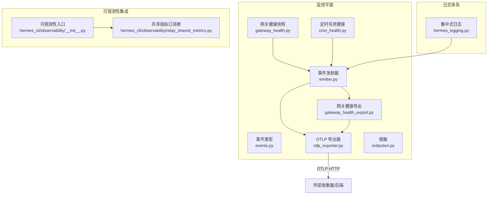
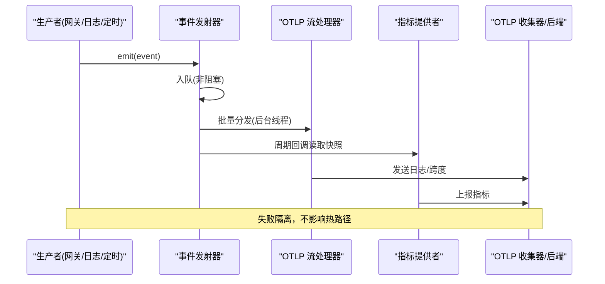
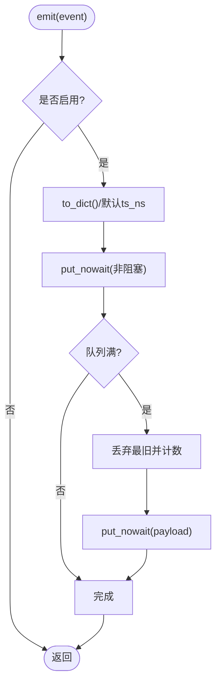
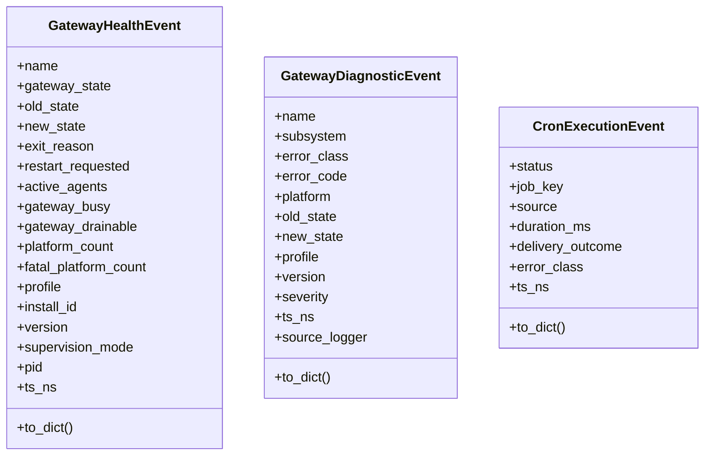
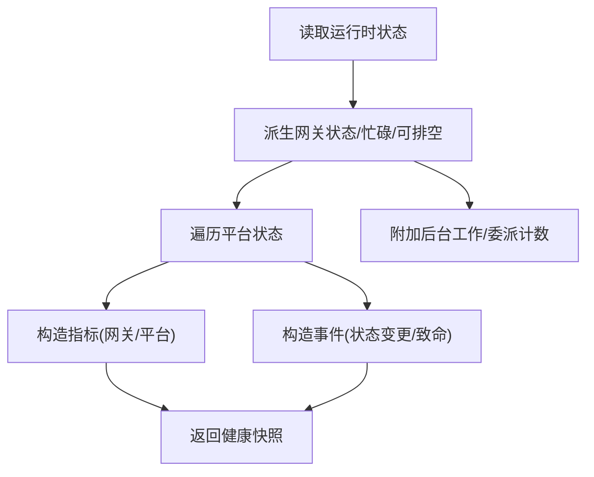
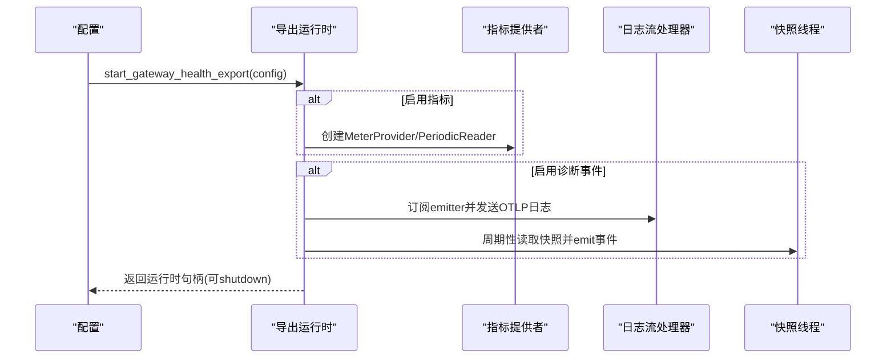
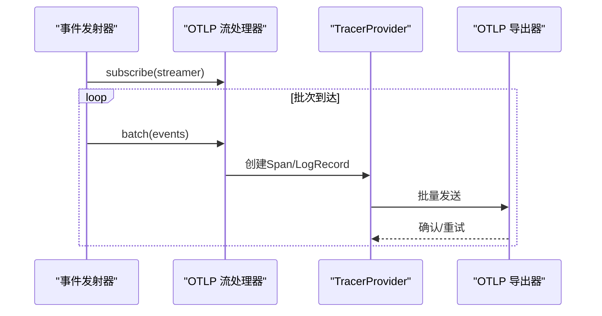
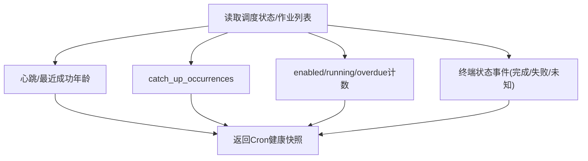
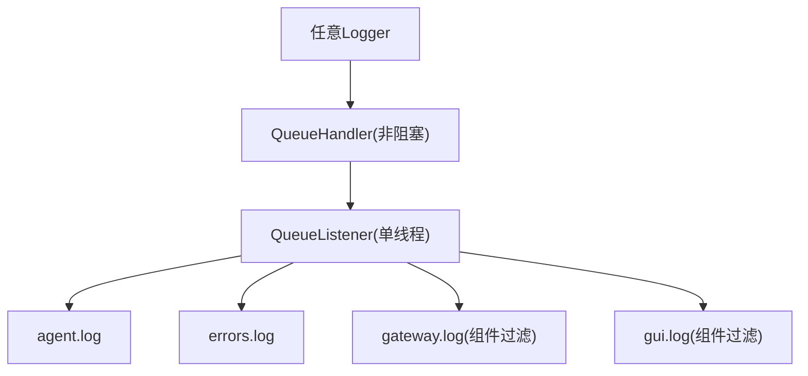
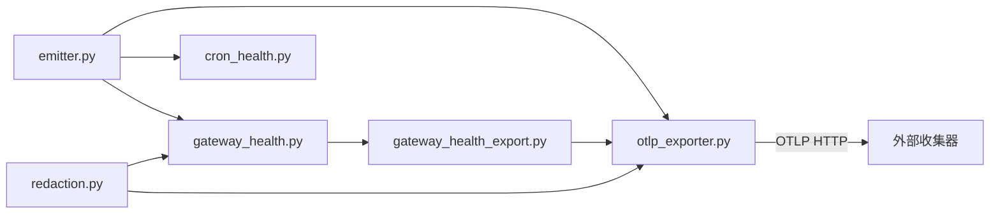

# 监控告警

<cite>
**本文引用的文件**
- [agent/monitoring/__init__.py](file://agent/monitoring/__init__.py)
- [agent/monitoring/emitter.py](file://agent/monitoring/emitter.py)
- [agent/monitoring/events.py](file://agent/monitoring/events.py)
- [agent/monitoring/gateway_health.py](file://agent/monitoring/gateway_health.py)
- [agent/monitoring/gateway_health_export.py](file://agent/monitoring/gateway_health_export.py)
- [agent/monitoring/otlp_exporter.py](file://agent/monitoring/otlp_exporter.py)
- [agent/monitoring/redaction.py](file://agent/monitoring/redaction.py)
- [agent/monitoring/cron_health.py](file://agent/monitoring/cron_health.py)
- [hermes_logging.py](file://hermes_logging.py)
- [hermes_cli/observability/__init__.py](file://hermes_cli/observability/__init__.py)
- [hermes_cli/observability/relay_shared_metrics.py](file://hermes_cli/observability/relay_shared_metrics.py)
</cite>

## 目录
1. [简介](#简介)
2. [项目结构](#项目结构)
3. [核心组件](#核心组件)
4. [架构总览](#架构总览)
5. [详细组件分析](#详细组件分析)
6. [依赖关系分析](#依赖关系分析)
7. [性能考量](#性能考量)
8. [故障排查指南](#故障排查指南)
9. [结论](#结论)
10. [附录](#附录)

## 简介
本文件面向运维与平台工程团队，系统性说明 Hermes Agent 的监控、日志与告警能力。内容覆盖：
- 关键性能指标（KPI）的定义、采集、统计与分析方法
- 压缩系统相关运行态可见性（网关健康、后台任务、定时任务）
- 可视化监控、趋势分析与异常检测的数据基础
- 监控数据的存储、查询与报表生成路径
- 告警规则配置建议、通知渠道与应急响应流程
- 监控对性能的影响、数据保留策略与隐私保护措施
- 仪表板配置、告警调优与问题诊断指导

## 项目结构
监控子系统位于 agent/monitoring 下，采用“事件总线 + OTLP 导出”的解耦设计；日志体系由 hermes_logging.py 集中管理；CLI 侧提供共享指标集成入口。

图表来源
- [agent/monitoring/emitter.py:1-212](file://agent/monitoring/emitter.py#L1-L212)
- [agent/monitoring/gateway_health_export.py:587-637](file://agent/monitoring/gateway_health_export.py#L587-L637)
- [agent/monitoring/otlp_exporter.py:235-261](file://agent/monitoring/otlp_exporter.py#L235-L261)
- [hermes_logging.py:259-376](file://hermes_logging.py#L259-L376)

章节来源
- [agent/monitoring/__init__.py:1-30](file://agent/monitoring/__init__.py#L1-L30)
- [agent/monitoring/emitter.py:1-212](file://agent/monitoring/emitter.py#L1-L212)
- [hermes_logging.py:259-376](file://hermes_logging.py#L259-L376)

## 核心组件
- 事件发射器（MonitoringEmitter）：进程内无阻塞队列+后台分发线程，保证热路径零阻塞、永不抛异常；支持批量分发与订阅者隔离失败。
- 事件类型（GatewayHealthEvent/GatewayDiagnosticEvent/CronExecutionEvent）：仅包含内容无关的结构化字段，便于安全导出。
- 网关健康快照构建器：从运行时状态派生指标与事件，统一归一化状态、错误分类与实例标识。
- 网关健康导出运行时：按配置启动指标提供者、日志流处理器与快照线程，负责生命周期管理与优雅关闭。
- OTLP 导出器：将事件映射为 OpenTelemetry Span/Log/Metric，通过 HTTP 发送到 operator 配置的端点。
- 脱敏模块：强制对敏感信息、PII 进行不可逆替换，确保任何出站字符串均安全。
- 定时任务健康：采集调度心跳、最近成功时间、积压次数、作业数与超时作业等指标。
- 集中式日志：多文件轮转、组件路由、会话上下文注入、异步队列写入，避免阻塞事件循环。
- CLI 可观测性入口：桥接 NeMo Relay 共享指标，记录模型调用、工具调用、技能生命周期等。

章节来源
- [agent/monitoring/emitter.py:36-158](file://agent/monitoring/emitter.py#L36-L158)
- [agent/monitoring/events.py:19-80](file://agent/monitoring/events.py#L19-L80)
- [agent/monitoring/gateway_health.py:210-291](file://agent/monitoring/gateway_health.py#L210-L291)
- [agent/monitoring/gateway_health_export.py:101-165](file://agent/monitoring/gateway_health_export.py#L101-L165)
- [agent/monitoring/otlp_exporter.py:107-180](file://agent/monitoring/otlp_exporter.py#L107-L180)
- [agent/monitoring/redaction.py:58-66](file://agent/monitoring/redaction.py#L58-L66)
- [agent/monitoring/cron_health.py:148-192](file://agent/monitoring/cron_health.py#L148-L192)
- [hermes_logging.py:259-376](file://hermes_logging.py#L259-L376)
- [hermes_cli/observability/__init__.py:11-32](file://hermes_cli/observability/__init__.py#L11-L32)

## 架构总览
监控平面以“事件总线”为中心，生产者在热路径中 emit() 事件，消费者（OTLP 流处理器、指标提供者）在后台线程消费并发送。所有出站数据经过脱敏与白名单过滤，确保不泄露敏感信息。

图表来源
- [agent/monitoring/emitter.py:52-116](file://agent/monitoring/emitter.py#L52-L116)
- [agent/monitoring/gateway_health_export.py:417-468](file://agent/monitoring/gateway_health_export.py#L417-L468)
- [agent/monitoring/otlp_exporter.py:183-217](file://agent/monitoring/otlp_exporter.py#L183-L217)

## 详细组件分析

### 事件发射器（MonitoringEmitter）
- 职责：维护环形缓冲队列、后台分发线程、订阅者列表；提供 emit/subscribe/unsubscribe/stats/close。
- 关键特性：
  - 热路径不变式：emit() 微秒级返回、不阻塞磁盘/网络、绝不抛出异常。
  - 队列满时丢弃最旧事件，计数 dropped。
  - 批量分发，每个订阅者失败隔离。
  - 支持 flush(timeout) 用于测试或优雅关闭。
- 复杂度：入队 O(1)，分发 O(n)（n=批大小），内存上限固定。

图表来源
- [agent/monitoring/emitter.py:52-77](file://agent/monitoring/emitter.py#L52-L77)

章节来源
- [agent/monitoring/emitter.py:36-158](file://agent/monitoring/emitter.py#L36-L158)

### 事件类型与脱敏
- GatewayHealthEvent：网关健康快照/生命周期事件，包含活跃代理数、忙/可排空标志、平台计数等。
- GatewayDiagnosticEvent：操作诊断事件，包含子系统、错误分类、严重级别等。
- CronExecutionEvent：定时任务执行生命周期投影，包含状态、耗时、投递结果等。
- 脱敏：所有出站字符串经 redact_for_export，先处理密钥，再处理 PII（邮箱、电话、UUID）。

图表来源
- [agent/monitoring/events.py:19-80](file://agent/monitoring/events.py#L19-L80)
- [agent/monitoring/redaction.py:58-66](file://agent/monitoring/redaction.py#L58-L66)

章节来源
- [agent/monitoring/events.py:19-80](file://agent/monitoring/events.py#L19-L80)
- [agent/monitoring/redaction.py:1-72](file://agent/monitoring/redaction.py#L1-L72)

### 网关健康快照与指标
- 指标示例：
  - hermes.gateway.up / hermes.gateway.state / hermes.gateway.active_agents
  - hermes.gateway.busy / hermes.gateway.drainable / hermes.gateway.restart_requested
  - hermes.platform.up / hermes.platform.degraded（含 platform/state/error_code）
  - hermes.gateway.background_work / hermes.gateway.background_delegations
- 事件示例：
  - gateway.health_snapshot / gateway.lifecycle / gateway.exit
  - platform.state_change / platform.fatal
- 错误分类：auth_failed、rate_limited、timeout、network_error、invalid_config、startup_failed、platform_fatal 等。
- 实例标识：基于 install_id 的哈希值作为 service.instance.id，稳定且匿名。

图表来源
- [agent/monitoring/gateway_health.py:210-291](file://agent/monitoring/gateway_health.py#L210-L291)
- [agent/monitoring/gateway_health_export.py:358-401](file://agent/monitoring/gateway_health_export.py#L358-L401)

章节来源
- [agent/monitoring/gateway_health.py:20-154](file://agent/monitoring/gateway_health.py#L20-L154)
- [agent/monitoring/gateway_health.py:210-291](file://agent/monitoring/gateway_health.py#L210-L291)
- [agent/monitoring/gateway_health_export.py:358-401](file://agent/monitoring/gateway_health_export.py#L358-L401)

### 网关健康导出运行时
- 功能：根据配置启用指标与诊断事件导出；启动 OTLP 指标提供者、日志流处理器、快照线程；优雅关闭。
- 配置要点：
  - monitoring.gateway_health_export.enabled/metrics_enabled/diagnostic_events_enabled
  - monitoring.export.otlp.endpoint/headers_env
  - export_interval_seconds/logs_export_interval_seconds
- 资源属性：service.name、service.instance.id、telemetry.scope 等白名单过滤。

图表来源
- [agent/monitoring/gateway_health_export.py:587-637](file://agent/monitoring/gateway_health_export.py#L587-L637)
- [agent/monitoring/gateway_health_export.py:417-468](file://agent/monitoring/gateway_health_export.py#L417-L468)
- [agent/monitoring/gateway_health_export.py:559-580](file://agent/monitoring/gateway_health_export.py#L559-L580)

章节来源
- [agent/monitoring/gateway_health_export.py:101-165](file://agent/monitoring/gateway_health_export.py#L101-L165)
- [agent/monitoring/gateway_health_export.py:587-637](file://agent/monitoring/gateway_health_export.py#L587-L637)

### OTLP 导出器
- 作用：将事件映射为 OTel Span/Log，发送至 operator 配置的 OTLP 端点；支持 headers_env 动态解析。
- 可用性：可选依赖，未安装时给出明确提示；非交互模式自动尝试懒安装。
- 事件过滤：通过 event_filter 限定只导出特定平面事件，防止跨平面泄漏。

图表来源
- [agent/monitoring/otlp_exporter.py:183-217](file://agent/monitoring/otlp_exporter.py#L183-L217)
- [agent/monitoring/otlp_exporter.py:235-261](file://agent/monitoring/otlp_exporter.py#L235-L261)

章节来源
- [agent/monitoring/otlp_exporter.py:107-180](file://agent/monitoring/otlp_exporter.py#L107-L180)
- [agent/monitoring/otlp_exporter.py:235-261](file://agent/monitoring/otlp_exporter.py#L235-L261)

### 定时任务健康
- 指标：
  - hermes.cron.scheduler.heartbeat_age_seconds
  - hermes.cron.scheduler.last_success_age_seconds
  - hermes.cron.scheduler.catch_up_occurrences
  - hermes.cron.jobs.enabled / running / overdue
- 事件：CronExecutionEvent（状态、耗时、投递结果、错误分类）。

图表来源
- [agent/monitoring/cron_health.py:148-192](file://agent/monitoring/cron_health.py#L148-L192)
- [agent/monitoring/cron_health.py:90-130](file://agent/monitoring/cron_health.py#L90-L130)

章节来源
- [agent/monitoring/cron_health.py:1-202](file://agent/monitoring/cron_health.py#L1-L202)

### 集中式日志
- 文件：
  - agent.log（主活动日志）
  - errors.log（警告及以上）
  - gateway.log（仅 gateway.* 组件）
  - gui.log（仅 GUI/TUI 组件）
- 特性：
  - 轮转与备份数量可配
  - 组件过滤器路由
  - 会话上下文注入（session_tag）
  - 异步队列写入，避免阻塞事件循环
  - Windows 并发锁超时静默处理

图表来源
- [hermes_logging.py:259-376](file://hermes_logging.py#L259-L376)
- [hermes_logging.py:575-644](file://hermes_logging.py#L575-L644)

章节来源
- [hermes_logging.py:259-376](file://hermes_logging.py#L259-L376)
- [hermes_logging.py:575-644](file://hermes_logging.py#L575-L644)

### CLI 可观测性集成
- 入口：observe_lifecycle(hook_name, **kwargs) 将生命周期事件分发给内置可观测性功能。
- 共享指标：通过 SharedMetricsSubscriber 注册到 Relay，记录模型调用、工具调用、技能加载/生命周期等，保持隐私安全（不携带敏感内容）。

章节来源
- [hermes_cli/observability/__init__.py:11-32](file://hermes_cli/observability/__init__.py#L11-L32)
- [hermes_cli/observability/relay_shared_metrics.py:121-146](file://hermes_cli/observability/relay_shared_metrics.py#L121-L146)

## 依赖关系分析
- 松耦合：emitter 与 exporter 通过订阅者接口解耦；exporter 可独立启停。
- 可选依赖：OTLP SDK 为可选扩展，未安装时降级为警告日志。
- 配置驱动：monitoring.gateway_health_export 与 monitoring.export.otlp 控制行为。
- 隐私保护：redaction 对所有出站字符串强制脱敏；resource attributes 白名单限制。

图表来源
- [agent/monitoring/emitter.py:118-130](file://agent/monitoring/emitter.py#L118-L130)
- [agent/monitoring/gateway_health_export.py:587-637](file://agent/monitoring/gateway_health_export.py#L587-L637)
- [agent/monitoring/otlp_exporter.py:235-261](file://agent/monitoring/otlp_exporter.py#L235-L261)
- [agent/monitoring/redaction.py:58-66](file://agent/monitoring/redaction.py#L58-L66)

章节来源
- [agent/monitoring/emitter.py:118-130](file://agent/monitoring/emitter.py#L118-L130)
- [agent/monitoring/gateway_health_export.py:587-637](file://agent/monitoring/gateway_health_export.py#L587-L637)
- [agent/monitoring/otlp_exporter.py:235-261](file://agent/monitoring/otlp_exporter.py#L235-L261)
- [agent/monitoring/redaction.py:58-66](file://agent/monitoring/redaction.py#L58-L66)

## 性能考量
- 热路径零阻塞：emitter.emit() 使用非阻塞入队，队列满则丢弃最旧事件，确保不阻塞网关或会话。
- 批量分发：后台线程批量消费，减少网络/序列化开销。
- 指标采样：指标提供者周期性回调，避免高频采样造成压力。
- 日志异步化：通过 QueueListener 将文件 I/O 移出事件循环，避免轮询/锁竞争影响吞吐。
- 资源限制：resource attributes 白名单与长度限制，防止标签爆炸。
- 失败隔离：订阅者异常被捕获并记录，不影响其他订阅者与热路径。

[本节为通用性能指导，无需具体文件引用]

## 故障排查指南
- 监控未生效
  - 检查 monitoring.gateway_health_export.enabled 与 monitoring.export.otlp.enabled/endpoint 是否配置正确。
  - 确认 OTLP SDK 已安装或允许懒安装；查看启动日志中的警告信息。
- 指标缺失
  - 确认指标回调未被异常中断；检查 _read_runtime_snapshot 与 cron 快照是否可用。
  - 验证 resource attributes 白名单是否包含必要字段。
- 日志丢失
  - 检查 QueueListener 是否启动；确认文件权限与轮转策略。
  - Windows 下关注 concurrent-log-handler 锁超时，已被静默处理。
- 告警误报/漏报
  - 调整阈值与窗口；结合 hermes.platform.degraded、hermes.cron.scheduler.*_age_seconds 等指标综合判断。
  - 使用 error_class 与 severity 进行聚合分析。
- 隐私合规
  - 确认 redaction_for_export 始终生效；避免在 resource attributes 中写入敏感值。

章节来源
- [agent/monitoring/gateway_health_export.py:587-637](file://agent/monitoring/gateway_health_export.py#L587-L637)
- [agent/monitoring/otlp_exporter.py:235-261](file://agent/monitoring/otlp_exporter.py#L235-L261)
- [hermes_logging.py:575-644](file://hermes_logging.py#L575-L644)
- [agent/monitoring/redaction.py:58-66](file://agent/monitoring/redaction.py#L58-L66)

## 结论
Hermes Agent 的监控告警体系以事件总线为核心，结合 OTLP 导出与集中式日志，提供了高可靠、低侵入、隐私安全的可观测性能力。通过网关健康、后台任务与定时任务的指标与事件，运维人员可以构建完整的可视化监控、趋势分析与异常检测方案，并基于稳定的实例标识与结构化字段实现高效告警与报表生成。

[本节为总结性内容，无需具体文件引用]

## 附录

### 关键指标清单与含义
- hermes.gateway.up：网关存活
- hermes.gateway.state：网关状态（starting/running/stopped 等）
- hermes.gateway.active_agents：活跃代理数
- hermes.gateway.busy：是否繁忙
- hermes.gateway.drainable：是否可排空
- hermes.gateway.restart_requested：是否请求重启
- hermes.gateway.background_work：后台任务总数（不含 active_agents）
- hermes.gateway.background_delegations：后台委派单元数
- hermes.platform.up / hermes.platform.degraded：平台上下线与退化
- hermes.cron.scheduler.heartbeat_age_seconds / last_success_age_seconds：调度心跳与最近成功时间
- hermes.cron.scheduler.catch_up_occurrences：追赶次数
- hermes.cron.jobs.enabled / running / overdue：作业状态

章节来源
- [agent/monitoring/gateway_health.py:230-291](file://agent/monitoring/gateway_health.py#L230-L291)
- [agent/monitoring/gateway_health_export.py:437-454](file://agent/monitoring/gateway_health_export.py#L437-L454)
- [agent/monitoring/cron_health.py:148-192](file://agent/monitoring/cron_health.py#L148-L192)

### 告警规则建议
- 网关健康
  - hermes.gateway.up == 0 持续 N 分钟 -> 严重
  - hermes.gateway.state != running 持续 N 分钟 -> 严重
  - hermes.gateway.busy == 1 且 hermes.gateway.active_agents > 阈值 -> 警告
- 平台健康
  - hermes.platform.degraded == 1 -> 警告/严重（依据 error_class）
- 定时任务
  - hermes.cron.scheduler.heartbeat_age_seconds > 阈值 -> 警告
  - hermes.cron.scheduler.last_success_age_seconds > 阈值 -> 严重
  - hermes.cron.jobs.overdue > 0 -> 警告
- 后台负载
  - hermes.gateway.background_work > 阈值 -> 警告
  - hermes.gateway.background_delegations > max_concurrent_children -> 警告

[本节为通用告警建议，无需具体文件引用]

### 数据保留与隐私保护
- 数据保留
  - 日志轮转：max_size_mb 与 backup_count 控制保留量
  - 指标：由后端（如 OTLP 收集器/时序数据库）决定保留策略
- 隐私保护
  - 强制脱敏：redact_for_export 对所有出站字符串生效
  - 资源属性白名单：仅允许安全字段
  - 实例标识：基于 install_id 的哈希，匿名稳定

章节来源
- [hermes_logging.py:259-376](file://hermes_logging.py#L259-L376)
- [agent/monitoring/redaction.py:58-66](file://agent/monitoring/redaction.py#L58-L66)
- [agent/monitoring/gateway_health_export.py:55-88](file://agent/monitoring/gateway_health_export.py#L55-L88)

### 仪表板与报表
- 指标可视化：基于 hermes.* 指标构建网关/平台/定时任务面板
- 日志检索：按组件（gateway/gui/agent/tools/cron）与 session_tag 过滤
- 报表生成：利用后端聚合能力（如 Prometheus/Grafana/ELK）生成趋势与异常报告

[本节为通用实践建议，无需具体文件引用]