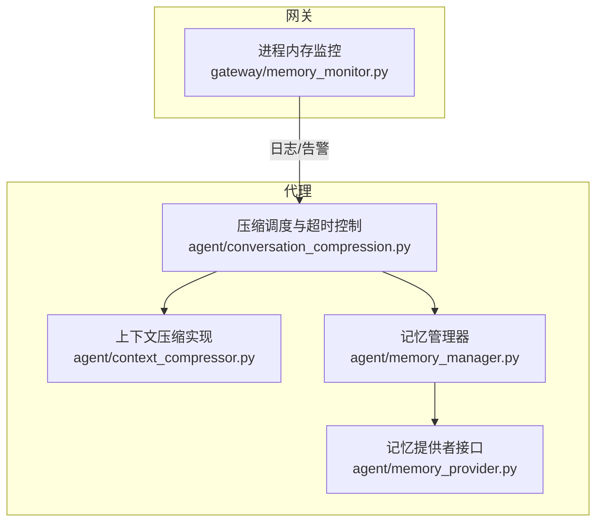
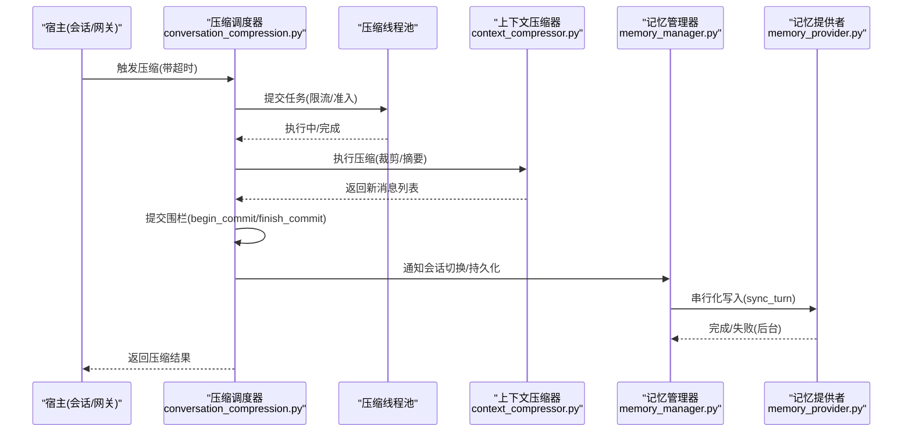
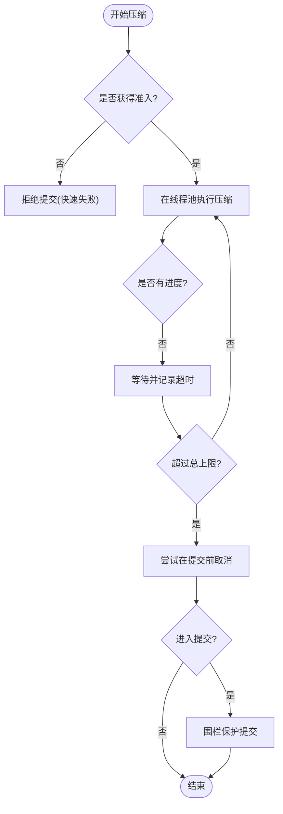
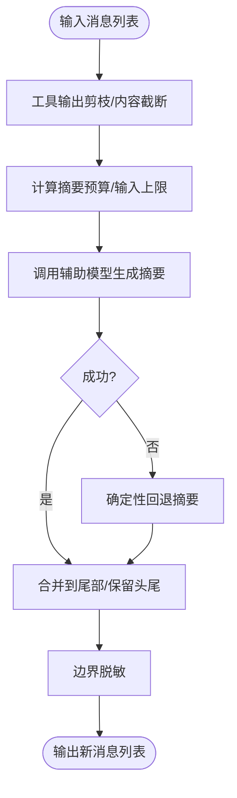
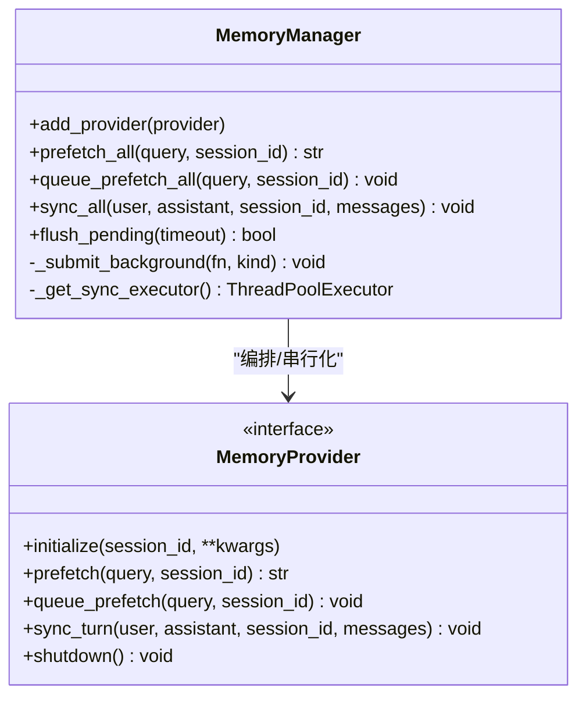
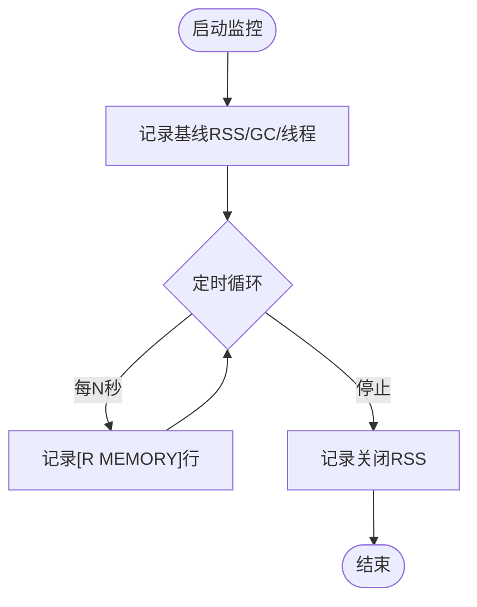
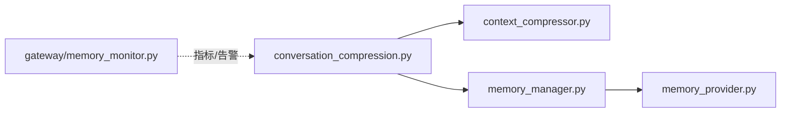

# 资源管理优化

<cite>
**本文引用的文件**
- [agent/memory_manager.py](file://agent/memory_manager.py)
- [agent/memory_provider.py](file://agent/memory_provider.py)
- [agent/context_compressor.py](file://agent/context_compressor.py)
- [agent/conversation_compression.py](file://agent/conversation_compression.py)
- [gateway/memory_monitor.py](file://gateway/memory_monitor.py)
</cite>

## 目录
1. [简介](#简介)
2. [项目结构](#项目结构)
3. [核心组件](#核心组件)
4. [架构总览](#架构总览)
5. [详细组件分析](#详细组件分析)
6. [依赖关系分析](#依赖关系分析)
7. [性能考量](#性能考量)
8. [故障排查指南](#故障排查指南)
9. [结论](#结论)
10. [附录](#附录)

## 简介
本文件面向运维与平台工程团队，聚焦压缩系统中的资源管理优化：包括线程池配置、连接/外部调用隔离、文件句柄与内存使用优化、垃圾回收策略、资源泄漏防护、异常处理与服务降级。文档同时给出资源监控指标、性能瓶颈分析方法与不同场景下的资源配置建议，帮助在长驻进程（Gateway/Agent）中稳定运行高负载的上下文压缩与记忆同步任务。

## 项目结构
围绕“压缩”和“记忆”的资源管理主要分布在以下模块：
- 上下文压缩执行与超时控制：conversation_compression.py
- 压缩算法与摘要生成：context_compressor.py
- 记忆提供者编排与后台同步：memory_manager.py、memory_provider.py
- Gateway 进程级内存监控：memory_monitor.py

图表来源
- [agent/conversation_compression.py:693-773](file://agent/conversation_compression.py#L693-L773)
- [agent/context_compressor.py:1-180](file://agent/context_compressor.py#L1-L180)
- [agent/memory_manager.py:364-757](file://agent/memory_manager.py#L364-L757)
- [agent/memory_provider.py:81-191](file://agent/memory_provider.py#L81-L191)
- [gateway/memory_monitor.py:139-224](file://gateway/memory_monitor.py#L139-L224)

章节来源
- [agent/conversation_compression.py:693-773](file://agent/conversation_compression.py#L693-L773)
- [agent/context_compressor.py:1-180](file://agent/context_compressor.py#L1-L180)
- [agent/memory_manager.py:364-757](file://agent/memory_manager.py#L364-L757)
- [agent/memory_provider.py:81-191](file://agent/memory_provider.py#L81-L191)
- [gateway/memory_monitor.py:139-224](file://gateway/memory_monitor.py#L139-L224)

## 核心组件
- 压缩调度器（conversation_compression.py）
  - 提供带进度感知的超时包装，限制并发压缩任务数，维护提交围栏（CompressionCommitFence），确保会话状态变更原子性。
  - 使用守护线程池执行压缩任务，避免阻塞主循环；对长时间无进展的任务进行可观测的等待与上报。
- 上下文压缩器（context_compressor.py）
  - 负责消息裁剪、摘要生成、工具输出剪枝、技能指令保留标记等，严格控制输入大小与摘要预算，避免慢后端超时或上下文爆炸。
- 记忆管理器（memory_manager.py）
  - 统一编排内置与外部记忆提供者，串行化写入顺序，后台队列化 prefetch/sync，设置外部预取超时，防止慢/卡死的后端阻塞对话。
- 记忆提供者接口（memory_provider.py）
  - 定义生命周期与可选钩子（on_pre_compress、on_session_switch 等），要求 provider 实现非阻塞写入与清理。
- 进程内存监控（gateway/memory_monitor.py）
  - 周期性记录 RSS、GC 计数、线程数，支持启动基线、关闭终值，便于定位内存泄漏。

章节来源
- [agent/conversation_compression.py:445-691](file://agent/conversation_compression.py#L445-L691)
- [agent/context_compressor.py:417-443](file://agent/context_compressor.py#L417-L443)
- [agent/memory_manager.py:364-757](file://agent/memory_manager.py#L364-L757)
- [agent/memory_provider.py:81-191](file://agent/memory_provider.py#L81-L191)
- [gateway/memory_monitor.py:83-224](file://gateway/memory_monitor.py#L83-L224)

## 架构总览
压缩路径中的资源隔离与并发控制要点：
- 压缩任务在独立守护线程池中执行，限制最大并发，避免队列无限增长。
- 提交阶段通过围栏保证会话持久化操作的原子性与可取消性。
- 记忆写入走单工作线程串行化，避免跨 turn 乱序；外部预取使用独立线程并带超时。
- 进程级内存监控以守护线程周期采集，不影响主流程。

图表来源
- [agent/conversation_compression.py:693-773](file://agent/conversation_compression.py#L693-L773)
- [agent/conversation_compression.py:445-691](file://agent/conversation_compression.py#L445-L691)
- [agent/context_compressor.py:417-443](file://agent/context_compressor.py#L417-L443)
- [agent/memory_manager.py:638-757](file://agent/memory_manager.py#L638-L757)
- [agent/memory_provider.py:154-191](file://agent/memory_provider.py#L154-L191)

## 详细组件分析

### 压缩调度与超时控制（conversation_compression.py）
- 线程池配置
  - 使用守护线程池，最大工作线程数固定为较小值，避免多实例压测时全部阻塞。
  - 提交前进行“准入”计数，超过上限立即拒绝，快速失败而非排队堆积。
- 提交围栏（CompressionCommitFence）
  - 将“取消”与“提交”边界解耦：可在提交前取消；若已进入提交，则等待提交完成后再释放锁。
  - 支持“撤销准入”，即使有挂起任务也不允许后续提交，保障资源安全退出。
- 进度感知与超时
  - 记录最近一次“向前推进”的时间点，区分“慢模型”和“卡住模型”，避免误杀仍在产出 token 的任务。
  - 超时分两层：空闲窗口与总上限，配合轮询等待切片，持续输出告警日志。

图表来源
- [agent/conversation_compression.py:693-773](file://agent/conversation_compression.py#L693-L773)
- [agent/conversation_compression.py:445-691](file://agent/conversation_compression.py#L445-L691)

章节来源
- [agent/conversation_compression.py:445-691](file://agent/conversation_compression.py#L445-L691)
- [agent/conversation_compression.py:693-773](file://agent/conversation_compression.py#L693-L773)

### 上下文压缩器（context_compressor.py）
- 资源与内存优化
  - 严格限制摘要输入字符数，避免慢后端上下文超限或超时。
  - 对工具输出进行剪枝，保留关键信息的同时降低上下文压力。
  - 对图片等大附件估算 token 成本，参与预算决策。
- 摘要预算与回退
  - 设定最小/最大摘要 token 范围，超出阈值采用确定性回退摘要，保持会话连续性。
  - 对历史技能指令进行“剪枝标记”注入，避免模型丢失必要上下文。
- 敏感信息保护
  - 穿越压缩边界的文本强制脱敏，防止密钥/令牌泄露到持久化摘要中。

图表来源
- [agent/context_compressor.py:417-443](file://agent/context_compressor.py#L417-L443)
- [agent/context_compressor.py:764-782](file://agent/context_compressor.py#L764-L782)

章节来源
- [agent/context_compressor.py:417-443](file://agent/context_compressor.py#L417-L443)
- [agent/context_compressor.py:764-782](file://agent/context_compressor.py#L764-L782)

### 记忆管理器（memory_manager.py）
- 并发与隔离
  - 外部记忆提供者的预取使用独立线程，带超时；同一 provider 重复预取会被跳过，避免重复网络请求。
  - 所有 provider 的 sync_turn 通过单工作线程串行化，保证 turn N 先于 turn N+1 落地。
- 资源泄漏防护
  - 后台任务使用守护线程池；关闭时等待有限时间，未完成的 future 被放弃并记录。
  - 注册工具 schema 时过滤核心工具名冲突，避免路由表污染。
- 优雅降级
  - 外部预取超时直接跳过，不阻塞当前 turn；provider 异常仅记录日志，不影响其他 provider。

图表来源
- [agent/memory_manager.py:364-757](file://agent/memory_manager.py#L364-L757)
- [agent/memory_provider.py:81-191](file://agent/memory_provider.py#L81-L191)

章节来源
- [agent/memory_manager.py:364-757](file://agent/memory_manager.py#L364-L757)
- [agent/memory_provider.py:81-191](file://agent/memory_provider.py#L81-L191)

### 进程内存监控（gateway/memory_monitor.py）
- 指标采集
  - 使用 resource.getrusage 或 psutil 获取 RSS，结合 gc.get_count() 与 active_count() 统计线程数。
  - 启动时记录基线，关闭时记录终值，便于前后对比。
- 可靠性
  - 监控线程为守护线程，异常不会导致网关崩溃；不可用时降级为警告并停止。

图表来源
- [gateway/memory_monitor.py:83-224](file://gateway/memory_monitor.py#L83-L224)

章节来源
- [gateway/memory_monitor.py:83-224](file://gateway/memory_monitor.py#L83-L224)

## 依赖关系分析
- conversation_compression.py 依赖 context_compressor.py 完成具体压缩逻辑，并通过 memory_manager.py 协调记忆提供者。
- memory_manager.py 依赖 memory_provider.py 抽象，屏蔽不同 provider 的差异。
- gateway/memory_monitor.py 独立于业务逻辑，仅采集进程级指标。

图表来源
- [agent/conversation_compression.py:693-773](file://agent/conversation_compression.py#L693-L773)
- [agent/context_compressor.py:1-180](file://agent/context_compressor.py#L1-L180)
- [agent/memory_manager.py:364-757](file://agent/memory_manager.py#L364-L757)
- [agent/memory_provider.py:81-191](file://agent/memory_provider.py#L81-L191)
- [gateway/memory_monitor.py:139-224](file://gateway/memory_monitor.py#L139-L224)

章节来源
- [agent/conversation_compression.py:693-773](file://agent/conversation_compression.py#L693-L773)
- [agent/context_compressor.py:1-180](file://agent/context_compressor.py#L1-L180)
- [agent/memory_manager.py:364-757](file://agent/memory_manager.py#L364-L757)
- [agent/memory_provider.py:81-191](file://agent/memory_provider.py#L81-L191)
- [gateway/memory_monitor.py:139-224](file://gateway/memory_monitor.py#L139-L224)

## 性能考量
- 线程池与并发
  - 压缩线程池小容量且守护，避免大量挂起任务拖垮进程；提交前准入限制防止队列膨胀。
  - 记忆写入串行化，避免竞争与乱序；外部预取并行但带超时与去重。
- 内存与 I/O
  - 压缩输入字符上限与摘要 token 上下限，减少大对象与慢后端风险。
  - 工具输出剪枝与图片 token 估算，降低上下文压力。
- GC 与线程
  - 监控模块定期输出 GC 计数与线程数，便于发现线程泄漏或 GC 频繁。
- 超时与降级
  - 压缩任务具备空闲与总上限双超时；记忆预取超时即跳过；提交围栏确保可取消且不破坏一致性。

[本节为通用指导，无需特定文件引用]

## 故障排查指南
- 症状：会话长时间“运行中”
  - 可能原因：记忆 provider 的 sync_turn 阻塞或网络超时。
  - 检查点：确认 memory_manager 的后台任务已队列化；查看相关日志中 provider 名称与错误。
  - 参考位置
    - [agent/memory_manager.py:638-694](file://agent/memory_manager.py#L638-L694)
- 症状：压缩反复失败或卡住
  - 可能原因：辅助模型慢/配额不足/认证失败；输入过大。
  - 检查点：查看压缩输入上限、摘要失败冷却、回退摘要启用情况；关注“进度感知”日志。
  - 参考位置
    - [agent/context_compressor.py:417-443](file://agent/context_compressor.py#L417-L443)
    - [agent/conversation_compression.py:693-773](file://agent/conversation_compression.py#L693-L773)
- 症状：内存持续增长
  - 可能原因：缓存/连接/会话未释放；线程泄漏。
  - 检查点：观察 [MEMORY] 日志趋势；核对线程数与 GC 计数；确认监控线程正常。
  - 参考位置
    - [gateway/memory_monitor.py:83-224](file://gateway/memory_monitor.py#L83-L224)

章节来源
- [agent/memory_manager.py:638-694](file://agent/memory_manager.py#L638-L694)
- [agent/context_compressor.py:417-443](file://agent/context_compressor.py#L417-L443)
- [agent/conversation_compression.py:693-773](file://agent/conversation_compression.py#L693-L773)
- [gateway/memory_monitor.py:83-224](file://gateway/memory_monitor.py#L83-L224)

## 结论
该压缩系统通过“受限并发+提交围栏+超时与进度感知”的组合，在保证一致性的前提下实现了高可用的上下文压缩；记忆子系统通过“串行写入+外部预取超时”避免慢后端阻塞主流程；进程级内存监控提供可观测性基础。运维侧应重点关注线程池容量、压缩超时、记忆 provider 超时与日志告警，结合 RSS/GC/线程数指标进行容量规划与调优。

[本节为总结，无需特定文件引用]

## 附录

### 资源监控指标与告警建议
- 进程级指标
  - RSS 趋势、GC 计数、活跃线程数、压缩任务提交/拒绝次数、提交围栏占用时长。
- 告警阈值建议
  - RSS 连续上升且无回落；线程数异常增长；压缩任务频繁被拒绝；提交围栏长期持有。
- 数据来源
  - [gateway/memory_monitor.py:83-224](file://gateway/memory_monitor.py#L83-L224)
  - [agent/conversation_compression.py:693-773](file://agent/conversation_compression.py#L693-L773)

### 参数调优与资源限制策略
- 压缩线程池
  - 根据并发会话数调整最大工作线程数；在高负载下优先保证快速失败与可观测性。
  - 参考：[agent/conversation_compression.py:693-773](file://agent/conversation_compression.py#L693-L773)
- 压缩超时
  - 合理设置空闲超时与总上限，避免长时间占用资源；结合进度感知减少误杀。
  - 参考：[agent/conversation_compression.py:693-773](file://agent/conversation_compression.py#L693-L773)
- 记忆预取超时
  - 外部 provider 预取超时不宜过长，避免阻塞用户交互；必要时降级为仅本地 provider。
  - 参考：[agent/memory_manager.py:547-595](file://agent/memory_manager.py#L547-L595)
- 输入与摘要预算
  - 控制摘要输入字符上限与摘要 token 范围，避免慢后端与上下文爆炸。
  - 参考：[agent/context_compressor.py:417-443](file://agent/context_compressor.py#L417-L443)

### 异常处理、资源清理与服务降级
- 异常处理
  - 记忆 provider 异常仅记录日志，不影响其他 provider；压缩失败使用回退摘要保持连续性。
  - 参考：[agent/memory_manager.py:638-694](file://agent/memory_manager.py#L638-L694)、[agent/context_compressor.py:417-443](file://agent/context_compressor.py#L417-L443)
- 资源清理
  - 后台任务使用守护线程；关闭时有限等待未完成任务；监控线程在关闭时记录终值。
  - 参考：[agent/memory_manager.py:698-757](file://agent/memory_manager.py#L698-L757)、[gateway/memory_monitor.py:196-224](file://gateway/memory_monitor.py#L196-L224)
- 服务降级
  - 外部预取超时即跳过；压缩提交被拒绝时继续对话但不压缩；监控不可用时降级为警告。
  - 参考：[agent/memory_manager.py:547-595](file://agent/memory_manager.py#L547-L595)、[agent/conversation_compression.py:693-773](file://agent/conversation_compression.py#L693-L773)、[gateway/memory_monitor.py:139-193](file://gateway/memory_monitor.py#L139-L193)