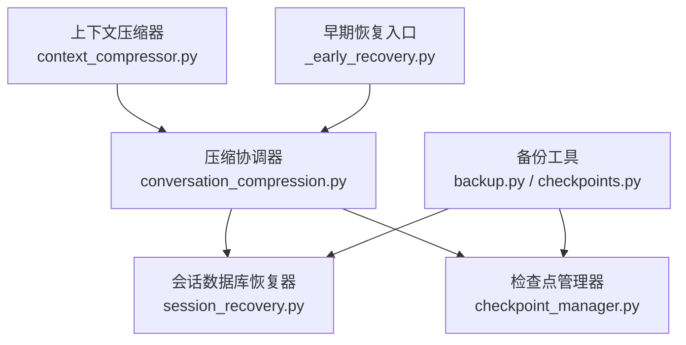
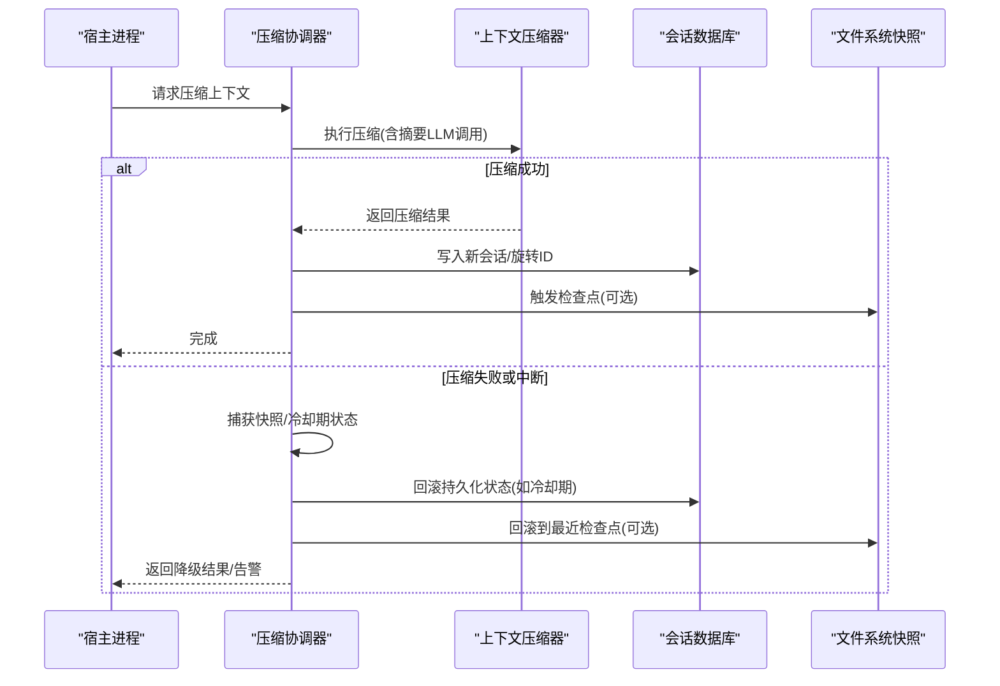
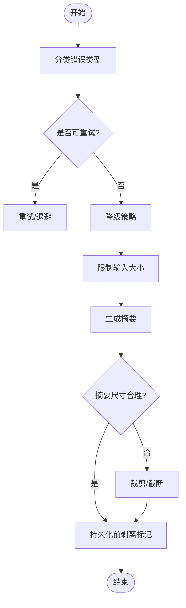
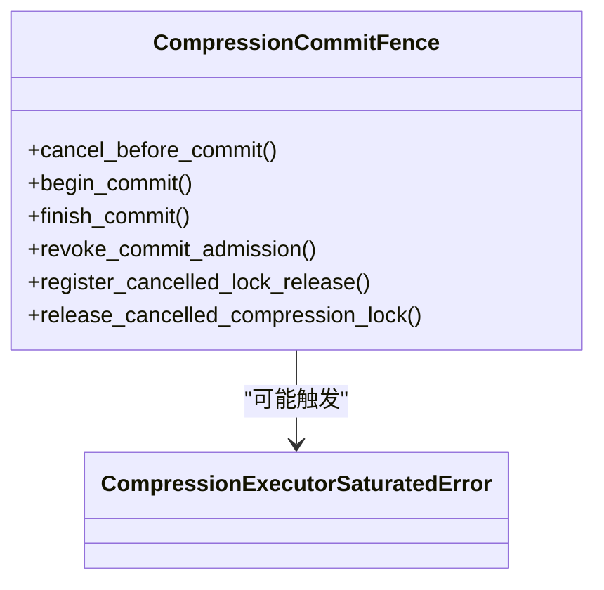
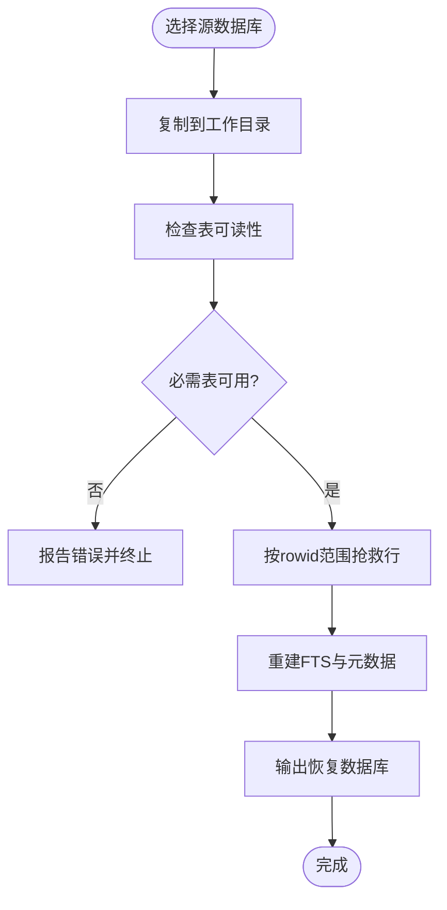
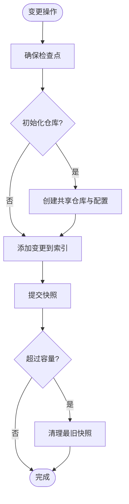
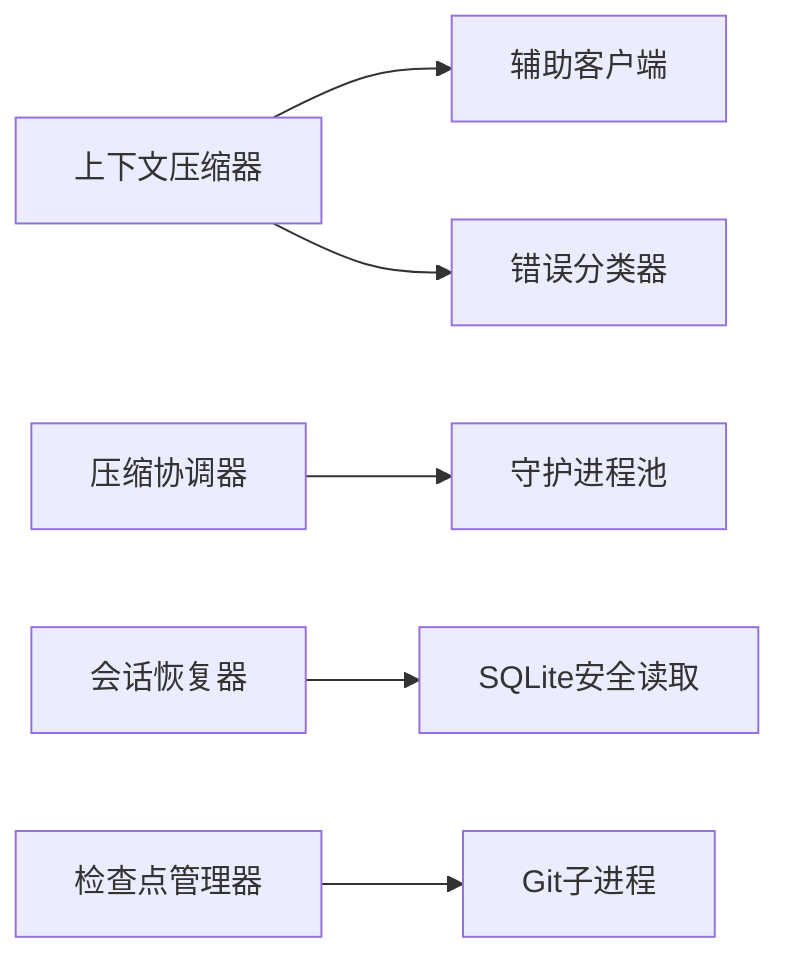

# 恢复机制

<cite>
**本文引用的文件**
- [agent/context_compressor.py](file://agent/context_compressor.py)
- [agent/conversation_compression.py](file://agent/conversation_compression.py)
- [hermes_cli/session_recovery.py](file://hermes_cli/session_recovery.py)
- [tools/checkpoint_manager.py](file://tools/checkpoint_manager.py)
- [hermes_cli/_early_recovery.py](file://hermes_cli/_early_recovery.py)
- [hermes_cli/backup.py](file://hermes_cli/backup.py)
- [hermes_cli/checkpoints.py](file://hermes_cli/checkpoints.py)
- [tests/agent/test_compression_interrupt_protection.py](file://tests/agent/test_compression_interrupt保护.py)
- [tests/agent/test_compression_orphan_recovery.py](file://tests/agent/test_compression_orphan_recovery.py)
- [tests/agent/test_compression_anti_thrash_recovery.py](file://tests/agent/test_compression_anti_thrash_recovery.py)
</cite>

## 目录
1. [简介](#简介)
2. [项目结构](#项目结构)
3. [核心组件](#核心组件)
4. [架构总览](#架构总览)
5. [详细组件分析](#详细组件分析)
6. [依赖关系分析](#依赖关系分析)
7. [性能考量](#性能考量)
8. [故障诊断指南](#故障诊断指南)
9. [结论](#结论)
10. [附录](#附录)

## 简介
本文件聚焦 Hermes Agent 在“压缩”与“会话状态”相关流程中的容错设计与故障恢复策略，覆盖以下目标：
- 压缩失败的处理流程、数据一致性与状态回滚机制
- 压缩中断的恢复策略、断点续传与数据完整性验证
- 错误分类、重试机制与降级策略
- 数据备份、快照管理与版本控制
- 故障诊断工具、日志分析与问题定位方法
- 灾难恢复计划、数据迁移与系统升级策略
- 面向开发者的异常处理、错误恢复与系统健壮性指导

## 项目结构
围绕恢复机制的关键代码分布在四个层面：
- 上下文压缩与压缩协调层：负责将长对话压缩为摘要，并在失败时进行降级与回滚
- 会话数据库离线恢复层：对损坏的 SQLite 会话数据库进行非破坏性恢复
- 文件系统快照与版本控制层：通过共享影子 Git 仓库实现自动快照与回滚
- 早期恢复与备份层：启动阶段快速恢复与日常备份能力

**图示来源**
- [agent/context_compressor.py:1-180](file://agent/context_compressor.py#L1-L180)
- [agent/conversation_compression.py:1-120](file://agent/conversation_compression.py#L1-L120)
- [hermes_cli/session_recovery.py:1-120](file://hermes_cli/session_recovery.py#L1-L120)
- [tools/checkpoint_manager.py:1-50](file://tools/checkpoint_manager.py#L1-L50)

**章节来源**
- [agent/context_compressor.py:1-180](file://agent/context_compressor.py#L1-L180)
- [agent/conversation_compression.py:1-120](file://agent/conversation_compression.py#L1-L120)
- [hermes_cli/session_recovery.py:1-120](file://hermes_cli/session_recovery.py#L1-L120)
- [tools/checkpoint_manager.py:1-50](file://tools/checkpoint_manager.py#L1-L50)

## 核心组件
- 上下文压缩器（ContextCompressor）
  - 负责将历史消息压缩为摘要，维护头尾保护区域、工具输出裁剪、技能指令保留标记等
  - 提供摘要访问/配额错误识别、输入字符上限、微压缩失败保护等容错机制
- 压缩协调器（CompressionExecutorSaturatedError、CompressionCommitFence）
  - 管理压缩任务提交、超时、进度感知、提交边界与回滚
  - 提供锁释放钩子、并发饱和保护、提交阶段越界等待与告警
- 会话数据库恢复器（SessionRecovery）
  - 对损坏的 SQLite 会话数据库进行非破坏性恢复，复制源到工作目录，重建 FTS 与元数据
  - 支持按 rowid 范围抢救可读取行，记录跳过范围并报告部分恢复
- 检查点管理器（CheckpointManager）
  - 基于共享影子 Git 仓库的透明文件系统快照，支持自动快照、回滚、清理与容量限制
  - 隔离 git 配置，避免用户环境干扰；支持迁移旧版单项目影子仓库

**章节来源**
- [agent/context_compressor.py:1-180](file://agent/context_compressor.py#L1-L180)
- [agent/conversation_compression.py:445-730](file://agent/conversation_compression.py#L445-L730)
- [hermes_cli/session_recovery.py:1-120](file://hermes_cli/session_recovery.py#L1-L120)
- [tools/checkpoint_manager.py:701-800](file://tools/checkpoint_manager.py#L701-L800)

## 架构总览
下图展示了压缩过程中的关键交互与恢复路径：

**图示来源**
- [agent/conversation_compression.py:445-730](file://agent/conversation_compression.py#L445-L730)
- [agent/context_compressor.py:1-180](file://agent/context_compressor.py#L1-L180)
- [tools/checkpoint_manager.py:701-800](file://tools/checkpoint_manager.py#L701-L800)

## 详细组件分析

### 上下文压缩器的容错设计
- 错误分类与不可重试判定
  - 识别认证、权限、配额类错误，避免无限重试
  - 对网络/速率限制错误允许重试，其他永久错误直接降级
- 输入与输出边界控制
  - 摘要输入字符上限，防止慢后端超窗或超时
  - 摘要长度上下限与封顶，避免摘要本身成为压力源
- 微压缩失败保护
  - 连续失败阈值后跳过卡住交换，避免忙循环
- 数据一致性保障
  - 剥离持久化标记，确保压缩产物不携带内部标志
  - 技能指令丢失时注入保留标记，避免模型误判技能已加载

**图示来源**
- [agent/context_compressor.py:73-95](file://agent/context_compressor.py#L73-L95)
- [agent/context_compressor.py:417-444](file://agent/context_compressor.py#L417-L444)
- [agent/context_compressor.py:230-247](file://agent/context_compressor.py#L230-L247)

**章节来源**
- [agent/context_compressor.py:73-95](file://agent/context_compressor.py#L73-L95)
- [agent/context_compressor.py:417-444](file://agent/context_compressor.py#L417-L444)
- [agent/context_compressor.py:230-247](file://agent/context_compressor.py#L230-L247)

### 压缩协调器与提交边界
- 提交围栏（CompressionCommitFence）
  - 保证在取消或异常时不会进入提交阶段，或在提交开始后等待完成
  - 支持锁释放钩子，避免悬挂的压缩锁导致后续压缩阻塞
- 并发饱和保护
  - 限制同时提交的压缩任务数，避免队列无限增长
  - 当所有工作槽被占用时，新提交快速失败并继续无压缩运行
- 进度感知与超时
  - 记录流式摘要的进度，区分慢模型与挂起模型
  - 超时后尝试回滚持久化状态（如冷却期），保持系统健康

**图示来源**
- [agent/conversation_compression.py:445-730](file://agent/conversation_compression.py#L445-L730)

**章节来源**
- [agent/conversation_compression.py:445-730](file://agent/conversation_compression.py#L445-L730)

### 会话数据库离线恢复
- 非破坏性恢复原则
  - 不直接打开源数据库，先复制到工作目录
  - 仅拷贝规范表，重建派生表与迁移信息
  - 恢复后的数据库不覆盖活跃数据库
- 空间与安全预检
  - 计算所需空间，包含源包、输出与冗余空间
  - 校验输出路径不与源或其侧车文件冲突
- 行级抢救与部分恢复
  - 通过 rowid 范围扫描，跳过损坏页，记录跳过范围
  - 报告完整/部分/失败状态，便于上层决策

**图示来源**
- [hermes_cli/session_recovery.py:1-120](file://hermes_cli/session_recovery.py#L1-L120)
- [hermes_cli/session_recovery.py:321-355](file://hermes_cli/session_recovery.py#L321-L355)
- [hermes_cli/session_recovery.py:508-664](file://hermes_cli/session_recovery.py#L508-L664)

**章节来源**
- [hermes_cli/session_recovery.py:1-120](file://hermes_cli/session_recovery.py#L1-L120)
- [hermes_cli/session_recovery.py:321-355](file://hermes_cli/session_recovery.py#L321-L355)
- [hermes_cli/session_recovery.py:508-664](file://hermes_cli/session_recovery.py#L508-L664)

### 文件系统快照与版本控制
- 共享影子仓库
  - 使用 GIT_DIR/GIT_WORK_TREE/GIT_INDEX_FILE 隔离用户环境
  - 去重对象存储，跨项目共享，减少重复开销
- 自动快照与回滚
  - 在文件变更操作前创建快照，每轮对话最多一次
  - 支持列出与回滚到任意检查点
- 清理与容量控制
  - 定期删除孤儿与过期快照，运行垃圾回收
  - 设置最大总容量与每目录快照数量上限

**图示来源**
- [tools/checkpoint_manager.py:239-277](file://tools/checkpoint_manager.py#L239-L277)
- [tools/checkpoint_manager.py:421-488](file://tools/checkpoint_manager.py#L421-L488)
- [tools/checkpoint_manager.py:701-800](file://tools/checkpoint_manager.py#L701-L800)

**章节来源**
- [tools/checkpoint_manager.py:239-277](file://tools/checkpoint_manager.py#L239-L277)
- [tools/checkpoint_manager.py:421-488](file://tools/checkpoint_manager.py#L421-L488)
- [tools/checkpoint_manager.py:701-800](file://tools/checkpoint_manager.py#L701-L800)

### 早期恢复与备份
- 早期恢复
  - 在启动阶段快速检测并恢复关键状态，避免冷启动失败
- 备份
  - 提供会话与配置的备份能力，支持导出与还原
  - 与检查点协同，形成多层恢复保障

**章节来源**
- [hermes_cli/_early_recovery.py:1-200](file://hermes_cli/_early_recovery.py#L1-L200)
- [hermes_cli/backup.py:1-200](file://hermes_cli/backup.py#L1-L200)
- [hermes_cli/checkpoints.py:1-200](file://hermes_cli/checkpoints.py#L1-L200)

## 依赖关系分析
- 上下文压缩器依赖辅助模型客户端与错误分类器，用于摘要生成与错误判断
- 压缩协调器依赖线程池与守护进程池，管理并发与超时
- 会话恢复器依赖 SQLite 安全读取与状态库，确保非破坏性恢复
- 检查点管理器依赖 Git 子进程与本地环境构建，确保隔离与稳定

**图示来源**
- [agent/context_compressor.py:28-44](file://agent/context_compressor.py#L28-L44)
- [agent/conversation_compression.py:698-730](file://agent/conversation_compression.py#L698-L730)
- [hermes_cli/session_recovery.py:23-29](file://hermes_cli/session_recovery.py#L23-L29)
- [tools/checkpoint_manager.py:239-277](file://tools/checkpoint_manager.py#L239-L277)

**章节来源**
- [agent/context_compressor.py:28-44](file://agent/context_compressor.py#L28-L44)
- [agent/conversation_compression.py:698-730](file://agent/conversation_compression.py#L698-L730)
- [hermes_cli/session_recovery.py:23-29](file://hermes_cli/session_recovery.py#L23-L29)
- [tools/checkpoint_manager.py:239-277](file://tools/checkpoint_manager.py#L239-L277)

## 性能考量
- 压缩输入字符上限与摘要封顶，避免慢后端超时与内存压力
- 微压缩失败保护，防止卡住交换导致的反复重试
- 并发饱和保护，限制同时压缩任务数，避免队列膨胀
- 检查点增量与去重，减少磁盘占用与 IO 开销
- 会话恢复按 rowid 范围抢救，降低全表扫描成本

[本节为通用性能讨论，无需特定文件引用]

## 故障诊断指南
- 日志关键字
  - 压缩状态：“正在压缩上下文”、“压缩完成”
  - 失败原因：“上下文过大但压缩被阻止”、“摘要失败冷却期”
  - 恢复动作：“部分恢复”、“跳过行范围”
- 诊断步骤
  - 检查压缩协调器日志，确认提交围栏与超时行为
  - 查看会话恢复报告，关注跳过范围与错误信息
  - 检查检查点列表，确认最近快照时间戳与可用性
- 常见问题定位
  - 摘要 LLM 超时：调整输入上限或切换模型
  - 数据库损坏：使用会话恢复器进行抢救并重建 FTS
  - 检查点缺失：确认 Git 可用性与仓库初始化

**章节来源**
- [agent/conversation_compression.py:79-165](file://agent/conversation_compression.py#L79-L165)
- [hermes_cli/session_recovery.py:357-378](file://hermes_cli/session_recovery.py#L357-L378)
- [tools/checkpoint_manager.py:783-800](file://tools/checkpoint_manager.py#L783-L800)

## 结论
Hermes Agent 的恢复机制通过多层次的容错与回滚设计，确保压缩与会话状态在异常情况下仍能保持稳定与可恢复。上下文压缩器提供细粒度的错误分类与降级策略；压缩协调器保证提交边界的原子性与并发安全；会话恢复器实现非破坏性抢救与重建；检查点管理器提供文件系统级别的快照与回滚。结合早期恢复与备份能力，系统具备从局部故障到灾难恢复的全面保障。

[本节为总结性内容，无需特定文件引用]

## 附录
- 开发者指导
  - 在压缩路径中始终使用提交围栏，避免部分提交
  - 对摘要 LLM 调用增加输入上限与失败冷却期
  - 在文件变更前后调用检查点管理器，确保可回滚
  - 使用会话恢复器进行离线修复，避免影响活跃数据库
- 灾难恢复计划
  - 定期备份会话与配置
  - 演练数据库恢复流程
  - 监控检查点容量与清理策略
- 数据迁移与升级
  - 利用检查点迁移旧版影子仓库
  - 使用会话恢复器在新 schema 下重建数据
  - 验证恢复后的 FTS 与元数据一致性

[本节为补充性内容，无需特定文件引用]