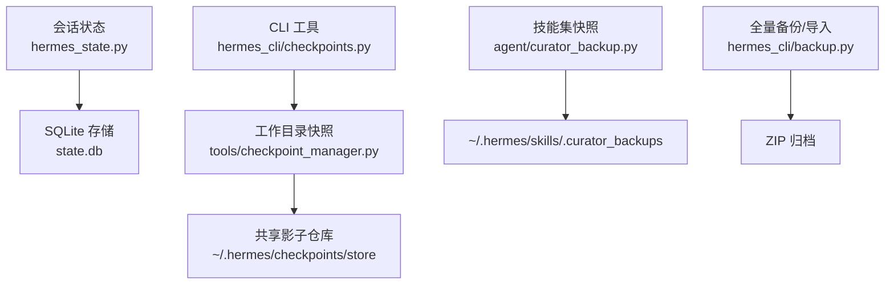
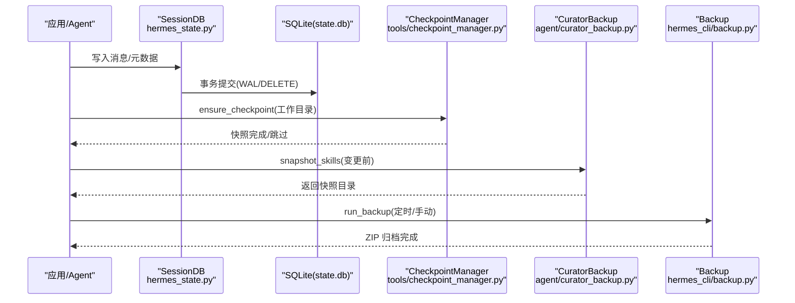
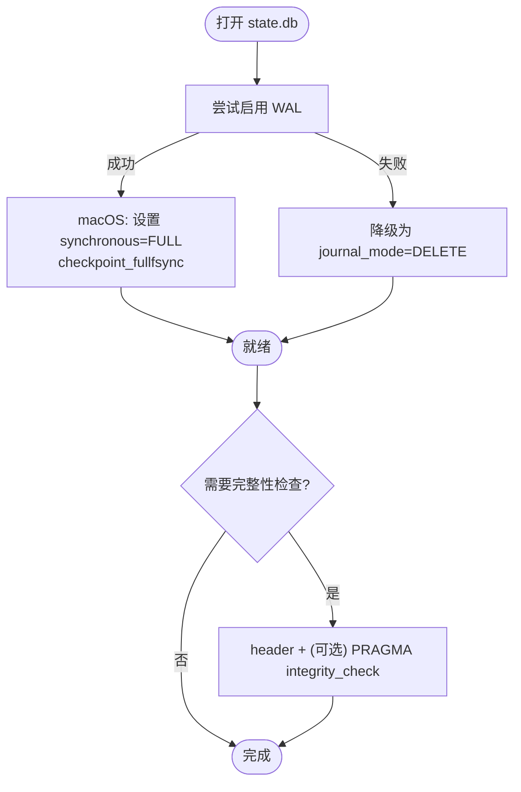
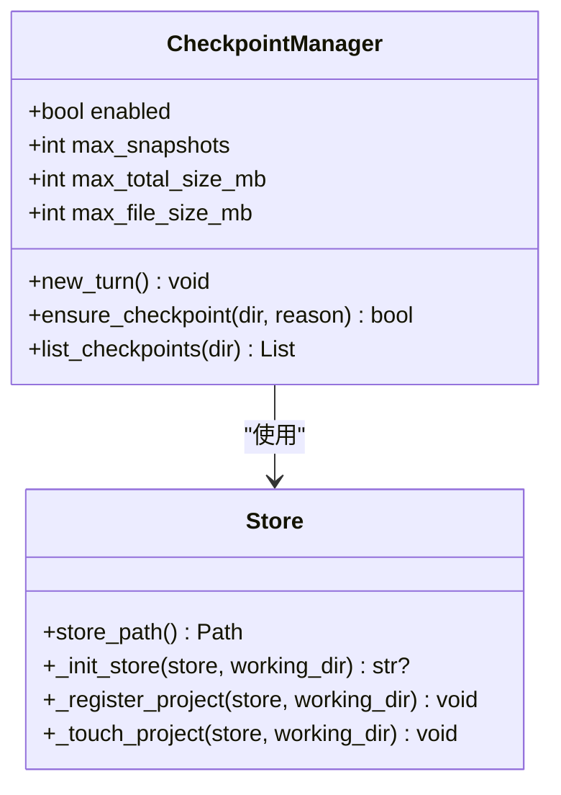
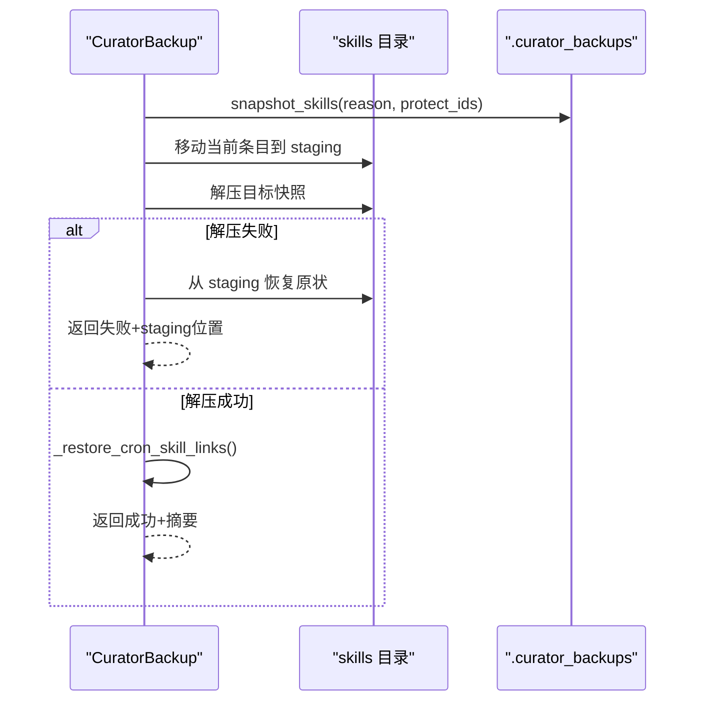
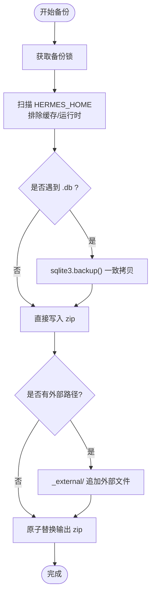
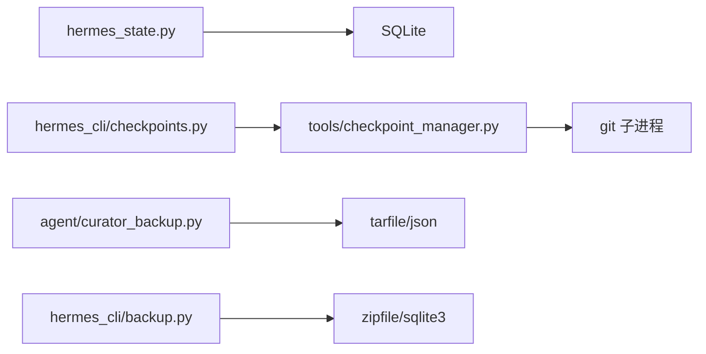

# 数据恢复策略

<cite>
**本文引用的文件**
- [hermes_state.py](file://hermes_state.py)
- [tools/checkpoint_manager.py](file://tools/checkpoint_manager.py)
- [hermes_cli/checkpoints.py](file://hermes_cli/checkpoints.py)
- [agent/curator_backup.py](file://agent/curator_backup.py)
- [hermes_cli/backup.py](file://hermes_cli/backup.py)
</cite>

## 目录
1. [简介](#简介)
2. [项目结构](#项目结构)
3. [核心组件](#核心组件)
4. [架构总览](#架构总览)
5. [详细组件分析](#详细组件分析)
6. [依赖关系分析](#依赖关系分析)
7. [性能考量](#性能考量)
8. [故障排查指南](#故障排查指南)
9. [结论](#结论)
10. [附录](#附录)

## 简介
本文件面向“压缩过程中的数据一致性保证与状态回滚机制”，围绕事务处理、ACID特性、数据持久化、备份策略、快照管理、版本控制、中断恢复、断点续传、完整性验证、数据迁移、修复与清理，以及灾难恢复计划进行系统化说明。同时提供开发者在数据一致性检查、恢复测试与数据安全方面的实践指导。

## 项目结构
与数据恢复相关的核心模块分布在以下位置：
- 会话状态与数据库持久化：hermes_state.py（SQLite WAL、FTS、WAL兼容降级、macOS fsync强化、WAL重置漏洞防护）
- 工作目录快照与回滚：tools/checkpoint_manager.py（共享影子仓库、自动快照、清理、迁移）、hermes_cli/checkpoints.py（CLI 查看/修剪/清理）
- 技能集快照与回滚：agent/curator_backup.py（tar.gz 快照、清单、cron 关联修复、保留策略）
- 全量备份与导入：hermes_cli/backup.py（zip 打包、SQLite 一致拷贝、完整性校验、外部路径纳入）

图表来源
- [hermes_state.py:1-120](file://hermes_state.py#L1-L120)
- [tools/checkpoint_manager.py:1-50](file://tools/checkpoint_manager.py#L1-L50)
- [agent/curator_backup.py:1-40](file://agent/curator_backup.py#L1-L40)
- [hermes_cli/backup.py:1-10](file://hermes_cli/backup.py#L1-L10)
- [hermes_cli/checkpoints.py:1-20](file://hermes_cli/checkpoints.py#L1-L20)

章节来源
- [hermes_state.py:1-120](file://hermes_state.py#L1-L120)
- [tools/checkpoint_manager.py:1-50](file://tools/checkpoint_manager.py#L1-L50)
- [agent/curator_backup.py:1-40](file://agent/curator_backup.py#L1-L40)
- [hermes_cli/backup.py:1-10](file://hermes_cli/backup.py#L1-L10)
- [hermes_cli/checkpoints.py:1-20](file://hermes_cli/checkpoints.py#L1-L20)

## 核心组件
- 会话状态数据库（SQLite）
  - 使用 WAL 模式提升并发读能力；在网络文件系统或特定平台不可用时自动降级为 DELETE 模式，确保可用性优先。
  - macOS 上强制 synchronous=FULL 并在 checkpoint 时启用 fullfsync，降低关机/重启期间的损坏风险。
  - 对已知存在 WAL-reset 漏洞的 SQLite 版本拒绝启用 WAL，避免多进程场景下的潜在损坏。
  - 提供零头检测与完整性校验工具，支持大库快速探测与完整 PRAGMA 校验。
- 工作目录快照（Git 影子仓库）
  - 通过 GIT_DIR/GIT_WORK_TREE/GIT_INDEX_FILE 将快照隔离到共享 store，按项目哈希分枝，实现跨项目对象去重。
  - 每轮对话前可触发一次快照，支持保留天数、最大体积、孤儿清理等策略。
  - 提供 CLI 查看、修剪、清理与历史迁移（v1→v2）。
- 技能集快照（tar.gz + manifest）
  - 在 curator 变更前对 skills 树创建 tar.gz 快照，并可选捕获 cron/jobs.json 以保持一致性。
  - 回滚流程包含安全前置快照、移动当前树、解压目标快照、失败回退与 cron 链接修复。
- 全量备份与导入
  - 对 ~/.hermes 进行 zip 打包，排除缓存/虚拟环境/运行时状态等再生成内容。
  - 使用 sqlite3.backup() 对 .db 做一致快照，跳过 WAL/SHM/JOURNAL 侧文件以避免不一致。
  - 导入时过滤掉易造成跨主机/容器状态污染的运行时文件。

章节来源
- [hermes_state.py:486-565](file://hermes_state.py#L486-L565)
- [hermes_state.py:697-780](file://hermes_state.py#L697-L780)
- [hermes_state.py:783-800](file://hermes_state.py#L783-L800)
- [hermes_cli/backup.py:342-374](file://hermes_cli/backup.py#L342-L374)
- [hermes_cli/backup.py:416-553](file://hermes_cli/backup.py#L416-L553)
- [tools/checkpoint_manager.py:13-49](file://tools/checkpoint_manager.py#L13-L49)
- [tools/checkpoint_manager.py:239-277](file://tools/checkpoint_manager.py#L239-L277)
- [agent/curator_backup.py:1-38](file://agent/curator_backup.py#L1-L38)
- [hermes_cli/checkpoints.py:1-20](file://hermes_cli/checkpoints.py#L1-L20)

## 架构总览
下图展示数据恢复相关组件之间的交互关系：会话状态写入 SQLite，工作目录变更触发快照，技能集变更由 curator 备份保护，全量备份定期生成用于灾难恢复。

图表来源
- [hermes_state.py:1-120](file://hermes_state.py#L1-L120)
- [tools/checkpoint_manager.py:701-782](file://tools/checkpoint_manager.py#L701-L782)
- [agent/curator_backup.py:217-291](file://agent/curator_backup.py#L217-L291)
- [hermes_cli/backup.py:581-795](file://hermes_cli/backup.py#L581-L795)

## 详细组件分析

### 会话状态数据库（SQLite）与 ACID
- 事务与持久化
  - 默认 WAL 模式，允许并发读取；当检测到网络文件系统或 ZFS 等不兼容场景时，自动降级为 DELETE 模式，保障功能可用。
  - macOS 上设置 synchronous=FULL 并在 checkpoint 时使用 fullfsync，增强断电/重启后的数据一致性。
  - 对存在 WAL-reset 漏洞的 SQLite 版本，拒绝启用 WAL，避免多进程并发下出现损坏。
- 错误与降级
  - 记录最近一次初始化错误，便于 /resume 等命令输出明确原因。
  - 针对 NFS/SMB/FUSE/ZFS 给出用户提示，引导修复挂载问题。
- 完整性校验
  - 提供 header 探测、PRAGMA integrity_check、大库快速探测（仅 schema 探测），避免长时间阻塞。
  - 识别“全零”异常数据库签名，辅助诊断。

图表来源
- [hermes_state.py:486-565](file://hermes_state.py#L486-L565)
- [hermes_state.py:697-780](file://hermes_state.py#L697-L780)
- [hermes_cli/backup.py:416-553](file://hermes_cli/backup.py#L416-L553)

章节来源
- [hermes_state.py:486-565](file://hermes_state.py#L486-L565)
- [hermes_state.py:697-780](file://hermes_state.py#L697-L780)
- [hermes_cli/backup.py:416-553](file://hermes_cli/backup.py#L416-L553)

### 工作目录快照与回滚（Checkpoint Manager）
- 设计要点
  - 单一共享影子仓库，按项目哈希分枝，对象级去重，显著节省空间。
  - 通过环境变量隔离 git 配置，避免后台快照被用户配置干扰。
  - 每轮对话前 dedup，同一目录每轮最多一次快照。
- 生命周期
  - new_turn() 重置本轮已快照集合。
  - ensure_checkpoint() 执行快照（跳过根目录/家目录/过大目录）。
  - prune_checkpoints() 删除孤儿/陈旧快照，并按大小上限裁剪最旧快照。
- 迁移与清理
  - 首次初始化时自动将 v1 的 per-project shadow repos 迁移至 legacy-<ts>/。
  - CLI 提供 status/list/prune/clear/clear-legacy 子命令。

图表来源
- [tools/checkpoint_manager.py:701-800](file://tools/checkpoint_manager.py#L701-L800)
- [tools/checkpoint_manager.py:421-487](file://tools/checkpoint_manager.py#L421-L487)
- [tools/checkpoint_manager.py:523-582](file://tools/checkpoint_manager.py#L523-L582)

章节来源
- [tools/checkpoint_manager.py:13-49](file://tools/checkpoint_manager.py#L13-L49)
- [tools/checkpoint_manager.py:239-277](file://tools/checkpoint_manager.py#L239-L277)
- [tools/checkpoint_manager.py:421-487](file://tools/checkpoint_manager.py#L421-L487)
- [tools/checkpoint_manager.py:523-582](file://tools/checkpoint_manager.py#L523-L582)
- [tools/checkpoint_manager.py:701-800](file://tools/checkpoint_manager.py#L701-L800)
- [hermes_cli/checkpoints.py:56-168](file://hermes_cli/checkpoints.py#L56-L168)

### 技能集快照与回滚（Curator Backup）
- 快照策略
  - 在 curator 变更前对 skills 树创建 tar.gz 快照，并记录 manifest（时间、原因、文件大小、技能数、cron 信息）。
  - 可选捕获 cron/jobs.json，以便回滚后修复技能引用。
- 回滚流程
  - 先对当前 skills 树创建“安全前置快照”，再移动当前树到临时 staging，解压目标快照。
  - 失败时尽力回退 staging 并清理残留，返回失败信息与 staging 位置。
  - 成功后修复 cron 中技能字段，保持调度等其他字段不变。
- 保留策略
  - 按 keep 数量保留最新快照，支持 protect_ids 防止正在使用的快照被回收。

图表来源
- [agent/curator_backup.py:217-291](file://agent/curator_backup.py#L217-L291)
- [agent/curator_backup.py:380-441](file://agent/curator_backup.py#L380-L441)
- [agent/curator_backup.py:572-731](file://agent/curator_backup.py#L572-L731)

章节来源
- [agent/curator_backup.py:1-38](file://agent/curator_backup.py#L1-L38)
- [agent/curator_backup.py:217-291](file://agent/curator_backup.py#L217-L291)
- [agent/curator_backup.py:380-441](file://agent/curator_backup.py#L380-L441)
- [agent/curator_backup.py:572-731](file://agent/curator_backup.py#L572-L731)

### 全量备份与导入（Backup & Import）
- 备份
  - 锁定：跨进程独占锁，避免重复备份。
  - 扫描：排除缓存、虚拟环境、运行时 PID/锁等再生成或机器相关项。
  - SQLite 一致拷贝：使用 sqlite3.backup() 获取一致快照，跳过 WAL/SHM/JOURNAL 侧文件。
  - 外部路径：收集 memory provider 声明的外部路径，以 _external/ 前缀纳入归档。
  - 原子输出：写入临时文件后替换为目标 zip，失败则清理。
- 导入
  - 过滤掉 gateway_state.json、PID、锁等运行时文件，避免跨主机/容器污染。
  - 对 .env/auth.json/state.db 等敏感文件恢复严格权限。
- 完整性校验
  - 提供 verify_sqlite_integrity：header 检查、PRAGMA integrity_check、大库快速探测。
  - copy_db_and_verify：复制后立即校验，失败则删除无效副本。

图表来源
- [hermes_cli/backup.py:150-204](file://hermes_cli/backup.py#L150-L204)
- [hermes_cli/backup.py:297-336](file://hermes_cli/backup.py#L297-L336)
- [hermes_cli/backup.py:342-374](file://hermes_cli/backup.py#L342-L374)
- [hermes_cli/backup.py:581-795](file://hermes_cli/backup.py#L581-L795)
- [hermes_cli/backup.py:416-553](file://hermes_cli/backup.py#L416-L553)

章节来源
- [hermes_cli/backup.py:150-204](file://hermes_cli/backup.py#L150-L204)
- [hermes_cli/backup.py:297-336](file://hermes_cli/backup.py#L297-L336)
- [hermes_cli/backup.py:342-374](file://hermes_cli/backup.py#L342-L374)
- [hermes_cli/backup.py:416-553](file://hermes_cli/backup.py#L416-L553)
- [hermes_cli/backup.py:581-795](file://hermes_cli/backup.py#L581-L795)

## 依赖关系分析
- hermes_state.py 依赖 SQLite 行为与平台特性（macOS fsync、WAL 兼容性），对外暴露会话读写接口。
- tools/checkpoint_manager.py 依赖 git 子进程与文件系统，提供透明快照与清理。
- agent/curator_backup.py 依赖 tarfile/json 与 cron 模块（可选），提供技能集快照与回滚。
- hermes_cli/backup.py 依赖 zipfile/sqlite3/os，提供全量备份与导入。
- hermes_cli/checkpoints.py 作为 CLI 入口，调用 tools/checkpoint_manager.py 的能力。

图表来源
- [hermes_state.py:1-120](file://hermes_state.py#L1-L120)
- [tools/checkpoint_manager.py:239-277](file://tools/checkpoint_manager.py#L239-L277)
- [agent/curator_backup.py:1-38](file://agent/curator_backup.py#L1-L38)
- [hermes_cli/backup.py:1-10](file://hermes_cli/backup.py#L1-L10)
- [hermes_cli/checkpoints.py:1-20](file://hermes_cli/checkpoints.py#L1-L20)

章节来源
- [hermes_state.py:1-120](file://hermes_state.py#L1-L120)
- [tools/checkpoint_manager.py:239-277](file://tools/checkpoint_manager.py#L239-L277)
- [agent/curator_backup.py:1-38](file://agent/curator_backup.py#L1-L38)
- [hermes_cli/backup.py:1-10](file://hermes_cli/backup.py#L1-L10)
- [hermes_cli/checkpoints.py:1-20](file://hermes_cli/checkpoints.py#L1-L20)

## 性能考量
- SQLite
  - WAL 模式提升并发读；在不兼容文件系统上自动降级为 DELETE，牺牲部分并发换取稳定性。
  - macOS 上开启 fullfsync 仅在 checkpoint 边界，开销可控。
  - 大库完整性检查采用 header + schema 探测，避免长时间 CPU 占用。
- 工作目录快照
  - 共享仓库对象去重，减少重复存储；每轮 dedup 避免重复快照。
  - 超时与最大文件数限制，避免超大目录拖慢。
- 技能集快照
  - 流式写入 tar.gz，避免中间目录膨胀；保留策略控制磁盘增长。
- 全量备份
  - 排除大量缓存/虚拟环境，显著缩小备份体积；原子输出避免部分文件导致的不一致。

[本节为通用性能讨论，无需具体文件引用]

## 故障排查指南
- 会话数据库不可用
  - 现象：/resume 等命令报“会话数据库不可用”。
  - 可能原因：NFS/SMB/FUSE/ZFS 不支持 WAL；SQLite 版本存在 WAL-reset 漏洞；macOS 未启用 fullfsync。
  - 处理：查看最后初始化错误；必要时切换到 DELETE 模式；升级 SQLite；确认挂载与权限。
- 快照不可用或回滚失败
  - 现象：checkpoints 列表为空或回滚报错。
  - 可能原因：git 不可用；工作目录不存在；共享 store 损坏；权限不足。
  - 处理：运行 checkpoints status/list；必要时执行 prune 清理孤儿；检查 git 安装与权限；必要时 clear 重建。
- 技能集回滚失败
  - 现象：rollback 返回失败并提示 staging 位置。
  - 处理：根据返回信息定位错误；必要时手工从 staging 恢复；再次尝试回滚。
- 备份不完整或导入异常
  - 现象：备份报告错误或导入后状态异常。
  - 处理：检查日志中的跳过/错误项；确认外部路径是否被跳过；导入后检查 gateway_state.json/PID/锁是否被正确过滤。

章节来源
- [hermes_state.py:520-565](file://hermes_state.py#L520-L565)
- [hermes_state.py:674-695](file://hermes_state.py#L674-L695)
- [tools/checkpoint_manager.py:301-367](file://tools/checkpoint_manager.py#L301-L367)
- [agent/curator_backup.py:572-731](file://agent/curator_backup.py#L572-L731)
- [hermes_cli/backup.py:581-795](file://hermes_cli/backup.py#L581-L795)

## 结论
本方案通过多层备份与快照机制，结合 SQLite 的事务与持久化保障，实现了压缩与变更过程中的数据一致性、可回滚性与可恢复性。工作目录快照与技能集快照提供细粒度恢复点，全量备份提供灾难恢复能力。配合完整性校验与清理策略，系统在高负载与复杂环境下仍能保持稳定与可维护性。

[本节为总结性内容，无需具体文件引用]

## 附录

### 压缩中断恢复与断点续传
- 会话层
  - 使用 SQLite 事务与 WAL 保证写入一致性；若压缩过程中断，下次启动可从最近提交点恢复。
  - 对于超大会话，提供 resume/export 限制，避免内存压力。
- 工作目录层
  - 每轮对话前确保一次快照；若压缩中断，可通过 checkpoints 列表回滚到最近稳定点。
- 技能集层
  - curator 变更前创建快照；若中断，回滚到最近快照并修复 cron 链接。
- 全量备份
  - 备份过程原子输出；导入时过滤运行时状态，确保跨主机/容器一致性。

章节来源
- [hermes_state.py:1-120](file://hermes_state.py#L1-L120)
- [tools/checkpoint_manager.py:701-800](file://tools/checkpoint_manager.py#L701-L800)
- [agent/curator_backup.py:217-291](file://agent/curator_backup.py#L217-L291)
- [hermes_cli/backup.py:581-795](file://hermes_cli/backup.py#L581-L795)

### 数据迁移、修复与清理
- 工作目录快照迁移
  - 首次初始化自动将 v1 的 per-project shadow repos 迁移至 legacy-<ts>/，并提供 clear-legacy 清理。
- 会话数据修复
  - 剥离背景审查 harness 消息与过时工具调用标记，避免回放污染。
- 清理策略
  - checkpoints prune：按保留天数、最大体积、孤儿清理。
  - curator backup prune：按 keep 数量保留最新快照，清理 staging 目录。

章节来源
- [tools/checkpoint_manager.py:373-418](file://tools/checkpoint_manager.py#L373-L418)
- [hermes_cli/checkpoints.py:101-168](file://hermes_cli/checkpoints.py#L101-L168)
- [hermes_state.py:577-671](file://hermes_state.py#L577-L671)
- [agent/curator_backup.py:294-335](file://agent/curator_backup.py#L294-L335)

### 开发指导：一致性检查、恢复测试与数据安全
- 一致性检查
  - 使用 verify_sqlite_integrity 对备份/快照中的 .db 进行校验；大库优先使用 header + schema 探测。
  - 在 CI 中增加 WAL 兼容性探针与 SQLite 版本检测，避免部署到不兼容环境。
- 恢复测试
  - 模拟进程中断：在 ensure_checkpoint/snapshot_skills/run_backup 关键路径注入异常，验证回滚与清理逻辑。
  - 验证 checkpoints prune 与 curator backup prune 的保留策略与孤儿清理。
- 数据安全
  - 备份导入时过滤 gateway_state.json/PID/锁等运行时文件，避免跨主机污染。
  - 对敏感文件（.env/auth.json/state.db）恢复严格权限。
  - 工作目录快照排除常见敏感/二进制/缓存目录，减少泄露面。

章节来源
- [hermes_cli/backup.py:416-553](file://hermes_cli/backup.py#L416-L553)
- [hermes_cli/backup.py:98-133](file://hermes_cli/backup.py#L98-L133)
- [tools/checkpoint_manager.py:81-142](file://tools/checkpoint_manager.py#L81-L142)
- [agent/curator_backup.py:572-731](file://agent/curator_backup.py#L572-L731)