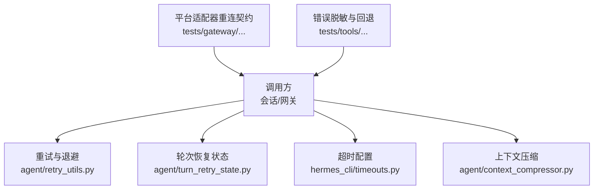
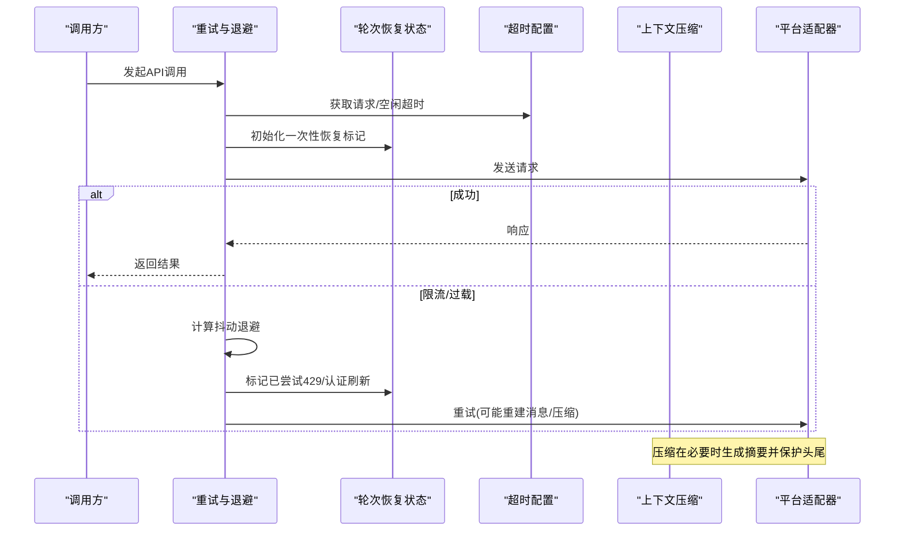
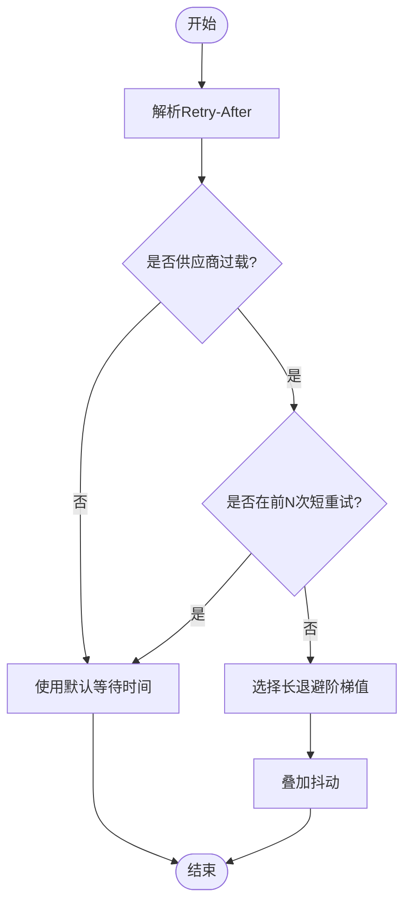
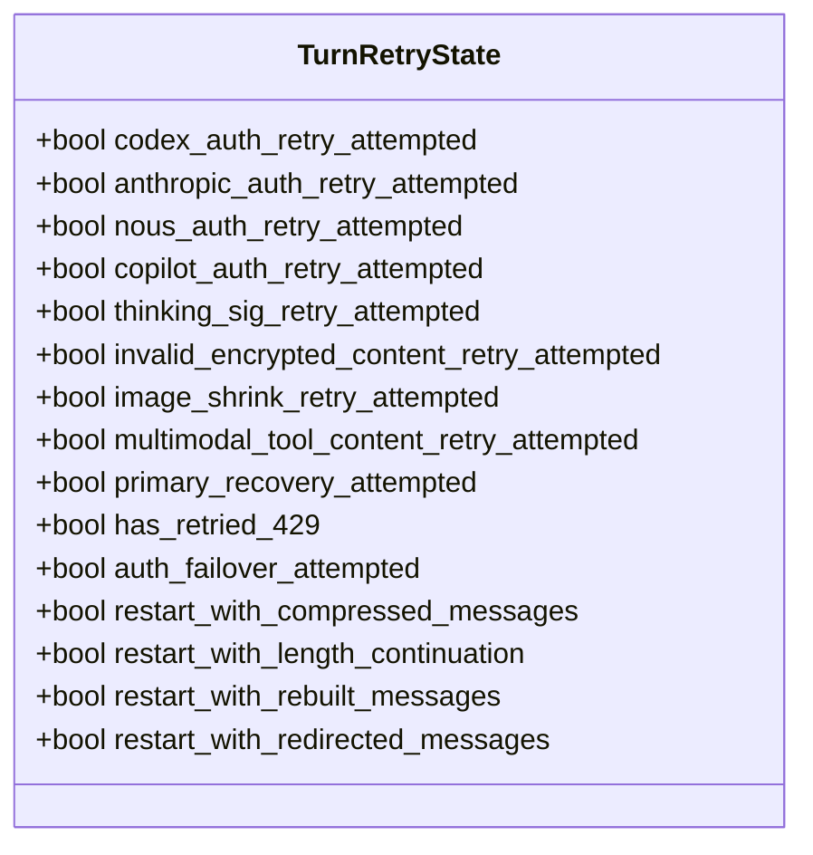
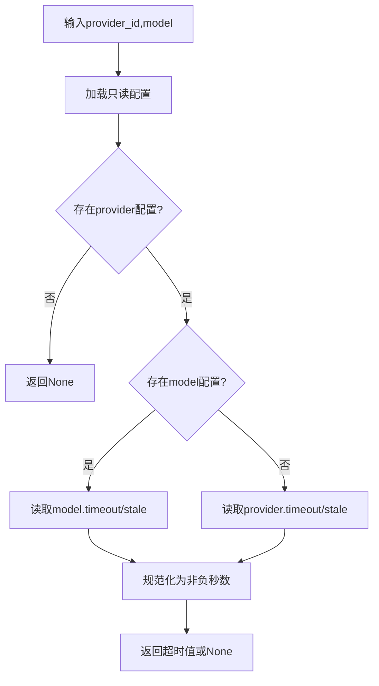
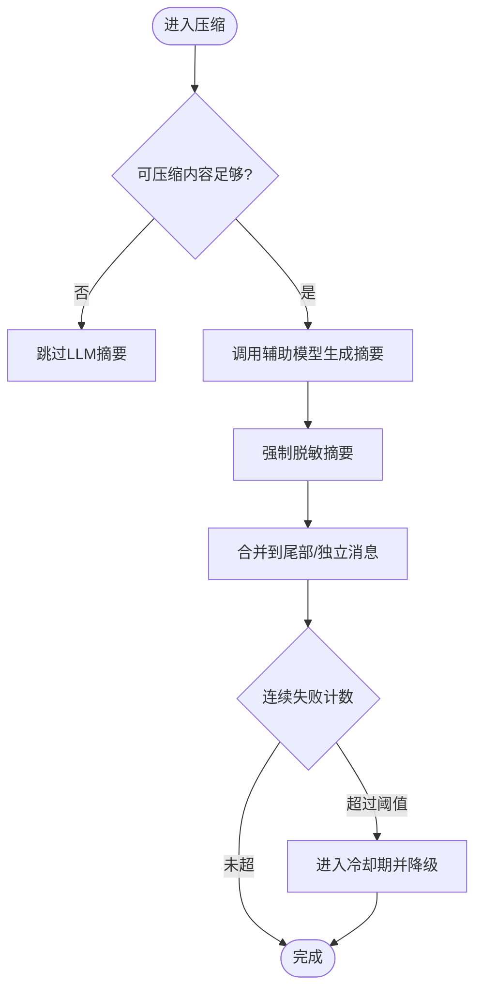
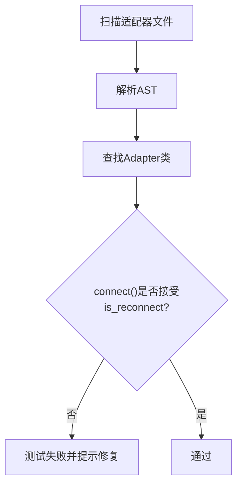
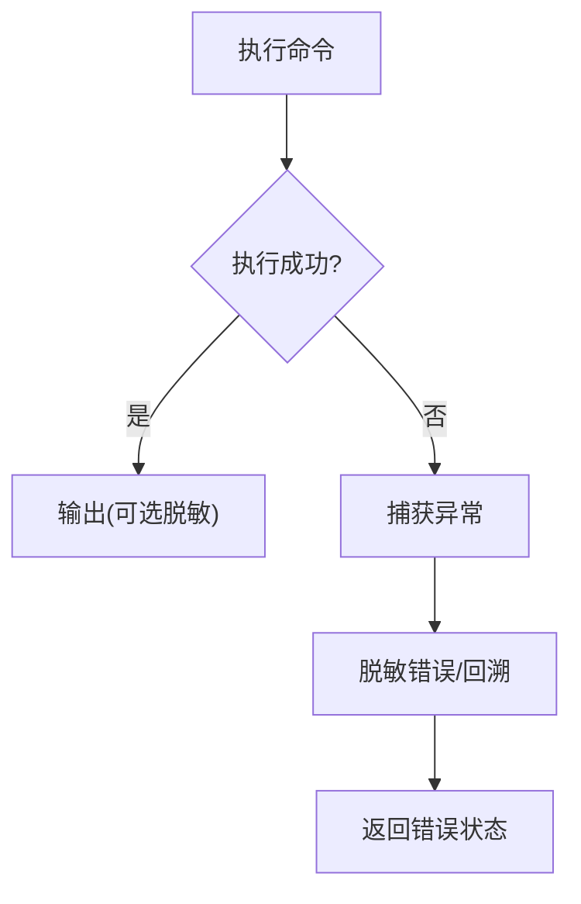
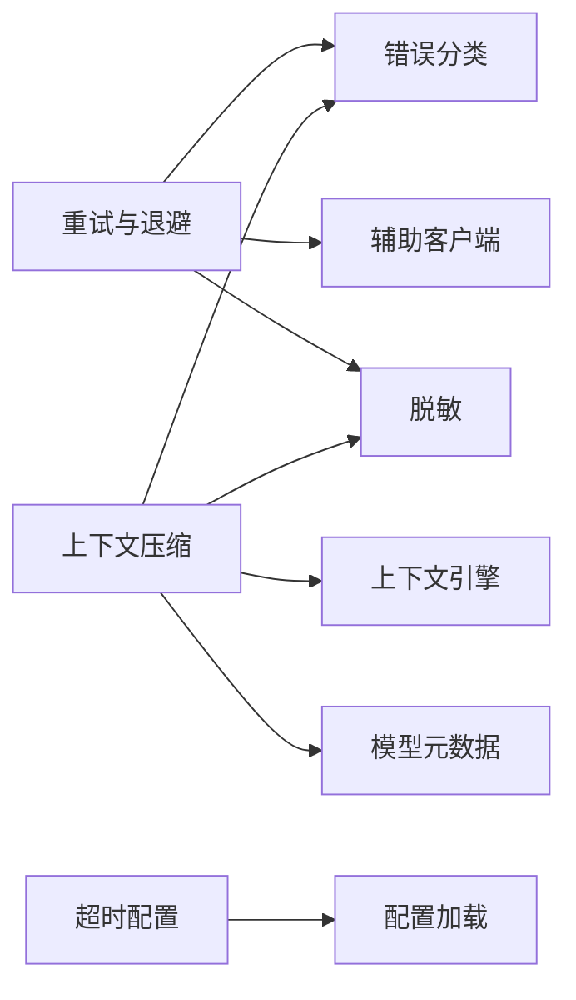

# 系统容错设计

<cite>
**本文引用的文件**
- [agent/retry_utils.py](file://agent/retry_utils.py)
- [agent/turn_retry_state.py](file://agent/turn_retry_state.py)
- [hermes_cli/timeouts.py](file://hermes_cli/timeouts.py)
- [agent/context_compressor.py](file://agent/context_compressor.py)
- [tests/gateway/test_adapter_connect_is_reconnect_contract.py](file://tests/gateway/test_adapter_connect_is_reconnect_contract.py)
- [tests/tools/test_terminal_error_redaction.py](file://tests/tools/test_terminal_error_redaction.py)
</cite>

## 目录
1. [引言](#引言)
2. [项目结构](#项目结构)
3. [核心组件](#核心组件)
4. [架构总览](#架构总览)
5. [详细组件分析](#详细组件分析)
6. [依赖关系分析](#依赖关系分析)
7. [性能考量](#性能考量)
8. [故障排查指南](#故障排查指南)
9. [结论](#结论)
10. [附录](#附录)

## 引言
本文件面向开发者与运维人员，系统化梳理 Hermes Agent 的容错设计：超时处理、资源限制、服务降级、并发控制与锁管理、死锁预防、健康检查与监控告警、自动恢复机制；并总结弹性设计模式（重试、熔断、退避）、压缩系统的健壮性与故障恢复能力。文档以代码为依据，提供可视化流程图与时序图，帮助读者快速定位关键实现与最佳实践。

## 项目结构
围绕容错的关键模块分布在 agent、hermes_cli 与 tests 中：
- 重试与退避：agent/retry_utils.py
- 轮次级恢复状态：agent/turn_retry_state.py
- 超时配置读取：hermes_cli/timeouts.py
- 上下文压缩与降级：agent/context_compressor.py
- 平台适配器重连契约测试：tests/gateway/test_adapter_connect_is_reconnect_contract.py
- 错误输出脱敏与回退：tests/tools/test_terminal_error_redaction.py

**图示来源**
- [agent/retry_utils.py:1-209](file://agent/retry_utils.py#L1-L209)
- [agent/turn_retry_state.py:1-93](file://agent/turn_retry_state.py#L1-L93)
- [hermes_cli/timeouts.py:1-83](file://hermes_cli/timeouts.py#L1-L83)
- [agent/context_compressor.py:1-800](file://agent/context_compressor.py#L1-L800)
- [tests/gateway/test_adapter_connect_is_reconnect_contract.py:1-145](file://tests/gateway/test_adapter_connect_is_reconnect_contract.py#L1-L145)
- [tests/tools/test_terminal_error_redaction.py:1-154](file://tests/tools/test_terminal_error_redaction.py#L1-L154)

**章节来源**
- [agent/retry_utils.py:1-209](file://agent/retry_utils.py#L1-L209)
- [agent/turn_retry_state.py:1-93](file://agent/turn_retry_state.py#L1-L93)
- [hermes_cli/timeouts.py:1-83](file://hermes_cli/timeouts.py#L1-L83)
- [agent/context_compressor.py:1-800](file://agent/context_compressor.py#L1-L800)
- [tests/gateway/test_adapter_connect_is_reconnect_contract.py:1-145](file://tests/gateway/test_adapter_connect_is_reconnect_contract.py#L1-L145)
- [tests/tools/test_terminal_error_redaction.py:1-154](file://tests/tools/test_terminal_error_redaction.py#L1-L154)

## 核心组件
- 抖动退避与自适应限流：基于指数退避+随机抖动，避免“惊群”重试；对特定供应商过载场景采用长退避阶梯。
- 轮次恢复状态：集中记录一次 API 调用内的多种一次性恢复尝试（认证刷新、格式修复、压缩重启等），避免重复尝试与死循环。
- 超时配置：从配置中解析请求超时与空闲超时，统一为秒级浮点数，支持按模型覆盖。
- 上下文压缩：在长对话中自动压缩中间历史，保护头尾与活跃任务；具备失败冷却、降级摘要、敏感信息强制脱敏等机制。
- 平台适配器重连契约：通过静态 AST 校验所有平台适配器的 connect() 必须接受 is_reconnect 参数，确保网关重连路径稳定。
- 错误脱敏与回退：工具执行异常时进行敏感信息脱敏，并在后台启动失败时给出可观测的错误状态。

**章节来源**
- [agent/retry_utils.py:1-209](file://agent/retry_utils.py#L1-L209)
- [agent/turn_retry_state.py:1-93](file://agent/turn_retry_state.py#L1-L93)
- [hermes_cli/timeouts.py:1-83](file://hermes_cli/timeouts.py#L1-L83)
- [agent/context_compressor.py:1-800](file://agent/context_compressor.py#L1-L800)
- [tests/gateway/test_adapter_connect_is_reconnect_contract.py:1-145](file://tests/gateway/test_adapter_connect_is_reconnect_contract.py#L1-L145)
- [tests/tools/test_terminal_error_redaction.py:1-154](file://tests/tools/test_terminal_error_redaction.py#L1-L154)

## 架构总览
下图展示一次典型调用中的容错协作：调用方触发重试策略，结合轮次恢复状态决定是否需要重建请求或切换提供商；超时配置保障边界；压缩子系统在上下文压力时介入并降级；平台适配器遵循重连契约保证连接恢复。

**图示来源**
- [agent/retry_utils.py:90-128](file://agent/retry_utils.py#L90-L128)
- [agent/retry_utils.py:162-209](file://agent/retry_utils.py#L162-L209)
- [agent/turn_retry_state.py:32-88](file://agent/turn_retry_state.py#L32-L88)
- [hermes_cli/timeouts.py:14-83](file://hermes_cli/timeouts.py#L14-L83)
- [agent/context_compressor.py:764-782](file://agent/context_compressor.py#L764-L782)

## 详细组件分析

### 重试与自适应退避（agent/retry_utils.py）
- 抖动指数退避：为每次重试计算 base*2^(attempt-1) 的上界延迟，叠加均匀抖动，防止多会话同时重试造成拥塞。
- 供应商感知退避：针对特定供应商过载（如 Z.AI Coding Plan GLM-5.2 的 429 1305），前若干次短退避后进入长退避阶梯（30/60/90/120s），并带小抖动。
- Retry-After 解析：兼容数值与 HTTP-date 两种形式，并做非负约束。
- 重试上限：提供专用函数计算达到完整长退避所需的最大重试次数，避免提前放弃导致长退避策略失效。

**图示来源**
- [agent/retry_utils.py:38-88](file://agent/retry_utils.py#L38-L88)
- [agent/retry_utils.py:90-128](file://agent/retry_utils.py#L90-L128)
- [agent/retry_utils.py:142-209](file://agent/retry_utils.py#L142-L209)

**章节来源**
- [agent/retry_utils.py:1-209](file://agent/retry_utils.py#L1-L209)

### 轮次恢复状态（agent/turn_retry_state.py）
- 一次性恢复守卫：每个分支（如 OAuth 刷新、格式修复、压缩重启）仅触发一次，避免同一轮内重复尝试。
- 重启信号：指示外层循环是否需要重建消息、启用长度续写、回滚部分流内容等。
- 解耦与可测性：纯数据类，无外部依赖，便于单元测试与调试。

**图示来源**
- [agent/turn_retry_state.py:32-88](file://agent/turn_retry_state.py#L32-L88)

**章节来源**
- [agent/turn_retry_state.py:1-93](file://agent/turn_retry_state.py#L1-L93)

### 超时配置（hermes_cli/timeouts.py）
- 统一解析：将配置项转换为秒级浮点，非法值返回 None。
- 层级覆盖：支持 provider 级别与 model 级别的 timeout_seconds/stale_timeout_seconds。
- 安全加载：配置加载失败时优雅降级，不中断调用。

**图示来源**
- [hermes_cli/timeouts.py:4-83](file://hermes_cli/timeouts.py#L4-L83)

**章节来源**
- [hermes_cli/timeouts.py:1-83](file://hermes_cli/timeouts.py#L1-L83)

### 上下文压缩与降级（agent/context_compressor.py）
- 保护头尾与活跃任务：压缩中间历史，保留最近消息与用户最新意图，避免丢失关键上下文。
- 失败冷却与降级：连续失败跳过压缩，使用确定性降级摘要，限制降级大小，避免放大问题。
- 敏感信息强制脱敏：跨会话持久化的摘要强制脱敏，包括 URL 凭据，防止密钥泄露到后续提示。
- 可行性预判：当可压缩内容过少时跳过 LLM 摘要调用，减少无效开销。

**图示来源**
- [agent/context_compressor.py:426-443](file://agent/context_compressor.py#L426-L443)
- [agent/context_compressor.py:764-782](file://agent/context_compressor.py#L764-L782)

**章节来源**
- [agent/context_compressor.py:1-800](file://agent/context_compressor.py#L1-L800)

### 平台适配器重连契约（tests/gateway/test_adapter_connect_is_reconnect_contract.py）
- 静态 AST 校验：扫描 gateway/platforms 与 plugins/platforms 下的适配器文件，确保 connect() 接受 is_reconnect 关键字参数。
- 回归防护：避免网关重连路径因签名不匹配而静默断开，提升整体可用性。

**图示来源**
- [tests/gateway/test_adapter_connect_is_reconnect_contract.py:44-103](file://tests/gateway/test_adapter_connect_is_reconnect_contract.py#L44-L103)
- [tests/gateway/test_adapter_connect_is_reconnect_contract.py:109-145](file://tests/gateway/test_adapter_connect_is_reconnect_contract.py#L109-L145)

**章节来源**
- [tests/gateway/test_adapter_connect_is_reconnect_contract.py:1-145](file://tests/gateway/test_adapter_connect_is_reconnect_contract.py#L1-L145)

### 错误脱敏与回退（tests/tools/test_terminal_error_redaction.py）
- 错误输出脱敏：终端工具执行失败时，错误与回溯均进行敏感信息脱敏，防止凭证泄露。
- 成功路径保留：成功输出可按配置关闭脱敏，保持命令感知的脱敏策略。
- 后台启动失败：进程注册表启动失败时，返回禁用状态与脱敏错误，便于上层回退与告警。

**图示来源**
- [tests/tools/test_terminal_error_redaction.py:47-154](file://tests/tools/test_terminal_error_redaction.py#L47-L154)

**章节来源**
- [tests/tools/test_terminal_error_redaction.py:1-154](file://tests/tools/test_terminal_error_redaction.py#L1-L154)

## 依赖关系分析
- 重试模块依赖：错误分类、模型元数据、辅助客户端、脱敏模块。
- 压缩模块依赖：上下文引擎、错误分类、模型元数据、脱敏模块。
- 超时模块依赖：配置加载器（只读）。
- 测试驱动契约：通过静态分析确保适配器重连一致性。

**图示来源**
- [agent/retry_utils.py:1-209](file://agent/retry_utils.py#L1-L209)
- [agent/context_compressor.py:1-800](file://agent/context_compressor.py#L1-L800)
- [hermes_cli/timeouts.py:1-83](file://hermes_cli/timeouts.py#L1-L83)

**章节来源**
- [agent/retry_utils.py:1-209](file://agent/retry_utils.py#L1-L209)
- [agent/context_compressor.py:1-800](file://agent/context_compressor.py#L1-L800)
- [hermes_cli/timeouts.py:1-83](file://hermes_cli/timeouts.py#L1-L83)

## 性能考量
- 抖动退避降低并发风暴风险，提高整体吞吐稳定性。
- 供应商感知长退避避免对过载端点的持续冲击，缩短恢复时间。
- 压缩可行性预判减少不必要的 LLM 调用，降低延迟与成本。
- 摘要大小上限与失败冷却防止压缩过程成为新的瓶颈。
- 超时配置分层覆盖，避免全局过长阻塞影响交互体验。

[本节为通用指导，无需具体文件引用]

## 故障排查指南
- 平台适配器无法重连：检查 connect() 是否包含 is_reconnect 参数；运行静态契约测试定位违规适配器。
- 频繁 429/过载：确认是否命中供应商过载识别逻辑；调整重试上限与长退避阶梯；观察日志中的 reason_label。
- 压缩失败或卡住：关注连续失败计数与冷却期；检查摘要输入大小与可压缩内容比例；查看降级摘要是否生效。
- 超时导致的挂起：核对 provider/model 的 timeout_seconds/stale_timeout_seconds 配置；验证解析结果是否为非空正数。
- 错误泄露敏感信息：确认错误输出路径是否经过脱敏；在测试中验证脱敏断言。

**章节来源**
- [tests/gateway/test_adapter_connect_is_reconnect_contract.py:109-145](file://tests/gateway/test_adapter_connect_is_reconnect_contract.py#L109-L145)
- [agent/retry_utils.py:142-209](file://agent/retry_utils.py#L142-L209)
- [agent/context_compressor.py:426-443](file://agent/context_compressor.py#L426-L443)
- [hermes_cli/timeouts.py:14-83](file://hermes_cli/timeouts.py#L14-L83)
- [tests/tools/test_terminal_error_redaction.py:47-154](file://tests/tools/test_terminal_error_redaction.py#L47-L154)

## 结论
Hermes Agent 通过抖动退避、供应商感知重试、轮次级恢复状态、分层超时、上下文压缩与降级、平台适配器重连契约以及错误脱敏等多层机制，构建了高可用的容错体系。这些设计在保证用户体验的同时，有效降低了外部依赖波动带来的风险，并为监控告警与自动恢复提供了坚实基础。

[本节为总结，无需具体文件引用]

## 附录
- 弹性设计模式建议：
  - 重试：指数退避+抖动；区分瞬态/永久错误；设置合理上限。
  - 熔断：在连续失败或超时率过高时快速失败，配合半开探测恢复。
  - 降级：在压缩或摘要失败时回退到确定性摘要，限制大小与频率。
- 并发与锁：
  - 使用细粒度锁保护共享计数器/状态，避免竞态。
  - 明确锁顺序，避免环形等待；优先使用不可变数据结构传递状态。
- 健康检查与监控：
  - 暴露健康端点与指标（重试次数、超时、压缩失败率、适配器连接状态）。
  - 基于事件发射器与导出器上报 OTLP 指标，便于集中观测。
- 容错测试：
  - 使用契约测试确保接口变更不会破坏重连路径。
  - 注入超时、限流、网络错误，验证重试与降级行为。
  - 压力测试关注抖动退避效果与压缩可行性预判。

[本节为通用指导，无需具体文件引用]