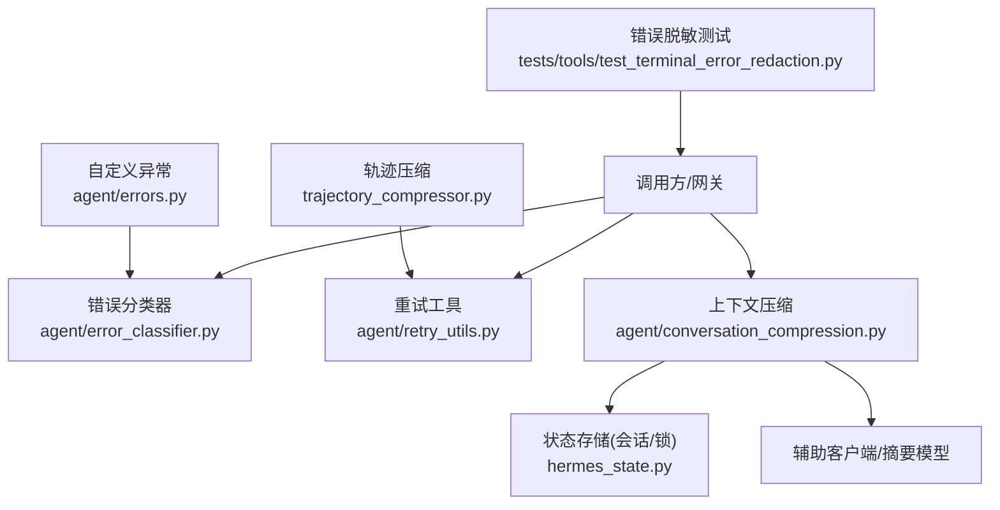
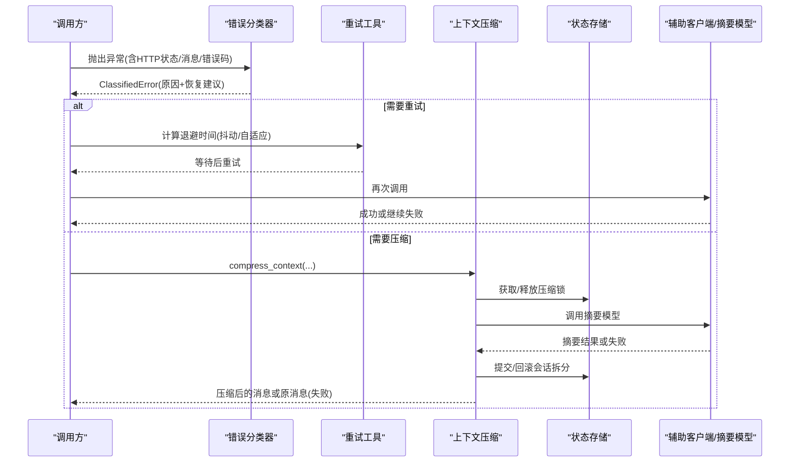
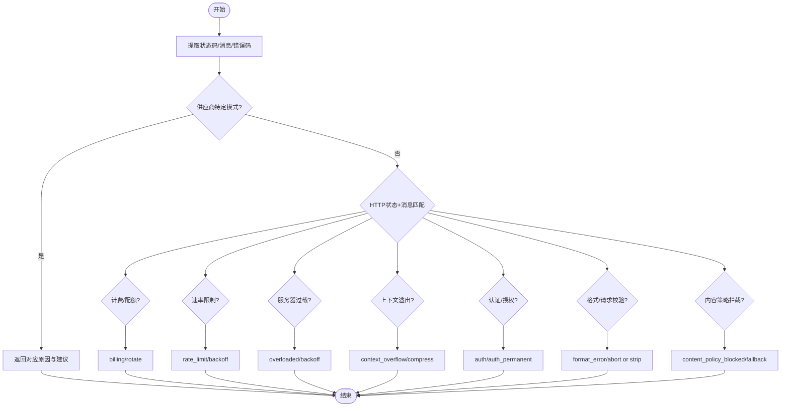
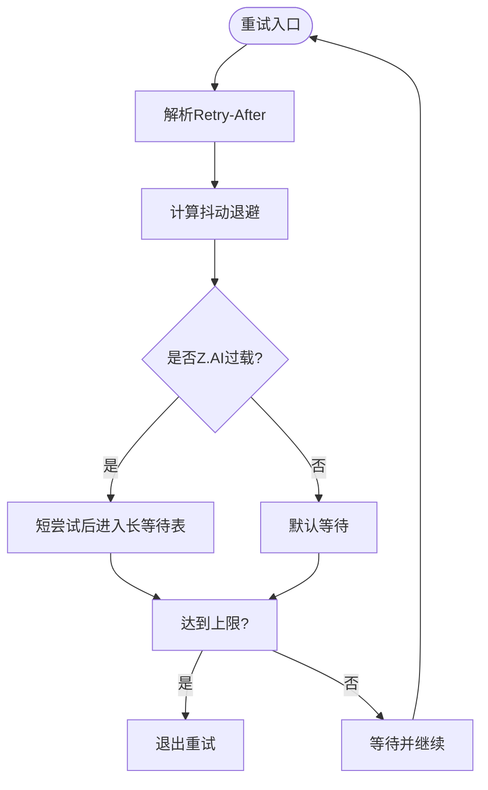
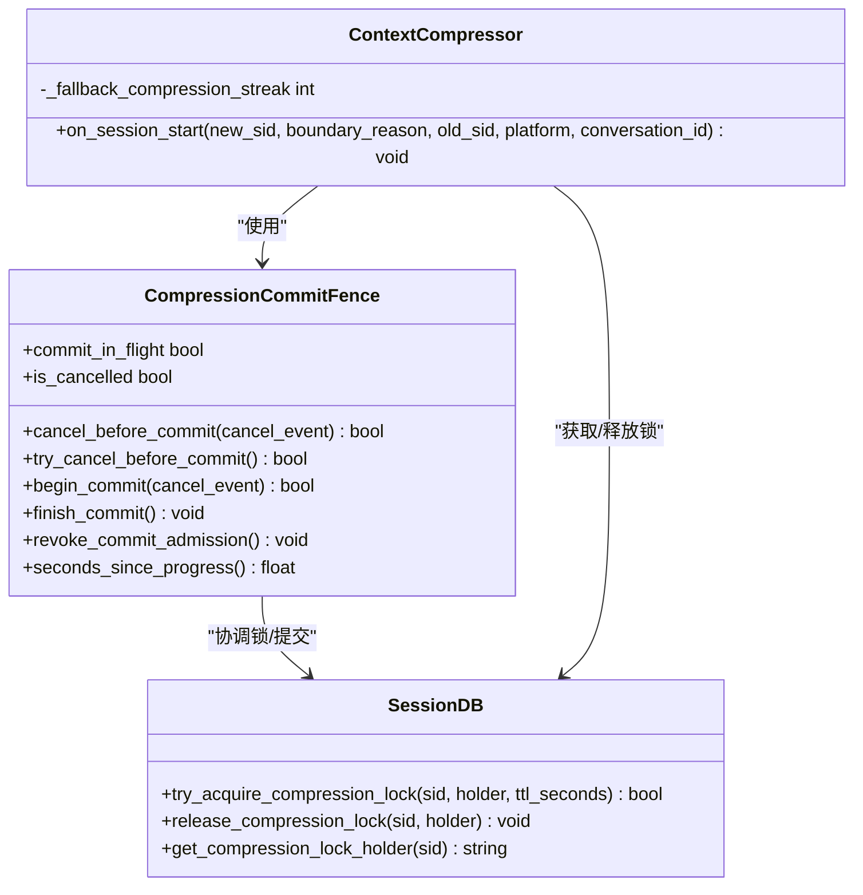
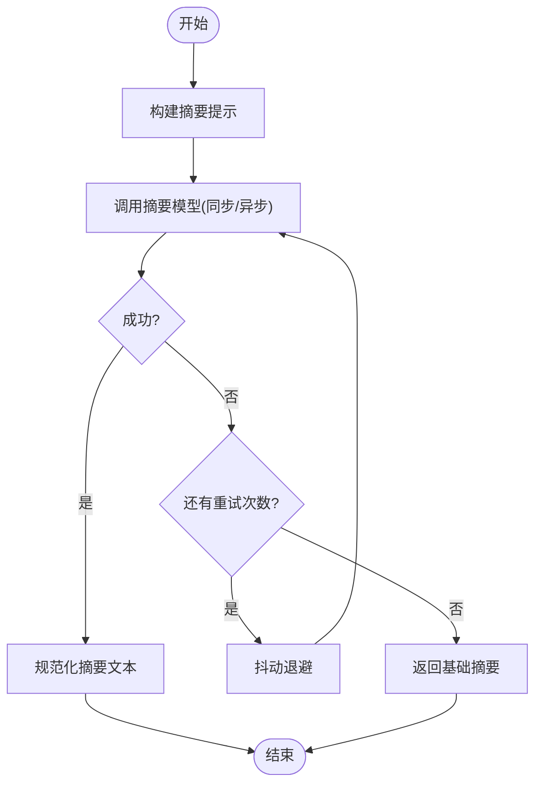
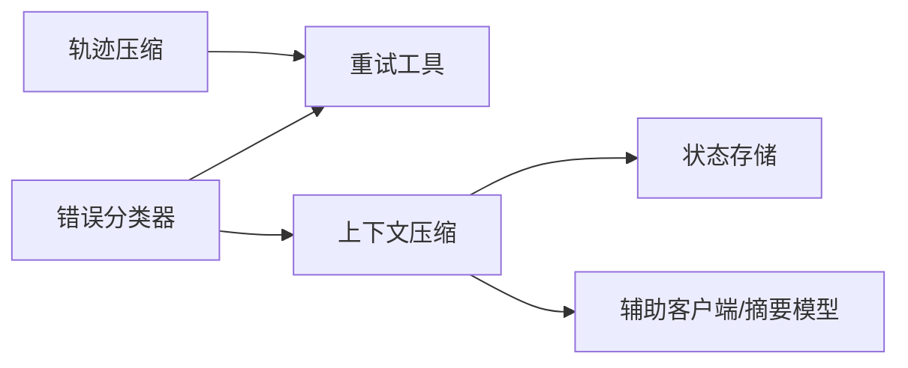

# 错误处理机制

<cite>
**本文引用的文件**
- [agent/error_classifier.py](file://agent/error_classifier.py)
- [agent/retry_utils.py](file://agent/retry_utils.py)
- [agent/conversation_compression.py](file://agent/conversation_compression.py)
- [hermes_state.py](file://hermes_state.py)
- [trajectory_compressor.py](file://trajectory_compressor.py)
- [agent/errors.py](file://agent/errors.py)
- [tests/tools/test_terminal_error_redaction.py](file://tests/tools/test_terminal_error_redaction.py)
</cite>

## 目录
1. [简介](#简介)
2. [项目结构](#项目结构)
3. [核心组件](#核心组件)
4. [架构总览](#架构总览)
5. [详细组件分析](#详细组件分析)
6. [依赖关系分析](#依赖关系分析)
7. [性能考量](#性能考量)
8. [故障排查指南](#故障排查指南)
9. [结论](#结论)
10. [附录](#附录)

## 简介
本文件系统化梳理 Hermes Agent 在压缩与调用链路中的错误处理机制，覆盖错误分类、异常捕获、错误恢复策略（重试、降级、故障转移）、错误状态管理、日志记录与监控、错误边界定义与隔离、以及面向开发者的扩展指导。重点围绕以下方面：
- 将 API/传输/模型/资源限制等错误统一分类为可执行的恢复动作
- 通过带抖动的退避与自适应策略进行重试
- 在上下文压缩失败或受限时的降级路径
- 会话级锁与提交围栏保证压缩过程的可恢复性与一致性
- 错误信息脱敏与可观测性（日志、指标）

## 项目结构
围绕错误处理的代码主要分布在如下模块：
- 错误分类器：集中化的 API/传输/模型错误分类与恢复建议
- 重试工具：抖动退避、特定供应商的自适应退避
- 上下文压缩：压缩流程、超时/取消围栏、会话拆分与锁
- 轨迹压缩：离线轨迹压缩的错误与重试
- 状态存储：会话持久化、压缩锁、回滚与恢复
- 自定义异常：SSL、空流等运行时异常类型
- 测试用例：终端工具错误输出脱敏验证

**图表来源**
- [agent/error_classifier.py:1-120](file://agent/error_classifier.py#L1-L120)
- [agent/retry_utils.py:1-120](file://agent/retry_utils.py#L1-L120)
- [agent/conversation_compression.py:2150-2400](file://agent/conversation_compression.py#L2150-L2400)
- [hermes_state.py:160-200](file://hermes_state.py#L160-L200)
- [trajectory_compressor.py:605-742](file://trajectory_compressor.py#L605-L742)
- [agent/errors.py:1-14](file://agent/errors.py#L1-L14)
- [tests/tools/test_terminal_error_redaction.py:1-154](file://tests/tools/test_terminal_error_redaction.py#L1-L154)

**章节来源**
- [agent/error_classifier.py:1-120](file://agent/error_classifier.py#L1-L120)
- [agent/retry_utils.py:1-120](file://agent/retry_utils.py#L1-L120)
- [agent/conversation_compression.py:2150-2400](file://agent/conversation_compression.py#L2150-L2400)
- [hermes_state.py:160-200](file://hermes_state.py#L160-L200)
- [trajectory_compressor.py:605-742](file://trajectory_compressor.py#L605-L742)
- [agent/errors.py:1-14](file://agent/errors.py#L1-L14)
- [tests/tools/test_terminal_error_redaction.py:1-154](file://tests/tools/test_terminal_error_redaction.py#L1-L154)

## 核心组件
- 错误分类器：提供 FailoverReason 枚举与 ClassifiedError 数据结构，按优先级对错误进行分类并给出是否可重试、是否需要压缩、是否应轮换凭据、是否应降级到备用模型/供应商等建议。
- 重试工具：实现 jittered_backoff 与针对特定供应商（如 Z.AI Coding Plan）的自适应退避策略，避免“惊群”重试风暴。
- 上下文压缩：封装压缩生命周期、超时/取消围栏、会话拆分、压缩锁与回滚；在压缩失败时提供降级路径（不旋转会话、返回原消息）。
- 轨迹压缩：离线压缩流程中调用摘要模型的错误捕获与重试，最终提供兜底摘要文本。
- 状态存储：提供压缩锁、会话拆分链、锁持有者存活检测与回滚能力，确保并发安全与崩溃恢复。
- 自定义异常：定义 SSL 配置错误、空流错误等专用异常类型，便于上层区分处理。
- 错误脱敏：测试覆盖终端工具错误输出中的敏感信息脱敏，确保错误日志与结果不包含密钥等敏感内容。

**章节来源**
- [agent/error_classifier.py:22-120](file://agent/error_classifier.py#L22-L120)
- [agent/retry_utils.py:38-129](file://agent/retry_utils.py#L38-L129)
- [agent/conversation_compression.py:445-730](file://agent/conversation_compression.py#L445-L730)
- [trajectory_compressor.py:605-742](file://trajectory_compressor.py#L605-L742)
- [hermes_state.py:160-200](file://hermes_state.py#L160-L200)
- [agent/errors.py:1-14](file://agent/errors.py#L1-L14)
- [tests/tools/test_terminal_error_redaction.py:47-154](file://tests/tools/test_terminal_error_redaction.py#L47-L154)

## 架构总览
下图展示一次典型 API 调用失败后的错误处理流程：从分类、重试、到可能的上下文压缩与降级。

**图表来源**
- [agent/error_classifier.py:624-800](file://agent/error_classifier.py#L624-L800)
- [agent/retry_utils.py:90-191](file://agent/retry_utils.py#L90-L191)
- [agent/conversation_compression.py:2150-2400](file://agent/conversation_compression.py#L2150-L2400)
- [hermes_state.py:2345-2500](file://hermes_state.py#L2345-L2500)

## 详细组件分析

### 错误分类器（API/传输/模型错误分类）
- 分类目标：将网络错误、认证/授权错误、计费/配额错误、服务器过载、上下文溢出、负载过大、图片过大、模型不存在、内容策略拦截、格式错误等统一归类。
- 恢复建议：是否可重试、是否应压缩上下文、是否应轮换凭据、是否应切换到备用模型/供应商。
- 优先级：先匹配供应商特定模式（如思考块签名、长上下文层级门限），再按 HTTP 状态码与消息体细化，最后回退到未知错误（带退避重试）。
- 关键数据：FailoverReason 枚举、ClassifiedError 数据类，包含 reason、status_code、provider、model、message、error_context 及恢复标志位。

**图表来源**
- [agent/error_classifier.py:22-120](file://agent/error_classifier.py#L22-L120)
- [agent/error_classifier.py:624-800](file://agent/error_classifier.py#L624-L800)

**章节来源**
- [agent/error_classifier.py:22-120](file://agent/error_classifier.py#L22-L120)
- [agent/error_classifier.py:624-800](file://agent/error_classifier.py#L624-L800)

### 重试工具（抖动退避与自适应策略）
- 抖动退避：基于指数增长与随机抖动，避免多会话同时重试导致的“惊群”。
- 解析 Retry-After：支持数值与 HTTP-date 两种格式，确保遵循服务端指示。
- 自适应退避：针对特定供应商（如 Z.AI Coding Plan GLM-5.2）的过载 429，前若干次短重试，随后进入渐进式长等待表，降低重复冲击。
- 重试上限：提供 ceiling 计算以适配不同 short_attempts 配置，确保所有长等待档位可达。

**图表来源**
- [agent/retry_utils.py:38-129](file://agent/retry_utils.py#L38-L129)
- [agent/retry_utils.py:142-209](file://agent/retry_utils.py#L142-L209)

**章节来源**
- [agent/retry_utils.py:38-129](file://agent/retry_utils.py#L38-L129)
- [agent/retry_utils.py:142-209](file://agent/retry_utils.py#L142-L209)

### 上下文压缩（错误边界、状态管理与恢复）
- 压缩入口：compress_context 负责启动压缩、状态快照、锁获取、摘要调用、提交/回滚。
- 超时与取消：CompressionCommitFence 提供提交边界控制，防止超时后仍写入会话；支持撤销未来提交许可。
- 压缩锁：基于会话 ID 的分布式锁，避免并发压缩导致会话分裂混乱；支持 TTL 与持有者存活检测。
- 回滚与恢复：在提交前失败时恢复压缩器尝试状态，必要时释放锁并返回原消息，避免损坏会话。
- 降级路径：当摘要模型不可用或失败时，保持原消息与系统提示，停止自动压缩循环，由上层决定后续行为。

**图表来源**
- [agent/conversation_compression.py:445-730](file://agent/conversation_compression.py#L445-L730)
- [hermes_state.py:2345-2500](file://hermes_state.py#L2345-L2500)

**章节来源**
- [agent/conversation_compression.py:2150-2400](file://agent/conversation_compression.py#L2150-L2400)
- [agent/conversation_compression.py:445-730](file://agent/conversation_compression.py#L445-L730)
- [hermes_state.py:2345-2500](file://hermes_state.py#L2345-L2500)

### 轨迹压缩（离线压缩的错误与重试）
- 摘要调用：同步与异步版本均包含重试逻辑，失败时记录指标并延迟重试。
- 兜底摘要：多次重试失败后返回基础摘要文本，保证压缩流程不中断。
- 温度策略：根据模型选择有效温度参数，兼容不同供应商的温度管理方式。

**图表来源**
- [trajectory_compressor.py:605-742](file://trajectory_compressor.py#L605-L742)

**章节来源**
- [trajectory_compressor.py:605-742](file://trajectory_compressor.py#L605-L742)

### 自定义异常与错误脱敏
- 自定义异常：SSL 配置错误、空流错误、预设未找到等，便于上层精确识别与处理。
- 错误脱敏：终端工具的错误输出与回溯信息会进行敏感信息脱敏，确保日志与结果不包含密钥等敏感内容。

**章节来源**
- [agent/errors.py:1-14](file://agent/errors.py#L1-L14)
- [tests/tools/test_terminal_error_redaction.py:47-154](file://tests/tools/test_terminal_error_redaction.py#L47-L154)

## 依赖关系分析
- 错误分类器依赖 HTTP 状态码、消息体与错误码，结合供应商特定模式进行精准分类。
- 重试工具被分类器与调用方共同使用，提供统一的退避策略。
- 上下文压缩依赖状态存储的锁与会话拆分能力，并在失败时回滚状态。
- 轨迹压缩独立于在线压缩，但同样使用重试工具进行稳健调用。

**图表来源**
- [agent/error_classifier.py:624-800](file://agent/error_classifier.py#L624-L800)
- [agent/retry_utils.py:90-191](file://agent/retry_utils.py#L90-L191)
- [agent/conversation_compression.py:2150-2400](file://agent/conversation_compression.py#L2150-L2400)
- [trajectory_compressor.py:605-742](file://trajectory_compressor.py#L605-L742)

**章节来源**
- [agent/error_classifier.py:624-800](file://agent/error_classifier.py#L624-L800)
- [agent/retry_utils.py:90-191](file://agent/retry_utils.py#L90-L191)
- [agent/conversation_compression.py:2150-2400](file://agent/conversation_compression.py#L2150-L2400)
- [trajectory_compressor.py:605-742](file://trajectory_compressor.py#L605-L742)

## 性能考量
- 抖动退避减少并发重试风暴，提升整体稳定性。
- 自适应退避针对特定供应商过载场景优化等待策略，避免无效重试。
- 压缩池大小有限制，防止过多压缩任务阻塞；提交围栏避免长时间占用资源。
- 压缩失败时快速回退，避免影响主对话流程。

[本节为通用性能讨论，无需具体文件引用]

## 故障排查指南
- 常见问题定位：
  - 认证/授权失败：检查分类结果是否为 auth/auth_permanent，确认凭据轮换策略。
  - 速率限制/配额耗尽：查看 rate_limit/billing 分类，调整重试间隔或切换供应商。
  - 上下文溢出：根据 context_overflow 分类执行压缩，若压缩失败则检查压缩锁与摘要模型可用性。
  - SSL/TLS 错误：ssl_cert_verification 表示证书问题，需修复信任链或代理配置。
- 调试方法：
  - 启用详细日志，关注压缩状态与锁获取/释放情况。
  - 检查 Retry-After 头解析是否正确，避免过早重试。
  - 验证供应商特定模式（如 Z.AI 过载）是否命中自适应退避。
- 解决方案：
  - 对于内容策略拦截，切换到备用模型或调整输入。
  - 对于格式错误，修正请求结构或剥离不支持的内容。
  - 对于压缩失败，手动触发 /compress 或等待冷却期后重试。

**章节来源**
- [agent/error_classifier.py:22-120](file://agent/error_classifier.py#L22-L120)
- [agent/retry_utils.py:38-129](file://agent/retry_utils.py#L38-L129)
- [agent/conversation_compression.py:2150-2400](file://agent/conversation_compression.py#L2150-L2400)

## 结论
Hermes Agent 的错误处理机制通过集中分类、智能重试、上下文压缩与状态管理，实现了高鲁棒性的压缩与调用流程。开发者可基于现有接口扩展错误分类、重试策略与压缩逻辑，同时利用日志与测试保障错误处理的正确性与安全性。

[本节为总结，无需具体文件引用]

## 附录
- 错误分类参考：FailoverReason 枚举涵盖认证、计费、速率限制、服务器过载、上下文溢出、负载过大、图片过大、模型不存在、内容策略拦截、格式错误等。
- 重试策略参考：jittered_backoff 与 adaptive_rate_limit_backoff 提供通用与供应商特定的退避方案。
- 压缩边界参考：CompressionCommitFence 确保提交边界的原子性与可取消性。
- 脱敏实践：终端工具错误输出与回溯信息均进行敏感信息脱敏。

**章节来源**
- [agent/error_classifier.py:22-120](file://agent/error_classifier.py#L22-L120)
- [agent/retry_utils.py:90-191](file://agent/retry_utils.py#L90-L191)
- [agent/conversation_compression.py:445-730](file://agent/conversation_compression.py#L445-L730)
- [tests/tools/test_terminal_error_redaction.py:47-154](file://tests/tools/test_terminal_error_redaction.py#L47-L154)