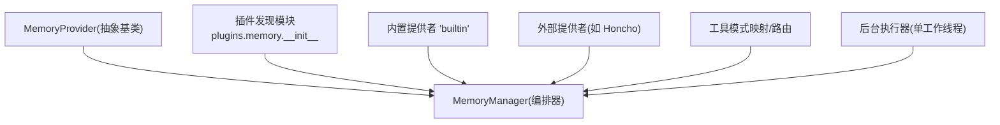
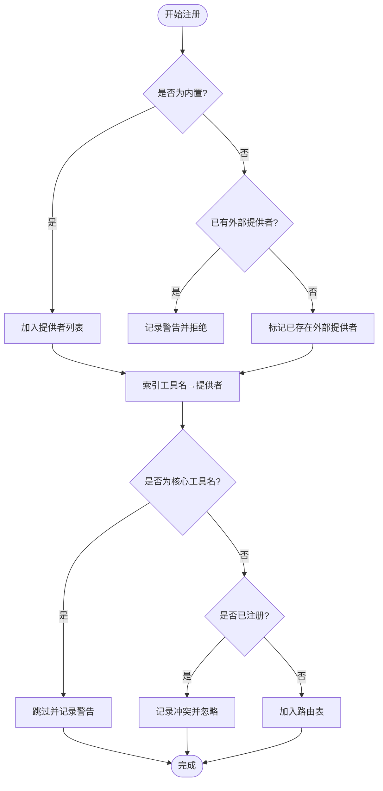
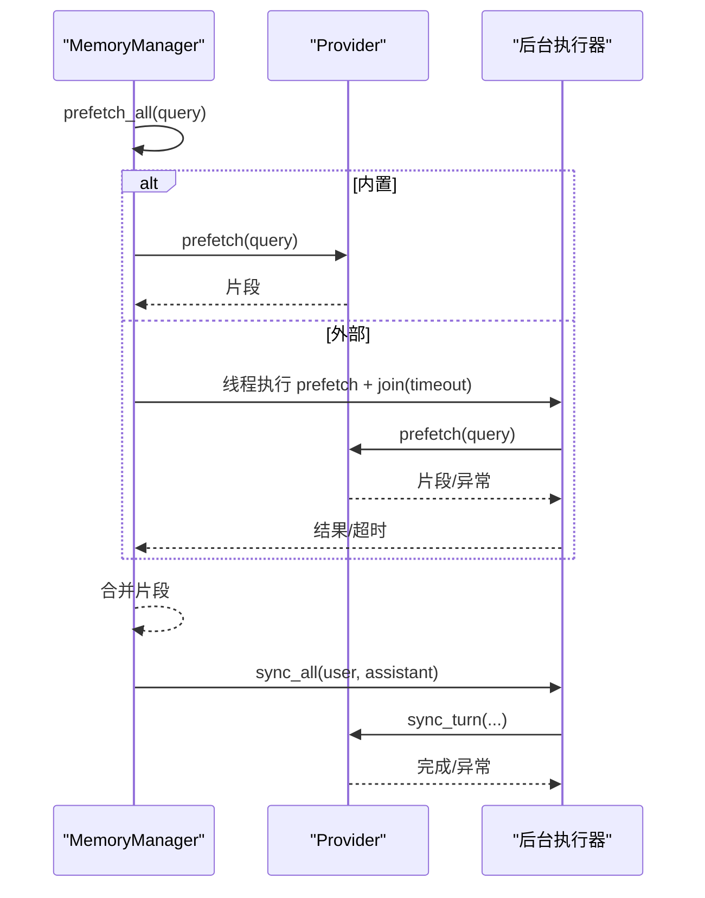
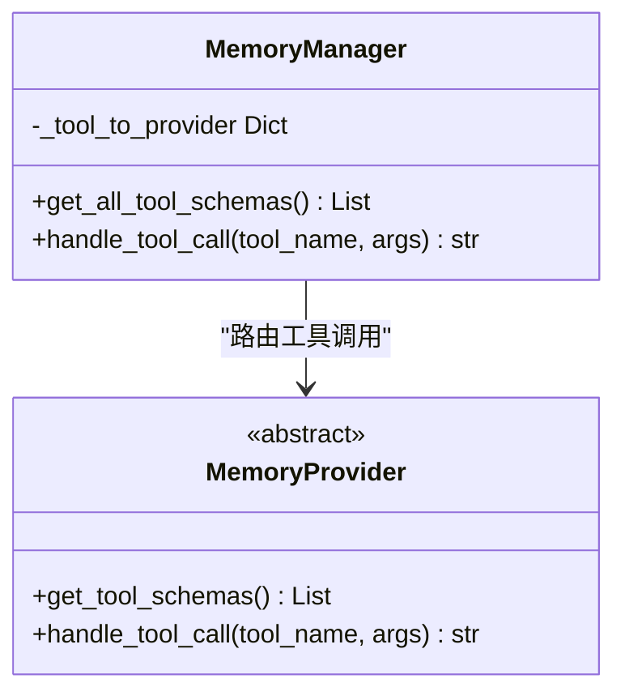
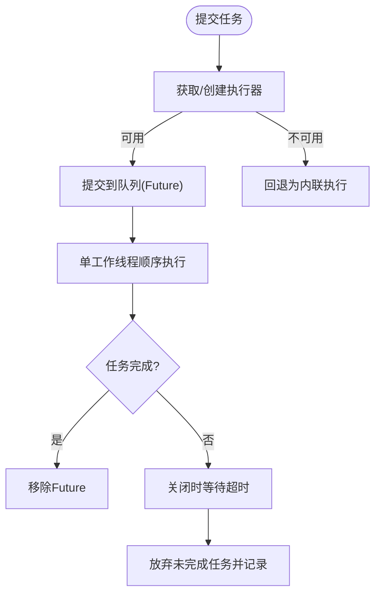
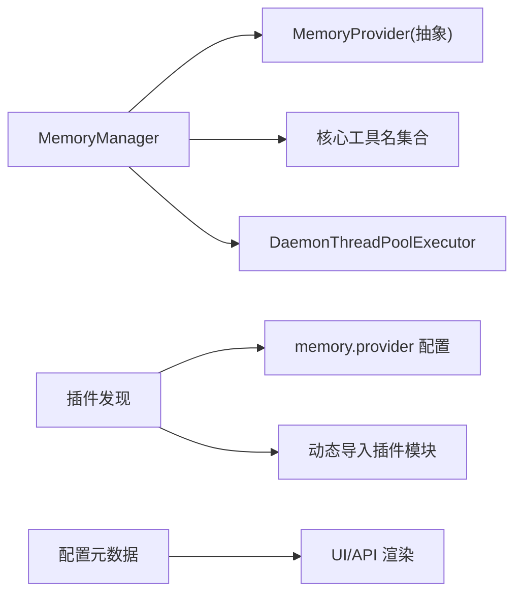

# 存储后端管理

<cite>
**本文引用的文件**
- [agent/memory_manager.py](file://agent/memory_manager.py)
- [agent/memory_provider.py](file://agent/memory_provider.py)
- [plugins/memory/__init__.py](file://plugins/memory/__init__.py)
- [plugins/memory/config_schema.py](file://plugins/memory/config_schema.py)
- [plugins/memory/honcho/__init__.py](file://plugins/memory/honcho/__init__.py)
</cite>

## 目录
1. [简介](#简介)
2. [项目结构](#项目结构)
3. [核心组件](#核心组件)
4. [架构总览](#架构总览)
5. [详细组件分析](#详细组件分析)
6. [依赖关系分析](#依赖关系分析)
7. [性能考量](#性能考量)
8. [故障排查指南](#故障排查指南)
9. [结论](#结论)
10. [附录：扩展自定义存储后端与最佳实践](#附录：扩展自定义存储后端与最佳实践)

## 简介
本文件系统性说明存储后端管理机制，重点解释 MemoryManager 如何协调多个记忆提供者的注册、工具模式映射、冲突检测与优先级处理；阐述内置提供者（builtin）与外部插件提供者的区别，以及为何系统只允许同时存在一个外部提供者。文档还覆盖提供者的生命周期管理、错误隔离机制、故障恢复策略，以及后台执行器的设计（线程池管理、任务队列、超时控制）。最后给出扩展自定义存储后端的步骤、常见配置问题诊断与解决方案，以及性能调优建议与最佳实践。

## 项目结构
围绕“存储后端管理”的关键代码分布在以下位置：
- 抽象接口与通用逻辑：agent/memory_provider.py
- 管理器与编排：agent/memory_manager.py
- 插件发现与加载：plugins/memory/__init__.py
- 声明式配置元数据：plugins/memory/config_schema.py
- 典型外部提供者实现示例：plugins/memory/honcho/__init__.py



图表来源
- [agent/memory_manager.py:364-470](file://agent/memory_manager.py#L364-L470)
- [agent/memory_provider.py:81-192](file://agent/memory_provider.py#L81-L192)
- [plugins/memory/__init__.py:157-216](file://plugins/memory/__init__.py#L157-L216)

章节来源
- [agent/memory_manager.py:364-470](file://agent/memory_manager.py#L364-L470)
- [agent/memory_provider.py:81-192](file://agent/memory_provider.py#L81-L192)
- [plugins/memory/__init__.py:157-216](file://plugins/memory/__init__.py#L157-L216)

## 核心组件
- MemoryProvider（抽象基类）
  - 定义提供者的最小契约：名称、可用性检查、初始化、系统提示块、预取、同步写入、工具模式暴露与调用、可选钩子（会话切换、压缩前、委派观察等）、备份路径、配置描述与保存。
- MemoryManager（编排器）
  - 负责注册提供者、构建系统提示、并发预取、批量同步、工具模式收集与路由、会话边界事件分发、后台任务调度与优雅关闭。
- 插件发现与加载
  - 扫描内置与用户安装目录，按命名空间隔离加载，支持 register() 或继承 MemoryProvider 两种形式，并仅启用通过配置指定的单一外部提供者。
- 配置元数据
  - 以声明式方式描述每个提供者的可配置字段、存储位置、是否机密、默认值、帮助信息等，驱动 UI 与 API 的通用渲染与读写。

章节来源
- [agent/memory_provider.py:81-358](file://agent/memory_provider.py#L81-L358)
- [agent/memory_manager.py:364-848](file://agent/memory_manager.py#L364-L848)
- [plugins/memory/__init__.py:157-216](file://plugins/memory/__init__.py#L157-L216)
- [plugins/memory/config_schema.py:94-145](file://plugins/memory/config_schema.py#L94-L145)

## 架构总览
MemoryManager 作为唯一集成点，统一协调内置与外部提供者。其关键特性包括：
- 仅允许一个外部提供者：防止工具模式膨胀与冲突。
- 内置提供者始终优先：保留核心工具名不被覆盖。
- 错误隔离：任一提供者异常不影响其他提供者。
- 后台执行：将耗时操作（同步写入、下一轮预取）放入单工作线程队列，避免阻塞主流程。
- 超时保护：外部提供者的预取有独立超时，避免卡死。
- 会话边界串行化：旧会话提取与新会话切换在同一工作线程中顺序执行，保证一致性。

```mermaid
sequenceDiagram
participant Agent as "Agent"
participant MM as "MemoryManager"
participant BP as "内置提供者(builtin)"
participant EP as "外部提供者(Honcho)"
participant BE as "后台执行器"
Agent->>MM : add_provider(BP), add_provider(EP)
Note over MM : 仅允许一个外部提供者; 内置始终接受
Agent->>MM : prefetch_all(query)
alt 内置提供者
MM->>BP : prefetch(...)
BP-->>MM : 上下文片段
else 外部提供者
MM->>BE : 启动线程执行 prefetch(...)+join(timeout)
BE-->>EP : prefetch(...)
EP-->>BE : 上下文片段
BE-->>MM : 结果或超时/异常
end
MM-->>Agent : 合并后的上下文
Agent->>MM : sync_all(user, assistant)
MM->>BE : 提交写入任务(序列化)
BE->>BP : sync_turn(...)
BE->>EP : sync_turn(...)
```

图表来源
- [agent/memory_manager.py:404-470](file://agent/memory_manager.py#L404-L470)
- [agent/memory_manager.py:525-595](file://agent/memory_manager.py#L525-L595)
- [agent/memory_manager.py:638-694](file://agent/memory_manager.py#L638-L694)

## 详细组件分析

### 提供者注册与冲突检测
- 注册规则
  - 内置提供者（name == "builtin"）总是被接受。
  - 外部提供者最多一个；重复注册会记录警告并被拒绝。
- 工具模式映射与冲突
  - 收集各提供者的工具模式，归一化为函数模式字典。
  - 若工具名与核心工具名冲突（如 clarify、delegate_task），则忽略该工具并记录警告，确保核心工具优先。
  - 同一提供者内重复工具名会被去重；不同提供者间同名工具会记录冲突日志并忽略后者。
- 工具注入
  - 在 Agent 侧根据 enabled/disabled toolsets 决定是否注入外部记忆工具；已存在的同名工具不会重复注入。



图表来源
- [agent/memory_manager.py:404-470](file://agent/memory_manager.py#L404-L470)
- [agent/memory_manager.py:784-823](file://agent/memory_manager.py#L784-L823)

章节来源
- [agent/memory_manager.py:404-470](file://agent/memory_manager.py#L404-L470)
- [agent/memory_manager.py:784-823](file://agent/memory_manager.py#L784-L823)

### 预取与同步的生命周期
- 预取（prefetch）
  - 内置提供者直接调用；外部提供者在独立线程中执行，带超时保护，避免阻塞主流程。
  - 对技能消息进行清理，避免将脚手架内容污染到记忆库。
- 同步（sync）
  - 所有提供者的写入通过单工作线程顺序执行，保证 turn N 先于 turn N+1 落地。
  - 若 provider.sync_turn 签名包含 messages 参数，则传递完整消息列表；否则仅传 user/assistant 内容。
- 会话边界
  - 旧会话提取与新会话切换在同一任务中顺序执行，避免竞态导致的数据错配。
- 压缩前钩子
  - 在上下文压缩前收集各提供者的补充文本，以便压缩摘要保留重要信息。



图表来源
- [agent/memory_manager.py:525-595](file://agent/memory_manager.py#L525-L595)
- [agent/memory_manager.py:638-694](file://agent/memory_manager.py#L638-L694)
- [agent/memory_manager.py:877-924](file://agent/memory_manager.py#L877-L924)

章节来源
- [agent/memory_manager.py:525-595](file://agent/memory_manager.py#L525-L595)
- [agent/memory_manager.py:638-694](file://agent/memory_manager.py#L638-L694)
- [agent/memory_manager.py:877-924](file://agent/memory_manager.py#L877-L924)

### 工具模式路由与错误隔离
- 工具模式收集
  - 遍历所有提供者，归一化工具模式，过滤无 name 的模式，去重并排除核心工具名。
- 工具调用路由
  - 根据工具名查找对应提供者并调用 handle_tool_call；若无提供者或调用失败，返回结构化错误。
- 错误隔离
  - 任何提供者的异常仅记录日志，不中断其他提供者的正常流程。



图表来源
- [agent/memory_manager.py:784-848](file://agent/memory_manager.py#L784-L848)
- [agent/memory_provider.py:172-188](file://agent/memory_provider.py#L172-L188)

章节来源
- [agent/memory_manager.py:784-848](file://agent/memory_manager.py#L784-L848)
- [agent/memory_provider.py:172-188](file://agent/memory_provider.py#L172-L188)

### 后台执行器设计：线程池、任务队列与超时
- 单工作线程执行器
  - 使用单 worker 的线程池（DaemonThreadPoolExecutor），确保写入顺序性，避免并发写导致的竞争条件。
  - 懒创建：仅在首次需要时创建，减少资源占用。
- 任务追踪与优雅关闭
  - 提交的任务以 Future 形式追踪；关闭时等待有限时间让队列排空，未完成的将被放弃并记录统计。
- 外部预取超时
  - 外部提供者的预取在独立线程中执行，设置超时；超时后跳过该次预取，避免阻塞。
- 流式上下文清洗
  - 针对流式输出中的内存上下文标签进行状态机清洗，避免泄露内部上下文到 UI。



图表来源
- [agent/memory_manager.py:698-757](file://agent/memory_manager.py#L698-L757)
- [agent/memory_manager.py:759-780](file://agent/memory_manager.py#L759-L780)
- [agent/memory_manager.py:1144-1222](file://agent/memory_manager.py#L1144-L1222)
- [agent/memory_manager.py:182-345](file://agent/memory_manager.py#L182-L345)

章节来源
- [agent/memory_manager.py:698-757](file://agent/memory_manager.py#L698-L757)
- [agent/memory_manager.py:759-780](file://agent/memory_manager.py#L759-L780)
- [agent/memory_manager.py:1144-1222](file://agent/memory_manager.py#L1144-L1222)
- [agent/memory_manager.py:182-345](file://agent/memory_manager.py#L182-L345)

### 内置提供者与外部提供者的区别
- 内置提供者（builtin）
  - 始终被接受；不参与外部预取的线程与超时逻辑；工具名受核心工具名保护。
- 外部提供者（如 Honcho）
  - 通过插件发现机制加载；仅允许一个；预取走独立线程并带超时；工具模式需避免与核心工具冲突。
- 为什么只允许一个外部提供者
  - 防止工具模式膨胀与冲突；简化路由与配置；降低多后端不一致带来的风险。

章节来源
- [agent/memory_manager.py:404-470](file://agent/memory_manager.py#L404-L470)
- [plugins/memory/__init__.py:157-216](file://plugins/memory/__init__.py#L157-L216)

### 实际代码示例：扩展自定义存储后端
- 步骤概览
  - 在 plugins/memory/<your_provider>/ 下创建 __init__.py，实现 MemoryProvider 抽象方法。
  - 如需声明式配置，创建 config_schema.py，导出 CONFIG_SCHEMA。
  - 通过配置 memory.provider 指定你的提供者为活动提供者。
  - 在 MemoryManager 中添加你的提供者实例，系统将自动注册工具模式、处理冲突与路由。
- 参考实现
  - 内置提供者与外部提供者均遵循相同接口；可参考 Honcho 的实现了解工具模式与生命周期回调的使用。

章节来源
- [agent/memory_provider.py:81-358](file://agent/memory_provider.py#L81-L358)
- [plugins/memory/config_schema.py:94-145](file://plugins/memory/config_schema.py#L94-L145)
- [plugins/memory/honcho/__init__.py:36-200](file://plugins/memory/honcho/__init__.py#L36-L200)

## 依赖关系分析
- MemoryManager 依赖
  - MemoryProvider 抽象接口；工具集核心工具名集合；后台执行器（DaemonThreadPoolExecutor）。
- 插件发现模块依赖
  - 读取配置确定活动提供者；动态导入插件模块；为外部插件注册合成包以避免相对导入失败。
- 配置元数据依赖
  - 由 web_server 与 UI 消费，用于渲染与持久化配置。



图表来源
- [agent/memory_manager.py:698-757](file://agent/memory_manager.py#L698-L757)
- [plugins/memory/__init__.py:350-362](file://plugins/memory/__init__.py#L350-L362)
- [plugins/memory/config_schema.py:112-145](file://plugins/memory/config_schema.py#L112-L145)

章节来源
- [agent/memory_manager.py:698-757](file://agent/memory_manager.py#L698-L757)
- [plugins/memory/__init__.py:350-362](file://plugins/memory/__init__.py#L350-L362)
- [plugins/memory/config_schema.py:112-145](file://plugins/memory/config_schema.py#L112-L145)

## 性能考量
- 预取优化
  - 外部预取使用独立线程与超时，避免阻塞主流程；对 trivial prompt 进行快速过滤，减少不必要调用。
- 写入顺序与吞吐
  - 单工作线程保证顺序性，适合大多数场景；在高吞吐环境下，应确保 provider.sync_turn 尽量轻量或内部异步化。
- 资源控制
  - 执行器懒创建与守护线程，避免常驻线程开销；关闭时限时排空队列，防止进程退出阻塞。
- 工具模式规模
  - 仅一个外部提供者，避免工具模式膨胀；核心工具名保护防止冲突。

[本节为通用指导，无需特定文件引用]

## 故障排查指南
- 外部提供者预取超时
  - 现象：预取长时间无响应后被跳过。
  - 排查：检查网络/服务可达性与配置；确认 provider.prefetch 实现是否及时返回。
  - 相关逻辑：外部预取线程与超时控制。
- 工具模式冲突
  - 现象：工具名与核心工具冲突或被重复注册。
  - 排查：检查 provider.get_tool_schemas 返回的工具名；确保不与核心工具重名。
  - 相关逻辑：工具模式归一化与冲突检测。
- 会话边界数据错配
  - 现象：/new 后旧会话数据误写入新会话。
  - 排查：确认 on_session_end 与 on_session_switch 的顺序与实现；避免在切换后仍使用旧 session_id。
  - 相关逻辑：会话边界串行化任务。
- 后台任务堆积
  - 现象：关闭时出现超时与放弃任务。
  - 排查：检查 provider.sync_turn 是否阻塞；必要时在 provider 内部做异步化或限流。
  - 相关逻辑：执行器关闭与任务追踪。

章节来源
- [agent/memory_manager.py:547-595](file://agent/memory_manager.py#L547-L595)
- [agent/memory_manager.py:784-848](file://agent/memory_manager.py#L784-L848)
- [agent/memory_manager.py:877-924](file://agent/memory_manager.py#L877-L924)
- [agent/memory_manager.py:1144-1222](file://agent/memory_manager.py#L1144-L1222)

## 结论
MemoryManager 通过严格的提供者注册策略、工具模式冲突检测、错误隔离与后台执行器，实现了稳定、可扩展且高性能的记忆后端管理。内置与外部提供者的职责清晰，外部提供者受限于“单一实例”约束，避免了复杂性与风险。通过声明式配置与插件发现机制，用户可以轻松扩展自定义存储后端，并在生产环境中获得可靠的容错与恢复能力。

[本节为总结，无需特定文件引用]

## 附录：扩展自定义存储后端与最佳实践
- 扩展步骤
  - 实现 MemoryProvider 接口：至少实现 is_available、initialize、get_tool_schemas、handle_tool_call。
  - 可选：实现 system_prompt_block、prefetch、queue_prefetch、sync_turn、on_session_switch、on_pre_compress、backup_paths、get_config_schema/save_config 等。
  - 提供 config_schema.py 声明配置字段，便于 UI 与 API 统一管理。
  - 通过 memory.provider 配置激活你的提供者。
- 最佳实践
  - 保持 provider.prefetch 快速返回，耗时逻辑放在 queue_prefetch 或内部缓存。
  - 避免在 sync_turn 中进行阻塞网络调用；如必须，应在 provider 内部异步化。
  - 工具名务必唯一且不冲突；若与核心工具冲突，将被忽略。
  - 正确处理会话切换与压缩前钩子，确保数据一致性与完整性。
  - 使用 backup_paths 声明外部存储路径，确保备份/导入流程完整。
- 常见问题与解决
  - 预取超时：检查外部服务连通性与 provider 实现；必要时调整超时或优化查询。
  - 工具模式无效：确保 get_tool_schemas 返回的 schema 包含可解析的 name；否则会被跳过。
  - 配置未生效：确认 config_schema.py 正确导出 CONFIG_SCHEMA，且 memory.provider 指向正确的提供者名称。

章节来源
- [agent/memory_provider.py:81-358](file://agent/memory_provider.py#L81-L358)
- [plugins/memory/config_schema.py:94-145](file://plugins/memory/config_schema.py#L94-L145)
- [plugins/memory/honcho/__init__.py:36-200](file://plugins/memory/honcho/__init__.py#L36-L200)