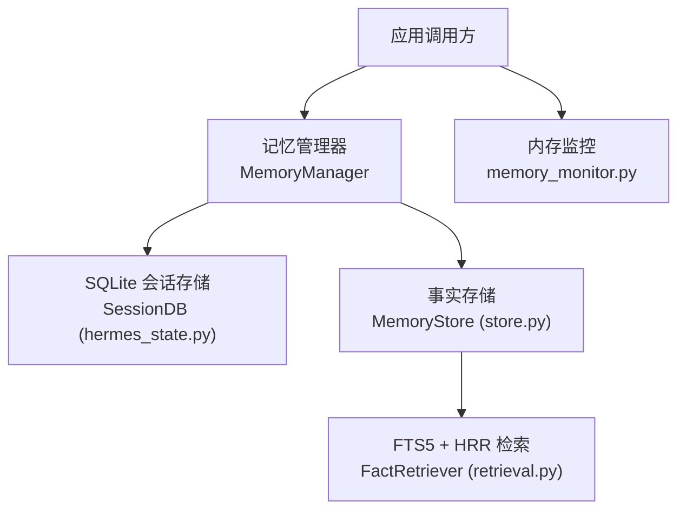
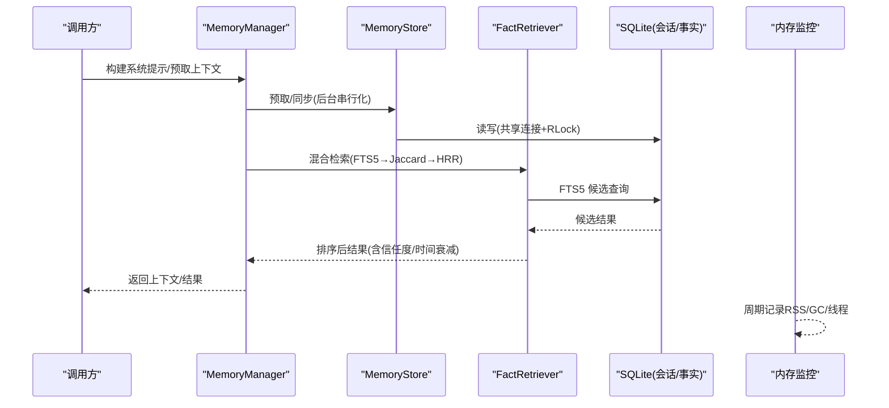
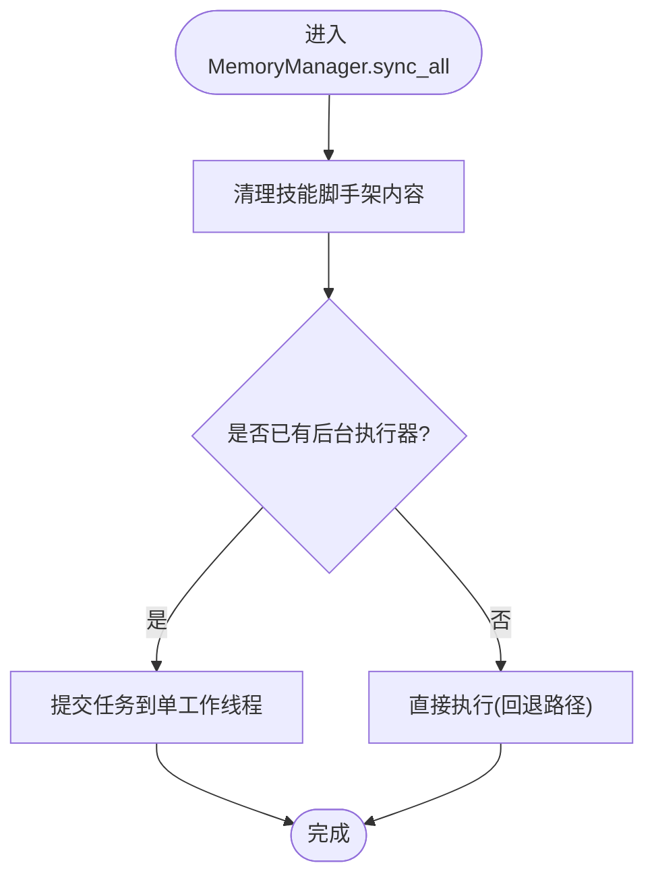
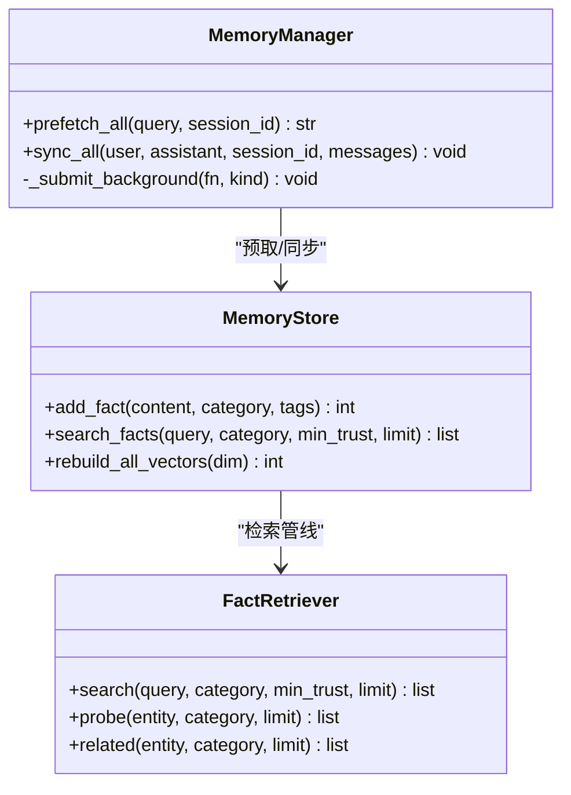
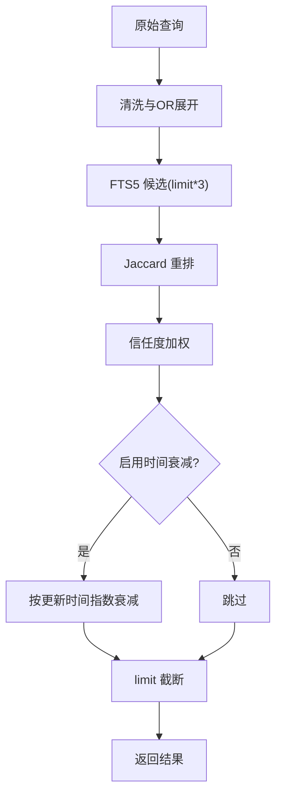
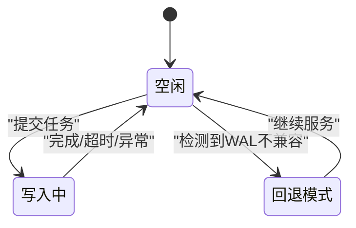
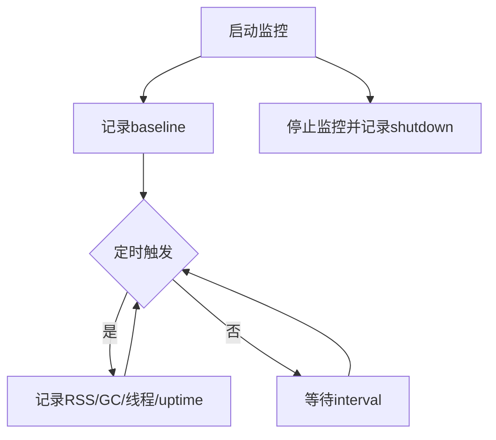
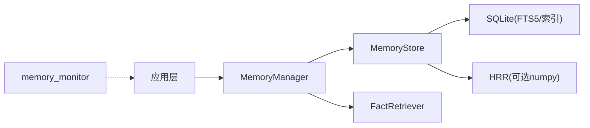

# 性能优化策略

<cite>
**本文引用的文件**
- [hermes_state.py](file://hermes_state.py)
- [memory_manager.py](file://agent/memory_manager.py)
- [store.py](file://plugins/memory/holographic/store.py)
- [retrieval.py](file://plugins/memory/holographic/retrieval.py)
- [memory_monitor.py](file://gateway/memory_monitor.py)
</cite>

## 目录
1. [简介](#简介)
2. [项目结构](#项目结构)
3. [核心组件](#核心组件)
4. [架构总览](#架构总览)
5. [详细组件分析](#详细组件分析)
6. [依赖关系分析](#依赖关系分析)
7. [性能考量](#性能考量)
8. [故障排查指南](#故障排查指南)
9. [结论](#结论)
10. [附录](#附录)

## 简介
本文件聚焦于 Hermes Agent 在“记忆系统”与“状态存储”上的性能优化策略，覆盖批量写入、缓存机制、查询优化、并发控制、监控指标与瓶颈识别方法，并结合仓库中的实际实现给出可操作的调优建议。重点围绕以下方面：
- 批量写入与事务合并：SQLite WAL/DELETE 模式选择、自动提交与锁争用规避、后台序列化写入。
- 缓存机制：内存级上下文预取、HRR 向量与 FTS5 混合检索、按类别的向量库（bank）聚合。
- 查询优化：FTS5 查询词清洗与 OR 展开、Jaccard 重排、信任度加权、结果集限制。
- 并发控制：进程内共享连接与重入锁、单写者模型、超时与回退策略。
- 监控与诊断：周期性 RSS/GC 日志、启动基线与关闭快照、线程数统计。

## 项目结构
与性能密切相关的模块分布如下：
- 会话状态存储：hermes_state.py（SQLite 会话持久化、WAL 兼容、压缩拆分、导出/恢复限制）。
- 记忆管理器：agent/memory_manager.py（多提供者编排、后台同步/预取、超时保护）。
- 事实存储与检索：plugins/memory/holographic/store.py（SQLite 事实表、FTS5、实体解析、HRR 向量）、retrieval.py（混合检索管线）。
- 内存监控：gateway/memory_monitor.py（RSS/GC/线程周期日志）。

**图示来源**
- [hermes_state.py:1-120](file://hermes_state.py#L1-L120)
- [memory_manager.py:364-758](file://agent/memory_manager.py#L364-L758)
- [store.py:16-177](file://plugins/memory/holographic/store.py#L16-L177)
- [retrieval.py:22-123](file://plugins/memory/holographic/retrieval.py#L22-L123)
- [memory_monitor.py:1-29](file://gateway/memory_monitor.py#L1-L29)

**章节来源**
- [hermes_state.py:1-120](file://hermes_state.py#L1-L120)
- [memory_manager.py:364-758](file://agent/memory_manager.py#L364-L758)
- [store.py:16-177](file://plugins/memory/holographic/store.py#L16-L177)
- [retrieval.py:22-123](file://plugins/memory/holographic/retrieval.py#L22-L123)
- [memory_monitor.py:1-29](file://gateway/memory_monitor.py#L1-L29)

## 核心组件
- SQLite 会话存储（WAL/DELETE 自适应、安全限制、压缩拆分）：提供高并发读、单写者的持久化能力，并在网络文件系统或特定平台下回退到 DELETE 模式以保证可用性。
- 记忆管理器（后台串行化写入、外部提供者超时保护）：将 turn 结束后的同步与下一轮预取放入后台队列，避免阻塞主循环；对外部提供者设置超时，防止卡死。
- 事实存储（共享连接+RLock、FTS5、HRR 向量、类别 bank）：通过进程级共享连接与重入锁消除跨连接写锁竞争；使用 FTS5 做关键词召回，HRR 做语义相似度与代数运算；按类别维护聚合向量以加速相关查询。
- 混合检索（FTS5 候选 → Jaccard 重排 → 信任度加权 → 可选时间衰减）：在保证召回率的同时提升排序质量，并支持实体探测与矛盾检测等高级能力。
- 内存监控（RSS/GC/线程周期日志）：为长驻进程提供泄漏与峰值观测手段，便于定位瓶颈。

**章节来源**
- [hermes_state.py:486-518](file://hermes_state.py#L486-L518)
- [memory_manager.py:638-758](file://agent/memory_manager.py#L638-L758)
- [store.py:101-177](file://plugins/memory/holographic/store.py#L101-L177)
- [retrieval.py:48-123](file://plugins/memory/holographic/retrieval.py#L48-L123)
- [memory_monitor.py:83-127](file://gateway/memory_monitor.py#L83-L127)

## 架构总览
下图展示了从用户请求到记忆检索与持久化的关键路径，以及后台写入与监控的交互。

**图示来源**
- [memory_manager.py:525-623](file://agent/memory_manager.py#L525-L623)
- [store.py:188-231](file://plugins/memory/holographic/store.py#L188-L231)
- [retrieval.py:48-123](file://plugins/memory/holographic/retrieval.py#L48-L123)
- [memory_monitor.py:139-193](file://gateway/memory_monitor.py#L139-L193)

## 详细组件分析

### 批量写入与事务合并
- 单写者与共享连接：MemoryStore 对同一数据库只保留一个 sqlite3 连接，并通过 RLock 串行化所有写操作，避免多实例导致的写锁争用与“database is locked”。
- 自动提交隔离：连接使用 isolation_level=None，每条语句即一个事务，异常时不会遗留挂起事务与写锁。
- 后台串行化写入：MemoryManager 使用单 worker 线程池（DaemonThreadPoolExecutor）串行执行 sync/prefetch，保证 turn N 先于 turn N+1 落盘，且不会阻塞主循环。
- 超时与降级：外部提供者 prefetch 有独立超时；若创建 executor 失败则回退为 inline 执行，确保功能可用。

**图示来源**
- [memory_manager.py:638-758](file://agent/memory_manager.py#L638-L758)
- [store.py:101-177](file://plugins/memory/holographic/store.py#L101-L177)

**章节来源**
- [memory_manager.py:638-758](file://agent/memory_manager.py#L638-L758)
- [store.py:101-177](file://plugins/memory/holographic/store.py#L101-L177)

### 缓存机制
- 内存级上下文预取：MemoryManager.prefetch_all 并行收集各提供者上下文，外部提供者使用线程+超时保护，避免慢提供者拖慢响应。
- 向量与全文混合缓存：MemoryStore 维护 facts_fts（FTS5）用于快速关键词召回；同时维护 memory_banks（按类别聚合的 HRR 向量），用于实体探测与相关发现。
- 惰性计算：HRR 向量仅在需要时计算或重建；当 numpy 不可用时自动回退到纯关键词检索，避免额外开销。

**图示来源**
- [memory_manager.py:525-623](file://agent/memory_manager.py#L525-L623)
- [store.py:188-231](file://plugins/memory/holographic/store.py#L188-L231)
- [retrieval.py:48-123](file://plugins/memory/holographic/retrieval.py#L48-L123)

**章节来源**
- [memory_manager.py:525-623](file://agent/memory_manager.py#L525-L623)
- [store.py:188-231](file://plugins/memory/holographic/store.py#L188-L231)
- [retrieval.py:48-123](file://plugins/memory/holographic/retrieval.py#L48-L123)

### 查询优化
- FTS5 查询清洗：去除停用词与短词，转义特殊字符并以 OR 展开，提高自然语言查询的召回率。
- 重排策略：FTS5 候选基础上进行 Jaccard 相似度重排，再乘以 trust_score 得到最终分数；可选时间衰减降低陈旧信息权重。
- 结果集限制：search/probe/related 均支持 limit，避免大结果集带来的 CPU/内存压力。
- 类别过滤：通过 category 缩小搜索空间，减少不必要扫描。

**图示来源**
- [retrieval.py:48-123](file://plugins/memory/holographic/retrieval.py#L48-L123)
- [retrieval.py:599-633](file://plugins/memory/holographic/retrieval.py#L599-L633)

**章节来源**
- [retrieval.py:48-123](file://plugins/memory/holographic/retrieval.py#L48-L123)
- [retrieval.py:599-633](file://plugins/memory/holographic/retrieval.py#L599-L633)

### 并发控制
- 共享连接+RLock：MemoryStore 进程级共享连接，配合 RLock 串行化写操作，避免多实例写锁竞争。
- 单写者模型：MemoryManager 使用单 worker 线程串行执行所有 provider 的 sync/prefetch，保证顺序性与一致性。
- 超时保护：外部提供者 prefetch 有独立超时；长时间无响应将被丢弃，避免阻塞。
- WAL/DELETE 回退：hermes_state 在 NFS/SMB/FUSE/ZFS 等环境下回退到 DELETE 模式，避免 WAL 共享内存与锁协议不兼容导致的失败。

**图示来源**
- [store.py:101-177](file://plugins/memory/holographic/store.py#L101-L177)
- [memory_manager.py:638-758](file://agent/memory_manager.py#L638-L758)
- [hermes_state.py:486-518](file://hermes_state.py#L486-L518)

**章节来源**
- [store.py:101-177](file://plugins/memory/holographic/store.py#L101-L177)
- [memory_manager.py:638-758](file://agent/memory_manager.py#L638-L758)
- [hermes_state.py:486-518](file://hermes_state.py#L486-L518)

### 监控指标与瓶颈识别
- 指标项：RSS（MB）、GC 计数（gen0/gen1/gen2）、活跃线程数、运行时长。
- 采集方式：daemon 线程每 N 分钟输出结构化日志行，启动时记录 baseline，关闭时记录 shutdown 快照。
- 瓶颈定位：观察 RSS 是否持续上升（内存泄漏）、GC 计数是否频繁飙升（对象分配过多）、线程数是否增长（资源未释放）、WAL 回退日志（文件系统不兼容）。

**图示来源**
- [memory_monitor.py:139-193](file://gateway/memory_monitor.py#L139-L193)
- [memory_monitor.py:83-127](file://gateway/memory_monitor.py#L83-L127)

**章节来源**
- [memory_monitor.py:83-127](file://gateway/memory_monitor.py#L83-L127)
- [memory_monitor.py:139-193](file://gateway/memory_monitor.py#L139-L193)

## 依赖关系分析
- MemoryManager 依赖 MemoryStore 进行事实存取，并组合 FactRetriever 完成检索。
- MemoryStore 依赖 SQLite（FTS5、索引、触发器）与可选的 HRR（numpy）进行向量化与代数运算。
- hermes_state 提供会话级持久化与 WAL/DELETE 自适应，保障整体稳定性。
- memory_monitor 独立于业务逻辑，仅读取进程资源信息，不影响主流程。

**图示来源**
- [memory_manager.py:364-758](file://agent/memory_manager.py#L364-L758)
- [store.py:16-177](file://plugins/memory/holographic/store.py#L16-L177)
- [retrieval.py:22-123](file://plugins/memory/holographic/retrieval.py#L22-L123)
- [memory_monitor.py:1-29](file://gateway/memory_monitor.py#L1-L29)

**章节来源**
- [memory_manager.py:364-758](file://agent/memory_manager.py#L364-L758)
- [store.py:16-177](file://plugins/memory/holographic/store.py#L16-L177)
- [retrieval.py:22-123](file://plugins/memory/holographic/retrieval.py#L22-L123)
- [memory_monitor.py:1-29](file://gateway/memory_monitor.py#L1-L29)

## 性能考量
- 批量写入
  - 使用单 worker 线程串行化所有 provider 的写入，避免并发写冲突与乱序。
  - 采用自动提交隔离级别，异常时不残留事务，降低锁持有时间。
  - 对网络/守护进程调用设置超时，避免阻塞主循环。
- 缓存机制
  - 优先使用 FTS5 召回候选，再用轻量 Jaccard 重排，最后结合 trust_score 与可选时间衰减排序。
  - 类别 bank 聚合向量用于实体探测与相关发现，减少全量扫描。
  - 在 numpy 不可用时自动回退到纯关键词检索，避免额外依赖成本。
- 查询优化
  - 对自然语言查询进行停用词过滤与 OR 展开，提高召回率。
  - 严格限制 limit，避免大结果集导致 CPU/内存压力。
  - 利用 category 过滤缩小搜索空间。
- 并发控制
  - 共享连接+RLock 消除跨连接写锁竞争。
  - WAL 不兼容环境自动回退到 DELETE 模式，保证可用性。
- 监控与调优
  - 开启周期性内存监控，关注 RSS 趋势、GC 频率与线程数变化。
  - 针对高频热点查询，调整权重（fts_weight/jaccard_weight/hrr_weight）与 half_life，平衡精度与延迟。
  - 对慢提供者设置更短超时或降级策略，避免拖慢整体吞吐。

[本节为通用指导，不直接分析具体文件]

## 故障排查指南
- 现象：写入“database is locked”
  - 原因：多实例各自打开连接导致写锁竞争。
  - 处理：确认使用共享连接与 RLock 串行化；检查是否存在绕过共享连接的直连代码。
- 现象：WAL 模式报错（locking protocol/disk i/o error）
  - 原因：NFS/SMB/FUSE/ZFS 等文件系统不支持 WAL 共享内存或锁协议。
  - 处理：自动回退到 DELETE 模式；必要时迁移本地磁盘。
- 现象：外部提供者 prefetch 超时
  - 原因：网络/守护进程卡顿。
  - 处理：调整超时阈值；增加重试或降级；记录告警。
- 现象：RSS 持续增长
  - 原因：可能的内存泄漏或未释放资源。
  - 处理：查看 memory_monitor 日志；定位增长阶段；检查对象生命周期与缓存大小。

**章节来源**
- [store.py:101-177](file://plugins/memory/holographic/store.py#L101-L177)
- [hermes_state.py:486-518](file://hermes_state.py#L486-L518)
- [memory_manager.py:547-595](file://agent/memory_manager.py#L547-L595)
- [memory_monitor.py:83-127](file://gateway/memory_monitor.py#L83-L127)

## 结论
Hermes Agent 的记忆系统在性能上通过“共享连接+RLock”、“后台串行化写入”、“FTS5+Jaccard+HRR 混合检索”、“类别 bank 聚合”与“WAL/DELETE 自适应”等策略，实现了高吞吐、低延迟与强稳定性的平衡。配合周期性内存监控与可调参数，可在不同负载与环境条件下获得良好表现。建议在生产环境中：
- 保持 WAL 回退机制启用，确保在复杂文件系统下的可用性。
- 合理配置 prefetch 超时与权重参数，平衡召回与延迟。
- 定期审查 memory_monitor 日志，及时识别内存与线程问题。
- 对热点查询使用 category 与 limit 限制，避免全表扫描。

[本节为总结性内容，不直接分析具体文件]

## 附录
- 关键配置点（示例）
  - 会话限制：max_resume_messages、max_export_messages（来自 hermes_state 的配置解析）。
  - 检索权重：fts_weight、jaccard_weight、hrr_weight、half_life（来自 FactRetriever）。
  - 监控间隔：interval_seconds（来自 memory_monitor）。
- 参考实现路径
  - 会话状态与 WAL 回退：hermes_state.py
  - 记忆管理与后台写入：agent/memory_manager.py
  - 事实存储与向量库：plugins/memory/holographic/store.py
  - 混合检索管线：plugins/memory/holographic/retrieval.py
  - 内存监控：gateway/memory_monitor.py

[本节为补充信息，不直接分析具体文件]