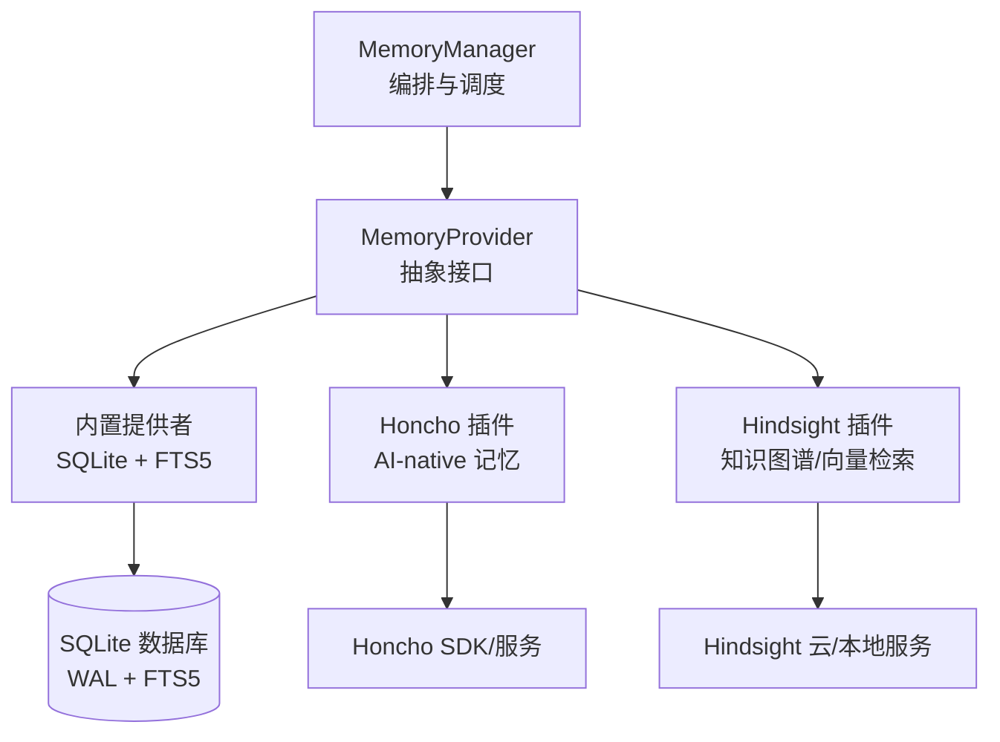
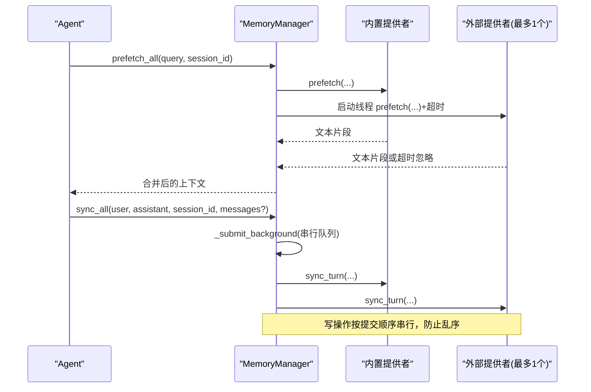
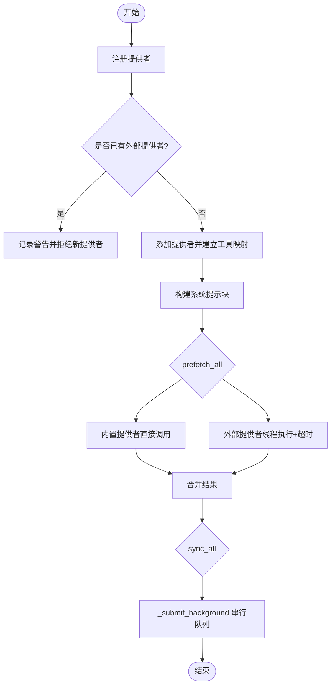
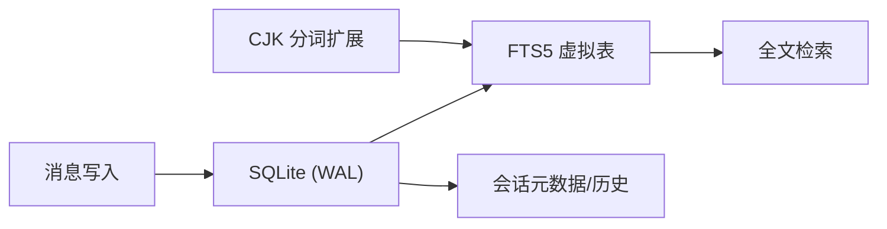
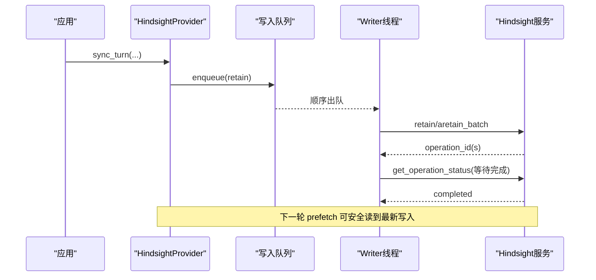
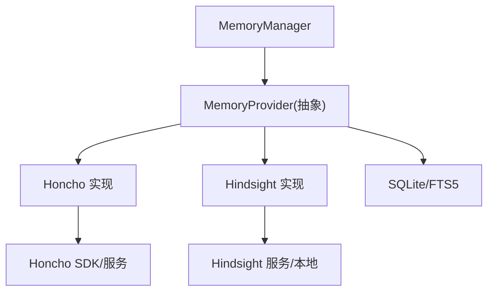

# 持久化存储

<cite>
**本文引用的文件**
- [agent/memory_manager.py](file://agent/memory_manager.py)
- [agent/memory_provider.py](file://agent/memory_provider.py)
- [plugins/memory/honcho/__init__.py](file://plugins/memory/honcho/__init__.py)
- [plugins/memory/hindsight/__init__.py](file://plugins/memory/hindsight/__init__.py)
- [hermes_state.py](file://hermes_state.py)
- [native/fts5_cjk/fts5_cjk.c](file://native/fts5_cjk/fts5_cjk.c)
- [plugins/memory/config_schema.py](file://plugins/memory/config_schema.py)
</cite>

## 目录
1. [简介](#简介)
2. [项目结构](#项目结构)
3. [核心组件](#核心组件)
4. [架构总览](#架构总览)
5. [详细组件分析](#详细组件分析)
6. [依赖关系分析](#依赖关系分析)
7. [性能考量](#性能考量)
8. [故障排查指南](#故障排查指南)
9. [结论](#结论)
10. [附录](#附录)

## 简介
本文件系统性说明 Hermes Agent 的“持久化存储”能力，聚焦记忆系统的底层存储机制与编排方式。内容涵盖：
- MemoryManager 如何协调多个记忆提供者（内置与外部插件）
- 存储后端选择策略、数据序列化格式与索引机制
- FTS5 全文搜索的实现原理、向量嵌入的生成与存储
- 跨会话的数据一致性保证
- 存储性能优化（批量写入、缓存、查询优化）
- 配置选项、故障恢复与数据迁移
- 扩展自定义存储后端的实践与常见问题诊断

## 项目结构
记忆系统由三层构成：
- 编排层：MemoryManager 统一注册、调度、超时控制与后台任务管理
- 抽象层：MemoryProvider 定义标准接口（初始化、预取、同步、工具暴露等）
- 实现层：各插件提供具体后端（如 Honcho、Hindsight），以及内置 SQLite+FTS5 状态存储

**图表来源**
- [agent/memory_manager.py:364-470](file://agent/memory_manager.py#L364-L470)
- [agent/memory_provider.py:81-191](file://agent/memory_provider.py#L81-L191)
- [plugins/memory/honcho/__init__.py:237-335](file://plugins/memory/honcho/__init__.py#L237-L335)
- [plugins/memory/hindsight/__init__.py:681-753](file://plugins/memory/hindsight/__init__.py#L681-L753)
- [hermes_state.py:1-15](file://hermes_state.py#L1-L15)

**章节来源**
- [agent/memory_manager.py:364-470](file://agent/memory_manager.py#L364-L470)
- [agent/memory_provider.py:81-191](file://agent/memory_provider.py#L81-L191)
- [hermes_state.py:1-15](file://hermes_state.py#L1-L15)

## 核心组件
- MemoryManager：单点集成入口，负责：
  - 注册提供者（仅允许一个外部提供者）
  - 构建系统提示块
  - 每轮对话前 prefetch_all（并行/超时保护）
  - 每轮对话后 sync_all（后台串行写入，保证顺序）
  - 工具模式注入与冲突规避（保留核心工具名优先）
- MemoryProvider：抽象基类，定义生命周期与钩子：
  - initialize/system_prompt_block/prefetch/sync_turn/get_tool_schemas/handle_tool_call/shutdown
  - 可选钩子：on_turn_start/on_session_end/on_session_switch/on_pre_compress/on_delegation/backup_paths
- 内置存储（hermes_state）：SQLite + FTS5，支持 WAL 并发、压缩拆分、跨会话检索
- 插件提供者：
  - Honcho：AI-native 用户建模、对话式问答、混合检索、持久结论
  - Hindsight：知识图谱、实体解析、多策略检索、向量嵌入、云/本地部署

**章节来源**
- [agent/memory_manager.py:364-800](file://agent/memory_manager.py#L364-L800)
- [agent/memory_provider.py:81-358](file://agent/memory_provider.py#L81-L358)
- [hermes_state.py:1-15](file://hermes_state.py#L1-L15)
- [plugins/memory/honcho/__init__.py:237-335](file://plugins/memory/honcho/__init__.py#L237-L335)
- [plugins/memory/hindsight/__init__.py:681-753](file://plugins/memory/hindsight/__init__.py#L681-L753)

## 架构总览
MemoryManager 作为唯一编排点，将“预取上下文”和“回合同步”解耦到后台线程，避免慢后端阻塞对话响应。外部提供者通过独立线程执行 prefetch，并设置超时；所有写操作通过单工作线程串行化，确保 turn N 先于 turn N+1 落地。

**图表来源**
- [agent/memory_manager.py:525-694](file://agent/memory_manager.py#L525-L694)

**章节来源**
- [agent/memory_manager.py:525-694](file://agent/memory_manager.py#L525-L694)

## 详细组件分析

### MemoryManager 编排与工具路由
- 提供者注册：
  - 始终接受内置提供者
  - 仅允许一个外部提供者，重复注册会记录警告
  - 工具名冲突时，核心工具名优先，冲突的工具被丢弃
- 系统提示：
  - 聚合各提供者的 system_prompt_block，空块跳过
- 预取：
  - 内置提供者直接调用
  - 外部提供者使用独立线程执行，带超时保护；若仍在运行则跳过本轮
- 同步：
  - 通过单工作线程串行执行，避免网络/守护进程阻塞导致“长时间运行”
  - 兼容不同签名（是否接受 messages 参数）
- 后台任务：
  - 延迟创建线程池，失败时回退为内联执行
  - flush_pending 用于在会话边界等待队列排空

**图表来源**
- [agent/memory_manager.py:404-470](file://agent/memory_manager.py#L404-L470)
- [agent/memory_manager.py:525-694](file://agent/memory_manager.py#L525-L694)

**章节来源**
- [agent/memory_manager.py:404-470](file://agent/memory_manager.py#L404-L470)
- [agent/memory_manager.py:525-694](file://agent/memory_manager.py#L525-L694)

### MemoryProvider 抽象与插件契约
- 必须实现：is_available、initialize、get_tool_schemas
- 可选实现：system_prompt_block、prefetch、queue_prefetch、sync_turn、handle_tool_call、shutdown
- 可选钩子：on_turn_start、on_session_end、on_session_switch、on_pre_compress、on_delegation、backup_paths、get_config_schema/save_config
- trivial prompt 过滤：对无语义信号的消息跳过记忆预取，减少不必要网络开销

**章节来源**
- [agent/memory_provider.py:81-358](file://agent/memory_provider.py#L81-L358)

### 内置存储：SQLite + FTS5 全文检索
- 设计要点：
  - WAL 模式：多读一写，适合网关多平台并发
  - FTS5 虚拟表：跨会话消息全文检索
  - 压缩触发会话拆分：通过 parent_session_id 链维护
  - 源标记：cli/telegram/discord 等便于过滤
- CJK 分词增强：
  - native/fts5_cjk 提供 CJK 分词扩展，提升中文等多语言检索效果
- 版本与迁移：
  - 包含 schema_version、FTS 存储版本常量，配合迁移逻辑保障升级兼容

**图表来源**
- [hermes_state.py:1-15](file://hermes_state.py#L1-L15)
- [native/fts5_cjk/fts5_cjk.c:1-200](file://native/fts5_cjk/fts5_cjk.c#L1-L200)

**章节来源**
- [hermes_state.py:1-15](file://hermes_state.py#L1-L15)
- [native/fts5_cjk/fts5_cjk.c:1-200](file://native/fts5_cjk/fts5_cjk.c#L1-L200)

### Honcho 插件：AI-native 记忆与混合检索
- 能力：
  - 用户画像（peer card）、上下文快照、对话式推理、持久结论
  - 混合检索：语义 + 关键词，返回原始摘录或合成答案
- 配置与初始化：
  - 支持 profile-scoped 配置（$HERMES_HOME/honcho.json）与全局配置
  - 懒加载会话初始化，tools-only 模式可延后至首次工具调用
  - 背景预热：首轮可等待基础上下文，后续异步刷新
- 工具：
  - honcho_profile / honcho_search / honcho_reasoning / honcho_context / honcho_conclude
- 备份路径：
  - ~/.honcho 目录纳入 hermes backup

**章节来源**
- [plugins/memory/honcho/__init__.py:237-335](file://plugins/memory/honcho/__init__.py#L237-L335)
- [plugins/memory/honcho/__init__.py:343-562](file://plugins/memory/honcho/__init__.py#L343-L562)
- [plugins/memory/honcho/__init__.py:627-700](file://plugins/memory/honcho/__init__.py#L627-L700)

### Hindsight 插件：知识图谱与向量检索
- 能力：
  - 长期记忆、知识图谱、实体解析、多策略检索（语义/关键词/图遍历/重排）
  - 支持云端 API Key 与本地嵌入式模式
- 配置：
  - 环境变量与配置文件（profile-scoped $HERMES_HOME/hindsight/config.json，兼容 ~/.hindsight/config.json）
  - 可调项：mode/budget/timeout/idle_timeout/retain_tags/observation_scopes 等
- 嵌入与索引：
  - 本地模式使用 sentence_transformers 计算向量嵌入
  - 云端模式通过 API 进行检索与保留
- 写入与一致性：
  - 单写者模型：retain 入队，writer 线程顺序消费
  - 异步 retain 完成后通过 get_operation_status 等待服务端完成，避免“读后写”竞态
  - 版本探测：根据 /version 判断是否支持 update_mode='append'，旧版本采用 per-process document_id 避免覆盖

**图表来源**
- [plugins/memory/hindsight/__init__.py:681-753](file://plugins/memory/hindsight/__init__.py#L681-L753)
- [plugins/memory/hindsight/__init__.py:177-252](file://plugins/memory/hindsight/__init__.py#L177-L252)

**章节来源**
- [plugins/memory/hindsight/__init__.py:681-753](file://plugins/memory/hindsight/__init__.py#L681-L753)
- [plugins/memory/hindsight/__init__.py:177-252](file://plugins/memory/hindsight/__init__.py#L177-L252)

### 跨会话一致性与会话切换
- 会话切换钩子 on_session_switch：
  - 当 agent.session_id 变更时通知提供者更新内部状态（如文档ID、计数器）
  - 支持 reset/rewound 标志，处理重置与截断场景
- 写顺序保证：
  - MemoryManager 的后台串行队列确保 turn N 先于 turn N+1 写入
- 读后写可见性：
  - Hindsight 通过等待异步 retain 完成，确保下一轮 prefetch 能读到最新写入

**章节来源**
- [agent/memory_provider.py:214-256](file://agent/memory_provider.py#L214-L256)
- [agent/memory_manager.py:638-694](file://agent/memory_manager.py#L638-L694)
- [plugins/memory/hindsight/__init__.py:724-773](file://plugins/memory/hindsight/__init__.py#L724-L773)

## 依赖关系分析
- 模块耦合：
  - MemoryManager 依赖 MemoryProvider 抽象，不关心具体实现
  - 插件通过 MemoryProvider 接口接入，保持松耦合
- 外部依赖：
  - Honcho：SDK/服务通信
  - Hindsight：云服务或本地嵌入式服务（含 NLP/向量库）
  - SQLite + FTS5：内置状态存储
- 潜在循环依赖：
  - 通过抽象层隔离，避免直接循环导入
- 工具命名空间：
  - 核心工具名保留，提供者工具名冲突会被丢弃，避免覆盖

**图表来源**
- [agent/memory_manager.py:364-470](file://agent/memory_manager.py#L364-L470)
- [agent/memory_provider.py:81-191](file://agent/memory_provider.py#L81-L191)

**章节来源**
- [agent/memory_manager.py:364-470](file://agent/memory_manager.py#L364-L470)
- [agent/memory_provider.py:81-191](file://agent/memory_provider.py#L81-L191)

## 性能考量
- 预取并行与超时：
  - 外部提供者使用独立线程执行 prefetch，设置超时避免阻塞主流程
- 写入串行化：
  - 单工作线程串行执行 sync_turn，保证顺序且避免资源竞争
- 缓存机制：
  - Honcho 维护 base context 缓存，按 cadence 刷新
  - Hindsight 维护事件循环与队列，减少重复创建开销
- 查询优化：
  - FTS5 虚拟表加速全文检索
  - CJK 分词扩展提升中文检索质量
  - Hindsight 支持多种检索策略与重排，提高相关性
- 批量与异步：
  - Hindsight 支持 aretain_batch 与异步操作，结合 get_operation_status 等待完成
- 资源保护：
  - 后台线程为 daemon，避免进程退出阻塞
  - 工具名冲突与核心工具保留，避免请求污染

**章节来源**
- [agent/memory_manager.py:547-694](file://agent/memory_manager.py#L547-L694)
- [plugins/memory/honcho/__init__.py:253-290](file://plugins/memory/honcho/__init__.py#L253-L290)
- [plugins/memory/hindsight/__init__.py:256-294](file://plugins/memory/hindsight/__init__.py#L256-L294)
- [hermes_state.py:1-15](file://hermes_state.py#L1-L15)

## 故障排查指南
- 外部提供者超时：
  - 现象：prefetch 超时并被跳过
  - 排查：检查网络/服务健康，调整 external_prefetch_timeout
- 认证失败：
  - 现象：初始化阶段认证被拒，提供者不可用
  - 排查：检查 API Key/Base URL，查看初始化错误日志
- 写顺序异常：
  - 现象：下一轮未读到最新写入
  - 排查：确认 writer 线程是否正常运行，Hindsight 是否等待异步操作完成
- 工具名冲突：
  - 现象：提供者工具未被注册
  - 排查：避免使用核心工具名，修改提供者工具名
- 备份缺失：
  - 现象：hermes backup 未包含外部状态
  - 排查：实现 backup_paths 返回外部路径（如 ~/.honcho、~/.hindsight）

**章节来源**
- [agent/memory_manager.py:547-594](file://agent/memory_manager.py#L547-L594)
- [plugins/memory/honcho/__init__.py:564-610](file://plugins/memory/honcho/__init__.py#L564-L610)
- [plugins/memory/hindsight/__init__.py:724-773](file://plugins/memory/hindsight/__init__.py#L724-L773)
- [agent/memory_provider.py:322-358](file://agent/memory_provider.py#L322-L358)

## 结论
Hermes 的记忆系统通过 MemoryManager 统一编排，结合 MemoryProvider 抽象与插件生态，实现了灵活、可扩展的持久化存储。内置 SQLite+FTS5 提供高效全文检索，Honcho 与 Hindsight 分别提供 AI-native 用户建模与知识图谱/向量检索能力。通过后台串行写入、预取并行与超时保护、缓存与异步批处理等机制，系统在性能与可靠性之间取得平衡。配置化与备份路径声明进一步提升了可运维性。

## 附录

### 配置选项与存储后端选择
- 通用配置：
  - memory.provider：选择启用的外部记忆提供者（仅一个）
  - enabled_toolsets/disabled_toolsets：控制 memory 工具集暴露
- Honcho：
  - $HERMES_HOME/honcho.json 或 ~/.honcho/config.json
  - 关键项：api_key/base_url/recall_mode/injection_frequency/context_cadence/dialectic_depth 等
- Hindsight：
  - $HERMES_HOME/hindsight/config.json 或 ~/.hindsight/config.json
  - 关键项：mode/apiKey/budget/timeout/idle_timeout/retain_tags/observation_scopes 等
- 配置渲染：
  - 通过 config_schema.py 声明字段类型、默认值、是否密钥、作用域等，驱动 UI 与 API

**章节来源**
- [plugins/memory/config_schema.py:1-145](file://plugins/memory/config_schema.py#L1-L145)
- [plugins/memory/honcho/__init__.py:315-335](file://plugins/memory/honcho/__init__.py#L315-L335)
- [plugins/memory/hindsight/__init__.py:361-404](file://plugins/memory/hindsight/__init__.py#L361-L404)

### 数据序列化与索引机制
- 内置存储：
  - JSON 消息序列化为 SQLite 行，FTS5 虚拟表索引全文
  - 会话元数据与消息历史分离，支持预览与导出限制
- 插件存储：
  - Honcho/Hindsight 各自维护数据结构与服务端索引
  - Hindsight 支持向量嵌入与知识图谱索引

**章节来源**
- [hermes_state.py:1-15](file://hermes_state.py#L1-L15)
- [plugins/memory/hindsight/__init__.py:681-753](file://plugins/memory/hindsight/__init__.py#L681-L753)

### 扩展自定义存储后端
步骤：
1. 继承 MemoryProvider，实现必要方法（is_available、initialize、get_tool_schemas 等）
2. 在 add_provider 中注册（仅允许一个外部提供者）
3. 如需配置面板，提供 config_schema.py 声明字段
4. 如需备份外部路径，实现 backup_paths
5. 利用 on_session_switch 处理会话切换，on_pre_compress 参与压缩摘要

示例路径参考：
- 抽象接口：[agent/memory_provider.py:81-358](file://agent/memory_provider.py#L81-L358)
- 配置声明：[plugins/memory/config_schema.py:1-145](file://plugins/memory/config_schema.py#L1-L145)
- 插件实现参考：
  - [plugins/memory/honcho/__init__.py:237-335](file://plugins/memory/honcho/__init__.py#L237-L335)
  - [plugins/memory/hindsight/__init__.py:681-753](file://plugins/memory/hindsight/__init__.py#L681-L753)

**章节来源**
- [agent/memory_provider.py:81-358](file://agent/memory_provider.py#L81-L358)
- [plugins/memory/config_schema.py:1-145](file://plugins/memory/config_schema.py#L1-L145)
- [plugins/memory/honcho/__init__.py:237-335](file://plugins/memory/honcho/__init__.py#L237-L335)
- [plugins/memory/hindsight/__init__.py:681-753](file://plugins/memory/hindsight/__init__.py#L681-L753)