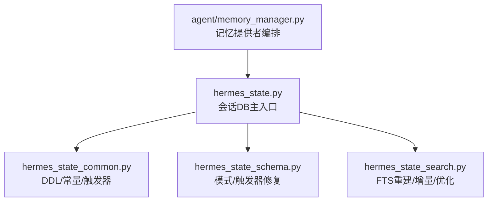
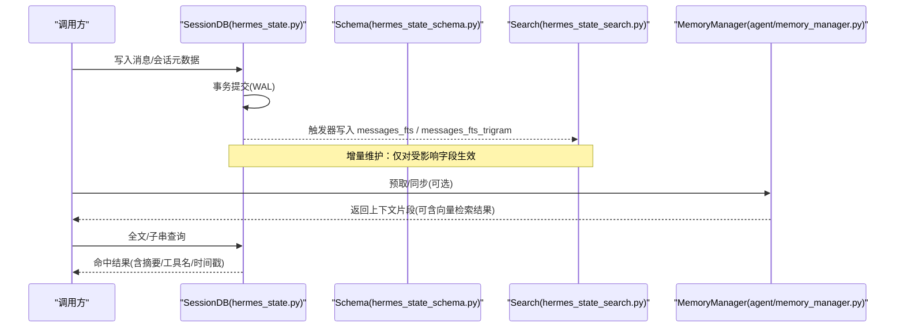
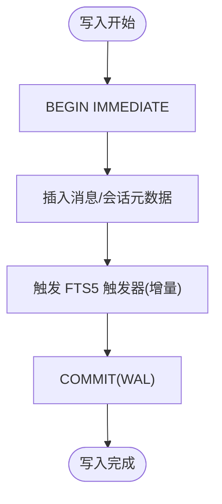
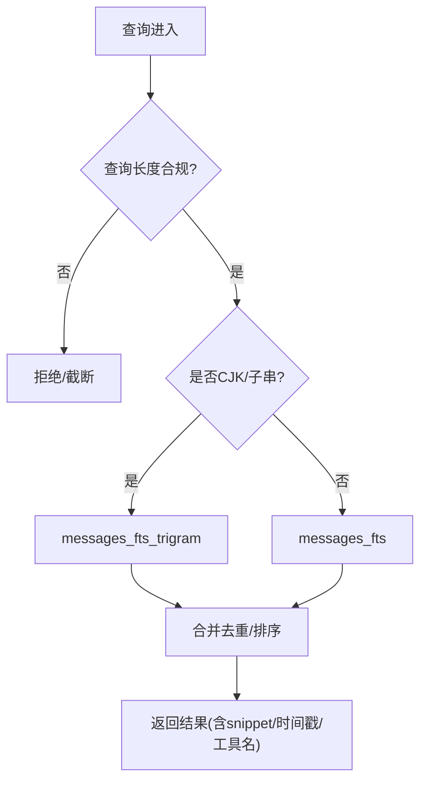
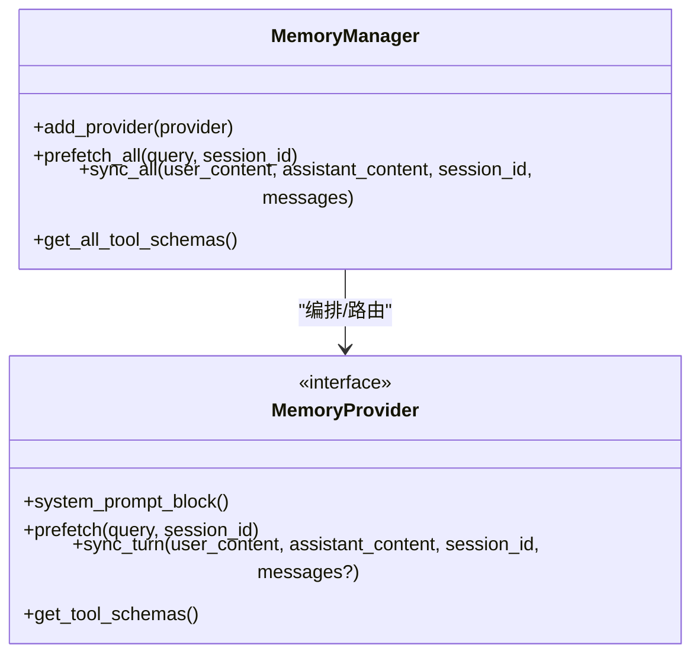
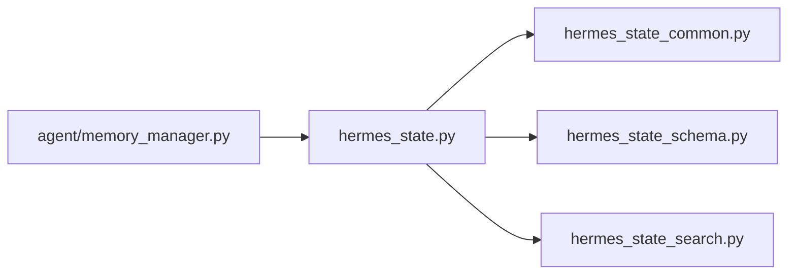

# 数据序列化与索引

<cite>
**本文引用的文件**
- [hermes_state.py](file://hermes_state.py)
- [hermes_state_common.py](file://hermes_state_common.py)
- [hermes_state_schema.py](file://hermes_state_schema.py)
- [hermes_state_search.py](file://hermes_state_search.py)
- [agent/memory_manager.py](file://agent/memory_manager.py)
</cite>

## 目录
1. [简介](#简介)
2. [项目结构](#项目结构)
3. [核心组件](#核心组件)
4. [架构总览](#架构总览)
5. [详细组件分析](#详细组件分析)
6. [依赖关系分析](#依赖关系分析)
7. [性能考量](#性能考量)
8. [故障排查指南](#故障排查指南)
9. [结论](#结论)
10. [附录](#附录)

## 简介
本文件聚焦于记忆数据的序列化与索引机制，系统性说明：
- 会话消息在 SQLite 中的持久化、压缩与跨会话一致性（事务、版本控制、冲突处理）
- FTS5 全文搜索的实现原理（分词器配置、索引构建、增量维护与查询优化）
- 向量嵌入的生成、存储格式与相似度计算（在本仓库中由外部记忆提供者实现，本文给出集成方式与约束）
- 数据压缩策略、增量更新机制与批量操作优化
- 存储与查询性能监控指标、索引维护建议
- 实际代码路径示例与常见问题调试方案

## 项目结构
围绕状态存储与搜索的关键模块如下：
- hermes_state.py：会话数据库主入口，负责连接管理、WAL/兼容性、写入锁、压缩与迁移等
- hermes_state_common.py：共享常量与 DDL（表结构、FTS5 触发器、索引定义）
- hermes_state_schema.py：模式创建、列对齐、FTS 触发器修复与重建
- hermes_state_search.py：FTS5 重建、增量合并、CJK 索引、垃圾表清理与优化
- agent/memory_manager.py：记忆提供者编排（内置与外部），提供预取与同步接口，用于向量检索与上下文注入

**图表来源**
- [hermes_state.py:1-80](file://hermes_state.py#L1-L80)
- [hermes_state_common.py:197-393](file://hermes_state_common.py#L197-L393)
- [hermes_state_schema.py:619-732](file://hermes_state_schema.py#L619-L732)
- [hermes_state_search.py:69-160](file://hermes_state_search.py#L69-L160)
- [agent/memory_manager.py:364-470](file://agent/memory_manager.py#L364-L470)

**章节来源**
- [hermes_state.py:1-80](file://hermes_state.py#L1-L80)
- [hermes_state_common.py:197-393](file://hermes_state_common.py#L197-L393)

## 核心组件
- 会话数据库（SessionDB）：基于 SQLite，使用 WAL 模式提升并发读能力；提供消息写入、会话元数据、模型配置与统计信息
- FTS5 全文索引：包含标准文本索引与 trigram 子串索引（支持 CJK），通过触发器与外部内容表实现增量维护
- 模式与触发器管理：自动列对齐、宽泛 UPDATE 触发器收窄、遗留 inline FTS 降级到 v23 外部内容表
- 记忆提供者编排：统一接入内置或外部提供者，支持预取与异步同步，屏蔽网络/进程阻塞对主流程的影响

**章节来源**
- [hermes_state.py:1-80](file://hermes_state.py#L1-L80)
- [hermes_state_common.py:415-534](file://hermes_state_common.py#L415-L534)
- [hermes_state_schema.py:107-225](file://hermes_state_schema.py#L107-L225)
- [hermes_state_search.py:69-160](file://hermes_state_search.py#L69-L160)
- [agent/memory_manager.py:364-470](file://agent/memory_manager.py#L364-L470)

## 架构总览
下图展示“写入—索引—查询”的主路径，以及记忆提供者如何参与上下文召回。

**图表来源**
- [hermes_state.py:1-80](file://hermes_state.py#L1-L80)
- [hermes_state_common.py:415-534](file://hermes_state_common.py#L415-L534)
- [hermes_state_search.py:69-160](file://hermes_state_search.py#L69-L160)
- [agent/memory_manager.py:525-695](file://agent/memory_manager.py#L525-L695)

## 详细组件分析

### 数据序列化与持久化
- 存储形态：会话与消息以 SQLite 表形式持久化，消息包含角色、内容、工具调用、时间戳、token 计数等字段
- 序列化边界：写入走事务（WAL），保证原子性与崩溃恢复；跨进程并发读友好
- 压缩与分裂：会话可通过 parent_session_id 链进行压缩分裂，避免单会话过大导致读取与索引成本过高
- 版本与迁移：schema_version 记录版本；启动时执行列对齐与必要修复，确保新旧版本兼容

**图表来源**
- [hermes_state_common.py:415-534](file://hermes_state_common.py#L415-L534)
- [hermes_state.py:1-80](file://hermes_state.py#L1-L80)

**章节来源**
- [hermes_state_common.py:197-393](file://hermes_state_common.py#L197-L393)
- [hermes_state.py:1-80](file://hermes_state.py#L1-L80)

### FTS5 全文搜索
- 分词器配置
  - 标准索引：messages_fts，使用默认分词器，覆盖 content/tool_name/tool_calls
  - 子串索引：messages_fts_trigram，使用 trigram 分词器，适合 CJK 等语言的子串匹配
- 索引构建
  - 外部内容表（v23）：索引不复制内容，而是通过 content='messages' 指向源表，降低冗余
  - 增量维护：INSERT/UPDATE/DELETE 触发器仅在内容相关字段变化时生效，并受“高水位/进度”标记保护，避免重建期间不一致
  - 后台重建：当检测到遗留 inline 索引或中断的重建，会设置 high_water/progress 标记，分块回填
- 查询优化
  - 限制用户查询长度，防止恶意输入导致性能问题
  - 针对 role='tool' 的大体积内容，优先使用标准 FTS 而非 trigram
  - 使用 EXISTS 检查 docsize 判断索引是否就绪，避免全表扫描

**图表来源**
- [hermes_state_common.py:181-184](file://hermes_state_common.py#L181-L184)
- [hermes_state_common.py:415-534](file://hermes_state_common.py#L415-L534)
- [hermes_state_search.py:69-160](file://hermes_state_search.py#L69-L160)

**章节来源**
- [hermes_state_common.py:415-534](file://hermes_state_common.py#L415-L534)
- [hermes_state_search.py:69-160](file://hermes_state_search.py#L69-L160)

### 向量嵌入（生成、存储、相似度）
- 生成位置：由外部记忆提供者实现（MemoryProvider），通过 MemoryManager 注册与编排
- 存储位置：不在 state.db 中直接存储向量；通常由提供者自行管理（如向量库或外部服务）
- 相似度计算：由提供者内部完成；Hermes 侧只负责将召回结果作为上下文注入对话
- 集成要点
  - 仅允许一个外部提供者，避免工具 schema 膨胀与冲突
  - 预取与同步均异步化，避免阻塞主流程
  - 若提供者不可用，系统仍继续运行，仅跳过该提供者贡献

**图表来源**
- [agent/memory_manager.py:364-470](file://agent/memory_manager.py#L364-L470)
- [agent/memory_manager.py:525-695](file://agent/memory_manager.py#L525-L695)

**章节来源**
- [agent/memory_manager.py:364-470](file://agent/memory_manager.py#L364-L470)
- [agent/memory_manager.py:525-695](file://agent/memory_manager.py#L525-L695)

### 跨会话一致性与冲突解决
- 事务与 WAL：写入采用事务，WAL 模式提升并发读；在 NFS/SMB/FUSE/ZFS 等文件系统上可能回退为 DELETE 模式以保证可用性
- 版本控制：schema_version 与 fts_storage_version 分别管理主结构与 FTS 布局；启动时自动对齐列与修复触发器
- 冲突与修复
  - 宽泛 UPDATE 触发器被替换为 AFTER UPDATE OF，减少不必要 I/O
  - 遗留 inline FTS 降级到 v23 外部内容表，并通过 trash 表分块清理
  - 重建过程使用 high_water/progress 标记，支持中断恢复与多进程协作

**章节来源**
- [hermes_state.py:486-538](file://hermes_state.py#L486-L538)
- [hermes_state_schema.py:142-225](file://hermes_state_schema.py#L142-L225)
- [hermes_state_search.py:666-732](file://hermes_state_search.py#L666-L732)

### 数据压缩、增量更新与批量优化
- 压缩与分裂：通过 parent_session_id 链组织历史，避免单会话过大；压缩失败有冷却与错误记录
- 增量更新：FTS 触发器仅对变更字段生效；trigram 索引排除 role='tool' 行，降低开销
- 批量优化
  - 重建分块：按 id 范围分批回填，避免长事务与锁竞争
  - 垃圾表清理：分块删除旧影子表，使用高水位标记避免重复扫描
  - 快速清空：外部内容 FTS 使用 'delete-all' 命令 O(1) 清空索引

**章节来源**
- [hermes_state_search.py:161-263](file://hermes_state_search.py#L161-L263)
- [hermes_state_search.py:504-523](file://hermes_state_search.py#L504-L523)
- [hermes_state_search.py:264-330](file://hermes_state_search.py#L264-L330)

## 依赖关系分析
- 模块耦合
  - hermes_state.py 依赖 common/schema/search 提供的常量与逻辑
  - search 模块依赖 common 的 FTS SQL 与触发器定义
  - memory_manager 独立于 state.db，但通过 SessionDB 间接影响上下文质量（因为记忆提供者常基于会话内容）
- 外部依赖
  - SQLite 与 FTS5 扩展（含 trigram）
  - psutil（用于进程存活检测，辅助压缩锁回收）

**图表来源**
- [hermes_state.py:1-80](file://hermes_state.py#L1-L80)
- [hermes_state_common.py:197-393](file://hermes_state_common.py#L197-L393)
- [hermes_state_schema.py:619-732](file://hermes_state_schema.py#L619-L732)
- [hermes_state_search.py:69-160](file://hermes_state_search.py#L69-L160)
- [agent/memory_manager.py:364-470](file://agent/memory_manager.py#L364-L470)

**章节来源**
- [hermes_state.py:1-80](file://hermes_state.py#L1-L80)
- [hermes_state_common.py:197-393](file://hermes_state_common.py#L197-L393)

## 性能考量
- 存储性能
  - WAL 模式提升并发读；在特定文件系统回退为 DELETE 模式保障可用
  - macOS 下启用 checkpoint_fullfsync 与 synchronous=FULL，增强断电安全
  - 使用 EXISTS 探测 docsize 判断索引就绪，避免 COUNT(*) 全表扫描
- 查询性能
  - 限制查询长度，防止异常输入
  - 区分标准与 trigram 索引路由，减少不必要的子串匹配
  - 窄化 UPDATE 触发器，避免非内容字段写放大
- 索引维护
  - 后台分块重建与垃圾表清理，避免长时间锁持有
  - 使用 'delete-all' 快速清空外部内容索引
- 监控指标建议
  - 重建进度：fts_rebuild_high_water/progress、fts_cjk_rebuild_high_water/progress
  - 索引健康：messages_fts_docsize 行数、是否存在 trash 表
  - 写入延迟：WAL 切换日志、SQLite 版本与 WAL-reset 漏洞检测
  - 内存压力：psutil 进程存活检测（压缩锁回收）

[本节为通用指导，无需具体文件引用]

## 故障排查指南
- 常见症状与定位
  - 无法启用 WAL：检查文件系统类型（NFS/SMB/FUSE/ZFS），必要时回退为 DELETE 模式
  - FTS 查询无结果：确认 FTS5/trigram 可用；检查是否有 pending 重建；查看 docsize 是否为空
  - 重建卡住：检查 state_meta 中的 high_water/progress；重试 fts_rebuild_step
  - 触发器失效：检查是否被误删或被宽泛 UPDATE 替代；运行触发器修复
- 关键诊断点
  - 最近一次初始化错误：通过 get_last_init_error 获取原因
  - 重建状态：fts_rebuild_status / fts_cjk_rebuild_status
  - 垃圾表残留：fts_optimize_available 指示是否需要进一步清理

**章节来源**
- [hermes_state.py:520-565](file://hermes_state.py#L520-L565)
- [hermes_state_search.py:83-160](file://hermes_state_search.py#L83-L160)
- [hermes_state_search.py:625-732](file://hermes_state_search.py#L625-L732)

## 结论
- 本系统以 SQLite+WAL 为核心，结合 FTS5 外部内容表与 trigram 子串索引，实现了高效、可扩展的记忆检索
- 通过触发器收窄、分块重建与垃圾表清理，保证了在大体量数据下的稳定与可维护性
- 记忆提供者解耦了向量嵌入的生成与相似度计算，便于灵活扩展
- 建议在部署中关注文件系统兼容性、SQLite 版本与索引健康度，并结合监控指标持续优化

[本节为总结，无需具体文件引用]

## 附录
- 实用代码路径参考
  - 会话写入与事务：[hermes_state.py:1-80](file://hermes_state.py#L1-L80)
  - FTS5 触发器与索引定义：[hermes_state_common.py:415-534](file://hermes_state_common.py#L415-L534)
  - 模式对齐与触发器修复：[hermes_state_schema.py:619-732](file://hermes_state_schema.py#L619-L732)
  - FTS 重建与增量合并：[hermes_state_search.py:69-160](file://hermes_state_search.py#L69-L160)
  - 记忆提供者编排与超时控制：[agent/memory_manager.py:364-470](file://agent/memory_manager.py#L364-L470), [agent/memory_manager.py:525-695](file://agent/memory_manager.py#L525-L695)