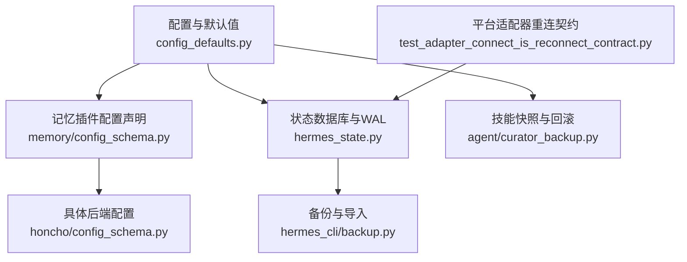
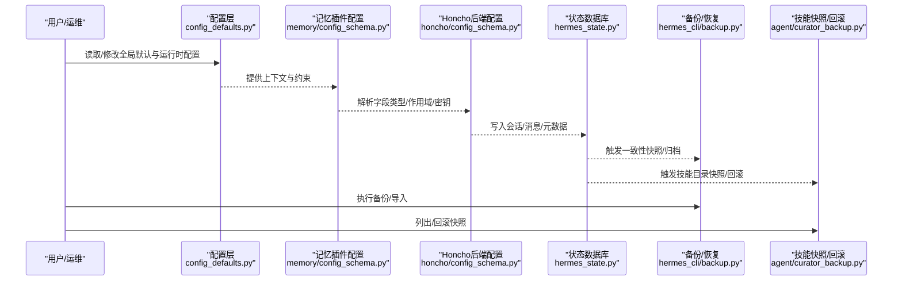
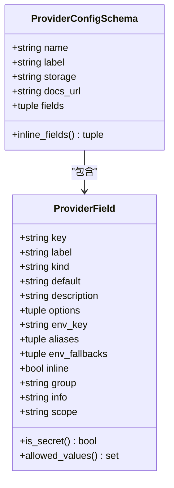
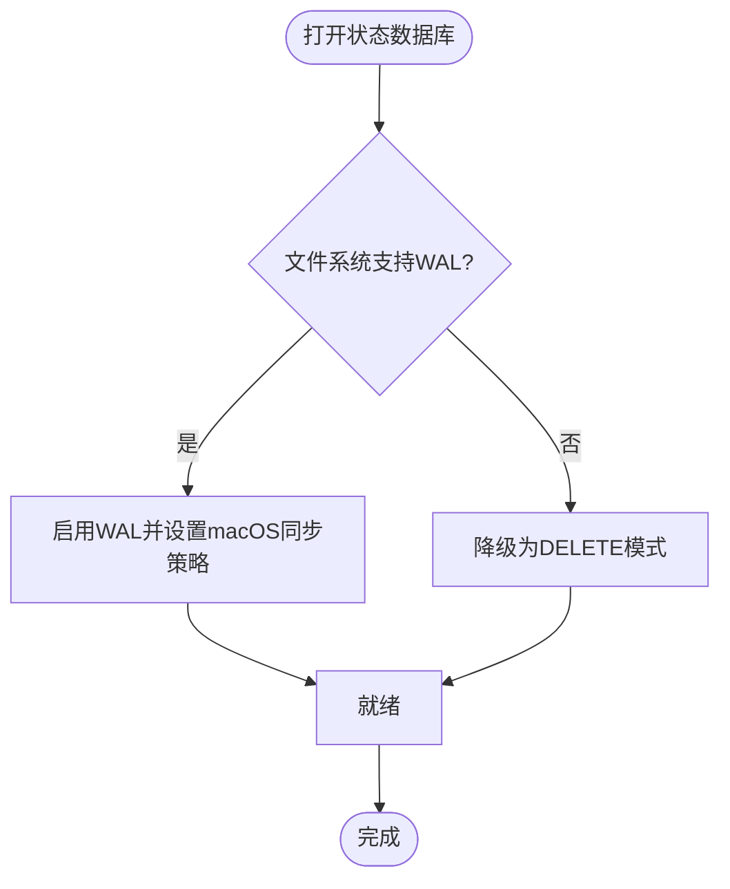
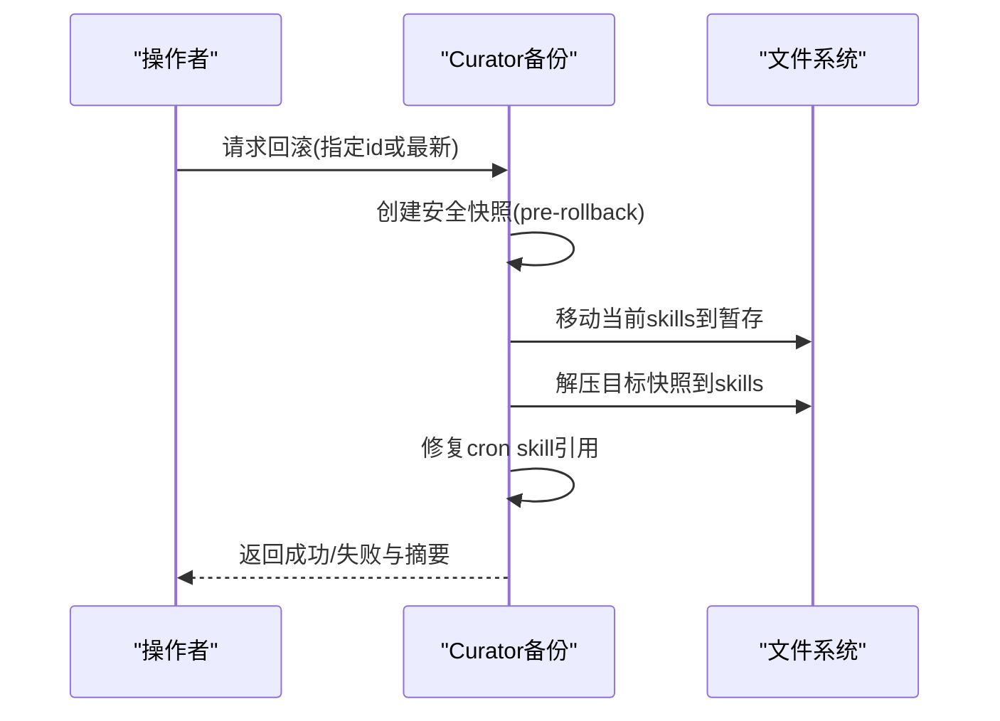
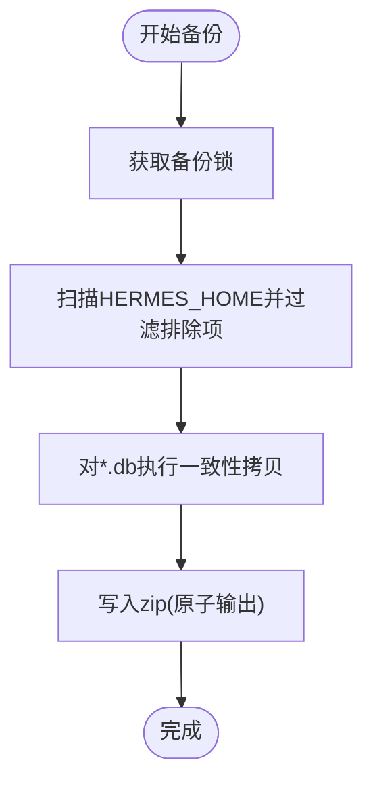
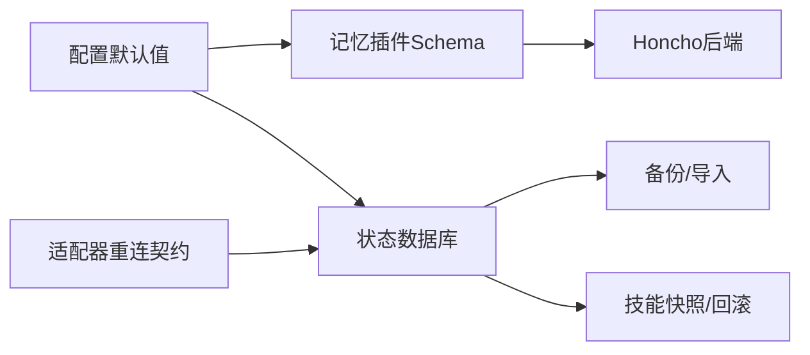
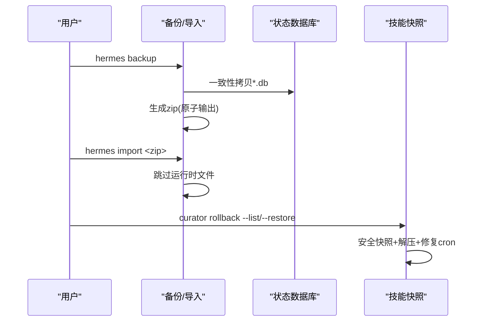

# 配置管理与故障恢复

<cite>
**本文引用的文件**
- [hermes_cli/config_defaults.py](file://hermes_cli/config_defaults.py)
- [plugins/memory/config_schema.py](file://plugins/memory/config_schema.py)
- [plugins/memory/honcho/config_schema.py](file://plugins/memory/honcho/config_schema.py)
- [hermes_state.py](file://hermes_state.py)
- [agent/curator_backup.py](file://agent/curator_backup.py)
- [hermes_cli/backup.py](file://hermes_cli/backup.py)
- [tests/gateway/test_adapter_connect_is_reconnect_contract.py](file://tests/gateway/test_adapter_connect_is_reconnect_contract.py)
</cite>

## 目录
1. [简介](#简介)
2. [项目结构](#项目结构)
3. [核心组件](#核心组件)
4. [架构总览](#架构总览)
5. [详细组件分析](#详细组件分析)
6. [依赖关系分析](#依赖关系分析)
7. [性能与调优](#性能与调优)
8. [故障检测、重试与降级](#故障检测重试与降级)
9. [备份与恢复流程](#备份与恢复流程)
10. [安全与最佳实践](#安全与最佳实践)
11. [监控与告警建议](#监控与告警建议)
12. [常见问题排查](#常见问题排查)
13. [结论](#结论)

## 简介
本文件聚焦记忆存储系统的配置管理与故障恢复，覆盖：
- 配置选项与默认值、验证机制与动态更新
- 多种存储后端的连接参数、认证信息、性能与安全设置
- 故障检测算法、自动重试策略与降级方案
- 数据备份与恢复（增量/全量/灾难恢复）
- 配置最佳实践、安全指南与排障方法
- 实际配置示例、演练脚本与监控告警建议

## 项目结构
围绕“配置—存储—备份—恢复”的主线，关键模块分布如下：
- 配置与默认值：hermes_cli/config_defaults.py
- 记忆插件配置声明：plugins/memory/config_schema.py、plugins/memory/honcho/config_schema.py
- 状态持久化与 WAL 兼容：hermes_state.py
- 技能快照与回滚：agent/curator_backup.py
- 全量备份与导入：hermes_cli/backup.py
- 平台适配器重连契约测试：tests/gateway/test_adapter_connect_is_reconnect_contract.py

**图表来源**
- [hermes_cli/config_defaults.py:1-800](file://hermes_cli/config_defaults.py#L1-L800)
- [plugins/memory/config_schema.py:1-145](file://plugins/memory/config_schema.py#L1-L145)
- [plugins/memory/honcho/config_schema.py:1-325](file://plugins/memory/honcho/config_schema.py#L1-L325)
- [hermes_state.py:1-800](file://hermes_state.py#L1-L800)
- [hermes_cli/backup.py:1-800](file://hermes_cli/backup.py#L1-L800)
- [agent/curator_backup.py:1-752](file://agent/curator_backup.py#L1-L752)
- [tests/gateway/test_adapter_connect_is_reconnect_contract.py:1-145](file://tests/gateway/test_adapter_connect_is_reconnect_contract.py#L1-L145)

**章节来源**
- [hermes_cli/config_defaults.py:1-800](file://hermes_cli/config_defaults.py#L1-L800)
- [plugins/memory/config_schema.py:1-145](file://plugins/memory/config_schema.py#L1-L145)
- [plugins/memory/honcho/config_schema.py:1-325](file://plugins/memory/honcho/config_schema.py#L1-L325)
- [hermes_state.py:1-800](file://hermes_state.py#L1-L800)
- [hermes_cli/backup.py:1-800](file://hermes_cli/backup.py#L1-L800)
- [agent/curator_backup.py:1-752](file://agent/curator_backup.py#L1-L752)
- [tests/gateway/test_adapter_connect_is_reconnect_contract.py:1-145](file://tests/gateway/test_adapter_connect_is_reconnect_contract.py#L1-L145)

## 核心组件
- 配置与默认值：集中定义系统级默认项（数据库模式、会话上限、压缩阈值、工具输出限制等），为各子系统提供基线。
- 记忆插件配置声明：以声明式 schema 描述字段类型、是否密钥、可选值与作用域；由通用渲染器驱动 UI 与 API 读写。
- 状态数据库：基于 SQLite 的会话存储，启用 WAL 并处理网络文件系统兼容性与 macOS 同步保障。
- 备份与恢复：全量 zip 备份（含外部路径）、SQLite 一致性拷贝、完整性校验；技能目录快照与可逆回滚。
- 平台适配器重连契约：通过静态 AST 检查确保所有 connect() 支持 is_reconnect 关键字，避免网关重连失败。

**章节来源**
- [hermes_cli/config_defaults.py:1-800](file://hermes_cli/config_defaults.py#L1-L800)
- [plugins/memory/config_schema.py:1-145](file://plugins/memory/config_schema.py#L1-L145)
- [hermes_state.py:1-800](file://hermes_state.py#L1-L800)
- [hermes_cli/backup.py:1-800](file://hermes_cli/backup.py#L1-L800)
- [agent/curator_backup.py:1-752](file://agent/curator_backup.py#L1-L752)
- [tests/gateway/test_adapter_connect_is_reconnect_contract.py:1-145](file://tests/gateway/test_adapter_connect_is_reconnect_contract.py#L1-L145)

## 架构总览
配置到存储再到备份恢复的整体链路如下：

**图表来源**
- [hermes_cli/config_defaults.py:1-800](file://hermes_cli/config_defaults.py#L1-L800)
- [plugins/memory/config_schema.py:1-145](file://plugins/memory/config_schema.py#L1-L145)
- [plugins/memory/honcho/config_schema.py:1-325](file://plugins/memory/honcho/config_schema.py#L1-L325)
- [hermes_state.py:1-800](file://hermes_state.py#L1-L800)
- [hermes_cli/backup.py:1-800](file://hermes_cli/backup.py#L1-L800)
- [agent/curator_backup.py:1-752](file://agent/curator_backup.py#L1-L752)

## 详细组件分析

### 配置系统与默认值
- 全局默认项涵盖数据库 journal_mode、并发会话上限、代理超时、压缩阈值、工具输出限制、MCP 发现超时等。
- 这些默认值作为基线，被 CLI、网关、TUI 等子系统消费，保证一致行为。

**章节来源**
- [hermes_cli/config_defaults.py:1-800](file://hermes_cli/config_defaults.py#L1-L800)

### 记忆插件配置声明与渲染
- 使用 ProviderConfigSchema 声明字段类型（文本、选择、密钥、布尔、数字、JSON）、默认值、环境变量回退、作用域（host/root）。
- 非密钥字段持久化至提供者配置存储；密钥字段仅存于环境存储，API 不返回明文。
- 通用渲染器根据 storage 分发到 flat_json 或 honcho_host_block 等后端。

**图表来源**
- [plugins/memory/config_schema.py:1-145](file://plugins/memory/config_schema.py#L1-L145)

**章节来源**
- [plugins/memory/config_schema.py:1-145](file://plugins/memory/config_schema.py#L1-L145)

### Honcho 后端配置
- 连接：apiKey（密钥）、baseUrl（自托管）、environment（production/local）、workspace。
- 身份：peerName、aiPeer、pinUserPeer、runtimePeerPrefix、userPeerAliases。
- 会话：sessionStrategy（per-session/per-directory/per-repo/global）、sessionPeerPrefix、sessions 覆盖。
- 消息写入：saveMessages、writeFrequency（async/turn/session/N）。
- 推理与召回：dialectic*、reasoningHeuristic、reasoningLevelCap、recallMode、contextTokens、initOnSessionStart。
- 限制与观测：messageMaxChars、observationMode。

**章节来源**
- [plugins/memory/honcho/config_schema.py:1-325](file://plugins/memory/honcho/config_schema.py#L1-L325)

### 状态数据库与 WAL 兼容性
- 默认 WAL 模式提升并发读能力；对 NFS/SMB/FUSE/ZFS 等文件系统自动降级为 DELETE 模式以避免锁协议错误。
- macOS 上强制 synchronous=FULL 并在 checkpoint 时启用 fullfsync，降低关机/重启时的损坏风险。
- 针对 SQLite WAL-reset 漏洞版本拒绝启用 WAL（新库/非 WAL 库），避免多进程 WAL 损坏。
- 提供“最后初始化错误”记录与格式化提示，便于 /resume 等命令向用户解释不可用原因。

**图表来源**
- [hermes_state.py:486-539](file://hermes_state.py#L486-L539)
- [hermes_state.py:718-780](file://hermes_state.py#L718-L780)
- [hermes_state.py:783-795](file://hermes_state.py#L783-L795)

**章节来源**
- [hermes_state.py:1-800](file://hermes_state.py#L1-L800)

### 技能目录快照与回滚
- 在变更操作前对 skills/ 创建 tar.gz 快照，附带 manifest.json 与 cron/jobs.json 副本。
- 回滚流程：先做安全快照，再将当前 skills 移入暂存目录，解压目标快照；失败时尽力恢复原状。
- 回滚后修复 cron 中的 skill 引用，保持调度任务一致性。

**图表来源**
- [agent/curator_backup.py:217-291](file://agent/curator_backup.py#L217-L291)
- [agent/curator_backup.py:572-730](file://agent/curator_backup.py#L572-L730)

**章节来源**
- [agent/curator_backup.py:1-752](file://agent/curator_backup.py#L1-L752)

### 全量备份与导入
- 排除缓存、虚拟环境、git/node_modules 等再生成目录，避免备份膨胀。
- SQLite 文件通过 sqlite3.backup() 进行一致性快照，避免 WAL/shm/journal 不一致。
- 大库跳过完整 integrity_check，采用 header+schema 探测；必要时仍执行 PRAGMA integrity_check。
- 导入时跳过易造成跨主机不一致的运行时文件（gateway_state.json、pid、lock 等）。

**图表来源**
- [hermes_cli/backup.py:150-219](file://hermes_cli/backup.py#L150-L219)
- [hermes_cli/backup.py:342-374](file://hermes_cli/backup.py#L342-L374)
- [hermes_cli/backup.py:416-552](file://hermes_cli/backup.py#L416-L552)
- [hermes_cli/backup.py:581-795](file://hermes_cli/backup.py#L581-L795)

**章节来源**
- [hermes_cli/backup.py:1-800](file://hermes_cli/backup.py#L1-L800)

### 平台适配器重连契约
- 通过 AST 静态检查所有 *Adapter.connect() 必须接受 is_reconnect 关键字，否则网关重连会静默失败。
- 该契约保障多平台通道在断线后的自动恢复能力。

**章节来源**
- [tests/gateway/test_adapter_connect_is_reconnect_contract.py:1-145](file://tests/gateway/test_adapter_connect_is_reconnect_contract.py#L1-L145)

## 依赖关系分析
- 配置层为记忆插件与状态库提供默认值与运行边界。
- 记忆插件通过声明式 schema 解耦 UI/API 与具体后端实现。
- 状态库依赖底层文件系统特性与 SQLite 版本，具备 WAL 兼容与 macOS 加固。
- 备份/恢复与技能快照相互独立但共同服务于数据保护目标。
- 平台适配器契约测试确保网关重连链路的健壮性。

**图表来源**
- [hermes_cli/config_defaults.py:1-800](file://hermes_cli/config_defaults.py#L1-L800)
- [plugins/memory/config_schema.py:1-145](file://plugins/memory/config_schema.py#L1-L145)
- [plugins/memory/honcho/config_schema.py:1-325](file://plugins/memory/honcho/config_schema.py#L1-L325)
- [hermes_state.py:1-800](file://hermes_state.py#L1-L800)
- [hermes_cli/backup.py:1-800](file://hermes_cli/backup.py#L1-L800)
- [agent/curator_backup.py:1-752](file://agent/curator_backup.py#L1-L752)
- [tests/gateway/test_adapter_connect_is_reconnect_contract.py:1-145](file://tests/gateway/test_adapter_connect_is_reconnect_contract.py#L1-L145)

## 性能与调优
- 数据库：
  - 优先 WAL 以提升并发读；在网络文件系统或 ZFS 下自动降级为 DELETE。
  - macOS 开启 FULL fsync 与 checkpoint_fullfsync，降低关机/重启损坏风险。
  - 对超大库跳过完整 integrity_check，改用 header+schema 探测，减少长时间 CPU 占用。
- 会话与压缩：
  - 合理设置压缩阈值与目标比例，避免频繁重写历史导致 prompt cache 失效。
  - 控制最大转数与超时，防止长会话拖垮资源。
- 工具输出：
  - 限制终端输出与 read_file 分页大小，避免上下文爆炸。
- 外部依赖：
  - MCP 发现超时与单查询超时平衡首响延迟与可靠性。

**章节来源**
- [hermes_state.py:486-539](file://hermes_state.py#L486-L539)
- [hermes_state.py:718-780](file://hermes_state.py#L718-L780)
- [hermes_cli/config_defaults.py:1-800](file://hermes_cli/config_defaults.py#L1-L800)

## 故障检测、重试与降级
- 故障检测：
  - 状态库初始化失败记录最后错误，并提供人类可读提示（如 NFS/SMB/WAL 问题）。
  - 备份阶段对 SQLite 进行一致性拷贝与完整性校验，失败即中止并清理中间产物。
- 重试策略：
  - 适配器重连契约确保 connect() 支持 is_reconnect，网关可在每次重试中传递该标志，避免静默断开。
  - 技能回滚在失败时尽力恢复原状，保留暂存目录以便人工干预。
- 降级方案：
  - 网络文件系统不支持 WAL 时自动降级为 DELETE，功能可用但并发写受限。
  - 大库完整性检查降级为 header+schema 探测，避免长时间阻塞。

**章节来源**
- [hermes_state.py:520-565](file://hermes_state.py#L520-L565)
- [hermes_cli/backup.py:416-552](file://hermes_cli/backup.py#L416-L552)
- [tests/gateway/test_adapter_connect_is_reconnect_contract.py:1-145](file://tests/gateway/test_adapter_connect_is_reconnect_contract.py#L1-L145)
- [agent/curator_backup.py:572-730](file://agent/curator_backup.py#L572-L730)

## 备份与恢复流程
- 全量备份：
  - 锁定备份槽，扫描 HERMES_HOME，排除缓存/依赖/临时文件。
  - 对 *.db 使用 sqlite3.backup() 一致性拷贝，写入 zip 并原子发布。
  - 收集外部路径（如 ~/.honcho）按 _external/ 前缀归档。
- 导入恢复：
  - 跳过 gateway_state.json、pid、lock 等运行时文件，避免跨主机不一致。
  - 对 .env、auth.json、state.db 等敏感文件收紧权限。
- 增量/快照：
  - 技能目录变更前的 tar.gz 快照，附带 manifest.json 与 cron/jobs.json 副本。
  - 回滚时先做安全快照，再替换 skills 并修复 cron 引用。

**图表来源**
- [hermes_cli/backup.py:581-795](file://hermes_cli/backup.py#L581-L795)
- [hermes_cli/backup.py:342-374](file://hermes_cli/backup.py#L342-L374)
- [agent/curator_backup.py:217-291](file://agent/curator_backup.py#L217-L291)
- [agent/curator_backup.py:572-730](file://agent/curator_backup.py#L572-L730)

**章节来源**
- [hermes_cli/backup.py:1-800](file://hermes_cli/backup.py#L1-L800)
- [agent/curator_backup.py:1-752](file://agent/curator_backup.py#L1-L752)

## 安全与最佳实践
- 密钥管理：
  - 记忆插件密钥字段（如 apiKey）仅存入环境存储，不在 API 响应中暴露。
  - 备份/导入时对敏感文件（.env、auth.json、state.db）收紧权限。
- 访问控制：
  - 备份锁避免并发冲突；导入时跳过跨主机不安全的运行时文件。
- 配置最小化：
  - 仅暴露必要字段；使用 select 与默认值收敛可选范围。
- 审计与可追溯：
  - 快照 manifest.json 记录时间、原因、规模；cron 快照辅助定位变更。

**章节来源**
- [plugins/memory/config_schema.py:52-89](file://plugins/memory/config_schema.py#L52-L89)
- [plugins/memory/honcho/config_schema.py:27-77](file://plugins/memory/honcho/config_schema.py#L27-L77)
- [hermes_cli/backup.py:98-133](file://hermes_cli/backup.py#L98-L133)
- [agent/curator_backup.py:192-214](file://agent/curator_backup.py#L192-L214)

## 监控与告警建议
- 指标采集：
  - 备份阶段耗时、文件数、错误数；状态库初始化失败次数与原因。
  - 技能快照数量、回滚成功率、cron 链接修复结果。
- 告警规则：
  - 状态库初始化失败（WAL 不兼容/权限/磁盘空间）。
  - 备份失败或完整性校验失败。
  - 技能回滚失败或 cron 链接修复异常。
- 日志规范：
  - 统一结构化日志，包含阶段、状态、耗时、影响面。

[本节为通用建议，不直接分析具体文件]

## 常见问题排查
- 状态库不可用：
  - 查看最后初始化错误，常见于 NFS/SMB/FUSE/ZFS 的 WAL 锁协议问题；必要时切换到 DELETE 模式。
- 备份卡住或过大：
  - 确认已排除缓存/依赖目录；检查是否存在未预期的软链接或超大文件。
- 导入后网关状态异常：
  - 确认跳过了 gateway_state.json、pid、lock 等运行时文件；重新触发容器启动协调。
- 技能回滚不完整：
  - 检查暂存目录是否存在残留；根据 manifest.json 与 cron-jobs.json 定位差异。

**章节来源**
- [hermes_state.py:520-565](file://hermes_state.py#L520-L565)
- [hermes_cli/backup.py:55-97](file://hermes_cli/backup.py#L55-L97)
- [hermes_cli/backup.py:98-133](file://hermes_cli/backup.py#L98-L133)
- [agent/curator_backup.py:294-334](file://agent/curator_backup.py#L294-L334)
- [agent/curator_backup.py:402-541](file://agent/curator_backup.py#L402-L541)

## 结论
本系统通过声明式配置、健壮的 WAL 兼容、一致的备份与可逆的技能快照，构建了高可用的记忆存储与恢复体系。结合适配器重连契约与完善的故障检测/降级策略，能够在复杂环境下保持稳定运行。建议在生产中遵循最小化配置、严格密钥管理、定期备份与演练回滚，并建立监控告警闭环，确保业务连续性。