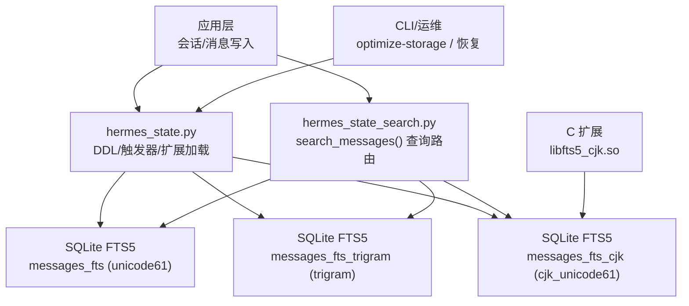
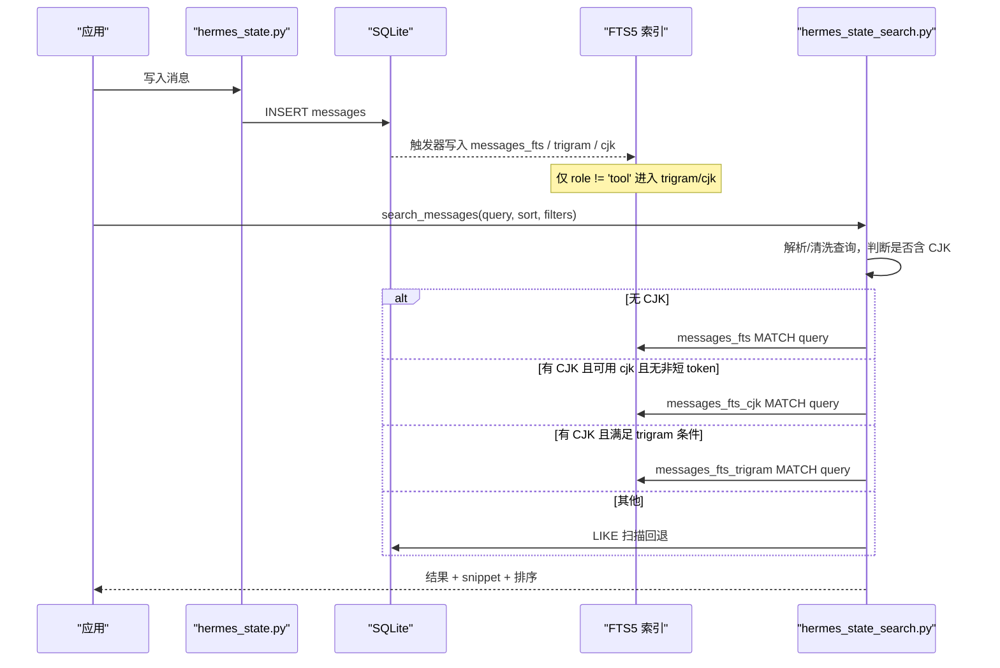
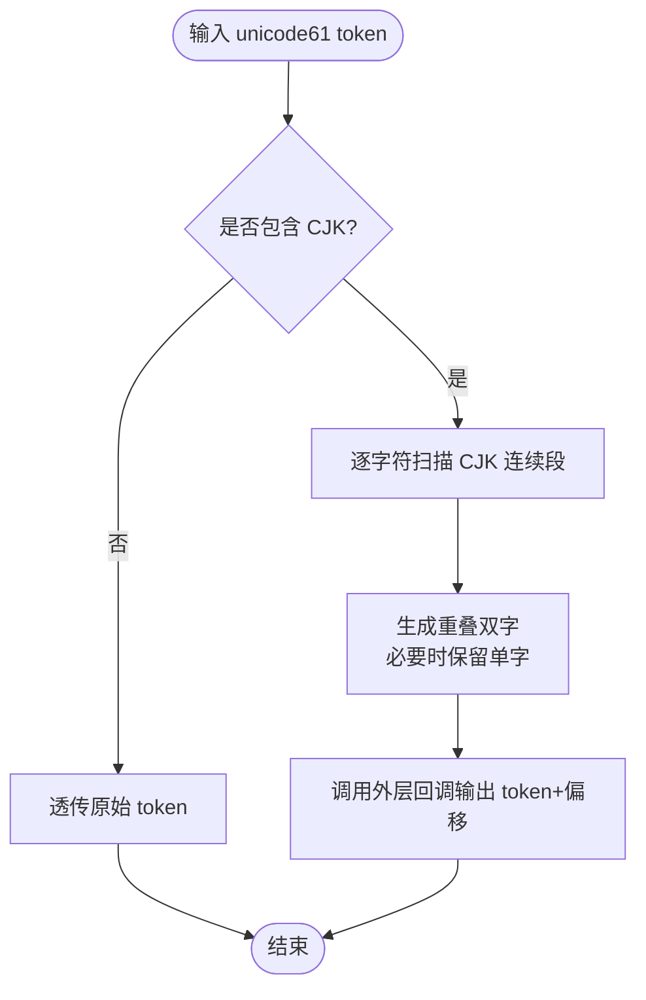
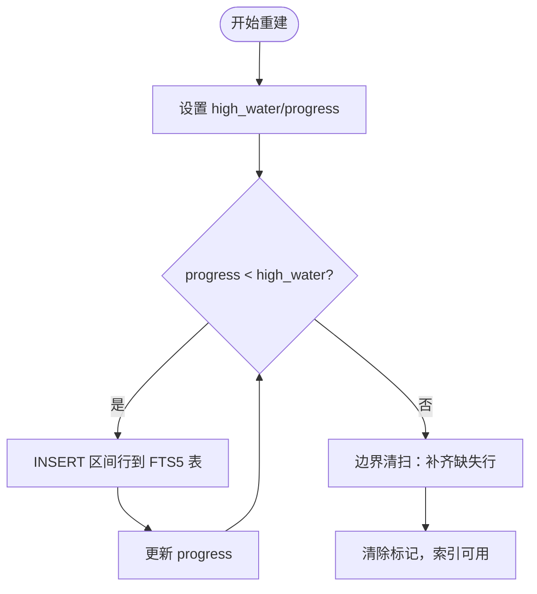
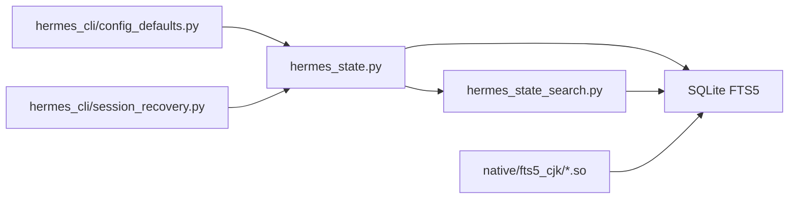

# 全文搜索

<cite>
**本文引用的文件**
- [fts5_cjk.c](file://native/fts5_cjk/fts5_cjk.c)
- [README.md](file://native/fts5_cjk/README.md)
- [build.sh](file://native/fts5_cjk/build.sh)
- [hermes_state_search.py](file://hermes_state_search.py)
- [hermes_state.py](file://hermes_state.py)
- [config_defaults.py](file://hermes_cli/config_defaults.py)
- [session_recovery.py](file://hermes_cli/session_recovery.py)
- [test_fts_cjk_bigram.py](file://tests/test_fts_cjk_bigram.py)
</cite>

## 目录
1. [简介](#简介)
2. [项目结构](#项目结构)
3. [核心组件](#核心组件)
4. [架构总览](#架构总览)
5. [详细组件分析](#详细组件分析)
6. [依赖关系分析](#依赖关系分析)
7. [性能考量](#性能考量)
8. [故障诊断指南](#故障诊断指南)
9. [结论](#结论)
10. [附录](#附录)

## 简介
本文件面向 HerMES 的全文搜索子系统，重点说明基于 SQLite FTS5 的中文分词优化实现。系统通过一个可加载的 CJK 大二元（bigram）分词器扩展，将默认的 unicode61 分词行为增强为“CJK 连续字符段按重叠双字切分”，从而让短词（如 2 个韩文字或中文字）也能走索引匹配而非全表 LIKE 扫描。同时，系统维护了多路搜索路径：主 FTS5、三字母（trigram）FTS5、以及 CJK bigram FTS5，并在查询时智能路由；当 CJK 扩展不可用时自动回退到 trigram/LIKE，保证可用性。

## 项目结构
与全文搜索相关的代码主要分布在以下位置：
- 原生扩展：native/fts5_cjk/ 提供 cjk_unicode61 分词器的 C 源码与构建脚本
- 状态与搜索：hermes_state.py 与 hermes_state_search.py 负责索引 DDL、触发器、重建流程与查询路由
- 配置与恢复：hermes_cli/config_defaults.py 与 session_recovery.py 暴露开关与恢复逻辑
- 测试：tests/test_fts_cjk_bigram.py 覆盖安装、重建、查询路由等关键场景

图表来源
- [hermes_state.py:1865-1956](file://hermes_state.py#L1865-L1956)
- [hermes_state_search.py:1383-1600](file://hermes_state_search.py#L1383-L1600)
- [fts5_cjk.c:1-253](file://native/fts5_cjk/fts5_cjk.c#L1-L253)

章节来源
- [hermes_state.py:1865-1956](file://hermes_state.py#L1865-L1956)
- [hermes_state_search.py:1383-1600](file://hermes_state_search.py#L1383-L1600)
- [fts5_cjk.c:1-253](file://native/fts5_cjk/fts5_cjk.c#L1-L253)

## 核心组件
- CJK 分词器扩展（cjk_unicode61）
  - 在 unicode61 基础上对 CJK 连续字符段进行重叠双字切分，单字符保留一元；非 CJK 段落透传
  - 以 SQLite 可加载扩展形式提供，默认安装至 ~/.hermes/lib/libfts5_cjk.so
- FTS5 索引与触发器
  - messages_fts：基础 FTS5 索引（unicode61），用于英文/拉丁语等
  - messages_fts_trigram：三字母索引，用于 ≥3 字符的 CJK 子串匹配
  - messages_fts_cjk：CJK bigram 索引，用于短词精确匹配（≥2 字符）
- 查询路由与降级
  - 根据查询是否包含 CJK、token 长度、可用索引选择 fts5 / trigram / fts_cjk / like_scan
- 增量与批量重建
  - 使用高水位标记（high_water/progress）分块回填，支持中断续跑与边界清扫
- 配置与开关
  - 通过环境变量 HERMES_CJK_FTS 控制启用/禁用；HERMES_FTS5_CJK_SO 指定扩展路径

章节来源
- [fts5_cjk.c:1-253](file://native/fts5_cjk/fts5_cjk.c#L1-L253)
- [hermes_state.py:1865-1956](file://hermes_state.py#L1865-L1956)
- [hermes_state_search.py:1383-1600](file://hermes_state_search.py#L1383-L1600)
- [config_defaults.py:2771-2780](file://hermes_cli/config_defaults.py#L2771-L2780)

## 架构总览
下图展示了写入与查询两条主线：写入侧通过触发器将新消息同步到各 FTS5 虚拟表；查询侧根据查询特征选择最优索引并返回结果。

图表来源
- [hermes_state.py:1900-1956](file://hermes_state.py#L1900-L1956)
- [hermes_state_search.py:1383-1600](file://hermes_state_search.py#L1383-L1600)

## 详细组件分析

### CJK 分词器（cjk_unicode61）算法与规则
- 设计目标
  - 解决 sqlite 默认 unicode61 将 CJK 连续字符视为单一 token 的问题，避免短词无法命中索引而退化为 LIKE 全表扫描
  - 采用 Lucene CJKAnalyzer 语义：对 CJK 连续段输出重叠双字；孤立单字符输出单字；非 CJK 片段原样透传
- 算法要点
  - UTF-8 解码与码点分类：识别 CJK 范围（中日韩统一表意文字、假名、谚文等）
  - 扫描每个 unicode61 输出的 token：若不含 CJK 直接透传；否则提取 CJK 连续段，滑动窗口生成重叠双字
  - 偏移映射：保持原始文本偏移，确保高亮定位准确
- 构建与加载
  - 编译为共享库 libfts5_cjk.so，安装至 ~/.hermes/lib/
  - Python 端按需 enable_load_extension 并 load_extension，失败则降级为无 CJK 索引模式

图表来源
- [fts5_cjk.c:32-165](file://native/fts5_cjk/fts5_cjk.c#L32-L165)

章节来源
- [fts5_cjk.c:1-253](file://native/fts5_cjk/fts5_cjk.c#L1-L253)
- [build.sh:1-20](file://native/fts5_cjk/build.sh#L1-L20)
- [README.md:1-25](file://native/fts5_cjk/README.md#L1-L25)

### FTS5 索引构建与触发器
- 存储模型
  - 外部内容（external-content）：FTS5 虚拟表通过 content/content_rowid 指向视图与主键，不复制正文
  - 工具行排除：trigram 与 cjk 索引仅索引 role != 'tool' 的消息
- 触发器策略
  - 插入/删除/更新均通过触发器维护索引一致性
  - 重建期间通过 high_water/progress 标记限制触发器生效范围，避免不一致
- 重建流程
  - 分块回填：每次处理固定 id 区间，原子更新进度
  - 边界清扫：完成回填后对边界附近缺失行补录
  - 清理标记：完成后清除重建元数据

图表来源
- [hermes_state_search.py:264-420](file://hermes_state_search.py#L264-L420)
- [hermes_state.py:1900-1956](file://hermes_state.py#L1900-L1956)

章节来源
- [hermes_state_search.py:264-420](file://hermes_state_search.py#L264-L420)
- [hermes_state.py:1900-1956](file://hermes_state.py#L1900-L1956)

### 查询语法、路由与排序
- 支持的 FTS5 语法
  - 关键词、短语（引号包裹）、布尔运算（AND/OR/NOT）、前缀匹配（*）
- 路由决策
  - 无 CJK：走 messages_fts（unicode61）
  - 有 CJK 且 cjk 索引可用且无非短 token：走 messages_fts_cjk
  - 有 CJK 且满足 trigram 条件（每 token ≥3 CJK 字符）：走 messages_fts_trigram
  - 否则：LIKE 扫描（回退）
- 排序机制
  - 默认排序：按 FTS5 rank（BM25 相关性）
  - 可选时间排序：newest/oldest 先按时间再按 rank 并列
- 结果字段
  - 包含 id、session_id、role、snippet、timestamp、tool_name、source、model、session_started 等

```mermaid
flowchart TD
Q["接收查询"] --> Clean["清洗/规范化查询"]
Clean --> CheckCJK{"是否含 CJK?"}
CheckCJK -- 否 --> PathA["messages_fts (unicode61)"]
CheckCJK -- 是 --> Route{"cjk 可用? 且无非短 token?"}
Route -- 是 --> PathB["messages_fts_cjk (bigram)"]
Route -- 否 --> Tri{"trigram 可用? 且每 token ≥3 CJK?"}
Tri -- 是 --> PathC["messages_fts_trigram"]
Tri -- 否 --> PathD["LIKE 扫描回退"]
PathA --> Sort["按 rank 或时间排序"]
PathB --> Sort
PathC --> Sort
PathD --> Sort
Sort --> Out["返回结果"]
```

图表来源
- [hermes_state_search.py:1383-1600](file://hermes_state_search.py#L1383-L1600)

章节来源
- [hermes_state_search.py:1383-1600](file://hermes_state_search.py#L1383-L1600)

### 中文文本特殊处理策略
- 词语边界识别
  - 通过 CJK 连续段检测与重叠双字切分，使短词也能命中索引
- 同义词与语义扩展
  - 当前实现未内置同义词或语义扩展；如需扩展可在上层预处理（如别名映射）或在查询阶段组合多个关键词
- 工具行过滤
  - trigram 与 cjk 索引不包含 tool 角色消息，避免噪音干扰搜索结果

章节来源
- [hermes_state.py:1900-1956](file://hermes_state.py#L1900-L1956)
- [hermes_state_search.py:1383-1600](file://hermes_state_search.py#L1383-L1600)

## 依赖关系分析
- 模块耦合
  - hermes_state.py 定义 CJK 索引 DDL、触发器与扩展加载；hermes_state_search.py 实现查询路由与重建流程
  - CLI 配置与恢复逻辑引用上述模块，提供 optimize-storage 与恢复能力
- 外部依赖
  - SQLite FTS5 扩展接口；cjk_unicode61 扩展需编译为 .so 并加载
- 潜在循环与隔离
  - 搜索模块不反向导入 hermes_state，避免循环依赖；通过常量与 SQL 字符串解耦

图表来源
- [hermes_state.py:1865-1956](file://hermes_state.py#L1865-L1956)
- [hermes_state_search.py:1383-1600](file://hermes_state_search.py#L1383-L1600)
- [config_defaults.py:2771-2780](file://hermes_cli/config_defaults.py#L2771-L2780)
- [session_recovery.py:55-57](file://hermes_cli/session_recovery.py#L55-L57)

章节来源
- [hermes_state.py:1865-1956](file://hermes_state.py#L1865-L1956)
- [hermes_state_search.py:1383-1600](file://hermes_state_search.py#L1383-L1600)
- [config_defaults.py:2771-2780](file://hermes_cli/config_defaults.py#L2771-L2780)
- [session_recovery.py:55-57](file://hermes_cli/session_recovery.py#L55-L57)

## 性能考量
- 索引选择
  - 优先使用 messages_fts_cjk 以支持短词精确匹配；其次 trigram；最后 fallback 到 LIKE
- 查询耗时监控
  - 慢查询日志：超过阈值（默认 1000ms）记录 path、elapsed、rows、query 摘要
- 重建与回填
  - 分块回填避免长时间锁；边界清扫保证一致性
- 体积与开销
  - external-content 不复制正文；tool 行被排除以减少索引体积
- 建议
  - 合理设置 limit/offset；避免过宽查询导致大量匹配；结合 source/role 过滤缩小范围

章节来源
- [hermes_state_search.py:1383-1600](file://hermes_state_search.py#L1383-L1600)
- [hermes_state_search.py:264-420](file://hermes_state_search.py#L264-L420)

## 故障诊断指南
- 常见症状
  - 短词搜索无结果或很慢：检查是否走了 LIKE 扫描；确认 cjk 扩展已加载
  - 重建卡住或未完成：检查 state_meta 中的 high_water/progress 标记
  - 扩展加载失败：确认 .so 存在且路径正确；检查是否禁用了扩展加载
- 排查步骤
  - 查看 _describe_search_path 输出，确认路由路径
  - 运行 optimize-fts-storage 或手动执行重建步骤
  - 检查 session_recovery 相关键值（fts_cjk_stale、fts_cjk_rebuild_high_water、fts_cjk_rebuild_progress）
- 恢复手段
  - 重置陈旧 cjk 索引：删除触发器与表，重新创建并回填
  - 清理遗留 trash 表：分块删除并 DROP

章节来源
- [hermes_state_search.py:264-420](file://hermes_state_search.py#L264-L420)
- [hermes_state.py:1973-1995](file://hermes_state.py#L1973-L1995)
- [session_recovery.py:55-57](file://hermes_cli/session_recovery.py#L55-L57)

## 结论
本方案通过 CJK bigram 分词器扩展显著提升了短词检索性能与召回率，同时保持了对英文/拉丁语的兼容。系统具备完善的索引构建、重建与降级机制，能够在扩展不可用时自动回退到 trigram/LIKE，保障服务稳定性。配合慢查询日志与分块回填，整体具备生产可用的性能与可观测性。

## 附录

### 搜索配置示例（路径参考）
- 启用/禁用 CJK 搜索
  - 环境变量：HERMES_CJK_FTS=1|0
  - 参考路径：[config_defaults.py:2771-2780](file://hermes_cli/config_defaults.py#L2771-L2780)
- 指定扩展路径
  - 环境变量：HERMES_FTS5_CJK_SO=/path/to/libfts5_cjk.so
  - 参考路径：[hermes_state.py:1958-1963](file://hermes_state.py#L1958-L1963)
- 构建与安装扩展
  - 构建脚本：native/fts5_cjk/build.sh
  - 参考路径：[build.sh:1-20](file://native/fts5_cjk/build.sh#L1-L20)

### 常见搜索场景与技巧
- 短语匹配：使用引号包裹短语，例如 “exact phrase”
- 布尔组合：使用 AND/OR/NOT 组合关键词
- 前缀匹配：使用 * 前缀进行前缀匹配
- 排序：sort=newest 或 oldest 以时间为主序，rank 为并列依据
- 过滤：通过 source_filter/exclude_sources/role_filter 缩小范围

章节来源
- [hermes_state_search.py:1383-1600](file://hermes_state_search.py#L1383-L1600)

### 自定义分词器与扩展开发指导
- 扩展入口
  - 注册名为 cjk_unicode61 的分词器，封装 unicode61 并注入 CJK 双字切分逻辑
  - 参考路径：[fts5_cjk.c:217-253](file://native/fts5_cjk/fts5_cjk.c#L217-L253)
- 集成方式
  - 编译为 .so 并放置到 ~/.hermes/lib/；Python 端按需加载
  - 参考路径：[hermes_state.py:1973-1995](file://hermes_state.py#L1973-L1995)
- 注意事项
  - 偏移映射需准确以保证高亮
  - 对非 CJK 片段透传，减少额外开销
  - 异常时降级为无 CJK 索引模式，不影响基本功能

章节来源
- [fts5_cjk.c:1-253](file://native/fts5_cjk/fts5_cjk.c#L1-L253)
- [hermes_state.py:1973-1995](file://hermes_state.py#L1973-L1995)

### 测试与验证
- 单元测试覆盖
  - 短词命中、混合语言查询、单字符回退 LIKE、配置开关、v23 数据库新增 CJK 索引、旧版 v22 优化落地、纯拉丁嵌入 CJK 文本恢复、索引计数校验、完整性检查
  - 参考路径：[test_fts_cjk_bigram.py:1-245](file://tests/test_fts_cjk_bigram.py#L1-L245)

章节来源
- [test_fts_cjk_bigram.py:1-245](file://tests/test_fts_cjk_bigram.py#L1-L245)