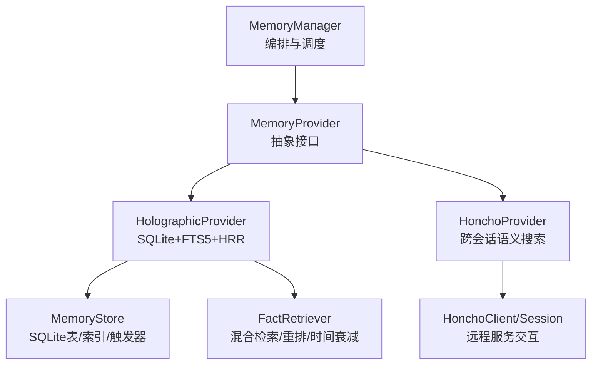
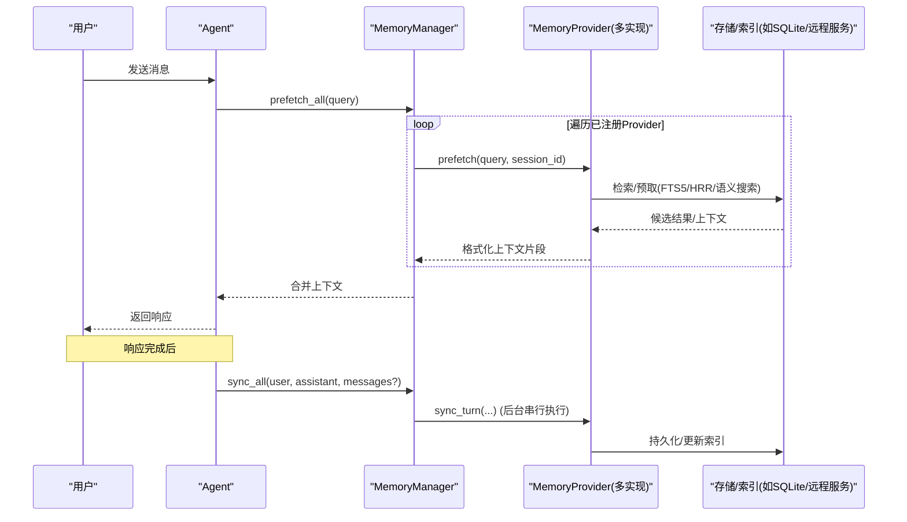
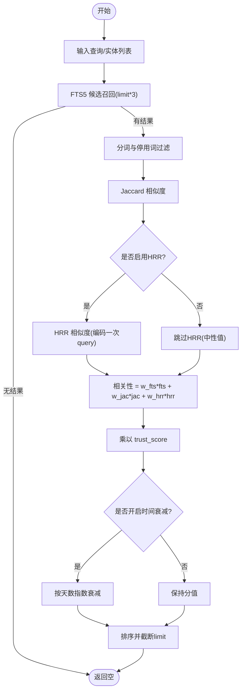
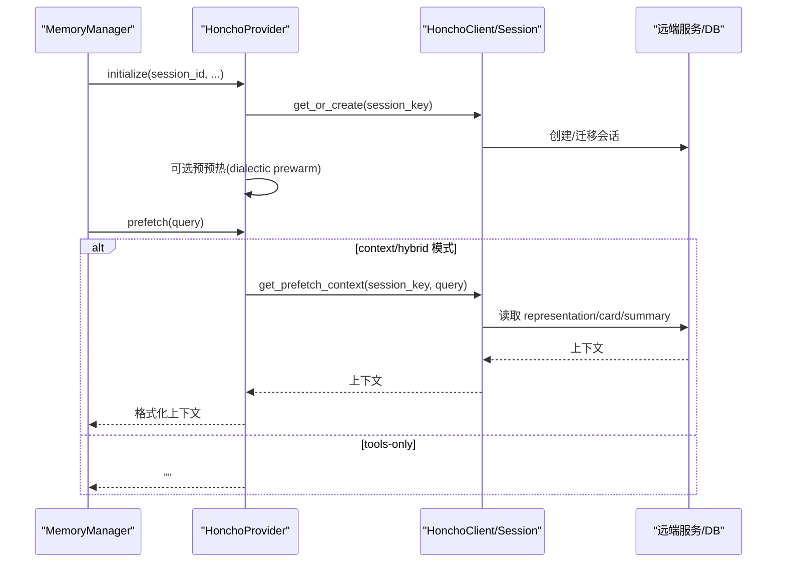
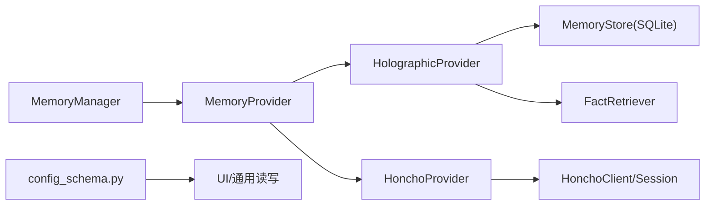

# 向量检索

<cite>
**本文引用的文件**
- [agent/memory_manager.py](file://agent/memory_manager.py)
- [agent/memory_provider.py](file://agent/memory_provider.py)
- [plugins/memory/holographic/__init__.py](file://plugins/memory/holographic/__init__.py)
- [plugins/memory/holographic/store.py](file://plugins/memory/holographic/store.py)
- [plugins/memory/holographic/retrieval.py](file://plugins/memory/holographic/retrieval.py)
- [plugins/memory/honcho/__init__.py](file://plugins/memory/honcho/__init__.py)
- [plugins/memory/config_schema.py](file://plugins/memory/config_schema.py)
</cite>

## 目录
1. [简介](#简介)
2. [项目结构](#项目结构)
3. [核心组件](#核心组件)
4. [架构总览](#架构总览)
5. [详细组件分析](#详细组件分析)
6. [依赖关系分析](#依赖关系分析)
7. [性能考量](#性能考量)
8. [故障排查指南](#故障排查指南)
9. [结论](#结论)
10. [附录](#附录)

## 简介
本文件面向开发者与运维人员，系统化说明 Hermes 记忆系统中的“向量检索”能力：包括向量嵌入的生成、相似度计算策略、阈值配置、索引构建与维护、不同记忆提供商的存储方案、查询性能优化与内存管理、配置参数与监控指标、客户端集成示例与错误处理策略，以及自定义模型与检索算法的扩展方法。

Hermes 的记忆系统通过 MemoryProvider 抽象统一接入多种后端（内置 SQLite/HRR、Honcho 等），MemoryManager 负责编排预取、同步与工具暴露；Holographic 插件提供基于 SQLite + FTS5 + HRR 的本地向量/结构化事实检索；Honcho 插件提供跨会话语义搜索与推理能力。

## 项目结构
围绕向量检索的关键代码组织如下：
- 抽象与编排层
  - agent/memory_provider.py：定义 MemoryProvider 接口与生命周期钩子
  - agent/memory_manager.py：注册 Provider、注入系统提示、预取/同步调度、工具暴露
- 插件实现层
  - plugins/memory/holographic/*：SQLite 事实库 + FTS5 全文检索 + HRR 向量代数检索
  - plugins/memory/honcho/*：AI 原生跨会话用户建模、语义搜索与推理
  - plugins/memory/config_schema.py：声明式配置元数据，驱动 UI 与通用读写逻辑

图表来源
- [agent/memory_manager.py:364-780](file://agent/memory_manager.py#L364-L780)
- [agent/memory_provider.py:81-190](file://agent/memory_provider.py#L81-L190)
- [plugins/memory/holographic/__init__.py:113-227](file://plugins/memory/holographic/__init__.py#L113-L227)
- [plugins/memory/holographic/store.py:98-183](file://plugins/memory/holographic/store.py#L98-L183)
- [plugins/memory/holographic/retrieval.py:22-122](file://plugins/memory/holographic/retrieval.py#L22-L122)
- [plugins/memory/honcho/__init__.py:237-410](file://plugins/memory/honcho/__init__.py#L237-L410)

章节来源
- [agent/memory_manager.py:1-120](file://agent/memory_manager.py#L1-L120)
- [agent/memory_provider.py:1-80](file://agent/memory_provider.py#L1-L80)
- [plugins/memory/holographic/__init__.py:1-120](file://plugins/memory/holographic/__init__.py#L1-L120)
- [plugins/memory/honcho/__init__.py:1-120](file://plugins/memory/honcho/__init__.py#L1-L120)
- [plugins/memory/config_schema.py:1-145](file://plugins/memory/config_schema.py#L1-L145)

## 核心组件
- MemoryProvider 抽象：定义 is_available、initialize、prefetch、sync_turn、get_tool_schemas、handle_tool_call、shutdown 等生命周期方法，以及可选钩子（on_session_end、on_pre_compress、on_memory_write 等）。
- MemoryManager：统一管理多个 Provider，限制仅一个外部 Provider，负责：
  - 注入系统提示块
  - 每轮对话前 prefetch_all（可并行/超时保护）
  - 每轮对话后 sync_all（后台序列化写入，避免阻塞主流程）
  - 将 Provider 的工具 schema 注入到 Agent 工具集
- HolographicProvider：基于 SQLite + FTS5 + HRR 的事实存储与检索，支持实体解析、信任评分、反馈调节、时间衰减、矛盾检测等。
- HonchoProvider：跨会话语义搜索、上下文快照、推理问答、结论持久化，支持 context/tools/hybrid 三种召回模式与延迟初始化。

章节来源
- [agent/memory_provider.py:81-190](file://agent/memory_provider.py#L81-L190)
- [agent/memory_manager.py:364-780](file://agent/memory_manager.py#L364-L780)
- [plugins/memory/holographic/__init__.py:113-227](file://plugins/memory/holographic/__init__.py#L113-L227)
- [plugins/memory/honcho/__init__.py:237-410](file://plugins/memory/honcho/__init__.py#L237-L410)

## 架构总览
下图展示从用户消息到记忆检索与注入的整体流程，以及写路径（turn 完成后的异步同步）。

图表来源
- [agent/memory_manager.py:525-695](file://agent/memory_manager.py#L525-L695)
- [plugins/memory/holographic/__init__.py:204-223](file://plugins/memory/holographic/__init__.py#L204-L223)
- [plugins/memory/honcho/__init__.py:699-800](file://plugins/memory/honcho/__init__.py#L699-L800)

## 详细组件分析

### Holographic 向量检索（SQLite + FTS5 + HRR）
- 数据存储
  - facts 表：内容、类别、标签、信任分数、检索次数、帮助计数、创建/更新时间、HRR 向量（BLOB）
  - entities/fact_entities：实体解析与关联
  - facts_fts：FTS5 虚拟表用于全文检索
  - memory_banks：按类别聚合的 HRR 向量银行，用于快速代数检索
- 索引与触发器
  - 对 trust_score、category、entities.name 建索引
  - 插入/删除/更新 facts 时自动维护 FTS5
- 向量生成
  - 新增或更新 fact 内容后，提取实体并计算 HRR 向量，存入 hrr_vector
  - 按类别重建 memory_banks（bundle 所有向量）
- 检索策略
  - 混合检索：FTS5 候选 → Jaccard 重排 → HRR 相似度 → 信任加权 → 可选时间衰减
  - probe/related/reason：利用 HRR 绑定/解绑进行结构性查询与多实体组合推理
  - contradict：实体重叠 + 内容低相似度的矛盾检测
- 阈值与权重
  - min_trust：最小信任阈值过滤
  - fts_weight/jaccard_weight/hrr_weight：三类信号权重（无 numpy 时自动降权 HRR）
  - temporal_decay_half_life：按天指数衰减

图表来源
- [plugins/memory/holographic/retrieval.py:48-122](file://plugins/memory/holographic/retrieval.py#L48-L122)
- [plugins/memory/holographic/store.py:188-231](file://plugins/memory/holographic/store.py#L188-L231)
- [plugins/memory/holographic/store.py:547-583](file://plugins/memory/holographic/store.py#L547-L583)

章节来源
- [plugins/memory/holographic/store.py:16-77](file://plugins/memory/holographic/store.py#L16-L77)
- [plugins/memory/holographic/store.py:98-183](file://plugins/memory/holographic/store.py#L98-L183)
- [plugins/memory/holographic/store.py:188-231](file://plugins/memory/holographic/store.py#L188-L231)
- [plugins/memory/holographic/store.py:233-289](file://plugins/memory/holographic/store.py#L233-L289)
- [plugins/memory/holographic/store.py:547-583](file://plugins/memory/holographic/store.py#L547-L583)
- [plugins/memory/holographic/retrieval.py:22-122](file://plugins/memory/holographic/retrieval.py#L22-L122)
- [plugins/memory/holographic/retrieval.py:124-203](file://plugins/memory/holographic/retrieval.py#L124-L203)
- [plugins/memory/holographic/retrieval.py:204-273](file://plugins/memory/holographic/retrieval.py#L204-L273)
- [plugins/memory/holographic/retrieval.py:274-350](file://plugins/memory/holographic/retrieval.py#L274-L350)
- [plugins/memory/holographic/retrieval.py:352-456](file://plugins/memory/holographic/retrieval.py#L352-L456)
- [plugins/memory/holographic/retrieval.py:495-633](file://plugins/memory/holographic/retrieval.py#L495-L633)

### Honcho 语义搜索与推理
- 召回模式
  - context：自动注入上下文（representation/card/summary）
  - tools：仅暴露工具（profile/search/context/reasoning/conclude），不自动注入
  - hybrid：同时注入上下文并提供工具
- 预取与缓存
  - 首回合等待 base context（带超时），后续按 context_cadence 刷新
  - 可配置 dialectic 深度与级别，控制 LLM 推理成本
- 工具
  - honcho_search：混合（语义+关键词）检索原始消息片段
  - honcho_reasoning：自然语言问题→综合回答（最慢最贵）
  - honcho_profile/honcho_context：快速快照
  - honcho_conclude：持久化结论
- 启动与健壮性
  - 支持懒初始化（tools-only 模式）
  - 背景线程初始化会话，失败不影响主流程

图表来源
- [plugins/memory/honcho/__init__.py:343-562](file://plugins/memory/honcho/__init__.py#L343-L562)
- [plugins/memory/honcho/__init__.py:699-800](file://plugins/memory/honcho/__init__.py#L699-L800)

章节来源
- [plugins/memory/honcho/__init__.py:237-410](file://plugins/memory/honcho/__init__.py#L237-L410)
- [plugins/memory/honcho/__init__.py:656-698](file://plugins/memory/honcho/__init__.py#L656-L698)
- [plugins/memory/honcho/__init__.py:699-800](file://plugins/memory/honcho/__init__.py#L699-L800)

### 向量嵌入生成与相似度算法
- HRR（全息相关表示）
  - 使用 encode_text/encode_atom 生成向量，bind/unbind 做角色绑定与解绑
  - similarity 计算向量间相似度，结合信任分数与时间衰减得到最终得分
  - 当 numpy 不可用时，自动降级为 FTS5 + Jaccard 检索
- 相似度选择
  - HRR 相似度：适合结构性/组合式检索（probe/related/reason）
  - FTS5 rank：关键词匹配质量高，作为候选召回
  - Jaccard：轻量文本重叠度，辅助重排
  - 欧氏距离：当前实现未采用（可通过扩展 FactRetriever 加入）
- 阈值配置
  - min_trust：过滤低信任事实
  - fts_weight/jaccard_weight/hrr_weight：调整三类信号贡献
  - temporal_decay_half_life：控制历史事实的时效性

章节来源
- [plugins/memory/holographic/retrieval.py:22-122](file://plugins/memory/holographic/retrieval.py#L22-L122)
- [plugins/memory/holographic/retrieval.py:495-633](file://plugins/memory/holographic/retrieval.py#L495-L633)
- [plugins/memory/holographic/store.py:523-583](file://plugins/memory/holographic/store.py#L523-L583)

### 索引构建与维护策略
- 批量插入
  - add_fact 支持去重（UNIQUE content），重复返回已有 id
  - 插入后自动提取实体、计算 HRR 向量、重建类别银行
- 增量更新
  - update_fact 支持部分更新（content/tags/category/trust_delta）
  - 内容变更时重新提取实体、重算 HRR、重建银行
- 索引优化
  - FTS5 触发器自动维护
  - 按类别重建 memory_banks，减少全量扫描
  - rebuild_all_vectors：恢复/迁移场景下重算全部向量与银行

章节来源
- [plugins/memory/holographic/store.py:188-231](file://plugins/memory/holographic/store.py#L188-L231)
- [plugins/memory/holographic/store.py:291-353](file://plugins/memory/holographic/store.py#L291-L353)
- [plugins/memory/holographic/store.py:585-609](file://plugins/memory/holographic/store.py#L585-L609)

### 不同记忆提供商的向量存储方案
- Holographic（本地）
  - SQLite + FTS5 + HRR，适合单机/离线环境，强一致性与可控性
  - 支持实体解析、信任评分、反馈调节、矛盾检测
- Honcho（远程/AI 原生）
  - 跨会话用户建模、语义搜索、推理问答、结论持久化
  - 支持 context/tools/hybrid 三种模式，灵活权衡体验与成本

章节来源
- [plugins/memory/holographic/__init__.py:113-227](file://plugins/memory/holographic/__init__.py#L113-L227)
- [plugins/memory/honcho/__init__.py:237-410](file://plugins/memory/honcho/__init__.py#L237-L410)

### 查询性能优化与内存管理
- 预取与超时
  - prefetch_all 对每个 Provider 调用，外部 Provider 使用独立线程并设置超时，避免阻塞
  - MemoryManager 对外部预取线程进行复用与超时保护
- 后台同步
  - sync_all 通过单工作线程串行执行，保证 turn N 先于 turn N+1 落地
  - 使用守护线程池，异常不会阻塞进程退出
- 连接与锁
  - Holographic MemoryStore 使用进程级共享连接与 RLock，避免 SQLite 多写竞争
  - 关闭时引用计数释放，确保资源安全回收

章节来源
- [agent/memory_manager.py:525-695](file://agent/memory_manager.py#L525-L695)
- [plugins/memory/holographic/store.py:101-159](file://plugins/memory/holographic/store.py#L101-L159)
- [plugins/memory/holographic/store.py:619-645](file://plugins/memory/holographic/store.py#L619-L645)

### 配置参数、性能调优与监控指标
- 配置项（Holographic）
  - db_path：SQLite 数据库路径
  - auto_extract：会话结束时自动抽取事实
  - default_trust：新事实默认信任分数
  - hrr_dim：HRR 向量维度
  - hrr_weight：HRR 在检索中的权重
  - temporal_decay_half_life：时间衰减半衰期（天）
- 配置项（Honcho）
  - recall_mode：context/tools/hybrid
  - injection_frequency：every-turn/first-turn
  - context_cadence/dialectic_cadence：刷新频率
  - dialectic_depth/levels：推理深度与级别
  - reasoning_heuristic/cap：启发式与上限
  - first_turn_base_wait/first_turn_dialectic_wait：首回合等待预算
- 监控建议
  - 记录各 Provider 的 prefetch/sync 耗时与失败率
  - 关注 SQLite 锁等待与 WAL 状态
  - 跟踪 HRR 向量的 SNR 估计与 bank 重建频率

章节来源
- [plugins/memory/holographic/__init__.py:146-178](file://plugins/memory/holographic/__init__.py#L146-L178)
- [plugins/memory/honcho/__init__.py:253-291](file://plugins/memory/honcho/__init__.py#L253-L291)
- [plugins/memory/config_schema.py:43-104](file://plugins/memory/config_schema.py#L43-L104)

### 使用示例、客户端集成与错误处理
- 客户端集成
  - 通过 MemoryManager 注册 Provider，注入系统提示与工具
  - 每轮对话前调用 prefetch_all，后将 user/assistant 内容 sync_all
- 错误处理
  - Provider 异常不阻断其他 Provider（非致命日志）
  - 外部预取线程超时被丢弃，避免卡死
  - SQLite 操作使用事务隔离与回退保护，避免脏写

章节来源
- [agent/memory_manager.py:525-695](file://agent/memory_manager.py#L525-L695)
- [plugins/memory/holographic/__init__.py:228-367](file://plugins/memory/holographic/__init__.py#L228-L367)
- [plugins/memory/honcho/__init__.py:564-601](file://plugins/memory/honcho/__init__.py#L564-L601)

### 扩展开发指导（自定义向量模型与检索算法）
- 自定义 Provider
  - 实现 MemoryProvider 接口（is_available、initialize、prefetch、sync_turn、get_tool_schemas、handle_tool_call、shutdown）
  - 可选实现 on_session_end、on_pre_compress、on_memory_write 等钩子
- 自定义检索算法
  - 在 Holographic 中扩展 FactRetriever：
    - 增加新的相似度（如欧氏距离）并在 search/probe/related/reason 中融合
    - 调整权重分配与阈值策略
    - 增加新的索引（如 ANN 索引）与重建策略
- 配置与部署
  - 通过 config_schema.py 声明配置字段，便于 UI 渲染与通用读写
  - 在 plugins/memory/<name>/__init__.py 中注册 Provider

章节来源
- [agent/memory_provider.py:81-190](file://agent/memory_provider.py#L81-L190)
- [plugins/memory/config_schema.py:43-104](file://plugins/memory/config_schema.py#L43-L104)
- [plugins/memory/holographic/retrieval.py:22-122](file://plugins/memory/holographic/retrieval.py#L22-L122)

## 依赖关系分析
- MemoryManager 依赖 MemoryProvider 抽象，解耦具体实现
- HolographicProvider 依赖 MemoryStore（SQLite）与 FactRetriever（混合检索）
- HonchoProvider 依赖 HonchoClient/Session（远程服务）
- 配置层通过 config_schema.py 提供声明式元数据，供 UI 与通用逻辑消费

图表来源
- [agent/memory_manager.py:364-780](file://agent/memory_manager.py#L364-L780)
- [plugins/memory/holographic/__init__.py:113-227](file://plugins/memory/holographic/__init__.py#L113-L227)
- [plugins/memory/honcho/__init__.py:237-410](file://plugins/memory/honcho/__init__.py#L237-L410)
- [plugins/memory/config_schema.py:1-145](file://plugins/memory/config_schema.py#L1-L145)

章节来源
- [agent/memory_manager.py:364-780](file://agent/memory_manager.py#L364-L780)
- [plugins/memory/holographic/__init__.py:113-227](file://plugins/memory/holographic/__init__.py#L113-L227)
- [plugins/memory/honcho/__init__.py:237-410](file://plugins/memory/honcho/__init__.py#L237-L410)
- [plugins/memory/config_schema.py:1-145](file://plugins/memory/config_schema.py#L1-L145)

## 性能考量
- 预取与超时：外部 Provider 预取使用独立线程与超时，避免阻塞主流程
- 后台同步：单工作线程串行写入，保证顺序与一致性
- 连接共享：SQLite 进程级共享连接与 RLock，避免多写竞争
- 向量计算：HRR 向量编码与银行重建按需触发，减少不必要开销
- 降级策略：numpy 不可用时自动降级为 FTS5 + Jaccard

[本节为通用指导，无需特定文件来源]

## 故障排查指南
- 常见问题
  - 外部 Provider 预取超时：检查网络与服务健康，适当增大超时
  - SQLite 锁定：确认共享连接与事务隔离，避免长事务
  - HRR 向量缺失：运行 rebuild_all_vectors 恢复向量与银行
  - Honcho 认证失败：检查 API Key/Base URL，重试懒初始化
- 诊断步骤
  - 查看 MemoryManager 日志（provider 异常、超时、后台任务失败）
  - 检查 SQLite WAL 状态与锁等待
  - 验证 HRR 维度与 SNR 估计
  - 核对 Honcho 配置与网络连通性

章节来源
- [agent/memory_manager.py:525-695](file://agent/memory_manager.py#L525-L695)
- [plugins/memory/holographic/store.py:170-183](file://plugins/memory/holographic/store.py#L170-L183)
- [plugins/memory/holographic/store.py:585-609](file://plugins/memory/holographic/store.py#L585-L609)
- [plugins/memory/honcho/__init__.py:564-601](file://plugins/memory/honcho/__init__.py#L564-L601)

## 结论
Hermes 的记忆系统通过统一的 MemoryProvider 抽象与 MemoryManager 编排，提供了灵活的向量检索与语义搜索能力。Holographic 提供本地、可控、高性能的 SQLite + FTS5 + HRR 方案；Honcho 提供跨会话、AI 原生的语义搜索与推理。通过合理的阈值配置、索引维护与性能优化，可在不同场景下取得良好平衡。开发者可基于现有接口扩展自定义模型与检索算法，满足多样化需求。

[本节为总结，无需特定文件来源]

## 附录
- 关键类与方法参考
  - MemoryProvider：接口定义与生命周期
  - MemoryManager：编排与调度
  - HolographicProvider/MemoryStore/FactRetriever：本地向量检索
  - HonchoProvider：跨会话语义搜索与推理
- 推荐实践
  - 合理设置 min_trust 与权重，平衡召回与精度
  - 启用时间衰减，提升新鲜度
  - 定期重建向量与银行，保证一致性
  - 监控 Provider 健康与性能指标

[本节为补充信息，无需特定文件来源]