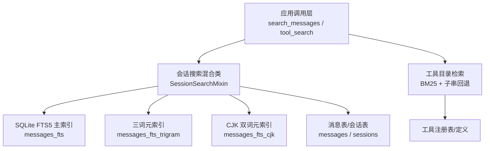
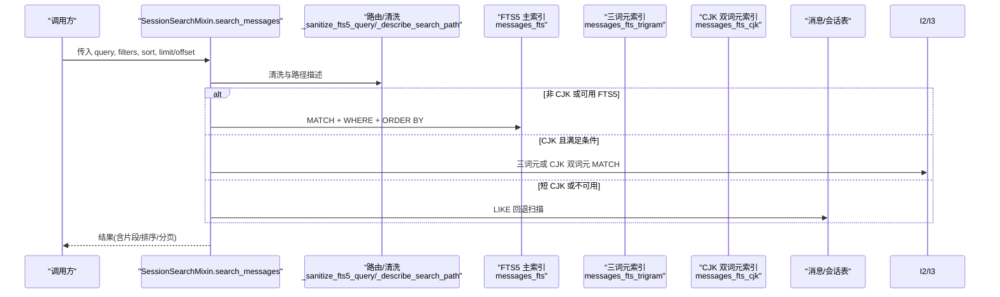
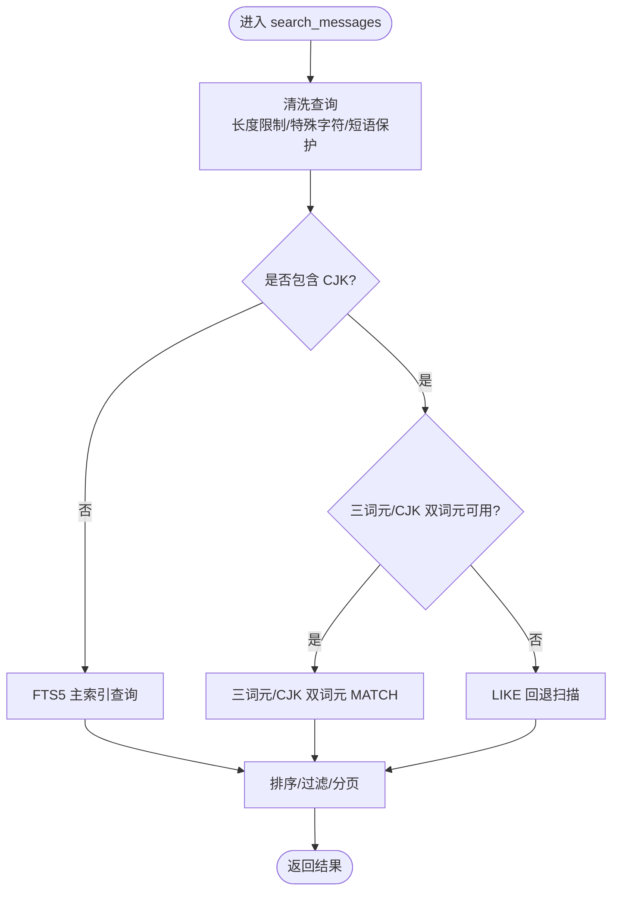
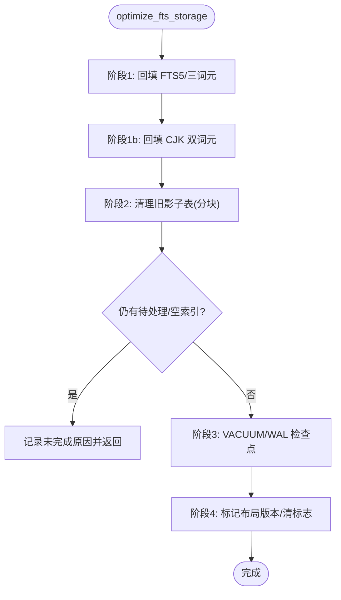
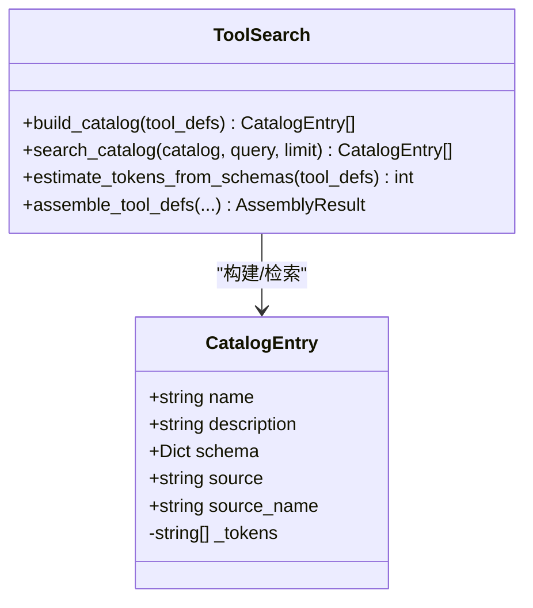
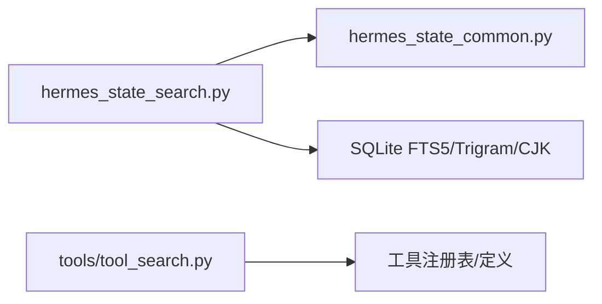

# 搜索优化

<cite>
**本文引用的文件**
- [hermes_state_search.py](file://hermes_state_search.py)
- [hermes_state_common.py](file://hermes_state_common.py)
- [tool_search.py](file://tools/tool_search.py)
- [test_fts_cjk_bigram.py](file://tests/test_fts_cjk_bigram.py)
- [test_fts_update_of_narrowing.py](file://tests/test_fts_update_of_narrowing.py)
</cite>

## 目录
1. [简介](#简介)
2. [项目结构](#项目结构)
3. [核心组件](#核心组件)
4. [架构总览](#架构总览)
5. [详细组件分析](#详细组件分析)
6. [依赖关系分析](#依赖关系分析)
7. [性能考量](#性能考量)
8. [故障排查指南](#故障排查指南)
9. [结论](#结论)
10. [附录](#附录)

## 简介
本指南面向运维与平台工程师，围绕会话消息的全文检索、CJK 多语言检索、工具目录检索等能力，提供系统化的性能调优策略与监控方法。内容覆盖索引优化（FTS5/三词元/CJK）、查询执行计划与路由选择、缓存与降级策略、内存与并发控制、负载均衡与容量规划、延迟与吞吐监控、瓶颈识别、基准测试方法与扩容方案，以及配置最佳实践与故障恢复流程。

## 项目结构
本项目在“会话状态数据库”中实现高性能全文检索，并通过“工具目录检索”对大规模工具集进行按需披露与检索。关键位置如下：
- 会话消息 FTS 与 CJK 索引、重建与优化：hermes_state_search.py、hermes_state_common.py
- 工具目录 BM25 检索与桥接工具：tools/tool_search.py
- 相关测试用例用于验证行为与回归防护：tests/test_fts_cjk_bigram.py、tests/test_fts_update_of_narrowing.py

图表来源
- [hermes_state_search.py:1383-1599](file://hermes_state_search.py#L1383-L1599)
- [hermes_state_common.py:415-534](file://hermes_state_common.py#L415-L534)
- [tool_search.py:375-472](file://tools/tool_search.py#L375-L472)

章节来源
- [hermes_state_search.py:1-120](file://hermes_state_search.py#L1-L120)
- [hermes_state_common.py:170-184](file://hermes_state_common.py#L170-L184)
- [tool_search.py:1-100](file://tools/tool_search.py#L1-L100)

## 核心组件
- 会话消息全文检索（FTS5）：对外暴露 search_messages，内部根据查询特征自动路由到 FTS5、三词元或 LIKE 回退路径，并支持排序、过滤与分页。
- CJK 索引与重建：通过 trigram 与 cjk-bigram 索引提升中文/日文/韩文短语匹配质量；提供增量重建、进度查询与边界清扫。
- 存储布局优化：将旧版内联 FTS 迁移至外部内容布局，分阶段回填、清理影子表、VACUUM 与 WAL 检查点，确保可重入与可观测。
- 工具目录检索：基于 BM25 的轻量级检索，结合名称子串回退，配合“桥接工具”实现按需披露与最小上下文开销。

章节来源
- [hermes_state_search.py:1383-1599](file://hermes_state_search.py#L1383-L1599)
- [hermes_state_search.py:264-420](file://hermes_state_search.py#L264-L420)
- [hermes_state_search.py:734-955](file://hermes_state_search.py#L734-L955)
- [hermes_state_common.py:415-534](file://hermes_state_common.py#L415-L534)
- [tool_search.py:375-472](file://tools/tool_search.py#L375-L472)

## 架构总览
下图展示一次搜索请求从入口到数据层的完整路径，包括查询清洗、路由决策、索引访问与结果组装。

图表来源
- [hermes_state_search.py:1160-1237](file://hermes_state_search.py#L1160-L1237)
- [hermes_state_search.py:1383-1599](file://hermes_state_search.py#L1383-L1599)
- [hermes_state_common.py:415-534](file://hermes_state_common.py#L415-L534)

## 详细组件分析

### 会话消息检索（FTS5/三词元/CJK/LIKE）
- 查询清洗：限制输入长度、保护引号短语、剥离危险字符、规范化布尔操作符与前缀星号、对含点/连字符的词组加引号，避免 FTS5 语法错误。
- 路由策略：
  - 非 CJK：优先走 FTS5 主索引。
  - CJK：若具备三词元/CJK 双词元且满足长度条件，走对应索引；否则回退到 LIKE。
- 排序与过滤：支持按时间升/降序与相关性排名；支持来源、角色、活跃/归档态过滤；支持字段投影减少 IO。
- 慢查询日志：超过阈值的搜索会记录路径、耗时与行数，便于定位 LIKE 全扫或路由不当。

图表来源
- [hermes_state_search.py:1160-1237](file://hermes_state_search.py#L1160-L1237)
- [hermes_state_search.py:1383-1599](file://hermes_state_search.py#L1383-L1599)

章节来源
- [hermes_state_search.py:1160-1237](file://hermes_state_search.py#L1160-L1237)
- [hermes_state_search.py:1383-1599](file://hermes_state_search.py#L1383-L1599)

### 索引构建与优化（FTS5/三词元/CJK）
- 增量回填：以高水位与进度键分段回填 messages 到 FTS5/三词元/CJK 索引，支持并发安全与断点续跑。
- 边界清扫：回填完成后对边界附近行做补录，保证一致性。
- 存储布局优化：
  - 阶段1：回填基础与三词元索引。
  - 阶段1b：回填 CJK 双词元索引（如可用）。
  - 阶段2：分块清理旧版影子表。
  - 阶段3：VACUUM 与 WAL 检查点（尽力而为）。
  - 阶段4：标记当前布局版本，清除“可优化”标志。
- 健壮性：空索引修复、脏数据自愈、可重入、失败重试与日志告警。

图表来源
- [hermes_state_search.py:734-955](file://hermes_state_search.py#L734-L955)
- [hermes_state_search.py:264-420](file://hermes_state_search.py#L264-L420)

章节来源
- [hermes_state_search.py:264-420](file://hermes_state_search.py#L264-L420)
- [hermes_state_search.py:734-955](file://hermes_state_search.py#L734-L955)

### 工具目录检索（BM25 + 子串回退）
- 目录构建：从工具定义中提取名称、描述与参数名，预分词为 tokens。
- 检索算法：BM25 评分，若无命中则回退到名称子串匹配，保证召回。
- 披露层级：根据上下文预算动态生成“完整列表/仅名称/分组摘要/无”，降低模型上下文压力。
- 桥接工具：以三个桥接工具替代大量工具定义，按需加载 schema 与调用，保持策略与审批一致。

图表来源
- [tool_search.py:320-472](file://tools/tool_search.py#L320-L472)
- [tool_search.py:772-800](file://tools/tool_search.py#L772-L800)

章节来源
- [tool_search.py:320-472](file://tools/tool_search.py#L320-L472)
- [tool_search.py:772-800](file://tools/tool_search.py#L772-L800)

## 依赖关系分析
- 模块耦合：
  - hermes_state_search.py 依赖 hermes_state_common.py 中的 FTS SQL 常量与触发器定义。
  - 工具目录检索独立于会话搜索，但共享“配置加载/阈值控制”思想。
- 外部依赖：
  - SQLite FTS5（unicode61/trigram）与可选 CJK 双词元扩展。
  - 进程间/线程间并发通过写锁与事务隔离保障一致性。
- 潜在风险：
  - 缺少 trigram/CJK 扩展时，部分查询会回退到 LIKE，需监控慢查询比例。
  - 大库 VACUUM 需要额外磁盘空间，WAL 检查点在并发读下可能失败。

图表来源
- [hermes_state_search.py:1-30](file://hermes_state_search.py#L1-L30)
- [hermes_state_common.py:415-534](file://hermes_state_common.py#L415-L534)
- [tool_search.py:375-472](file://tools/tool_search.py#L375-L472)

章节来源
- [hermes_state_search.py:1-30](file://hermes_state_search.py#L1-L30)
- [hermes_state_common.py:415-534](file://hermes_state_common.py#L415-L534)
- [tool_search.py:375-472](file://tools/tool_search.py#L375-L472)

## 性能考量
- 索引优化
  - 使用外部内容 FTS5 布局，减少写入放大与索引体积。
  - 启用三词元索引以提升 CJK 短语匹配；必要时启用 CJK 双词元索引。
  - 定期运行 optimize_fts_storage，确保布局最新、影子表清理与 VACUUM 完成。
- 查询执行计划与路由
  - 优先 FTS5/MATCH，避免 LIKE 全扫；对短 CJK 查询接受 LIKE 回退但需监控。
  - 合理设置 limit/offset，避免深分页；使用字段投影减少 IO。
- 缓存与降级
  - 对频繁查询结果可在上层引入短期缓存（注意失效策略）。
  - 当 FTS5/Trigram/CJK 不可用时，自动回退到 LIKE，同时记录慢查询。
- 内存与并发
  - 回填过程采用分块与节流，避免长时间持有写锁导致网关/CLI 阻塞。
  - VACUUM 与 WAL 检查点尽量在低峰期执行，预留足够磁盘空间。
- 负载均衡与容量规划
  - 多实例共享只读副本分担查询负载；写实例专注写入与索引维护。
  - 依据消息量增长预估 FTS 体积（三词元约为文本的数倍），提前扩容磁盘与内存。
- 监控指标
  - 延迟：HERMES_SEARCH_SLOW_MS 阈值日志；P95/P99 延迟。
  - 吞吐：QPS、每秒回填行数、VACUUM 耗时。
  - 健康：FTS 重建进度、CJ K 索引新鲜度、LIKE 回退占比。
- 基准测试
  - 构造不同查询形状（短 CJK、长短语、布尔组合、前缀）评估延迟与命中率。
  - 对比 FTS5/Trigram/CJK/LIKE 路径的性能差异，指导路由与索引策略。

[本节为通用性能建议，不直接引用具体代码]

## 故障排查指南
- 慢查询定位
  - 查看慢搜索日志中的 path 字段（fts5/trigram/cjk/like_scan），确认路由是否正确。
  - 对 like_scan 占比高的场景，检查查询是否过短或缺少索引利用。
- 索引不一致
  - 检查 fts_rebuild_high_water/progress 是否存在，必要时重新运行 optimize_fts_storage。
  - 关注 CJK 陈旧标记，必要时在具备 tokenizer 的主机重建。
- 写入阻塞
  - 回填期间存在节流，避免与高峰写入重叠；必要时调整分块大小与暂停策略。
- VACUUM/WAL 失败
  - 磁盘不足或并发读导致 TRUNCATE 失败属常见情况，重试或在低峰期执行。

章节来源
- [hermes_state_search.py:1383-1432](file://hermes_state_search.py#L1383-L1432)
- [hermes_state_search.py:734-955](file://hermes_state_search.py#L734-L955)
- [hermes_state_search.py:264-420](file://hermes_state_search.py#L264-L420)

## 结论
通过 FTS5/三词元/CJK 多路索引、智能路由与稳健的重建优化流程，系统在大规模会话数据上实现了稳定高效的检索能力。配合完善的监控、基准测试与容量规划，可有效识别瓶颈、预防故障并持续优化性能。工具目录检索则以 BM25+回退与桥接机制，在保证发现性的前提下显著降低上下文开销。

[本节为总结性内容，不直接引用具体代码]

## 附录
- 配置要点
  - 搜索慢查询阈值：HERMES_SEARCH_SLOW_MS（默认 1000ms）。
  - 查询长度上限：MAX_FTS5_QUERY_CHARS（2048）。
  - 工具目录检索：threshold_pct、listing_max_tokens、max_search_limit 等。
- 运维操作
  - 启动/监控 FTS 重建：查询重建状态与进度，观察阶段与百分比。
  - 执行存储优化：运行 optimize_fts_storage，关注回填、清理、VACUUM 与 WAL 检查点。
  - 资源限制：为回填与 VACUUM 预留 CPU/IO/磁盘空间，避免影响在线服务。
- 扩容建议
  - 按消息量与索引倍数估算磁盘与内存需求，提前规划。
  - 读写分离与只读副本分担查询压力，提升整体吞吐。

章节来源
- [hermes_state_common.py:170-184](file://hermes_state_common.py#L170-L184)
- [hermes_state_search.py:734-955](file://hermes_state_search.py#L734-L955)
- [tool_search.py:75-155](file://tools/tool_search.py#L75-L155)