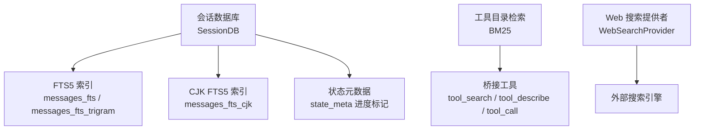
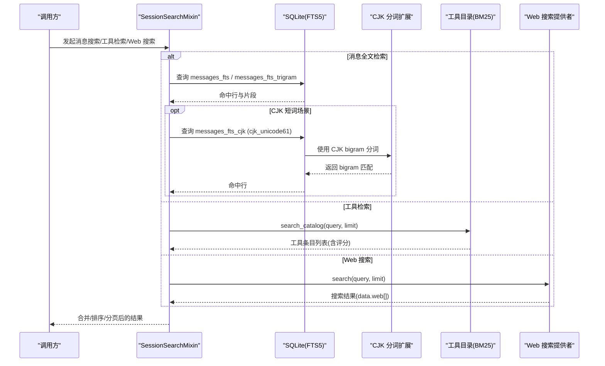
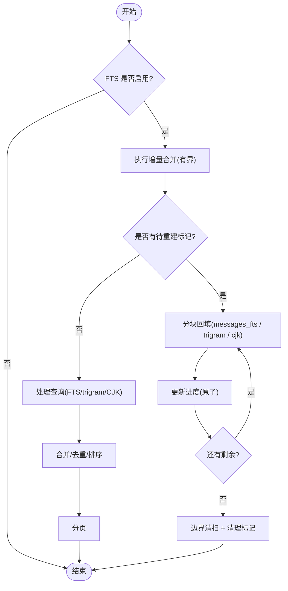
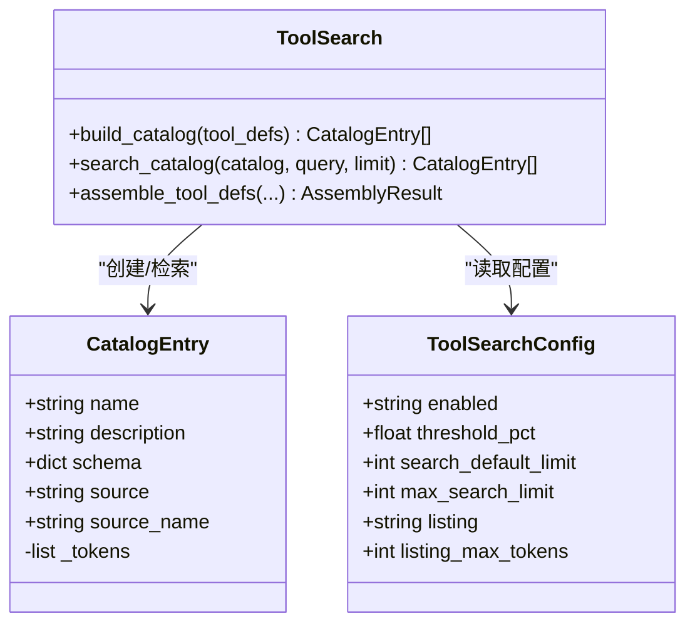
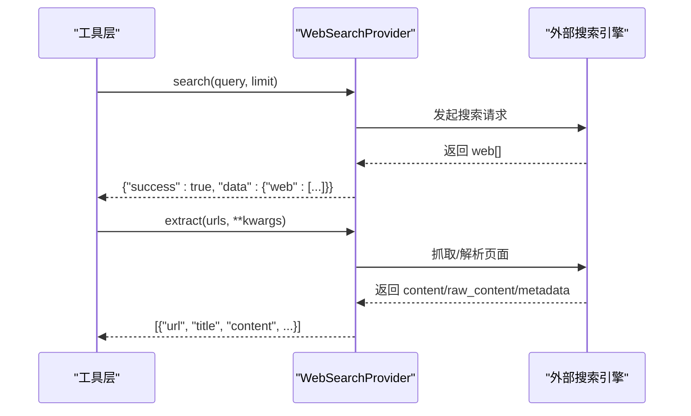
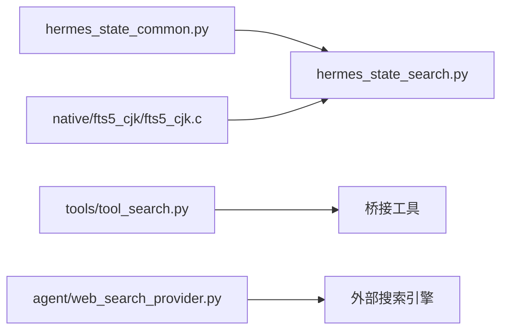

# 搜索检索

<cite>
**本文引用的文件**
- [hermes_state_search.py](file://hermes_state_search.py)
- [hermes_state_common.py](file://hermes_state_common.py)
- [fts5_cjk.c](file://native/fts5_cjk/fts5_cjk.c)
- [README.md](file://native/fts5_cjk/README.md)
- [tool_search.py](file://tools/tool_search.py)
- [web_search_provider.py](file://agent/web_search_provider.py)
</cite>

## 目录
1. [简介](#简介)
2. [项目结构](#项目结构)
3. [核心组件](#核心组件)
4. [架构总览](#架构总览)
5. [详细组件分析](#详细组件分析)
6. [依赖关系分析](#依赖关系分析)
7. [性能考量](#性能考量)
8. [故障排查指南](#故障排查指南)
9. [结论](#结论)
10. [附录](#附录)

## 简介
本文件系统性说明 Hermes Agent 的搜索与检索能力，覆盖以下主题：
- FTS5 全文搜索与中文分词优化（CJK bigram）
- 工具目录的 BM25 检索与渐进式披露
- 索引构建、增量维护与重建流程
- 查询优化策略、结果排序与去重分页
- 跨语言搜索支持、同义词扩展与语义增强思路
- 配置调优参数、性能监控与故障诊断
- API 使用示例、客户端集成与最佳实践
- 自定义搜索算法与扩展检索功能的开发指导

## 项目结构
搜索相关代码主要分布在以下模块：
- 会话消息的 FTS5 全文检索与 CJK 分词：hermes_state_search.py、hermes_state_common.py、native/fts5_cjk/*
- 工具发现与检索（BM25）：tools/tool_search.py
- 网络搜索后端抽象：agent/web_search_provider.py

图表来源
- [hermes_state_search.py:666-732](file://hermes_state_search.py#L666-L732)
- [hermes_state_search.py:264-330](file://hermes_state_search.py#L264-L330)
- [hermes_state_search.py:350-394](file://hermes_state_search.py#L350-L394)
- [hermes_state_common.py:170-184](file://hermes_state_common.py#L170-L184)
- [tool_search.py:375-472](file://tools/tool_search.py#L375-L472)
- [web_search_provider.py:89-212](file://agent/web_search_provider.py#L89-L212)

章节来源
- [hermes_state_search.py:1-120](file://hermes_state_search.py#L1-L120)
- [hermes_state_common.py:170-184](file://hermes_state_common.py#L170-L184)
- [tool_search.py:1-120](file://tools/tool_search.py#L1-L120)
- [web_search_provider.py:1-120](file://agent/web_search_provider.py#L1-L120)

## 核心组件
- 会话消息全文检索（FTS5 + trigram + CJK）
  - 提供消息内容的精确匹配、子串匹配与短词匹配，避免大表 LIKE 扫描。
  - 通过外部内容 FTS5 表与触发器实现增量更新；支持分块重建与边界清扫。
- 工具目录检索（BM25）
  - 将可延迟加载的工具描述、名称与参数名进行分词与索引，按 BM25 评分返回最相关工具。
  - 提供“渐进式披露”机制，控制上下文预算并降级展示形式。
- Web 搜索提供者（插件化）
  - 统一抽象 Web 搜索与网页内容提取接口，支持多后端切换与能力声明。

章节来源
- [hermes_state_search.py:69-110](file://hermes_state_search.py#L69-L110)
- [hermes_state_search.py:264-330](file://hermes_state_search.py#L264-L330)
- [hermes_state_search.py:350-394](file://hermes_state_search.py#L350-L394)
- [tool_search.py:320-472](file://tools/tool_search.py#L320-L472)
- [web_search_provider.py:89-212](file://agent/web_search_provider.py#L89-L212)

## 架构总览
下图展示了从用户查询到检索结果的完整路径，包括 FTS5、CJK 分词、BM25 工具检索以及 Web 搜索后端的调用关系。

图表来源
- [hermes_state_search.py:264-330](file://hermes_state_search.py#L264-L330)
- [hermes_state_search.py:350-394](file://hermes_state_search.py#L350-L394)
- [fts5_cjk.c:1-25](file://native/fts5_cjk/fts5_cjk.c#L1-L25)
- [tool_search.py:432-472](file://tools/tool_search.py#L432-L472)
- [web_search_provider.py:142-184](file://agent/web_search_provider.py#L142-L184)

## 详细组件分析

### FTS5 全文搜索与中文分词优化
- 设计要点
  - 使用外部内容 FTS5 表（messages_fts、messages_fts_trigram），避免内联存储带来的维护成本。
  - 通过触发器在写入时增量更新索引；当需要全量重建时，采用分块回填与高水位标记，确保并发安全与可恢复性。
  - 对 CJK 文本，使用 cjk_unicode61 分词器，将连续 CJK 字符切分为重叠 bigram，从而支持 2 字短词匹配，避免 LIKE 全表扫描。
- 关键流程
  - 增量合并：每次写操作后尝试一次有界合并，失败仅记录警告，不影响主事务。
  - 分块重建：读取高水位与进度，按固定 chunk 插入索引，原子更新进度；完成后执行边界清扫并清理标记。
  - CJK 重建：仅在 CJK 分词可用时启用；若检测到陈旧索引（触发器丢失），则重建。
- 查询优化
  - 限制查询长度，防止恶意输入导致性能退化。
  - 优先走 FTS5 索引；trigram 用于子串匹配；CJK 用于短词匹配。
- 结果排序与去重
  - FTS5 默认按相关性得分排序；trigram/CJK 可作为补充召回源，最终由上层合并去重并按综合分数排序。
- 分页显示
  - 通过 LIMIT/OFFSET 或游标方式分页；前端展示匹配计数与当前序号。

图表来源
- [hermes_state_search.py:69-110](file://hermes_state_search.py#L69-L110)
- [hermes_state_search.py:264-330](file://hermes_state_search.py#L264-L330)
- [hermes_state_search.py:350-394](file://hermes_state_search.py#L350-L394)
- [hermes_state_search.py:422-460](file://hermes_state_search.py#L422-L460)
- [hermes_state_common.py:170-184](file://hermes_state_common.py#L170-L184)

章节来源
- [hermes_state_search.py:69-110](file://hermes_state_search.py#L69-L110)
- [hermes_state_search.py:264-330](file://hermes_state_search.py#L264-L330)
- [hermes_state_search.py:350-394](file://hermes_state_search.py#L350-L394)
- [hermes_state_search.py:422-460](file://hermes_state_search.py#L422-L460)
- [hermes_state_common.py:170-184](file://hermes_state_common.py#L170-L184)
- [fts5_cjk.c:1-25](file://native/fts5_cjk/fts5_cjk.c#L1-L25)
- [README.md:1-25](file://native/fts5_cjk/README.md#L1-L25)

### 工具目录检索（BM25）与渐进式披露
- 设计要点
  - 将工具的名称、描述与参数名组合为检索文本，预分词并计算 BM25 分数。
  - 当存在可延迟工具时，以三个桥接工具（tool_search、tool_describe、tool_call）替代完整工具定义，按需加载。
  - 根据上下文预算动态选择展示形式：完整清单 → 仅名称 → 服务器级摘要 → 无清单（纯桥接）。
- 检索流程
  - 构建目录：过滤非核心工具，生成 CatalogEntry，预计算 tokens。
  - 检索：对查询分词，计算 IDF/TF 归一化得分，取 Top-N；若无命中，回退到名称子串匹配。
- 配置与阈值
  - 支持 enabled/threshold_pct/search_default_limit/max_search_limit/listing/listing_max_tokens 等参数。
  - 估算 token 数使用 chars/4 规则，保证稳定且保守的预算判断。

图表来源
- [tool_search.py:75-155](file://tools/tool_search.py#L75-L155)
- [tool_search.py:320-398](file://tools/tool_search.py#L320-L398)
- [tool_search.py:432-472](file://tools/tool_search.py#L432-L472)
- [tool_search.py:772-800](file://tools/tool_search.py#L772-L800)

章节来源
- [tool_search.py:75-155](file://tools/tool_search.py#L75-L155)
- [tool_search.py:320-398](file://tools/tool_search.py#L320-L398)
- [tool_search.py:432-472](file://tools/tool_search.py#L432-L472)
- [tool_search.py:772-800](file://tools/tool_search.py#L772-L800)

### Web 搜索提供者（插件化）
- 设计要点
  - 统一的抽象基类 WebSearchProvider，声明 is_available、supports_search、supports_extract、search、extract 等方法。
  - 支持多种后端（如 Brave、DDGS、SearXNG、Exa、Firecrawl、Tavily 等），通过配置选择 active provider。
  - 响应格式保持向后兼容，便于工具层直接消费。
- 集成点
  - 工具注册阶段探测可用性；运行时根据能力路由到对应后端。
  - 支持同步/异步 extract 实现，调度器自动检测协程并 await。

图表来源
- [web_search_provider.py:89-212](file://agent/web_search_provider.py#L89-L212)

章节来源
- [web_search_provider.py:89-212](file://agent/web_search_provider.py#L89-L212)

## 依赖关系分析
- hermes_state_search.py 依赖 hermes_state_common.py 提供的常量与 SQL 片段（如 FTS_STORAGE_VERSION、MAX_FTS5_QUERY_CHARS、_FTS_TRIGGERS）。
- CJK 分词通过 native/fts5_cjk/fts5_cjk.c 编译为 SQLite 扩展，并在创建 FTS5 表时使用 tokenize='cjk_unicode61'。
- 工具检索不依赖数据库，完全内存中 BM25，适合快速目录检索。
- Web 搜索提供者通过配置与注册表接入，解耦具体后端实现。

图表来源
- [hermes_state_common.py:170-184](file://hermes_state_common.py#L170-L184)
- [hermes_state_search.py:666-732](file://hermes_state_search.py#L666-L732)
- [fts5_cjk.c:217-243](file://native/fts5_cjk/fts5_cjk.c#L217-L243)
- [tool_search.py:628-747](file://tools/tool_search.py#L628-L747)
- [web_search_provider.py:89-212](file://agent/web_search_provider.py#L89-L212)

章节来源
- [hermes_state_common.py:170-184](file://hermes_state_common.py#L170-L184)
- [hermes_state_search.py:666-732](file://hermes_state_search.py#L666-L732)
- [fts5_cjk.c:217-243](file://native/fts5_cjk/fts5_cjk.c#L217-L243)
- [tool_search.py:628-747](file://tools/tool_search.py#L628-L747)
- [web_search_provider.py:89-212](file://agent/web_search_provider.py#L89-L212)

## 性能考量
- FTS5 外部内容表
  - 使用 'delete-all' 命令清空索引，O(1) 级别，避免逐行删除导致的长时间锁定。
  - 分块回填与高水位标记，避免长事务与大锁竞争；并发调用可交错推进。
- 查询限制
  - 限制查询长度（MAX_FTS5_QUERY_CHARS），防止异常输入造成性能退化。
- CJK 分词
  - bigram 提升短词召回率，减少 LIKE 全表扫描；但会增加索引体积，需权衡。
- 工具检索
  - BM25 在内存中运行，复杂度 O(N·Q)，N 为工具数量，通常较小；chars/4 估算 token 数，稳定且保守。
- Web 搜索
  - 后端选择与能力探测应轻量，避免启动时网络开销；extract 支持异步以减少阻塞。

章节来源
- [hermes_state_search.py:504-523](file://hermes_state_search.py#L504-L523)
- [hermes_state_search.py:264-330](file://hermes_state_search.py#L264-L330)
- [hermes_state_common.py:181-184](file://hermes_state_common.py#L181-L184)
- [fts5_cjk.c:1-25](file://native/fts5_cjk/fts5_cjk.c#L1-L25)
- [tool_search.py:258-313](file://tools/tool_search.py#L258-L313)
- [web_search_provider.py:116-140](file://agent/web_search_provider.py#L116-L140)

## 故障排查指南
- FTS 重建卡住或中断
  - 检查 state_meta 中的 fts_rebuild_high_water 与 fts_rebuild_progress；必要时重新运行 optimize_fts_storage。
  - 若 legacy inline FTS 已 demote 但遗留 trash 表，系统会逐步清理；可通过 fts_optimize_available 判断是否需要继续。
- CJK 索引不可用或陈旧
  - 确认 CJK 扩展已加载；若触发器丢失，系统会标记陈旧并重建。
  - 使用 fts_cjk_rebuild_status/fts_cjk_rebuild_step 观察进度。
- 查询过慢
  - 检查是否回退到 LIKE；确保 FTS5/trigram/CJK 均正常启用。
  - 限制查询长度，避免超长关键词。
- 工具检索无结果
  - 检查目录构建是否包含目标工具；确认 BM25 分词与阈值设置；必要时调整 listing_max_tokens 或 threshold_pct。
- Web 搜索失败
  - 检查 provider 的 is_available 与环境变量；确认后端服务可达；查看错误信息定位网络或鉴权问题。

章节来源
- [hermes_state_search.py:625-665](file://hermes_state_search.py#L625-L665)
- [hermes_state_search.py:332-394](file://hermes_state_search.py#L332-L394)
- [hermes_state_search.py:422-460](file://hermes_state_search.py#L422-L460)
- [hermes_state_common.py:181-184](file://hermes_state_common.py#L181-L184)
- [tool_search.py:432-472](file://tools/tool_search.py#L432-L472)
- [web_search_provider.py:116-140](file://agent/web_search_provider.py#L116-L140)

## 结论
本系统通过 FTS5 + trigram + CJK bigram 的组合，实现了高效、鲁棒的会话消息检索；通过 BM25 与渐进式披露，解决了大规模工具目录的可发现性问题；通过插件化的 Web 搜索提供者，提供了可扩展的外部检索能力。整体设计强调可维护性（外部内容表、分块重建）、可观测性（进度标记、状态查询）与可扩展性（提供者抽象、桥接工具）。

## 附录

### 配置与调优参数
- FTS5 与 CJK
  - sessions.cjk_fts: 控制 CJK 索引开关（见 README）。
  - MAX_FTS5_QUERY_CHARS: 限制查询长度。
  - optimize_fts_storage: 迁移/重建入口，支持 vacuum 与进度回调。
- 工具检索
  - tools.tool_search.enabled: auto/on/off
  - tools.tool_search.threshold_pct: 上下文百分比阈值
  - tools.tool_search.search_default_limit / max_search_limit: 默认与最大返回条数
  - tools.tool_search.listing: auto/on/off
  - tools.tool_search.listing_max_tokens: 清单最大 token 数
- Web 搜索
  - web.search_backend / web.extract_backend / web.backend: 选择后端
  - 各 provider 的环境变量（如 API Key、实例 URL）

章节来源
- [README.md:1-25](file://native/fts5_cjk/README.md#L1-L25)
- [hermes_state_common.py:181-184](file://hermes_state_common.py#L181-L184)
- [hermes_state_search.py:734-800](file://hermes_state_search.py#L734-L800)
- [tool_search.py:75-155](file://tools/tool_search.py#L75-L155)
- [web_search_provider.py:100-114](file://agent/web_search_provider.py#L100-L114)

### API 使用示例与客户端集成
- 会话消息检索
  - 调用 SessionSearchMixin 的搜索方法（由 SessionDB 混入），传入查询与字段投影；注意查询长度限制。
  - 使用 fts_rebuild_status/fts_cjk_rebuild_status 获取重建进度，前端可轮询展示。
- 工具检索
  - 使用 assemble_tool_defs 组装模型可见的工具定义；当激活时，模型将通过 tool_search/tool_describe/tool_call 三件套完成发现与调用。
  - 通过 build_catalog_listing_with_form 控制清单展示形式，适配不同上下文预算。
- Web 搜索
  - 通过 WebSearchProvider 的 search/extract 接口调用；根据 supports_search/supports_extract 能力路由。
  - 遵循统一响应形状，便于工具层直接消费。

章节来源
- [hermes_state_search.py:83-110](file://hermes_state_search.py#L83-L110)
- [hermes_state_search.py:332-394](file://hermes_state_search.py#L332-L394)
- [tool_search.py:628-747](file://tools/tool_search.py#L628-L747)
- [tool_search.py:772-800](file://tools/tool_search.py#L772-L800)
- [web_search_provider.py:142-184](file://agent/web_search_provider.py#L142-L184)

### 自定义搜索算法与扩展指南
- 扩展 FTS5 分词
  - 参考 native/fts5_cjk/fts5_cjk.c，实现新的 FTS5 tokenizer，并通过 sqlite3ext.h 暴露初始化函数；在创建 FTS5 表时指定 tokenize 参数。
- 扩展工具检索
  - 在 CatalogEntry 中增加更多字段（如标签、领域、版本），并在 _entry_search_text 中纳入检索文本；调整 BM25 权重或引入向量相似度融合。
- 扩展 Web 搜索
  - 实现 WebSearchProvider 的子类，注册到平台；在 get_setup_schema 中提供 UI 提示与环境变量说明。

章节来源
- [fts5_cjk.c:1-25](file://native/fts5_cjk/fts5_cjk.c#L1-L25)
- [fts5_cjk.c:217-243](file://native/fts5_cjk/fts5_cjk.c#L217-L243)
- [tool_search.py:320-398](file://tools/tool_search.py#L320-L398)
- [web_search_provider.py:186-212](file://agent/web_search_provider.py#L186-L212)