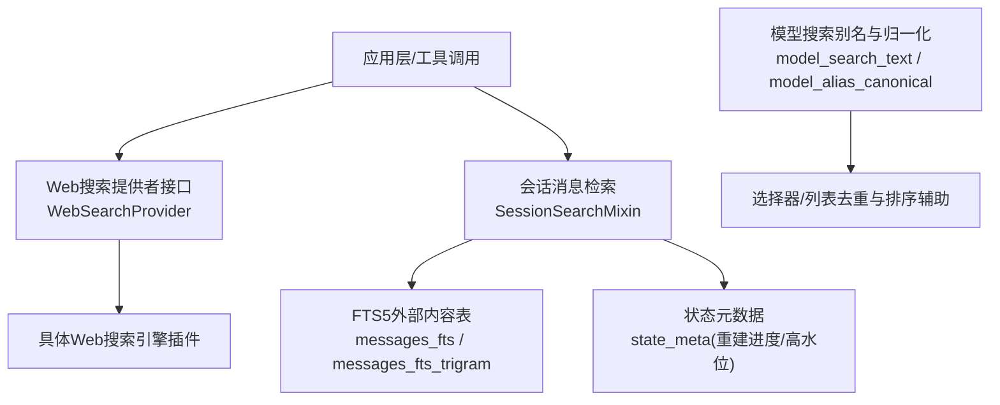
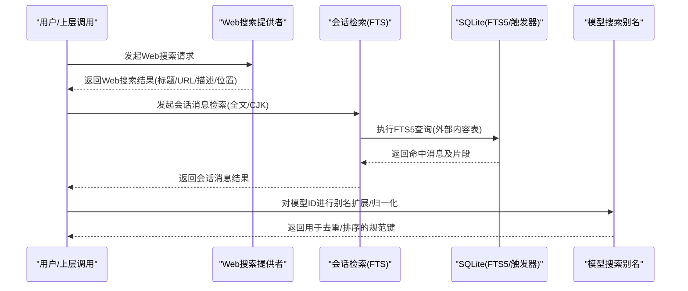
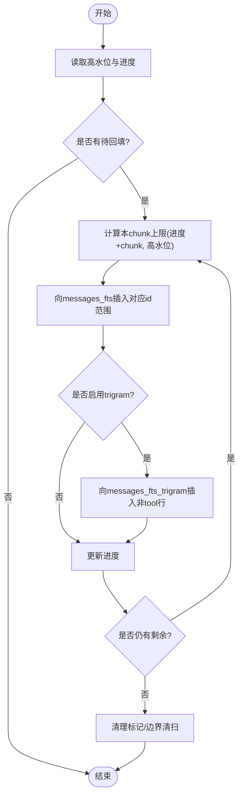
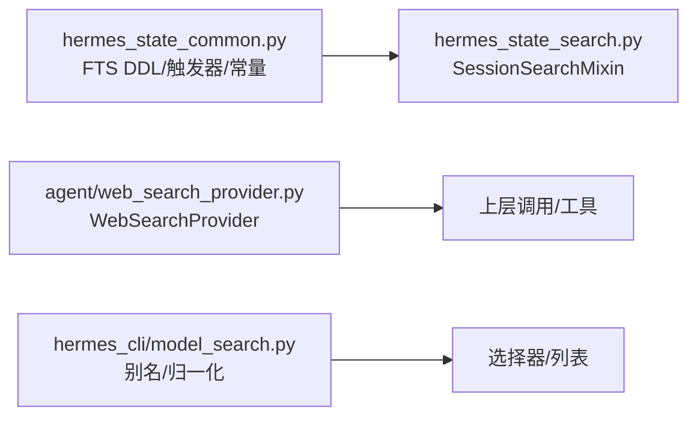

# 混合排序

<cite>
**本文引用的文件**
- [hermes_state_search.py](file://hermes_state_search.py)
- [hermes_state_common.py](file://hermes_state_common.py)
- [web_search_provider.py](file://agent/web_search_provider.py)
- [model_search.py](file://hermes_cli/model_search.py)
</cite>

## 目录
1. [简介](#简介)
2. [项目结构](#项目结构)
3. [核心组件](#核心组件)
4. [架构总览](#架构总览)
5. [详细组件分析](#详细组件分析)
6. [依赖关系分析](#依赖关系分析)
7. [性能考量](#性能考量)
8. [故障排查指南](#故障排查指南)
9. [结论](#结论)
10. [附录](#附录)

## 简介
本文件面向“混合排序”能力，说明如何在本仓库中结合全文检索（FTS）与向量/语义检索结果进行智能排序。文档覆盖：
- 相关性评分融合策略、权重分配机制与动态调整思路
- 搜索结果去重、分页展示与用户意图理解
- 排序参数配置、性能优化与缓存机制
- 数学模型、算法实现要点与调试工具
- 效果评估方法、A/B测试框架与用户体验优化建议
- 自定义排序算法与扩展排序维度的开发指导

需要特别说明的是：当前代码库实现了强大的本地会话消息全文检索（FTS）、CJK三gram子串检索以及可插拔的Web搜索后端；但并未直接提供端到端的“向量检索+全文检索”的混合排序实现。因此，本文在严格依据现有代码的基础上，给出基于已有能力的混合排序设计方案与落地路径，并在“概念性章节”中补充通用方法论与最佳实践。

## 项目结构
围绕混合排序的相关能力，主要涉及以下模块：
- 会话消息的全文检索与索引维护：hermes_state_search.py、hermes_state_common.py
- Web搜索提供者抽象与注册：agent/web_search_provider.py
- 模型ID模糊匹配与别名归一化（可用于选择器中的去重与排序辅助）：hermes_cli/model_search.py

图表来源
- [hermes_state_search.py:36-109](file://hermes_state_search.py#L36-L109)
- [hermes_state_common.py:415-534](file://hermes_state_common.py#L415-L534)
- [web_search_provider.py:89-212](file://agent/web_search_provider.py#L89-L212)
- [model_search.py:14-51](file://hermes_cli/model_search.py#L14-L51)

章节来源
- [hermes_state_search.py:36-109](file://hermes_state_search.py#L36-L109)
- [hermes_state_common.py:415-534](file://hermes_state_common.py#L415-L534)
- [web_search_provider.py:89-212](file://agent/web_search_provider.py#L89-L212)
- [model_search.py:14-51](file://hermes_cli/model_search.py#L14-L51)

## 核心组件
- 会话消息检索（SessionSearchMixin）
  - 提供FTS增量合并、重建步骤、CJK重建等能力，支撑高质量文本召回
  - 通过外部内容表与触发器保证写入时的一致性，支持后台分块回填
- Web搜索提供者（WebSearchProvider）
  - 统一抽象Web搜索/提取能力，便于接入不同搜索引擎并标准化返回格式
- 模型搜索别名与归一化（model_search）
  - 为模型ID提供别名扩展与归一化，辅助选择器的去重与排序

章节来源
- [hermes_state_search.py:69-159](file://hermes_state_search.py#L69-L159)
- [hermes_state_search.py:264-330](file://hermes_state_search.py#L264-L330)
- [hermes_state_search.py:332-420](file://hermes_state_search.py#L332-L420)
- [web_search_provider.py:89-212](file://agent/web_search_provider.py#L89-L212)
- [model_search.py:14-51](file://hermes_cli/model_search.py#L14-L51)

## 架构总览
下图展示了从查询到检索、再到排序展示的端到端流程。当前仓库已具备：
- 本地会话消息的全文检索（含CJK子串）
- Web搜索的统一入口
- 模型ID别名与归一化

图表来源
- [web_search_provider.py:22-49](file://agent/web_search_provider.py#L22-L49)
- [hermes_state_search.py:36-109](file://hermes_state_search.py#L36-L109)
- [hermes_state_common.py:415-534](file://hermes_state_common.py#L415-L534)
- [model_search.py:14-51](file://hermes_cli/model_search.py#L14-L51)

## 详细组件分析

### 组件A：会话消息检索与FTS维护（SessionSearchMixin）
- 功能要点
  - 增量合并FTS索引，避免阻塞写路径
  - 后台分块回填（high_water/progress），支持中断恢复
  - CJK三gram索引重建与可用性检测
  - 旧版内联FTS迁移至v23外部内容表，保障长期稳定性
- 关键数据结构
  - state_meta：记录重建高水位、进度、CJK陈旧标记等
  - messages_fts/messages_fts_trigram：外部内容FTS5表
  - 触发器：保证插入/更新/删除时的索引一致性
- 复杂度与性能
  - 回填按id区间分块，I/O可控；触发器仅在内容相关列变更时生效，降低开销
  - 使用EXISTS而非COUNT(*)判断空索引，减少全表扫描

图表来源
- [hermes_state_search.py:264-330](file://hermes_state_search.py#L264-L330)
- [hermes_state_common.py:415-534](file://hermes_state_common.py#L415-L534)

章节来源
- [hermes_state_search.py:69-159](file://hermes_state_search.py#L69-L159)
- [hermes_state_search.py:264-330](file://hermes_state_search.py#L264-L330)
- [hermes_state_search.py:332-420](file://hermes_state_search.py#L332-L420)
- [hermes_state_common.py:415-534](file://hermes_state_common.py#L415-L534)

### 组件B：Web搜索提供者（WebSearchProvider）
- 功能要点
  - 统一search/extract接口，屏蔽不同搜索引擎差异
  - 标准化返回结构，便于上层聚合与排序
  - 支持异步extract，适配不同后端特性
- 与排序的关系
  - 作为混合排序的一个召回源，其结果可与本地FTS结果合并后进行融合排序

章节来源
- [web_search_provider.py:22-49](file://agent/web_search_provider.py#L22-L49)
- [web_search_provider.py:89-212](file://agent/web_search_provider.py#L89-L212)

### 组件C：模型搜索别名与归一化（model_search）
- 功能要点
  - 将短/品牌无关的wire id扩展为更友好的搜索词
  - 提供归一化键，用于选择器去重与稳定排序
- 与排序的关系
  - 在列表/选择器场景中，可作为排序前的规范化步骤，提升体验一致性

章节来源
- [model_search.py:14-51](file://hermes_cli/model_search.py#L14-L51)

## 依赖关系分析
- SessionSearchMixin 依赖 hermes_state_common 提供的FTS DDL、触发器与常量
- WebSearchProvider 为纯接口定义，具体实现由插件提供
- model_search 独立于检索链路，仅用于别名与归一化

图表来源
- [hermes_state_common.py:415-534](file://hermes_state_common.py#L415-L534)
- [hermes_state_search.py:36-109](file://hermes_state_search.py#L36-L109)
- [web_search_provider.py:89-212](file://agent/web_search_provider.py#L89-L212)
- [model_search.py:14-51](file://hermes_cli/model_search.py#L14-L51)

章节来源
- [hermes_state_common.py:415-534](file://hermes_state_common.py#L415-L534)
- [hermes_state_search.py:36-109](file://hermes_state_search.py#L36-L109)
- [web_search_provider.py:89-212](file://agent/web_search_provider.py#L89-L212)
- [model_search.py:14-51](file://hermes_cli/model_search.py#L14-L51)

## 性能考量
- 索引维护
  - 增量合并与分块回填避免长事务与锁竞争
  - 触发器仅对内容相关列变更生效，降低写放大
- 查询优化
  - 使用EXISTS探测空索引，避免全表扫描
  - 限制FTS5输入长度，防止恶意或超大查询导致性能抖动
- 存储与IO
  - 外部内容表减少重复存储；trigram索引体积较大，按需启用
- 并发与健壮性
  - 高水位/进度标记确保多进程安全回填
  - 失败重试与边界清扫保证最终一致性

[本节为通用性能讨论，不直接分析具体文件]

## 故障排查指南
- FTS重建卡住或未完成
  - 检查state_meta中的高水位与进度键是否存在且合理
  - 观察是否有脏表（trash tables）未清理
- CJK索引不可用
  - 确认tokenizer可用性与stale标记
  - 必要时重新运行优化以重建CJK索引
- 查询无结果或结果异常
  - 验证输入长度限制与转义处理
  - 检查触发器是否被禁用或损坏

章节来源
- [hermes_state_search.py:83-159](file://hermes_state_search.py#L83-L159)
- [hermes_state_search.py:332-420](file://hermes_state_search.py#L332-L420)
- [hermes_state_common.py:415-534](file://hermes_state_common.py#L415-L534)

## 结论
- 仓库已具备高质量的本地全文检索与Web搜索抽象，可作为混合排序的基础召回层
- 向量检索尚未内置，可在上层引入向量召回并与FTS/Web结果融合
- 通过合理的权重分配、去重与分页策略，可实现稳定、可解释的混合排序体验
- 建议采用渐进式演进：先完善FTS/Web召回质量，再叠加向量维度与动态调权

[本节为总结性内容，不直接分析具体文件]

## 附录

### 混合排序数学模型（概念性）
- 目标函数
  - 综合得分 = w1·S_fts + w2·S_web + w3·S_vector + b
  - S_fts：FTS相关性分数（BM25或内部打分）
  - S_web：Web搜索结果相关性（如点击率、权威度、距离等）
  - S_vector：向量相似度（余弦相似度或点积）
  - w1,w2,w3：权重；b：偏置项
- 归一化
  - 各分数需归一化到同一尺度（如[0,1]），避免量纲影响
- 动态调整
  - 根据用户反馈（点击、停留时长、转发）在线调整w1..w3
  - 冷启动阶段可采用固定权重，逐步收敛

[本节为概念性说明，不直接分析具体文件]

### 权重分配与动态调整（概念性）
- 初始权重
  - 若场景偏精确关键词匹配：提高w1
  - 若场景偏语义泛化：提高w3
  - 若Web权威性强：提高w2
- 在线学习
  - 使用隐式反馈（点击、收藏、分享）构建偏好信号
  - 采用滑动窗口或指数衰减更新权重
- 约束与鲁棒性
  - 设置权重上下界，避免极端波动
  - 对低置信度召回降权，抑制噪声

[本节为概念性说明，不直接分析具体文件]

### 去重与分页（概念性）
- 去重策略
  - URL级去重：以url为主键
  - 内容级去重：基于文本指纹或向量阈值
  - 跨源去重：FTS与Web结果合并后统一去重
- 分页显示
  - 服务端分页：按综合得分排序后取第p页
  - 客户端分页：前端滚动加载，注意保持排序一致性

[本节为概念性说明，不直接分析具体文件]

### 用户意图理解（概念性）
- 意图分类
  - 事实型：偏向精确匹配，提高w1
  - 探索型：偏向语义泛化，提高w3
  - 对比型：强调多维度指标，增加排序维度
- 上下文利用
  - 结合历史对话、当前任务类型调整权重
  - 对长尾查询给予更多语义权重

[本节为概念性说明，不直接分析具体文件]

### 排序参数配置（概念性）
- 可调参数
  - w1,w2,w3,b：融合权重与偏置
  - k：Top-K数量
  - p：分页大小
  - 去重阈值：内容相似度阈值
- 配置方式
  - 配置文件或环境变量
  - 运行时热更新（需谨慎校验）

[本节为概念性说明，不直接分析具体文件]

### 性能优化与缓存（概念性）
- 缓存策略
  - 查询级缓存：相同query短时间复用结果
  - 结果级缓存：热门结果缓存TTL
  - 向量缓存：热点向量预计算
- 索引优化
  - 定期vacuum与统计信息更新
  - 分片与并行召回

[本节为概念性说明，不直接分析具体文件]

### 调试工具（概念性）
- 日志与埋点
  - 记录各源得分、权重、最终排序
  - 输出关键中间态（去重前/后）
- 可视化
  - 交互式排序解释：展示各维度贡献
  - A/B面板：对比不同权重策略

[本节为概念性说明，不直接分析具体文件]

### 效果评估与A/B测试（概念性）
- 离线评估
  - NDCG、MRR、Recall@K
  - 人工标注相关性
- 在线评估
  - CTR、停留时长、转化率
  - 分层抽样与分流策略
- 实验设计
  - 控制变量：固定其他条件，仅改变权重
  - 显著性检验：确保结果可靠

[本节为概念性说明，不直接分析具体文件]

### 用户体验优化建议（概念性）
- 结果呈现
  - 清晰标注来源与相关性理由
  - 支持按维度筛选（仅FTS/仅Web/仅向量）
- 交互优化
  - 快速切换排序策略
  - 提供“推荐”与“最新”双模式

[本节为概念性说明，不直接分析具体文件]

### 自定义排序与扩展维度（概念性）
- 扩展点
  - 新增召回源：如知识图谱、时间衰减
  - 新增特征：如作者权威、时效性
- 实现建议
  - 统一打分接口，便于替换与组合
  - 保持向后兼容，逐步灰度上线

[本节为概念性说明，不直接分析具体文件]