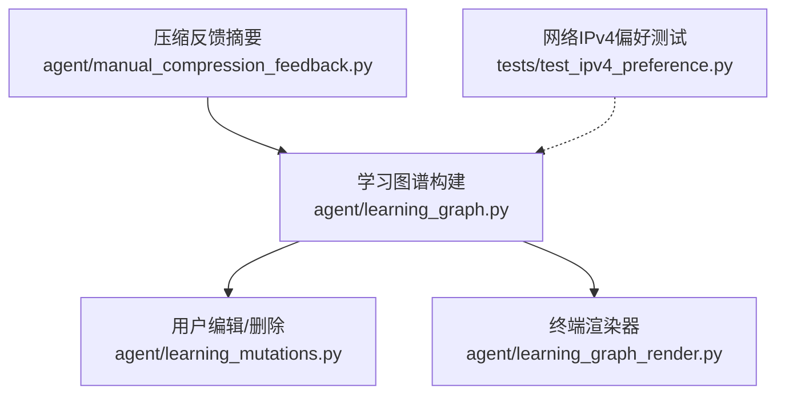
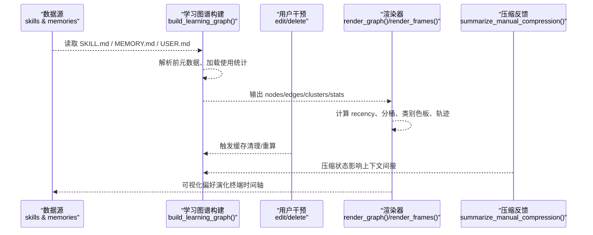
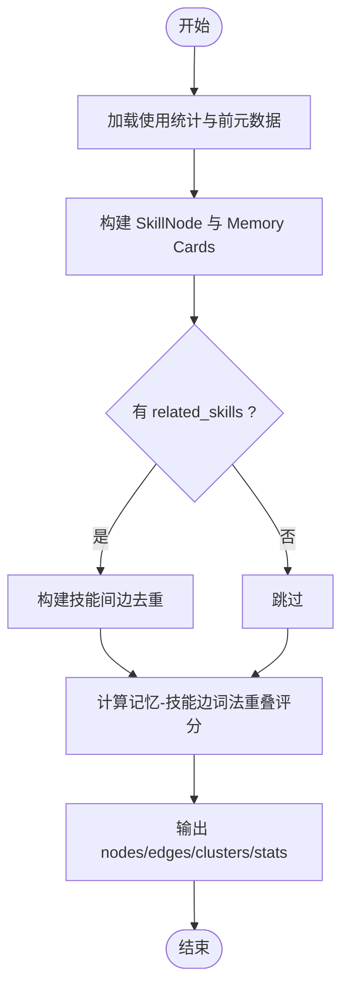
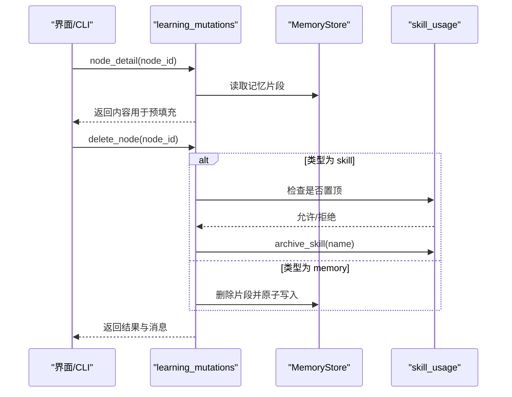
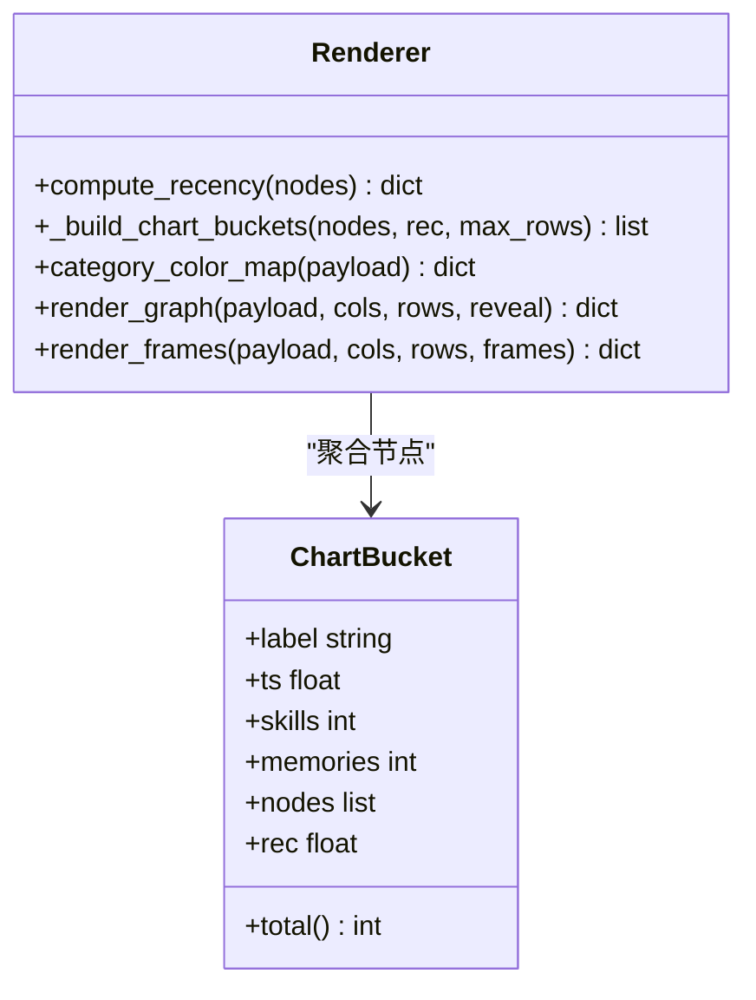
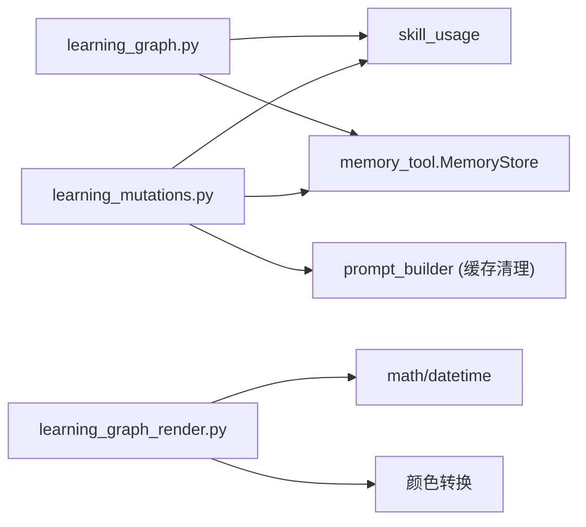

# 偏好学习机制

<cite>
**本文引用的文件**
- [agent/learning_graph.py](file://agent/learning_graph.py)
- [agent/learning_mutations.py](file://agent/learning_mutations.py)
- [agent/learning_graph_render.py](file://agent/learning_graph_render.py)
- [agent/manual_compression_feedback.py](file://agent/manual_compression_feedback.py)
- [tests/test_ipv4_preference.py](file://tests/test_ipv4_preference.py)
</cite>

## 目录
1. [简介](#简介)
2. [项目结构](#项目结构)
3. [核心组件](#核心组件)
4. [架构总览](#架构总览)
5. [详细组件分析](#详细组件分析)
6. [依赖关系分析](#依赖关系分析)
7. [性能考量](#性能考量)
8. [故障诊断指南](#故障诊断指南)
9. [结论](#结论)
10. [附录](#附录)

## 简介
本文件系统性梳理 Hermes Agent 中的“偏好学习机制”，聚焦于自动偏好提取、权重计算与动态更新策略，并解释基于反馈的强化学习、协同过滤与上下文感知的偏好推断在工程实现中的体现。文档同时覆盖偏好数据的结构化表示、版本控制与冲突解决、训练过程与评估指标、优化策略、配置与参数调优、性能监控与调试工具，以及扩展学习与集成第三方推荐系统的技术指导。

## 项目结构
Hermes Agent 将“偏好学习”落地为可观测、可编辑、可渲染的学习图谱：
- 学习图谱构建：从技能与记忆（MEMORY.md / USER.md）中抽取节点与边，形成“已学技能 + 记忆”的结构化图。
- 用户干预：支持对图谱节点进行查看、编辑与删除，确保偏好数据可维护且可追溯。
- 可视化渲染：提供终端时间轴视图，按日期分桶展示技能与记忆的增长轨迹，帮助理解偏好演化。
- 压缩反馈：对会话压缩过程提供用户可见的摘要与状态，辅助理解上下文压缩对偏好的影响。

**图表来源**
- [agent/learning_graph.py:1-329](file://agent/learning_graph.py#L1-L329)
- [agent/learning_mutations.py:1-207](file://agent/learning_mutations.py#L1-L207)
- [agent/learning_graph_render.py:1-659](file://agent/learning_graph_render.py#L1-L659)
- [agent/manual_compression_feedback.py:1-121](file://agent/manual_compression_feedback.py#L1-L121)
- [tests/test_ipv4_preference.py:1-80](file://tests/test_ipv4_preference.py#L1-L80)

**章节来源**
- [agent/learning_graph.py:1-329](file://agent/learning_graph.py#L1-L329)
- [agent/learning_mutations.py:1-207](file://agent/learning_mutations.py#L1-L207)
- [agent/learning_graph_render.py:1-659](file://agent/learning_graph_render.py#L1-L659)
- [agent/manual_compression_feedback.py:1-121](file://agent/manual_compression_feedback.py#L1-L121)
- [tests/test_ipv4_preference.py:1-80](file://tests/test_ipv4_preference.py#L1-L80)

## 核心组件
- 学习图谱构建器：负责扫描基础与用户技能、解析前元数据、加载使用统计、生成节点与边，并将记忆片段作为一等公民纳入图中。
- 用户干预层：提供节点详情、编辑与删除能力；技能删除采用归档策略，记忆删除通过原子写入保证一致性。
- 渲染器：将图谱转换为终端时间轴视图，按日/月/年分桶，计算近期性、类别色板与轨迹曲线，便于观察偏好增长。
- 压缩反馈：对用户触发的压缩操作给出清晰的状态与提示，避免误导并保护敏感信息。

**章节来源**
- [agent/learning_graph.py:125-323](file://agent/learning_graph.py#L125-L323)
- [agent/learning_mutations.py:86-187](file://agent/learning_mutations.py#L86-L187)
- [agent/learning_graph_render.py:231-554](file://agent/learning_graph_render.py#L231-L554)
- [agent/manual_compression_feedback.py:10-121](file://agent/manual_compression_feedback.py#L10-L121)

## 架构总览
下图展示了偏好学习的端到端流程：从数据源（技能与记忆）到图谱构建、用户干预、渲染输出，以及与压缩反馈的交互。

**图表来源**
- [agent/learning_graph.py:254-323](file://agent/learning_graph.py#L254-L323)
- [agent/learning_graph_render.py:454-659](file://agent/learning_graph_render.py#L454-L659)
- [agent/learning_mutations.py:192-207](file://agent/learning_mutations.py#L192-L207)
- [agent/manual_compression_feedback.py:40-121](file://agent/manual_compression_feedback.py#L40-L121)

## 详细组件分析

### 学习图谱构建（偏好识别与权重计算）
- 节点建模：SkillNode 包含名称、类别、来源、时间戳、使用次数、状态、创建者、是否置顶及关联技能列表。
- 边构建：基于 declared related_skills 建立无向边；记忆与技能的边通过词法重叠评分（精确匹配加分、词集交集计数），取 Top-N 连接。
- 权重与近期性：use_count、pinned、timestamp 共同影响节点重要性；渲染阶段通过 recency_ink 与 _node_score 综合计算显示优先级。
- 数据结构复杂度：
  - 构建节点：O(S) 遍历技能文件与使用记录。
  - 构建边：O(E) 遍历相关技能集合去重。
  - 记忆-技能边：O(M×S) 词法匹配，M 为记忆卡片数，S 为技能数。

**图表来源**
- [agent/learning_graph.py:125-245](file://agent/learning_graph.py#L125-L245)
- [agent/learning_graph.py:254-323](file://agent/learning_graph.py#L254-L323)

**章节来源**
- [agent/learning_graph.py:28-153](file://agent/learning_graph.py#L28-L153)
- [agent/learning_graph.py:156-245](file://agent/learning_graph.py#L156-L245)
- [agent/learning_graph.py:254-323](file://agent/learning_graph.py#L254-L323)

### 用户干预（版本控制与冲突解决）
- 节点类型判定：memory:<source>:<index> 或 skill 名称。
- 记忆定位与索引映射：全局索引到文件内局部索引的转换，确保并发读写一致。
- 删除策略：
  - 技能：若被置顶则拒绝删除；否则归档技能，恢复路径明确。
  - 记忆：直接删除对应片段并通过原子写入保证完整性。
- 编辑流程：预填充当前内容，校验非空后写入，成功后清理系统提示缓存。

**图表来源**
- [agent/learning_mutations.py:26-80](file://agent/learning_mutations.py#L26-L80)
- [agent/learning_mutations.py:124-151](file://agent/learning_mutations.py#L124-L151)
- [agent/learning_mutations.py:164-187](file://agent/learning_mutations.py#L164-L187)
- [agent/learning_mutations.py:192-207](file://agent/learning_mutations.py#L192-L207)

**章节来源**
- [agent/learning_mutations.py:26-80](file://agent/learning_mutations.py#L26-L80)
- [agent/learning_mutations.py:86-187](file://agent/learning_mutations.py#L86-L187)
- [agent/learning_mutations.py:192-207](file://agent/learning_mutations.py#L192-L207)

### 渲染器（可视化与偏好趋势）
- 近期性计算：根据时间戳范围归一化为 0→1 的 recency，结合 LEAD_IN 常量保持最旧节点可见。
- 分桶策略：按 day/month/year 粒度选择合适的时间分桶；若无时间信息则按序等分。
- 类别色板：基于黄金角均匀分布 hue，确保相邻类别颜色不冲突。
- 轨迹曲线：累计学习量绘制 sparkline，直观呈现偏好增长。

**图表来源**
- [agent/learning_graph_render.py:231-329](file://agent/learning_graph_render.py#L231-L329)
- [agent/learning_graph_render.py:403-454](file://agent/learning_graph_render.py#L403-L454)
- [agent/learning_graph_render.py:454-659](file://agent/learning_graph_render.py#L454-L659)

**章节来源**
- [agent/learning_graph_render.py:82-109](file://agent/learning_graph_render.py#L82-L109)
- [agent/learning_graph_render.py:231-329](file://agent/learning_graph_render.py#L231-L329)
- [agent/learning_graph_render.py:403-454](file://agent/learning_graph_render.py#L403-L454)
- [agent/learning_graph_render.py:454-659](file://agent/learning_graph_render.py#L454-L659)

### 压缩反馈（上下文感知与用户提示）
- 状态判断：区分“无变化”、“中止”、“回退模式”等场景，生成一致的 headline 与 token 估算行。
- 安全处理：对外部异常信息进行脱敏，避免泄露敏感文本。
- 用户引导：当压缩失败时使用回退上下文并说明移除的消息数量，帮助用户理解行为。

**章节来源**
- [agent/manual_compression_feedback.py:10-37](file://agent/manual_compression_feedback.py#L10-L37)
- [agent/manual_compression_feedback.py:40-121](file://agent/manual_compression_feedback.py#L40-L121)

### 网络偏好（IPv4 强制）
- 通过 monkey-patch socket.getaddrinfo 实现 IPv4 优先策略，确保默认地址族重写为 AF_INET，显式 IPv6 请求不受影响。
- 测试覆盖重复打补丁安全性与行为正确性。

**章节来源**
- [tests/test_ipv4_preference.py:15-77](file://tests/test_ipv4_preference.py#L15-L77)

## 依赖关系分析
- 学习图谱构建依赖：
  - 技能文件与使用统计（tools.skill_usage）。
  - 记忆存储（tools.memory_tool.MemoryStore）。
  - 系统提示缓存清理（agent.prompt_builder.clear_skills_system_prompt_cache）。
- 渲染器依赖：
  - 时间处理与数学函数（datetime、math）。
  - 颜色空间转换（RGB/HSL）以生成稳定色板。
- 用户干预依赖：
  - 技能管理工具（tools.skill_manager_tool）与使用统计（tools.skill_usage）。
  - 记忆存储（tools.memory_tool.MemoryStore）进行原子写入。

**图表来源**
- [agent/learning_graph.py:84-95](file://agent/learning_graph.py#L84-L95)
- [agent/learning_mutations.py:192-207](file://agent/learning_mutations.py#L192-L207)
- [agent/learning_graph_render.py:124-199](file://agent/learning_graph_render.py#L124-L199)

**章节来源**
- [agent/learning_graph.py:84-95](file://agent/learning_graph.py#L84-L95)
- [agent/learning_mutations.py:192-207](file://agent/learning_mutations.py#L192-L207)
- [agent/learning_graph_render.py:124-199](file://agent/learning_graph_render.py#L124-L199)

## 性能考量
- 图谱构建：
  - 技能扫描与使用统计加载为线性复杂度；记忆-技能边构建为 O(M×S)，可通过限制 Top-N 连接降低开销。
  - 建议对大仓库启用增量更新（仅变更技能与记忆文件）。
- 渲染器：
  - 分桶与轨迹计算为 O(N)；颜色映射为 O(C)（C 为类别数）。
  - 建议在大规模图谱下限制最大行数与帧数，减少渲染成本。
- 用户干预：
  - 原子写入避免并发竞争；缓存清理仅在成功时执行，减少不必要开销。
- 压缩反馈：
  - 快速判断状态并生成摘要，避免阻塞主流程。

[本节为通用性能指导，无需具体文件引用]

## 故障诊断指南
- 图谱为空或节点缺失：
  - 检查技能根目录与使用统计文件是否存在；确认前元数据解析是否成功。
  - 参考构建逻辑排查节点过滤条件（如 .archive、node_modules 等排除项）。
- 记忆-技能边未连接：
  - 检查记忆内容与技能名称的词法重叠；必要时调整评分阈值或增加关键词。
- 用户编辑失败：
  - 技能置顶导致删除被拒；需先取消置顶再删除。
  - 记忆索引越界或文件不同步；刷新图谱后重试。
- 渲染异常：
  - 时间戳无效或范围异常；检查 timestamp 字段格式与有效性。
  - 类别色板冲突；确认类别计数与颜色映射逻辑。
- 压缩反馈误导：
  - 检查压缩锁状态与回退标志；确保异常信息已脱敏。

**章节来源**
- [agent/learning_graph.py:125-153](file://agent/learning_graph.py#L125-L153)
- [agent/learning_mutations.py:124-151](file://agent/learning_mutations.py#L124-L151)
- [agent/learning_graph_render.py:454-554](file://agent/learning_graph_render.py#L454-L554)
- [agent/manual_compression_feedback.py:40-121](file://agent/manual_compression_feedback.py#L40-L121)

## 结论
Hermes Agent 的偏好学习机制以“学习图谱”为核心，将技能与记忆统一建模，通过词法重叠与使用统计实现自动偏好提取与权重计算；用户干预保障数据可维护性与一致性；渲染器提供直观的偏好演化可视化；压缩反馈增强上下文感知的用户体验。该体系具备良好的可扩展性，便于集成更多推荐算法与外部系统。

[本节为总结性内容，无需具体文件引用]

## 附录

### 训练过程与评估指标
- 训练过程：
  - 数据准备：收集技能前元数据、使用统计与记忆片段。
  - 特征工程：词法分词、精确匹配与交集计数。
  - 模型训练：基于边的构建与评分，迭代优化连接质量（Top-N 选择）。
- 评估指标：
  - 密度统计：节点数、边数、每节点平均边数、孤立节点比例、类别分布。
  - 记忆-技能边数量与质量（通过人工抽样验证）。
  - 渲染可视化的可读性与趋势准确性。

**章节来源**
- [agent/learning_graph.py:171-190](file://agent/learning_graph.py#L171-L190)
- [agent/learning_graph.py:254-323](file://agent/learning_graph.py#L254-L323)

### 优化策略与参数调优
- 学习速率与权重：
  - use_count 与 pinned 作为静态权重；可引入时间衰减因子以反映偏好时效性。
  - 记忆-技能边评分阈值可调，平衡精度与召回。
- 模型参数：
  - 分桶粒度（day/month/year）与最大行数；渲染帧数与揭示比例。
  - 类别色板稳定性与对比度。
- 配置选项：
  - 技能根目录与使用统计路径。
  - 记忆文件位置与分隔符。
  - 渲染器列宽、行数与帧数。

**章节来源**
- [agent/learning_graph.py:227-245](file://agent/learning_graph.py#L227-L245)
- [agent/learning_graph_render.py:247-329](file://agent/learning_graph_render.py#L247-L329)
- [agent/learning_graph_render.py:454-659](file://agent/learning_graph_render.py#L454-L659)

### 扩展学习与集成第三方推荐系统
- 扩展点：
  - 自定义边构建策略：替换词法重叠评分为语义相似度或协同过滤信号。
  - 动态权重更新：引入在线学习算法（如指数加权移动平均）更新 use_count 与时间衰减。
  - 多模态偏好：结合工具调用日志、会话摘要与用户反馈。
- 集成建议：
  - 通过插件接口注入新的边构建器与权重计算器。
  - 使用 MemoryStore 与 skill_usage 作为持久化后端，确保数据一致性。
  - 在渲染器中扩展新类别与可视化元素。

[本节为技术指导，无需具体文件引用]