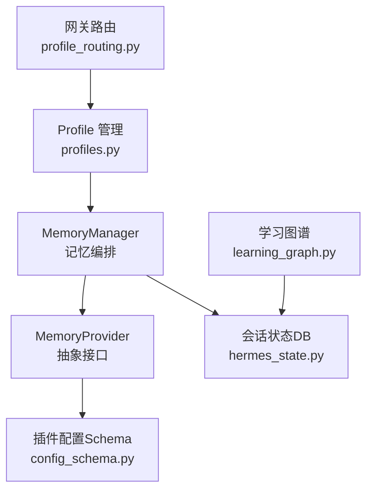
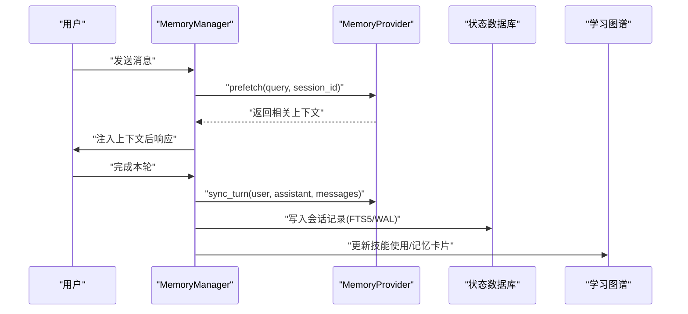
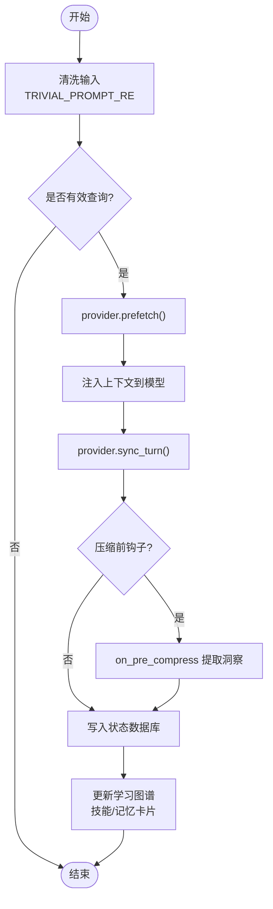
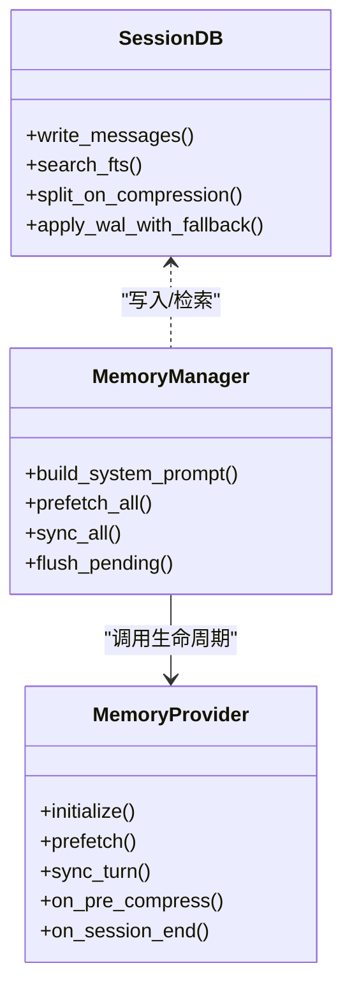
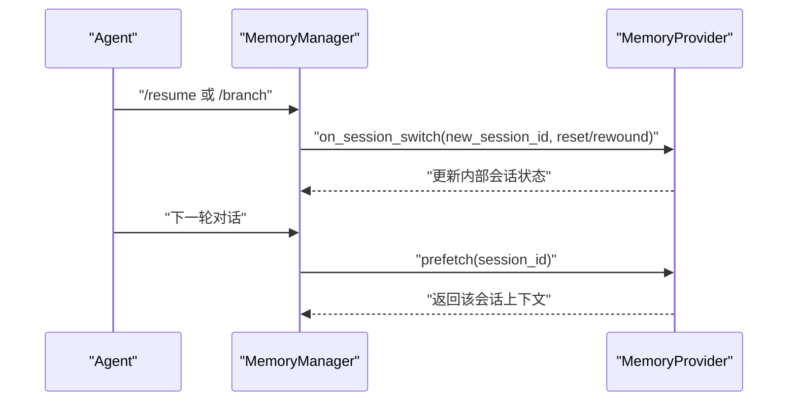
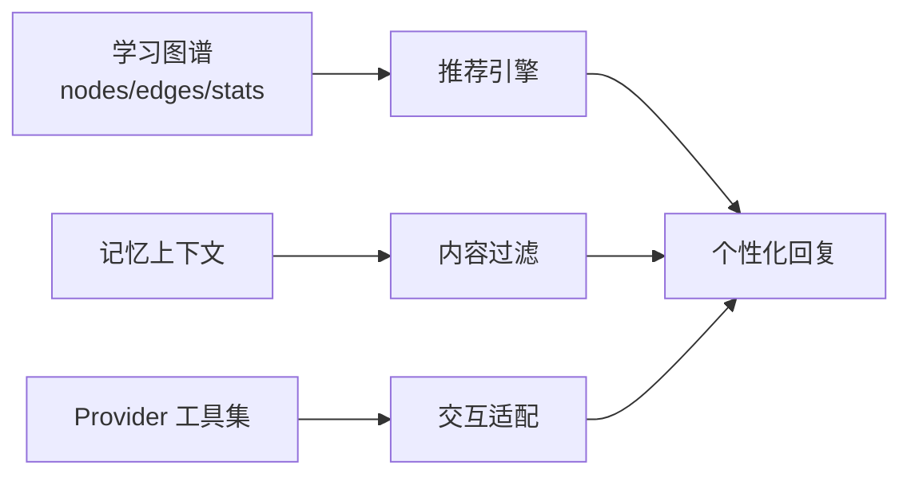
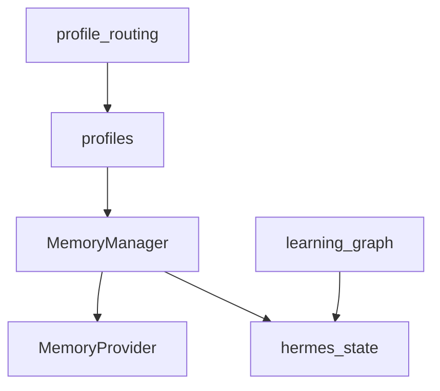

# 用户画像构建

<cite>
**本文引用的文件**
- [agent/memory_manager.py](file://agent/memory_manager.py)
- [agent/memory_provider.py](file://agent/memory_provider.py)
- [plugins/memory/config_schema.py](file://plugins/memory/config_schema.py)
- [hermes_cli/profiles.py](file://hermes_cli/profiles.py)
- [gateway/profile_routing.py](file://gateway/profile_routing.py)
- [hermes_state.py](file://hermes_state.py)
- [agent/learning_graph.py](file://agent/learning_graph.py)
</cite>

## 目录
1. [简介](#简介)
2. [项目结构](#项目结构)
3. [核心组件](#核心组件)
4. [架构总览](#架构总览)
5. [详细组件分析](#详细组件分析)
6. [依赖关系分析](#依赖关系分析)
7. [性能考量](#性能考量)
8. [故障排查指南](#故障排查指南)
9. [结论](#结论)
10. [附录](#附录)

## 简介
本文件面向开发者与产品工程师，系统化阐述 Hermes Agent 中的“用户画像构建”能力：如何从对话行为中自动提取兴趣、技能偏好与使用习惯；如何将画像数据结构化存储、版本化并保护隐私；如何在跨会话中保持一致性；以及如何将画像用于对话个性化（推荐、内容过滤、交互方式适配）。文档同时覆盖配置自定义、数据导出、质量评估、调试工具与扩展第三方数据的实践建议。

## 项目结构
围绕用户画像的关键代码分布在以下模块：
- 记忆编排与提供者抽象：MemoryManager 与 MemoryProvider 接口，负责在每轮对话前后进行上下文召回与持久化。
- 插件化配置：memory provider 的声明式配置 schema，驱动桌面端与 Web 端统一渲染与写入。
- 多 Profile 隔离：profiles 管理每个独立 HERMES_HOME 下的配置、记忆、会话、技能等，确保画像按用户/角色隔离。
- 网关路由：基于平台与聊天范围将请求路由到不同 profile，实现多租户/多角色的画像隔离。
- 状态存储：SQLite 会话数据库，提供 FTS5 全文检索、压缩拆分、WAL 模式与迁移兼容。
- 学习图谱：将“学到的技能”和“记忆卡片”组织为图，支持可视化与关联分析。

图表来源
- [agent/memory_manager.py:364-800](file://agent/memory_manager.py#L364-L800)
- [agent/memory_provider.py:81-358](file://agent/memory_provider.py#L81-L358)
- [plugins/memory/config_schema.py:94-145](file://plugins/memory/config_schema.py#L94-L145)
- [hermes_cli/profiles.py:1-127](file://hermes_cli/profiles.py#L1-L127)
- [gateway/profile_routing.py:50-167](file://gateway/profile_routing.py#L50-L167)
- [hermes_state.py:1-125](file://hermes_state.py#L1-L125)
- [agent/learning_graph.py:254-323](file://agent/learning_graph.py#L254-L323)

章节来源
- [agent/memory_manager.py:364-800](file://agent/memory_manager.py#L364-L800)
- [agent/memory_provider.py:81-358](file://agent/memory_provider.py#L81-L358)
- [plugins/memory/config_schema.py:94-145](file://plugins/memory/config_schema.py#L94-L145)
- [hermes_cli/profiles.py:1-127](file://hermes_cli/profiles.py#L1-L127)
- [gateway/profile_routing.py:50-167](file://gateway/profile_routing.py#L50-L167)
- [hermes_state.py:1-125](file://hermes_state.py#L1-L125)
- [agent/learning_graph.py:254-323](file://agent/learning_graph.py#L254-L323)

## 核心组件
- MemoryManager：单点集成入口，协调内置与外部 memory provider，负责系统提示组装、每轮预取（prefetch）、完成后同步（sync）以及后台任务调度。
- MemoryProvider：抽象接口，定义生命周期钩子（initialize、system_prompt_block、prefetch、queue_prefetch、sync_turn、get_tool_schemas、handle_tool_call、shutdown），以及可选钩子（on_turn_start、on_session_end、on_session_switch、on_pre_compress、on_delegation、backup_paths）。
- 配置 Schema：以声明式字段描述 memory provider 的配置项，支持文本、选择、密钥、布尔、数字、JSON 等类型，并通过 web_server 通用读写逻辑落地。
- Profiles：多实例隔离，每个 profile 拥有独立的 config.yaml、.env、memories、sessions、skills 等，支持克隆、别名、导出与导入。
- 网关路由：根据 platform/guild/chat/thread 匹配规则将请求路由到指定 profile，实现多角色画像隔离。
- 状态存储：SQLite 会话数据库，支持 WAL、FTS5、压缩触发拆分、迁移兼容与安全限制（如最大消息数）。
- 学习图谱：将“学到的技能”与“记忆卡片”组织为节点与边，支持密度统计、类别聚合与可视化。

章节来源
- [agent/memory_manager.py:364-800](file://agent/memory_manager.py#L364-L800)
- [agent/memory_provider.py:81-358](file://agent/memory_provider.py#L81-L358)
- [plugins/memory/config_schema.py:94-145](file://plugins/memory/config_schema.py#L94-L145)
- [hermes_cli/profiles.py:1-127](file://hermes_cli/profiles.py#L1-L127)
- [gateway/profile_routing.py:50-167](file://gateway/profile_routing.py#L50-L167)
- [hermes_state.py:1-125](file://hermes_state.py#L1-L125)
- [agent/learning_graph.py:254-323](file://agent/learning_graph.py#L254-L323)

## 架构总览
下图展示一轮对话中画像相关的数据流：用户输入经 MemoryManager 预取相关上下文，注入到模型调用；对话结束后，MemoryManager 将本轮对话异步持久化至 memory provider 与状态数据库；学习图谱可读取记忆与技能使用情况生成可视化。

图表来源
- [agent/memory_manager.py:525-694](file://agent/memory_manager.py#L525-L694)
- [agent/memory_provider.py:132-188](file://agent/memory_provider.py#L132-L188)
- [hermes_state.py:1-125](file://hermes_state.py#L1-L125)
- [agent/learning_graph.py:254-323](file://agent/learning_graph.py#L254-L323)

## 详细组件分析

### 自动画像生成与偏好学习机制
- 行为采集：通过 MemoryProvider 的 sync_turn 接收每轮对话（含 tool_calls/tool_results），结合 on_session_end 与 on_pre_compress 在会话边界或压缩前抽取洞察。
- 兴趣识别：MemoryManager 在 prefetch 阶段调用 provider 的 recall 逻辑，结合 TRIVIAL_PROMPT_RE 过滤无意义输入，避免噪声污染画像。
- 技能偏好：学习图谱模块扫描 SKILL.md 与 usage.json，统计 use_count、last_activity_at 等指标，推断用户偏好的技能类别与活跃度。
- 记忆卡片：MEMORY.md / USER.md 按分隔符切分为卡片，作为“第一类记忆节点”，与技能建立词法重叠边，形成“记忆-技能”关联。

图表来源
- [agent/memory_provider.py:52-79](file://agent/memory_provider.py#L52-L79)
- [agent/memory_manager.py:525-694](file://agent/memory_manager.py#L525-L694)
- [agent/learning_graph.py:193-245](file://agent/learning_graph.py#L193-L245)

章节来源
- [agent/memory_provider.py:52-79](file://agent/memory_provider.py#L52-L79)
- [agent/memory_manager.py:525-694](file://agent/memory_manager.py#L525-L694)
- [agent/learning_graph.py:193-245](file://agent/learning_graph.py#L193-L245)

### 画像数据的结构化存储、版本管理与隐私保护
- 结构化存储：会话历史与元数据存入 SQLite，启用 FTS5 全文检索；支持压缩触发的会话拆分（parent_session_id 链），便于长期维护。
- 版本管理：状态库包含 SCHEMA_VERSION、FTS_STORAGE_VERSION 等迁移标记；WAL 模式与 macOS 专属 PRAGMA 保障一致性。
- 隐私保护：
  - 内存上下文块用 <memory-context> 围栏包裹，并提供 StreamingContextScrubber 在流式输出中安全丢弃内部上下文片段。
  - 终端工具错误与回溯会脱敏敏感字符串，防止凭证泄露。
  - 导出时排除敏感运行时工件（state.db、.env、auth.*、日志等），仅保留用户可见面。

图表来源
- [hermes_state.py:1-125](file://hermes_state.py#L1-L125)
- [agent/memory_manager.py:364-800](file://agent/memory_manager.py#L364-L800)
- [agent/memory_provider.py:81-358](file://agent/memory_provider.py#L81-L358)

章节来源
- [hermes_state.py:1-125](file://hermes_state.py#L1-L125)
- [agent/memory_manager.py:174-361](file://agent/memory_manager.py#L174-L361)
- [tests/tools/test_terminal_error_redaction.py:1-154](file://tests/tools/test_terminal_error_redaction.py#L1-L154)
- [hermes_cli/profiles.py:199-247](file://hermes_cli/profiles.py#L199-L247)

### 跨会话一致性与画像更新策略、冲突解决
- 跨会话一致性：
  - on_session_switch 钩子在 /resume、/branch、/reset、/new 及上下文压缩时通知 provider 切换 session_id，确保后续写入落盘到正确会话。
  - 状态库通过 parent_session_id 链维护压缩后的会话分支关系，保证历史可追溯。
- 画像更新策略：
  - prefetch 在前置阶段快速召回，queue_prefetch 在后置阶段为下一轮预热，避免阻塞主流程。
  - sync_turn 在后台串行执行（单 worker），保证 turn N 先于 turn N+1 落盘。
- 冲突解决：
  - 外部 provider 仅允许注册一个，避免工具 schema 膨胀与后端冲突。
  - 工具名冲突会被拒绝并记录警告，核心工具名优先。

图表来源
- [agent/memory_provider.py:214-256](file://agent/memory_provider.py#L214-L256)
- [hermes_state.py:1-125](file://hermes_state.py#L1-L125)
- [agent/memory_manager.py:404-470](file://agent/memory_manager.py#L404-L470)

章节来源
- [agent/memory_provider.py:214-256](file://agent/memory_provider.py#L214-L256)
- [hermes_state.py:1-125](file://hermes_state.py#L1-L125)
- [agent/memory_manager.py:404-470](file://agent/memory_manager.py#L404-L470)

### 画像在对话个性化中的应用
- 推荐系统：基于学习图谱的“技能-记忆”边与 use_count，向用户推荐最近活跃或高相关性的技能/知识。
- 内容过滤：通过 TRIVIAL_PROMPT_RE 与 sanitize_context 过滤无意义输入与内部上下文，减少噪声对回复的影响。
- 交互方式适配：根据 provider 的 system_prompt_block 与工具集暴露，动态调整交互界面与可用能力（例如是否开启 memory 工具）。

图表来源
- [agent/learning_graph.py:254-323](file://agent/learning_graph.py#L254-L323)
- [agent/memory_manager.py:174-361](file://agent/memory_manager.py#L174-L361)
- [agent/memory_provider.py:123-188](file://agent/memory_provider.py#L123-L188)

章节来源
- [agent/learning_graph.py:254-323](file://agent/learning_graph.py#L254-L323)
- [agent/memory_manager.py:174-361](file://agent/memory_manager.py#L174-L361)
- [agent/memory_provider.py:123-188](file://agent/memory_provider.py#L123-L188)

### 画像配置的自定义选项、数据导出与隐私控制
- 自定义选项：memory provider 通过 ProviderConfigSchema 声明字段（text/select/secret/bool/number/json），由 web_server 通用渲染与写入；支持 env_key、aliases、env_fallbacks、scope 等。
- 数据导出：默认 profile 导出时排除基础设施与敏感工件，仅打包用户可见面（config.yaml、SOUL.md、MEMORY.md、USER.md、skills、cron、sessions、plugins、memories、knowledge、preferences 等）。
- 隐私控制：
  - 密钥字段不通过 API 回显，仅显示是否已设置。
  - 终端工具错误与回溯脱敏，避免凭证泄露。
  - 状态库 WAL 模式与 macOS 专属 PRAGMA 保障数据完整性。

章节来源
- [plugins/memory/config_schema.py:30-145](file://plugins/memory/config_schema.py#L30-L145)
- [hermes_cli/profiles.py:199-247](file://hermes_cli/profiles.py#L199-L247)
- [tests/tools/test_terminal_error_redaction.py:1-154](file://tests/tools/test_terminal_error_redaction.py#L1-L154)
- [hermes_state.py:486-780](file://hermes_state.py#L486-L780)

### 画像质量评估、调试工具与性能优化建议
- 质量评估：
  - 学习图谱 stats 提供 edges_per_node、isolated_pct、top_categories、learned_skills 等指标，衡量画像密度与覆盖度。
  - 会话导出/恢复限制（max_export_messages、max_resume_messages）防止超大会话导致性能问题。
- 调试工具：
  - flush_pending 等待后台任务完成，便于测试断言 provider 状态。
  - get_last_init_error 获取状态库初始化失败原因，辅助诊断 WAL/文件系统兼容性问题。
- 性能优化：
  - prefetch 超时控制（external_prefetch_timeout）避免慢 provider 阻塞。
  - 单 worker 串行 sync，避免并发写竞争与死锁。
  - 学习图谱缓存 skills_dir 签名，降低重复扫描成本。

章节来源
- [agent/learning_graph.py:171-189](file://agent/learning_graph.py#L171-L189)
- [hermes_state.py:114-125](file://hermes_state.py#L114-L125)
- [agent/memory_manager.py:597-780](file://agent/memory_manager.py#L597-L780)
- [hermes_state.py:557-694](file://hermes_state.py#L557-L694)

### 扩展画像维度与集成第三方用户数据的技术指导
- 扩展维度：
  - 新增 MemoryProvider 实现，并在 initialize 中连接外部后端；在 prefetch/sync_turn/on_pre_compress 中实现画像抽取与写入。
  - 通过 on_memory_write 镜像内置 memory 工具的写入，保持内外一致。
- 集成第三方数据：
  - 使用 backup_paths 声明外部路径，纳入 hermes backup/import 流程。
  - 通过 ProviderConfigSchema 声明配置项，支持 secret 字段与环境变量回退。
  - 利用 gateway profile_routes 将不同平台/频道映射到不同 profile，实现多租户画像隔离。

章节来源
- [agent/memory_provider.py:193-358](file://agent/memory_provider.py#L193-L358)
- [plugins/memory/config_schema.py:94-145](file://plugins/memory/config_schema.py#L94-L145)
- [gateway/profile_routing.py:50-167](file://gateway/profile_routing.py#L50-L167)

## 依赖关系分析
- MemoryManager 依赖 MemoryProvider 抽象，且最多允许一个外部 provider，避免工具 schema 冲突。
- 状态库 hermes_state 被 MemoryManager 与 CLI/Gateway 广泛使用，提供会话持久化与搜索。
- profiles 与 profile_routing 共同实现多 profile 隔离与路由，确保画像按用户/角色隔离。
- learning_graph 依赖 skills 与 memories 文件，结合 usage.json 生成图谱。

图表来源
- [agent/memory_manager.py:364-800](file://agent/memory_manager.py#L364-L800)
- [hermes_state.py:1-125](file://hermes_state.py#L1-L125)
- [gateway/profile_routing.py:50-167](file://gateway/profile_routing.py#L50-L167)
- [hermes_cli/profiles.py:1-127](file://hermes_cli/profiles.py#L1-L127)
- [agent/learning_graph.py:254-323](file://agent/learning_graph.py#L254-L323)

章节来源
- [agent/memory_manager.py:364-800](file://agent/memory_manager.py#L364-L800)
- [hermes_state.py:1-125](file://hermes_state.py#L1-L125)
- [gateway/profile_routing.py:50-167](file://gateway/profile_routing.py#L50-L167)
- [hermes_cli/profiles.py:1-127](file://hermes_cli/profiles.py#L1-L127)
- [agent/learning_graph.py:254-323](file://agent/learning_graph.py#L254-L323)

## 性能考量
- 预取超时：external_prefetch_timeout 控制外部 provider 预取耗时，避免阻塞主循环。
- 后台串行：sync 与 queue_prefetch 通过单 worker 串行执行，保证顺序与资源可控。
- 会话限制：max_export_messages 与 max_resume_messages 防止超大会话导致的内存与 IO 压力。
- 图谱缓存：skills_dir 签名缓存减少重复扫描，提升列表与统计性能。

[本节为通用性能讨论，无需特定文件引用]

## 故障排查指南
- 状态库不可用：使用 format_session_db_unavailable 获取具体原因（如 NFS/SMB 上的 WAL 协议问题），并根据提示调整部署环境。
- 测试隔离：_ensure_test_isolation 阻止 pytest 误开生产 state.db，避免破坏真实数据。
- 终端错误脱敏：确保错误与回溯不包含敏感信息，必要时关闭 redact 开关进行测试。
- 提供商冲突：若注册多个外部 provider，MemoryManager 会拒绝并记录警告，检查 memory.provider 配置。

章节来源
- [hermes_state.py:674-694](file://hermes_state.py#L674-L694)
- [hermes_state.py:460-483](file://hermes_state.py#L460-L483)
- [tests/tools/test_terminal_error_redaction.py:1-154](file://tests/tools/test_terminal_error_redaction.py#L1-L154)
- [agent/memory_manager.py:404-470](file://agent/memory_manager.py#L404-L470)

## 结论
Hermes Agent 的用户画像体系以 MemoryManager 为核心，结合 MemoryProvider 抽象、声明式配置、多 Profile 隔离与 SQLite 状态库，实现了从行为采集、兴趣识别、技能偏好到跨会话一致性的完整闭环。学习图谱提供了可视化的画像质量评估与调试手段。通过严格的隐私保护与性能优化策略，系统在可扩展性与安全性之间取得平衡。开发者可通过扩展 provider、配置 schema 与 profile routes 灵活集成第三方数据，满足多样化业务需求。

## 附录
- 关键术语
  - 画像：对用户兴趣、技能偏好与使用习惯的结构化表示。
  - 预取（prefetch）：在模型调用前召回相关上下文。
  - 同步（sync）：在对话完成后持久化本轮内容。
  - 学习图谱：将技能与记忆组织为图，支持可视化与分析。
- 最佳实践
  - 使用 on_session_switch 维护 provider 的会话状态。
  - 通过 ProviderConfigSchema 声明配置，避免硬编码。
  - 利用 flush_pending 在测试中等待后台任务完成。
  - 关注学习图谱 stats，持续优化画像质量。

[本节为概念性说明，无需特定文件引用]