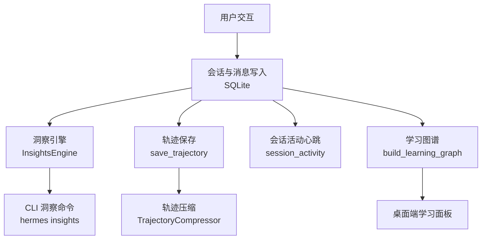
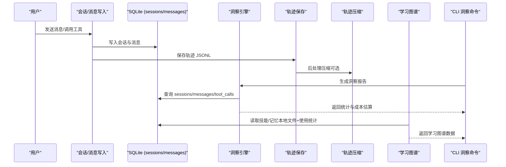
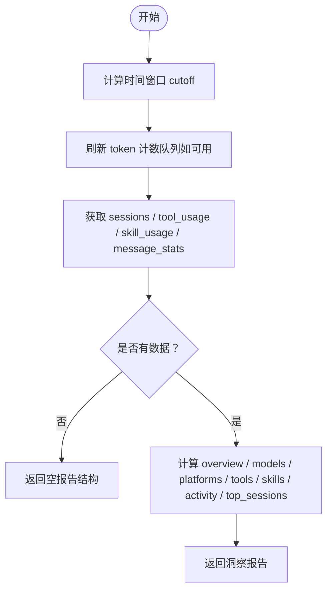
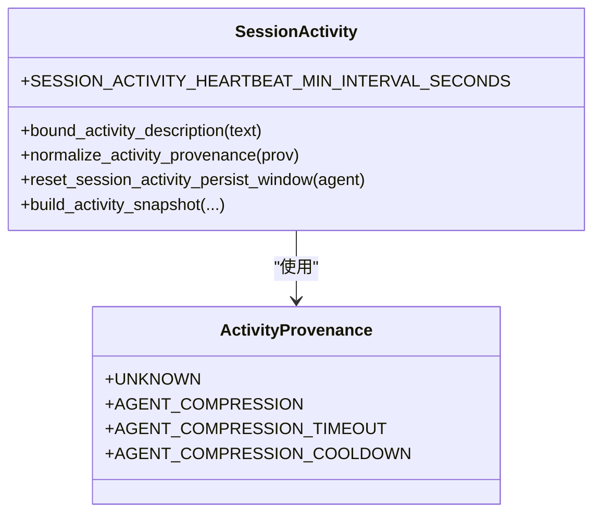
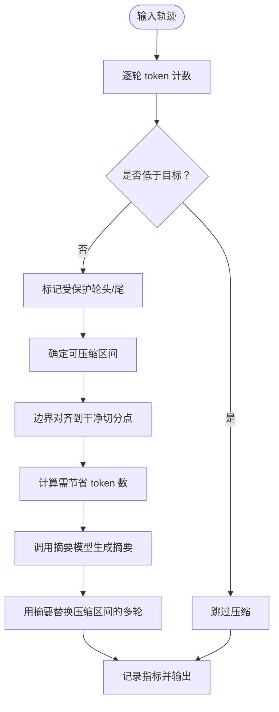
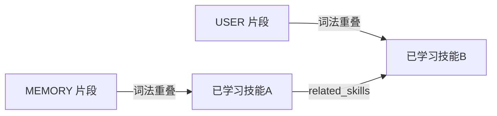
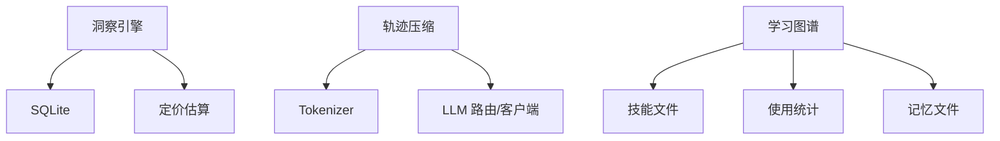

# 用户行为分析

<cite>
**本文引用的文件**
- [agent/insights.py](file://agent/insights.py)
- [agent/session_activity.py](file://agent/session_activity.py)
- [agent/trajectory.py](file://agent/trajectory.py)
- [trajectory_compressor.py](file://trajectory_compressor.py)
- [agent/learning_graph.py](file://agent/learning_graph.py)
- [hermes_cli/subcommands/insights.py](file://hermes_cli/subcommands/insights.py)
- [tests/tools/test_terminal_error_redaction.py](file://tests/tools/test_terminal_error_redaction.py)
</cite>

## 目录
1. [简介](#简介)
2. [项目结构](#项目结构)
3. [核心组件](#核心组件)
4. [架构总览](#架构总览)
5. [详细组件分析](#详细组件分析)
6. [依赖关系分析](#依赖关系分析)
7. [性能考量](#性能考量)
8. [故障排查指南](#故障排查指南)
9. [结论](#结论)
10. [附录](#附录)

## 简介
本文件面向开发者与数据分析师，系统化阐述如何在 Hermes Agent 中从用户交互中提取行为模式与偏好特征。内容覆盖：
- 对话历史分析与轨迹压缩
- 交互频率统计、工具使用偏好与技能使用偏好
- 行为序列识别与学习图谱构建
- 数据采集机制、时间窗口管理与模式匹配策略
- 意图识别、兴趣领域分类与行为习惯建模的技术实现
- 数据清洗、去噪与标准化流程
- 配置选项、自定义规则与结果可视化
- 性能优化建议、调试工具与异常处理机制
- 扩展行为分析维度与集成外部数据源的方法

## 项目结构
围绕“用户行为分析”的关键代码主要分布在以下模块：
- 会话洞察引擎：聚合会话、消息、工具与技能使用统计，并输出成本估算与平台/模型分解
- 会话活动心跳：记录最近活动时间、来源与描述，控制持久化频率
- 轨迹保存与压缩：保存原始对话轨迹，并在后处理阶段按预算压缩以保留训练信号
- 学习图谱：将“已学习的技能”和“记忆片段”组织为图，支持兴趣领域与关联关系可视化
- CLI 入口：提供 /insights 命令用于生成与展示洞察报告

图表来源
- [agent/insights.py:85-197](file://agent/insights.py#L85-L197)
- [agent/trajectory.py:30-57](file://agent/trajectory.py#L30-L57)
- [trajectory_compressor.py:332-356](file://trajectory_compressor.py#L332-L356)
- [agent/session_activity.py:19-29](file://agent/session_activity.py#L19-L29)
- [agent/learning_graph.py:254-323](file://agent/learning_graph.py#L254-L323)
- [hermes_cli/subcommands/insights.py](file://hermes_cli/subcommands/insights.py)

章节来源
- [agent/insights.py:85-197](file://agent/insights.py#L85-L197)
- [agent/trajectory.py:30-57](file://agent/trajectory.py#L30-L57)
- [trajectory_compressor.py:332-356](file://trajectory_compressor.py#L332-L356)
- [agent/session_activity.py:19-29](file://agent/session_activity.py#L19-L29)
- [agent/learning_graph.py:254-323](file://agent/learning_graph.py#L254-L323)
- [hermes_cli/subcommands/insights.py](file://hermes_cli/subcommands/insights.py)

## 核心组件
- 洞察引擎 InsightsEngine：基于 SQLite 的会话与消息数据，计算 token 用量、成本估算、工具/技能使用分布、平台/模型分解、活动趋势与热门会话等
- 会话活动心跳：维护最近活动时间戳、描述与来源，限制持久化频率，避免对 SessionDB 造成写压力
- 轨迹保存与压缩：将完整对话轨迹落盘；后处理时按目标 token 预算压缩中间段，用摘要替换被压缩区域，保留首尾关键信息
- 学习图谱：扫描技能文件与记忆片段，构建节点与边，输出密度统计与聚类信息，便于兴趣领域与关联关系可视化
- CLI 洞察命令：封装洞察引擎调用，输出终端可读的报告

章节来源
- [agent/insights.py:85-197](file://agent/insights.py#L85-L197)
- [agent/session_activity.py:19-29](file://agent/session_activity.py#L19-L29)
- [agent/trajectory.py:30-57](file://agent/trajectory.py#L30-L57)
- [trajectory_compressor.py:332-356](file://trajectory_compressor.py#L332-L356)
- [agent/learning_graph.py:254-323](file://agent/learning_graph.py#L254-L323)
- [hermes_cli/subcommands/insights.py](file://hermes_cli/subcommands/insights.py)

## 架构总览
下图展示了从用户交互到行为分析的端到端流程：采集、存储、洞察、可视化与后处理。

图表来源
- [agent/insights.py:128-197](file://agent/insights.py#L128-L197)
- [agent/trajectory.py:30-57](file://agent/trajectory.py#L30-L57)
- [trajectory_compressor.py:743-800](file://trajectory_compressor.py#L743-L800)
- [agent/learning_graph.py:254-323](file://agent/learning_graph.py#L254-L323)
- [hermes_cli/subcommands/insights.py](file://hermes_cli/subcommands/insights.py)

## 详细组件分析

### 洞察引擎（InsightsEngine）
- 功能要点
  - 时间窗口过滤：通过 days 参数计算 cutoff，仅统计指定时间段内的会话
  - 数据聚合：汇总 token 用量、工具调用次数、消息数量、会话时长、成本估算
  - 多维度分解：按模型、平台/source、工具、技能进行分组统计
  - 索引兼容：自动探测并回退到无索引的查询形式，保证只读旧数据库可用
  - 成本估算：结合模型、provider、base_url 估算 USD 成本，并区分已知/未知定价
- 关键流程
  - generate()：收集 raw 数据并计算 overview、models、platforms、tools、skills、activity、top_sessions
  - get_usage_breakdown()：轻量接口，仅返回工具与技能使用分布
  - SQL 查询：使用预编译字符串，避免注入风险；对 tool_calls JSON 解析做容错处理

图表来源
- [agent/insights.py:128-197](file://agent/insights.py#L128-L197)
- [agent/insights.py:285-467](file://agent/insights.py#L285-L467)
- [agent/insights.py:473-565](file://agent/insights.py#L473-L565)
- [agent/insights.py:567-752](file://agent/insights.py#L567-L752)
- [agent/insights.py:754-796](file://agent/insights.py#L754-L796)

章节来源
- [agent/insights.py:85-197](file://agent/insights.py#L85-L197)
- [agent/insights.py:285-467](file://agent/insights.py#L285-L467)
- [agent/insights.py:473-565](file://agent/insights.py#L473-L565)
- [agent/insights.py:567-752](file://agent/insights.py#L567-L752)
- [agent/insights.py:754-796](file://agent/insights.py#L754-L796)

### 会话活动心跳（Session Activity）
- 设计目标
  - 观察型心跳：仅记录 last_activity_at、description、provenance，不触发业务逻辑
  - 持久化节流：最小间隔 60 秒，避免对 SessionDB 写路径造成竞争
  - 来源规范化：统一 unknown/agent.compression 等来源枚举
- 关键能力
  - 构建快照：包含相对当前时间的 elapsed 秒数与别名字段，供网关/委托方消费
  - 重置窗口：在特定场景（如压缩标签更新）强制下一次持久化

图表来源
- [agent/session_activity.py:19-29](file://agent/session_activity.py#L19-L29)
- [agent/session_activity.py:32-60](file://agent/session_activity.py#L32-L60)
- [agent/session_activity.py:63-107](file://agent/session_activity.py#L63-L107)

章节来源
- [agent/session_activity.py:19-29](file://agent/session_activity.py#L19-L29)
- [agent/session_activity.py:32-60](file://agent/session_activity.py#L32-L60)
- [agent/session_activity.py:63-107](file://agent/session_activity.py#L63-L107)

### 轨迹保存与压缩（Trajectory Save & Compress）
- 轨迹保存
  - 将 ShareGPT 格式的对话列表追加到 JSONL，附带时间戳、模型名与完成状态
- 轨迹压缩
  - 保护头部：system/human/gpt/tool 的首次出现
  - 保护尾部：最后 N 轮
  - 压缩中段：从第 2 个 tool response 开始，仅压缩到满足目标 token 预算
  - 摘要替换：用单条人类可读摘要替代被压缩区域，保持后续工具调用链完整
  - 指标统计：记录压缩前后 token/turn 数、API 调用与错误率

图表来源
- [agent/trajectory.py:30-57](file://agent/trajectory.py#L30-L57)
- [trajectory_compressor.py:332-356](file://trajectory_compressor.py#L332-L356)
- [trajectory_compressor.py:477-563](file://trajectory_compressor.py#L477-L563)
- [trajectory_compressor.py:605-673](file://trajectory_compressor.py#L605-L673)
- [trajectory_compressor.py:743-800](file://trajectory_compressor.py#L743-L800)

章节来源
- [agent/trajectory.py:30-57](file://agent/trajectory.py#L30-L57)
- [trajectory_compressor.py:332-356](file://trajectory_compressor.py#L332-L356)
- [trajectory_compressor.py:477-563](file://trajectory_compressor.py#L477-L563)
- [trajectory_compressor.py:605-673](file://trajectory_compressor.py#L605-L673)
- [trajectory_compressor.py:743-800](file://trajectory_compressor.py#L743-L800)

### 学习图谱（Learning Graph）
- 节点来源
  - 非基础安装的技能（profile 或 agent 创建），含使用次数、状态、相关技能
  - MEMORY.md / USER.md 的记忆片段作为独立节点
- 边来源
  - related_skills 声明的直接关联
  - 记忆与技能的词法重叠评分，取前几名建立边
- 输出
  - 节点、边、聚类统计、密度指标（孤立比例、类别分布等）

图表来源
- [agent/learning_graph.py:125-153](file://agent/learning_graph.py#L125-L153)
- [agent/learning_graph.py:156-168](file://agent/learning_graph.py#L156-L168)
- [agent/learning_graph.py:193-245](file://agent/learning_graph.py#L193-L245)
- [agent/learning_graph.py:254-323](file://agent/learning_graph.py#L254-L323)

章节来源
- [agent/learning_graph.py:125-153](file://agent/learning_graph.py#L125-L153)
- [agent/learning_graph.py:156-168](file://agent/learning_graph.py#L156-L168)
- [agent/learning_graph.py:193-245](file://agent/learning_graph.py#L193-L245)
- [agent/learning_graph.py:254-323](file://agent/learning_graph.py#L254-L323)

### CLI 洞察命令
- 作用：封装洞察引擎，提供终端可读的报告输出
- 典型用法：指定天数范围与可选 source 过滤，生成模型/平台/工具/技能/活动等多维洞察

章节来源
- [hermes_cli/subcommands/insights.py](file://hermes_cli/subcommands/insights.py)

## 依赖关系分析
- 洞察引擎依赖
  - SQLite 连接：直接查询 sessions/messages 表
  - 定价估算：通过 usage_pricing 模块估算成本
  - 索引兼容：运行时检测并回退到无索引查询
- 轨迹压缩依赖
  - Tokenizer：用于 token 计数
  - LLM 路由：通过辅助客户端或直接 OpenAI 客户端调用摘要模型
  - 重试与退避：失败时指数退避重试
- 学习图谱依赖
  - 技能文件扫描：遍历 base/profile 技能目录
  - 使用统计：读取 skills/.usage.json 或工具层 load_usage
  - 记忆文件：读取 memories/MEMORY.md 与 USER.md

图表来源
- [agent/insights.py:85-197](file://agent/insights.py#L85-L197)
- [trajectory_compressor.py:332-356](file://trajectory_compressor.py#L332-L356)
- [agent/learning_graph.py:254-323](file://agent/learning_graph.py#L254-L323)

章节来源
- [agent/insights.py:85-197](file://agent/insights.py#L85-L197)
- [trajectory_compressor.py:332-356](file://trajectory_compressor.py#L332-L356)
- [agent/learning_graph.py:254-323](file://agent/learning_graph.py#L254-L323)

## 性能考量
- 洞察引擎
  - 使用预编译 SQL 与 INDEXED BY 提示，确保查询计划稳定
  - 对旧数据库无索引场景自动回退，避免只读模式下崩溃
  - 仅在必要时 flush token 计数队列，减少额外写压力
- 轨迹压缩
  - 保护首尾轮，仅压缩中段，降低摘要模型调用量
  - 支持并发请求与超时控制，提升吞吐
  - 指标统计帮助评估压缩效果与 API 成功率
- 会话活动心跳
  - 固定最小间隔（60 秒）持久化，避免高频写导致竞争
  - 描述长度上限，控制存储体积

[本节为通用性能指导，不直接分析具体文件]

## 故障排查指南
- 终端工具错误脱敏
  - 测试用例验证错误与回溯中的敏感信息会被脱敏，防止泄露密钥
  - 若发现未脱敏，检查 redact 开关与命令感知脱敏器是否生效
- 洞察引擎只读旧库
  - 若遇到 no such index 错误，确认初始化逻辑已回退到无索引查询
- 轨迹压缩失败
  - 检查摘要模型配置、API Key 与网络连通性
  - 查看指标中的 summarization_errors 与 success_rate，定位失败原因
- 学习图谱为空
  - 确认 profile 技能目录存在且包含 SKILL.md
  - 检查 memories 目录下是否存在 MEMORY.md / USER.md

章节来源
- [tests/tools/test_terminal_error_redaction.py:1-154](file://tests/tools/test_terminal_error_redaction.py#L1-L154)
- [agent/insights.py:106-127](file://agent/insights.py#L106-L127)
- [trajectory_compressor.py:605-673](file://trajectory_compressor.py#L605-L673)
- [agent/learning_graph.py:254-323](file://agent/learning_graph.py#L254-L323)

## 结论
Hermes Agent 的行为分析体系以 SQLite 为中心，结合洞察引擎、轨迹保存与压缩、学习图谱与 CLI 命令，形成从采集到可视化的闭环。通过严格的时间窗口管理、稳健的索引兼容、可控的持久化频率与详细的指标统计，系统能够在高负载下稳定运行并提供高质量的行为洞察。开发者可在此基础上扩展新的行为维度、接入外部数据源，并通过可视化面板与 CLI 快速获得洞察结果。

[本节为总结性内容，不直接分析具体文件]

## 附录

### 行为数据的采集机制与时间窗口管理
- 采集点
  - 会话与会话内消息：token 用量、工具调用、平台/source、时间戳
  - 工具调用：从 tool_name 与 assistant 的 tool_calls JSON 双源合并统计
  - 技能使用：从 skill_view/skill_manage 调用提取技能名与次数
- 时间窗口
  - 通过 days 参数计算 cutoff，仅统计该窗口内的会话
  - 洞察引擎在生成前会 flush token 计数队列，确保统计准确

章节来源
- [agent/insights.py:128-197](file://agent/insights.py#L128-L197)
- [agent/insights.py:285-467](file://agent/insights.py#L285-L467)

### 模式匹配策略与行为序列识别
- 工具/技能序列
  - 通过 assistant 的 tool_calls JSON 解析，识别连续的工具调用序列
  - 对 skill_view/skill_manage 进行专门识别，统计技能使用模式
- 学习图谱关联
  - related_skills 声明的直接关联
  - 记忆与技能的词法重叠评分，建立跨模态关联

章节来源
- [agent/insights.py:373-435](file://agent/insights.py#L373-L435)
- [agent/learning_graph.py:156-168](file://agent/learning_graph.py#L156-L168)
- [agent/learning_graph.py:227-245](file://agent/learning_graph.py#L227-L245)

### 意图识别、兴趣领域分类与行为习惯建模
- 意图识别
  - 基于工具调用与技能使用的上下文，推断用户当前任务意图
- 兴趣领域分类
  - 学习图谱的 category 聚类与密度统计，反映兴趣领域分布
- 行为习惯建模
  - 通过工具/技能使用频次、时间分布与序列模式，刻画用户习惯

章节来源
- [agent/learning_graph.py:254-323](file://agent/learning_graph.py#L254-L323)
- [agent/insights.py:754-796](file://agent/insights.py#L754-L796)

### 数据清洗、去噪与标准化
- 描述长度限制：活动描述截断至固定长度，避免存储膨胀
- 来源规范化：将任意来源映射为标准枚举，缺失则归为 unknown
- JSON 容错：tool_calls 解析失败时跳过，避免中断统计
- 脱敏：终端工具错误与回溯中的敏感信息自动脱敏

章节来源
- [agent/session_activity.py:42-60](file://agent/session_activity.py#L42-L60)
- [agent/insights.py:338-351](file://agent/insights.py#L338-L351)
- [tests/tools/test_terminal_error_redaction.py:1-154](file://tests/tools/test_terminal_error_redaction.py#L1-L154)

### 配置选项、自定义规则与结果可视化
- 轨迹压缩配置
  - 目标 token、摘要 token、保护轮数、并发请求数、超时、指标输出等
- 自定义规则
  - 可通过修改洞察引擎的 SQL 与聚合逻辑，增加新的行为维度
  - 学习图谱支持扩展 memory 与 skill 的关联规则
- 可视化
  - CLI 输出终端可读报告
  - 学习图谱输出节点、边与聚类统计，便于前端渲染

章节来源
- [trajectory_compressor.py:82-179](file://trajectory_compressor.py#L82-L179)
- [agent/insights.py:128-197](file://agent/insights.py#L128-L197)
- [agent/learning_graph.py:254-323](file://agent/learning_graph.py#L254-L323)

### 性能优化建议、调试工具与异常处理
- 性能优化
  - 洞察引擎：使用预编译 SQL 与索引提示；按需 flush 计数队列
  - 轨迹压缩：保护首尾轮，减少摘要调用；并发与超时控制
  - 会话活动：固定心跳间隔，避免写竞争
- 调试工具
  - 洞察引擎指标：cost_status、models_with/without_pricing
  - 轨迹压缩指标：compression_ratio、summarization_errors
  - 学习图谱密度：edges_per_node、isolated_pct
- 异常处理
  - 洞察引擎：索引不存在时回退；JSON 解析异常跳过
  - 轨迹压缩：摘要失败时降级为默认摘要；指数退避重试
  - 终端工具：错误与回溯脱敏，防止敏感信息泄露

章节来源
- [agent/insights.py:106-127](file://agent/insights.py#L106-L127)
- [agent/insights.py:338-351](file://agent/insights.py#L338-L351)
- [trajectory_compressor.py:605-673](file://trajectory_compressor.py#L605-L673)
- [tests/tools/test_terminal_error_redaction.py:1-154](file://tests/tools/test_terminal_error_redaction.py#L1-L154)

### 扩展行为分析维度与集成外部数据源
- 扩展维度
  - 在洞察引擎中新增聚合字段（如用户情绪、任务复杂度）
  - 在学习图谱中引入更多外部知识（如文档、知识库）作为节点
- 外部数据源
  - 通过插件或工具层将外部事件写入 sessions/messages
  - 在洞察引擎中扩展 SQL 查询，融合外部数据进行分析

[本节为通用扩展指导，不直接分析具体文件]