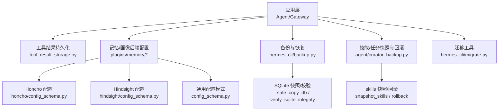
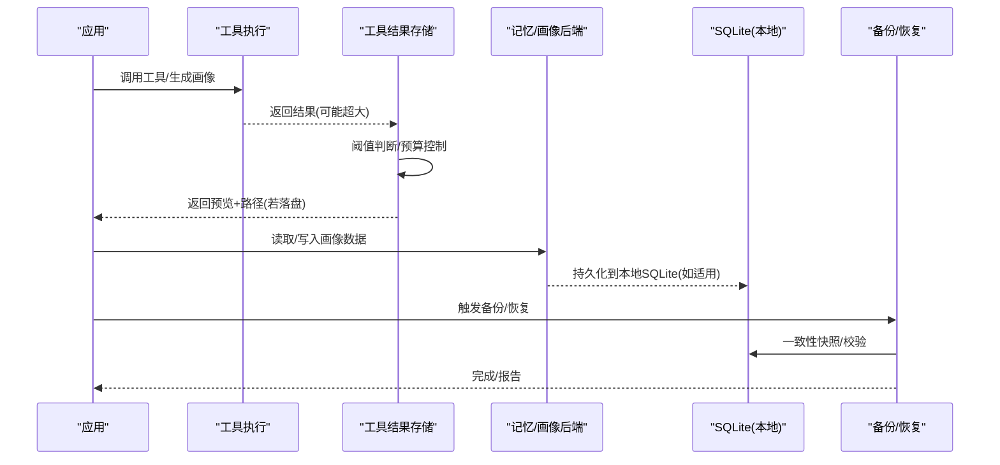
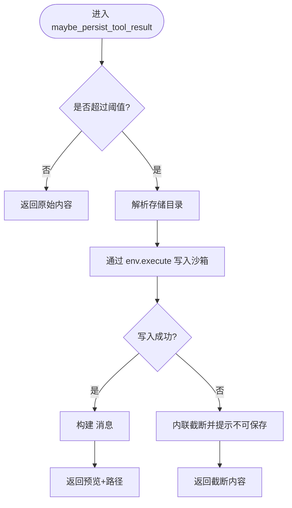
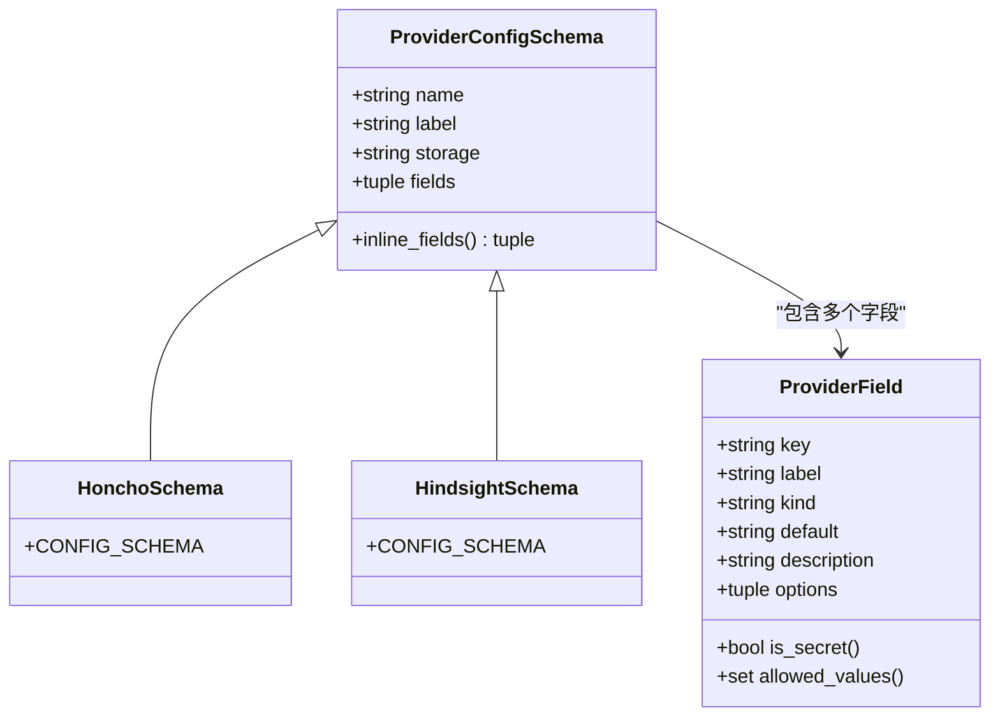
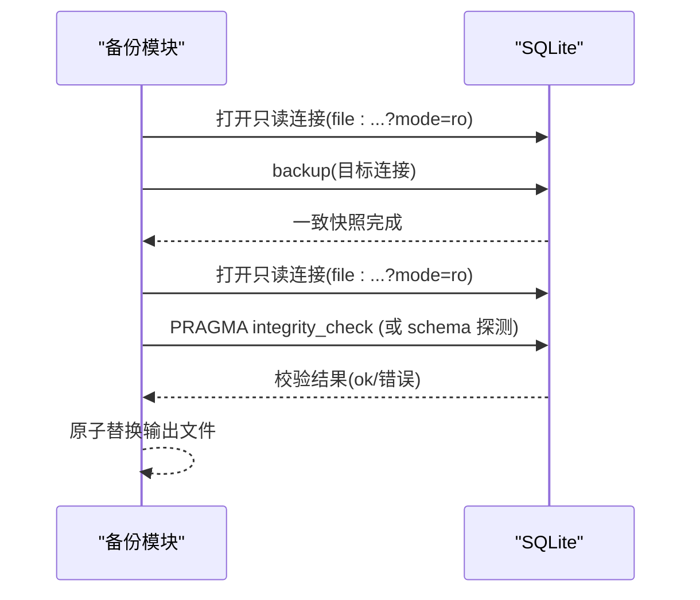
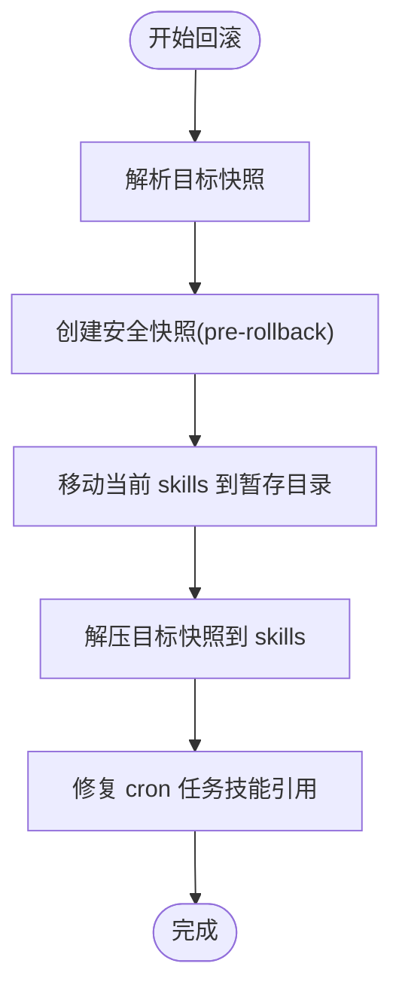
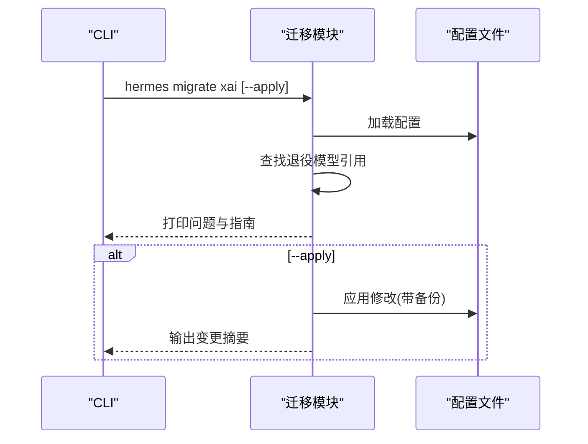
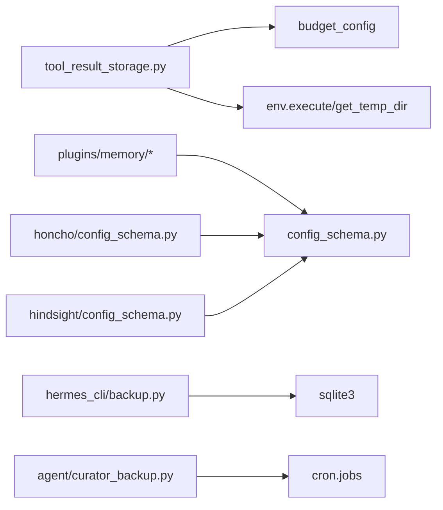

# 画像数据存储

<cite>
**本文引用的文件**
- [hermes_cli/backup.py](file://hermes_cli/backup.py)
- [agent/curator_backup.py](file://agent/curator_backup.py)
- [tools/tool_result_storage.py](file://tools/tool_result_storage.py)
- [plugins/memory/config_schema.py](file://plugins/memory/config_schema.py)
- [plugins/memory/honcho/config_schema.py](file://plugins/memory/honcho/config_schema.py)
- [plugins/memory/hindsight/config_schema.py](file://plugins/memory/hindsight/config_schema.py)
- [hermes_cli/migrate.py](file://hermes_cli/migrate.py)
</cite>

## 目录
1. [引言](#引言)
2. [项目结构](#项目结构)
3. [核心组件](#核心组件)
4. [架构总览](#架构总览)
5. [详细组件分析](#详细组件分析)
6. [依赖关系分析](#依赖关系分析)
7. [性能与容量管理](#性能与容量管理)
8. [故障排查指南](#故障排查指南)
9. [结论](#结论)
10. [附录](#附录)

## 引言
本文件面向“画像数据存储”主题，围绕用户画像数据的结构化存储方案、数据模型、索引与查询优化、备份恢复、迁移升级、一致性保证、配置选项、分片与负载均衡、监控与扩容，以及自定义存储后端与外部数据源集成进行系统化说明。结合代码库中的实际实现，重点覆盖以下方面：
- 工具结果与大型画像输出的持久化策略（沙箱落盘与上下文预算控制）
- 记忆/画像后端的声明式配置与多后端选择（Honcho/Hindsight等）
- SQLite 数据库的快照、校验与一致性保障
- 技能与定时任务等关联状态的快照与回滚
- 迁移工具与备份导入流程

## 项目结构
与画像数据存储直接相关的代码主要分布在如下模块：
- 工具结果与大型输出持久化：tools/tool_result_storage.py
- 记忆/画像后端配置与选择：plugins/memory/*
- 数据库快照与完整性校验：hermes_cli/backup.py
- 技能与定时任务的快照与回滚：agent/curator_backup.py
- 迁移命令入口：hermes_cli/migrate.py

图表来源
- [tools/tool_result_storage.py:1-255](file://tools/tool_result_storage.py#L1-L255)
- [plugins/memory/config_schema.py:1-145](file://plugins/memory/config_schema.py#L1-L145)
- [plugins/memory/honcho/config_schema.py:1-325](file://plugins/memory/honcho/config_schema.py#L1-L325)
- [plugins/memory/hindsight/config_schema.py:1-77](file://plugins/memory/hindsight/config_schema.py#L1-L77)
- [hermes_cli/backup.py:342-574](file://hermes_cli/backup.py#L342-L574)
- [agent/curator_backup.py:217-291](file://agent/curator_backup.py#L217-L291)
- [hermes_cli/migrate.py:1-116](file://hermes_cli/migrate.py#L1-L116)

章节来源
- [tools/tool_result_storage.py:1-255](file://tools/tool_result_storage.py#L1-L255)
- [plugins/memory/config_schema.py:1-145](file://plugins/memory/config_schema.py#L1-L145)
- [plugins/memory/honcho/config_schema.py:1-325](file://plugins/memory/honcho/config_schema.py#L1-L325)
- [plugins/memory/hindsight/config_schema.py:1-77](file://plugins/memory/hindsight/config_schema.py#L1-L77)
- [hermes_cli/backup.py:342-574](file://hermes_cli/backup.py#L342-L574)
- [agent/curator_backup.py:217-291](file://agent/curator_backup.py#L217-L291)
- [hermes_cli/migrate.py:1-116](file://hermes_cli/migrate.py#L1-L116)

## 核心组件
- 工具结果与大型画像输出持久化
  - 通过阈值判断是否将大结果写入沙箱临时目录，并在上下文中以预览+路径引用替代完整内容，避免上下文溢出。
  - 单轮聚合预算控制：当一轮中所有工具结果总量超限时，优先将未持久化的最大结果落盘，直至满足预算。
- 记忆/画像后端配置
  - 使用声明式 schema 描述各后端的可配置项（文本、选择、密钥、布尔、数字、JSON），由 Web 服务统一渲染与读写。
  - Honcho/Hindsight 等后端通过独立 schema 暴露连接、身份、会话、召回、限制、观察等维度配置。
- 数据库快照与一致性
  - 使用 SQLite 的 backup API 生成一致快照；对大库采用轻量级结构探测以避免长时间 CPU 占用。
  - 提供完整性检查函数，支持头部校验、PRAGMA 校验与大库降级策略。
- 技能与定时任务快照/回滚
  - 在变更操作前对 skills 目录创建 tar.gz 快照并记录 manifest；支持按保留数量清理旧快照。
  - 回滚时先做安全快照，再将当前状态暂存并解压目标快照，最后修复 cron 任务中的技能引用。
- 迁移工具
  - 提供 CLI 子命令用于诊断与改写已退役模型的引用，支持干跑与实际应用，并自动备份配置文件。

章节来源
- [tools/tool_result_storage.py:1-255](file://tools/tool_result_storage.py#L1-L255)
- [plugins/memory/config_schema.py:1-145](file://plugins/memory/config_schema.py#L1-L145)
- [plugins/memory/honcho/config_schema.py:1-325](file://plugins/memory/honcho/config_schema.py#L1-L325)
- [plugins/memory/hindsight/config_schema.py:1-77](file://plugins/memory/hindsight/config_schema.py#L1-L77)
- [hermes_cli/backup.py:342-574](file://hermes_cli/backup.py#L342-L574)
- [agent/curator_backup.py:217-291](file://agent/curator_backup.py#L217-L291)
- [hermes_cli/migrate.py:1-116](file://hermes_cli/migrate.py#L1-L116)

## 架构总览
画像数据在系统中的流转涉及“计算—持久化—检索—备份/迁移”的闭环：
- 计算阶段：工具执行产生大量中间结果或画像特征，可能触发沙箱落盘与预算控制。
- 持久化阶段：根据后端配置将结构化画像数据写入对应存储（本地 SQLite、远程向量/图服务等）。
- 检索阶段：通过记忆/画像后端的召回策略（混合、仅上下文、仅工具）获取相关画像片段。
- 备份/迁移阶段：对本地 SQLite 与关键目录进行一致性快照与回滚；对外部存储通过 provider 扩展纳入备份范围；迁移工具处理配置与模型引用变更。

图表来源
- [tools/tool_result_storage.py:144-255](file://tools/tool_result_storage.py#L144-L255)
- [plugins/memory/config_schema.py:94-145](file://plugins/memory/config_schema.py#L94-L145)
- [hermes_cli/backup.py:342-574](file://hermes_cli/backup.py#L342-L574)

## 详细组件分析

### 工具结果与大型画像输出持久化
- 设计要点
  - 三层防御：工具内截断、结果级持久化、单轮聚合预算控制。
  - 通过环境变量或运行时环境对象解析最佳临时目录，确保跨平台/容器可用。
  - 文件名安全化与哈希兜底，避免非法字符与过长名称。
  - 通过标准输入管道写入沙箱，规避命令行参数长度限制。
- 关键流程
  - 超过阈值的结果生成预览并写入沙箱，返回包含预览与路径的占位消息。
  - 单轮结束后统计总大小，必要时将剩余大结果落盘以满足预算。

图表来源
- [tools/tool_result_storage.py:144-200](file://tools/tool_result_storage.py#L144-L200)
- [tools/tool_result_storage.py:203-255](file://tools/tool_result_storage.py#L203-L255)

章节来源
- [tools/tool_result_storage.py:1-255](file://tools/tool_result_storage.py#L1-L255)

### 记忆/画像后端配置与选择
- 声明式配置模式
  - 每个记忆/画像后端在其目录下提供 config_schema.py，定义字段类型、默认值、可选值、是否密钥、作用域等。
  - 通用渲染器负责 UI 展示与读写调度，新增后端无需定制 UI 代码。
- Honcho 后端
  - 暴露连接（API Key、Base URL、Environment、Workspace）、身份（Peer Name、AI Peer）、会话策略（per-session/directory/repo/global）、消息写入频率、召回模式、限制与观察模式等。
- Hindsight 后端
  - 暴露模式（cloud/local_external）、API Key、API URL、Bank ID、召回预算等。
- 选择策略
  - 通过 active memory provider 决定实际后端；外部存储路径可由 provider 声明，以便纳入备份范围。

图表来源
- [plugins/memory/config_schema.py:43-104](file://plugins/memory/config_schema.py#L43-L104)
- [plugins/memory/honcho/config_schema.py:27-325](file://plugins/memory/honcho/config_schema.py#L27-L325)
- [plugins/memory/hindsight/config_schema.py:12-77](file://plugins/memory/hindsight/config_schema.py#L12-L77)

章节来源
- [plugins/memory/config_schema.py:1-145](file://plugins/memory/config_schema.py#L1-L145)
- [plugins/memory/honcho/config_schema.py:1-325](file://plugins/memory/honcho/config_schema.py#L1-L325)
- [plugins/memory/hindsight/config_schema.py:1-77](file://plugins/memory/hindsight/config_schema.py#L1-L77)

### 数据库快照、校验与一致性
- 一致性快照
  - 使用 sqlite3.backup API 生成一致快照，即使数据库处于 WAL 模式也能保证一致性。
  - 跳过易导致不一致的侧车文件（WAL/SHM/JOURNAL），避免恢复时出现撕裂写。
- 完整性检查
  - 小库：执行 PRAGMA integrity_check。
  - 大库：跳过全量检查，改为头部校验与 schema 探测，避免长时间 CPU 占用。
- 原子输出与锁
  - 备份输出使用原子替换，防止部分写入被误用。
  - 跨进程备份锁避免并发备份冲突。

图表来源
- [hermes_cli/backup.py:342-374](file://hermes_cli/backup.py#L342-L374)
- [hermes_cli/backup.py:416-553](file://hermes_cli/backup.py#L416-L553)
- [hermes_cli/backup.py:206-219](file://hermes_cli/backup.py#L206-L219)

章节来源
- [hermes_cli/backup.py:342-574](file://hermes_cli/backup.py#L342-L574)

### 技能与定时任务快照/回滚
- 快照
  - 在变更前对 skills 目录创建 tar.gz 快照，并记录 manifest（原因、时间、大小、技能文件数、cron 信息）。
  - 同时捕获 cron/jobs.json 以便回滚时修复技能引用。
- 回滚
  - 先做安全快照保护当前状态，再移动当前条目至暂存目录，解压目标快照。
  - 修复 cron 任务中的技能字段，保持其他运行态不变。
- 清理
  - 按 keep 数量保留最近快照，删除过期快照；忽略 .hub 与 .curator_backups。

图表来源
- [agent/curator_backup.py:217-291](file://agent/curator_backup.py#L217-L291)
- [agent/curator_backup.py:572-731](file://agent/curator_backup.py#L572-L731)

章节来源
- [agent/curator_backup.py:1-752](file://agent/curator_backup.py#L1-L752)

### 迁移工具
- 功能
  - 提供 hermes migrate xai 子命令，扫描并改写已退役模型引用。
  - 支持 dry-run 与 apply 模式，自动备份配置文件，输出迁移报告。
- 流程
  - 加载配置 → 查找问题 → 打印报告 → 可选应用修改 → 输出结果。

图表来源
- [hermes_cli/migrate.py:16-108](file://hermes_cli/migrate.py#L16-L108)

章节来源
- [hermes_cli/migrate.py:1-116](file://hermes_cli/migrate.py#L1-L116)

## 依赖关系分析
- 工具结果持久化依赖
  - 预算配置（DEFAULT_BUDGET、preview_size、turn_budget）
  - 运行时环境对象（env.execute、get_temp_dir）
- 记忆/画像后端依赖
  - 通用配置模式（ProviderConfigSchema、ProviderField）
  - 具体后端（Honcho/Hindsight）的声明式 schema
- 备份/恢复依赖
  - SQLite 原生 API（backup、PRAGMA）
  - 文件系统原子替换与跨进程锁
- 快照/回滚依赖
  - 文件系统操作（tarfile、shutil）
  - cron 任务读写（load_jobs/save_jobs/_jobs_lock）

图表来源
- [tools/tool_result_storage.py:32-36](file://tools/tool_result_storage.py#L32-L36)
- [plugins/memory/config_schema.py:94-145](file://plugins/memory/config_schema.py#L94-L145)
- [hermes_cli/backup.py:342-574](file://hermes_cli/backup.py#L342-L574)
- [agent/curator_backup.py:402-541](file://agent/curator_backup.py#L402-L541)

章节来源
- [tools/tool_result_storage.py:1-255](file://tools/tool_result_storage.py#L1-L255)
- [plugins/memory/config_schema.py:1-145](file://plugins/memory/config_schema.py#L1-L145)
- [hermes_cli/backup.py:342-574](file://hermes_cli/backup.py#L342-L574)
- [agent/curator_backup.py:402-541](file://agent/curator_backup.py#L402-L541)

## 性能与容量管理
- 索引与查询优化
  - 本地 SQLite：针对常用查询列建立索引；对大库优先使用 schema 探测而非全量 integrity_check，降低启动与校验开销。
  - 远程向量/图服务：依据后端能力设置召回预算、上下文 token 上限与推理级别，平衡延迟与质量。
- 存储容量管理
  - 工具结果落盘：按阈值与单轮预算控制，避免上下文溢出与磁盘膨胀。
  - 快照保留：按 keep 数量裁剪旧快照，避免无限增长。
  - 备份排除：跳过缓存、虚拟环境、日志等可再生目录，减少备份体积。
- 分片与负载均衡
  - 本地 SQLite：通过 WAL 模式与只读连接提升并发读取性能；大库拆分建议按业务域分库。
  - 远程后端：利用 Honcho/Hindsight 的多实例/多工作区能力进行水平扩展；通过 peer/workspace/session 策略隔离负载。

[本节为通用指导，不直接分析具体文件]

## 故障排查指南
- 备份失败
  - 检查 SQLite 快照是否成功（_safe_copy_db），查看日志中的警告与错误。
  - 确认备份锁未被占用（.backup.lock），避免并发冲突。
- 数据库损坏
  - 使用 verify_sqlite_integrity 检查头部与完整性；大库会降级为 schema 探测。
  - 若检测到零头文件或头部异常，参考“零状态数据库”提示进行恢复。
- 回滚失败
  - 检查安全快照是否创建成功；确认暂存目录与解压过程无权限问题。
  - 若 cron 修复失败，查看 _restore_cron_skill_links 的报告字段。
- 工具结果未落盘
  - 检查 env.execute 返回值与超时；确认存储目录可写且空间充足。
  - 若沙箱写入失败，系统会退化为内联截断，需关注上下文预算。

章节来源
- [hermes_cli/backup.py:342-574](file://hermes_cli/backup.py#L342-L574)
- [agent/curator_backup.py:572-731](file://agent/curator_backup.py#L572-L731)
- [tools/tool_result_storage.py:144-255](file://tools/tool_result_storage.py#L144-L255)

## 结论
本仓库在画像数据存储方面提供了从“工具结果持久化”到“记忆/画像后端配置”，再到“本地 SQLite 一致性快照与校验”、“技能与任务快照/回滚”以及“迁移工具”的完整链路。通过声明式配置与模块化实现，系统具备良好的可扩展性与可维护性。对于大规模场景，建议结合远程向量/图服务的水平扩展能力，配合本地 SQLite 的分库与索引优化，实现高性能与高可用的画像数据存取。

[本节为总结，不直接分析具体文件]

## 附录
- 存储配置选项
  - Honcho：连接（API Key/Base URL/Environment/Workspace）、身份（Peer/AI Peer）、会话策略、消息写入频率、召回模式、限制与观察模式。
  - Hindsight：模式（cloud/local_external）、API Key/API URL/Bank ID、召回预算。
- 自定义存储后端
  - 在 plugins/memory 下新增 provider，提供 config_schema.py 声明配置面；实现 backup_paths 以纳入外部存储备份。
  - 遵循 ProviderConfigSchema 与 ProviderField 约定，确保 UI 渲染与读写逻辑正确。
- 外部数据源集成
  - 通过 Honcho/Hindsight 的 Base URL/Environment 指向自托管实例。
  - 使用 sessionStrategy/workspace 等配置进行租户/工作区隔离，实现多实例负载均衡。

章节来源
- [plugins/memory/honcho/config_schema.py:27-325](file://plugins/memory/honcho/config_schema.py#L27-L325)
- [plugins/memory/hindsight/config_schema.py:12-77](file://plugins/memory/hindsight/config_schema.py#L12-L77)
- [plugins/memory/config_schema.py:94-145](file://plugins/memory/config_schema.py#L94-L145)