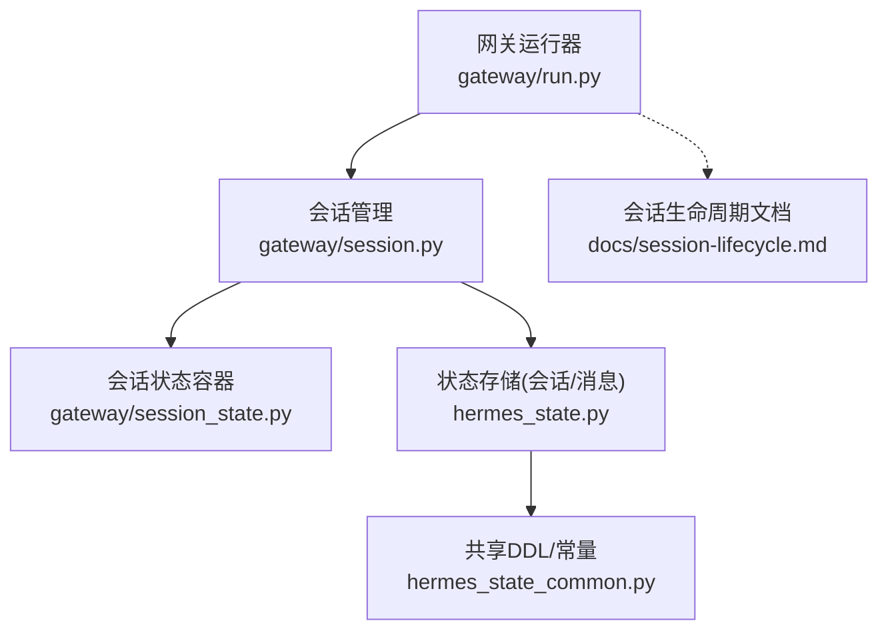
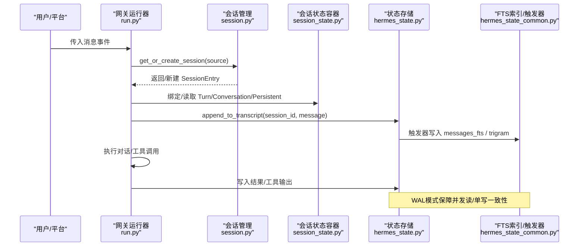
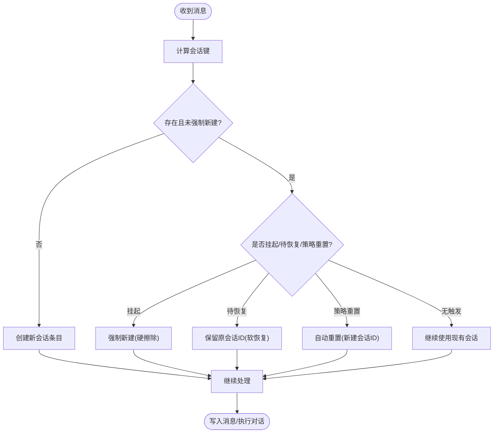
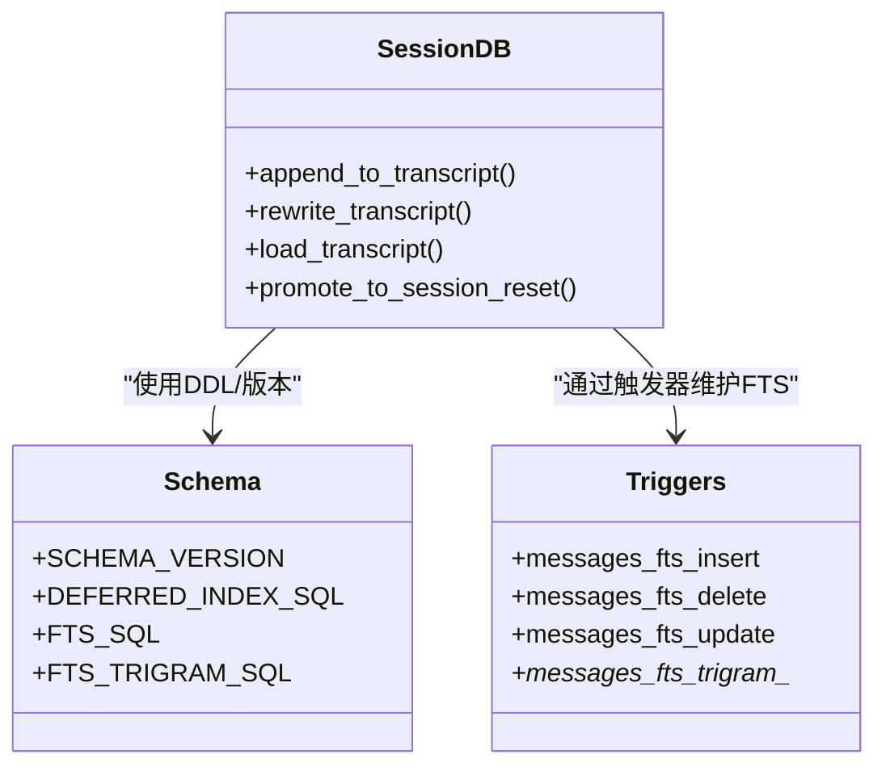
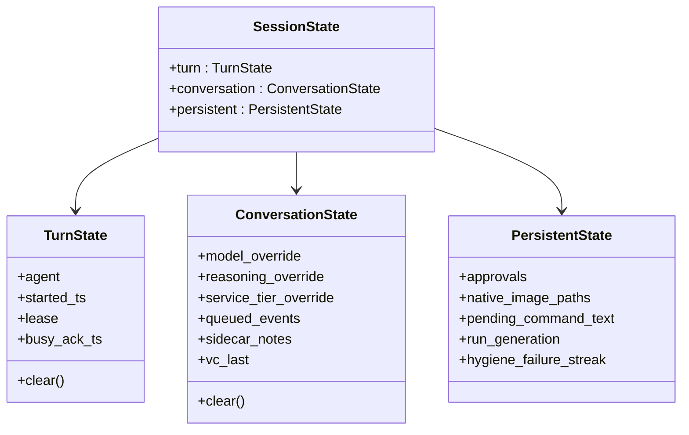
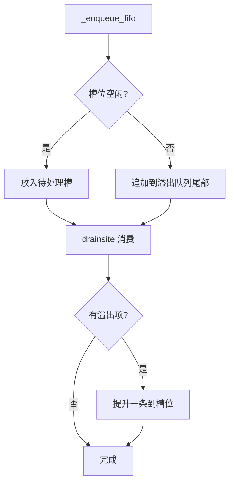
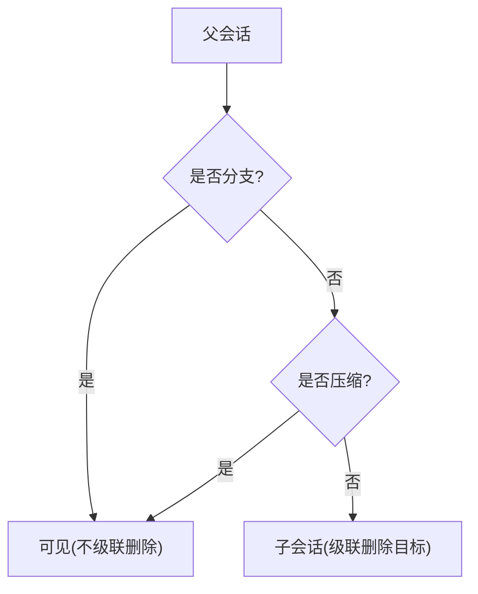
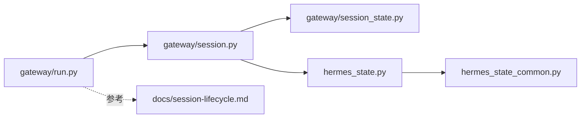

# 跨会话一致性

<cite>
**本文引用的文件**
- [hermes_state.py](file://hermes_state.py)
- [hermes_state_common.py](file://hermes_state_common.py)
- [gateway/session.py](file://gateway/session.py)
- [gateway/session_state.py](file://gateway/session_state.py)
- [gateway/run.py](file://gateway/run.py)
- [docs/session-lifecycle.md](file://docs/session-lifecycle.md)
</cite>

## 目录
1. [简介](#简介)
2. [项目结构](#项目结构)
3. [核心组件](#核心组件)
4. [架构总览](#架构总览)
5. [详细组件分析](#详细组件分析)
6. [依赖关系分析](#依赖关系分析)
7. [性能考量](#性能考量)
8. [故障排查指南](#故障排查指南)
9. [结论](#结论)
10. [附录](#附录)

## 简介
本文件围绕“跨会话一致性”展开，聚焦多会话间用户画像与上下文的一致性、同步机制与冲突解决。内容涵盖：
- 会话生命周期管理、状态持久化与恢复策略
- 分布式/多进程环境下的数据一致性保证（SQLite WAL、索引与触发器、版本控制）
- 并发控制、压缩与分支/子会话的可见性规则
- 一致性检查、数据修复与异常处理流程
- 配置项、同步策略定制与性能调优
- 监控、诊断工具与故障恢复指南
- 扩展一致性协议与集成分布式存储的技术指导

## 项目结构
与跨会话一致性直接相关的代码分布在以下模块：
- hermes_state.py：SQLite 状态存储主实现（WAL、FTS5、压缩/分支链、迁移与兼容性）
- hermes_state_common.py：共享常量与DDL（schema、索引、FTS 触发器、版本标记）
- gateway/session.py：会话模型、来源描述、上下文注入、键生成与存储入口
- gateway/session_state.py：网关内每会话状态容器（按 turn/conversation/persistent 分层）
- gateway/run.py：网关运行器、消息队列、缓存、过期清理、重启恢复与压缩协调
- docs/session-lifecycle.md：会话生命周期文档（重置策略、恢复流程、缓存与内存压力）

**图表来源**
- [gateway/run.py:1-200](file://gateway/run.py#L1-L200)
- [gateway/session.py:1-200](file://gateway/session.py#L1-L200)
- [gateway/session_state.py:1-180](file://gateway/session_state.py#L1-L180)
- [hermes_state.py:1-120](file://hermes_state.py#L1-L120)
- [hermes_state_common.py:197-373](file://hermes_state_common.py#L197-L373)
- [docs/session-lifecycle.md:1-120](file://docs/session-lifecycle.md#L1-L120)

**章节来源**
- [gateway/run.py:1-200](file://gateway/run.py#L1-L200)
- [gateway/session.py:1-200](file://gateway/session.py#L1-L200)
- [gateway/session_state.py:1-180](file://gateway/session_state.py#L1-L180)
- [hermes_state.py:1-120](file://hermes_state.py#L1-L120)
- [hermes_state_common.py:197-373](file://hermes_state_common.py#L197-L373)
- [docs/session-lifecycle.md:1-120](file://docs/session-lifecycle.md#L1-L120)

## 核心组件
- 会话来源与上下文（SessionSource/SessionContext）：决定路由、隔离与系统提示注入，影响多用户会话的一致性与可缓存性。
- 会话存储与会话键（SessionStore/build_session_key）：将逻辑会话映射到持久化标识，支持按平台/群组/线程/用户的隔离策略。
- 会话状态容器（TurnState/ConversationState/PersistentState）：将网关运行时状态按作用域分层，避免边界漂移与并发覆盖。
- SQLite 状态库（SessionDB + 共享DDL）：以WAL模式提供并发读/单写、FTS全文检索、压缩/分支链、版本与迁移。
- 网关运行器（GatewayRunner）：编排消息入队/出队、Agent缓存、过期清理、重启恢复与压缩协调。

**章节来源**
- [gateway/session.py:148-346](file://gateway/session.py#L148-L346)
- [docs/session-lifecycle.md:23-142](file://docs/session-lifecycle.md#L23-L142)
- [gateway/session_state.py:51-179](file://gateway/session_state.py#L51-L179)
- [hermes_state.py:1-120](file://hermes_state.py#L1-L120)
- [hermes_state_common.py:197-373](file://hermes_state_common.py#L197-L373)

## 架构总览
下图展示跨会话一致性的关键路径：消息进入网关后，通过会话键定位或创建会话；会话状态在内存中分层维护；消息写入SQLite并更新FTS索引；后台任务负责过期清理、压缩与恢复。

**图表来源**
- [gateway/run.py:1-200](file://gateway/run.py#L1-L200)
- [gateway/session.py:148-346](file://gateway/session.py#L148-L346)
- [gateway/session_state.py:51-179](file://gateway/session_state.py#L51-L179)
- [hermes_state.py:1-120](file://hermes_state.py#L1-L120)
- [hermes_state_common.py:415-534](file://hermes_state_common.py#L415-L534)

## 详细组件分析

### 会话生命周期与一致性策略
- 会话键生成与隔离：按平台、聊天类型、聊天ID、线程、参与者等维度生成确定性键，确保同一逻辑会话在多平台/多用户场景下保持一致。
- 重置策略：支持空闲/每日/两者组合，自动结束旧会话并创建新会话，记录原因与活动情况，保证上下文边界清晰。
- 重启恢复：无干净关闭标记时，对最近活跃会话标记“待恢复”，下次访问保留原会话ID，直到成功完成一次轮次再清除标记；连续失败则强制挂起以避免死循环。
- 多用户会话：根据配置决定是否共享线程/群组会话，并在系统提示中动态调整用户身份注入，避免破坏提示缓存。

**图表来源**
- [docs/session-lifecycle.md:99-142](file://docs/session-lifecycle.md#L99-L142)
- [docs/session-lifecycle.md:345-440](file://docs/session-lifecycle.md#L345-L440)
- [docs/session-lifecycle.md:294-342](file://docs/session-lifecycle.md#L294-L342)
- [docs/session-lifecycle.md:261-291](file://docs/session-lifecycle.md#L261-L291)

**章节来源**
- [docs/session-lifecycle.md:99-142](file://docs/session-lifecycle.md#L99-L142)
- [docs/session-lifecycle.md:261-342](file://docs/session-lifecycle.md#L261-L342)
- [docs/session-lifecycle.md:345-440](file://docs/session-lifecycle.md#L345-L440)

### 状态持久化与并发控制（SQLite WAL/FTS/版本）
- WAL模式：提供并发读者+单一写者的一致性，适配多平台网关场景；在不兼容文件系统上回退为DELETE模式。
- 触发器与FTS：消息插入/删除/更新时自动维护全文检索索引；CJK子串搜索使用trigram表；重建期间通过高水位/进度标记保证读写一致性。
- 版本与迁移：schema_version与fts_storage_version独立跟踪；延迟索引在列添加后创建，避免历史库报错。
- 压缩与分支：父会话链用于压缩/分支/子会话可见性；删除委托子会话时级联清理，保持引用完整性。

**图表来源**
- [hermes_state.py:1-120](file://hermes_state.py#L1-L120)
- [hermes_state_common.py:197-373](file://hermes_state_common.py#L197-L373)
- [hermes_state_common.py:415-534](file://hermes_state_common.py#L415-L534)

**章节来源**
- [hermes_state.py:1-120](file://hermes_state.py#L1-L120)
- [hermes_state_common.py:197-373](file://hermes_state_common.py#L197-L373)
- [hermes_state_common.py:415-534](file://hermes_state_common.py#L415-L534)

### 网关内会话状态分层与并发安全
- TurnState：每个运行中的轮次状态（代理实例、开始时间、租约、忙确认），轮次结束时统一清理。
- ConversationState：会话级状态（模型/推理覆盖、服务等级、侧边笔记、语音通道上下文），在会话边界重置。
- PersistentState：长生命周期状态（审批、图片路径、命令文本、运行代数、卫生压缩失败计数），不被轮次/边界整体重置。
- 遗留视图：为测试与薄适配器提供字典式访问，内部映射到上述分层字段，避免边界漂移。

**图表来源**
- [gateway/session_state.py:51-179](file://gateway/session_state.py#L51-L179)
- [gateway/session_state.py:225-416](file://gateway/session_state.py#L225-L416)

**章节来源**
- [gateway/session_state.py:51-179](file://gateway/session_state.py#L51-L179)
- [gateway/session_state.py:225-416](file://gateway/session_state.py#L225-L416)

### 消息队列与顺序一致性
- 单槽待处理：每个会话一个“下一个”消息槽，重复发送会合并（防风暴）。
- FIFO溢出：显式排队的事件进入溢出队列，逐条提升，保证每个队列项产生完整轮次且不合并。
- 出队/提升：当槽被消费后，若溢出队列非空，则提升下一条；若无可用适配器，则退回溢出队列，避免丢失。

**图表来源**
- [docs/session-lifecycle.md:443-500](file://docs/session-lifecycle.md#L443-L500)

**章节来源**
- [docs/session-lifecycle.md:443-500](file://docs/session-lifecycle.md#L443-L500)

### 压缩、分支与子会话可见性
- 压缩：会话过长时进行上下文压缩，可能旋转出新会话；通过父会话链与end_reason区分压缩/分支/子会话。
- 分支：带有稳定标记或父会话end_reason为“branched”的子会话可见，不会被级联删除。
- 子会话：非分支/非压缩的父会话后代视为临时子会话，删除父时会级联清理。

**图表来源**
- [hermes_state_common.py:83-114](file://hermes_state_common.py#L83-L114)

**章节来源**
- [hermes_state_common.py:83-114](file://hermes_state_common.py#L83-L114)

### 数据修复与异常处理
- 背景审查提示清洗：识别并移除历史遗留的后台审查提示及其助手回复，防止回放劫持会话。
- 残留工具调用标记清理：清除早期版本遗留的仅含占位符的工具调用内容，保持工具调用配对完整。
- WAL兼容性回退：在不兼容文件系统上回退为DELETE模式，并记录最后初始化错误以便用户诊断。
- macOS强化：启用checkpoint_fullfsync与synchronous=FULL，降低崩溃/关机时的损坏风险。

**章节来源**
- [hermes_state.py:577-671](file://hermes_state.py#L577-L671)
- [hermes_state.py:486-565](file://hermes_state.py#L486-L565)
- [hermes_state.py:718-780](file://hermes_state.py#L718-L780)

## 依赖关系分析
- 网关运行器依赖会话管理与状态容器，驱动消息入队/出队与Agent缓存。
- 会话管理依赖状态存储（SQLite）与共享DDL，负责键生成、重置策略与恢复。
- 状态存储依赖共享DDL（schema、索引、FTS触发器），并通过WAL保证并发一致性。
- 生命周期文档作为设计契约，约束行为与配置项。

**图表来源**
- [gateway/run.py:1-200](file://gateway/run.py#L1-L200)
- [gateway/session.py:1-200](file://gateway/session.py#L1-L200)
- [gateway/session_state.py:1-180](file://gateway/session_state.py#L1-L180)
- [hermes_state.py:1-120](file://hermes_state.py#L1-L120)
- [hermes_state_common.py:197-373](file://hermes_state_common.py#L197-L373)
- [docs/session-lifecycle.md:1-120](file://docs/session-lifecycle.md#L1-L120)

**章节来源**
- [gateway/run.py:1-200](file://gateway/run.py#L1-L200)
- [gateway/session.py:1-200](file://gateway/session.py#L1-L200)
- [gateway/session_state.py:1-180](file://gateway/session_state.py#L1-L180)
- [hermes_state.py:1-120](file://hermes_state.py#L1-L120)
- [hermes_state_common.py:197-373](file://hermes_state_common.py#L197-L373)
- [docs/session-lifecycle.md:1-120](file://docs/session-lifecycle.md#L1-L120)

## 性能考量
- 缓存与内存压力：AIAgent缓存LRU+空闲TTL；内存超限时按LRU释放会话转录，保护最近会话，避免RSS无限增长。
- 压缩与冷却：压缩失败采用阶梯冷却（x1/x3/x9），上限封顶，避免热重试；成功压缩后重置失败计数。
- FTS索引：外部内容布局与trigram表优化查询；重建期间通过高水位/进度标记避免不一致。
- WAL回退：在不兼容文件系统上降级为DELETE模式，牺牲部分并发但保证可用性。

**章节来源**
- [docs/session-lifecycle.md:578-668](file://docs/session-lifecycle.md#L578-L668)
- [gateway/run.py:132-200](file://gateway/run.py#L132-L200)
- [hermes_state_common.py:415-534](file://hermes_state_common.py#L415-L534)
- [hermes_state.py:486-565](file://hermes_state.py#L486-L565)

## 故障排查指南
- 会话数据库不可用：查看最后初始化错误信息，常见于NFS/SMB/FUSE/ZFS上的WAL不兼容；必要时切换到本地磁盘或禁用WAL。
- 重启后会话未恢复：检查.clean_shutdown标记是否存在；确认最近活跃会话是否被标记为resume_pending；观察连续失败次数是否达到挂起阈值。
- 压缩卡住或频繁失败：关注卫生失败计数与冷却阶梯；检查辅助模型/提供者可用性；必要时手动触发压缩或优化存储。
- FTS不一致：若出现重建停滞或CJK索引陈旧，需执行存储优化以重建索引；注意重建期间的读写一致性标记。

**章节来源**
- [hermes_state.py:520-565](file://hermes_state.py#L520-L565)
- [docs/session-lifecycle.md:345-440](file://docs/session-lifecycle.md#L345-L440)
- [hermes_state_common.py:544-549](file://hermes_state_common.py#L544-L549)

## 结论
跨会话一致性通过“确定性会话键 + 分层状态容器 + SQLite WAL/FTS + 生命周期策略”共同保障。系统在多进程/多平台环境下提供可靠的并发读/单写、上下文边界与恢复能力；同时提供压缩、分支与子会话可见性规则，以及内存压力下的自适应清理。运维侧可通过配置与监控指标调优性能与稳定性，开发者可按需扩展一致性协议与集成分布式存储。

## 附录

### 一致性配置选项与调优
- 会话隔离：group_sessions_per_user、thread_sessions_per_user
- 重置策略：mode（none/idle/daily/both）、at_hour、idle_minutes、notify
- 恢复窗口：agent.gateway_auto_continue_freshness
- Agent缓存：max_size、idle_ttl_secs、memory_high_mb、max_evictions_per_pass、protect_recent
- 存储优化：sessions.optimize-storage（重建FTS/升级布局）

**章节来源**
- [docs/session-lifecycle.md:654-680](file://docs/session-lifecycle.md#L654-L680)

### 扩展一致性协议与分布式存储集成建议
- 在会话键层增加租户/组织维度，确保跨部署隔离。
- 将SQLite替换为分布式KV/时序存储时，保持WAL语义等价（原子提交、版本向量、冲突检测）。
- 引入版本向量或因果哈希，用于跨节点合并与冲突解决（如CRDT或基于操作日志的合并）。
- 在FTS替代方案中，保持外部内容布局与重建高水位/进度标记，确保重建期间读写一致。
- 在网关层增加一致性检查点与审计日志，便于回溯与修复。

[本节为概念性指导，不直接分析具体文件]