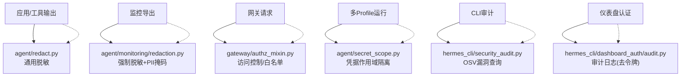
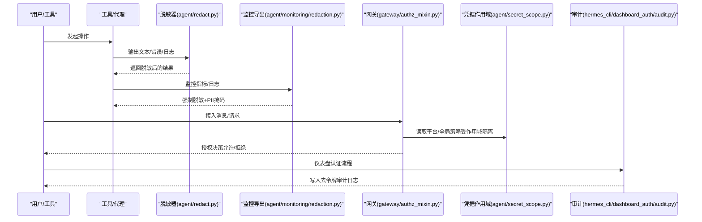
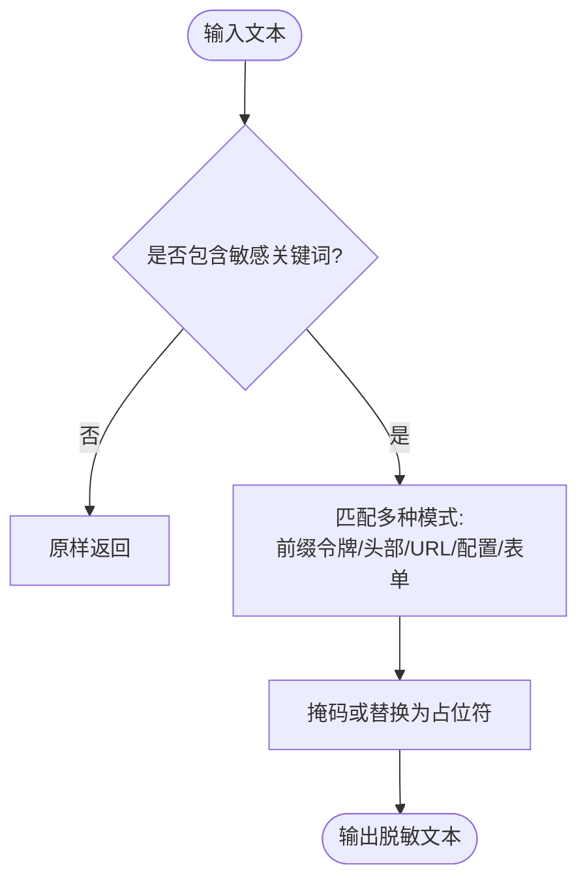
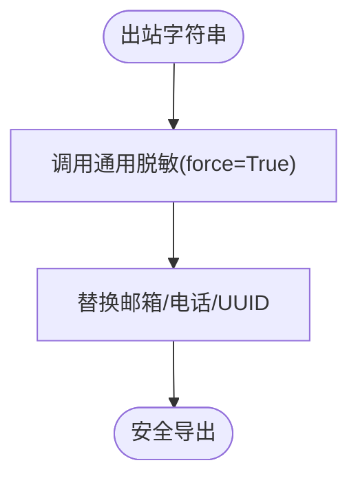
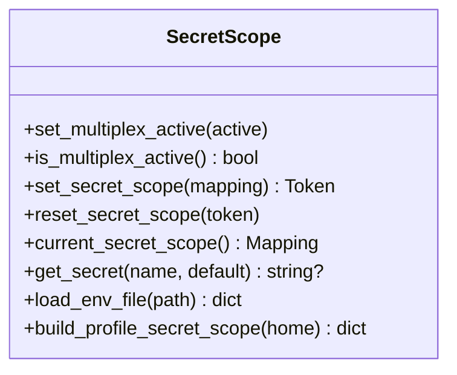
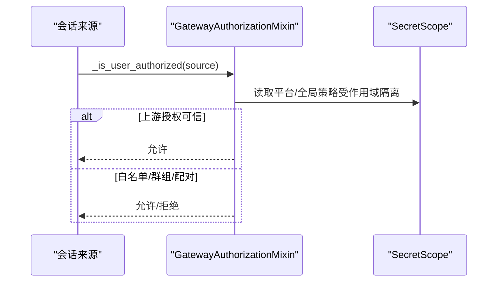
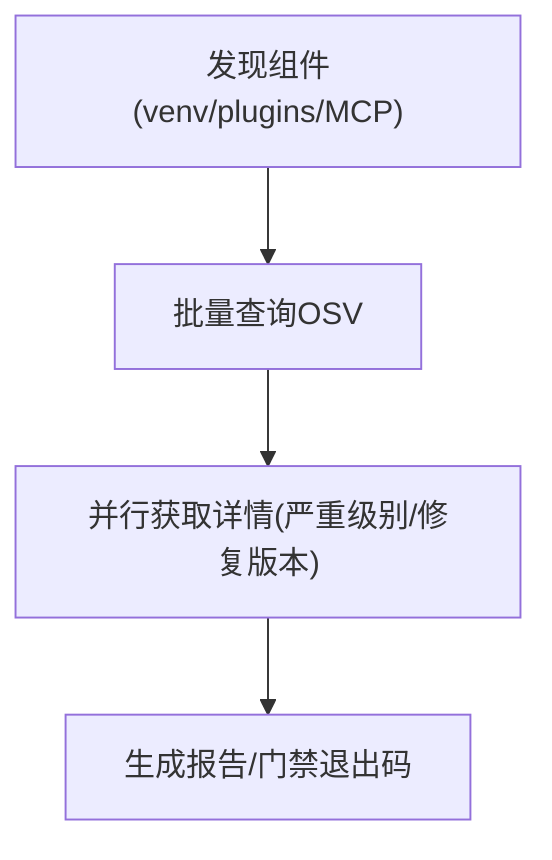
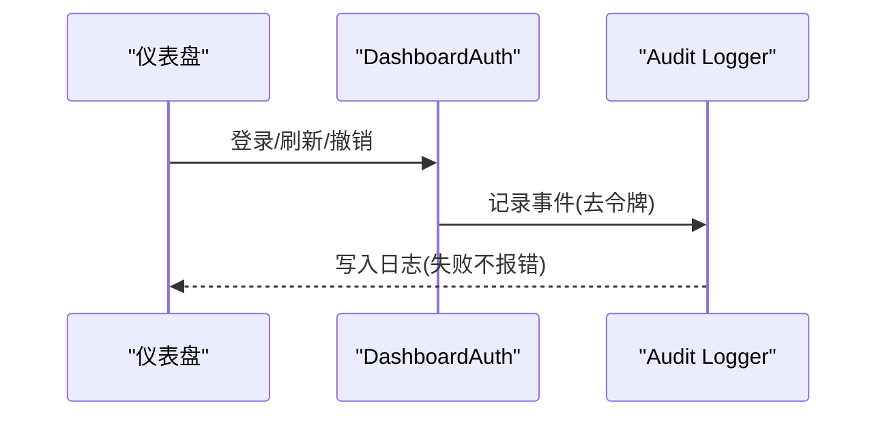
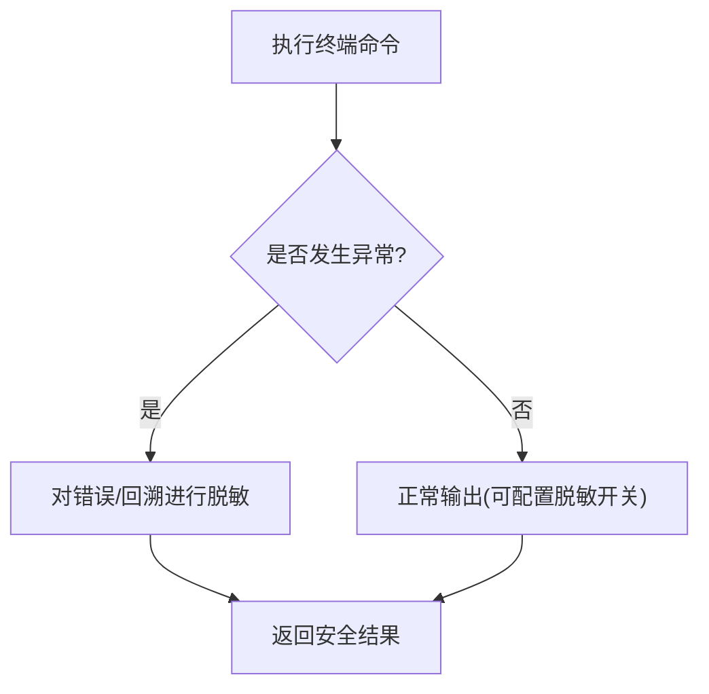
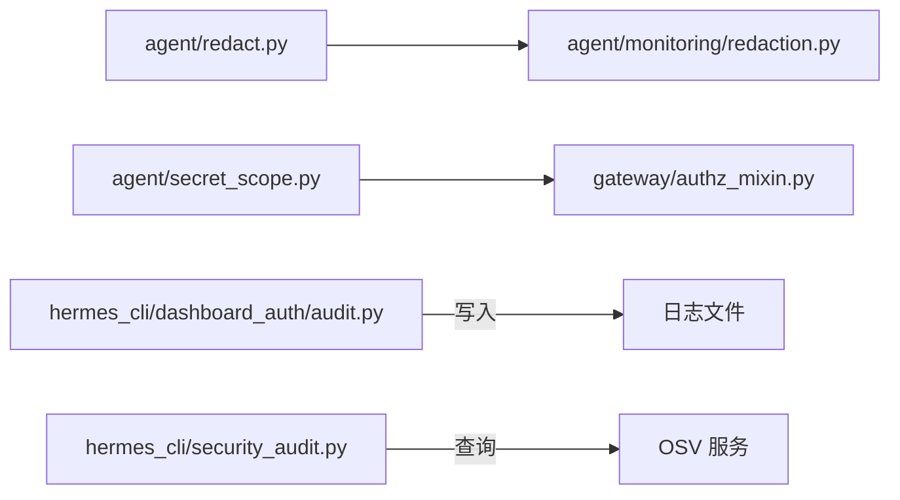

# 隐私安全保护

<cite>
**本文引用的文件**
- [agent/redact.py](file://agent/redact.py)
- [agent/monitoring/redaction.py](file://agent/monitoring/redaction.py)
- [agent/secret_scope.py](file://agent/secret_scope.py)
- [gateway/authz_mixin.py](file://gateway/authz_mixin.py)
- [hermes_cli/security_audit.py](file://hermes_cli/security_audit.py)
- [hermes_cli/dashboard_auth/audit.py](file://hermes_cli/dashboard_auth/audit.py)
- [tests/tools/test_terminal_error_redaction.py](file://tests/tools/test_terminal_error_redaction.py)
</cite>

## 目录
1. [简介](#简介)
2. [项目结构](#项目结构)
3. [核心组件](#核心组件)
4. [架构总览](#架构总览)
5. [详细组件分析](#详细组件分析)
6. [依赖关系分析](#依赖关系分析)
7. [性能考量](#性能考量)
8. [故障排查指南](#故障排查指南)
9. [结论](#结论)
10. [附录](#附录)

## 简介
本文件聚焦用户画像数据在 Hermes Agent 中的隐私与安全保护，覆盖数据脱敏、匿名化与加密存储策略，访问控制与权限验证、数据隔离机制，GDPR 合规要点（最小化、同意管理）、敏感信息检测与泄露防护、审计日志记录，以及隐私配置选项、安全策略定制与合规检查工具。同时提供风险评估、漏洞扫描与渗透测试建议，帮助开发者落地隐私增强技术与安全最佳实践。

## 项目结构
围绕隐私安全的实现主要分布在以下模块：
- 文本脱敏与敏感内容识别：agent/redact.py
- 监控导出强制脱敏：agent/monitoring/redaction.py
- 多租户/多 Profile 的凭据隔离：agent/secret_scope.py
- 网关侧访问控制与授权：gateway/authz_mixin.py
- 供应链漏洞扫描与合规检查：hermes_cli/security_audit.py
- 仪表盘认证审计日志：hermes_cli/dashboard_auth/audit.py
- 终端错误输出脱敏保障（测试）：tests/tools/test_terminal_error_redaction.py

**图表来源**
- [agent/redact.py:1-120](file://agent/redact.py#L1-L120)
- [agent/monitoring/redaction.py:1-72](file://agent/monitoring/redaction.py#L1-L72)
- [agent/secret_scope.py:1-120](file://agent/secret_scope.py#L1-L120)
- [gateway/authz_mixin.py:31-73](file://gateway/authz_mixin.py#L31-L73)
- [hermes_cli/security_audit.py:1-60](file://hermes_cli/security_audit.py#L1-L60)
- [hermes_cli/dashboard_auth/audit.py:1-96](file://hermes_cli/dashboard_auth/audit.py#L1-L96)

**章节来源**
- [agent/redact.py:1-120](file://agent/redact.py#L1-L120)
- [agent/monitoring/redaction.py:1-72](file://agent/monitoring/redaction.py#L1-L72)
- [agent/secret_scope.py:1-120](file://agent/secret_scope.py#L1-L120)
- [gateway/authz_mixin.py:31-73](file://gateway/authz_mixin.py#L31-L73)
- [hermes_cli/security_audit.py:1-60](file://hermes_cli/security_audit.py#L1-L60)
- [hermes_cli/dashboard_auth/audit.py:1-96](file://hermes_cli/dashboard_auth/audit.py#L1-L96)

## 核心组件
- 通用脱敏器（agent/redact.py）
  - 基于正则的密钥、令牌、JWT、数据库连接串、Authorization 头、URL 参数等模式匹配与掩码
  - 支持环境变量赋值、配置文件键值、JSON 字段、表单体、HTTP 请求目标等上下文
  - 可配置开关（默认开启），并支持“强制”模式用于安全边界
- 监控导出脱敏（agent/monitoring/redaction.py）
  - 无条件对出站字符串进行脱敏：先密钥后 PII（邮箱、电话、UUID）
  - 失败即关闭（fail-closed），确保不会泄露原始内容
- 凭据作用域（agent/secret_scope.py）
  - 通过 ContextVar 为每个任务/Profile 安装独立的环境映射，避免跨 Profile 泄漏
  - 多进程复用网关时，未设置作用域的读取将抛出异常（fail-closed）
- 访问控制（gateway/authz_mixin.py）
  - 平台级白名单、群组/频道白名单、机器人允许策略、配对审批、上游授权信任等
  - 多 Profile 下按 Profile 隔离策略读取，防止越权
- 供应链审计（hermes_cli/security_audit.py）
  - 扫描 venv、插件依赖、MCP 服务器命令中的包版本，调用 OSV 批量查询漏洞
  - 支持严重级别阈值与退出码控制
- 仪表盘认证审计（hermes_cli/dashboard_auth/audit.py）
  - 以 JSON 行格式记录登录、刷新、撤销、票据等事件
  - 自动过滤令牌类字段，避免写入磁盘泄露

**章节来源**
- [agent/redact.py:1-120](file://agent/redact.py#L1-L120)
- [agent/monitoring/redaction.py:1-72](file://agent/monitoring/redaction.py#L1-L72)
- [agent/secret_scope.py:1-120](file://agent/secret_scope.py#L1-L120)
- [gateway/authz_mixin.py:31-73](file://gateway/authz_mixin.py#L31-L73)
- [hermes_cli/security_audit.py:1-60](file://hermes_cli/security_audit.py#L1-L60)
- [hermes_cli/dashboard_auth/audit.py:1-96](file://hermes_cli/dashboard_auth/audit.py#L1-L96)

## 架构总览
下图展示从输入到输出的关键隐私安全路径：工具/代理输出经通用脱敏；监控导出走强制脱敏；网关入口执行访问控制；多 Profile 运行时使用凭据作用域隔离；CLI 提供供应链审计；仪表盘认证产生去令牌的审计日志。

**图表来源**
- [agent/redact.py:772-800](file://agent/redact.py#L772-L800)
- [agent/monitoring/redaction.py:43-66](file://agent/monitoring/redaction.py#L43-L66)
- [gateway/authz_mixin.py:386-783](file://gateway/authz_mixin.py#L386-L783)
- [agent/secret_scope.py:132-186](file://agent/secret_scope.py#L132-L186)
- [hermes_cli/dashboard_auth/audit.py:71-96](file://hermes_cli/dashboard_auth/audit.py#L71-L96)

## 详细组件分析

### 通用脱敏器（agent/redact.py）
- 能力范围
  - 已知供应商前缀令牌（OpenAI、GitHub、AWS、Stripe 等）
  - Authorization/Proxy-Authorization 头与自定义 API Key 头
  - JWT、数据库连接串、URL userinfo、带查询参数的 URL
  - 环境变量赋值、配置文件键值、YAML 键值、JSON 字段、表单体
  - 控制字符分割令牌修复（如嵌入不可见字符）
- 关键行为
  - 短令牌完全掩码；长令牌保留前后若干字符便于调试
  - 支持 force=True 的安全边界，忽略用户配置禁用
  - 针对 CDP/Browser 场景提供专用 URL 脱敏入口
- 复杂度与性能
  - 大量正则预编译与快速前置筛选（关键词命中才进入复杂匹配）
  - 对长文本采用保守匹配，避免回溯灾难（如 URL 匹配优化）

**图表来源**
- [agent/redact.py:25-65](file://agent/redact.py#L25-L65)
- [agent/redact.py:78-138](file://agent/redact.py#L78-L138)
- [agent/redact.py:316-350](file://agent/redact.py#L316-L350)
- [agent/redact.py:358-425](file://agent/redact.py#L358-L425)
- [agent/redact.py:488-537](file://agent/redact.py#L488-L537)
- [agent/redact.py:772-800](file://agent/redact.py#L772-L800)

**章节来源**
- [agent/redact.py:25-65](file://agent/redact.py#L25-L65)
- [agent/redact.py:78-138](file://agent/redact.py#L78-L138)
- [agent/redact.py:316-350](file://agent/redact.py#L316-L350)
- [agent/redact.py:358-425](file://agent/redact.py#L358-L425)
- [agent/redact.py:488-537](file://agent/redact.py#L488-L537)
- [agent/redact.py:772-800](file://agent/redact.py#L772-L800)

### 监控导出强制脱敏（agent/monitoring/redaction.py）
- 设计原则
  - 无条件对出站字符串进行脱敏，无开关可关闭
  - 先密钥后 PII（邮箱、电话、UUID）
  - 失败即关闭，避免泄露原始内容
- 适用场景
  - 遥测、指标、结构化日志等任何离开进程的字符串

**图表来源**
- [agent/monitoring/redaction.py:43-66](file://agent/monitoring/redaction.py#L43-L66)

**章节来源**
- [agent/monitoring/redaction.py:1-72](file://agent/monitoring/redaction.py#L1-L72)

### 凭据作用域与数据隔离（agent/secret_scope.py）
- 多 Profile 隔离
  - 通过 ContextVar 为当前任务安装 Profile 专属的密钥映射
  - 多进程复用网关时，未设置作用域的读取直接抛错（fail-closed）
- 全局变量白名单
  - 区分部署级环境变量与 Profile 凭据，避免误隔离
- .env 解析
  - 不污染进程环境，仅构建内存映射供 get_secret 读取

**图表来源**
- [agent/secret_scope.py:32-58](file://agent/secret_scope.py#L32-L58)
- [agent/secret_scope.py:132-186](file://agent/secret_scope.py#L132-L186)
- [agent/secret_scope.py:226-294](file://agent/secret_scope.py#L226-L294)

**章节来源**
- [agent/secret_scope.py:32-58](file://agent/secret_scope.py#L32-L58)
- [agent/secret_scope.py:132-186](file://agent/secret_scope.py#L132-L186)
- [agent/secret_scope.py:226-294](file://agent/secret_scope.py#L226-L294)

### 访问控制与权限验证（gateway/authz_mixin.py）
- 授权策略
  - 平台级 allow-all、白名单、群组/频道白名单、机器人允许策略
  - 配对审批（operator 批准）作为强授权
  - 上游授权信任（Relay/Team Gateway）直接放行已鉴权事件
- 多 Profile 隔离
  - 策略读取优先来自当前 Profile 的作用域，避免跨 Profile 泄漏
- 默认拒绝
  - 未配置白名单时默认拒绝，符合安全基线

**图表来源**
- [gateway/authz_mixin.py:31-73](file://gateway/authz_mixin.py#L31-L73)
- [gateway/authz_mixin.py:386-783](file://gateway/authz_mixin.py#L386-L783)

**章节来源**
- [gateway/authz_mixin.py:31-73](file://gateway/authz_mixin.py#L31-L73)
- [gateway/authz_mixin.py:386-783](file://gateway/authz_mixin.py#L386-L783)

### 供应链漏洞扫描与合规检查（hermes_cli/security_audit.py）
- 扫描范围
  - Python venv 依赖、插件 requirements/pyproject、MCP 服务器命令中的包版本
- 漏洞查询
  - 批量调用 OSV.dev 接口，获取漏洞 ID、严重级别、修复版本
- 报告与门禁
  - 人类可读/JSON 输出；支持按严重级别阈值退出（CI 集成）

**图表来源**
- [hermes_cli/security_audit.py:84-103](file://hermes_cli/security_audit.py#L84-L103)
- [hermes_cli/security_audit.py:167-200](file://hermes_cli/security_audit.py#L167-L200)
- [hermes_cli/security_audit.py:216-279](file://hermes_cli/security_audit.py#L216-L279)
- [hermes_cli/security_audit.py:300-330](file://hermes_cli/security_audit.py#L300-L330)
- [hermes_cli/security_audit.py:386-408](file://hermes_cli/security_audit.py#L386-L408)
- [hermes_cli/security_audit.py:433-481](file://hermes_cli/security_audit.py#L433-L481)

**章节来源**
- [hermes_cli/security_audit.py:84-103](file://hermes_cli/security_audit.py#L84-L103)
- [hermes_cli/security_audit.py:167-200](file://hermes_cli/security_audit.py#L167-L200)
- [hermes_cli/security_audit.py:216-279](file://hermes_cli/security_audit.py#L216-L279)
- [hermes_cli/security_audit.py:300-330](file://hermes_cli/security_audit.py#L300-L330)
- [hermes_cli/security_audit.py:386-408](file://hermes_cli/security_audit.py#L386-L408)
- [hermes_cli/security_audit.py:433-481](file://hermes_cli/security_audit.py#L433-L481)

### 仪表盘认证审计日志（hermes_cli/dashboard_auth/audit.py）
- 事件类型
  - 登录开始/成功/失败、登出、刷新、撤销、票据签发/拒绝、令牌认证成功/失败等
- 安全特性
  - 自动过滤令牌类字段（access_token、refresh_token、code、cookie、Authorization 等）
  - 写入 $HERMES_HOME/logs/dashboard-auth.log，失败不中断认证流程

**图表来源**
- [hermes_cli/dashboard_auth/audit.py:26-57](file://hermes_cli/dashboard_auth/audit.py#L26-L57)
- [hermes_cli/dashboard_auth/audit.py:71-96](file://hermes_cli/dashboard_auth/audit.py#L71-L96)

**章节来源**
- [hermes_cli/dashboard_auth/audit.py:26-57](file://hermes_cli/dashboard_auth/audit.py#L26-L57)
- [hermes_cli/dashboard_auth/audit.py:71-96](file://hermes_cli/dashboard_auth/audit.py#L71-L96)

### 终端错误输出脱敏保障（测试用例）
- 目的
  - 确保终端工具的错误与回溯中不包含凭据形状字符串
- 关键点
  - 即使配置关闭脱敏，错误/回溯仍应被处理
  - 支持命令感知的脱敏回调

**图表来源**
- [tests/tools/test_terminal_error_redaction.py:41-77](file://tests/tools/test_terminal_error_redaction.py#L41-L77)
- [tests/tools/test_terminal_error_redaction.py:119-154](file://tests/tools/test_terminal_error_redaction.py#L119-L154)

**章节来源**
- [tests/tools/test_terminal_error_redaction.py:41-77](file://tests/tools/test_terminal_error_redaction.py#L41-L77)
- [tests/tools/test_terminal_error_redaction.py:119-154](file://tests/tools/test_terminal_error_redaction.py#L119-L154)

## 依赖关系分析
- agent/redact.py 被多处调用，作为统一脱敏入口；monitoring/redaction.py 在其基础上增加 PII 掩码与强制策略
- gateway/authz_mixin.py 依赖 secret_scope 读取策略，保证多 Profile 隔离
- hermes_cli/security_audit.py 依赖 OSV 网络接口，需考虑超时与失败降级
- dashboard_auth/audit.py 低耦合，仅负责落盘审计，失败不影响主流程

**图表来源**
- [agent/monitoring/redaction.py:43-66](file://agent/monitoring/redaction.py#L43-L66)
- [gateway/authz_mixin.py:31-73](file://gateway/authz_mixin.py#L31-L73)
- [hermes_cli/security_audit.py:285-330](file://hermes_cli/security_audit.py#L285-L330)
- [hermes_cli/dashboard_auth/audit.py:71-96](file://hermes_cli/dashboard_auth/audit.py#L71-L96)

**章节来源**
- [agent/monitoring/redaction.py:43-66](file://agent/monitoring/redaction.py#L43-L66)
- [gateway/authz_mixin.py:31-73](file://gateway/authz_mixin.py#L31-L73)
- [hermes_cli/security_audit.py:285-330](file://hermes_cli/security_audit.py#L285-L330)
- [hermes_cli/dashboard_auth/audit.py:71-96](file://hermes_cli/dashboard_auth/audit.py#L71-L96)

## 性能考量
- 脱敏正则预编译与快速前置筛选，降低回溯开销
- 监控导出强制脱敏失败即关闭，避免额外分支判断
- 供应链审计并发拉取漏洞详情，提升吞吐
- 多 Profile 凭据作用域基于 ContextVar，轻量且线程安全

[本节为通用指导，无需特定文件引用]

## 故障排查指南
- 脱敏未生效
  - 检查是否处于非安全边界（force=False）且用户配置禁用了脱敏
  - 确认文本是否落入支持的上下文（URL、表单、配置等）
- 监控导出泄露
  - 确认出口均经过 redact_for_export；若失败会返回占位符
- 多 Profile 凭据泄漏风险
  - 确保在 multiplex 模式下正确安装 secret scope；未安装将抛错
- 访问控制误放行
  - 检查平台白名单、群组白名单、配对审批与上游授权标志
- 审计日志缺失
  - 检查日志目录权限与写入失败告警；审计失败不应阻断认证

**章节来源**
- [agent/redact.py:772-800](file://agent/redact.py#L772-L800)
- [agent/monitoring/redaction.py:43-66](file://agent/monitoring/redaction.py#L43-L66)
- [agent/secret_scope.py:132-186](file://agent/secret_scope.py#L132-L186)
- [gateway/authz_mixin.py:386-783](file://gateway/authz_mixin.py#L386-L783)
- [hermes_cli/dashboard_auth/audit.py:71-96](file://hermes_cli/dashboard_auth/audit.py#L71-L96)

## 结论
Hermes Agent 在隐私与安全方面提供了分层防御：通用脱敏、强制监控脱敏、凭据作用域隔离、严格的访问控制、供应链漏洞扫描与去令牌的审计日志。这些机制共同保障了用户画像数据在采集、处理、传输与存储过程中的最小化暴露与可审计性。结合 GDPR 的最小化与同意管理原则，可在生产环境中实现高标准的隐私合规。

[本节为总结，无需特定文件引用]

## 附录

### GDPR 合规性与数据最小化
- 数据最小化
  - 仅在必要范围内收集与处理用户画像相关数据
  - 脱敏与匿名化贯穿日志、监控与外部交互
- 用户同意管理
  - 通过仪表盘认证与配对审批建立明确的用户授权链路
  - 审计日志记录关键授权事件，便于追溯与合规证明
- 可删除与可携带
  - 配合会话与状态管理，支持数据删除与导出（由其他模块实现）

[本节为概念性说明，无需特定文件引用]

### 隐私配置与安全策略定制
- 脱敏开关
  - 可通过配置项控制是否启用脱敏；安全边界可使用 force=True 强制脱敏
- 访问控制
  - 平台级白名单、群组白名单、机器人允许策略、配对审批
  - 上游授权信任（Relay/Team Gateway）用于已鉴权事件
- 多 Profile 隔离
  - 在 multiplex 模式下必须安装 secret scope，避免跨 Profile 凭据泄漏

**章节来源**
- [agent/redact.py:67-76](file://agent/redact.py#L67-L76)
- [gateway/authz_mixin.py:386-783](file://gateway/authz_mixin.py#L386-L783)
- [agent/secret_scope.py:132-186](file://agent/secret_scope.py#L132-L186)

### 敏感信息检测与泄露防护
- 检测范围
  - 供应商前缀令牌、Authorization 头、JWT、数据库连接串、URL userinfo、环境变量赋值、配置文件键值、JSON 字段、表单体
- 泄露防护
  - 监控导出强制脱敏；失败即关闭
  - 仪表盘认证审计日志自动过滤令牌类字段

**章节来源**
- [agent/redact.py:78-138](file://agent/redact.py#L78-L138)
- [agent/monitoring/redaction.py:43-66](file://agent/monitoring/redaction.py#L43-L66)
- [hermes_cli/dashboard_auth/audit.py:26-57](file://hermes_cli/dashboard_auth/audit.py#L26-L57)

### 合规检查工具与漏洞扫描
- 供应链审计
  - 扫描 venv、插件依赖、MCP 服务器命令中的包版本
  - 调用 OSV 批量查询漏洞，支持严重级别阈值与 CI 门禁
- 建议
  - 在 CI 中集成 hermes security audit，阻止高危漏洞发布

**章节来源**
- [hermes_cli/security_audit.py:84-103](file://hermes_cli/security_audit.py#L84-L103)
- [hermes_cli/security_audit.py:167-200](file://hermes_cli/security_audit.py#L167-L200)
- [hermes_cli/security_audit.py:216-279](file://hermes_cli/security_audit.py#L216-L279)
- [hermes_cli/security_audit.py:300-330](file://hermes_cli/security_audit.py#L300-L330)
- [hermes_cli/security_audit.py:386-408](file://hermes_cli/security_audit.py#L386-L408)
- [hermes_cli/security_audit.py:433-481](file://hermes_cli/security_audit.py#L433-L481)

### 渗透测试与风险评估建议
- 输入面
  - 重点测试 URL 参数、表单体、Authorization 头、环境变量赋值、配置文件键值
- 输出面
  - 验证日志、监控导出、错误回溯是否包含敏感信息
- 访问控制
  - 验证白名单、群组白名单、配对审批与上游授权信任的正确性
- 多 Profile
  - 验证跨 Profile 凭据隔离与作用域安装是否正确

[本节为通用指导，无需特定文件引用]

### 开发者最佳实践
- 始终使用统一脱敏入口（redact_sensitive_text），必要时使用 force=True
- 监控导出一律经过 redact_for_export，不得绕过
- 多 Profile 环境下务必安装 secret scope，避免凭据泄漏
- 访问控制遵循默认拒绝，显式配置白名单与配对审批
- 在 CI 中集成供应链审计，阻止高危漏洞发布

**章节来源**
- [agent/redact.py:772-800](file://agent/redact.py#L772-L800)
- [agent/monitoring/redaction.py:43-66](file://agent/monitoring/redaction.py#L43-L66)
- [agent/secret_scope.py:132-186](file://agent/secret_scope.py#L132-L186)
- [gateway/authz_mixin.py:386-783](file://gateway/authz_mixin.py#L386-L783)
- [hermes_cli/security_audit.py:433-481](file://hermes_cli/security_audit.py#L433-L481)