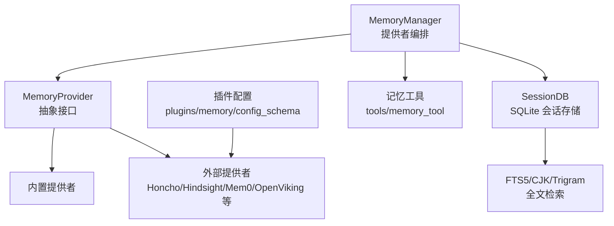
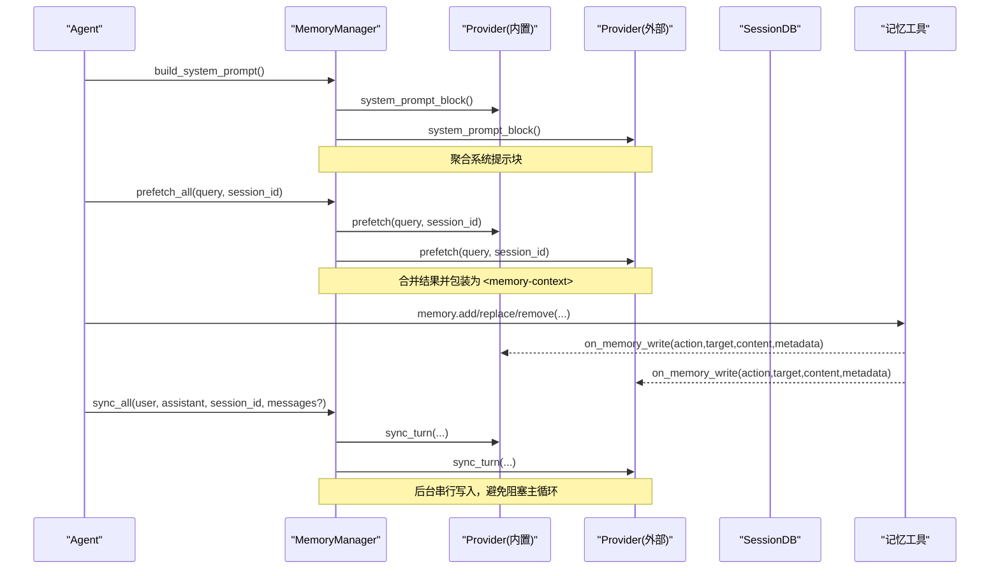
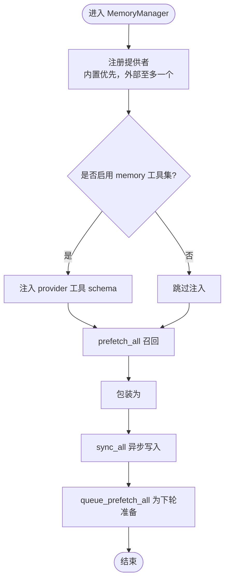
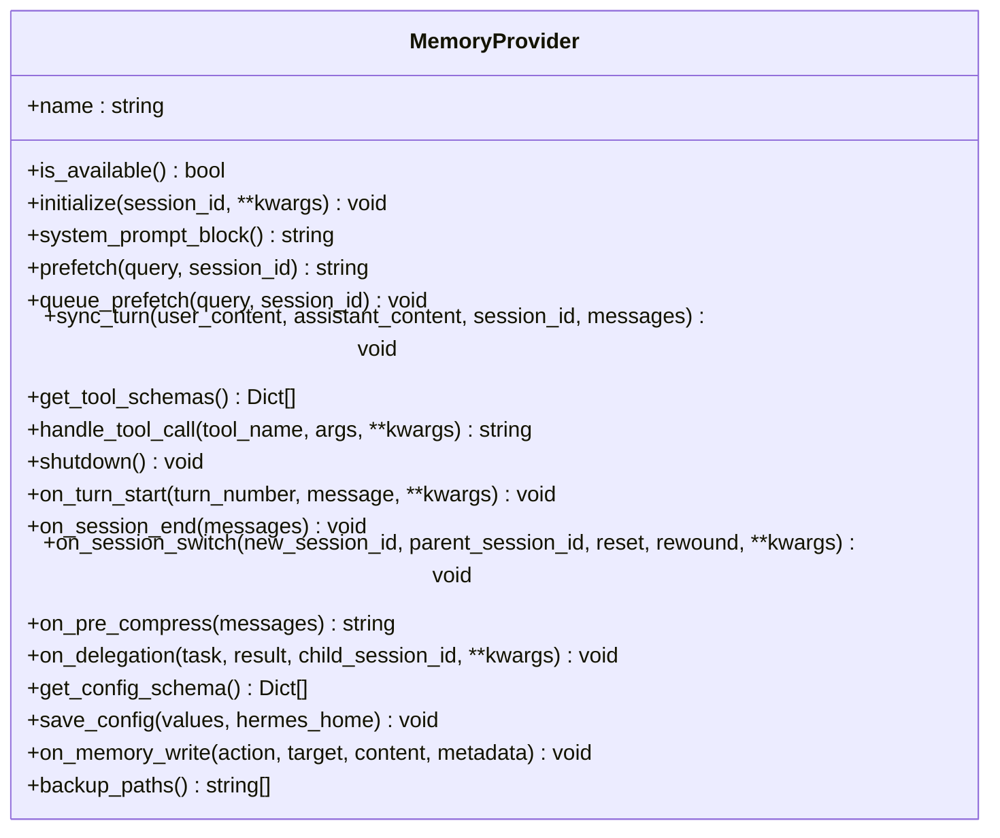
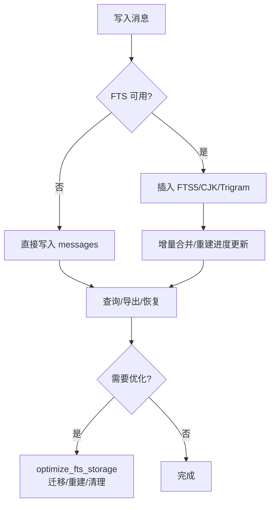
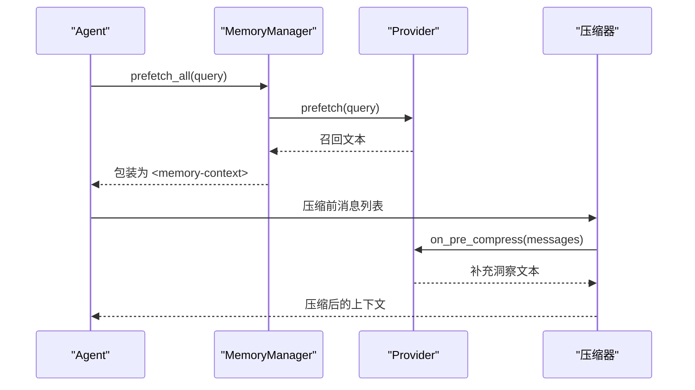
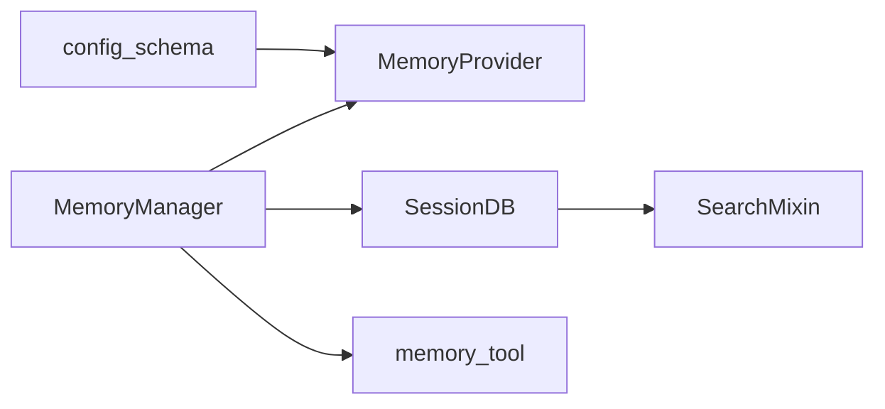

# 记忆系统

<cite>
**本文引用的文件**
- [memory_manager.py](file://agent/memory_manager.py)
- [memory_provider.py](file://agent/memory_provider.py)
- [hermes_state.py](file://hermes_state.py)
- [hermes_state_search.py](file://hermes_state_search.py)
- [config_schema.py](file://plugins/memory/config_schema.py)
- [memory_tool.py](file://tools/memory_tool.py)
</cite>

## 目录
1. [简介](#简介)
2. [项目结构](#项目结构)
3. [核心组件](#核心组件)
4. [架构总览](#架构总览)
5. [详细组件分析](#详细组件分析)
6. [依赖关系分析](#依赖关系分析)
7. [性能考量](#性能考量)
8. [故障排除指南](#故障排除指南)
9. [结论](#结论)
10. [附录](#附录)

## 简介
本文件面向“记忆系统”的完整技术文档，覆盖持久化记忆、上下文管理与用户画像构建。重点说明：
- 记忆的存储机制（SQLite + FTS5）、检索算法与压缩策略
- 上下文引擎的工作原理（上下文选择、引用管理、压缩优化）
- 用户画像的自动构建、偏好学习与跨会话一致性
- FTS5 全文搜索、LLM 摘要生成与会话间回忆机制
- 记忆配置选项、性能调优与故障排除
- 最佳实践与高级定制扩展指导

## 项目结构
记忆系统由三层构成：
- 提供者编排层：MemoryManager 统一注册/调度多个 MemoryProvider（内置与外部），负责系统提示注入、预取召回、同步写入与工具暴露。
- 提供者抽象层：MemoryProvider 定义标准生命周期接口（初始化、系统提示、预取、同步、工具、钩子等）。
- 持久化与检索层：基于 SQLite 的 SessionDB（hermes_state）提供会话消息持久化；SearchMixin（hermes_state_search）提供 FTS5/CJK/Trigram 全文检索与索引维护；tools/memory_tool 提供显式记忆写入能力；plugins/memory/config_schema 声明各记忆提供者的可配置项。

**图表来源**
- [memory_manager.py:364-800](file://agent/memory_manager.py#L364-L800)
- [memory_provider.py:81-358](file://agent/memory_provider.py#L81-L358)
- [hermes_state.py:1-120](file://hermes_state.py#L1-L120)
- [hermes_state_search.py:36-120](file://hermes_state_search.py#L36-L120)
- [config_schema.py:1-145](file://plugins/memory/config_schema.py#L1-L145)

**章节来源**
- [memory_manager.py:1-120](file://agent/memory_manager.py#L1-L120)
- [memory_provider.py:1-80](file://agent/memory_provider.py#L1-L80)
- [hermes_state.py:1-120](file://hermes_state.py#L1-L120)
- [hermes_state_search.py:1-120](file://hermes_state_search.py#L1-L120)
- [config_schema.py:1-145](file://plugins/memory/config_schema.py#L1-L145)

## 核心组件
- MemoryManager：单点编排器，限制仅一个外部提供者，提供系统提示拼接、每轮预取召回、异步写入、工具模式注入与流式上下文清洗。
- MemoryProvider：抽象基类，定义 providers 的统一契约（initialize/system_prompt_block/prefetch/sync_turn/get_tool_schemas/handle_tool_call/shutdown 及可选钩子 on_turn_start/on_session_end/on_session_switch/on_pre_compress/on_delegation/on_memory_write/backup_paths）。
- SessionDB（hermes_state）：SQLite 会话数据库，WAL 模式，支持会话拆分、消息历史、模型配置、安全恢复与 WAL 兼容性回退。
- SearchMixin（hermes_state_search）：FTS5/CJK/Trigram 全文检索、增量合并、重建进度、降级与清理、CJK 重建与可用性检测。
- 记忆工具（tools/memory_tool）：允许在对话中显式添加/替换/删除记忆条目，并触发 on_memory_write 钩子以镜像到外部后端。
- 插件配置（plugins/memory/config_schema）：声明式配置字段、存储后端、密钥与环境变量映射，驱动 UI 与通用读写端点。

**章节来源**
- [memory_manager.py:364-800](file://agent/memory_manager.py#L364-L800)
- [memory_provider.py:81-358](file://agent/memory_provider.py#L81-L358)
- [hermes_state.py:1-120](file://hermes_state.py#L1-L120)
- [hermes_state_search.py:36-120](file://hermes_state_search.py#L36-L120)
- [config_schema.py:1-145](file://plugins/memory/config_schema.py#L1-L145)

## 架构总览
记忆系统在每轮对话中的关键流程：
- 系统提示组装：收集所有 provider 的系统提示块。
- 预取召回：按 provider 顺序调用 prefetch，合并为带围栏标记的上下文块，供 LLM 参考。
- 工具暴露：将 provider 的工具 schema 注入到 agent 工具表面，受 toolset 开关控制。
- 后处理同步：将本轮用户与助手内容异步写入各 provider，保证有序落盘。
- 下轮预取队列：为下一轮准备背景召回任务。

**图表来源**
- [memory_manager.py:486-695](file://agent/memory_manager.py#L486-L695)
- [memory_provider.py:123-188](file://agent/memory_provider.py#L123-L188)
- [memory_tool.py](file://tools/memory_tool.py)

**章节来源**
- [memory_manager.py:486-695](file://agent/memory_manager.py#L486-L695)
- [memory_provider.py:123-188](file://agent/memory_provider.py#L123-L188)

## 详细组件分析

### 记忆提供者编排（MemoryManager）
- 提供者注册与限制：始终接受内置提供者，最多一个外部提供者；冲突或重复注册会记录警告。
- 工具模式注入：根据 enabled/disabled toolsets 决定是否暴露 memory 工具；规范化 schema，避免名称冲突与核心工具被覆盖。
- 上下文围栏与流式清洗：使用 <memory-context> 围栏包裹召回内容，并提供 StreamingContextScrubber 在流式输出中安全丢弃内部上下文片段。
- 预取与同步：prefetch_all 并行/超时保护外部 provider；sync_all 通过单工作线程串行写入，确保 turn N 先于 turn N+1 落地；queue_prefetch_all 为下一轮准备背景召回。
- 优雅关闭：flush_pending 等待后台任务排空；shutdown 时拒绝新任务并报告放弃计数。

**图表来源**
- [memory_manager.py:110-157](file://agent/memory_manager.py#L110-L157)
- [memory_manager.py:364-800](file://agent/memory_manager.py#L364-L800)

**章节来源**
- [memory_manager.py:110-157](file://agent/memory_manager.py#L110-L157)
- [memory_manager.py:364-800](file://agent/memory_manager.py#L364-L800)

### 记忆提供者抽象（MemoryProvider）
- 生命周期：initialize/system_prompt_block/prefetch/sync_turn/get_tool_schemas/handle_tool_call/shutdown。
- 可选钩子：on_turn_start/on_session_end/on_session_switch/on_pre_compress/on_delegation/on_memory_write/backup_paths。
- 简单提示过滤：is_trivial_prompt 识别无语义信号的用户输入，避免不必要的网络往返与上下文污染。

**图表来源**
- [memory_provider.py:81-358](file://agent/memory_provider.py#L81-L358)

**章节来源**
- [memory_provider.py:44-80](file://agent/memory_provider.py#L44-L80)
- [memory_provider.py:81-358](file://agent/memory_provider.py#L81-L358)

### 持久化存储与检索（SessionDB + SearchMixin）
- 存储：SQLite WAL 模式，会话元数据、消息历史、模型配置；会话拆分通过 parent_session_id 链实现。
- 检索：FTS5 虚拟表用于快速全文检索；CJK bigram 与 Trigram 增强中文/模糊匹配；支持增量合并与分块重建。
- 维护：optimize_fts_storage 可将旧版内联 FTS 迁移至外置内容表；fts_rebuild_step/fts_cjk_rebuild_step 分块回填；trash 表分块清理；状态元记录重建进度。
- 安全与兼容：WAL 不兼容文件系统回退；macOS 强制 FULL fsync；测试隔离防止误写生产库。

**图表来源**
- [hermes_state.py:1-120](file://hermes_state.py#L1-L120)
- [hermes_state_search.py:69-120](file://hermes_state_search.py#L69-L120)
- [hermes_state_search.py:264-330](file://hermes_state_search.py#L264-L330)
- [hermes_state_search.py:734-800](file://hermes_state_search.py#L734-L800)

**章节来源**
- [hermes_state.py:1-120](file://hermes_state.py#L1-L120)
- [hermes_state_search.py:69-120](file://hermes_state_search.py#L69-L120)
- [hermes_state_search.py:264-330](file://hermes_state_search.py#L264-L330)
- [hermes_state_search.py:734-800](file://hermes_state_search.py#L734-L800)

### 上下文引擎与压缩优化
- 上下文选择：MemoryManager.prefetch_all 按 provider 顺序召回，合并为带围栏的上下文块；StreamingContextScrubber 在流式输出中安全丢弃内部上下文片段。
- 引用管理：provider 可通过 get_tool_schemas 暴露工具，MemoryManager 注入到 agent 工具表面；工具调用由 handle_tool_call 路由到对应 provider。
- 压缩优化：on_pre_compress 钩子允许 provider 在压缩前提取洞察，以便压缩摘要保留关键信息；session 拆分通过 parent_session_id 链维持上下文连续性。

**图表来源**
- [memory_manager.py:525-595](file://agent/memory_manager.py#L525-L595)
- [memory_provider.py:258-268](file://agent/memory_provider.py#L258-L268)

**章节来源**
- [memory_manager.py:525-595](file://agent/memory_manager.py#L525-L595)
- [memory_provider.py:258-268](file://agent/memory_provider.py#L258-L268)

### 用户画像构建与跨会话一致性
- 自动构建：provider 可在 on_session_end 对会话进行事实抽取与总结，形成用户画像；也可通过 on_memory_write 镜像显式记忆写入。
- 偏好学习：provider 可依据历史交互与显式记忆更新偏好标签，并在后续 prefetch 中返回相关上下文。
- 跨会话一致性：on_session_switch 支持 /resume、/branch、/reset、/new 等场景下的会话切换；provider 需据此更新缓存或重置计数器，确保写入正确归属。

**章节来源**
- [memory_provider.py:204-257](file://agent/memory_provider.py#L204-L257)
- [memory_provider.py:322-339](file://agent/memory_provider.py#L322-L339)

### FTS5 全文搜索、LLM 摘要与会话间回忆
- FTS5：messages_fts/messages_fts_trigram/messages_fts_cjk 三套索引；支持增量合并、分块重建、CJK 重建与可用性检测。
- LLM 摘要：通过 on_pre_compress 钩子让 provider 贡献摘要素材，压缩器将保留关键洞察。
- 会话间回忆：prefetch 结合 FTS5 检索与 provider 自定义召回逻辑，实现跨会话的知识复用。

**章节来源**
- [hermes_state_search.py:69-120](file://hermes_state_search.py#L69-L120)
- [hermes_state_search.py:264-330](file://hermes_state_search.py#L264-L330)
- [hermes_state_search.py:332-420](file://hermes_state_search.py#L332-L420)
- [memory_provider.py:258-268](file://agent/memory_provider.py#L258-L268)

### 记忆工具与显式记忆写入
- tools/memory_tool 提供 add/replace/remove 操作，action/target/content/metadata 清晰表达写入意图。
- 写入触发 on_memory_write 钩子，便于外部 provider 镜像到自有后端，保持内外一致。

**章节来源**
- [memory_tool.py](file://tools/memory_tool.py)
- [memory_provider.py:322-339](file://agent/memory_provider.py#L322-L339)

### 记忆配置选项与插件声明
- config_schema 声明 provider 的配置字段类型（text/select/secret/bool/number/json）、存储后端（flat_json/honcho_host_block）、密钥与环境变量映射、帮助信息与分组。
- 通用 UI 与 API 端点读取/写入配置，无需为每个 provider 编写专属界面。

**章节来源**
- [config_schema.py:1-145](file://plugins/memory/config_schema.py#L1-L145)

## 依赖关系分析
- MemoryManager 依赖 MemoryProvider 抽象，协调内置与外部 provider。
- SessionDB 依赖 SQLite 与 FTS5/CJK/Trigram 扩展；SearchMixin 提供检索与维护方法。
- tools/memory_tool 通过 on_memory_write 与 provider 解耦集成。
- plugins/memory/config_schema 为 UI 与 API 提供声明式配置。

**图表来源**
- [memory_manager.py:364-800](file://agent/memory_manager.py#L364-L800)
- [memory_provider.py:81-358](file://agent/memory_provider.py#L81-L358)
- [hermes_state.py:1-120](file://hermes_state.py#L1-L120)
- [hermes_state_search.py:36-120](file://hermes_state_search.py#L36-L120)
- [config_schema.py:1-145](file://plugins/memory/config_schema.py#L1-L145)

**章节来源**
- [memory_manager.py:364-800](file://agent/memory_manager.py#L364-L800)
- [memory_provider.py:81-358](file://agent/memory_provider.py#L81-L358)
- [hermes_state.py:1-120](file://hermes_state.py#L1-L120)
- [hermes_state_search.py:36-120](file://hermes_state_search.py#L36-L120)
- [config_schema.py:1-145](file://plugins/memory/config_schema.py#L1-L145)

## 性能考量
- 外部 provider 预取超时：默认超时保护，避免慢/卡死 provider 阻塞主循环。
- 后台写入串行化：单工作线程保证 turn 顺序，降低并发竞争与锁争用。
- FTS 维护分块：增量合并与分块重建减少长时间锁定与内存占用。
- WAL 兼容性：在不支持的 FS 上回退到 DELETE 模式，保证功能可用。
- macOS 强同步：checkpoint_fullfsync 与 synchronous=FULL 提升崩溃恢复可靠性。

[本节为通用性能建议，不直接分析具体文件]

## 故障排除指南
- 会话数据库不可用：检查 _last_init_error 与 format_session_db_unavailable 输出，常见原因为 NFS/SMB/FUSE/ZFS 上的 WAL 不兼容。
- FTS 重建停滞：查看 fts_rebuild_status/fts_cjk_rebuild_status 进度；必要时运行 optimize_fts_storage 重新迁移/重建。
- 外部 provider 超时：调整 external_prefetch_timeout；确认 provider 服务健康与网络连通性。
- 工具名冲突：确保 provider 工具名不与核心工具冲突；MemoryManager 会记录警告并忽略冲突注册。
- 流式上下文泄露：确认 StreamingContextScrubber 正常工作；检查 <memory-context> 围栏是否正确闭合。

**章节来源**
- [hermes_state.py:674-695](file://hermes_state.py#L674-L695)
- [hermes_state_search.py:83-120](file://hermes_state_search.py#L83-L120)
- [memory_manager.py:547-595](file://agent/memory_manager.py#L547-L595)
- [memory_manager.py:430-465](file://agent/memory_manager.py#L430-L465)
- [memory_manager.py:182-346](file://agent/memory_manager.py#L182-L346)

## 结论
记忆系统通过清晰的提供者抽象与编排、强大的 SQLite+FTS5 持久化检索、以及灵活的上下文压缩与钩子机制，实现了跨会话的记忆与个性化体验。开发者可基于 MemoryProvider 扩展外部记忆后端，借助 tools/memory_tool 与 on_memory_write 实现内外一致；通过 FTS5 与 CJK/Trigram 提升检索质量；利用 on_pre_compress 与 on_session_* 钩子优化上下文与画像构建。合理配置与调优可获得稳定、高效且可扩展的记忆能力。

[本节为总结性内容，不直接分析具体文件]

## 附录
- 最佳实践
  - 使用 is_trivial_prompt 过滤无意义输入，减少无效召回。
  - 为外部 provider 设置合理的 external_prefetch_timeout，避免阻塞。
  - 定期运行 optimize_fts_storage，确保索引健康与性能。
  - 在 on_pre_compress 中提供高质量洞察，提升压缩摘要效果。
  - 使用 on_session_switch 维护 provider 的会话状态一致性。
- 高级定制
  - 实现自定义 MemoryProvider，遵循生命周期与钩子约定。
  - 通过 config_schema 声明配置字段，接入通用 UI 与 API。
  - 利用 backup_paths 声明外部路径，纳入备份/导入流程。

[本节为通用指导，不直接分析具体文件]