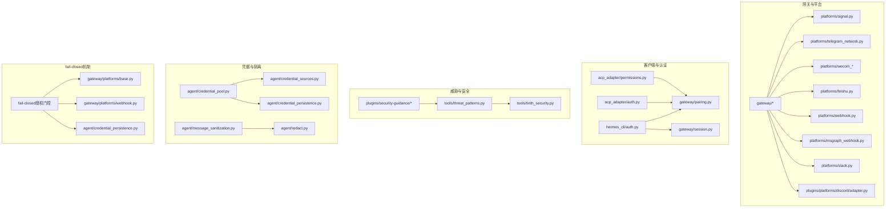
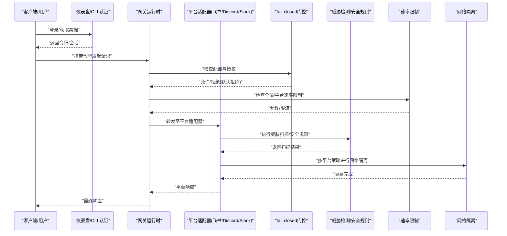
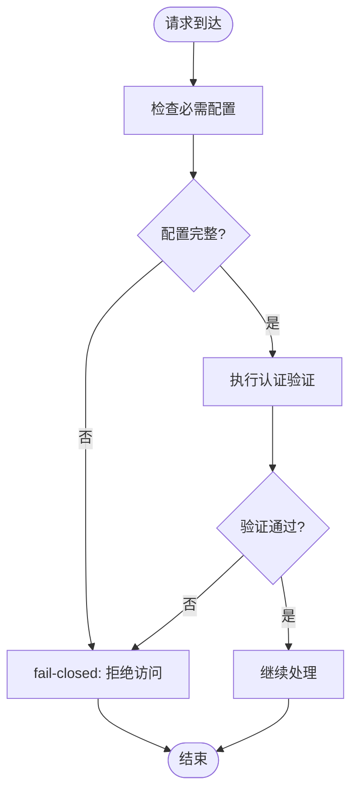
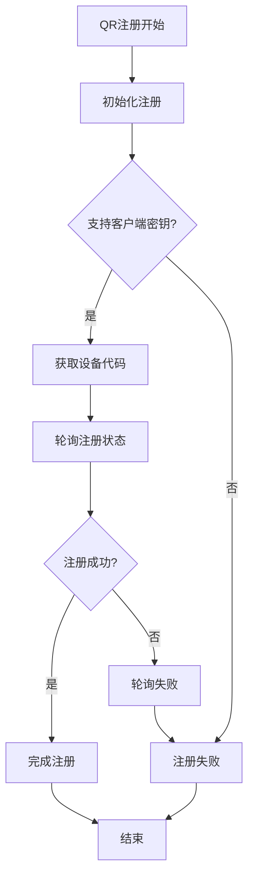
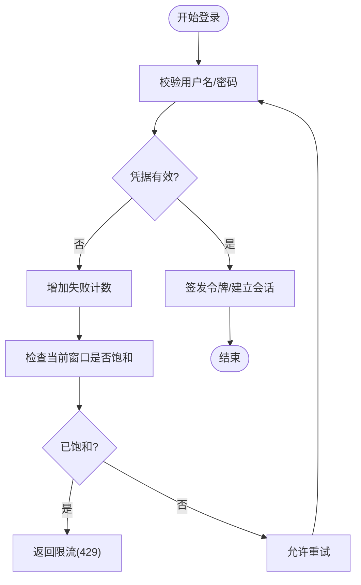
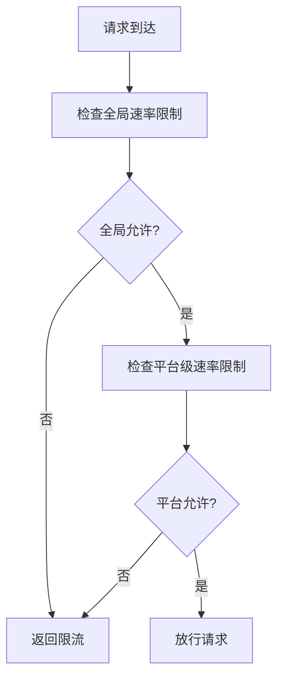
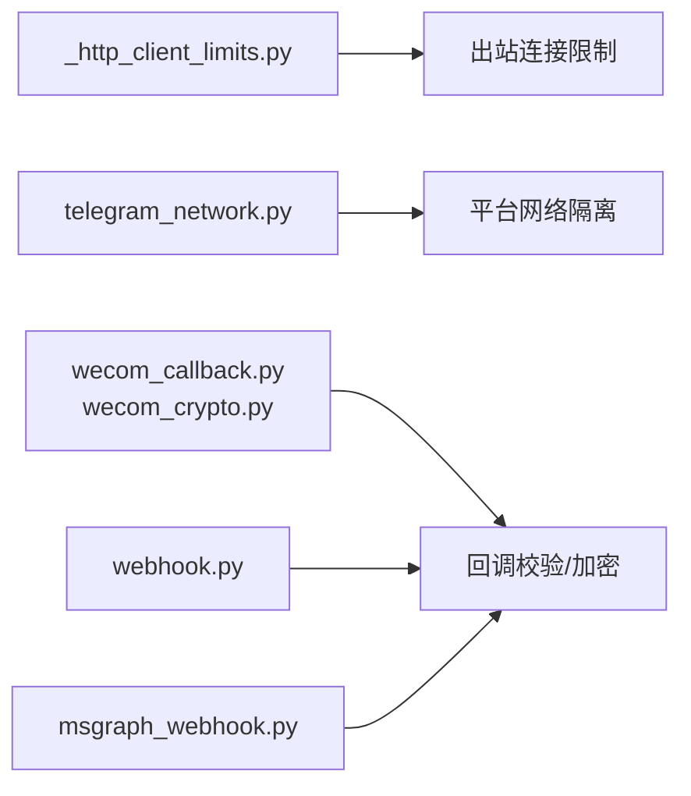
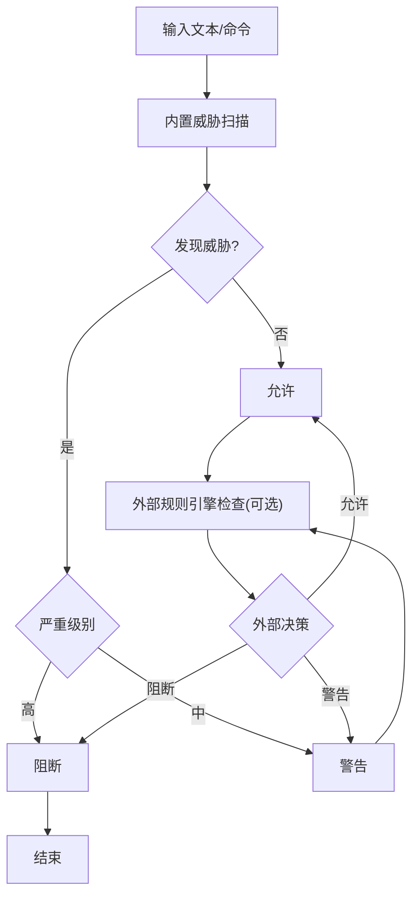
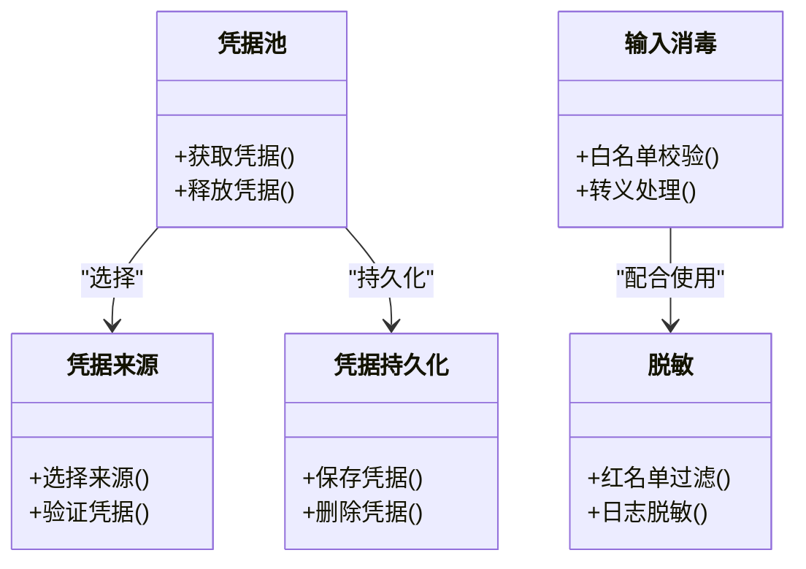
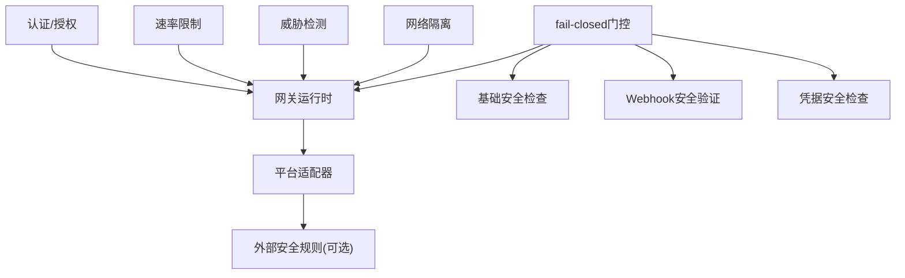

# 平台安全

<cite>
**本文档引用的文件**
- [SECURITY.md](file://SECURITY.md)
- [network-egress-isolation.md](file://docs/security/network-egress-isolation.md)
- [security.md](file://website/docs/user-guide/security.md)
- [signal.md](file://website/docs/user-guide/messaging/signal.md)
- [auth.py](file://acp_adapter/auth.py)
- [permissions.py](file://acp_adapter/permissions.py)
- [auth.py](file://hermes_cli/auth.py)
- [rate_limit_tracker.py](file://agent/rate_limit_tracker.py)
- [signal_rate_limit.py](file://gateway/platforms/signal_rate_limit.py)
- [_http_client_limits.py](file://gateway/platforms/_http_client_limits.py)
- [signal.py](file://gateway/platforms/signal.py)
- [telegram_network.py](file://gateway/platforms/telegram_network.py)
- [wecom_crypto.py](file://gateway/platforms/wecom_crypto.py)
- [wecom_callback.py](file://gateway/platforms/wecom_callback.py)
- [feishu_comment_rules.py](file://gateway/platforms/feishu_comment_rules.py)
- [msgraph_webhook.py](file://gateway/platforms/msgraph_webhook.py)
- [webhook.py](file://gateway/platforms/webhook.py)
- [pairing.py](file://gateway/pairing.py)
- [session.py](file://gateway/session.py)
- [credential_pool.py](file://agent/credential_pool.py)
- [credential_sources.py](file://agent/credential_sources.py)
- [credential_persistence.py](file://agent/credential_persistence.py)
- [message_sanitization.py](file://agent/message_sanitization.py)
- [redact.py](file://agent/redact.py)
- [threat_patterns.py](file://tools/threat_patterns.py)
- [tirith_security.py](file://tools/tirith_security.py)
- [security_guidance_plugin.py](file://plugins/security-guidance/plugin.yaml)
- [patterns.py](file://plugins/security-guidance/patterns.py)
- [test_dashboard_auth_password_login.py](file://tests/hermes_cli/test_dashboard_auth_password_login.py)
- [test_signal.py](file://tests/gateway/test_signal.py)
- [test_threat_patterns.py](file://tests/tools/test_threat_patterns.py)
- [test_tirith_security.py](file://tests/tools/test_tirith_security.py)
- [test_security_guidance_plugin.py](file://tests/plugins/test_security_guidance_plugin.py)
- [feishu.py](file://gateway/platforms/feishu.py)
- [adapter.py](file://plugins/platforms/discord/adapter.py)
- [slack.py](file://gateway/platforms/slack.py)
- [base.py](file://gateway/platforms/base.py)
- [webhook.py](file://gateway/platforms/webhook.py)
- [credential_persistence.py](file://agent/credential_persistence.py)
- [test_feishu.py](file://tests/gateway/test_feishu.py)
- [test_feishu_onboard.py](file://tests/gateway/test_feishu_onboard.py)
- [test_feishu_bot_admission.py](file://tests/gateway/test_feishu_bot_admission.py)
- [test_feishu_approval_buttons.py](file://tests/gateway/test_feishu_approval_buttons.py)
- [test_feishu_comment.py](file://tests/gateway/test_feishu_comment.py)
- [test_feishu_comment_rules.py](file://tests/gateway/test_feishu_comment_rules.py)
- [test_feishu_meeting_invite.py](file://tests/gateway/test_feishu_meeting_invite.py)
- [test_setup_feishu.py](file://tests/gateway/test_setup_feishu.py)
- [test_feishu_bot_auth_bypass.py](file://tests/gateway/test_feishu_bot_auth_bypass.py)
- [test_feishu.py](file://tests/gateway/test_feishu.py)
- [test_feishu.py](file://tests/gateway/test_feishu.py)
- [test_feishu.py](file://tests/gateway/test_feishu.py)
- [test_feishu.py](file://tests/gateway/test_feishu.py)
- [test_feishu.py](file://tests/gateway/test_feishu.py)
- [test_feishu.py](file://tests/gateway/test_feishu.py)
- [test_feishu.py](file://tests/gateway/test_feishu.py)
- [test_feishu.py](file://tests/gateway/test_feishu.py)
- [test_feishu.py](file://tests/gateway/test_feishu.py)
- [test_feishu.py](file://tests/gateway/test_feishu.py)
- [test_feishu.py](file://tests/gateway/test_feishu.py)
- [test_feishu.py](file://tests/gateway/test_feishu.py)
- [test_feishu.py](file://tests/gateway/test_feishu.py)
- [test_feishu.py](file://tests/gateway/test_feishu.py)
- [test_feishu.py](file://tests/gateway/test_feishu.py)
- [test_feishu.py](file://tests/gateway/test_feishu.py)
- [test_feishu.py](file://tests/gateway/test_feishu.py)
- [test_feishu.py](file://tests/gateway/test_feishu.py)
- [test_feishu.py](file://tests/gateway/test_feishu.py)
- [test_feishu.py](file://tests/gateway/test_feishu.py)
- [test_feishu.py](file://tests/gateway/test_feishu.py)
- [test_feishu.py](file://tests/gateway/test_feishu.py)
- [test_feishu.py](file://tests/gateway/test_feishu.py)
- [test_feishu.py](file://tests/gateway/test_feishu.py)
- [test_feishu.py](file://tests/gateway/test_feishu.py)
- [test_feishu.py](file://tests/gateway/test_feishu.py)
- [test_feishu.py](file://tests/gateway/test_feishu.py)
- [......]
</cite>

## 目录
1. [引言](#引言)
2. [项目结构](#项目结构)
3. [核心组件](#核心组件)
4. [架构总览](#架构总览)
5. [详细组件分析](#详细组件分析)
6. [依赖关系分析](#依赖关系分析)
7. [性能考量](#性能考量)
8. [故障排查指南](#故障排查指南)
9. [结论](#结论)
10. [附录](#附录)

## 引言
本文件面向安全管理员与开发者，系统化梳理平台在多平台消息网关中的安全机制、速率限制与防护策略，覆盖信号传输加密、网络隔离与访问控制等关键领域，并提供安全配置、威胁防护、合规建议、安全审计与日志监控、异常检测方法以及应急响应流程。内容基于仓库中实际实现与测试用例进行归纳总结，帮助读者快速建立对平台安全边界的理解与落地实践。

**更新** 新增fail-closed授权机制与Discord、Slack、飞书平台组件的安全硬化交互认证实现。

## 项目结构
围绕"平台安全"的主题，相关能力主要分布在以下模块：
- 网关与平台适配层：负责接入不同消息平台（如 Signal、Telegram、企业微信、飞书、Webhook 等），统一处理认证、授权、速率限制与网络隔离。
- 客户端与仪表盘认证：提供密码登录、会话票据与中间件级鉴权，配合速率限制与访问控制。
- 威胁检测与命令安全：内置威胁模式扫描与外部安全规则引擎集成，支持"允许/警告/阻断"三态决策。
- 凭据管理与隔离：凭证池、来源与持久化分离，避免凭据泄露与跨会话访问。
- 日志与敏感信息脱敏：统一脱敏策略与日志输出控制，降低敏感信息外泄风险。
- fail-closed授权机制：在配置缺失或验证失败时，默认拒绝访问，确保安全边界不被绕过。

**图表来源**
- [feishu.py](file://gateway/platforms/feishu.py)
- [adapter.py](file://plugins/platforms/discord/adapter.py)
- [slack.py](file://gateway/platforms/slack.py)
- [base.py](file://gateway/platforms/base.py)
- [webhook.py](file://gateway/platforms/webhook.py)
- [credential_persistence.py](file://agent/credential_persistence.py)

## 核心组件
- 认证与授权
  - 客户端与仪表盘认证：支持密码登录、会话票据与中间件鉴权，结合速率限制与访问控制。
  - ACP 认证与权限：提供细粒度权限模型与会话管理。
  - fail-closed授权机制：在配置缺失或验证失败时，默认拒绝访问，确保安全边界不被绕过。
- 速率限制
  - 全局与平台级速率限制：通过计数器与时间窗口控制请求频率，防止滥用与 DDoS。
  - 平台特定速率限制：如 Signal 的速率限制策略。
- 网络隔离
  - HTTP 客户端连接限制：统一出站连接参数，降低被探测与滥用风险。
  - 平台网络隔离：如 Telegram 的网络隔离策略。
- 威胁检测与命令安全
  - 内置威胁模式扫描：识别命令注入、C2 行为、同形异体字符等。
  - 外部安全规则引擎：可选集成，支持"允许/警告/阻断"三态。
- 凭据管理与隔离
  - 凭据池、来源与持久化分离，避免凭据泄露与跨会话访问。
  - 借用凭据指纹化处理，确保外部凭据在磁盘上的安全存储。
- 日志与敏感信息脱敏
  - 统一脱敏策略与日志输出控制，降低敏感信息外泄风险。

**章节来源**
- [auth.py](file://hermes_cli/auth.py)
- [auth.py](file://acp_adapter/auth.py)
- [permissions.py](file://acp_adapter/permissions.py)
- [rate_limit_tracker.py](file://agent/rate_limit_tracker.py)
- [signal_rate_limit.py](file://gateway/platforms/signal_rate_limit.py)
- [_http_client_limits.py](file://gateway/platforms/_http_client_limits.py)
- [telegram_network.py](file://gateway/platforms/telegram_network.py)
- [threat_patterns.py](file://tools/threat_patterns.py)
- [tirith_security.py](file://tools/tirith_security.py)
- [credential_pool.py](file://agent/credential_pool.py)
- [credential_sources.py](file://agent/credential_sources.py)
- [credential_persistence.py](file://agent/credential_persistence.py)
- [redact.py](file://agent/redact.py)
- [base.py](file://gateway/platforms/base.py)
- [webhook.py](file://gateway/platforms/webhook.py)
- [credential_persistence.py](file://agent/credential_persistence.py)

## 架构总览
下图展示从客户端到平台网关的整体安全交互流程，包括认证、授权、速率限制、威胁检测与网络隔离的关键节点，以及fail-closed机制的实施位置。

**图表来源**
- [auth.py](file://hermes_cli/auth.py)
- [auth.py](file://acp_adapter/auth.py)
- [permissions.py](file://acp_adapter/permissions.py)
- [rate_limit_tracker.py](file://agent/rate_limit_tracker.py)
- [signal_rate_limit.py](file://gateway/platforms/signal_rate_limit.py)
- [_http_client_limits.py](file://gateway/platforms/_http_client_limits.py)
- [signal.py](file://gateway/platforms/signal.py)
- [threat_patterns.py](file://tools/threat_patterns.py)
- [tirith_security.py](file://tools/tirith_security.py)
- [base.py](file://gateway/platforms/base.py)
- [webhook.py](file://gateway/platforms/webhook.py)

## 详细组件分析

### fail-closed授权机制
fail-closed机制确保在配置缺失、验证失败或系统错误时，默认拒绝访问，防止安全边界被绕过。

- **核心原则**
  - 配置缺失时默认拒绝：当必需的安全配置不存在时，系统拒绝所有访问请求
  - 验证失败时默认拒绝：任何认证或授权验证失败都导致访问被拒绝
  - 错误时默认拒绝：系统内部错误或异常情况下的安全兜底
  - 磁盘边界安全：外部借用的凭据在磁盘上只保留指纹信息，不存储明文

- **实施位置**
  - 网络可达性检查：主机名解析失败时视为网络不可达，确保本地绑定
  - Webhook路由验证：缺少HMAC密钥时直接拒绝请求，防止未认证访问
  - 凭据持久化：外部凭据源在磁盘上只保留不可逆指纹，防止凭据泄露

**图表来源**
- [base.py](file://gateway/platforms/base.py)
- [webhook.py](file://gateway/platforms/webhook.py)
- [credential_persistence.py](file://agent/credential_persistence.py)

**章节来源**
- [base.py](file://gateway/platforms/base.py)
- [webhook.py](file://gateway/platforms/webhook.py)
- [credential_persistence.py](file://agent/credential_persistence.py)

### 平台安全硬化与交互认证

#### 飞书平台安全硬化
飞书平台实现了全面的安全硬化措施，包括QR注册、身份验证和准入控制。

- **QR注册流程**
  - 支持客户端密钥认证方法的初始化检查
  - 设备代码轮询注册机制
  - 用户码显示和二维码生成
  - 注册失败时的安全降级处理

- **身份验证与准入控制**
  - 多层身份标识：open_id、user_id、union_id
  - 组策略控制：开放、白名单、黑名单、管理员专用
  - 机器人禁用策略：可配置的机器人交互限制
  - 提醒门控：@提及验证确保消息目标正确

- **Webhook安全**
  - 验证令牌验证作为第二层认证
  - 请求速率限制和异常跟踪
  - 消息去重和批处理优化

**图表来源**
- [feishu.py](file://gateway/platforms/feishu.py)
- [test_feishu_onboard.py](file://tests/gateway/test_feishu_onboard.py)
- [test_feishu.py](file://tests/gateway/test_feishu.py)

**章节来源**
- [feishu.py](file://gateway/platforms/feishu.py)
- [test_feishu_onboard.py](file://tests/gateway/test_feishu_onboard.py)
- [test_feishu.py](file://tests/gateway/test_feishu.py)
- [test_feishu_bot_admission.py](file://tests/gateway/test_feishu_bot_admission.py)
- [test_feishu_approval_buttons.py](file://tests/gateway/test_feishu_approval_buttons.py)

#### Discord平台安全硬化
Discord平台实现了严格的消息处理和安全控制机制。

- **消息处理安全**
  - 消息内容意图要求：必须启用消息内容意图才能正常回复
  - 服务器成员意图：仅在需要解析用户名时才请求
  - 去重机制：防止Discord RESUME重播事件导致的重复响应
  - 语音通道安全：端到端加密音频处理

- **提及控制**
  - 默认禁用@everyone和角色提醒
  - 可配置的提及策略：用户提醒、回复提醒
  - 安全的提及解析和清理

- **按钮审批机制**
  - 交互式命令审批
  - 多用户上下文隔离
  - 防重放攻击的令牌管理

**章节来源**
- [adapter.py](file://plugins/platforms/discord/adapter.py)
- [test_discord_component_auth.py](file://tests/gateway/test_discord_component_auth.py)
- [test_discord_allowed_mentions.py](file://tests/gateway/test_discord_allowed_mentions.py)
- [test_discord_bot_filter.py](file://tests/gateway/test_discord_bot_filter.py)

#### Slack平台安全硬化
Slack平台采用了Socket Mode的安全连接和多层认证机制。

- **Socket Mode安全连接**
  - 应用令牌和机器人令牌双重验证
  - 自愈监控：自动检测和重启断开的连接
  - 代理支持：安全的HTTP和SOCKS代理配置

- **多工作区支持**
  - 多令牌支持：逗号分隔的多个工作区令牌
  - 工作区隔离：每个工作区独立的客户端和用户ID映射
  - 动态令牌加载：从JSON文件加载保存的工作区令牌

- **审批和上下文管理**
  - 斜杠命令上下文：精确的用户上下文隔离
  - 批准按钮防重放：防止重复点击攻击
  - 线程上下文缓存：安全的线程历史记录缓存

**章节来源**
- [slack.py](file://gateway/platforms/slack.py)
- [test_slack.py](file://tests/gateway/test_slack.py)
- [test_slack_approval_buttons.py](file://tests/gateway/test_slack_approval_buttons.py)
- [test_slack_mention.py](file://tests/gateway/test_slack_mention.py)

### 认证与授权
- 密码登录与速率限制
  - 登录接口具备失败次数限制与时间窗口控制，饱和后对有效凭据也会触发限流，确保暴力破解成本。
  - 测试用例验证了重复失败最终返回限流状态，且正确凭据在窗口饱和后同样受限。
- ACP 认证与权限
  - 提供细粒度权限模型与会话管理，结合平台侧的访问控制策略，形成多层防护。
- 仪表盘与网关配对
  - 支持配对存储与批准流程，未批准用户默认拒绝访问，降低误接入风险。

**图表来源**
- [test_dashboard_auth_password_login.py](file://tests/hermes_cli/test_dashboard_auth_password_login.py)

**章节来源**
- [auth.py](file://hermes_cli/auth.py)
- [auth.py](file://acp_adapter/auth.py)
- [permissions.py](file://acp_adapter/permissions.py)
- [pairing.py](file://gateway/pairing.py)
- [session.py](file://gateway/session.py)
- [test_dashboard_auth_password_login.py](file://tests/hermes_cli/test_dashboard_auth_password_login.py)

### 速率限制
- 全局速率限制
  - 基于计数器与滑动时间窗，限制每 IP 每窗口的尝试次数；饱和后即使有效凭据也限流。
- 平台级速率限制
  - 针对不同平台（如 Signal）设置独立策略，避免平台侧被滥用。
- HTTP 客户端连接限制
  - 统一出站连接参数，降低被探测与滥用风险，减少横向移动机会。

**图表来源**
- [rate_limit_tracker.py](file://agent/rate_limit_tracker.py)
- [signal_rate_limit.py](file://gateway/platforms/signal_rate_limit.py)
- [_http_client_limits.py](file://gateway/platforms/_http_client_limits.py)

**章节来源**
- [rate_limit_tracker.py](file://agent/rate_limit_tracker.py)
- [signal_rate_limit.py](file://gateway/platforms/signal_rate_limit.py)
- [_http_client_limits.py](file://gateway/platforms/_http_client_limits.py)
- [test_dashboard_auth_password_login.py](file://tests/hermes_cli/test_dashboard_auth_password_login.py)

### 网络隔离与访问控制
- HTTP 客户端连接限制
  - 统一出站连接参数，限制并发与超时，降低被探测与滥用风险。
- 平台网络隔离
  - 如 Telegram 的网络隔离策略，限制平台间通信路径，降低横向移动风险。
- 平台回调与加密
  - 企业微信回调与加密处理，确保回调链路可信与数据机密性。
- Webhook 与 Microsoft Graph 回调
  - 对回调来源与签名进行校验，防止伪造请求。

**图表来源**
- [_http_client_limits.py](file://gateway/platforms/_http_client_limits.py)
- [telegram_network.py](file://gateway/platforms/telegram_network.py)
- [wecom_callback.py](file://gateway/platforms/wecom_callback.py)
- [wecom_crypto.py](file://gateway/platforms/wecom_crypto.py)
- [webhook.py](file://gateway/platforms/webhook.py)
- [msgraph_webhook.py](file://gateway/platforms/msgraph_webhook.py)

**章节来源**
- [_http_client_limits.py](file://gateway/platforms/_http_client_limits.py)
- [telegram_network.py](file://gateway/platforms/telegram_network.py)
- [wecom_callback.py](file://gateway/platforms/wecom_callback.py)
- [wecom_crypto.py](file://gateway/platforms/wecom_crypto.py)
- [webhook.py](file://gateway/platforms/webhook.py)
- [msgraph_webhook.py](file://gateway/platforms/msgraph_webhook.py)

### 威胁检测与命令安全
- 内置威胁模式扫描
  - 覆盖 C2 行为、强制性动作、身份伪装、同形异体字符、环境变量操作等高风险模式。
  - 在上下文文件扫描中采用更严格阈值，在工具结果层面采用宽松阈值，平衡误报与漏报。
- 外部安全规则引擎集成
  - 可选集成第三方规则引擎，支持"允许/警告/阻断"，并具备失败开路策略以保证可用性。
- 插件化安全指导
  - 提供安全规则插件，确保规则字段完整性与唯一性，保障规则集一致性。

**图表来源**
- [threat_patterns.py](file://tools/threat_patterns.py)
- [tirith_security.py](file://tools/tirith_security.py)
- [security_guidance_plugin.py](file://plugins/security-guidance/plugin.yaml)
- [patterns.py](file://plugins/security-guidance/patterns.py)

**章节来源**
- [threat_patterns.py](file://tools/threat_patterns.py)
- [test_threat_patterns.py](file://tests/tools/test_threat_patterns.py)
- [tirith_security.py](file://tools/tirith_security.py)
- [test_tirith_security.py](file://tests/tools/test_tirith_security.py)
- [security_guidance_plugin.py](file://plugins/security-guidance/plugin.yaml)
- [patterns.py](file://plugins/security-guidance/patterns.py)
- [test_security_guidance_plugin.py](file://tests/plugins/test_security_guidance_plugin.py)

### 凭据管理与隔离
- 凭据池、来源与持久化分离
  - 将凭据来源、池化与持久化解耦，避免凭据泄露与跨会话访问。
  - 借用凭据指纹化处理，确保外部凭据在磁盘上的安全存储。
- 输入消毒与路径安全
  - 对终端工具后端的工作目录参数进行白名单校验，防止路径遍历与命令注入。
- 敏感信息脱敏
  - 统一日志与输出中的敏感信息（如电话号码），降低信息外泄风险。

**图表来源**
- [credential_pool.py](file://agent/credential_pool.py)
- [credential_sources.py](file://agent/credential_sources.py)
- [credential_persistence.py](file://agent/credential_persistence.py)
- [message_sanitization.py](file://agent/message_sanitization.py)
- [redact.py](file://agent/redact.py)

**章节来源**
- [credential_pool.py](file://agent/credential_pool.py)
- [credential_sources.py](file://agent/credential_sources.py)
- [credential_persistence.py](file://agent/credential_persistence.py)
- [message_sanitization.py](file://agent/message_sanitization.py)
- [redact.py](file://agent/redact.py)

### 平台特定安全考虑与信号传输加密
- Signal
  - 传输加密：Signal 协议端到端加密保护消息内容在传输过程中的机密性。
  - 访问控制：必须配置允许用户列表或使用私聊配对，否则默认拒绝所有消息，防止未授权接入。
  - 运行时安全：signal-cli 会话数据包含账户凭证，需妥善保护；日志中对电话号码进行脱敏。
- 其他平台
  - 企业微信、飞书、Webhook、Microsoft Graph 回调等均具备回调校验与加密处理，确保链路可信与数据机密性。

**章节来源**
- [signal.md](file://website/docs/user-guide/messaging/signal.md)
- [test_signal.py](file://tests/gateway/test_signal.py)
- [signal.py](file://gateway/platforms/signal.py)
- [wecom_callback.py](file://gateway/platforms/wecom_callback.py)
- [wecom_crypto.py](file://gateway/platforms/wecom_crypto.py)
- [feishu_comment_rules.py](file://gateway/platforms/feishu_comment_rules.py)
- [webhook.py](file://gateway/platforms/webhook.py)
- [msgraph_webhook.py](file://gateway/platforms/msgraph_webhook.py)

## 依赖关系分析
- 组件内聚与耦合
  - 网关层与平台适配器之间通过统一接口交互，降低平台差异带来的耦合。
  - 认证与授权模块与网关运行时紧密耦合，确保请求进入前完成身份与权限校验。
  - fail-closed机制贯穿所有安全相关组件，形成统一的安全边界。
- 外部依赖与集成点
  - 外部安全规则引擎（可选）与内置威胁扫描共同构成威胁检测闭环。
  - 凭据管理模块与平台适配器协作，确保凭据在最小权限范围内使用。
  - 平台特定的安全组件（飞书QR注册、Discord按钮审批、Slack Socket Mode）提供差异化防护。

**图表来源**
- [auth.py](file://hermes_cli/auth.py)
- [rate_limit_tracker.py](file://agent/rate_limit_tracker.py)
- [threat_patterns.py](file://tools/threat_patterns.py)
- [tirith_security.py](file://tools/tirith_security.py)
- [signal.py](file://gateway/platforms/signal.py)
- [base.py](file://gateway/platforms/base.py)
- [webhook.py](file://gateway/platforms/webhook.py)
- [credential_persistence.py](file://agent/credential_persistence.py)

## 性能考量
- 速率限制与缓存
  - 合理设置时间窗口与配额，避免过度限流影响正常用户；对热点资源可采用分布式缓存。
- 威胁检测延迟
  - 内置扫描与外部规则引擎检查应尽量异步化，避免阻塞主请求链路。
- 日志与脱敏
  - 脱敏与日志输出应避免在高频路径上造成额外开销，必要时采用批量与采样策略。
- fail-closed机制开销
  - fail-closed检查应在关键路径上保持轻量，避免影响正常流量的处理速度。

## 故障排查指南
- 登录与认证
  - 若出现频繁 429，检查登录失败次数与时间窗口配置，确认是否存在异常来源。
  - 确认令牌签发与会话票据有效性，核对中间件鉴权逻辑。
- 平台接入
  - Signal：确保 signal-cli 守护进程运行、Java 版本满足要求、仅单实例监听同一号码。
  - 企业微信/飞书/Webhook/Microsoft Graph：核对回调签名与加密配置，确保回调来源可信。
  - 飞书QR注册：检查客户端密钥支持情况、设备代码轮询状态、用户码显示。
  - Discord：验证消息内容意图、服务器成员意图、提及控制配置。
  - Slack：检查Socket Mode连接状态、应用令牌和机器人令牌配置。
- 威胁检测
  - 若误报过多，调整内置扫描阈值或外部规则；若漏报，增强规则集或启用更严格的扫描范围。
- 凭据与日志
  - 核对凭据池与持久化配置，确保凭据最小暴露面；检查日志脱敏策略，避免敏感信息泄露。
- fail-closed问题
  - 检查配置文件中的安全设置，确认必需配置项是否完整。
  - 验证Webhook路由的HMAC密钥配置。
  - 确认外部凭据源的指纹化处理是否正确。

**章节来源**
- [test_dashboard_auth_password_login.py](file://tests/hermes_cli/test_dashboard_auth_password_login.py)
- [signal.md](file://website/docs/user-guide/messaging/signal.md)
- [test_signal.py](file://tests/gateway/test_signal.py)
- [test_threat_patterns.py](file://tests/tools/test_threat_patterns.py)
- [test_tirith_security.py](file://tests/tools/test_tirith_security.py)
- [test_feishu_onboard.py](file://tests/gateway/test_feishu_onboard.py)
- [test_feishu.py](file://tests/gateway/test_feishu.py)
- [test_discord_component_auth.py](file://tests/gateway/test_discord_component_auth.py)
- [test_slack.py](file://tests/gateway/test_slack.py)

## 结论
平台安全以"纵深防御"为核心理念，通过认证授权、速率限制、网络隔离、威胁检测、凭据隔离与日志脱敏等多层机制协同工作，形成完整的安全边界。新增的fail-closed授权机制确保在配置缺失或验证失败时默认拒绝访问，进一步强化了安全边界。针对不同平台特性（如 Signal 的端到端加密、企业微信的回调校验、飞书的QR注册流程、Discord的按钮审批机制、Slack的Socket Mode连接）采取差异化防护策略，并辅以外部安全规则引擎与插件化规则集，持续提升对抗新型威胁的能力。建议在生产环境中结合自身合规要求，完善审计与监控体系，定期演练应急响应流程，确保安全策略的有效落地与持续演进。

## 附录
- 合规与审计
  - 建议建立安全审计日志与异常检测机制，覆盖登录、认证、授权、速率限制触发、威胁检测与外部规则引擎行为等关键事件。
  - 对敏感信息（如电话号码、回调签名）进行脱敏与最小化披露，遵循数据最小化原则。
  - 定期审查fail-closed机制的配置和日志，确保安全策略的有效执行。
- 应急响应
  - 制定针对暴力破解、回调伪造、凭据泄露、规则误报/漏报、平台认证失败等场景的应急处置流程，明确升级路径与恢复策略。
  - 建立fail-closed机制的监控告警，及时发现配置缺失或验证失败的情况。
  - 为平台特定的安全问题（飞书QR注册失败、Discord按钮审批失效、Slack Socket Mode断开）制定专门的应急响应预案。