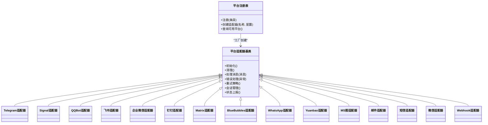
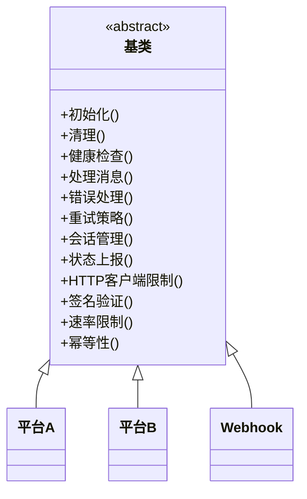
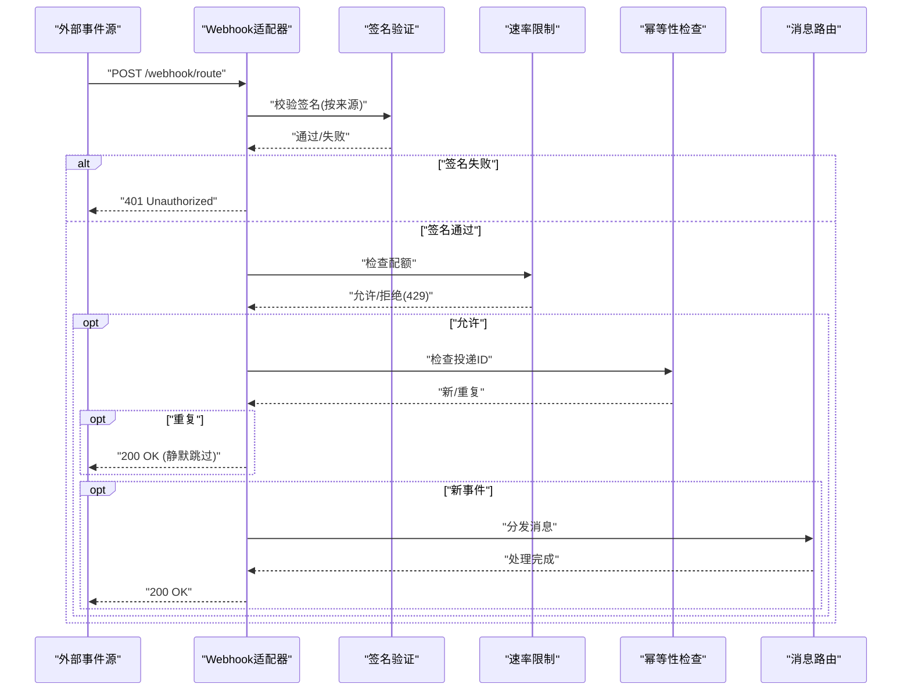
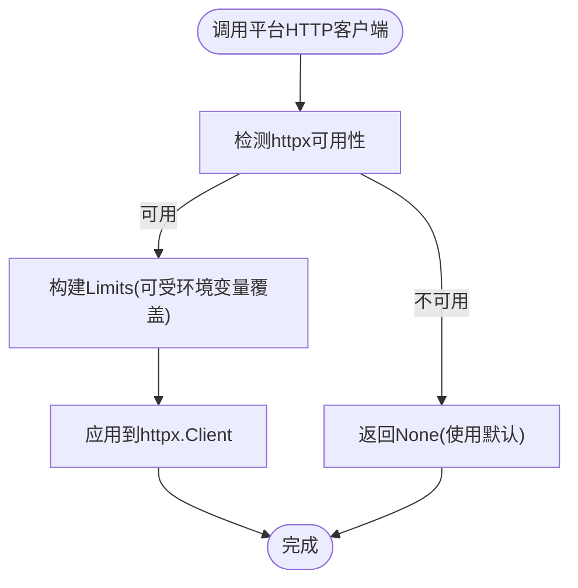
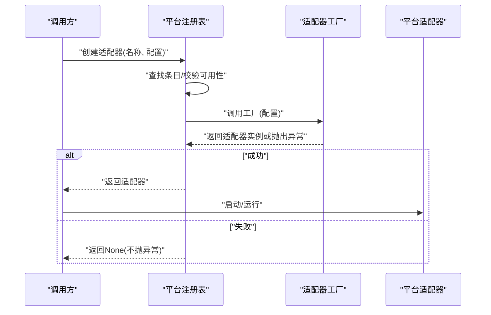
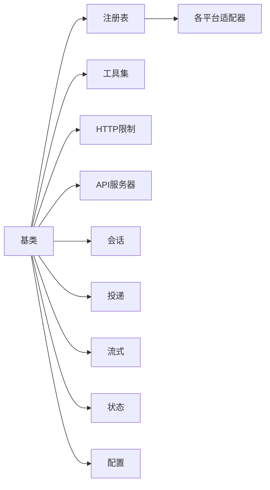

# 平台适配器架构

<cite>
**本文引用的文件**
- [gateway/platforms/base.py](file://gateway/platforms/base.py)
- [gateway/platforms/webhook.py](file://gateway/platforms/webhook.py)
- [gateway/platforms/_http_client_limits.py](file://gateway/platforms/_http_client_limits.py)
- [gateway/platforms/api_server.py](file://gateway/platforms/api_server.py)
- [gateway/platforms/telegram.py](file://gateway/platforms/telegram.py)
- [gateway/platforms/signal.py](file://gateway/platforms/signal.py)
- [gateway/platforms/qqbot/adapter.py](file://gateway/platforms/qqbot/adapter.py)
- [gateway/platforms/feishu.py](file://gateway/platforms/feishu.py)
- [gateway/platforms/wecom.py](file://gateway/platforms/wecom.py)
- [gateway/platforms/dingtalk.py](file://gateway/platforms/dingtalk.py)
- [gateway/platforms/matrix.py](file://gateway/platforms/matrix.py)
- [gateway/platforms/bluebubbles.py](file://gateway/platforms/bluebubbles.py)
- [gateway/platforms/whatsapp.py](file://gateway/platforms/whatsapp.py)
- [gateway/platforms/yuanbao.py](file://gateway/platforms/yuanbao.py)
- [gateway/platforms/msgraph_webhook.py](file://gateway/platforms/msgraph_webhook.py)
- [gateway/platforms/helpers.py](file://gateway/platforms/helpers.py)
- [gateway/platforms/signal_rate_limit.py](file://gateway/platforms/signal_rate_limit.py)
- [gateway/platforms/telegram_network.py](file://gateway/platforms/telegram_network.py)
- [gateway/platforms/wecom_callback.py](file://gateway/platforms/wecom_callback.py)
- [gateway/platforms/wecom_crypto.py](file://gateway/platforms/wecom_crypto.py)
- [gateway/platforms/weixin.py](file://gateway/platforms/weixin.py)
- [gateway/platforms/email.py](file://gateway/platforms/email.py)
- [gateway/platforms/sms.py](file://gateway/platforms/sms.py)
- [gateway/platforms/yuanbao_media.py](file://gateway/platforms/yuanbao_media.py)
- [gateway/platforms/yuanbao_proto.py](file://gateway/platforms/yuanbao_proto.py)
- [gateway/platforms/yuanbao_sticker.py](file://gateway/platforms/yuanbao_sticker.py)
- [gateway/platforms/ADDING_A_PLATFORM.md](file://gateway/platforms/ADDING_A_PLATFORM.md)
- [gateway/platform_registry.py](file://gateway/platform_registry.py)
- [gateway/config.py](file://gateway/config.py)
- [gateway/session.py](file://gateway/session.py)
- [gateway/session_context.py](file://gateway/session_context.py)
- [gateway/run.py](file://gateway/run.py)
- [gateway/status.py](file://gateway/status.py)
- [gateway/delivery.py](file://gateway/delivery.py)
- [gateway/stream_dispatch.py](file://gateway/stream_dispatch.py)
- [gateway/stream_events.py](file://gateway/stream_events.py)
- [gateway/channel_directory.py](file://gateway/channel_directory.py)
- [gateway/pairing.py](file://gateway/pairing.py)
- [gateway/display_config.py](file://gateway/display_config.py)
- [gateway/memory_monitor.py](file://gateway/memory_monitor.py)
- [gateway/shutdown_forensics.py](file://gateway/shutdown_forensics.py)
- [gateway/restart.py](file://gateway/restart.py)
- [website/i18n/zh-Hans/docusaurus-plugin-content-docs/current/user-guide/messaging/webhooks.md](file://website/i18n/zh-Hans/docusaurus-plugin-content-docs/current/user-guide/messaging/webhooks.md)
- [tests/gateway/test_webhook_signature_rate_limit.py](file://tests/gateway/test_webhook_signature_rate_limit.py)
- [tests/gateway/test_platform_http_client_limits.py](file://tests/gateway/test_platform_http_client_limits.py)
- [tests/gateway/test_platform_registry.py](file://tests/gateway/test_platform_registry.py)
</cite>

## 目录
1. [引言](#引言)
2. [项目结构](#项目结构)
3. [核心组件](#核心组件)
4. [架构总览](#架构总览)
5. [详细组件分析](#详细组件分析)
6. [依赖分析](#依赖分析)
7. [性能考虑](#性能考虑)
8. [故障排查指南](#故障排查指南)
9. [结论](#结论)
10. [附录](#附录)

## 引言
本文件系统化阐述平台适配器架构，围绕适配器设计模式、消息路由机制与统一接口设计展开，覆盖基类抽象、继承关系与扩展点；详述HTTP客户端限制、轮询模式与Webhook配置；给出生命周期管理、错误处理与重试策略；涵盖身份验证流程、会话管理与并发控制，并为平台开发者提供完整架构指南与最佳实践。

## 项目结构
平台适配器位于 gateway/platforms 子模块，采用“按平台分目录”的组织方式，统一通过注册表进行装配与运行时调度。核心目录包括：
- 基类与通用能力：base.py、helpers.py、_http_client_limits.py、api_server.py
- 具体平台适配器：telegram.py、signal.py、qqbot/adapter.py、feishu.py、wecom.py、dingtalk.py、matrix.py、bluebubbles.py、whatsapp.py、yuanbao*.py、msgraph_webhook.py、email.py、sms.py、weixin.py 等
- 路由与Webhook：webhook.py、wecom_callback.py、wecom_crypto.py
- 注册与运行：platform_registry.py、run.py、config.py、session.py、session_context.py、status.py、delivery.py、stream_dispatch.py、stream_events.py、channel_directory.py、pairing.py、display_config.py、memory_monitor.py、shutdown_forensics.py、restart.py

```mermaid
graph TB
subgraph "网关平台层"
Base["基础适配器<br/>gateway/platforms/base.py"]
Helpers["通用工具<br/>gateway/platforms/helpers.py"]
Limits["_http_client_limits<br/>gateway/platforms/_http_client_limits.py"]
APIServer["API服务器<br/>gateway/platforms/api_server.py"]
Webhook["Webhook适配器<br/>gateway/platforms/webhook.py"]
Registry["平台注册表<br/>gateway/platform_registry.py"]
Config["平台配置<br/>gateway/config.py"]
Session["会话管理<br/>gateway/session.py"]
SessionCtx["会话上下文<br/>gateway/session_context.py"]
Status["状态管理<br/>gateway/status.py"]
Delivery["投递调度<br/>gateway/delivery.py"]
StreamDispatch["流式分发<br/>gateway/stream_dispatch.py"]
StreamEvents["流事件<br/>gateway/stream_events.py"]
ChannelDir["频道目录<br/>gateway/channel_directory.py"]
Pairing["配对管理<br/>gateway/pairing.py"]
DisplayCfg["显示配置<br/>gateway/display_config.py"]
MemMon["内存监控<br/>gateway/memory_monitor.py"]
Shutdown["停机取证<br/>gateway/shutdown_forensics.py"]
Restart["重启控制<br/>gateway/restart.py"]
end
subgraph "具体平台"
TG["Telegram<br/>gateway/platforms/telegram.py"]
SIG["Signal<br/>gateway/platforms/signal.py"]
QQ["QQBot<br/>gateway/platforms/qqbot/adapter.py"]
FS["飞书<br/>gateway/platforms/feishu.py"]
WC["企业微信<br/>gateway/platforms/wecom.py"]
DT["钉钉<br/>gateway/platforms/dingtalk.py"]
MX["Matrix<br/>gateway/platforms/matrix.py"]
BB["BlueBubbles<br/>gateway/platforms/bluebubbles.py"]
WA["WhatsApp<br/>gateway/platforms/whatsapp.py"]
YB["元包(Yuanbao)<br/>gateway/platforms/yuanbao*.py"]
MSG["MS Graph Webhook<br/>gateway/platforms/msgraph_webhook.py"]
Email["邮件<br/>gateway/platforms/email.py"]
SMS["短信<br/>gateway/platforms/sms.py"]
WX["微信<br/>gateway/platforms/weixin.py"]
end
Registry --> Base
Base --> TG
Base --> SIG
Base --> QQ
Base --> FS
Base --> WC
Base --> DT
Base --> MX
Base --> BB
Base --> WA
Base --> YB
Base --> MSG
Base --> Email
Base --> SMS
Base --> WX
Base --> Webhook
Base --> Limits
Base --> Helpers
Base --> APIServer
Base --> Session
Base --> SessionCtx
Base --> Status
Base --> Delivery
Base --> StreamDispatch
Base --> StreamEvents
Base --> ChannelDir
Base --> Pairing
Base --> DisplayCfg
Base --> MemMon
Base --> Shutdown
Base --> Restart
```

图表来源
- [gateway/platforms/base.py](file://gateway/platforms/base.py)
- [gateway/platforms/webhook.py](file://gateway/platforms/webhook.py)
- [gateway/platforms/_http_client_limits.py](file://gateway/platforms/_http_client_limits.py)
- [gateway/platforms/api_server.py](file://gateway/platforms/api_server.py)
- [gateway/platforms/telegram.py](file://gateway/platforms/telegram.py)
- [gateway/platforms/signal.py](file://gateway/platforms/signal.py)
- [gateway/platforms/qqbot/adapter.py](file://gateway/platforms/qqbot/adapter.py)
- [gateway/platforms/feishu.py](file://gateway/platforms/feishu.py)
- [gateway/platforms/wecom.py](file://gateway/platforms/wecom.py)
- [gateway/platforms/dingtalk.py](file://gateway/platforms/dingtalk.py)
- [gateway/platforms/matrix.py](file://gateway/platforms/matrix.py)
- [gateway/platforms/bluebubbles.py](file://gateway/platforms/bluebubbles.py)
- [gateway/platforms/whatsapp.py](file://gateway/platforms/whatsapp.py)
- [gateway/platforms/yuanbao.py](file://gateway/platforms/yuanbao.py)
- [gateway/platforms/msgraph_webhook.py](file://gateway/platforms/msgraph_webhook.py)
- [gateway/platforms/helpers.py](file://gateway/platforms/helpers.py)
- [gateway/platform_registry.py](file://gateway/platform_registry.py)
- [gateway/config.py](file://gateway/config.py)
- [gateway/session.py](file://gateway/session.py)
- [gateway/session_context.py](file://gateway/session_context.py)
- [gateway/status.py](file://gateway/status.py)
- [gateway/delivery.py](file://gateway/delivery.py)
- [gateway/stream_dispatch.py](file://gateway/stream_dispatch.py)
- [gateway/stream_events.py](file://gateway/stream_events.py)
- [gateway/channel_directory.py](file://gateway/channel_directory.py)
- [gateway/pairing.py](file://gateway/pairing.py)
- [gateway/display_config.py](file://gateway/display_config.py)
- [gateway/memory_monitor.py](file://gateway/memory_monitor.py)
- [gateway/shutdown_forensics.py](file://gateway/shutdown_forensics.py)
- [gateway/restart.py](file://gateway/restart.py)

章节来源
- [gateway/platforms/base.py](file://gateway/platforms/base.py)
- [gateway/platforms/helpers.py](file://gateway/platforms/helpers.py)
- [gateway/platforms/_http_client_limits.py](file://gateway/platforms/_http_client_limits.py)
- [gateway/platforms/api_server.py](file://gateway/platforms/api_server.py)
- [gateway/platform_registry.py](file://gateway/platform_registry.py)
- [gateway/config.py](file://gateway/config.py)
- [gateway/session.py](file://gateway/session.py)
- [gateway/session_context.py](file://gateway/session_context.py)
- [gateway/status.py](file://gateway/status.py)
- [gateway/delivery.py](file://gateway/delivery.py)
- [gateway/stream_dispatch.py](file://gateway/stream_dispatch.py)
- [gateway/stream_events.py](file://gateway/stream_events.py)
- [gateway/channel_directory.py](file://gateway/channel_directory.py)
- [gateway/pairing.py](file://gateway/pairing.py)
- [gateway/display_config.py](file://gateway/display_config.py)
- [gateway/memory_monitor.py](file://gateway/memory_monitor.py)
- [gateway/shutdown_forensics.py](file://gateway/shutdown_forensics.py)
- [gateway/restart.py](file://gateway/restart.py)

## 核心组件
- 基类抽象与统一接口
  - 基类定义了平台适配器的生命周期钩子、消息路由入口、会话与状态管理接口、错误处理与重试策略模板方法，确保所有平台实现遵循一致的契约。
  - 关键职责：初始化与清理、配置校验、消息接收与分发、错误分类与重试、会话持久化与并发控制。
- 平台注册表
  - 提供平台注册、工厂创建、可用性检查与配置校验，屏蔽平台差异，统一对外暴露。
- 通用工具与HTTP客户端限制
  - 提供跨平台共享的HTTP连接池优化、限流与幂等性保障、网络与安全辅助函数。
- Webhook与回调
  - 面向外部事件驱动的适配器，支持签名验证、速率限制、幂等性与请求体大小限制。

章节来源
- [gateway/platforms/base.py](file://gateway/platforms/base.py)
- [gateway/platforms/helpers.py](file://gateway/platforms/helpers.py)
- [gateway/platforms/_http_client_limits.py](file://gateway/platforms/_http_client_limits.py)
- [gateway/platforms/webhook.py](file://gateway/platforms/webhook.py)
- [gateway/platform_registry.py](file://gateway/platform_registry.py)

## 架构总览
平台适配器采用“统一基类 + 多平台实现 + 注册表调度”的分层架构。所有平台实现统一继承自基类，遵循相同的生命周期与接口约定；注册表负责动态装配与运行时调度；Webhook与回调适配器独立于长连接平台，提供事件驱动的消息入口。

图表来源
- [gateway/platforms/base.py](file://gateway/platforms/base.py)
- [gateway/platforms/telegram.py](file://gateway/platforms/telegram.py)
- [gateway/platforms/signal.py](file://gateway/platforms/signal.py)
- [gateway/platforms/qqbot/adapter.py](file://gateway/platforms/qqbot/adapter.py)
- [gateway/platforms/feishu.py](file://gateway/platforms/feishu.py)
- [gateway/platforms/wecom.py](file://gateway/platforms/wecom.py)
- [gateway/platforms/dingtalk.py](file://gateway/platforms/dingtalk.py)
- [gateway/platforms/matrix.py](file://gateway/platforms/matrix.py)
- [gateway/platforms/bluebubbles.py](file://gateway/platforms/bluebubbles.py)
- [gateway/platforms/whatsapp.py](file://gateway/platforms/whatsapp.py)
- [gateway/platforms/yuanbao.py](file://gateway/platforms/yuanbao.py)
- [gateway/platforms/msgraph_webhook.py](file://gateway/platforms/msgraph_webhook.py)
- [gateway/platforms/email.py](file://gateway/platforms/email.py)
- [gateway/platforms/sms.py](file://gateway/platforms/sms.py)
- [gateway/platforms/weixin.py](file://gateway/platforms/weixin.py)
- [gateway/platforms/webhook.py](file://gateway/platforms/webhook.py)
- [gateway/platform_registry.py](file://gateway/platform_registry.py)

## 详细组件分析

### 基类抽象与继承关系
- 抽象职责
  - 生命周期：初始化、健康检查、清理、重启、停机取证
  - 接口契约：消息接收、路由、分发、会话与状态管理
  - 错误处理：异常分类、重试策略、降级与熔断
  - 安全与合规：签名验证、速率限制、幂等性、请求体大小限制
- 继承关系
  - 所有平台适配器均继承自统一基类，复用HTTP客户端限制、会话与状态管理、错误处理模板方法
- 扩展点
  - 平台特定的初始化参数、认证流程、消息解析与序列化、回调与轮询模式切换

图表来源
- [gateway/platforms/base.py](file://gateway/platforms/base.py)
- [gateway/platforms/webhook.py](file://gateway/platforms/webhook.py)

章节来源
- [gateway/platforms/base.py](file://gateway/platforms/base.py)

### Webhook适配器与消息路由
- 功能特性
  - 支持多来源签名验证（GitHub、GitLab、通用）
  - 全局与路由级速率限制（固定窗口）
  - 幂等性：基于投递ID缓存1小时，避免重复触发
  - 请求体大小限制，默认1MB，可配置
- 路由与配置
  - 路由级secret为必填，开发测试可使用特殊值（仅限回环地址）
  - 支持全局配置rate_limit与max_body_bytes
- 测试验证
  - 签名验证优先于速率限制，防止恶意请求消耗配额

图表来源
- [gateway/platforms/webhook.py](file://gateway/platforms/webhook.py)
- [website/i18n/zh-Hans/docusaurus-plugin-content-docs/current/user-guide/messaging/webhooks.md](file://website/i18n/zh-Hans/docusaurus-plugin-content-docs/current/user-guide/messaging/webhooks.md)
- [tests/gateway/test_webhook_signature_rate_limit.py](file://tests/gateway/test_webhook_signature_rate_limit.py)

章节来源
- [gateway/platforms/webhook.py](file://gateway/platforms/webhook.py)
- [website/i18n/zh-Hans/docusaurus-plugin-content-docs/current/user-guide/messaging/webhooks.md](file://website/i18n/zh-Hans/docusaurus-plugin-content-docs/current/user-guide/messaging/webhooks.md)
- [tests/gateway/test_webhook_signature_rate_limit.py](file://tests/gateway/test_webhook_signature_rate_limit.py)

### HTTP客户端限制与连接池优化
- 目标
  - 在高并发与长连接场景下降低CLOSE_WAIT堆积，缓解FD耗尽风险
- 实现
  - 提供统一的httpx.Limits构造器，支持环境变量覆盖
  - 默认收紧keep-alive过期时间与最大空闲连接数
- 测试
  - 验证httpx不可用时返回None，保证兼容性与降级

图表来源
- [gateway/platforms/_http_client_limits.py](file://gateway/platforms/_http_client_limits.py)
- [tests/gateway/test_platform_http_client_limits.py](file://tests/gateway/test_platform_http_client_limits.py)

章节来源
- [gateway/platforms/_http_client_limits.py](file://gateway/platforms/_http_client_limits.py)
- [tests/gateway/test_platform_http_client_limits.py](file://tests/gateway/test_platform_http_client_limits.py)

### 平台注册表与生命周期管理
- 注册表职责
  - 平台条目注册、工厂创建、可用性检查、配置校验
  - 对未知名称或校验失败返回None，避免异常传播
- 生命周期
  - 启动：校验配置、创建适配器实例、启动服务线程/进程
  - 运行：消息循环、错误处理、重试与熔断
  - 停止：清理资源、持久化会话、记录取证信息
- 测试
  - 覆盖注册、创建、校验、工厂异常等边界场景

图表来源
- [gateway/platform_registry.py](file://gateway/platform_registry.py)
- [tests/gateway/test_platform_registry.py](file://tests/gateway/test_platform_registry.py)

章节来源
- [gateway/platform_registry.py](file://gateway/platform_registry.py)
- [tests/gateway/test_platform_registry.py](file://tests/gateway/test_platform_registry.py)

### 会话管理与并发控制
- 会话模型
  - 会话上下文封装用户、通道、平台等维度的状态
  - 会话持久化与恢复，支持并发访问下的数据一致性
- 并发控制
  - 基于会话粒度的锁与队列，避免竞态
  - 流式消息分发与事件聚合，保障顺序与完整性
- 相关模块
  - 会话管理：gateway/session.py
  - 会话上下文：gateway/session_context.py
  - 流式分发：gateway/stream_dispatch.py
  - 流事件：gateway/stream_events.py
  - 频道目录：gateway/channel_directory.py

章节来源
- [gateway/session.py](file://gateway/session.py)
- [gateway/session_context.py](file://gateway/session_context.py)
- [gateway/stream_dispatch.py](file://gateway/stream_dispatch.py)
- [gateway/stream_events.py](file://gateway/stream_events.py)
- [gateway/channel_directory.py](file://gateway/channel_directory.py)

### 身份验证流程与安全
- Webhook签名验证
  - GitHub：X-Hub-Signature-256
  - GitLab：X-Gitlab-Token
  - 通用：X-Webhook-Signature
  - 无签名头且已配置secret时拒绝请求
- 企业微信回调与加密
  - 回调URL校验与解密流程
  - 企业微信专用加解密工具
- Signal速率限制
  - 针对Signal平台的专用限流策略

章节来源
- [website/i18n/zh-Hans/docusaurus-plugin-content-docs/current/user-guide/messaging/webhooks.md](file://website/i18n/zh-Hans/docusaurus-plugin-content-docs/current/user-guide/messaging/webhooks.md)
- [gateway/platforms/wecom_callback.py](file://gateway/platforms/wecom_callback.py)
- [gateway/platforms/wecom_crypto.py](file://gateway/platforms/wecom_crypto.py)
- [gateway/platforms/signal_rate_limit.py](file://gateway/platforms/signal_rate_limit.py)

### 轮询模式与长连接平台
- 轮询模式
  - 适用于无法建立长连接或需要主动拉取的平台
  - 建议结合指数退避与抖动，避免雪崩
- 长连接平台
  - 通过统一基类的连接管理与心跳维持，降低断连风险
  - 结合HTTP客户端限制，控制连接生命周期
- 典型平台
  - Telegram：长连接+轮询双栈
  - Signal：长连接+专用限流
  - QQBot：长连接+分片上传
  - Matrix：长连接+事件订阅
  - BlueBubbles：长连接+本地桥接
  - WhatsApp：长连接+媒体处理
  - Yuanbao：长连接+协议编解码

章节来源
- [gateway/platforms/telegram.py](file://gateway/platforms/telegram.py)
- [gateway/platforms/signal.py](file://gateway/platforms/signal.py)
- [gateway/platforms/qqbot/adapter.py](file://gateway/platforms/qqbot/adapter.py)
- [gateway/platforms/matrix.py](file://gateway/platforms/matrix.py)
- [gateway/platforms/bluebubbles.py](file://gateway/platforms/bluebubbles.py)
- [gateway/platforms/whatsapp.py](file://gateway/platforms/whatsapp.py)
- [gateway/platforms/yuanbao.py](file://gateway/platforms/yuanbao.py)
- [gateway/platforms/_http_client_limits.py](file://gateway/platforms/_http_client_limits.py)

### 错误处理与重试机制
- 错误分类
  - 网络错误、认证失败、速率限制、平台内部错误
- 重试策略
  - 指数退避、抖动、最大重试次数、熔断阈值
- 降级与熔断
  - 在持续失败时进入熔断，周期性半开探测
- 取证与诊断
  - 停机取证记录关键状态，便于问题定位

章节来源
- [gateway/platforms/base.py](file://gateway/platforms/base.py)
- [gateway/shutdown_forensics.py](file://gateway/shutdown_forensics.py)

### API服务器与运行时集成
- API服务器
  - 提供统一的HTTP/WS入口，承载Webhook与内部管理接口
- 运行时
  - 启动/停止/重启控制、状态上报、内存监控、显示配置

章节来源
- [gateway/platforms/api_server.py](file://gateway/platforms/api_server.py)
- [gateway/run.py](file://gateway/run.py)
- [gateway/status.py](file://gateway/status.py)
- [gateway/memory_monitor.py](file://gateway/memory_monitor.py)
- [gateway/display_config.py](file://gateway/display_config.py)

## 依赖分析
- 内聚性
  - 平台适配器内聚于自身协议与生态，通过基类与注册表解耦
- 耦合度
  - 基类与注册表低耦合，平台间通过接口契约松耦合
- 外部依赖
  - httpx（连接池与限流）、aiohttp（Webhook）、平台SDK/API
- 循环依赖
  - 通过模块拆分与延迟导入避免循环

图表来源
- [gateway/platforms/base.py](file://gateway/platforms/base.py)
- [gateway/platform_registry.py](file://gateway/platform_registry.py)
- [gateway/platforms/helpers.py](file://gateway/platforms/helpers.py)
- [gateway/platforms/_http_client_limits.py](file://gateway/platforms/_http_client_limits.py)
- [gateway/platforms/api_server.py](file://gateway/platforms/api_server.py)
- [gateway/session.py](file://gateway/session.py)
- [gateway/delivery.py](file://gateway/delivery.py)
- [gateway/stream_dispatch.py](file://gateway/stream_dispatch.py)
- [gateway/status.py](file://gateway/status.py)
- [gateway/config.py](file://gateway/config.py)

章节来源
- [gateway/platforms/base.py](file://gateway/platforms/base.py)
- [gateway/platform_registry.py](file://gateway/platform_registry.py)
- [gateway/platforms/helpers.py](file://gateway/platforms/helpers.py)
- [gateway/platforms/_http_client_limits.py](file://gateway/platforms/_http_client_limits.py)
- [gateway/platforms/api_server.py](file://gateway/platforms/api_server.py)
- [gateway/session.py](file://gateway/session.py)
- [gateway/delivery.py](file://gateway/delivery.py)
- [gateway/stream_dispatch.py](file://gateway/stream_dispatch.py)
- [gateway/status.py](file://gateway/status.py)
- [gateway/config.py](file://gateway/config.py)

## 性能考虑
- 连接池优化
  - 使用统一HTTP客户端限制，缩短keep-alive过期时间，减少FD占用
- 速率限制
  - Webhook与平台特定限流策略，避免上游限流与拥塞
- 幂等性
  - 通过投递ID缓存避免重复处理，提升吞吐
- 并发控制
  - 会话级锁与队列，平衡吞吐与一致性
- 资源监控
  - 内存监控与停机取证，及时发现资源泄漏与异常

## 故障排查指南
- Webhook常见问题
  - 签名验证失败：确认secret配置与请求头是否正确
  - 429过多：检查全局或路由级rate_limit配置
  - 重复触发：确认幂等性缓存是否生效
- HTTP客户端问题
  - FD耗尽：检查keep-alive过期与最大连接数配置
  - 断连频繁：调整重连策略与指数退避参数
- 平台特定问题
  - 企业微信回调：核对回调URL与加解密流程
  - Signal限流：遵循专用限流策略
- 日志与取证
  - 启用详细日志，结合停机取证信息定位根因

章节来源
- [website/i18n/zh-Hans/docusaurus-plugin-content-docs/current/user-guide/messaging/webhooks.md](file://website/i18n/zh-Hans/docusaurus-plugin-content-docs/current/user-guide/messaging/webhooks.md)
- [gateway/platforms/wecom_callback.py](file://gateway/platforms/wecom_callback.py)
- [gateway/platforms/wecom_crypto.py](file://gateway/platforms/wecom_crypto.py)
- [gateway/platforms/signal_rate_limit.py](file://gateway/platforms/signal_rate_limit.py)
- [gateway/shutdown_forensics.py](file://gateway/shutdown_forensics.py)

## 结论
平台适配器架构通过统一基类、注册表与通用工具，实现了多平台的一致性接入与运行时调度。Webhook与回调适配器提供了事件驱动的扩展点，HTTP客户端限制与限流策略保障了稳定性，完善的会话与并发控制提升了可靠性。开发者可基于此架构快速扩展新平台，同时遵循统一的安全与性能约束。

## 附录
- 开发者指南
  - 新平台接入步骤参见平台目录下的新增平台文档
  - 遵循基类接口契约，最小化平台差异
  - 配置路由级secret，生产环境避免使用不安全值
  - 合理设置速率限制与幂等性，避免重复触发
  - 使用HTTP客户端限制，优化连接池与FD使用
  - 通过注册表进行装配与生命周期管理

章节来源
- [gateway/platforms/ADDING_A_PLATFORM.md](file://gateway/platforms/ADDING_A_PLATFORM.md)