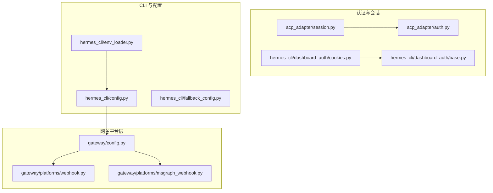
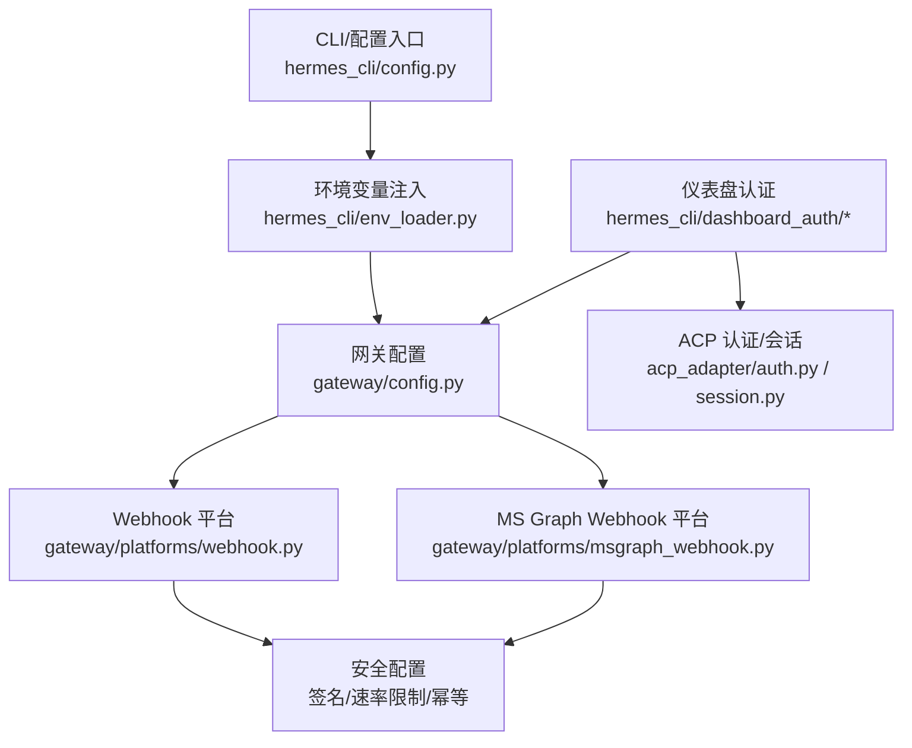
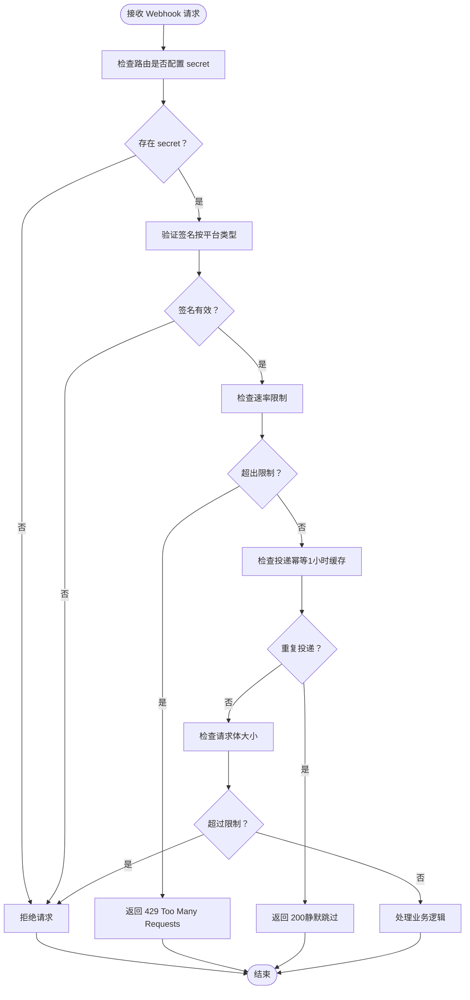
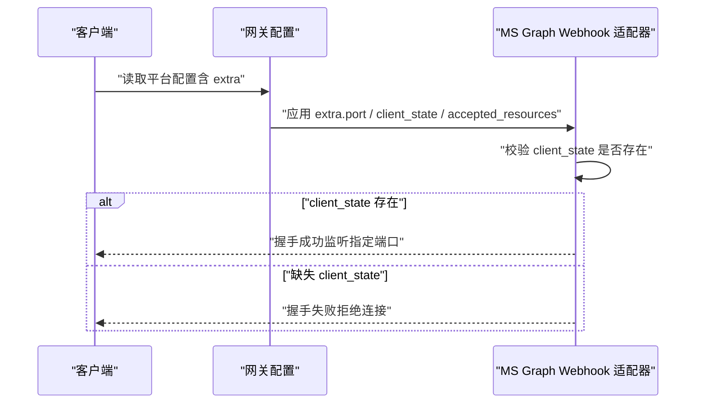
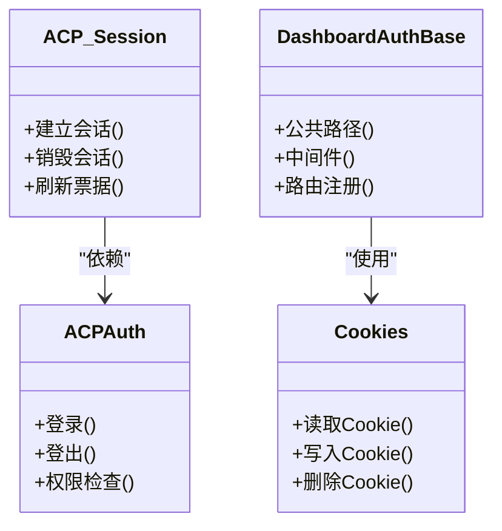
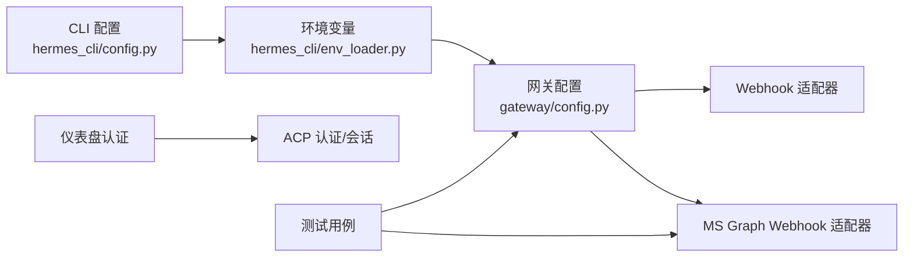

# 平台配置

<cite>
**本文引用的文件**
- [webhooks.md](file://website/i18n/zh-Hans/docusaurus-plugin-content-docs/current/user-guide/messaging/webhooks.md)
- [test_msgraph_webhook.py](file://tests/gateway/test_msgraph_webhook.py)
- [test_config.py](file://tests/gateway/test_config.py)
- [WebhooksPage.tsx](file://web/src/pages/WebhooksPage.tsx)
- [msgraph_webhook.py](file://gateway/platforms/msgraph_webhook.py)
- [webhook.py](file://gateway/platforms/webhook.py)
- [config.py](file://gateway/config.py)
- [google_oauth.py](file://agent/google_oauth.py)
- [azure_identity_adapter.py](file://agent/azure_identity_adapter.py)
- [auth.py](file://acp_adapter/auth.py)
- [session.py](file://acp_adapter/session.py)
- [entry.py](file://acp_adapter/entry.py)
- [permissions.py](file://acp_adapter/permissions.py)
- [events.py](file://acp_adapter/events.py)
- [tools.py](file://acp_adapter/tools.py)
- [dashboard_auth_base.py](file://hermes_cli/dashboard_auth/base.py)
- [cookies.py](file://hermes_cli/dashboard_auth/cookies.py)
- [login_page.py](file://hermes_cli/dashboard_auth/login_page.py)
- [routes.py](file://hermes_cli/dashboard_auth/routes.py)
- [prefix.py](file://hermes_cli/dashboard_auth/prefix.py)
- [public_paths.py](file://hermes_cli/dashboard_auth/public_paths.py)
- [registry.py](file://hermes_cli/dashboard_auth/registry.py)
- [ws_tickets.py](file://hermes_cli/dashboard_auth/ws_tickets.py)
- [env_loader.py](file://hermes_cli/env_loader.py)
- [fallback_config.py](file://hermes_cli/fallback_config.py)
- [cli.py](file://hermes_cli/cli.py)
- [config.py](file://hermes_cli/config.py)
- [config.py](file://hermes_cli/web_server.py)
- [config.py](file://hermes_cli/proxy/server.py)
- [config.py](file://hermes_cli/proxy/adapters/__init__.py)
- [config.py](file://hermes_cli/proxy/adapters/chat_completions.py)
- [config.py](file://hermes_cli/proxy/adapters/codex.py)
- [config.py](file://hermes_cli/proxy/adapters/anthropic.py)
- [config.py](file://hermes_cli/proxy/adapters/bedrock.py)
- [config.py](file://hermes_cli/proxy/adapters/types.py)
- [config.py](file://hermes_cli/commands.py)
- [config.py](file://hermes_cli/tools_config.py)
- [config.py](file://hermes_cli/skills_config.py)
- [config.py](file://hermes_cli/providers.py)
- [config.py](file://hermes_cli/models.py)
- [config.py](file://hermes_cli/profiles.py)
- [config.py](file://hermes_cli/plugins.py)
- [config.py](file://hermes_cli/backup.py)
- [config.py](file://hermes_cli/security_audit.py)
- [config.py](file://hermes_cli/security_advisories.py)
- [config.py](file://hermes_cli/timeouts.py)
- [config.py](file://hermes_cli/cron.py)
- [config.py](file://hermes_cli/memory_setup.py)
- [config.py](file://hermes_cli/service_manager.py)
- [config.py](file://hermes_cli/runtime_provider.py)
- [config.py](file://hermes_cli/container_boot.py)
- [config.py](file://hermes_cli/setup.py)
- [config.py](file://hermes_cli/status.py)
- [config.py](file://hermes_cli/logs.py)
- [config.py](file://hermes_cli/browser_connect.py)
- [config.py](file://hermes_cli/pairing.py)
- [config.py](file://hermes_cli/doctor.py)
- [config.py](file://hermes_cli/relaunch.py)
- [config.py](file://hermes_cli/uninstall.py)
- [config.py](file://hermes_cli/managed_uv.py)
- [config.py](file://hermes_cli/build_info.py)
- [config.py](file://hermes_cli/colors.py)
- [config.py](file://hermes_cli/tips.py)
- [config.py](file://hermes_cli/clipboard.py)
- [config.py](file://hermes_cli/stdio.py)
- [config.py](file://hermes_cli/curses_ui.py)
- [config.py](file://hermes_cli/web_server.py)
- [config.py](file://hermes_cli/proxy/server.py)
- [config.py](file://hermes_cli/proxy/adapters/__init__.py)
- [config.py](file://hermes_cli/proxy/adapters/chat_completions.py)
- [config.py](file://hermes_cli/proxy/adapters/codex.py)
- [config.py](file://hermes_cli/proxy/adapters/anthropic.py)
- [config.py](file://hermes_cli/proxy/adapters/bedrock.py)
- [config.py](file://hermes_cli/proxy/adapters/types.py)
- [config.py](file://hermes_cli/commands.py)
- [config.py](file://hermes_cli/tools_config.py)
- [config.py](file://hermes_cli/skills_config.py)
- [config.py](file://hermes_cli/providers.py)
- [config.py](file://hermes_cli/models.py)
- [config.py](file://hermes_cli/profiles.py)
- [config.py](file://hermes_cli/plugins.py)
- [config.py](file://hermes_cli/backup.py)
- [config.py](file://hermes_cli/security_audit.py)
- [config.py](file://hermes_cli/security_advisories.py)
- [config.py](file://hermes_cli/timeouts.py)
- [config.py](file://hermes_cli/cron.py)
- [config.py](file://hermes_cli/memory_setup.py)
- [config.py](file://hermes_cli/service_manager.py)
- [config.py](file://hermes_cli/runtime_provider.py)
- [config.py](file://hermes_cli/container_boot.py)
- [config.py](file://hermes_cli/setup.py)
- [config.py](file://hermes_cli/status.py)
- [config.py](file://hermes_cli/logs.py)
- [config.py](file://hermes_cli/browser_connect.py)
- [config.py](file://hermes_cli/pairing.py)
- [config.py](file://hermes_cli/doctor.py)
- [config.py](file://hermes_cli/relaunch.py)
- [config.py](file://hermes_cli/uninstall.py)
- [config.py](file://hermes_cli/managed_uv.py)
- [config.py](file://hermes_cli/build_info.py)
- [config.py](file://hermes_cli/colors.py)
- [config.py](file://hermes_cli/tips.py)
- [config.py](file://hermes_cli/clipboard.py)
- [config.py](file://hermes_cli/stdio.py)
- [config.py](file://hermes_cli/curses_ui.py)
</cite>

## 目录
1. [简介](#简介)
2. [项目结构](#项目结构)
3. [核心组件](#核心组件)
4. [架构总览](#架构总览)
5. [详细组件分析](#详细组件分析)
6. [依赖关系分析](#依赖关系分析)
7. [性能考量](#性能考量)
8. [故障排除指南](#故障排除指南)
9. [结论](#结论)
10. [附录](#附录)

## 简介
本指南面向系统管理员与开发者，提供平台配置的完整参考，覆盖认证设置、Webhook 配置、轮询模式设置、API 密钥管理、OAuth 流程与安全配置，并结合配置文件格式、环境变量与动态配置机制，给出配置验证、测试连接与故障排除方法。文档同时提供多平台配置管理策略、配置模板与最佳实践建议。

## 项目结构
本仓库围绕“网关（Gateway）+ 平台适配器（Platform Adapters）+ CLI/仪表盘认证与配置”组织配置相关能力：
- 网关平台层：集中实现各类平台接入（如 Webhook、Microsoft Graph Webhook、Telegram、Slack 等），负责路由、认证、轮询与事件投递。
- 认证与会话：ACP 适配器与仪表盘认证模块提供登录态、Cookie、WebSocket 票据与权限控制。
- CLI 与配置：CLI 提供配置加载、环境变量注入、备份/恢复、服务管理等功能；仪表盘页面提供 Webhook 订阅创建与启用状态提示。

图表来源
- [config.py](file://gateway/config.py)
- [webhook.py](file://gateway/platforms/webhook.py)
- [msgraph_webhook.py](file://gateway/platforms/msgraph_webhook.py)
- [auth.py](file://acp_adapter/auth.py)
- [session.py](file://acp_adapter/session.py)
- [dashboard_auth_base.py](file://hermes_cli/dashboard_auth/base.py)
- [cookies.py](file://hermes_cli/dashboard_auth/cookies.py)
- [env_loader.py](file://hermes_cli/env_loader.py)
- [fallback_config.py](file://hermes_cli/fallback_config.py)

章节来源
- [config.py](file://gateway/config.py)
- [webhook.py](file://gateway/platforms/webhook.py)
- [msgraph_webhook.py](file://gateway/platforms/msgraph_webhook.py)
- [auth.py](file://acp_adapter/auth.py)
- [session.py](file://acp_adapter/session.py)
- [dashboard_auth_base.py](file://hermes_cli/dashboard_auth/base.py)
- [cookies.py](file://hermes_cli/dashboard_auth/cookies.py)
- [env_loader.py](file://hermes_cli/env_loader.py)
- [fallback_config.py](file://hermes_cli/fallback_config.py)

## 核心组件
- 网关配置与平台注册：集中定义平台启用/禁用、额外参数（extra）、环境变量覆盖与连接状态判定。
- Webhook 平台：支持签名验证、速率限制、幂等性、请求体大小限制与路由级 secret 管理。
- Microsoft Graph Webhook：支持端口、客户端状态、资源白名单等参数，具备环境变量覆盖与握手校验。
- 认证与会话：Cookie 登录态、WebSocket 票据、权限与事件处理。
- CLI 与仪表盘：配置加载、环境变量注入、备份/恢复、服务管理与 Webhook 页面启用提示。

章节来源
- [config.py](file://gateway/config.py)
- [webhooks.md](file://website/i18n/zh-Hans/docusaurus-plugin-content-docs/current/user-guide/messaging/webhooks.md)
- [test_msgraph_webhook.py](file://tests/gateway/test_msgraph_webhook.py)
- [test_config.py](file://tests/gateway/test_config.py)
- [WebhooksPage.tsx](file://web/src/pages/WebhooksPage.tsx)
- [auth.py](file://acp_adapter/auth.py)
- [session.py](file://acp_adapter/session.py)
- [dashboard_auth_base.py](file://hermes_cli/dashboard_auth/base.py)
- [cookies.py](file://hermes_cli/dashboard_auth/cookies.py)
- [env_loader.py](file://hermes_cli/env_loader.py)
- [fallback_config.py](file://hermes_cli/fallback_config.py)

## 架构总览
下图展示平台配置在系统中的位置与交互关系：CLI/仪表盘负责配置加载与下发，网关平台层负责具体平台接入与认证，认证模块负责登录态与权限控制。

图表来源
- [config.py](file://gateway/config.py)
- [webhook.py](file://gateway/platforms/webhook.py)
- [msgraph_webhook.py](file://gateway/platforms/msgraph_webhook.py)
- [auth.py](file://acp_adapter/auth.py)
- [session.py](file://acp_adapter/session.py)
- [dashboard_auth_base.py](file://hermes_cli/dashboard_auth/base.py)
- [cookies.py](file://hermes_cli/dashboard_auth/cookies.py)
- [env_loader.py](file://hermes_cli/env_loader.py)

## 详细组件分析

### Webhook 平台配置与安全
- 路由与签名验证
  - GitHub：通过请求头进行 HMAC-SHA256 验签（sha256=前缀）。
  - GitLab：通过 X-Gitlab-Token 明文匹配。
  - 通用：通过 X-Webhook-Signature 进行原始 HMAC-SHA256 验签。
  - 若配置了 secret 但请求缺少识别的签名头，请求将被拒绝。
- Secret 策略
  - 每个路由必须配置 secret；可继承自全局 secret。
  - 开发/测试场景可使用特定不安全值跳过验证，但仅当网关绑定到回环地址时允许，否则启动失败以避免公共接口暴露。
- 速率限制
  - 默认每分钟 30 次（固定窗口）；可通过 extra.rate_limit 全局调整。
- 幂等性
  - 投递 ID 缓存 1 小时（GitHub 使用 X-GitHub-Delivery，通用使用 X-Request-ID 或时间戳回退），重复投递静默跳过并返回 200。
- 请求体大小限制
  - 默认 1MB；可通过 extra.max_body_bytes 调整。

图表来源
- [webhooks.md](file://website/i18n/zh-Hans/docusaurus-plugin-content-docs/current/user-guide/messaging/webhooks.md)

章节来源
- [webhooks.md](file://website/i18n/zh-Hans/docusaurus-plugin-content-docs/current/user-guide/messaging/webhooks.md)

### Microsoft Graph Webhook 平台配置
- 关键参数
  - 端口：extra.port
  - 客户端状态：extra.client_state（握手必需）
  - 接受的资源：extra.accepted_resources（数组）
- 环境变量覆盖
  - 支持通过环境变量对现有配置进行覆盖（如端口、客户端状态、资源列表）。
- 握手校验
  - 必须提供 client_state 参数，否则连接失败。

图表来源
- [test_msgraph_webhook.py](file://tests/gateway/test_msgraph_webhook.py)
- [msgraph_webhook.py](file://gateway/platforms/msgraph_webhook.py)

章节来源
- [test_msgraph_webhook.py](file://tests/gateway/test_msgraph_webhook.py)
- [msgraph_webhook.py](file://gateway/platforms/msgraph_webhook.py)

### 认证与会话（ACP 与仪表盘）
- ACP 认证与会话
  - 提供登录态、权限与事件处理能力，支持工具调用与编辑审批等场景。
- 仪表盘认证
  - Cookie 登录态、WebSocket 票据、公共路径与路由注册，确保访问控制与安全票据管理。

图表来源
- [auth.py](file://acp_adapter/auth.py)
- [session.py](file://acp_adapter/session.py)
- [dashboard_auth_base.py](file://hermes_cli/dashboard_auth/base.py)
- [cookies.py](file://hermes_cli/dashboard_auth/cookies.py)

章节来源
- [auth.py](file://acp_adapter/auth.py)
- [session.py](file://acp_adapter/session.py)
- [dashboard_auth_base.py](file://hermes_cli/dashboard_auth/base.py)
- [cookies.py](file://hermes_cli/dashboard_auth/cookies.py)

### OAuth 流程与安全配置
- Google OAuth
  - 位于 agent 层，提供 Google 相关认证流程与令牌管理。
- Azure Identity Adapter
  - 提供 Azure 身份认证适配，支持企业级身份与令牌流转。
- 安全建议
  - 使用强 secret 与 HTTPS；严格控制回调域名与范围；最小权限原则授予令牌；定期轮换密钥与证书。

章节来源
- [google_oauth.py](file://agent/google_oauth.py)
- [azure_identity_adapter.py](file://agent/azure_identity_adapter.py)

### 配置文件格式、环境变量与动态配置
- 配置文件
  - 网关平台配置采用 YAML 结构，包含 platforms 节点与各平台的 enabled 与 extra 参数。
- 环境变量
  - CLI/网关支持通过环境变量覆盖平台参数（如端口、客户端状态、资源列表等）。
- 动态配置
  - CLI 提供配置加载、备份/恢复、服务管理与运行时注入，支持在运行时调整行为。

章节来源
- [config.py](file://gateway/config.py)
- [test_msgraph_webhook.py](file://tests/gateway/test_msgraph_webhook.py)
- [env_loader.py](file://hermes_cli/env_loader.py)
- [fallback_config.py](file://hermes_cli/fallback_config.py)

### Webhook 订阅与仪表盘集成
- 仪表盘页面
  - 当 Webhook 平台未启用时，页面提示需先在消息设置中启用，再返回创建订阅。
- 订阅创建
  - 支持为不同平台创建订阅，页面提供可选的触发提示文本。

章节来源
- [WebhooksPage.tsx](file://web/src/pages/WebhooksPage.tsx)

## 依赖关系分析
- 网关配置依赖平台适配器实现具体接入逻辑。
- CLI 通过环境变量注入与配置加载影响网关行为。
- 认证模块与仪表盘路由共同保障访问安全。
- 测试用例覆盖 MS Graph Webhook 的环境变量覆盖与握手校验，验证配置正确性。

图表来源
- [config.py](file://gateway/config.py)
- [webhook.py](file://gateway/platforms/webhook.py)
- [msgraph_webhook.py](file://gateway/platforms/msgraph_webhook.py)
- [auth.py](file://acp_adapter/auth.py)
- [session.py](file://acp_adapter/session.py)
- [dashboard_auth_base.py](file://hermes_cli/dashboard_auth/base.py)
- [cookies.py](file://hermes_cli/dashboard_auth/cookies.py)
- [env_loader.py](file://hermes_cli/env_loader.py)
- [test_msgraph_webhook.py](file://tests/gateway/test_msgraph_webhook.py)

章节来源
- [config.py](file://gateway/config.py)
- [webhook.py](file://gateway/platforms/webhook.py)
- [msgraph_webhook.py](file://gateway/platforms/msgraph_webhook.py)
- [auth.py](file://acp_adapter/auth.py)
- [session.py](file://acp_adapter/session.py)
- [dashboard_auth_base.py](file://hermes_cli/dashboard_auth/base.py)
- [cookies.py](file://hermes_cli/dashboard_auth/cookies.py)
- [env_loader.py](file://hermes_cli/env_loader.py)
- [test_msgraph_webhook.py](file://tests/gateway/test_msgraph_webhook.py)

## 性能考量
- 速率限制：默认每分钟 30 次，可根据平台负载与上游限流策略调整。
- 请求体大小限制：默认 1MB，避免过大 payload 影响内存与网络。
- 幂等性：1 小时投递 ID 缓存减少重复处理开销。
- 端口与并发：合理规划端口与并发连接数，避免资源争用。

## 故障排除指南
- Webhook 无法接收
  - 检查路由是否配置 secret；确认签名头与签名算法匹配。
  - 确认请求体大小未超过限制；检查速率限制阈值。
- MS Graph Webhook 握手失败
  - 确认已提供 client_state；检查端口与 accepted_resources 配置。
  - 使用环境变量覆盖验证配置是否生效。
- 仪表盘无法创建订阅
  - 确认 Webhook 平台已在消息设置中启用。
- 不安全配置
  - 避免在非回环地址绑定时使用不安全的 secret；仅在本地开发测试场景谨慎使用。

章节来源
- [webhooks.md](file://website/i18n/zh-Hans/docusaurus-plugin-content-docs/current/user-guide/messaging/webhooks.md)
- [test_msgraph_webhook.py](file://tests/gateway/test_msgraph_webhook.py)
- [WebhooksPage.tsx](file://web/src/pages/WebhooksPage.tsx)

## 结论
本指南提供了平台配置的系统化参考，涵盖 Webhook 安全、OAuth 流程与多平台配置管理。通过明确的配置文件格式、环境变量覆盖与动态配置机制，结合验证、测试与故障排除方法，帮助管理员与开发者高效、安全地部署与维护平台。

## 附录
- 配置模板与最佳实践
  - 为每个平台保留独立的 extra 参数块，便于环境变量覆盖与审计。
  - 对外暴露的端点必须配置强 secret，并启用 HTTPS。
  - 定期轮换密钥与令牌，最小权限授权，严格控制回调范围。
  - 使用测试用例验证配置覆盖与握手流程，确保生产环境稳定。