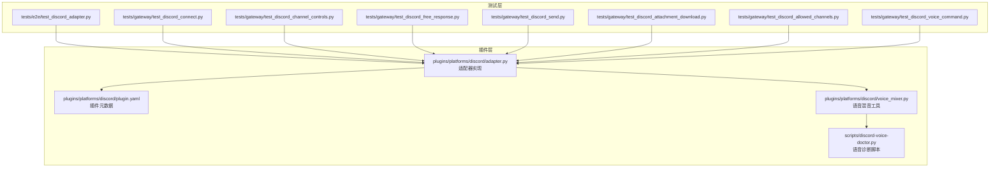
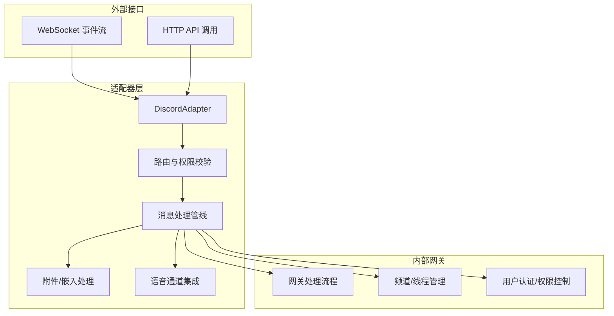
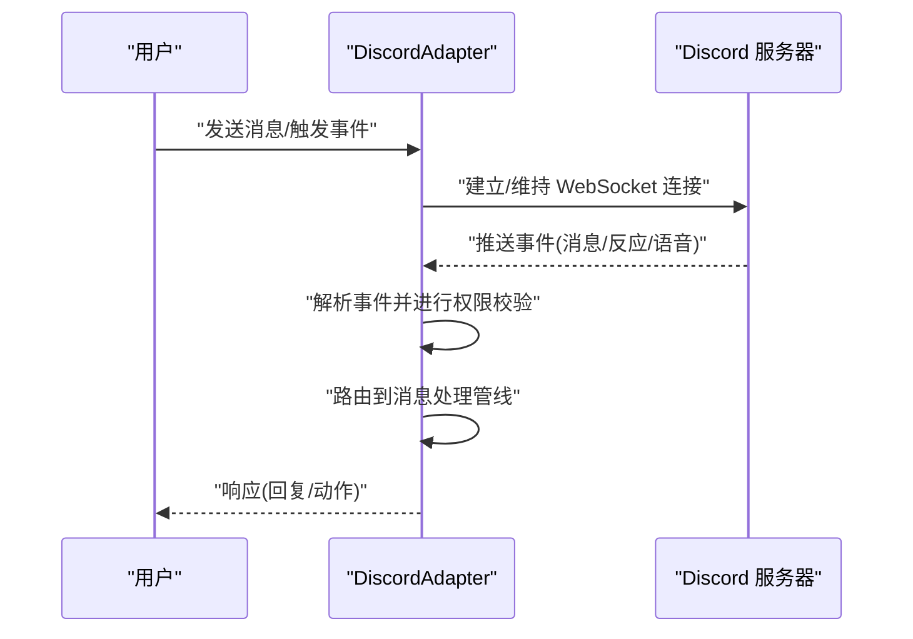
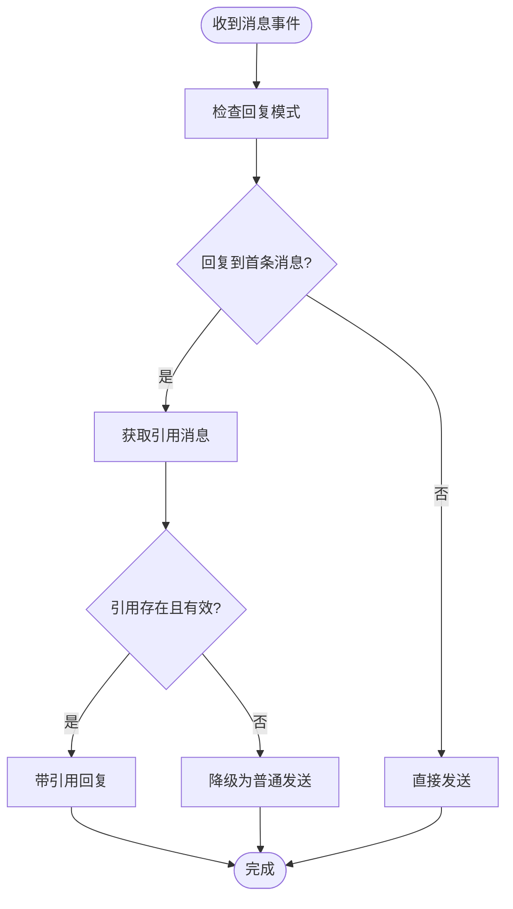
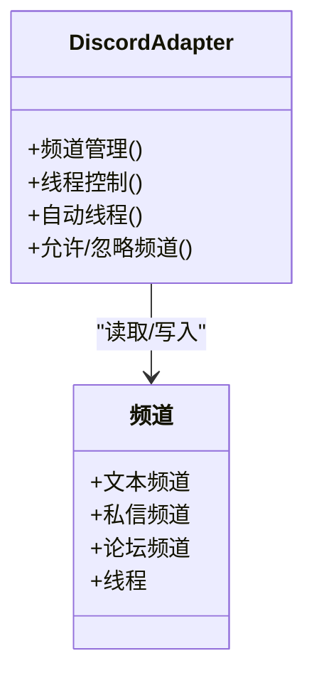
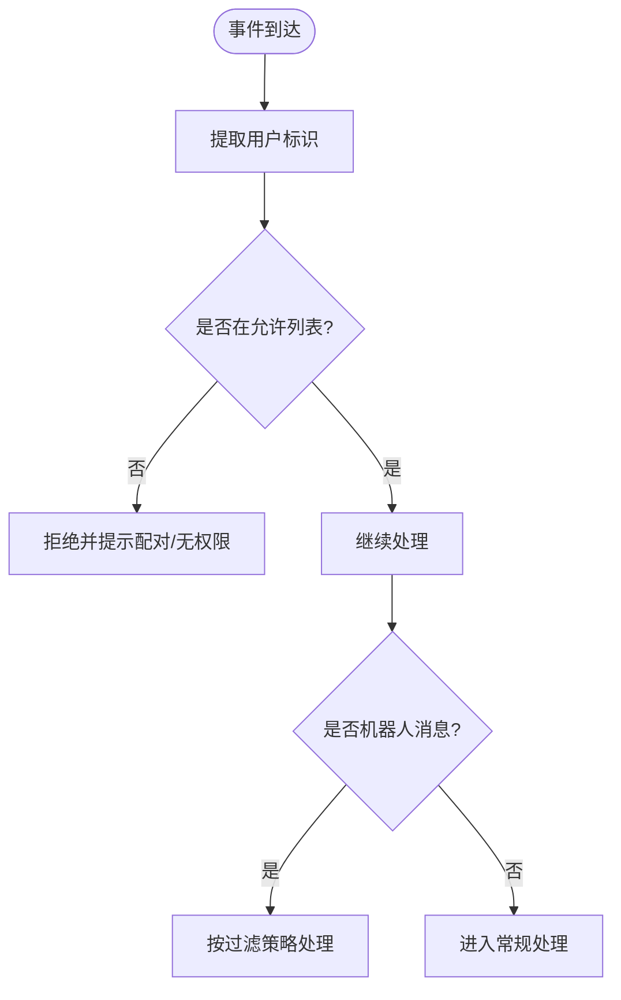
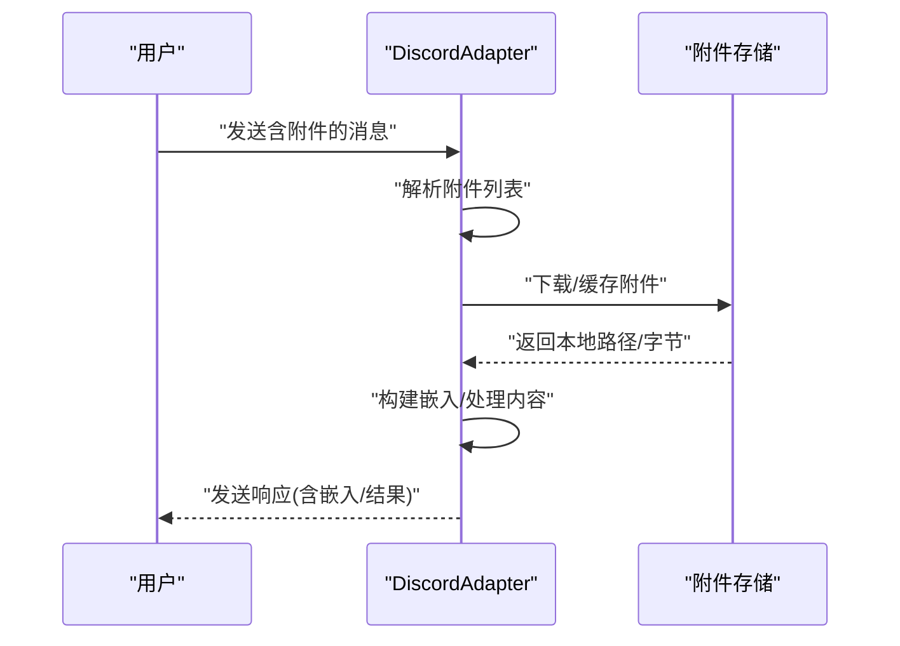
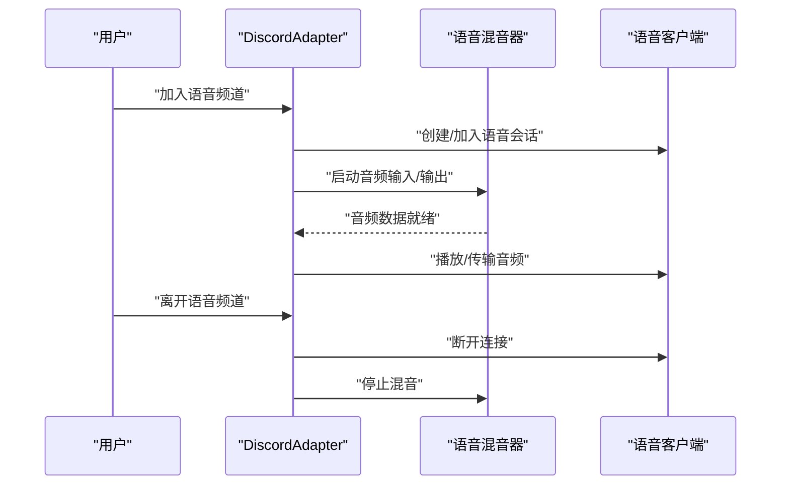
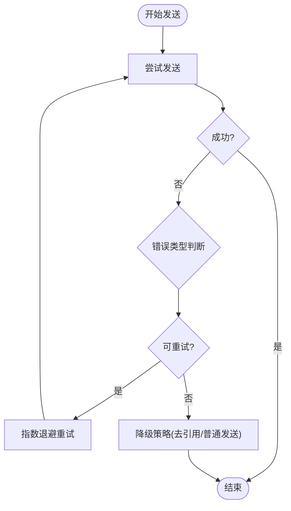
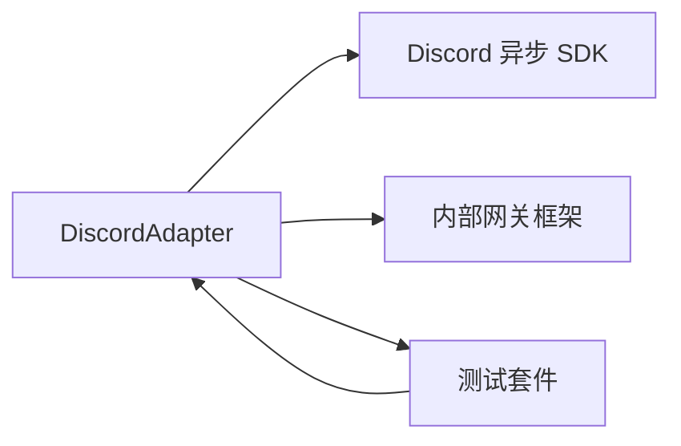

# Discord 平台

<cite>
**本文引用的文件**
- [adapter.py](file://plugins/platforms/discord/adapter.py)
- [plugin.yaml](file://plugins/platforms/discord/plugin.yaml)
- [voice_mixer.py](file://plugins/platforms/discord/voice_mixer.py)
- [discord-voice-doctor.py](file://scripts/discord-voice-doctor.py)
- [test_discord_adapter.py](file://tests/e2e/test_discord_adapter.py)
- [test_discord_connect.py](file://tests/gateway/test_discord_connect.py)
- [test_discord_channel_controls.py](file://tests/gateway/test_discord_channel_controls.py)
- [test_discord_channel_prompts.py](file://tests/gateway/test_discord_channel_prompts.py)
- [test_discord_channel_skills.py](file://tests/gateway/test_discord_channel_skills.py)
- [test_discord_clarify_buttons.py](file://tests/gateway/test_discord_clarify_buttons.py)
- [test_discord_component_auth.py](file://tests/gateway/test_discord_component_auth.py)
- [test_discord_document_handling.py](file://tests/gateway/test_discord_document_handling.py)
- [test_discord_free_response.py](file://tests/gateway/test_discord_free_response.py)
- [test_discord_imports.py](file://tests/gateway/test_discord_imports.py)
- [test_discord_reply_mode.py](file://tests/gateway/test_discord_reply_mode.py)
- [test_discord_reactions.py](file://tests/gateway/test_discord_reactions.py)
- [test_discord_send.py](file://tests/gateway/test_discord_send.py)
- [test_discord_attachment_download.py](file://tests/gateway/test_discord_attachment_download.py)
- [test_discord_allowed_channels.py](file://tests/gateway/test_discord_allowed_channels.py)
- [test_discord_allowed_mentions.py](file://tests/gateway/test_discord_allowed_mentions.py)
- [test_discord_bot_auth_bypass.py](file://tests/gateway/test_discord_bot_auth_bypass.py)
- [test_discord_bot_filter.py](file://tests/gateway/test_discord_bot_filter.py)
- [test_discord_voice_command.py](file://tests/gateway/test_voice_command.py)
- [test_internal_event_bypass_pairing.py](file://tests/gateway/test_internal_event_bypass_pairing.py)
</cite>

## 目录
1. [简介](#简介)
2. [项目结构](#项目结构)
3. [核心组件](#核心组件)
4. [架构总览](#架构总览)
5. [详细组件分析](#详细组件分析)
6. [依赖关系分析](#依赖关系分析)
7. [性能考量](#性能考量)
8. [故障排查指南](#故障排查指南)
9. [结论](#结论)
10. [附录：配置与集成指南](#附录配置与集成指南)

## 简介
本文件面向在 Discord 平台上集成与运行的开发者与运维人员，系统性阐述该平台适配器的设计与实现，覆盖以下主题：
- 连接管理与事件处理机制
- 消息路由与回复策略
- 频道管理、权限控制与用户认证
- Discord 特有功能：嵌入消息、附件处理、语音通道集成、活动状态显示
- 配置指南（应用创建、Bot 令牌、权限）
- 速率限制、错误重试与连接稳定性保障
- 实际集成示例与最佳实践

## 项目结构
Discord 平台适配器位于插件目录下，核心文件包括适配器实现、插件元数据以及语音混音工具；测试用例覆盖连接、频道控制、自由回复、反应、发送、附件下载、允许通道/提及、机器人过滤与语音命令等场景。

**图表来源**
- [adapter.py](file://plugins/platforms/discord/adapter.py)
- [plugin.yaml](file://plugins/platforms/discord/plugin.yaml)
- [voice_mixer.py](file://plugins/platforms/discord/voice_mixer.py)
- [discord-voice-doctor.py](file://scripts/discord-voice-doctor.py)
- [test_discord_adapter.py](file://tests/e2e/test_discord_adapter.py)
- [test_discord_connect.py](file://tests/gateway/test_discord_connect.py)
- [test_discord_channel_controls.py](file://tests/gateway/test_discord_channel_controls.py)
- [test_discord_free_response.py](file://tests/gateway/test_discord_free_response.py)
- [test_discord_send.py](file://tests/gateway/test_discord_send.py)
- [test_discord_attachment_download.py](file://tests/gateway/test_discord_attachment_download.py)
- [test_discord_allowed_channels.py](file://tests/gateway/test_discord_allowed_channels.py)
- [test_discord_voice_command.py](file://tests/gateway/test_voice_command.py)

**章节来源**
- [adapter.py](file://plugins/platforms/discord/adapter.py)
- [plugin.yaml](file://plugins/platforms/discord/plugin.yaml)
- [voice_mixer.py](file://plugins/platforms/discord/voice_mixer.py)
- [discord-voice-doctor.py](file://scripts/discord-voice-doctor.py)
- [test_discord_adapter.py](file://tests/e2e/test_discord_adapter.py)
- [test_discord_connect.py](file://tests/gateway/test_discord_connect.py)
- [test_discord_channel_controls.py](file://tests/gateway/test_discord_channel_controls.py)
- [test_discord_free_response.py](file://tests/gateway/test_discord_free_response.py)
- [test_discord_send.py](file://tests/gateway/test_discord_send.py)
- [test_discord_attachment_download.py](file://tests/gateway/test_discord_attachment_download.py)
- [test_discord_allowed_channels.py](file://tests/gateway/test_discord_allowed_channels.py)
- [test_discord_voice_command.py](file://tests/gateway/test_voice_command.py)

## 核心组件
- DiscordAdapter：平台适配器主体，负责连接建立、事件分发、消息发送与回复、频道/线程管理、权限校验、嵌入与附件处理、语音通道集成等。
- 插件元数据：定义插件名称、入口、能力声明等，供系统注册与加载。
- 语音混音器：封装音频输入输出、混音与播放，支撑语音通道交互。
- 语音诊断脚本：辅助定位语音链路问题，提升稳定性。

**章节来源**
- [adapter.py](file://plugins/platforms/discord/adapter.py)
- [plugin.yaml](file://plugins/platforms/discord/plugin.yaml)
- [voice_mixer.py](file://plugins/platforms/discord/voice_mixer.py)
- [discord-voice-doctor.py](file://scripts/discord-voice-doctor.py)

## 架构总览
适配器采用“事件驱动 + 异步 I/O”的模式，通过 Discord 官方异步 SDK 接收消息事件，经由内部路由与权限校验后，投递到网关处理流程；同时支持嵌入消息、附件上传、语音通道加入/离开/播放等能力。

**图表来源**
- [adapter.py](file://plugins/platforms/discord/adapter.py)

## 详细组件分析

### 连接管理与事件处理
- 连接生命周期：初始化客户端、登录、建立事件监听、断线重连与资源清理。
- 事件类型：消息接收、消息更新/删除、反应添加/移除、语音状态变化、应用命令等。
- 重连策略：在测试中验证了重复连接时关闭旧处理器以避免“僵尸连接”导致的事件重复分发。

**图表来源**
- [adapter.py](file://plugins/platforms/discord/adapter.py)
- [test_discord_connect.py](file://tests/gateway/test_discord_connect.py)

**章节来源**
- [adapter.py](file://plugins/platforms/discord/adapter.py)
- [test_discord_connect.py](file://tests/gateway/test_discord_connect.py)

### 消息路由与回复策略
- 回复模式：支持按首次消息或引用目标回复；当引用目标不存在或已删除时，自动降级为普通发送。
- 自由回复通道：可配置允许自由回复的频道列表，结合提及要求与线程策略共同决定是否生成新线程。
- 历史回填：可配置历史消息回填数量，用于上下文补充。

**图表来源**
- [adapter.py](file://plugins/platforms/discord/adapter.py)
- [test_discord_reply_mode.py](file://tests/gateway/test_discord_reply_mode.py)
- [test_discord_send.py](file://tests/gateway/test_discord_send.py)

**章节来源**
- [adapter.py](file://plugins/platforms/discord/adapter.py)
- [test_discord_reply_mode.py](file://tests/gateway/test_discord_reply_mode.py)
- [test_discord_send.py](file://tests/gateway/test_discord_send.py)

### 频道管理与线程控制
- 文本频道、私信频道、论坛频道与线程均被纳入支持范围；适配器对不同频道类型进行差异化处理。
- 自动线程：在特定频道中根据策略自动生成线程以组织对话。
- 允许/忽略频道：通过环境变量白名单/黑名单控制事件来源与目标范围。

**图表来源**
- [adapter.py](file://plugins/platforms/discord/adapter.py)
- [test_discord_channel_controls.py](file://tests/gateway/test_discord_channel_controls.py)
- [test_discord_free_response.py](file://tests/gateway/test_discord_free_response.py)
- [test_discord_allowed_channels.py](file://tests/gateway/test_discord_allowed_channels.py)

**章节来源**
- [adapter.py](file://plugins/platforms/discord/adapter.py)
- [test_discord_channel_controls.py](file://tests/gateway/test_discord_channel_controls.py)
- [test_discord_free_response.py](file://tests/gateway/test_discord_free_response.py)
- [test_discord_allowed_channels.py](file://tests/gateway/test_discord_allowed_channels.py)

### 权限控制与用户认证
- 用户识别：基于事件源中的用户 ID 与用户名进行识别。
- 认证绕过与组件授权：测试覆盖了组件级鉴权与内部事件绕过配对流程。
- 机器人过滤：可配置是否允许机器人消息进入处理流程。
- 提及白名单：可配置仅响应提及机器人的消息，或在特定线程中启用。

**图表来源**
- [adapter.py](file://plugins/platforms/discord/adapter.py)
- [test_discord_component_auth.py](file://tests/gateway/test_discord_component_auth.py)
- [test_discord_bot_filter.py](file://tests/gateway/test_discord_bot_filter.py)
- [test_discord_allowed_mentions.py](file://tests/gateway/test_discord_allowed_mentions.py)
- [test_internal_event_bypass_pairing.py](file://tests/gateway/test_internal_event_bypass_pairing.py)

**章节来源**
- [adapter.py](file://plugins/platforms/discord/adapter.py)
- [test_discord_component_auth.py](file://tests/gateway/test_discord_component_auth.py)
- [test_discord_bot_filter.py](file://tests/gateway/test_discord_bot_filter.py)
- [test_discord_allowed_mentions.py](file://tests/gateway/test_discord_allowed_mentions.py)
- [test_internal_event_bypass_pairing.py](file://tests/gateway/test_internal_event_bypass_pairing.py)

### 嵌入消息与附件处理
- 嵌入消息：支持构建富文本嵌入，用于结构化信息展示。
- 附件下载与缓存：对图片/音频/PDF 等附件进行下载与缓存，便于后续处理与回传。
- 文档处理：针对文档类附件提供处理流程，确保合规与性能。

**图表来源**
- [adapter.py](file://plugins/platforms/discord/adapter.py)
- [test_discord_attachment_download.py](file://tests/gateway/test_discord_attachment_download.py)
- [test_discord_document_handling.py](file://tests/gateway/test_discord_document_handling.py)

**章节来源**
- [adapter.py](file://plugins/platforms/discord/adapter.py)
- [test_discord_attachment_download.py](file://tests/gateway/test_discord_attachment_download.py)
- [test_discord_document_handling.py](file://tests/gateway/test_discord_document_handling.py)

### 语音通道集成
- 加入/离开语音频道：根据用户指令或事件触发，管理语音客户端生命周期。
- 音频混音与播放：使用混音器处理音频输入输出，支持多人语音协作。
- 语音超时与监听任务：维护超时任务与监听任务，保证稳定与低延迟。
- 诊断工具：提供语音诊断脚本，帮助定位网络与设备问题。

**图表来源**
- [adapter.py](file://plugins/platforms/discord/adapter.py)
- [voice_mixer.py](file://plugins/platforms/discord/voice_mixer.py)
- [test_discord_voice_command.py](file://tests/gateway/test_voice_command.py)
- [discord-voice-doctor.py](file://scripts/discord-voice-doctor.py)

**章节来源**
- [adapter.py](file://plugins/platforms/discord/adapter.py)
- [voice_mixer.py](file://plugins/platforms/discord/voice_mixer.py)
- [test_discord_voice_command.py](file://tests/gateway/test_voice_command.py)
- [discord-voice-doctor.py](file://scripts/discord-voice-doctor.py)

### 速率限制、错误重试与连接稳定性
- 错误重试：在发送失败时进行重试，并在特定错误（如回复目标为系统消息）时自动降级策略。
- 连接稳定性：测试覆盖了重复连接时关闭旧处理器，防止“僵尸 socket”导致的事件重复分发。
- 速率限制：适配器遵循 Discord API 的速率限制规则，避免触发限流。

**图表来源**
- [adapter.py](file://plugins/platforms/discord/adapter.py)
- [test_discord_send.py](file://tests/gateway/test_discord_send.py)
- [test_discord_connect.py](file://tests/gateway/test_discord_connect.py)

**章节来源**
- [adapter.py](file://plugins/platforms/discord/adapter.py)
- [test_discord_send.py](file://tests/gateway/test_discord_send.py)
- [test_discord_connect.py](file://tests/gateway/test_discord_connect.py)

## 依赖关系分析
- 适配器依赖于 Discord 异步 SDK 与内部网关框架，通过统一的平台接口进行事件与消息的收发。
- 测试用例广泛覆盖连接、权限、回复、附件、语音等模块，形成完善的回归保障。

**图表来源**
- [adapter.py](file://plugins/platforms/discord/adapter.py)
- [test_discord_adapter.py](file://tests/e2e/test_discord_adapter.py)

**章节来源**
- [adapter.py](file://plugins/platforms/discord/adapter.py)
- [test_discord_adapter.py](file://tests/e2e/test_discord_adapter.py)

## 性能考量
- 批量发送与延迟：可通过参数调整文本批处理延迟，平衡吞吐与实时性。
- 附件处理：优先缓存与复用，减少重复下载；对大文件采用流式处理降低内存占用。
- 语音链路：合理设置音频采样率与缓冲区大小，避免高延迟与卡顿。
- 事件过滤：在允许/忽略频道与机器人过滤上做前置过滤，减少无效事件进入处理流程。

## 故障排查指南
- 无法连接/频繁掉线
  - 检查 Bot 令牌与权限范围
  - 使用语音诊断脚本排查网络与设备问题
  - 关注重连日志，确认旧处理器是否正确关闭
- 发送失败或回复异常
  - 观察错误码，若为“回复目标为系统消息”，自动降级为普通发送
  - 检查引用消息是否存在，必要时禁用引用回复
- 权限不足或被拒绝
  - 核对允许用户/频道列表
  - 检查机器人权限与服务器成员角色
- 附件处理失败
  - 确认附件未超过大小限制
  - 检查缓存目录权限与磁盘空间

**章节来源**
- [test_discord_send.py](file://tests/gateway/test_discord_send.py)
- [test_discord_connect.py](file://tests/gateway/test_discord_connect.py)
- [test_discord_component_auth.py](file://tests/gateway/test_discord_component_auth.py)
- [test_discord_attachment_download.py](file://tests/gateway/test_discord_attachment_download.py)
- [discord-voice-doctor.py](file://scripts/discord-voice-doctor.py)

## 结论
该 Discord 适配器以清晰的模块划分与完善的测试覆盖，实现了从连接、事件处理、消息路由到附件与语音的全链路能力。通过严格的权限控制与稳健的错误处理策略，能够在复杂多变的生产环境中保持高可用与高性能。

## 附录：配置与集成指南

### 应用创建与 Bot 令牌
- 在 Discord 开发者门户创建应用并启用 Bot 权限
- 将 Bot 添加至目标服务器，并授予相应权限
- 获取 Bot 令牌并在系统中安全存储

### 权限配置
- 必需权限：读取消息、发送消息、附加文件、嵌入链接、反应、语音操作
- 可选权限：管理消息、管理频道、管理线程、查看审计日志

### 环境变量与行为开关
- 允许/忽略频道：通过白名单/黑名单控制事件来源与目标
- 自由回复通道：允许在指定频道内自由回复
- 提及要求：仅响应提及机器人的消息
- 自动线程：在特定频道中自动生成线程
- 历史回填：配置回填消息数量以增强上下文
- 机器人过滤：控制是否允许机器人消息进入处理流程

### 集成示例与最佳实践
- 示例：在测试中展示了如何模拟 Discord 环境并调用适配器进行消息发送与回复
- 最佳实践：
  - 在生产中开启严格的允许/忽略频道策略
  - 对附件与语音流量进行监控与限速
  - 使用指数退避与降级策略应对瞬时错误
  - 定期运行语音诊断脚本，确保链路健康

**章节来源**
- [plugin.yaml](file://plugins/platforms/discord/plugin.yaml)
- [test_discord_adapter.py](file://tests/e2e/test_discord_adapter.py)
- [test_discord_free_response.py](file://tests/gateway/test_discord_free_response.py)
- [test_discord_allowed_channels.py](file://tests/gateway/test_discord_allowed_channels.py)
- [test_discord_allowed_mentions.py](file://tests/gateway/test_discord_allowed_mentions.py)
- [test_discord_bot_filter.py](file://tests/gateway/test_discord_bot_filter.py)
- [discord-voice-doctor.py](file://scripts/discord-voice-doctor.py)