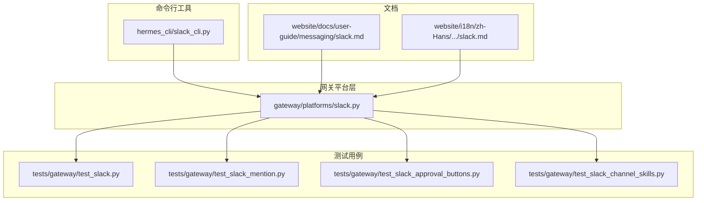
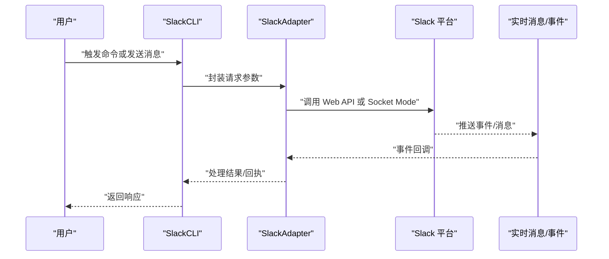
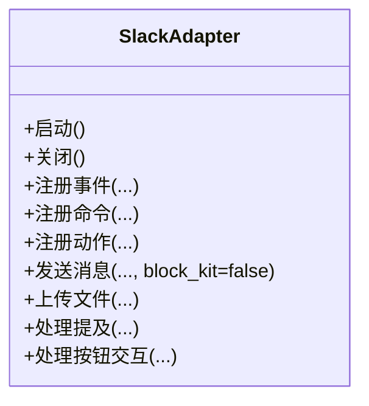
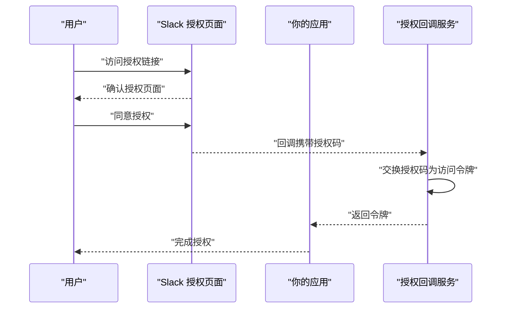
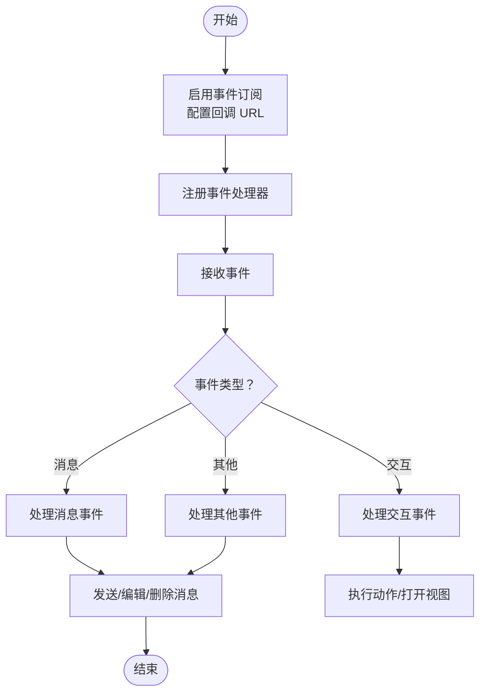
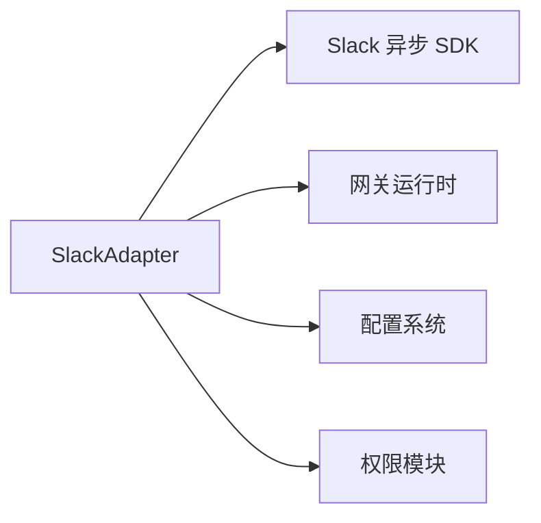

# Slack 平台

<cite>
**本文引用的文件**
- [slack.py](file://gateway/platforms/slack.py)
- [slack_cli.py](file://hermes_cli/slack_cli.py)
- [test_slack.py](file://tests/gateway/test_slack.py)
- [test_slack_mention.py](file://tests/gateway/test_slack_mention.py)
- [test_slack_approval_buttons.py](file://tests/gateway/test_slack_approval_buttons.py)
- [test_slack_channel_skills.py](file://tests/gateway/test_slack_channel_skills.py)
- [slack.md](file://website/docs/user-guide/messaging/slack.md)
- [slack.md（中文）](file://website/i18n/zh-Hans/docusaurus-plugin-content-docs/current/user-guide/messaging/slack.md)
</cite>

## 目录
1. [简介](#简介)
2. [项目结构](#项目结构)
3. [核心组件](#核心组件)
4. [架构总览](#架构总览)
5. [详细组件分析](#详细组件分析)
6. [依赖关系分析](#依赖关系分析)
7. [性能考量](#性能考量)
8. [故障排查指南](#故障排查指南)
9. [结论](#结论)
10. [附录](#附录)

## 简介
本文件系统性梳理并说明本仓库中与 Slack 平台相关的实现与用法，重点覆盖以下方面：
- OAuth 认证流程与授权配置
- 事件订阅机制与实时消息处理
- 工作区、频道、用户群组与权限体系的对接方式
- Slack 特有功能：Block Kit 界面、文件共享、音视频通话、集成能力
- 配置步骤：应用创建、OAuth 授权、事件订阅设置
- 使用限制、缓存策略与错误处理机制
- 实际部署示例与常见问题解决方案

为便于非技术读者理解，文档采用由浅入深的方式，并在涉及具体实现时提供“章节来源”以便溯源。

## 项目结构
Slack 相关代码主要分布在如下位置：
- 网关平台层：Slack 适配器实现
- 命令行工具：Slack CLI 辅助命令
- 测试用例：覆盖认证、事件、按钮交互、频道技能等场景
- 文档：用户指南中的 Slack 使用说明

**图表来源**
- [slack.py](file://gateway/platforms/slack.py)
- [slack_cli.py](file://hermes_cli/slack_cli.py)
- [test_slack.py](file://tests/gateway/test_slack.py)
- [test_slack_mention.py](file://tests/gateway/test_slack_mention.py)
- [test_slack_approval_buttons.py](file://tests/gateway/test_slack_approval_buttons.py)
- [test_slack_channel_skills.py](file://tests/gateway/test_slack_channel_skills.py)
- [slack.md](file://website/docs/user-guide/messaging/slack.md)
- [slack.md（中文）](file://website/i18n/zh-Hans/docusaurus-plugin-content-docs/current/user-guide/messaging/slack.md)

**章节来源**
- [slack.py](file://gateway/platforms/slack.py)
- [slack_cli.py](file://hermes_cli/slack_cli.py)
- [test_slack.py](file://tests/gateway/test_slack.py)
- [test_slack_mention.py](file://tests/gateway/test_slack_mention.py)
- [test_slack_approval_buttons.py](file://tests/gateway/test_slack_approval_buttons.py)
- [test_slack_channel_skills.py](file://tests/gateway/test_slack_channel_skills.py)
- [slack.md](file://website/docs/user-guide/messaging/slack.md)
- [slack.md（中文）](file://website/i18n/zh-Hans/docusaurus-plugin-content-docs/current/user-guide/messaging/slack.md)

## 核心组件
- SlackAdapter：Slack 平台适配器，负责连接、事件订阅、命令与动作处理、实时消息收发等。
- SlackCLI：命令行辅助工具，用于与 Slack 平台交互的便捷操作。
- 测试套件：覆盖认证、事件监听、按钮交互、提及解析、频道技能等关键路径。

关键职责与接口要点（以实现为准，不展示具体代码内容）：
- 连接与会话管理：初始化客户端、建立 Socket Mode 或 Web API 连接、心跳与重连。
- 事件订阅：注册事件处理器，分发到业务逻辑。
- 命令与动作：注册 Slash 命令、快捷方式、按钮点击等交互入口。
- 消息发送：支持文本、Block Kit、附件上传等。
- 权限与鉴权：基于 OAuth 的访问令牌与 Bot 用户令牌，结合工作区/频道范围控制。

**章节来源**
- [slack.py](file://gateway/platforms/slack.py)
- [slack_cli.py](file://hermes_cli/slack_cli.py)
- [test_slack.py](file://tests/gateway/test_slack.py)

## 架构总览
下图展示了从用户输入到 Slack 平台的消息流转与事件处理路径：

**图表来源**
- [slack.py](file://gateway/platforms/slack.py)
- [slack_cli.py](file://hermes_cli/slack_cli.py)

## 详细组件分析

### SlackAdapter 组件分析
- 职责边界
  - 管理与 Slack 的连接生命周期（含 Socket Mode watchdog 与重连）
  - 注册事件、命令、动作处理器
  - 发送消息、Block Kit 渲染、文件上传
  - 解析提及、按钮交互、审批流等
- 关键数据结构与复杂度
  - 事件/命令/动作注册表：按类型维护映射，查询与更新为常数时间
  - 会话与上下文：线程安全与并发处理需注意
- 依赖链
  - 依赖 Slack 官方异步 SDK（AsyncApp、AsyncWebClient 等）
  - 依赖内部网关运行时与会话上下文
- 错误处理
  - 网络异常、超时、权限不足、速率限制等均需捕获与恢复
  - Socket Mode 断连后自动重建并恢复订阅
- 性能影响
  - 大量并发事件时，建议使用队列与限速策略
  - 文件上传与 Block Kit 渲染应避免阻塞主线程

**图表来源**
- [slack.py](file://gateway/platforms/slack.py)

**章节来源**
- [slack.py](file://gateway/platforms/slack.py)
- [test_slack.py](file://tests/gateway/test_slack.py)

### OAuth 认证流程
- 应用创建与权限
  - 在 Slack 开发者平台创建应用，启用 Bot 权限与必要的 Scope
  - 配置 OAuth 授权回调地址
- 授权与令牌
  - 使用 OAuth 授权码流程获取访问令牌
  - 将令牌持久化至配置存储，供适配器初始化使用
- 作用域与限制
  - 不同 API 需要不同 Scope；部分 API 受速率限制约束
  - Bot 用户令牌与 App Token 的使用场景不同，需正确区分

**图表来源**
- [slack.py](file://gateway/platforms/slack.py)

**章节来源**
- [slack.py](file://gateway/platforms/slack.py)

### 事件订阅机制与实时消息处理
- 事件订阅
  - 在开发者平台启用事件订阅，配置事件回调 URL
  - 适配器注册事件处理器，按事件类型分发
- Socket Mode
  - 通过 Socket Mode 接收事件，具备断线重连与 watchdog 保护
- 实时消息
  - 支持直接回复、编辑消息、删除消息、发送富文本与 Block Kit

**图表来源**
- [slack.py](file://gateway/platforms/slack.py)

**章节来源**
- [slack.py](file://gateway/platforms/slack.py)
- [test_slack.py](file://tests/gateway/test_slack.py)

### 工作区、频道、用户群组与权限体系
- 工作区与频道
  - 通过 API 获取工作区信息与频道列表，按频道维度隔离会话
- 用户群组
  - 支持按用户群组进行消息投递与权限控制
- 权限与范围
  - 依据 Bot 用户令牌的 Scope 控制可调用 API 与可见范围
  - 通过通道权限与角色限制，确保最小权限原则

**章节来源**
- [slack.py](file://gateway/platforms/slack.py)

### Slack 特有功能
- Block Kit 界面
  - 通过 Block Kit 构建动态界面，支持多种元素与交互控件
- 文件共享
  - 支持多格式文件上传与预览，可附加描述与权限控制
- 音视频通话
  - 通过集成能力或第三方插件实现音视频通话入口
- 集成功能
  - 与外部系统联动，如审批流、技能工具等

**章节来源**
- [slack.py](file://gateway/platforms/slack.py)

### 配置步骤
- 创建 Slack 应用
  - 在开发者平台创建应用，启用 Bot 与必要的功能模块
- OAuth 授权
  - 配置授权回调地址，完成授权码交换
- 事件订阅设置
  - 启用事件订阅，配置回调 URL 与事件清单
- 初始化适配器
  - 加载令牌与配置，启动连接与事件处理器

**章节来源**
- [slack.py](file://gateway/platforms/slack.py)
- [slack_cli.py](file://hermes_cli/slack_cli.py)

### 使用限制、缓存策略与错误处理
- 使用限制
  - 遵循 Slack API 速率限制，必要时引入退避与队列
- 缓存策略
  - 对常用元数据（如频道、用户、Block Kit 模板）进行本地缓存
- 错误处理
  - 捕获网络异常、权限错误、API 返回错误，进行分类处理与重试
  - Socket Mode 断连后自动重建并恢复订阅

**章节来源**
- [slack.py](file://gateway/platforms/slack.py)
- [test_slack.py](file://tests/gateway/test_slack.py)

### 实际部署示例与常见问题
- 部署示例
  - 在生产环境部署时，建议使用独立的回调域名与证书
  - 为事件订阅配置健康检查端点与日志监控
- 常见问题
  - 授权失败：检查回调地址与 Scope 配置
  - 事件未到达：确认事件订阅已启用且回调 URL 可达
  - Socket 断连：检查网络与 watchdog 设置

**章节来源**
- [slack.py](file://gateway/platforms/slack.py)
- [slack_cli.py](file://hermes_cli/slack_cli.py)

## 依赖关系分析
- 组件耦合
  - SlackAdapter 与网关运行时紧密耦合，负责事件与命令的桥接
  - 与内部会话上下文、权限模块存在协作关系
- 外部依赖
  - Slack 官方异步 SDK（AsyncApp、AsyncWebClient）
  - 网关平台注册表与配置系统

**图表来源**
- [slack.py](file://gateway/platforms/slack.py)

**章节来源**
- [slack.py](file://gateway/platforms/slack.py)

## 性能考量
- 事件处理吞吐
  - 使用异步事件循环与限速策略，避免阻塞
- 文件上传
  - 分块上传与进度反馈，减少大文件对主流程的影响
- 缓存与预热
  - 频道、用户、模板等元数据缓存，降低重复查询开销
- 监控与告警
  - 对事件延迟、错误率、速率限制触发进行监控

[本节为通用指导，无需“章节来源”]

## 故障排查指南
- 授权失败
  - 检查回调地址是否与平台配置一致
  - 确认 Scope 是否满足所需 API
- 事件未到达
  - 确认事件订阅已启用且回调 URL 可达
  - 查看平台日志与重试记录
- Socket 断连
  - 检查网络稳定性与 watchdog 配置
  - 观察断连频率与自动重连行为
- 按钮与交互无响应
  - 确认动作 ID 注册与回调函数绑定
  - 检查权限与工作区范围

**章节来源**
- [test_slack.py](file://tests/gateway/test_slack.py)
- [test_slack_mention.py](file://tests/gateway/test_slack_mention.py)
- [test_slack_approval_buttons.py](file://tests/gateway/test_slack_approval_buttons.py)
- [test_slack_channel_skills.py](file://tests/gateway/test_slack_channel_skills.py)

## 结论
本仓库提供了完整的 Slack 平台适配器实现，覆盖 OAuth 授权、事件订阅、实时消息、Block Kit、文件共享、音视频通话与集成能力。通过严格的测试用例与清晰的配置流程，能够支撑生产级部署。建议在实际使用中关注速率限制、缓存策略与错误处理，并结合监控体系保障稳定性。

[本节为总结性内容，无需“章节来源”]

## 附录
- 相关文档
  - 用户指南中的 Slack 使用说明（英文与中文）

**章节来源**
- [slack.md](file://website/docs/user-guide/messaging/slack.md)
- [slack.md（中文）](file://website/i18n/zh-Hans/docusaurus-plugin-content-docs/current/user-guide/messaging/slack.md)