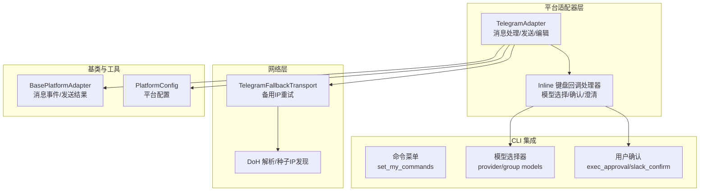
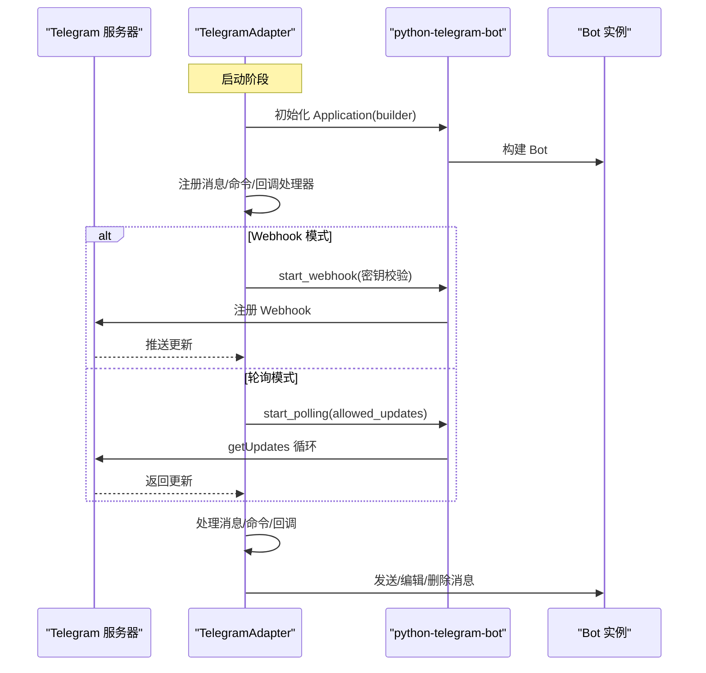
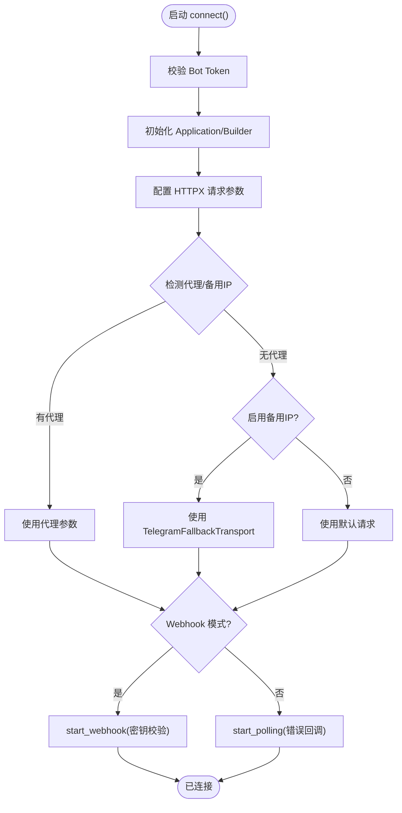
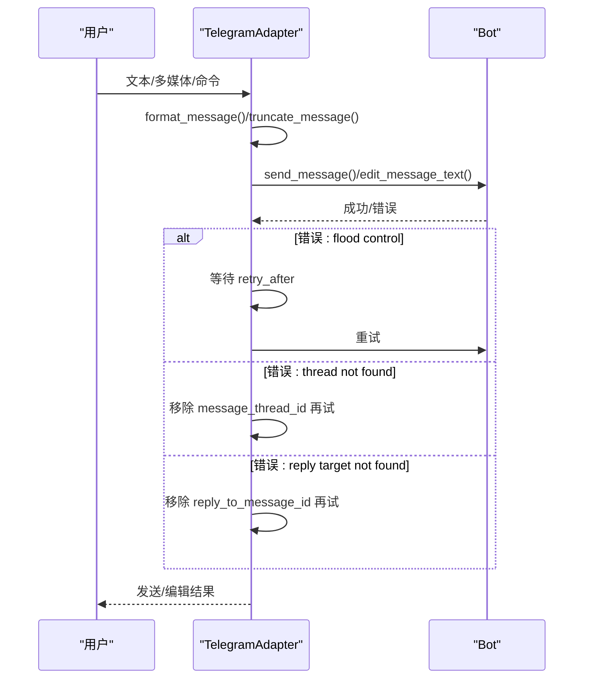
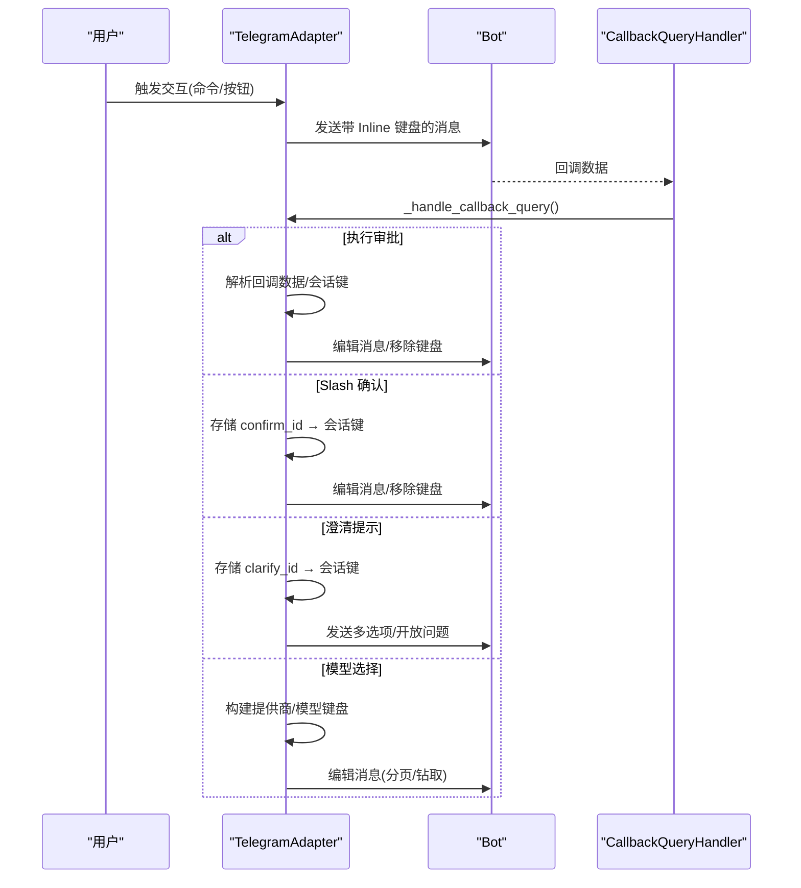
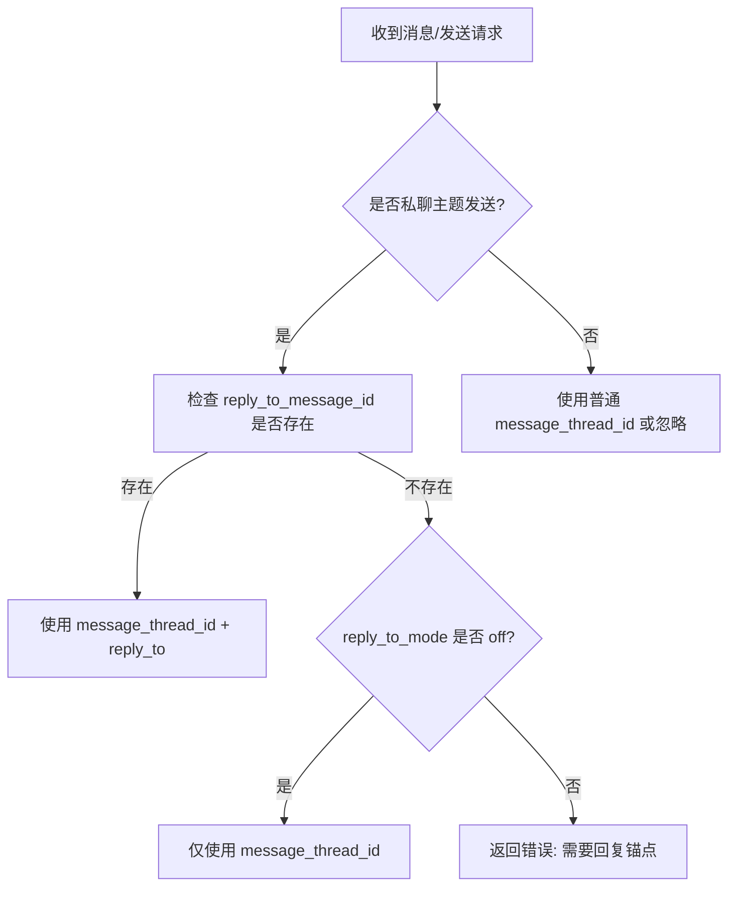
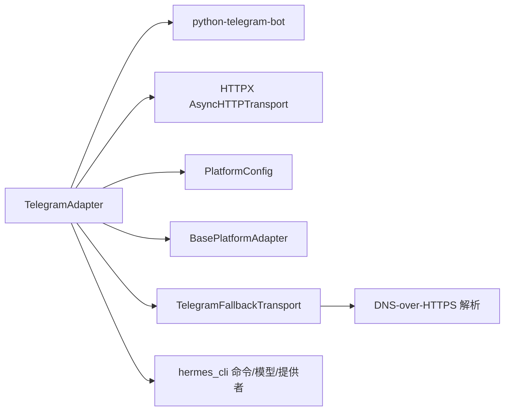

# Telegram 平台

<cite>
**本文档引用的文件**
- [telegram.py](file://gateway/platforms/telegram.py)
- [telegram_network.py](file://gateway/platforms/telegram_network.py)
- [base.py](file://gateway/platforms/base.py)
- [config.py](file://gateway/config.py)
- [__init__.py](file://hermes_cli/telegram_managed_bot.py)
- [commands.py](file://hermes_cli/commands.py)
- [models.py](file://hermes_cli/models.py)
- [providers.py](file://hermes_cli/providers.py)
</cite>

## 目录
1. [简介](#简介)
2. [项目结构](#项目结构)
3. [核心组件](#核心组件)
4. [架构概览](#架构概览)
5. [详细组件分析](#详细组件分析)
6. [依赖关系分析](#依赖关系分析)
7. [性能考量](#性能考量)
8. [故障排除指南](#故障排除指南)
9. [结论](#结论)
10. [附录](#附录)

## 简介
本文件为 Hermes Agent 的 Telegram 平台适配器提供全面的技术文档。内容覆盖机器人 API 集成、消息处理机制、多媒体内容支持、用户认证流程、Inline 模式、键盘按钮交互、文件上传下载与语音消息处理、配置示例（Bot Token 获取、Webhook 设置、轮询模式）、速率限制策略、消息格式转换以及平台特定安全注意事项，并包含故障排除指南与性能优化建议。

## 项目结构
Telegram 适配器位于网关平台模块中，采用分层设计：
- 平台适配器：负责与 Telegram Bot API 交互，处理消息接收与发送、多媒体、Inline 键盘等
- 网络辅助：提供备用 IP 连接与代理支持，增强网络鲁棒性
- 基类抽象：统一消息事件、发送结果、缓存与媒体类型定义
- CLI 集成：命令菜单注册、模型选择器、确认提示等交互组件

**图表来源**
- [telegram.py:334-1781](file://gateway/platforms/telegram.py#L334-L1781)
- [telegram_network.py:52-260](file://gateway/platforms/telegram_network.py#L52-L260)
- [base.py:1-200](file://gateway/platforms/base.py#L1-L200)

**章节来源**
- [telegram.py:1-200](file://gateway/platforms/telegram.py#L1-L200)
- [telegram_network.py:1-60](file://gateway/platforms/telegram_network.py#L1-L60)

## 核心组件
- TelegramAdapter：核心适配器，封装连接、消息处理、发送、编辑、删除、状态管理、Inline 键盘交互、DM 主题路由等功能
- TelegramFallbackTransport：在主 DNS 路径不可达时，通过备用 IPv4 地址重试连接，保持主机名与 TLS SNI 不变
- BasePlatformAdapter：提供消息事件、发送结果、媒体缓存、UTF-16 长度计算等通用能力
- Inline 交互组件：模型选择器、执行审批、Slash 确认、澄清提示等

关键特性：
- 支持轮询与 Webhook 两种接入模式，具备自动冲突恢复与网络错误重连
- 多媒体处理：图片、视频、音频、语音、文档、贴纸等，含批量相册与媒体组缓冲
- DM 主题与论坛话题：私聊主题、回复锚点、线程回溯
- MarkdownV2 格式转换与表格渲染优化
- 速率限制与洪水控制：指数退避、重试后等待、池超时识别
- 安全：Webhook 密钥强制校验、代理与备用 IP 传输、线程/主题路由校验

**章节来源**
- [telegram.py:334-1781](file://gateway/platforms/telegram.py#L334-L1781)
- [telegram_network.py:52-260](file://gateway/platforms/telegram_network.py#L52-L260)
- [base.py:1-200](file://gateway/platforms/base.py#L1-L200)

## 架构概览
Telegram 适配器通过 python-telegram-bot 库与 Telegram Bot API 通信，支持两种运行模式：

- 轮询模式（默认）：主动拉取更新，适合本地或无公网 IP 的环境
- Webhook 模式：由 Telegram 推送更新，适合云平台自动唤醒场景

**图表来源**
- [telegram.py:1646-1781](file://gateway/platforms/telegram.py#L1646-L1781)

**章节来源**
- [telegram.py:1489-1781](file://gateway/platforms/telegram.py#L1489-L1781)

## 详细组件分析

### 连接与配置
- Bot Token 校验与平台锁：启动前检查 token 可用性，避免多实例竞争
- 自定义 base_url 与本地模式：支持自托管 telegram-bot-api 服务，文件路径读写
- HTTPX 请求参数：连接池大小、超时、代理传递
- 备用 IP 传输：当主 DNS 不可达时，使用备用 IPv4 地址重试，保持 SNI 与主机名一致
- Webhook 安全：必须设置 TELEGRAM_WEBHOOK_SECRET，否则拒绝启动以防止伪造更新注入

**图表来源**
- [telegram.py:1489-1781](file://gateway/platforms/telegram.py#L1489-L1781)
- [telegram_network.py:52-130](file://gateway/platforms/telegram_network.py#L52-L130)

**章节来源**
- [telegram.py:1489-1781](file://gateway/platforms/telegram.py#L1489-L1781)
- [telegram_network.py:1-130](file://gateway/platforms/telegram_network.py#L1-L130)

### 消息处理与发送
- 文本消息：过滤非命令文本与命令，分别进入对应处理器
- 命令消息：注册菜单命令，支持论坛群组按作用域注册
- 位置/地点：地理位置与场所消息处理
- 多媒体：图片、视频、音频、语音、文档、贴纸等，含批量相册与媒体组缓冲
- 发送流程：MarkdownV2 格式化、长度截断、分片发送、回复锚点与线程路由、通知静默模式
- 编辑流程：溢出拆分（编辑原消息 + 新消息续篇）、MarkdownV2 回退、洪水控制等待
- 删除流程：48 小时内删除消息，失败不致命

**图表来源**
- [telegram.py:1843-2119](file://gateway/platforms/telegram.py#L1843-L2119)

**章节来源**
- [telegram.py:1605-1622](file://gateway/platforms/telegram.py#L1605-L1622)
- [telegram.py:1843-2119](file://gateway/platforms/telegram.py#L1843-L2119)

### Inline 键盘与交互
- 执行审批：危险命令确认，支持“仅一次/会话/总是/拒绝”
- Slash 确认：三按钮确认（批准一次/总是/取消）
- 澄清提示：多选项 inline 键盘或开放问答
- 模型选择器：两步钻取（提供商 → 模型），支持分页与分组折叠

**图表来源**
- [telegram.py:2606-2921](file://gateway/platforms/telegram.py#L2606-L2921)

**章节来源**
- [telegram.py:2606-2921](file://gateway/platforms/telegram.py#L2606-L2921)

### DM 主题与论坛话题
- 私聊主题：创建/重命名/持久化 thread_id，支持图标颜色与自定义表情
- 论坛话题：按聊天类型注册命令菜单，延迟注册到具体 forum 聊天
- 回复锚点：私聊主题回溯需要 reply_to_message_id；支持“关闭回复锚点”模式
- 主题路由：message_thread_id 与 direct_messages_topic_id 组合使用，避免消息跑偏

**图表来源**
- [telegram.py:591-753](file://gateway/platforms/telegram.py#L591-L753)

**章节来源**
- [telegram.py:1177-1488](file://gateway/platforms/telegram.py#L1177-L1488)

### 多媒体与文件处理
- 支持类型：图片、视频、音频、语音、文档、贴纸
- 批量处理：相册与媒体组缓冲，降低客户端自我中断
- 文件大小限制：公共 Bot API 20MB，自托管可至 2GB
- 下载与缓存：通过缓存函数将字节流转换为本地缓存文件
- 语音消息：转录与处理流程（结合转录提供者）

**章节来源**
- [telegram.py:91-105](file://gateway/platforms/telegram.py#L91-L105)
- [telegram.py:463-470](file://gateway/platforms/telegram.py#L463-L470)
- [base.py:1-200](file://gateway/platforms/base.py#L1-L200)

### 安全与认证
- Webhook 密钥：必须设置 TELEGRAM_WEBHOOK_SECRET，否则拒绝启动
- 用户授权：支持环境白名单与运行时授权回调，Inline 按钮调用前进行授权校验
- 网络安全：备用 IP 传输保持 SNI 与主机名一致，避免中间人替换
- 代理支持：自动解析系统代理并传递给 HTTPX

**章节来源**
- [telegram.py:1662-1675](file://gateway/platforms/telegram.py#L1662-L1675)
- [telegram.py:510-561](file://gateway/platforms/telegram.py#L510-L561)
- [telegram_network.py:46-69](file://gateway/platforms/telegram_network.py#L46-L69)

## 依赖关系分析

**图表来源**
- [telegram.py:24-88](file://gateway/platforms/telegram.py#L24-L88)
- [telegram_network.py:18-49](file://gateway/platforms/telegram_network.py#L18-L49)

**章节来源**
- [telegram.py:24-88](file://gateway/platforms/telegram.py#L24-L88)
- [telegram_network.py:1-49](file://gateway/platforms/telegram_network.py#L1-L49)

## 性能考量
- 文本批处理：短文本快速延迟（~180ms）与自适应批处理，减少首 token 延迟
- 连接池：可调连接池大小与超时，避免池耗尽导致的 Pool timeout
- 网络重连：指数退避与心跳探测，恢复被挂起的长轮询任务
- 洪水控制：识别并等待 retry_after，避免重复发送造成更大压力
- MarkdownV2：预格式化与回退策略，减少解析失败重试

**章节来源**
- [telegram.py:366-437](file://gateway/platforms/telegram.py#L366-L437)
- [telegram.py:945-1070](file://gateway/platforms/telegram.py#L945-L1070)

## 故障排除指南
常见问题与解决方案：
- 连接冲突（409 Conflict）：前一个网关进程未完全释放会话，等待服务器端会话过期后重试
- 网络错误：长时间断网导致长轮询断开，按指数退避重连并进行心跳探测
- 线程/主题路由：thread not found 或 topic not found 时，自动移除 message_thread_id 再试
- 回复锚点丢失：原始回复消息被删除时，移除 reply_to_message_id 与主题路由再发送
- 池超时：httpx 连接池占满导致 Pool timeout，触发降级并允许重试
- Webhook 安全：未设置 TELEGRAM_WEBHOOK_SECRET 时拒绝启动，防止伪造更新

**章节来源**
- [telegram.py:1071-1175](file://gateway/platforms/telegram.py#L1071-L1175)
- [telegram.py:945-1070](file://gateway/platforms/telegram.py#L945-L1070)
- [telegram.py:1976-2040](file://gateway/platforms/telegram.py#L1976-L2040)
- [telegram.py:2008-2040](file://gateway/platforms/telegram.py#L2008-L2040)
- [telegram.py:2061-2075](file://gateway/platforms/telegram.py#L2061-L2075)

## 结论
Telegram 适配器提供了完整的消息收发、多媒体处理、Inline 交互与安全机制，支持轮询与 Webhook 两种模式，并针对网络不稳定与速率限制进行了充分优化。通过 DM 主题与论坛话题路由，实现了更精细的对话组织。建议在生产环境中优先使用 Webhook 并配置强密钥，合理设置连接池与超时参数，并利用备用 IP 传输提升网络鲁棒性。

## 附录

### 配置示例与最佳实践
- Bot Token 获取：在 @BotFather 创建机器人并获取 Token
- 轮询模式：无需额外配置，默认启用
- Webhook 模式：
  - 设置 TELEGRAM_WEBHOOK_URL（公网 HTTPS）
  - 设置 TELEGRAM_WEBHOOK_PORT（默认 8443）
  - 必须设置 TELEGRAM_WEBHOOK_SECRET（随机字符串）
- 代理与备用 IP：
  - 通过 TELEGRAM_PROXY 设置代理
  - 可通过环境变量禁用备用 IP 或手动指定备用 IP 列表
- 连接池与超时：
  - HERMES_TELEGRAM_HTTP_POOL_SIZE：连接池大小
  - HERMES_TELEGRAM_HTTP_POOL_TIMEOUT：池超时
  - HERMES_TELEGRAM_HTTP_CONNECT_TIMEOUT/READ_TIMEOUT/WRITE_TIMEOUT：连接/读/写超时

**章节来源**
- [telegram.py:1489-1781](file://gateway/platforms/telegram.py#L1489-L1781)
- [telegram_network.py:153-239](file://gateway/platforms/telegram_network.py#L153-L239)