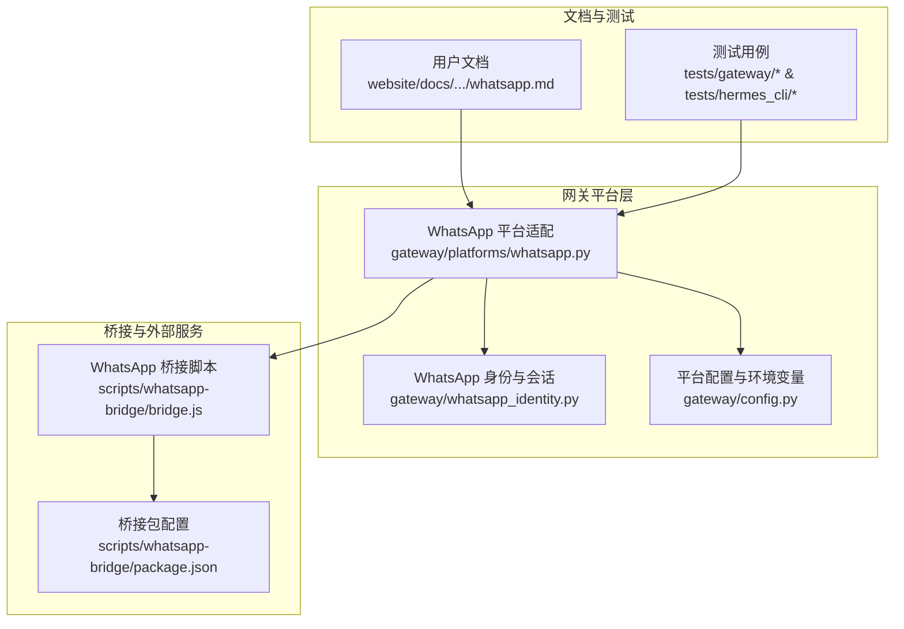
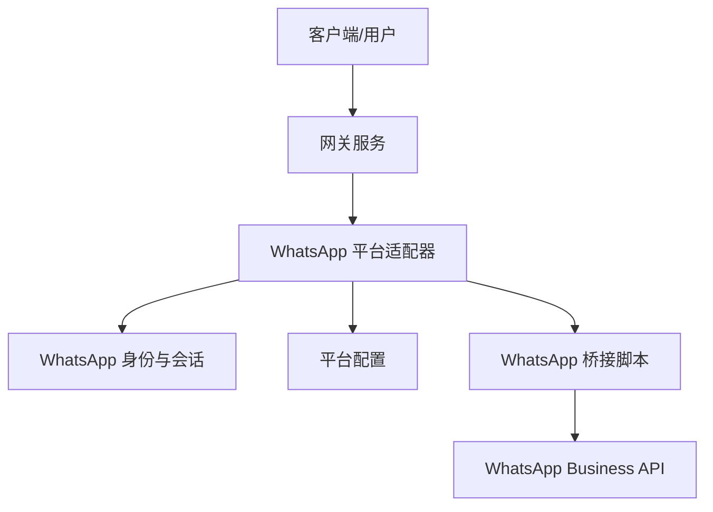
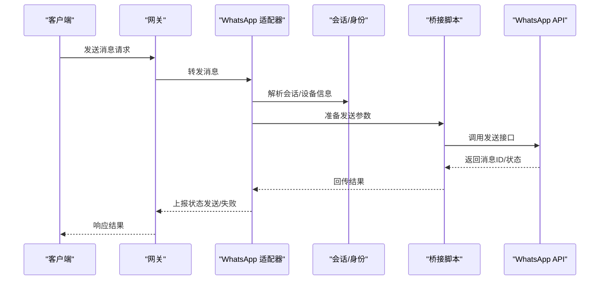
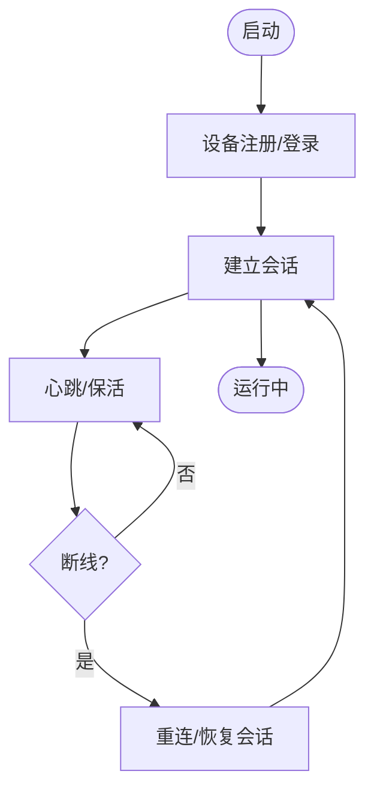
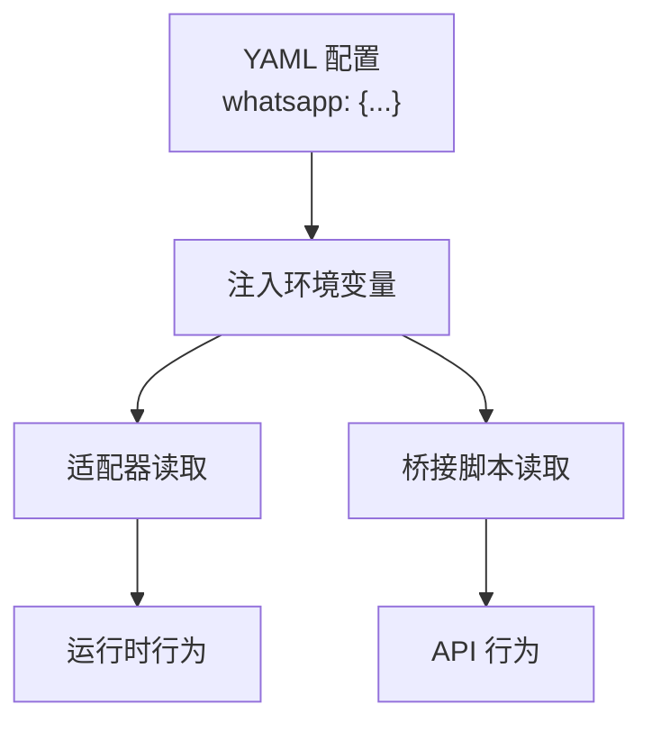
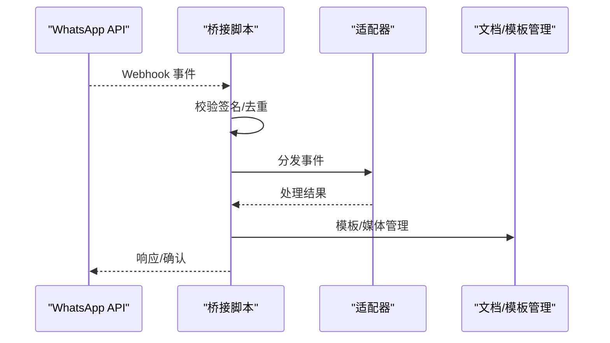
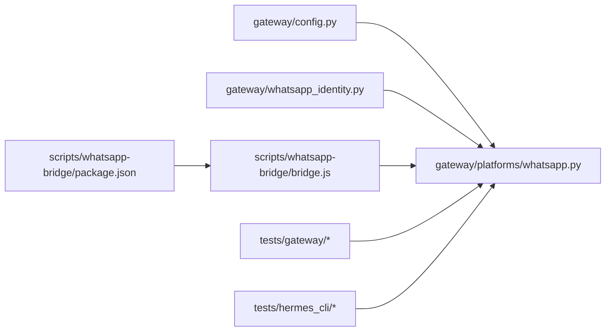

# WhatsApp 平台

<cite>
**本文引用的文件**
- [gateway/platforms/whatsapp.py](file://gateway/platforms/whatsapp.py)
- [gateway/whatsapp_identity.py](file://gateway/whatsapp_identity.py)
- [gateway/config.py](file://gateway/config.py)
- [scripts/whatsapp-bridge/bridge.js](file://scripts/whatsapp-bridge/bridge.js)
- [scripts/whatsapp-bridge/package.json](file://scripts/whatsapp-bridge/package.json)
- [website/docs/user-guide/messaging/whatsapp.md](file://website/docs/user-guide/messaging/whatsapp.md)
- [website/i18n/zh-Hans/docusaurus-plugin-content-docs/current/user-guide/messaging/whatsapp.md](file://website/i18n/zh-Hans/docusaurus-plugin-content-docs/current/user-guide/messaging/whatsapp.md)
- [tests/gateway/test_whatsapp_connect.py](file://tests/gateway/test_whatsapp_connect.py)
- [tests/gateway/test_whatsapp_formatting.py](file://tests/gateway/test_whatsapp_formatting.py)
- [tests/gateway/test_whatsapp_group_gating.py](file://tests/gateway/test_whatsapp_group_gating.py)
- [tests/gateway/test_whatsapp_reply_prefix.py](file://tests/gateway/test_whatsapp_reply_prefix.py)
- [tests/gateway/test_whatsapp_text_batching.py](file://tests/gateway/test_whatsapp_text_batching.py)
- [tests/hermes_cli/test_whatsapp_setup_ordering.py](file://tests/hermes_cli/test_whatsapp_setup_ordering.py)
</cite>

## 目录
1. [简介](#简介)
2. [项目结构](#项目结构)
3. [核心组件](#核心组件)
4. [架构总览](#架构总览)
5. [详细组件分析](#详细组件分析)
6. [依赖关系分析](#依赖关系分析)
7. [性能考虑](#性能考虑)
8. [故障排除指南](#故障排除指南)
9. [结论](#结论)
10. [附录](#附录)

## 简介
本文件面向在 Herms Agent 生态中集成 WhatsApp Business API 的工程与运营团队，系统化阐述消息收发、状态追踪、认证与会话保持、设备管理、多媒体与位置分享、联系人同步与状态更新等能力，并提供 Cloud API 账户设置、Webhook 配置、消息模板管理、合规与隐私安全、部署示例与故障排除指引。内容基于仓库中的 WhatsApp 平台实现、桥接脚本、测试用例与官方文档。

## 项目结构
与 WhatsApp 平台相关的核心位置如下：
- 平台适配层：gateway/platforms/whatsapp.py
- 设备身份与会话：gateway/whatsapp_identity.py
- 平台配置与环境变量：gateway/config.py
- Web 桥接脚本：scripts/whatsapp-bridge/bridge.js 及其包配置
- 用户文档：website/docs/user-guide/messaging/whatsapp.md（中英文）
- 测试用例：tests/gateway/ 与 tests/hermes_cli/ 下的 WhatsApp 相关测试

图表来源
- [gateway/platforms/whatsapp.py](file://gateway/platforms/whatsapp.py)
- [gateway/whatsapp_identity.py](file://gateway/whatsapp_identity.py)
- [gateway/config.py](file://gateway/config.py)
- [scripts/whatsapp-bridge/bridge.js](file://scripts/whatsapp-bridge/bridge.js)
- [scripts/whatsapp-bridge/package.json](file://scripts/whatsapp-bridge/package.json)
- [website/docs/user-guide/messaging/whatsapp.md](file://website/docs/user-guide/messaging/whatsapp.md)

章节来源
- [gateway/platforms/whatsapp.py](file://gateway/platforms/whatsapp.py)
- [gateway/whatsapp_identity.py](file://gateway/whatsapp_identity.py)
- [gateway/config.py](file://gateway/config.py)
- [scripts/whatsapp-bridge/bridge.js](file://scripts/whatsapp-bridge/bridge.js)
- [scripts/whatsapp-bridge/package.json](file://scripts/whatsapp-bridge/package.json)
- [website/docs/user-guide/messaging/whatsapp.md](file://website/docs/user-guide/messaging/whatsapp.md)

## 核心组件
- 平台适配器（WhatsApp）：负责消息编解码、发送、接收、状态回传、提及与群组门控、文本批处理等。
- 设备身份与会话：负责设备注册、登录态维护、会话持久化与恢复。
- 平台配置：集中定义平台枚举、默认行为、环境变量映射与运行时开关。
- 桥接脚本：封装与 WhatsApp Business API 的交互细节，支持认证、Webhook、模板与媒体上传等。
- 文档与测试：提供部署与使用指南，以及针对格式化、提及、群组门控、回复前缀、文本批处理等场景的回归保障。

章节来源
- [gateway/platforms/whatsapp.py](file://gateway/platforms/whatsapp.py)
- [gateway/whatsapp_identity.py](file://gateway/whatsapp_identity.py)
- [gateway/config.py](file://gateway/config.py)
- [website/docs/user-guide/messaging/whatsapp.md](file://website/docs/user-guide/messaging/whatsapp.md)

## 架构总览
WhatsApp 平台在系统中的位置与交互如下：

图表来源
- [gateway/platforms/whatsapp.py](file://gateway/platforms/whatsapp.py)
- [gateway/whatsapp_identity.py](file://gateway/whatsapp_identity.py)
- [gateway/config.py](file://gateway/config.py)
- [scripts/whatsapp-bridge/bridge.js](file://scripts/whatsapp-bridge/bridge.js)

## 详细组件分析

### 组件一：平台适配器（WhatsApp）
职责与能力
- 消息发送：将内部消息模型转换为 WhatsApp API 所需格式，支持文本、多媒体、位置等。
- 消息接收：解析来自 API 的事件，分发到对应通道或会话上下文。
- 状态追踪：上报消息状态（发送、送达、阅读、失败），并驱动重试与降级。
- 提及与群组门控：根据配置决定是否需要 @ 提及、自由对话聊天、私聊策略与白名单。
- 文本批处理：对长文本进行合理拆分与批量化发送，避免超限与丢失。
- 回复前缀：在转发或回复场景下保留上下文前缀，提升可读性。

关键实现要点
- 输入输出模型映射：将内部字段与 WhatsApp 字段一一对应，确保附件、位置、模板参数等正确传递。
- 环境变量注入：通过配置模块将用户 YAML 中的 whatsapp 段落转换为运行时环境变量，供桥接脚本与适配器使用。
- 错误与重试：对网络异常、速率限制、无效号码等进行分类处理与指数退避重试。

图表来源
- [gateway/platforms/whatsapp.py](file://gateway/platforms/whatsapp.py)
- [gateway/whatsapp_identity.py](file://gateway/whatsapp_identity.py)
- [scripts/whatsapp-bridge/bridge.js](file://scripts/whatsapp-bridge/bridge.js)

章节来源
- [gateway/platforms/whatsapp.py](file://gateway/platforms/whatsapp.py)
- [gateway/config.py](file://gateway/config.py)
- [tests/gateway/test_whatsapp_formatting.py](file://tests/gateway/test_whatsapp_formatting.py)
- [tests/gateway/test_whatsapp_text_batching.py](file://tests/gateway/test_whatsapp_text_batching.py)
- [tests/gateway/test_whatsapp_reply_prefix.py](file://tests/gateway/test_whatsapp_reply_prefix.py)

### 组件二：设备身份与会话（WhatsApp）
职责与能力
- 设备注册与登录：完成设备绑定、二维码扫描、登录态建立。
- 会话保持：维持长连接、心跳、断线重连与状态恢复。
- 会话上下文：为每个会话维护联系人、群组、历史消息索引，支持快速检索与上下文拼接。

图表来源
- [gateway/whatsapp_identity.py](file://gateway/whatsapp_identity.py)

章节来源
- [gateway/whatsapp_identity.py](file://gateway/whatsapp_identity.py)

### 组件三：平台配置（WhatsApp）
职责与能力
- 平台枚举与默认行为：统一平台标识，定义默认启用策略。
- 环境变量映射：从 YAML 配置中读取 whatsapp 段落，注入到运行时环境变量，覆盖默认值。
- 运行时开关：支持提及要求、提及模式、自由对话聊天、私聊策略、允许来源等。

图表来源
- [gateway/config.py](file://gateway/config.py)

章节来源
- [gateway/config.py](file://gateway/config.py)

### 组件四：桥接脚本（WhatsApp）
职责与能力
- 认证与授权：处理登录、令牌刷新、权限校验。
- Webhook 接收：解析事件、去重、路由到适配器。
- 模板与媒体：上传模板、媒体资源，管理版本与可见性。
- 速率控制：对接口调用频率进行限制，避免触发风控。

图表来源
- [scripts/whatsapp-bridge/bridge.js](file://scripts/whatsapp-bridge/bridge.js)
- [scripts/whatsapp-bridge/package.json](file://scripts/whatsapp-bridge/package.json)

章节来源
- [scripts/whatsapp-bridge/bridge.js](file://scripts/whatsapp-bridge/bridge.js)
- [scripts/whatsapp-bridge/package.json](file://scripts/whatsapp-bridge/package.json)

### 组件五：文档与测试
- 官方文档：提供 Cloud API 账户设置、Webhook 配置、消息模板管理、合规与隐私等指导。
- 测试用例：覆盖连接、格式化、群组门控、回复前缀、文本批处理等关键场景，保障稳定性。

章节来源
- [website/docs/user-guide/messaging/whatsapp.md](file://website/docs/user-guide/messaging/whatsapp.md)
- [website/i18n/zh-Hans/docusaurus-plugin-content-docs/current/user-guide/messaging/whatsapp.md](file://website/i18n/zh-Hans/docusaurus-plugin-content-docs/current/user-guide/messaging/whatsapp.md)
- [tests/gateway/test_whatsapp_connect.py](file://tests/gateway/test_whatsapp_connect.py)
- [tests/gateway/test_whatsapp_formatting.py](file://tests/gateway/test_whatsapp_formatting.py)
- [tests/gateway/test_whatsapp_group_gating.py](file://tests/gateway/test_whatsapp_group_gating.py)
- [tests/gateway/test_whatsapp_reply_prefix.py](file://tests/gateway/test_whatsapp_reply_prefix.py)
- [tests/gateway/test_whatsapp_text_batching.py](file://tests/gateway/test_whatsapp_text_batching.py)
- [tests/hermes_cli/test_whatsapp_setup_ordering.py](file://tests/hermes_cli/test_whatsapp_setup_ordering.py)

## 依赖关系分析
- 适配器依赖配置模块以读取运行时开关；依赖身份模块以解析会话上下文；依赖桥接脚本以执行 API 调用。
- 桥接脚本依赖包配置中的依赖项，确保运行环境与工具链完整。
- 测试用例覆盖适配器与 CLI 的设置顺序，保证部署一致性。

图表来源
- [gateway/config.py](file://gateway/config.py)
- [gateway/platforms/whatsapp.py](file://gateway/platforms/whatsapp.py)
- [gateway/whatsapp_identity.py](file://gateway/whatsapp_identity.py)
- [scripts/whatsapp-bridge/bridge.js](file://scripts/whatsapp-bridge/bridge.js)
- [scripts/whatsapp-bridge/package.json](file://scripts/whatsapp-bridge/package.json)
- [tests/gateway/test_whatsapp_connect.py](file://tests/gateway/test_whatsapp_connect.py)
- [tests/hermes_cli/test_whatsapp_setup_ordering.py](file://tests/hermes_cli/test_whatsapp_setup_ordering.py)

章节来源
- [gateway/config.py](file://gateway/config.py)
- [gateway/platforms/whatsapp.py](file://gateway/platforms/whatsapp.py)
- [gateway/whatsapp_identity.py](file://gateway/whatsapp_identity.py)
- [scripts/whatsapp-bridge/bridge.js](file://scripts/whatsapp-bridge/bridge.js)
- [scripts/whatsapp-bridge/package.json](file://scripts/whatsapp-bridge/package.json)
- [tests/gateway/test_whatsapp_connect.py](file://tests/gateway/test_whatsapp_connect.py)
- [tests/hermes_cli/test_whatsapp_setup_ordering.py](file://tests/hermes_cli/test_whatsapp_setup_ordering.py)

## 性能考虑
- 文本批处理：对长文本进行分片与批量化发送，减少 API 调用次数与失败风险。
- 速率控制：在桥接层实施速率限制与退避策略，避免触发业务风控。
- 会话保活：维持稳定的心跳与断线重连，降低消息延迟与丢包率。
- 缓存与去重：对 Webhook 事件进行去重与缓存，避免重复处理。

## 故障排除指南
常见问题与定位思路
- 连接失败：检查设备注册与登录流程、网络连通性、API 密钥与权限。
- 消息未送达：核查模板状态、媒体资源有效性、号码格式与白名单。
- Webhook 不生效：确认回调地址、签名验证、事件去重逻辑。
- 群组门控异常：核对提及要求、提及模式、自由对话聊天与私聊策略配置。
- 文本批处理错乱：检查批处理阈值、前缀保留策略与换行符处理。

章节来源
- [tests/gateway/test_whatsapp_connect.py](file://tests/gateway/test_whatsapp_connect.py)
- [tests/gateway/test_whatsapp_group_gating.py](file://tests/gateway/test_whatsapp_group_gating.py)
- [tests/gateway/test_whatsapp_formatting.py](file://tests/gateway/test_whatsapp_formatting.py)
- [tests/gateway/test_whatsapp_text_batching.py](file://tests/gateway/test_whatsapp_text_batching.py)
- [tests/gateway/test_whatsapp_reply_prefix.py](file://tests/gateway/test_whatsapp_reply_prefix.py)
- [tests/hermes_cli/test_whatsapp_setup_ordering.py](file://tests/hermes_cli/test_whatsapp_setup_ordering.py)

## 结论
本方案通过“平台适配器 + 身份会话 + 桥接脚本 + 配置中心”的分层设计，实现了对 WhatsApp Business API 的稳定集成。结合完善的测试与文档，能够满足消息收发、状态追踪、多媒体与位置分享、联系人同步与状态更新等需求，并提供合规与安全层面的实践建议。

## 附录

### 配置指南（概要）
- Cloud API 账户设置：在官方平台创建账号、获取 API 密钥与权限。
- Webhook 配置：设置回调地址、签名密钥、事件类型与去重策略。
- 消息模板管理：创建并审核模板，管理版本与可见性，确保合规。
- 环境变量与 YAML：在配置文件中设置提及要求、群组策略、自由对话聊天与来源白名单等。

章节来源
- [gateway/config.py](file://gateway/config.py)
- [website/docs/user-guide/messaging/whatsapp.md](file://website/docs/user-guide/messaging/whatsapp.md)