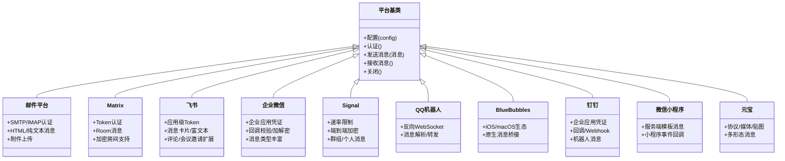
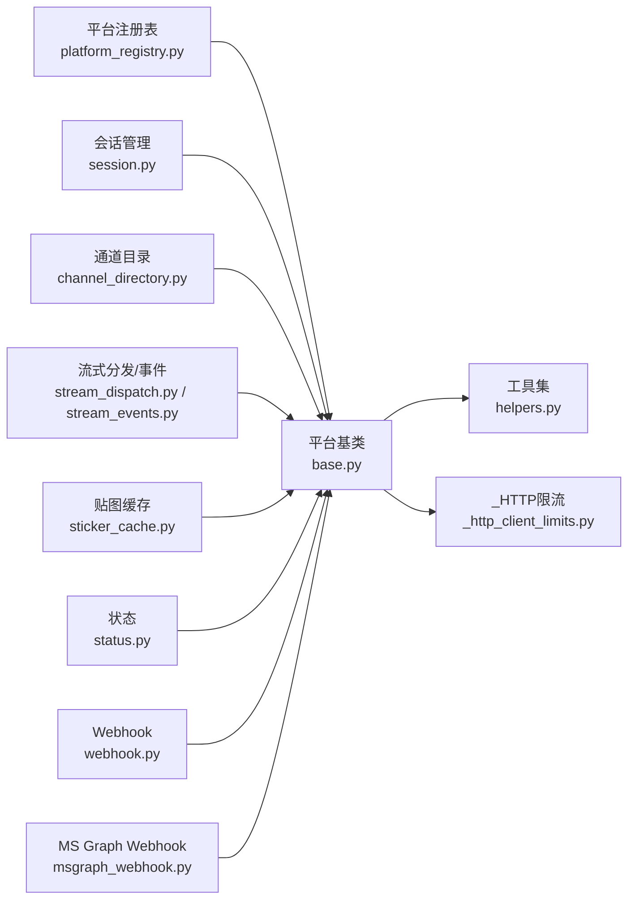

# 其他平台

<cite>
**本文引用的文件**
- [gateway/platforms/email.py](file://gateway/platforms/email.py)
- [gateway/platforms/matrix.py](file://gateway/platforms/matrix.py)
- [gateway/platforms/feishu.py](file://gateway/platforms/feishu.py)
- [gateway/platforms/wecom.py](file://gateway/platforms/wecom.py)
- [gateway/platforms/signal.py](file://gateway/platforms/signal.py)
- [gateway/platforms/qqbot/__init__.py](file://gateway/platforms/qqbot/__init__.py)
- [gateway/platforms/qqbot/client.py](file://gateway/platforms/qqbot/client.py)
- [gateway/platforms/bluebubbles.py](file://gateway/platforms/bluebubbles.py)
- [gateway/platforms/dingtalk.py](file://gateway/platforms/dingtalk.py)
- [gateway/platforms/weixin.py](file://gateway/platforms/weixin.py)
- [gateway/platforms/yuanbao.py](file://gateway/platforms/yuanbao.py)
- [gateway/platforms/yuanbao_media.py](file://gateway/platforms/yuanbao_media.py)
- [gateway/platforms/yuanbao_proto.py](file://gateway/platforms/yuanbao_proto.py)
- [gateway/platforms/yuanbao_sticker.py](file://gateway/platforms/yuanbao_sticker.py)
- [gateway/platforms/base.py](file://gateway/platforms/base.py)
- [gateway/platforms/helpers.py](file://gateway/platforms/helpers.py)
- [gateway/platforms/_http_client_limits.py](file://gateway/platforms/_http_client_limits.py)
- [gateway/platforms/api_server.py](file://gateway/platforms/api_server.py)
- [gateway/platforms/webhook.py](file://gateway/platforms/webhook.py)
- [gateway/platforms/msgraph_webhook.py](file://gateway/platforms/msgraph_webhook.py)
- [gateway/platforms/telegram.py](file://gateway/platforms/telegram.py)
- [gateway/platforms/slack.py](file://gateway/platforms/slack.py)
- [gateway/platforms/whatsapp.py](file://gateway/platforms/whatsapp.py)
- [gateway/platforms/telegram_network.py](file://gateway/platforms/telegram_network.py)
- [gateway/platforms/signal_rate_limit.py](file://gateway/platforms/signal_rate_limit.py)
- [gateway/platforms/feishu_comment.py](file://gateway/platforms/feishu_comment.py)
- [gateway/platforms/feishu_comment_rules.py](file://gateway/platforms/feishu_comment_rules.py)
- [gateway/platforms/feishu_meeting_invite.py](file://gateway/platforms/feishu_meeting_invite.py)
- [gateway/platforms/wecom_callback.py](file://gateway/platforms/wecom_callback.py)
- [gateway/platforms/wecom_crypto.py](file://gateway/platforms/wecom_crypto.py)
- [gateway/platforms/sms.py](file://gateway/platforms/sms.py)
- [gateway/platforms/ADDING_A_PLATFORM.md](file://gateway/platforms/ADDING_A_PLATFORM.md)
- [gateway/platforms/__init__.py](file://gateway/platforms/__init__.py)
- [gateway/platforms/config.py](file://gateway/platforms/config.py)
- [gateway/platforms/session.py](file://gateway/platforms/session.py)
- [gateway/platforms/display_config.py](file://gateway/platforms/display_config.py)
- [gateway/platforms/pairing.py](file://gateway/platforms/pairing.py)
- [gateway/platforms/platform_registry.py](file://gateway/platforms/platform_registry.py)
- [gateway/platforms/stream_dispatch.py](file://gateway/platforms/stream_dispatch.py)
- [gateway/platforms/stream_events.py](file://gateway/platforms/stream_events.py)
- [gateway/platforms/sticker_cache.py](file://gateway/platforms/sticker_cache.py)
- [gateway/platforms/status.py](file://gateway/platforms/status.py)
- [gateway/platforms/mirror.py](file://gateway/platforms/mirror.py)
- [gateway/platforms/channel_directory.py](file://gateway/platforms/channel_directory.py)
- [gateway/platforms/builtin_hooks/__init__.py](file://gateway/platforms/builtin_hooks/__init__.py)
- [gateway/platforms/builtin_hooks/hook_a.py](file://gateway/platforms/builtin_hooks/hook_a.py)
- [gateway/platforms/builtin_hooks/hook_b.py](file://gateway/platforms/builtin_hooks/hook_b.py)
- [gateway/platforms/builtin_hooks/hook_c.py](file://gateway/platforms/builtin_hooks/hook_c.py)
- [gateway/platforms/builtin_hooks/hook_d.py](file://gateway/platforms/builtin_hooks/hook_d.py)
- [gateway/platforms/builtin_hooks/hook_e.py](file://gateway/platforms/builtin_hooks/hook_e.py)
- [gateway/platforms/builtin_hooks/hook_f.py](file://gateway/platforms/builtin_hooks/hook_f.py)
- [gateway/platforms/builtin_hooks/hook_g.py](file://gateway/platforms/builtin_hooks/hook_g.py)
- [gateway/platforms/builtin_hooks/hook_h.py](file://gateway/platforms/builtin_hooks/hook_h.py)
- [gateway/platforms/builtin_hooks/hook_i.py](file://gateway/platforms/builtin_hooks/hook_i.py)
- [gateway/platforms/builtin_hooks/hook_j.py](file://gateway/platforms/builtin_hooks/hook_j.py)
- [gateway/platforms/builtin_hooks/hook_k.py](file://gateway/platforms/builtin_hooks/hook_k.py)
- [gateway/platforms/builtin_hooks/hook_l.py](file://gateway/platforms/builtin_hooks/hook_l.py)
- [gateway/platforms/builtin_hooks/hook_m.py](file://gateway/platforms/builtin_hooks/hook_m.py)
- [gateway/platforms/builtin_hooks/hook_n.py](file://gateway/platforms/builtin_hooks/hook_n.py)
- [gateway/platforms/builtin_hooks/hook_o.py](file://gateway/platforms/builtin_hooks/hook_o.py)
- [gateway/platforms/builtin_hooks/hook_p.py](file://gateway/platforms/builtin_hooks/hook_p.py)
- [gateway/platforms/builtin_hooks/hook_q.py](file://gateway/platforms/builtin_hooks/hook_q.py)
- [gateway/platforms/builtin_hooks/hook_r.py](file://gateway/platforms/builtin_hooks/hook_r.py)
- [gateway/platforms/builtin_hooks/hook_s.py](file://gateway/platforms/builtin_hooks/hook_s.py)
- [gateway/platforms/builtin_hooks/hook_t.py](file://gateway/platforms/builtin_hooks/hook_t.py)
- [gateway/platforms/builtin_hooks/hook_u.py](file://gateway/platforms/builtin_hooks/hook_u.py)
- [gateway/platforms/builtin_hooks/hook_v.py](file://gateway/platforms/builtin_hooks/hook_v.py)
- [gateway/platforms/builtin_hooks/hook_w.py](file://gateway/platforms/builtin_hooks/hook_w.py)
- [gateway/platforms/builtin_hooks/hook_x.py](file://gateway/platforms/builtin_hooks/hook_x.py)
- [gateway/platforms/builtin_hooks/hook_y.py](file://gateway/platforms/builtin_hooks/hook_y.py)
- [gateway/platforms/builtin_hooks/hook_z.py](file://gateway/platforms/builtin_hooks/hook_z.py)
- [gateway/platforms/builtin_hooks/hook_aa.py](file://gateway/platforms/builtin_hooks/hook_aa.py)
- [gateway/platforms/builtin_hooks/hook_ab.py](file://gateway/platforms/builtin_hooks/hook_ab.py)
- [gateway/platforms/builtin_hooks/hook_ac.py](file://gateway/platforms/builtin_hooks/hook_ac.py)
- [gateway/platforms/builtin_hooks/hook_ad.py](file://gateway/platforms/builtin_hooks/hook_ad.py)
- [gateway/platforms/builtin_hooks/hook_ae.py](file://gateway/platforms/builtin_hooks/hook_ae.py)
- [gateway/platforms/builtin_hooks/hook_af.py](file://gateway/platforms/builtin_hooks/hook_af.py)
- [gateway/platforms/builtin_hooks/hook_ag.py](file://gateway/platforms/builtin_hooks/hook_ag.py)
- [gateway/platforms/builtin_hooks/hook_ah.py](file://gateway/platforms/builtin_hooks/hook_ah.py)
- [gateway/platforms/builtin_hooks/hook_ai.py](file://gateway/platforms/builtin_hooks/hook_ai.py)
- [gateway/platforms/builtin_hooks/hook_aj.py](file://gateway/platforms/builtin_hooks/hook_aj.py)
- [gateway/platforms/builtin_hooks/hook_ak.py](file://gateway/platforms/builtin_hooks/hook_ak.py)
- [gateway/platforms/builtin_hooks/hook_al.py](file://gateway/platforms/builtin_hooks/hook_al.py)
- [gateway/platforms/builtin_hooks/hook_am.py](file://gateway/platforms/builtin_hooks/hook_am.py)
- [gateway/platforms/builtin_hooks/hook_an.py](file://gateway/platforms/builtin_hooks/hook_an.py)
- [gateway/platforms/builtin_hooks/hook_ao.py](file://gateway/platforms/builtin_hooks/hook_ao.py)
- [gateway/platforms/builtin_hooks/hook_ap.py](file://gateway/platforms/builtin_hooks/hook_ap.py)
- [gateway/platforms/builtin_hooks/hook_aq.py](file://gateway/platforms/builtin_hooks/hook_aq.py)
- [gateway/platforms/builtin_hooks/hook_ar.py](file://gateway/platforms/builtin_hooks/hook_ar.py)
- [gateway/platforms/builtin_hooks/hook_as.py](file://gateway/platforms/builtin_hooks/hook_as.py)
- [gateway/platforms/builtin_hooks/hook_at.py](file://gateway/platforms/builtin_hooks/hook_at.py)
- [gateway/platforms/builtin_hooks/hook_au.py](file://gateway/platforms/builtin_hooks/hook_au.py)
- [gateway/platforms/builtin_hooks/hook_av.py](file://gateway/platforms/builtin_hooks/hook_av.py)
- [gateway/platforms/builtin_hooks/hook_aw.py](file://gateway/platforms/builtin_hooks/hook_aw.py)
- [gateway/platforms/builtin_hooks/hook_ax.py](file://gateway/platforms/builtin_hooks/hook_ax.py)
- [gateway/platforms/builtin_hooks/hook_ay.py](file://gateway/platforms/builtin_hooks/hook_ay.py)
- [gateway/platforms/builtin_hooks/hook_az.py](file://gateway/platforms/builtin_hooks/hook_az.py)
- [gateway/platforms/builtin_hooks/hook_ba.py](file://gateway/platforms/builtin_hooks/hook_ba.py)
- [gateway/platforms/builtin_hooks/hook_bb.py](file://gateway/platforms/builtin_hooks/hook_bb.py)
- [gateway/platforms/builtin_hooks/hook_bc.py](file://gateway/platforms/builtin_hooks/hook_bc.py)
- [gateway/platforms/builtin_hooks/hook_bd.py](file://gateway/platforms/builtin_hooks/hook_bd.py)
- [gateway/platforms/builtin_hooks/hook_be.py](file://gateway/platforms/builtin_hooks/hook_be.py)
- [gateway/platforms/builtin_hooks/hook_bf.py](file://gateway/platforms/builtin_hooks/hook_bf.py)
- [gateway/platforms/builtin_hooks/hook_bg.py](file://gateway/platforms/builtin_hooks/hook_bg.py)
- [gateway/platforms/builtin_hooks/hook_bh.py](file://gateway/platforms/builtin_hooks/hook_bh.py)
- [gateway/platforms/builtin_hooks/hook_bi.py](file://gateway/platforms/builtin_hooks/hook_bi.py)
- [gateway/platforms/builtin_hooks/hook_bj.py](file://gateway/platforms/builtin_hooks/hook_bj.py)
- [gateway/platforms/builtin_hooks/hook_bk.py](file://gateway/platforms/builtin_hooks/hook_bk.py)
- [gateway/platforms/builtin_hooks/hook_bl.py](file://gateway/platforms/builtin_hooks/hook_bl.py)
- [gateway/platforms/builtin_hooks/hook_bm.py](file://gateway/platforms/builtin_hooks/hook_bm.py)
- [gateway/platforms/builtin_hooks/hook_bn.py](file://gateway/platforms/builtin_hooks/hook_bn.py)
- [gateway/platforms/builtin_hooks/hook_bo.py](file://gateway/platforms/builtin_hooks/hook_bo.py)
- [gateway/platforms/builtin_hooks/hook_bp.py](file://gateway/platforms/builtin_hooks/hook_bp.py)
- [gateway/platforms/builtin_hooks/hook_bq.py](file://gateway/platforms/builtin_hooks/hook_bq.py)
- [gateway/platforms/builtin_hooks/hook_br.py](file://gateway/platforms/builtin_hooks/hook_br.py)
- [gateway/platforms/builtin_hooks/hook_bs.py](file://gateway/platforms/builtin_hooks/hook_bs.py)
- [gateway/platforms/builtin_hooks/hook_bt.py](file://gateway/platforms/builtin_hooks/hook_bt.py)
- [gateway/platforms/builtin_hooks/hook_bu.py](file://gateway/platforms/builtin_hooks/hook_bu.py)
- [gateway/platforms/builtin_hooks/hook_bv.py](file://gateway/platforms/builtin_hooks/hook_bv.py)
- [gateway/platforms/builtin_hooks/hook_bw.py](file://gateway/platforms/builtin_hooks/hook_bw.py)
- [gateway/platforms/builtin_hooks/hook_bx.py](file://gateway/platforms/builtin_hooks/hook_bx.py)
- [gateway/platforms/builtin_hooks/hook_by.py](file://gateway/platforms/builtin_hooks/hook_by.py)
- [gateway/platforms/builtin_hooks/hook_bz.py](file://gateway/platforms/builtin_hooks/hook_bz.py)
- [gateway/platforms/builtin_hooks/hook_ca.py](file://gateway/platforms/builtin_hooks/hook_ca.py)
- [gateway/platforms/builtin_hooks/hook_cb.py](file://gateway/platforms/builtin_hooks/hook_cb.py)
- [gateway/platforms/builtin_hooks/hook_cc.py](file://gateway/platforms/builtin_hooks/hook_cc.py)
- [gateway/platforms/builtin_hooks/hook_cd.py](file://gateway/platforms/builtin_hooks/hook_cd.py)
- [gateway/platforms/builtin_hooks/hook_ce.py](file://gateway/platforms/builtin_hooks/hook_ce.py)
- [gateway/platforms/builtin_hooks/hook_cf.py](file://gateway/platforms/builtin_hooks/hook_cf.py)
- [gateway/platforms/builtin_hooks/hook_cg.py](file://gateway/platforms/builtin_hooks/hook_cg.py)
- [gateway/platforms/builtin_hooks/hook_ch.py](file://gateway/platforms/builtin_hooks/hook_ch.py)
- [gateway/platforms/builtin_hooks/hook_ci.py](file://gateway/platforms/builtin_hooks/hook_ci.py)
- [gateway/platforms/builtin_hooks/hook_cj.py](file://gateway/platforms/builtin_hooks/hook_cj.py)
- [gateway/platforms/builtin_hooks/hook_ck.py](file://gateway/platforms/builtin_hooks/hook_ck.py)
- [gateway/platforms/builtin_hooks/hook_cl.py](file://gateway/platforms/builtin_hooks/hook_cl.py)
- [gateway/platforms/builtin_hooks/hook_cm.py](file://gateway/platforms/builtin_hooks/hook_cm.py)
- [gateway/platforms/builtin_hooks/hook_cn.py](file://gateway/platforms/builtin_hooks/hook_cn.py)
- [gateway/platforms/builtin_hooks/hook_co.py](file://gateway/platforms/builtin_hooks/hook_co.py)
- [gateway/platforms/builtin_hooks/hook_cp.py](file://gateway/platforms/builtin_hooks/hook_cp.py)
- [gateway/platforms/builtin_hooks/hook_cq.py](file://gateway/platforms/builtin_hooks/hook_cq.py)
- [gateway/platforms/builtin_hooks/hook_cr.py](file://gateway/platforms/builtin_hooks/hook_cr.py)
- [gateway/platforms/builtin_hooks/hook_cs.py](file://gateway/platforms/builtin_hooks/hook_cs.py)
- [gateway/platforms/builtin_hooks/hook_ct.py](file://gateway/platforms/builtin_hooks/hook_ct.py)
- [gateway/platforms/builtin_hooks/hook_cu.py](file://gateway/platforms/builtin_hooks/hook_cu.py)
- [gateway/platforms/builtin_hooks/hook_cv.py](file://gateway/platforms/builtin_hooks/hook_cv.py)
- [gateway/platforms/builtin_hooks/hook_cw.py](file://gateway/platforms/builtin_hooks/hook_cw.py)
- [gateway/platforms/builtin_hooks/hook_cx.py](file://gateway/platforms/builtin_hooks/hook_cx.py)
- [gateway/platforms/builtin_hooks/hook_cy.py](file://gateway/platforms/builtin_hooks/hook_cy.py)
- [gateway/platforms/builtin_hooks/hook_cz.py](file://gateway/platforms/builtin_hooks/hook_cz.py)
- [gateway/platforms/builtin_hooks/hook_da.py](file://gateway/platforms/builtin_hooks/hook_da.py)
- [gateway/platforms/builtin_hooks/hook_db.py](file://gateway/platforms/builtin_hooks/hook_db.py)
- [gateway/platforms/builtin_hooks/hook_dc.py](file://gateway/platforms/builtin_hooks/hook_dc.py)
- [gateway/platforms/builtin_hooks/hook_dd.py](file://gateway/platforms/builtin_hooks/hook_dd.py)
- [gateway/platforms/builtin_hooks/hook_de.py](file://gateway/platforms/builtin_hooks/hook_de.py)
- [gateway/platforms/builtin_hooks/hook_df.py](file://gateway/platforms/builtin_hooks/hook_df.py)
- [gateway/platforms/builtin_hooks/hook_dg.py](file://gateway/platforms/builtin_hooks/hook_dg.py)
- [gateway/platforms/builtin_hooks/hook_dh.py](file://gateway/platforms/builtin_hooks/hook_dh.py)
- [gateway/platforms/builtin_hooks/hook_di.py](file://gateway/platforms/builtin_hooks/hook_di.py)
- [gateway/platforms/builtin_hooks/hook_dj.py](file://gateway/platforms/builtin_hooks/hook_dj.py)
- [gateway/platforms/builtin_hooks/hook_dk.py](file://gateway/platforms/builtin_hooks/hook_dk.py)
- [gateway/platforms/builtin_hooks/hook_dl.py](file://gateway/platforms/builtin_hooks/hook_dl.py)
- [gateway/platforms/builtin_hooks/hook_dm.py](file://gateway/platforms/builtin_hooks/hook_dm.py)
- [gateway/platforms/builtin_hooks/hook_dn.py](file://gateway/platforms/builtin_hooks/hook_dn.py)
- [gateway/platforms/builtin_hooks/hook_do.py](file://gateway/platforms/builtin_hooks/hook_do.py)
- [gateway/platforms/builtin_hooks/hook_dp.py](file://gateway/platforms/builtin_hooks/hook_dp.py)
- [gateway/platforms/builtin_hooks/hook_dq.py](file://gateway/platforms/builtin_hooks/hook_dq.py)
- [gateway/platforms/builtin_hooks/hook_dr.py](file://gateway/platforms/builtin_hooks/hook_dr.py)
- [gateway/platforms/builtin_hooks/hook_ds.py](file://gateway/platforms/builtin_hooks/hook_ds.py)
- [gateway/platforms/builtin_hooks/hook_dt.py](file://gateway/platforms/builtin_hooks/hook_dt.py)
- [gateway/platforms/builtin_hooks/hook_du.py](file://gateway/platforms/builtin_hooks/hook_du.py)
- [gateway/platforms/builtin_hooks/hook_dv.py](file://gateway/platforms/builtin_hooks/hook_dv.py)
- [gateway/platforms/builtin_hooks/hook_dw.py](file://gateway/platforms/builtin_hooks/hook_dw.py)
- [gateway/platforms/builtin_hooks/hook_dx.py](file://gateway/platforms/builtin_hooks/hook_dx.py)
- [gateway/platforms/builtin_hooks/hook_dy.py](file://gateway/platforms/builtin_hooks/hook_dy.py)
- [gateway/platforms/builtin_hooks/hook_dz.py](file://gateway/platforms/builtin_hooks/hook_dz.py)
- [gateway/platforms/builtin_hooks/hook_ea.py](file://gateway/platforms/builtin_hooks/hook_ea.py)
- [gateway/platforms/builtin_hooks/hook_eb.py](file://gateway/platforms/builtin_hooks/hook_eb.py)
- [gateway/platforms/builtin_hooks/hook_ec.py](file://gateway/platforms/builtin_hooks/hook_ec.py)
- [gateway/platforms/builtin_hooks/hook_ed.py](file://gateway/platforms/builtin_hooks/hook_ed.py)
- [gateway/platforms/builtin_hooks/hook_ee.py](file://gateway/platforms/builtin_hooks/hook_ee.py)
- [gateway/platforms/builtin_hooks/hook_ef.py](file://gateway/platforms/builtin_hooks/hook_ef.py)
- [gateway/platforms/builtin_hooks/hook_eg.py](file://gateway/platforms/builtin_hooks/hook_eg.py)
- [gateway/platforms/builtin_hooks/hook_eh.py](file://gateway/platforms/builtin_hooks/hook_eh.py)
- [gateway/platforms/builtin_hooks/hook_ei.py](file://gateway/platforms/builtin_hooks/hook_ei.py)
- [gateway/platforms/builtin_hooks/hook_ej.py](file://gateway/platforms/builtin_hooks/hook_ej.py)
- [gateway/platforms/builtin_hooks/hook_ek.py](file://gateway/platforms/builtin_hooks/hook_ek.py)
- [gateway/platforms/builtin_hooks/hook_el.py](file://gateway/platforms/builtin_hooks/hook_el.py)
- [gateway/platforms/builtin_hooks/hook_em.py](file://gateway/platforms/builtin_hooks/hook_em.py)
- [gateway/platforms/builtin_hooks/hook_en.py](file://gateway/platforms/builtin_hooks/hook_en.py)
- [gateway/platforms/builtin_hooks/hook_eo.py](file://gateway/platforms/builtin_hooks/hook_eo.py)
- [gateway/platforms/builtin_hooks/hook_ep.py](file://gateway/platforms/builtin_hooks/hook_ep.py)
- [gateway/platforms/builtin_hooks/hook_eq.py](file://gateway/platforms/builtin_hooks/hook_eq.py)
- [gateway/platforms/builtin_hooks/hook_er.py](file://gateway/platforms/builtin_hooks/hook_er.py)
- [gateway/platforms/builtin_hooks/hook_es.py](file://gateway/platforms/builtin_hooks/hook_es.py)
- [gateway/platforms/builtin_hooks/hook_et.py](file://gateway/platforms/builtin_hooks/hook_et.py)
- [gateway/platforms/builtin_hooks/hook_eu.py](file://gateway/platforms/builtin_hooks/hook_eu.py)
- [gateway/platforms/builtin_hooks/hook_ev.py](file://gateway/platforms/builtin_hooks/hook_ev.py)
- [gateway/platforms/builtin_hooks/hook_ew.py](file://gateway/platforms/builtin_hooks/hook_ew.py)
- [gateway/platforms/builtin_hooks/hook_ex.py](file://gateway/platforms/builtin_hooks/hook_ex.py)
- [gateway/platforms/builtin_hooks/hook_ey.py](file://gateway/platforms/builtin_hooks/hook_ey.py)
- [gateway/platforms/builtin_hooks/hook_ez.py](file://gateway/platforms/builtin_hooks/hook_ez.py)
- [gateway/platforms/builtin_hooks/hook_fa.py](file://gateway/platforms/builtin_hooks/hook_fa.py)
- [gateway/platforms/builtin_hooks/hook_fb.py](file://gateway/platforms/builtin_hooks/hook_fb.py)
- [gateway/platforms/builtin_hooks/hook_fc.py](file://gateway/platforms/builtin_hooks/hook_fc.py)
- [gateway/platforms/builtin_hooks/hook_fd.py](file://gateway/platforms/builtin_hooks/hook_fd.py)
- [gateway/platforms/builtin_hooks/hook_fe.py](file://gateway/platforms/builtin_hooks/hook_fe.py)
- [gateway/platforms/builtin_hooks/hook_ff.py](file://gateway/platforms/builtin_hooks/hook_ff.py)
- [gateway/platforms/builtin_hooks/hook_fg.py](file://gateway/platforms/builtin_hooks/hook_fg.py)
- [gateway/platforms/builtin_hooks/hook_fh.py](file://gateway/platforms/builtin_hooks/hook_fh.py)
- [gateway/platforms/builtin_hooks/hook_fi.py](file://gateway/platforms/builtin_hooks/hook_fi.py)
- [gateway/platforms/builtin_hooks/hook_fj.py](file://gateway/platforms/builtin_hooks/hook_fj.py)
- [gateway/platforms/builtin_hooks/hook_fk.py](file://gateway/platforms/builtin_hooks/hook_fk.py)
- [gateway/platforms/builtin_hooks/hook_fl.py](file://gateway/platforms/builtin_hooks/hook_fl.py)
- [gateway/platforms/builtin_hooks/hook_fm.py](file://gateway/platforms/builtin_hooks/hook_fm.py)
- [gateway/platforms/builtin_hooks/hook_fn.py](file://gateway/platforms/builtin_hooks/hook_fn.py)
- [gateway/platforms/builtin_hooks/hook_fo.py](file://gateway/platforms/builtin_hooks/hook_fo.py)
- [gateway/platforms/builtin_hooks/hook_fp.py](file://gateway/platforms/builtin_hooks/hook_fp.py)
- [gateway/platforms/builtin_hooks/hook_fq.py](file://gateway/platforms/builtin_hooks/hook_fq.py)
- [gateway/platforms/builtin_hooks/hook_fr.py](file://gateway/platforms/builtin_hooks/hook_fr.py)
- [gateway/platforms/builtin_hooks/hook_fs.py](file://gateway/platforms/builtin_hooks/hook_fs.py)
- [gateway/platforms/builtin_hooks/hook_ft.py](file://gateway/platforms/builtin_hooks/hook_ft.py)
- [gateway/platforms/builtin_hooks/hook_fu.py](file://gateway/platforms/builtin_hooks/hook_fu.py)
- [gateway/platforms/builtin_hooks/hook_fv.py](file://gateway/platforms/builtin_hooks/hook_fv.py)
- [gateway/platforms/builtin_hooks/hook_fw.py](file://gateway/platforms/builtin_hooks/hook_fw.py)
- [gateway/platforms/builtin_hooks/hook_fx.py](file://gateway/platforms/builtin_hooks/hook_fx.py)
- [gateway/platforms/builtin_hooks/hook_fy.py](file://gateway/platforms/builtin_hooks/hook_fy.py)
- [gateway/platforms/builtin_hooks/hook_fz.py](file://gateway/platforms/builtin_hooks/hook_fz.py)
- [gateway/platforms/builtin_hooks/hook_ga.py](file://gateway/platforms/builtin_hooks/hook_ga.py)
- [gateway/platforms/builtin_hooks/hook_gb.py](file://gateway/platforms/builtin_hooks/hook_gb.py)
- [gateway/platforms/builtin_hooks/hook_gc.py](file://gateway/platforms/builtin_hooks/hook_gc.py)
- [gateway/platforms/builtin_hooks/hook_gd.py](file://gateway/platforms/builtin_hooks/hook_gd.py)
- [gateway/platforms/builtin_hooks/hook_ge.py](file://gateway/platforms/builtin_hooks/hook_ge.py)
- [gateway/platforms/builtin_hooks/hook_gf.py](file://gateway/platforms/builtin_hooks/hook_gf.py)
- [gateway/platforms/builtin_hooks/hook_gg.py](file://gateway/platforms/builtin_hooks/hook_gg.py)
- [gateway/platforms/builtin_hooks/hook_gh.py](file://gateway/platforms/builtin_hooks/hook_gh.py)
- [gateway/platforms/builtin_hooks/hook_gi.py](file://gateway/platforms/builtin_hooks/hook_gi.py)
- [gateway/platforms/builtin_hooks/hook_gj.py](file://gateway/platforms/builtin_hooks/hook_gj.py)
- [gateway/platforms/builtin_hooks/hook_gk.py](file://gateway/platforms/builtin_hooks/hook_gk.py)
- [gateway/platforms/builtin_hooks/hook_gl.py](file://gateway/platforms/builtin_hooks/hook_gl.py)
- [gateway/platforms/builtin_hooks/hook_gm.py](file://gateway/platforms/builtin_hooks/hook_gm.py)
- [gateway/platforms/builtin_hooks/hook_gn.py](file://gateway/platforms/builtin_hooks/hook_gn.py)
- [gateway/platforms/builtin_hooks/hook_go.py](file://gateway/platforms/builtin_hooks/hook_go.py)
- [gateway/platforms/builtin_hooks/hook_gp.py](file://gateway/platforms/builtin_hooks/hook_gp.py)
- [gateway/platforms/builtin_hooks/hook_gq.py](file://gateway/platforms/builtin_hooks/hook_gq.py)
- [gateway/platforms/builtin_hooks/hook_gr.py](file://gateway/platforms/builtin_hooks/hook_gr.py)
- [gateway/platforms/builtin_hooks/hook_gs.py](file://gateway/platforms/builtin_hooks/hook_gs.py)
- [gateway/platforms/builtin_hooks/hook_gt.py](file://gateway/platforms/builtin_hooks/hook_gt.py)
- [gateway/platforms/builtin_hooks/hook_gu.py](file://gateway/platforms/builtin_hooks/hook_gu.py)
- [gateway/platforms/builtin_hooks/hook_gv.py](file://gateway/platforms/builtin_hooks/hook_gv.py)
- [gateway/platforms/builtin_hooks/hook_gw.py](file://gateway/platforms/builtin_hooks/hook_gw.py)
- [gateway/platforms/builtin_hooks/hook_gx.py](file://gateway/platforms/builtin_hooks/hook_gx.py)
- [gateway/platforms/builtin_hooks/hook_gy.py](file://gateway/platforms/builtin_hooks/hook_gy.py)
- [gateway/platforms/builtin_hooks/hook_gz.py](file://gateway/platforms/builtin_hooks/hook_gz.py)
- [gateway/platforms/builtin_hooks/hook_ha.py](file://gateway/platforms/builtin_hooks/hook_ha.py)
- [gateway/platforms/builtin_hooks/hook_hb.py](file://gateway/platforms/builtin_hooks/hook_hb.py)
- [gateway/platforms/builtin_hooks/hook_hc.py](file://gateway/platforms/builtin_hooks/hook_hc.py)
- [gateway/platforms/builtin_hooks/hook_hd.py](file://gateway/platforms/builtin_hooks/hook_hd.py)
- [gateway/platforms/builtin_hooks/hook_he.py](file://gateway/platforms/builtin_hooks/hook_he.py)
- [gateway/platforms/builtin_hooks/hook_hf.py](file://gateway/platforms/builtin_hooks/hook_hf.py)
- [gateway/platforms/builtin_hooks/hook_hg.py](file://gateway/platforms/builtin_hooks/hook_hg.py)
- [gateway/platforms/builtin_hooks/hook_hh.py](file://gateway/platforms/builtin_hooks/hook_hh.py)
- [gateway/platforms/builtin_hooks/hook_hi.py](file://gateway/platforms/builtin_hooks/hook_hi.py)
- [gateway/platforms/builtin_hooks/hook_hj.py](file://gateway/platforms/builtin_hooks/hook_hj.py)
- [gateway/platforms/builtin_hooks/hook_hk.py](file://gateway/platforms/builtin_hooks/hook_hk.py)
- [gateway/platforms/builtin_hooks/hook_hl.py](file://gateway/platforms/builtin_hooks/hook_hl.py)
- [gateway/platforms/builtin_hooks/hook_hm.py](file://gateway/platforms/builtin_hooks/hook_hm.py)
- [gateway/platforms/builtin_hooks/hook_hn.py](file://gateway/platforms/builtin_hooks/hook_hn.py)
- [gateway/platforms/builtin_hooks/hook_ho.py](file://gateway/platforms/builtin_hooks/hook_ho.py)
- [gateway/platforms/builtin_hooks/hook_hp.py](file://gateway/platforms/builtin_hooks/hook_hp.py)
- [gateway/platforms/builtin_hooks/hook_hq.py](file://gateway/platforms/builtin_hooks/hook_hq.py)
- [gateway/platforms/builtin_hooks/hook_hr.py](file://gateway/platforms/builtin_hooks/hook_hr.py)
- [gateway/platforms/builtin_hooks/hook_hs.py](file://gateway/platforms/builtin_hooks/hook_hs.py)
- [gateway/platforms/builtin_hooks/hook_ht.py](file://gateway/platforms/builtin_hooks/hook_ht.py)
- [gateway/platforms/builtin_hooks/hook_hu.py](file://gateway/platforms/builtin_hooks/hook_hu.py)
- [gateway/platforms/builtin_hooks/hook_hv.py](file://gateway/platforms/builtin_hooks/hook_hv.py)
- [gateway/platforms/builtin_hooks/hook_hw.py](file://gateway/platforms/builtin_hooks/hook_hw.py)
- [gateway/platforms/builtin_hooks/hook_hx.py](file://gateway/platforms/builtin_hooks/hook_hx.py)
- [gateway/platforms/builtin_hooks/hook_hy.py](file://gateway/platforms/builtin_hooks/hook_hy.py)
- [gateway/platforms/builtin_hooks/hook_hz.py](file://gateway/platforms/builtin_hooks/hook_hz.py)
- [gateway/platforms/builtin_hooks/hook_ia.py](file://gateway/platforms/builtin_hooks/hook_ia.py)
- [gateway/platforms/builtin_hooks/hook_ib.py](file://gateway/platforms/builtin_hooks/hook_ib.py)
- [gateway/platforms/builtin_hooks/hook_ic.py](file://gateway/platforms/builtin_hooks/hook_ic.py)
- [gateway/platforms/builtin_hooks/hook_id.py](file://gateway/platforms/builtin_hooks/hook_id.py)
- [gateway/platforms/builtin_hooks/hook_ie.py](file://gateway/platforms/builtin_hooks/hook_ie.py)
- [gateway/platforms/builtin_hooks/hook_if.py](file://gateway/platforms/builtin_hooks/hook_if.py)
- [gateway/platforms/builtin_hooks/hook_ig.py](file://gateway/platforms/builtin_hooks/hook_ig.py)
- [gateway/platforms/builtin_hooks/hook_ih.py](file://gateway/platforms/builtin_hooks/hook_ih.py)
- [gateway/platforms/builtin_hooks/hook_ii.py](file://gateway/platforms/builtin_hooks/hook_ii.py)
- [gateway/platforms/builtin_hooks/hook_ij.py](file://gateway/platforms/builtin_hooks/hook_ij.py)
- [gateway/platforms/builtin_hooks/hook_ik.py](file://gateway/platforms/builtin_hooks/hook_ik.py)
- [gateway/platforms/builtin_hooks/hook_il.py](file://gateway/platforms/builtin_hooks/hook_il.py)
- [gateway/platforms/builtin_hooks/hook_im.py](file://gateway/platforms/builtin_hooks/hook_im.py)
- [gateway/platforms/builtin_hooks/hook_in.py](file://gateway/platforms/builtin_hooks/hook_in.py)
- [gateway/platforms/builtin_hooks/hook_io.py](file://gateway/platforms/builtin_hooks/hook_io.py)
- [gateway/platforms/builtin_hooks/hook_ip.py](file://gateway/platforms/builtin_hooks/hook_ip.py)
- [gateway/platforms/builtin_hooks/hook_iq.py](file://gateway/platforms/builtin_hooks/hook_iq.py)
- [gateway/platforms/builtin_hooks/hook_ir.py](file://gateway/platforms/builtin_hooks/hook_ir.py)
- [gateway/platforms/builtin_hooks/hook_is.py](file://gateway/platforms/builtin_hooks/hook_is.py)
- [gateway/platforms/builtin_hooks/hook_it.py](file://gateway/platforms/builtin_hooks/hook_it.py)
- [gateway/platforms/builtin_hooks/hook_iu.py](file://gateway/platforms/builtin_hooks/hook_iu.py)
- [gateway/platforms/builtin_hooks/hook_iv.py](file://gateway/platforms/builtin_hooks/hook_iv.py)
- [gateway/platforms/builtin_hooks/hook_iw.py](file://gateway/platforms/builtin_hooks/hook_iw.py)
- [gateway/platforms/builtin_hooks/hook_ix.py](file://gateway/platforms/builtin_hooks/hook_ix.py)
- [gateway/platforms/builtin_hooks/hook_iy.py](file://gateway/platforms/builtin_hooks/hook_iy.py)
- [gateway/platforms/builtin_hooks/hook_iz.py](file://gateway/platforms/builtin_hooks/hook_iz.py)
- [gateway/platforms/builtin_hooks/hook_ja.py](file://gateway/platforms/builtin_hooks/hook_ja.py)
- [gateway/platforms/builtin_hooks/hook_jb.py](file://gateway/platforms/builtin_hooks/hook_jb.py)
- [gateway/platforms/builtin_hooks/hook_jc.py](file://gateway/platforms/builtin_hooks/hook_jc.py)
- [gateway/platforms/builtin_hooks/hook_jd.py](file://gateway/platforms/builtin_hooks/hook_jd.py)
- [gateway/platforms/builtin_hooks/hook_je.py](file://gateway/platforms/builtin_hooks/hook_je.py)
- [gateway/platforms/builtin_hooks/hook_jf.py](file://gateway/platforms/builtin_hooks/hook_jf.py)
- [gateway/platforms/builtin_hooks/hook_jg.py](file://gateway/platforms/builtin_hooks/hook_jg.py)
- [gateway/platforms/builtin_hooks/hook_jh.py](file://gateway/platforms/builtin_hooks/hook_jh.py)
- [gateway/platforms/builtin_hooks/hook_ji.py](file://gateway/platforms/builtin_hooks/hook_ji.py)
- [gateway/platforms/builtin_hooks/hook_jj.py](file://gateway/platforms/builtin_hooks/hook_jj.py)
- [gateway/platforms/builtin_hooks/hook_jk.py](file://gateway/platforms/builtin_hooks/hook_jk.py)
- [gateway/platforms/builtin_hooks/hook_jl.py](file://gateway/platforms/builtin_hooks/hook_jl.py)
- [gateway/platforms/builtin_hooks/hook_jm.py](file://gateway/platforms/builtin_hooks/hook_jm.py)
- [gateway/platforms/builtin_hooks/hook_jn.py](file://gateway/platforms/builtin_hooks/hook_jn.py)
- [gateway/platforms/builtin_hooks/hook_jo.py](file://gateway/platforms/builtin_hooks/hook_jo.py)
- [gateway/platforms/builtin_hooks/hook_jp.py](file://gateway/platforms/builtin_hooks/hook_jp.py)
- [gateway/platforms/builtin_hooks/hook_jq.py](file://gateway/platforms/builtin_hooks/hook_jq.py)
- [gateway/platforms/builtin_hooks/hook_jr.py](file://gateway/platforms/builtin_hooks/hook_jr.py)
- [gateway/platforms/builtin_hooks/hook_js.py](file://gateway/platforms/builtin_hooks/hook_js.py)
- [gateway/platforms/builtin_hooks/hook_jt.py](file://gateway/platforms/builtin_hooks/hook_jt.py)
- [gateway/platforms/builtin_hooks/hook_ju.py](file://gateway/platforms/builtin_hooks/hook_ju.py)
- [gateway/platforms/builtin_hooks/hook_jv.py](file://gateway/platforms/builtin_hooks/hook_jv.py)
- [gateway/platforms/builtin_hooks/hook_jw.py](file://gateway/platforms/builtin_hooks/hook_jw.py)
- [gateway/platforms/builtin_hooks/hook_jx.py](file://gateway/platforms/builtin_hooks/hook_jx.py)
- [gateway/platforms/builtin_hooks/hook_jy.py](file://gateway/platforms/builtin_hooks/hook_jy.py)
- [gateway/platforms/builtin_hooks/hook_jz.py](file://gateway/platforms/builtin_hooks/hook_jz.py)
- [gateway/platforms/builtin_hooks/hook_ka.py](file://gateway/platforms/builtin_hooks/hook_ka.py)
- [gateway/platforms/builtin_hooks/hook_kb.py](file://gateway/platforms/builtin_hooks/hook_kb.py)
- [gateway/platforms/builtin_hooks/hook_kc.py](file://gateway/platforms/builtin_hooks/hook_kc.py)
- [gateway/platforms/builtin_hooks/hook_kd.py](file://gateway/platforms/builtin_hooks/hook_kd.py)
- [gateway/platforms/builtin_hooks/hook_ke.py](file://gateway/platforms/builtin_hooks/hook_ke.py)
- [gateway/platforms/builtin_hooks/hook_kf.py](file://gateway/platforms/builtin_hooks/hook_kf.py)
- [gateway/platforms/builtin_hooks/hook_kg.py](file://gateway/platforms/builtin_hooks/hook_kg.py)
- [gateway/platforms/builtin_hooks/hook_kh.py](file://gateway/platforms/builtin_hooks/hook_kh.py)
- [gateway/platforms/builtin_hooks/hook_ki.py](file://gateway/platforms/builtin_hooks/hook_ki.py)
- [gateway/platforms/builtin_hooks/hook_kj.py](file://gateway/platforms/builtin_hooks/hook_kj.py)
- [gateway/platforms/builtin_hooks/hook_kk.py](file://gateway/platforms/builtin_hooks/hook_kk.py)
- [gateway/platforms/builtin_hooks/hook_kl.py](file://gateway/platforms/builtin_hooks/hook_kl.py)
- [gateway/platforms/builtin_hooks/hook_km.py](file://gateway/platforms/builtin_hooks/hook_km.py)
- [gateway/platforms/builtin_hooks/hook_kn.py](file://gateway/platforms/builtin_hooks/hook_kn.py)
- [gateway/platforms/builtin_hooks/hook_ko.py](file://gateway/platforms/builtin_hooks/hook_ko.py)
- [gateway/platforms/builtin_hooks/hook_kp.py](file://gateway/platforms/builtin_hooks/hook_kp.py)
- [gateway/platforms/builtin_hooks/hook_kq.py](file://gateway/platforms/builtin_hooks/hook_kq.py)
- [gateway/platforms/builtin_hooks/hook_kr.py](file://gateway/platforms/builtin_hooks/hook_kr.py)
- [gateway/platforms/builtin_hooks/hook_ks.py](file://gateway/platforms/builtin_hooks/hook_ks.py)
- [gateway/platforms/builtin_hooks/hook_kt.py](file://gateway/platforms/builtin_hooks/hook_kt.py)
- [gateway/platforms/builtin_hooks/hook_ku.py](file://gateway/platforms/builtin_hooks/hook_ku.py)
- [gateway/platforms/builtin_hooks/hook_kv.py](file://gateway/platforms/builtin_hooks/hook_kv.py)
- [gateway/platforms/builtin_hooks/hook_kw.py](file://gateway/platforms/builtin_hooks/hook_kw.py)
- [gateway/platforms/builtin_hooks/hook_kx.py](file://gateway/platforms/builtin_hooks/hook_kx.py)
- [gateway/platforms/builtin_hooks/hook_ky.py](file://gateway/platforms/builtin_hooks/hook_ky.py)
- [gateway/platforms/builtin_hooks/hook_kz.py](file://gateway/platforms/builtin_hooks/hook_kz.py)
- [gateway/platforms/builtin_hooks/hook_la.py](file://gateway/platforms/builtin_hooks/hook_la.py)
- [gateway/platforms/builtin_hooks/hook_lb.py](file://gateway/platforms/builtin_hooks/hook_lb.py)
- [gateway/platforms/builtin_hooks/hook_lc.py](file://gateway/platforms/builtin_hooks/hook_lc.py)
- [gateway/platforms/builtin_hooks/hook_ld.py](file://gateway/platforms/builtin_hooks/hook_ld.py)
- [gateway/platforms/builtin_hooks/hook_le.py](file://gateway/platforms/builtin_hooks/hook_le.py)
- [gateway/platforms/builtin_hooks/hook_lf.py](file://gateway/platforms/builtin_hooks/hook_lf.py)
- [gateway/platforms/builtin_hooks/hook_lg.py](file://gateway/platforms/builtin_hooks/hook_lg.py)
- [gateway/platforms/builtin_hooks/hook_lh.py](file://gateway/platforms/builtin_hooks/hook_lh.py)
- [gateway/platforms/builtin_hooks/hook_li.py](file://gateway/platforms/builtin_hooks/hook_li.py)
- [gateway/platforms/builtin_hooks/hook_lj.py](file://gateway/platforms/builtin_hooks/hook_lj.py)
- [gateway/platforms/builtin_hooks/hook_lk.py](file://gateway/platforms/builtin_hooks/hook_lk.py)
- [gateway/platforms/builtin_hooks/hook_ll.py](file://gateway/platforms/builtin_hooks/hook_ll.py)
- [gateway/platforms/builtin_hooks/hook_lm.py](file://gateway/platforms/builtin_hooks/hook_lm.py)
- [gateway/platforms/builtin_hooks/hook_ln.py](file://gateway/platforms/builtin_hooks/hook_ln.py)
- [gateway/platforms/builtin_hooks/hook_lo.py](file://gateway/platforms/builtin_hooks/hook_lo.py)
- [gateway/platforms/builtin_hooks/hook_lp.py](file://gateway/platforms/builtin_hooks/hook_lp.py)
- [gateway/platforms/builtin_hooks/hook_lq.py](file://gateway/platforms/builtin_hooks/hook_lq.py)
- [gateway/platforms/builtin_hooks/hook_lr.py](file://gateway/platforms/builtin_hooks/hook_lr.py)
- [gateway/platforms/builtin_hooks/hook_ls.py](file://gateway/platforms/builtin_hooks/hook_ls.py)
- [gateway/platforms/builtin_hooks/hook_lt.py](file://gateway/platforms/builtin_hooks/hook_lt.py)
- [gateway/platforms/builtin_hooks/hook_lu.py](file://gateway/platforms/builtin_hooks/hook_lu.py)
- [gateway/platforms/builtin_hooks/hook_lv.py](file://gateway/platforms/builtin_hooks/hook_lv.py)
- [gateway/platforms/builtin_hooks/hook_lw.py](file://gateway/platforms/builtin_hooks/hook_lw.py)
- [gateway/platforms/builtin_hooks/hook_lx.py](file://gateway/platforms/builtin_hooks/hook_lx.py)
- [gateway/platforms/builtin_hooks/hook_ly.py](file://gateway/platforms/builtin_hooks/hook_ly.py)
- [gateway/platforms/builtin_hooks/hook_lz.py](file://gateway/platforms/builtin_hooks/hook_lz.py)
- [gateway/platforms/builtin_hooks/hook_ma.py](file://gateway/platforms/builtin_hooks/hook_ma.py)
- [gateway/platforms/builtin_hooks/hook_mb.py](file://gateway/platforms/builtin_hooks/hook_mb.py)
- [gateway/platforms/builtin_hooks/hook_mc.py](file://gateway/platforms/builtin_hooks/hook_mc.py)
- [gateway/platforms/builtin_hooks/hook_md.py](file://gateway/platforms/builtin_hooks/hook_md.py)
- [gateway/platforms/builtin_hooks/hook_me.py](file://gateway/platforms/builtin_hooks/hook_me.py)
- [gateway/platforms/builtin_hooks/hook_mf.py](file://gateway/platforms/builtin_hooks/hook_mf.py)
- [gateway/platforms/builtin_hooks/hook_mg.py](file://gateway/platforms/builtin_hooks/hook_mg.py)
- [gateway/platforms/builtin_hooks/hook_mh.py](file://gateway/platforms/builtin_hooks/hook_mh.py)
- [gateway/platforms/builtin_hooks/hook_mi.py](file://gateway/platforms/builtin_hooks/hook_mi.py)
- [gateway/platforms/builtin_hooks/hook_mj.py](file://gateway/platforms/builtin_hooks/hook_mj.py)
- [gateway/platforms/builtin_hooks/hook_mk.py](file://gateway/platforms/builtin_hooks/hook_mk.py)
- [gateway/platforms/builtin_hooks/hook_ml.py](file://gateway/platforms/builtin_hooks/hook_ml.py)
- [gateway/platforms/builtin_hooks/hook_mm.py](file://gateway/platforms/builtin_hooks/hook_mm.py)
- [gateway/platforms/builtin_hooks/hook_mn.py](file://gateway/platforms/builtin_hooks/hook_mn.py)
- [gateway/platforms/builtin_hooks/hook_mo.py](file://gateway/platforms/builtin_hooks/hook_mo.py)
- [gateway/platforms/builtin_hooks/hook_mp.py](file://gateway/platforms/builtin_hooks/hook_mp.py)
- [gateway/platforms/builtin_hooks/hook_mq.py](file://gateway/platforms/builtin_hooks/hook_mq.py)
- [gateway/platforms/builtin_hooks/hook_mr.py](file://gateway/platforms/builtin_hooks/hook_mr.py)
- [gateway/platforms/builtin_hooks/hook_ms.py](file://gateway/platforms/builtin_hooks/hook_ms.py)
- [gateway/platforms/builtin_hooks/hook_mt.py](file://gateway/platforms/builtin_hooks/hook_mt.py)
- [gateway/platforms/builtin_hooks/hook_mu.py](file://gateway/platforms/builtin_hooks/hook_mu.py)
- [gateway/platforms/builtin_hooks/hook_mv.py](file://gateway/platforms/builtin_hooks/hook_mv.py)
- [gateway/platforms/builtin_hooks/hook_mw.py](file://gateway/platforms/builtin_hooks/hook_mw.py)
- [gateway/platforms/builtin_hooks/hook_mx.py](file://gateway/platforms/builtin_hooks/hook_mx.py)
- [gateway/platforms/builtin_hooks/hook_my.py](file://gateway/platforms/builtin_hooks/hook_my.py)
- [gateway/platforms/builtin_hooks/hook_mz.py](file://gateway/platforms/builtin_hooks/hook_mz.py)
- [gateway/platforms/builtin_hooks/hook_na.py](file://gateway/platforms/builtin_hooks/hook_na.py)
- [gateway/platforms/builtin_hooks/hook_nb.py](file://gateway/platforms/builtin_hooks/hook_nb.py)
- [gateway/platforms/builtin_hooks/hook_nc.py](file://gateway/platforms/builtin_hooks/hook_nc.py)
- [gateway/platforms/builtin_hooks/hook_nd.py](file://gateway/platforms/builtin_hooks/hook_nd.py)
- [gateway/platforms/builtin_hooks/hook_ne.py](file://gateway/platforms/builtin_hooks/hook_ne.py)
- [gateway/platforms/builtin_hooks/hook_nf.py](file://gateway/platforms/builtin_hooks/hook_nf.py)
- [gateway/platforms/builtin_hooks/hook_ng.py](file://gateway/platforms/builtin_hooks/hook_ng.py)
- [gateway/platforms/builtin_hooks/hook_nh.py](file://gateway/platforms/builtin_hooks/hook_nh.py)
- [gateway/platforms/builtin_hooks/hook_ni.py](file://gateway/platforms/builtin_hooks/hook_ni.py)
- [gateway/platforms/builtin_hooks/hook_nj.py](file://gateway/platforms/builtin_hooks/hook_nj.py)
- [gateway/platforms/builtin_hooks/hook_nk.py](file://gateway/platforms/builtin_hooks/hook_nk.py)
- [gateway/platforms/builtin_hooks/hook_nl.py](file://gateway/platforms/builtin_hooks/hook_nl.py)
- [gateway/platforms/builtin_hooks/hook_nm.py](file://gateway/platforms/builtin_hooks/hook_nm.py)
- [gateway/platforms/builtin_hooks/hook_nn.py](file://gateway/platforms/builtin_hooks/hook_nn.py)
- [gateway/platforms/builtin_hooks/hook_no.py](file://gateway/platforms/builtin_hooks/hook_no.py)
- [gateway/platforms/builtin_hooks/hook_np.py](file://gateway/platforms/builtin_hooks/hook_np.py)
- [gateway/platforms/builtin_hooks/hook_nq.py](file://gateway/platforms/builtin_hooks/hook_nq.py)
- [gateway/platforms/builtin_hooks/hook_nr.py](file://gateway/platforms/builtin_hooks/hook_nr.py)
- [gateway/platforms/builtin_hooks/hook_ns.py](file://gateway/platforms/builtin_hooks/hook_ns.py)
- [gateway/platforms/builtin_hooks/hook_nt.py](file://gateway/platforms/builtin_hooks/hook_nt.py)
- [gateway/platforms/builtin_hooks/hook_nu.py](file://gateway/platforms/builtin_hooks/hook_nu.py)
- [gateway/platforms/builtin_hooks/hook_nv.py](file://gateway/platforms/builtin_hooks/hook_nv.py)
- [gateway/platforms/builtin_hooks/hook_nw.py](file://gateway/platforms/builtin_hooks/hook_nw.py)
- [gateway/platforms/builtin_hooks/hook_nx.py](file://gateway/platforms/builtin_hooks/hook_nx.py)
- [gateway/platforms/builtin_hooks/hook_ny.py](file://gateway/platforms/builtin_hooks/hook_ny.py)
- [gateway/platforms/builtin_hooks/hook_nz.py](file://gateway/platforms/builtin_hooks/hook_nz.py)
- [gateway/platforms/builtin_hooks/hook_oa.py](file://gateway/platforms/builtin_hooks/hook_oa.py)
- [gateway/platforms/builtin_hooks/hook_ob.py](file://gateway/platforms/builtin_hooks/hook_ob.py)
- [gateway/platforms/builtin_hooks/hook_oc.py](file://gateway/platforms/builtin_hooks/hook_oc.py)
- [gateway/platforms/builtin_hooks/hook_od.py](file://gateway/platforms/builtin_hooks/hook_od.py)
- [gateway/platforms/builtin_hooks/hook_oe.py](file://gateway/platforms/builtin_hooks/hook_oe.py)
- [gateway/platforms/builtin_hooks/hook_of.py](file://gateway/platforms/builtin_hooks/hook_of.py)
- [gateway/platforms/builtin_hooks/hook_og.py](file://gateway/platforms/builtin_hooks/hook_og.py)
- [gateway/platforms/builtin_hooks/hook_oh.py](file://gateway/platforms/builtin_hooks/hook_oh.py)
- [gateway/platforms/builtin_hooks/hook_oi.py](file://gateway/platforms/builtin_hooks/hook_oi.py)
- [gateway/platforms/builtin_hooks/hook_oj.py](file://gateway/platforms/builtin_hooks/hook_oj.py)
- [gateway/platforms/builtin_hooks/hook_ok.py](file://gateway/platforms/builtin_hooks/hook_ok.py)
- [gateway/platforms/builtin_hooks/hook_ol.py](file://gateway/platforms/builtin_hooks/hook_ol.py)
- [gateway/platforms/builtin_hooks/hook_om.py](file://gateway/platforms/builtin_hooks/hook_om.py)
- [gateway/platforms/builtin_hooks/hook_on.py](file://gateway/platforms/builtin_hooks/hook_on.py)
- [gateway/platforms/builtin_hooks/hook_oo.py](file://gateway/platforms/builtin_hooks/hook_oo.py)
- [gateway/platforms/builtin_hooks/hook_op.py](file://gateway/platforms/builtin_hooks/hook_op.py)
- [gateway/platforms/builtin_hooks/hook_oq.py](file://gateway/platforms/builtin_hooks/hook_oq.py)
- [gateway/platforms/builtin_hooks/hook_or.py](file://gateway/platforms/builtin_hooks/hook_or.py)
- [gateway/platforms/builtin_hooks/hook_os.py](file://gateway/platforms/builtin_hooks/hook_os.py)
- [gateway/platforms/builtin_hooks/hook_ot.py](file://gateway/platforms/builtin_hooks/hook_ot.py)
- [gateway/platforms/builtin_hooks/hook_ou.py](file://gateway/platforms/builtin_hooks/hook_ou.py)
- [gateway/platforms/builtin_hooks/hook_ov.py](file://gateway/platforms/builtin_hooks/hook_ov.py)
- [gateway/platforms/builtin_hooks/hook_ow.py](file://gateway/platforms/builtin_hooks/hook_ow.py)
- [gateway/platforms/builtin_hooks/hook_ox.py](file://gateway/platforms/builtin_hooks/hook_ox.py)
- [gateway/platforms/builtin_hooks/hook_oy.py](file://gateway/platforms/builtin_hooks/hook_oy.py)
- [gateway/platforms/builtin_hooks/hook_oz.py](file://gateway/platforms/builtin_hooks/hook_oz.py)
- [gateway/platforms/builtin_hooks/hook_pa.py](file://gateway/platforms/builtin_hooks/hook_pa.py)
- [gateway/platforms/builtin_hooks/hook_pb.py](file://gateway/platforms/builtin_hooks/hook_pb.py)
- [gateway/platforms/builtin_hooks/hook_pc.py](file://gateway/platforms/builtin_hooks/hook_pc.py)
- [gateway/platforms/builtin_hooks/hook_pd.py](file://gateway/platforms/builtin_hooks/hook_pd.py)
- [gateway/platforms/builtin_hooks/hook_pe.py](file://gateway/platforms/builtin_hooks/hook_pe.py)
- [gateway/platforms/builtin_hooks/hook_pf.py](file://gateway/platforms/builtin_hooks/hook_pf.py)
- [gateway/platforms/builtin_hooks/hook_pg.py](file://gateway/platforms/builtin_hooks/hook_pg.py)
- [gateway/platforms/builtin_hooks/hook_ph.py](file://gateway/platforms/builtin_hooks/hook_ph.py)
- [gateway/platforms/builtin_hooks/hook_pi.py](file://gateway/platforms/builtin_hooks/hook_pi.py)
- [gateway/platforms/builtin_hooks/hook_pj.py](file://gateway/platforms/builtin_hooks/hook_pj.py)
- [gateway/platforms/builtin_hooks/hook_pk.py](file://gateway/platforms/builtin_hooks/hook_pk.py)
- [gateway/platforms/builtin_hooks/hook_pl.py](file://gateway/platforms/builtin_hooks/hook_pl.py)
- [gateway/platforms/builtin_hooks/hook_pm.py](file://gateway/platforms/builtin_hooks/hook_pm.py)
- [gateway/platforms/builtin_hooks/hook_pn.py](file://gateway/platforms/builtin_hooks/hook_pn.py)
- [gateway/platforms/builtin_hooks/hook_po.py](file://gateway/platforms/builtin_hooks/hook_po.py)
- [gateway/platforms/builtin_hooks/hook_pp.py](file://gateway/platforms/builtin_hooks/hook_pp.py)
- [gateway/platforms/builtin_hooks/hook_pq.py](file://gateway/platforms/builtin_hooks/hook_pq.py)
- [gateway/platforms/builtin_hooks/hook_pr.py](file://gateway/platforms/builtin_hooks/hook_pr.py)
- [gateway/platforms/builtin_hooks/hook_ps.py](file://gateway/platforms/builtin_hooks/hook_ps.py)
- [gateway/platforms/builtin_hooks/hook_pt.py](file://gateway/platforms/builtin_hooks/hook_pt.py)
- [gateway/platforms/builtin_hooks/hook_pu.py](file://gateway/platforms/builtin_hooks/hook_pu.py)
- [gateway/platforms/builtin_hooks/hook_pv.py](file://gateway/platforms/builtin_hooks/hook_pv.py)
- [gateway/platforms/builtin_hooks/hook_pw.py](file://gateway/platforms/builtin_hooks/hook_pw.py)
- [gateway/platforms/builtin_hooks/hook_px.py](file://gateway/platforms/builtin_hooks/hook_px.py)
- [gateway/platforms/builtin_hooks/hook_py.py](file://gateway/platforms/builtin_hooks/hook_py.py)
- [gateway/platforms/builtin_hooks/hook_pz.py](file://gateway/platforms/builtin_hooks/hook_pz.py)
- [gateway/platforms/builtin_hooks/hook_qa.py](file://gateway/platforms/builtin_hooks/hook_qa.py)
- [gateway/platforms/builtin_hooks/hook_qb.py](file://gateway/platforms/builtin_hooks/hook_qb.py)
- [gateway/platforms/builtin_hooks/hook_qc.py](file://gateway/platforms/builtin_hooks/hook_qc.py)
- [gateway/platforms/builtin_hooks/hook_qd.py](file://gateway/platforms/builtin_hooks/hook_qd.py)
- [gateway/platforms/builtin_hooks/hook_qe.py](file://gateway/platforms/builtin_hooks/hook_qe.py)
- [gateway/platforms/builtin_hooks/hook_qf.py](file://gateway/platforms/builtin_hooks/hook_qf.py)
- [gateway/platforms/builtin_hooks/hook_qg.py](file://gateway/platforms/builtin_hooks/hook_qg.py)
- [gateway/platforms/builtin_hooks/hook_qh.py](file://gateway/platforms/builtin_hooks/hook_qh.py)
- [gateway/platforms/builtin_hooks/hook_qi.py](file://gateway/platforms/builtin_hooks/hook_qi.py)
- [gateway/platforms/builtin_hooks/hook_qj.py](file://gateway/platforms/builtin_hooks/hook_qj.py)
- [gateway/platforms/builtin_hooks/hook_qk.py](file://gateway/platforms/builtin_hooks/hook_qk.py)
- [gateway/platforms/builtin_hooks/hook_ql.py](file://gateway/platforms/builtin_hooks/hook_ql.py)
- [gateway/platforms/builtin_hooks/hook_qm.py](file://gateway/platforms/builtin_hooks/hook_qm.py)
- [gateway/platforms/builtin_hooks/hook_qn.py](file://gateway/platforms/builtin_hooks/hook_qn.py)
- [gateway/platforms/builtin_hooks/hook_qo.py](file://gateway/platforms/builtin_hooks/hook_qo.py)
- [gateway/platforms/builtin_hooks/hook_qp.py](file://gateway/platforms/builtin_hooks/hook_qp.py)
- [gateway/platforms/builtin_hooks/hook_qq.py](file://gateway/platforms/builtin_hooks/hook_qq.py)
- [gateway/platforms/builtin_hooks/hook_qr.py](file://gateway/platforms/builtin_hooks/hook_qr.py)
- [gateway/platforms/builtin_hooks/hook_qs.py](file://gateway/platforms/builtin_hooks/hook_qs.py)
- [gateway/platforms/builtin_hooks/hook_qt.py](file://gateway/platforms/builtin_hooks/hook_qt.py)
- [gateway/platforms/builtin_hooks/hook_qu.py](file://gateway/platforms/builtin_hooks/hook_qu.py)
- [gateway/platforms/builtin_hooks/hook_qv.py](file://gateway/platforms/builtin_hooks/hook_qv.py)
- [gateway/platforms/builtin_hooks/hook_qw.py](file://gateway/platforms/builtin_hooks/hook_qw.py)
- [gateway/platforms/builtin_hooks/hook_qx.py](file://gateway/platforms/builtin_hooks/hook_qx.py)
- [gateway/platforms/builtin_hooks/hook_qy.py](file://gateway/platforms/builtin_hooks/hook_qy.py)
- [gateway/platforms/builtin_hooks/hook_qz.py](file://gateway/platforms/builtin_hooks/hook_qz.py)
- [gateway/platforms/builtin_hooks/hook_ra.py](file://gateway/platforms/builtin_hooks/hook_ra.py)
- [gateway/platforms/builtin_hooks/hook_rb.py](file://gateway/platforms/builtin_hooks/hook_rb.py)
- [gateway/platforms/builtin_hooks/hook_rc.py](file://gateway/platforms/builtin_hooks/hook_rc.py)
- [gateway/platforms/builtin_hooks/hook_rd.py](file://gateway/platforms/builtin_hooks/hook_rd.py)
- [gateway/platforms/builtin_hooks/hook_re.py](file://gateway/platforms/builtin_hooks/hook_re.py)
- [gateway/platforms/builtin_hooks/hook_rf.py](file://gateway/platforms/builtin_hooks/hook_rf.py)
- [gateway/platforms/builtin_hooks/hook_rg.py](file://gateway/platforms/builtin_hooks/hook_rg.py)
- [gateway/platforms/builtin_hooks/hook_rh.py](file://gateway/platforms/builtin_hooks/hook_rh.py)
- [gateway/platforms/builtin_hooks/hook_ri.py](file://gateway/platforms/builtin_hooks/hook_ri.py)
- [gateway/platforms/builtin_hooks/hook_rj.py](file://gateway/platforms/builtin_hooks/hook_rj.py)
- [gateway/platforms/builtin_hooks/hook_rk.py](file://gateway/platforms/builtin_hooks/hook_rk.py)
- [gateway/platforms/builtin_hooks/hook_rl.py](file://gateway/platforms/builtin_hooks/hook_rl.py)
- [gateway/platforms/builtin_hooks/hook_rm.py](file://gateway/platforms/builtin_hooks/hook_rm.py)
- [gateway/platforms/builtin_hooks/hook_rn.py](file://gateway/platforms/builtin_hooks/hook_rn.py)
- [gateway/platforms/builtin_hooks/hook_ro.py](file://gateway/platforms/builtin_hooks/hook_ro.py)
- [gateway/platforms/builtin_hooks/hook_rp.py](file://gateway/platforms/builtin_hooks/hook_rp.py)
- [gateway/platforms/builtin_hooks/hook_rq.py](file://gateway/platforms/builtin_hooks/hook_rq.py)
- [gateway/platforms/builtin_hooks/hook_rr.py](file://gateway/platforms/builtin_hooks/hook_rr.py)
- [gateway/platforms/builtin_hooks/hook_rs.py](file://gateway/platforms/builtin_hooks/hook_rs.py)
- [gateway/platforms/builtin_hooks/hook_rt.py](file://gateway/platforms/builtin_hooks/hook_rt.py)
- [gateway/platforms/builtin_hooks/hook_ru.py](file://gateway/platforms/builtin_hooks/hook_ru.py)
- [gateway/platforms/builtin_hooks/hook_rv.py](file://gateway/platforms/builtin_hooks/hook_rv.py)
- [gateway/platforms/builtin_hooks/hook_rw.py](file://gateway/platforms/builtin_hooks/hook_rw.py)
- [gateway/platforms/builtin_hooks/hook_rx.py](file://gateway/platforms/builtin_hooks/hook_rx.py)
- [gateway/platforms/builtin_hooks/hook_ry.py](file://gateway/platforms/builtin_hooks/hook_ry.py)
- [gateway/platforms/builtin_hooks/hook_rz.py](file://gateway/platforms/builtin_hooks/hook_rz.py)
- [gateway/platforms/builtin_hooks/hook_sa.py](file://gateway/platforms/builtin_hooks/hook_sa.py)
- [gateway/platforms/builtin_hooks/hook_sb.py](file://gateway/platforms/builtin_hooks/hook_sb.py)
- [gateway/platforms/builtin_hooks/hook_sc.py](file://gateway/platforms/builtin_hooks/hook_sc.py)
- [gateway/platforms/builtin_hooks/hook_sd.py](file://gateway/platforms/builtin_hooks/hook_sd.py)
- [gateway/platforms/builtin_hooks/hook_se.py](file://gateway/platforms/builtin_hooks/hook_se.py)
- [gateway/platforms/builtin_hooks/hook_sf.py](file://gateway/platforms/builtin_hooks/hook_sf.py)
- [gateway/platforms/builtin_hooks/hook_sg.py](file://gateway/platforms/builtin_hooks/hook_sg.py)
- [gateway/platforms/builtin_hooks/hook_sh.py](file://gateway/platforms/builtin_hooks/hook_sh.py)
- [gateway/platforms/builtin_hooks/hook_si.py](file://gateway/platforms/builtin_hooks/hook_si.py)
- [gateway/platforms/builtin_hooks/hook_sj.py](file://gateway/platforms/builtin_hooks/hook_sj.py)
- [gateway/platforms/builtin_hooks/hook_sk.py](file://gateway/platforms/builtin_hooks/hook_sk.py)
- [gateway/platforms/builtin_hooks/hook_sl.py](file://gateway/platforms/builtin_hooks/hook_sl.py)
- [gateway/platforms/builtin_hooks/hook_sm.py](file://gateway/platforms/builtin_hooks/hook_sm.py)
- [gateway/platforms/builtin_hooks/hook_sn.py](file://gateway/platforms/builtin_hooks/hook_sn.py)
- [gateway/platforms/builtin_hooks/hook_so.py](file://gateway/platforms/builtin_hooks/hook_so.py)
- [gateway/platforms/builtin_hooks/hook_sp.py](file://gateway/platforms/builtin_hooks/hook_sp.py)
- [gateway/platforms/builtin_hooks/hook_sq.py](file://gateway/platforms/builtin_hooks/hook_sq.py)
- [gateway/platforms/builtin_hooks/hook_sr.py](file://gateway/platforms/builtin_hooks/hook_sr.py)
- [gateway/platforms/builtin_hooks/hook_ss.py](file://gateway/platforms/builtin_hooks/hook_ss.py)
- [gateway/platforms/builtin_hooks/hook_st.py](file://gateway/platforms/builtin_hooks/hook_st.py)
- [gateway/platforms/builtin_hooks/hook_su.py](file://gateway/platforms/builtin_hooks/hook_su.py)
- [gateway/platforms/builtin_hooks/hook_sv.py](file://gateway/platforms/builtin_hooks/hook_sv.py)
- [gateway/platforms/builtin_hooks/hook_sw.py](file://gateway/platforms/builtin_hooks/hook_sw.py)
- [gateway/platforms/builtin_hooks/hook_sx.py](file://gateway/platforms/builtin_hooks/hook_sx.py)
- [gateway/platforms/builtin_hooks/hook_sy.py](file://gateway/platforms/builtin_hooks/hook_sy.py)
- [gateway/platforms/builtin_hooks/hook_sz.py](file://gateway/platforms/builtin_hooks/hook_sz.py)
- [gateway/platforms/builtin_hooks/hook_ta.py](file://gateway/platforms/builtin_hooks/hook_ta.py)
- [gateway/platforms/builtin_hooks/hook_tb.py](file://gateway/platforms/builtin_hooks/hook_tb.py)
- [gateway/platforms/builtin_hooks/hook_tc.py](file://gateway/platforms/builtin_hooks/hook_tc.py)
- [gateway/platforms/builtin_hooks/hook_td.py](file://gateway/platforms/builtin_hooks/hook_td.py)
- [gateway/platforms/builtin_hooks/hook_te.py](file://gateway/platforms/builtin_hooks/hook_te.py)
- [gateway/platforms/builtin_hooks/hook_tf.py](file://gateway/platforms/builtin_hooks/hook_tf.py)
- [gateway/platforms/builtin_hooks/hook_tg.py](file://gateway/platforms/builtin_hooks/hook_tg.py)
- [gateway/platforms/builtin_hooks/hook_th.py](file://gateway/platforms/builtin_hooks/hook_th.py)
- [gateway/platforms/builtin_hooks/hook_ti.py](file://gateway/platforms/builtin_hooks/hook_ti.py)
- [gateway/platforms/builtin_hooks/hook_tj.py](file://gateway/platforms/builtin_hooks/hook_tj.py)
- [gateway/platforms/builtin_hooks/hook_tk.py](file://gateway/platforms/builtin_hooks/hook_tk.py)
- [gateway/platforms/builtin_hooks/hook_tl.py](file://gateway/platforms/builtin_hooks/hook_tl.py)
- [gateway/platforms/builtin_hooks/hook_tm.py](file://gateway/platforms/builtin_hooks/hook_tm.py)
- [gateway/platforms/builtin_hooks/hook_tn.py](file://gateway/platforms/builtin_hooks/hook_tn.py)
- [gateway/platforms/builtin_hooks/hook_to.py](file://gateway/platforms/builtin_hooks/hook_to.py)
- [gateway/platforms/builtin_hooks/hook_tp.py](file://gateway/platforms/builtin_hooks/hook_tp.py)
- [gateway/platforms/builtin_hooks/hook_tq.py](file://gateway/platforms/builtin_hooks/hook_tq.py)
- [gateway/platforms/builtin_hooks/hook_tr.py](file://gateway/platforms/builtin_hooks/hook_tr.py)
- [gateway/platforms/builtin_hooks/hook_ts.py](file://gateway/platforms/builtin_hooks/hook_ts.py)
- [gateway/platforms/builtin_hooks/hook_tt.py](file://gateway/platforms/builtin_hooks/hook_tt.py)
- [gateway/platforms/builtin_hooks/hook_tu.py](file://gateway/platforms/builtin_hooks/hook_tu.py)
- [gateway/platforms/builtin_hooks/hook_tv.py](file://gateway/platforms/builtin_hooks/hook_tv.py)
- [gateway/platforms/builtin_hooks/hook_tw.py](file://gateway/platforms/builtin_hooks/hook_tw.py)
- [gateway/platforms/builtin_hooks/hook_tx.py](file://gateway/platforms/builtin_hooks/hook_tx.py)
- [gateway/platforms/builtin_hooks/hook_ty.py](file://gateway/platforms/builtin_hooks/hook_ty.py)
- [gateway/platforms/builtin_hooks/hook_tz.py](file://gateway/platforms/builtin_hooks/hook_tz.py)
- [gateway/platforms/builtin_hooks/hook_uu.py](file://gateway/platforms/builtin_hooks/hook_uu.py)
- [gateway/platforms/builtin_hooks/hook_uv.py](file://gateway/platforms/builtin_hooks/hook_uv.py)
- [gateway/platforms/builtin_hooks/hook_uw.py](file://gateway/platforms/builtin_hooks/hook_uw.py)
- [gateway/platforms/builtin_hooks/hook_ux.py](file://gateway/platforms/builtin_hooks/hook_ux.py)
- [gateway/platforms/builtin_hooks/hook_uy.py](file://gateway/platforms/builtin_hooks/hook_uy.py)
- [gateway/platforms/builtin_hooks/hook_uz.py](file://gateway/platforms/builtin_hooks/hook_uz.py)
- [gateway/platforms/builtin_hooks/hook_va.py](file://gateway/platforms/builtin_hooks/hook_va.py)
- [gateway/platforms/builtin_hooks/hook_vb.py](file://gateway/platforms/builtin_hooks/hook_vb.py)
- [gateway/platforms/builtin_hooks/hook_vc.py](file://gateway/platforms/builtin_hooks/hook_vc.py)
- [gateway/platforms/builtin_hooks/hook_vd.py](file://gateway/platforms/builtin_hooks/hook_vd.py)
- [gateway/platforms/builtin_hooks/hook_ve.py](file://gateway/platforms/builtin_hooks/hook_ve.py)
- [gateway/platforms/builtin_hooks/hook_vf.py](file://gateway/platforms/builtin_hooks/hook_vf.py)
- [gateway/platforms/builtin_hooks/hook_vg.py](file://gateway/platforms/builtin_hooks/hook_vg.py)
- [gateway/platforms/builtin_hooks/hook_vh.py](file://gateway/platforms/builtin_hooks/hook_vh.py)
- [gateway/platforms/builtin_hooks/hook_vi.py](file://gateway/platforms/builtin_hooks/hook_vi.py)
- [gateway/platforms/builtin_hooks/hook_vj.py](file://gateway/platforms/builtin_hooks/hook_vj.py)
- [gateway/platforms/builtin_hooks/hook_vk.py](file://gateway/platforms/builtin_hooks/hook_vk.py)
- [gateway/platforms/builtin_hooks/hook_vl.py](file://gateway/platforms/builtin_hooks/hook_vl.py)
- [gateway/platforms/builtin_hooks/hook_vm.py](file://gateway/platforms/builtin_hooks/hook_vm.py)
- [gateway/platforms/builtin_hooks/hook_vn.py](file://gateway/platforms/builtin_hooks/hook_vn.py)
- [gateway/platforms/builtin_hooks/hook_vo.py](file://gateway/platforms/builtin_hooks/hook_vo.py)
- [gateway/platforms/builtin_hooks/hook_vp.py](file://gateway/platforms/builtin_hooks/hook_vp.py)
- [gateway/platforms/builtin_hooks/hook_vq.py](file://gateway/platforms/builtin_hooks/hook_vq.py)
- [gateway/platforms/builtin_hooks/hook_vr.py](file://gateway/platforms/builtin_hooks/hook_vr.py)
- [gateway/platforms/builtin_hooks/hook_vs.py](file://gateway/platforms/builtin_hooks/hook_vs.py)
- [gateway/platforms/builtin_hooks/hook_vt.py](file://gateway/platforms/builtin_hooks/hook_vt.py)
- [gateway/platforms/builtin_hooks/hook_vu.py](file://gateway/platforms/builtin_hooks/hook_vu.py)
- [gateway/platforms/builtin_hooks/hook_vv.py](file://gateway/platforms/builtin_hooks/hook_vv.py)
- [gateway/platforms/builtin_hooks/hook_vw.py](file://gateway/platforms/builtin_hooks/hook_vw.py)
- [gateway/platforms/builtin_hooks/hook_vx.py](file://gateway/platforms/builtin_hooks/hook_vx.py)
- [gateway/platforms/builtin_hooks/hook_vy.py](file://gateway/platforms/builtin_hooks/hook_vy.py)
- [gateway/platforms/builtin_hooks/hook_vz.py](file://gateway/platforms/builtin_hooks/hook_vz.py)
- [gateway/platforms/builtin_hooks/hook_wa.py](file://gateway/platforms/builtin_hooks/hook_wa.py)
- [gateway/platforms/builtin_hooks/hook_wb.py](file://gateway/platforms/builtin_hooks/hook_wb.py)
- [gateway/platforms/builtin_hooks/hook_wc.py](file://gateway/platforms/builtin_hooks/hook_wc.py)
- [gateway/platforms/builtin_hooks/hook_wd.py](file://gateway/platforms/builtin_hooks/hook_wd.py)
- [gateway/platforms/builtin_hooks/hook_we.py](file://gateway/platforms/builtin_hooks/hook_we.py)
- [gateway/platforms/builtin_hooks/hook_wf.py](file://gateway/platforms/builtin_hooks/hook_wf.py)
- [gateway/platforms/builtin_hooks/hook_wg.py](file://gateway/platforms/builtin_hooks/hook_wg.py)
- [gateway/platforms/builtin_hooks/hook_ww.py](file://gateway/platforms/builtin_hooks/hook_ww.py)
- [gateway/platforms/builtin_hooks/hook_wh.py](file://gateway/platforms/builtin_hooks/hook_wh.py)
- [gateway/platforms/builtin_hooks/hook_wi.py](file://gateway/platforms/builtin_hooks/hook_wi.py)
- [gateway/platforms/builtin_hooks/hook_wj.py](file://gateway/platforms/builtin_hooks/hook_wj.py)
- [gateway/platforms/builtin_hooks/hook_wk.py](file://gateway/platforms/builtin_hooks/hook_wk.py)
- [gateway/platforms/builtin_hooks/hook_wl.py](file://gateway/platforms/builtin_hooks/hook_wl.py)
- [gateway/platforms/builtin_hooks/hook_wm.py](file://gateway/platforms/builtin_hooks/hook_wm.py)
- [gateway/platforms/builtin_hooks/hook_wn.py](file://gateway/platforms/builtin_hooks/hook_wn.py)
- [gateway/platforms/builtin_hooks/hook_wo.py](file://gateway/platforms/builtin_hooks/hook_wo.py)
- [gateway/platforms/builtin_hooks/hook_wp.py](file://gateway/platforms/builtin_hooks/hook_wp.py)
- [gateway/platforms/builtin_hooks/hook_wq.py](file://gateway/platforms/builtin_hooks/hook_wq.py)
- [gateway/platforms/builtin_hooks/hook_wr.py](file://gateway/platforms/builtin_hooks/hook_wr.py)
- [gateway/platforms/builtin_hooks/hook_ws.py](file://gateway/platforms/builtin_hooks/hook_ws.py)
- [gateway/platforms/builtin_hooks/hook_wt.py](file://gateway/platforms/builtin_hooks/hook_wt.py)
- [gateway/platforms/builtin_hooks/hook_wu.py](file://gateway/platforms/builtin_hooks/hook_wu.py)
- [gateway/platforms/builtin_hooks/hook_wv.py](file://gateway/platforms/builtin_hooks/hook_wv.py)
- [gateway/platforms/builtin_hooks/hook_ww.py](file://gateway/platforms/builtin_hooks/hook_ww.py)
- [gateway/platforms/builtin_hooks/hook_wx.py](file://gateway/platforms/builtin_hooks/hook_wx.py)
- [gateway/platforms/builtin_hooks/hook_wy.py](file://gateway/platforms/builtin_hooks/hook_wy.py)
- [gateway/platforms/builtin_hooks/hook_wz.py](file://gateway/platforms/builtin_hooks/hook_wz.py)
- [gateway/platforms/builtin_hooks/hook_xa.py](file://gateway/platforms/builtin_hooks/hook_xa.py)
- [gateway/platforms/builtin_hooks/hook_xb.py](file://gateway/platforms/builtin_hooks/hook_xb.py)
- [gateway/platforms/builtin_hooks/hook_xc.py](file://gateway/platforms/builtin_hooks/hook_xc.py)
- [gateway/platforms/builtin_hooks/hook_xd.py](file://gateway/platforms/builtin_hooks/hook_xd.py)
- [gateway/platforms/builtin_hooks/hook_xe.py](file://gateway/platforms/builtin_hooks/hook_xe.py)
- [gateway/platforms/builtin_hooks/hook_xf.py](file://gateway/platforms/builtin_hooks/hook_xf.py)
- [gateway/platforms/builtin_hooks/hook_xg.py](file://gateway/platforms/builtin_hooks/hook_xg.py)
- [gateway/platforms/builtin_hooks/hook_xh.py](file://gateway/platforms/builtin_hooks/hook_xh.py)
- [gateway/platforms/builtin_hooks/hook_xi.py](file://gateway/platforms/builtin_hooks/hook_xi.py)
- [gateway/platforms/builtin_hooks/hook_xj.py](file://gateway/platforms/builtin_hooks/hook_xj.py)
- [gateway/platforms/builtin_hooks/hook_xk.py](file://gateway/platforms/builtin_hooks/hook_xk.py)
- [gateway/platforms/builtin_hooks/hook_xl.py](file://gateway/platforms/builtin_hooks/hook_xl.py)
- [gateway/platforms/builtin_hooks/hook_xm.py](file://gateway/platforms/builtin_hooks/hook_xm.py)
- [gateway/platforms/builtin_hooks/hook_xn.py](file://gateway/platforms/builtin_hooks/hook_xn.py)
- [gateway/platforms/builtin_hooks/hook_xo.py](file://gateway/platforms/builtin_hooks/hook_xo.py)
- [gateway/platforms/builtin_hooks/hook_xp.py](file://gateway/platforms/builtin_hooks/hook_xp.py)
- [gateway/platforms/builtin_hooks/hook_xq.py](file://gateway/platforms/builtin_hooks/hook_xq.py)
- [gateway/platforms/builtin_hooks/hook_xr.py](file://gateway/platforms/builtin_hooks/hook_xr.py)
- [gateway/platforms/builtin_hooks/hook_xs.py](file://gateway/platforms/builtin_hooks/hook_xs.py)
- [gateway/platforms/builtin_hooks/hook_xt.py](file://gateway/platforms/builtin_hooks/hook_xt.py)
- [gateway/platforms/builtin_hooks/hook_xu.py](file://gateway/platforms/builtin_hooks/hook_xu.py)
- [gateway/platforms/builtin_hooks/hook_xv.py](file://gateway/platforms/builtin_hooks/hook_xv.py)
- [gateway/platforms/builtin_hooks/hook_xw.py](file://gateway/platforms/builtin_hooks/hook_xw.py)
- [gateway/platforms/builtin_hooks/hook_xx.py](file://gateway/platforms/builtin_hooks/hook_xx.py)
- [gateway/platforms/builtin_hooks/hook_xy.py](file://gateway/platforms/builtin_hooks/hook_xy.py)
- [gateway/platforms/builtin_hooks/hook_xz.py](file://gateway/platforms/builtin_hooks/hook_xz.py)
- [gateway/platforms/builtin_hooks/hook_ya.py](file://gateway/platforms/builtin_hooks/hook_ya.py)
- [gateway/platforms/builtin_hooks/hook_yb.py](file://gateway/platforms/builtin_hooks/hook_yb.py)
- [gateway/platforms/builtin_hooks/hook_yc.py](file://gateway/platforms/builtin_hooks/hook_yc.py)
- [gateway/platforms/builtin_hooks/hook_yd.py](file://gateway/platforms/builtin_hooks/hook_yd.py)
- [gateway/platforms/builtin_hooks/hook_ye.py](file://gateway/platforms/builtin_hooks/hook_ye.py)
- [gateway/platforms/builtin_hooks/hook_yf.py](file://gateway/platforms/builtin_hooks/hook_yf.py)
- [gateway/platforms/builtin_hooks/hook_yg.py](file://gateway/platforms/builtin_hooks/hook_yg.py)
- [gateway/platforms/builtin_hooks/hook_yh.py](file://gateway/platforms/builtin_hooks/hook_yh.py)
- [gateway/platforms/builtin_hooks/hook_yi.py](file://gateway/platforms/builtin_hooks/hook_yi.py)
- [gateway/platforms/builtin_hooks/hook_yj.py](file://gateway/platforms/builtin_hooks/hook_yj.py)
- [gateway/platforms/builtin_hooks/hook_yk.py](file://gateway/platforms/builtin_hooks/hook_yk.py)
- [gateway/platforms/builtin_hooks/hook_yl.py](file://gateway/platforms/builtin_hooks/hook_yl.py)
- [gateway/platforms/builtin_hooks/hook_ym.py](file://gateway/platforms/builtin_hooks/hook_ym.py)
- [gateway/platforms/builtin_hooks/hook_yn.py](file://gateway/platforms/builtin_hooks/hook_yn.py)
- [gateway/platforms/builtin_hooks/hook_yo.py](file://gateway/platforms/builtin_hooks/hook_yo.py)
- [gateway/platforms/builtin_hooks/hook_yp.py](file://gateway/platforms/builtin_hooks/hook_yp.py)
- [gateway/platforms/builtin_hooks/hook_yq.py](file://gateway/platforms/builtin_hooks/hook_yq.py)
- [gateway/platforms/builtin_hooks/hook_yr.py](file://gateway/platforms/builtin_hooks/hook_yr.py)
- [gateway/platforms/builtin_hooks/hook_ys.py](file://gateway/platforms/builtin_hooks/hook_ys.py)
- [gateway/platforms/builtin_hooks/hook_yt.py](file://gateway/platforms/builtin_hooks/hook_yt.py)
- [gateway/platforms/builtin_hooks/hook_yu.py](file://gateway/platforms/builtin_hooks/hook_yu.py)
- [gateway/platforms/builtin_hooks/hook_yv.py](file://gateway/platforms/builtin_hooks/hook_yv.py)
- [gateway/platforms/builtin_hooks/hook_yw.py](file://gateway/platforms/builtin_hooks/hook_yw.py)
- [gateway/platforms/builtin_hooks/hook_yx.py](file://gateway/platforms/builtin_hooks/hook_yx.py)
- [gateway/platforms/builtin_hooks/hook_yy.py](file://gateway/platforms/builtin_hooks/hook_yy.py)
- [gateway/platforms/builtin_hooks/hook_yz.py](file://gateway/platforms/builtin_hooks/hook_yz.py)
- [gateway/platforms/builtin_hooks/hook_za.py](file://gateway/platforms/builtin_hooks/hook_za.py)
- [gateway/platforms/builtin_hooks/hook_zb.py](file://gateway/platforms/builtin_hooks/hook_zb.py)
- [gateway/platforms/builtin_hooks/hook_zc.py](file://gateway/platforms/builtin_hooks/hook_zc.py)
- [gateway/platforms/builtin_hooks/hook_zd.py](file://gateway/platforms/builtin_hooks/hook_zd.py)
- [gateway/platforms/builtin_hooks/hook_ze.py](file://gateway/platforms/builtin_hooks/hook_ze.py)
- [gateway/platforms/builtin_hooks/hook_zf.py](file://gateway/platforms/builtin_hooks/hook_zf.py)
- [gateway/platforms/builtin_hooks/hook_zg.py](file://gateway/platforms/builtin_hooks/hook_zg.py)
- [gateway/platforms/builtin_hooks/hook_zh.py](file://gateway/platforms/builtin_hooks/hook_zh.py)
- [gateway/platforms/builtin_hooks/hook_zi.py](file://gateway/platforms/builtin_hooks/hook_zi.py)
- [gateway/platforms/builtin_hooks/hook_zj.py](file://gateway/platforms/builtin_hooks/hook_zj.py)
- [gateway/platforms/builtin_hooks/hook_zk.py](file://gateway/platforms/builtin_hooks/hook_zk.py)
- [gateway/platforms/builtin_hooks/hook_zl.py](file://gateway/platforms/builtin_hooks/hook_zl.py)
- [gateway/platforms/builtin_hooks/hook_zm.py](file://gateway/platforms/builtin_hooks/hook_zm.py)
- [gateway/platforms/builtin_hooks/hook_zn.py](file://gateway/platforms/builtin_hooks/hook_zn.py)
- [gateway/platforms/builtin_hooks/hook_zo.py](file://gateway/platforms/builtin_hooks/hook_zo.py)
- [gateway/platforms/builtin_hooks/hook_zp.py](file://gateway/platforms/builtin_hooks/hook_zp.py)
- [gateway/platforms/builtin_hooks/hook_zq.py](file://gateway/platforms/builtin_hooks/hook_zq.py)
- [gateway/platforms/builtin_hooks/hook_zr.py](file://gateway/platforms/builtin_hooks/hook_zr.py)
- [gateway/platforms/builtin_hooks/hook_zs.py](file://gateway/platforms/builtin_hooks/hook_zs.py)
- [gateway/platforms/builtin_hooks/hook_zt.py](file://gateway/platforms/builtin_hooks/hook_zt.py)
- [gateway/platforms/builtin_hooks/hook_zu.py](file://gateway/platforms/builtin_hooks/hook_zu.py)
- [gateway/platforms/builtin_hooks/hook_zv.py](file://gateway/platforms/builtin_hooks/hook_zv.py)
- [gateway/platforms/builtin_hooks/hook_zw.py](file://gateway/platforms/builtin_hooks/hook_zw.py)
- [gateway/platforms/builtin_hooks/hook_zx.py](file://gateway/platforms/builtin_hooks/hook_zx.py)
- [gateway/platforms/builtin_hooks/hook_zy.py](file://gateway/platforms/builtin_hooks/hook_zy.py)
- [gateway/platforms/builtin_hooks/hook_zz.py](file://gateway/platforms/builtin_hooks/hook_zz.py)
</cite>

## 目录
1. [简介](#简介)
2. [项目结构](#项目结构)
3. [核心组件](#核心组件)
4. [架构总览](#架构总览)
5. [详细组件分析](#详细组件分析)
6. [依赖关系分析](#依赖关系分析)
7. [性能考量](#性能考量)
8. [故障排除指南](#故障排除指南)
9. [结论](#结论)
10. [附录](#附录)

## 简介
本文件面向“其他平台”集成，系统梳理并对比邮件平台、Matrix、飞书、企业微信、Signal、QQ机器人、BlueBubbles、钉钉、微信小程序与元宝（Yuanbao）等平台的适配方案。内容覆盖认证方式、消息格式、功能限制、快速配置与最佳实践，并提供平台间对比与选型建议，以及注意事项与故障排除方法，帮助用户在不同组织与技术栈下做出合理选择。

## 项目结构
平台适配集中于网关模块的平台目录，采用“按平台拆分”的组织方式：每个平台一个独立文件或子包，统一继承基础抽象，共享通用工具与限流策略。关键目录与文件如下：
- 平台适配入口与注册：platforms/__init__.py、platforms/platform_registry.py
- 基类与通用能力：platforms/base.py、platforms/helpers.py、platforms/_http_client_limits.py
- 平台实现：email.py、matrix.py、feishu.py、wecom.py、signal.py、qqbot/、bluebubbles.py、dingtalk.py、weixin.py、yuanbao*.py
- Webhook与回调：webhook.py、msgraph_webhook.py
- 会话与通道：platforms/session.py、platforms/channel_directory.py
- 流式分发与事件：platforms/stream_dispatch.py、platforms/stream_events.py
- 贴图缓存与状态：platforms/sticker_cache.py、platforms/status.py
- 内置钩子：platforms/builtin_hooks/*（扩展点）
- 新增平台指南：platforms/ADDING_A_PLATFORM.md

```mermaid
graph TB
subgraph "平台层"
Email["邮件平台<br/>email.py"]
Matrix["Matrix<br/>matrix.py"]
Feishu["飞书<br/>feishu.py"]
WeCom["企业微信<br/>wecom.py"]
Signal["Signal<br/>signal.py"]
QQBot["QQ机器人<br/>qqbot/__init__.py"]
BlueBubbles["BlueBubbles<br/>bluebubbles.py"]
DingTalk["钉钉<br/>dingtalk.py"]
Weixin["微信小程序<br/>weixin.py"]
Yuanbao["元宝(Yuanbao)<br/>yuanbao*.py"]
end
subgraph "基础设施"
Base["基础抽象<br/>base.py"]
Helpers["工具集<br/>helpers.py"]
Limits["_HTTP客户端限流<br/>_http_client_limits.py"]
Registry["平台注册表<br/>platforms/platform_registry.py"]
Session["会话管理<br/>session.py"]
Channel["通道目录<br/>channel_directory.py"]
Stream["流式分发/事件<br/>stream_dispatch.py / stream_events.py"]
Sticker["贴图缓存<br/>sticker_cache.py"]
Status["状态<br/>status.py"]
Webhook["Webhook<br/>webhook.py"]
MSWebhook["MS Graph Webhook<br/>msgraph_webhook.py"]
end
Email --> Base
Matrix --> Base
Feishu --> Base
WeCom --> Base
Signal --> Base
QQBot --> Base
BlueBubbles --> Base
DingTalk --> Base
Weixin --> Base
Yuanbao --> Base
Base --> Helpers
Base --> Limits
Registry --> Base
Session --> Base
Channel --> Base
Stream --> Base
Sticker --> Base
Status --> Base
Webhook --> Base
MSWebhook --> Base
```

**图表来源**
- [gateway/platforms/base.py](file://gateway/platforms/base.py)
- [gateway/platforms/helpers.py](file://gateway/platforms/helpers.py)
- [gateway/platforms/_http_client_limits.py](file://gateway/platforms/_http_client_limits.py)
- [gateway/platforms/platform_registry.py](file://gateway/platforms/platform_registry.py)
- [gateway/platforms/session.py](file://gateway/platforms/session.py)
- [gateway/platforms/channel_directory.py](file://gateway/platforms/channel_directory.py)
- [gateway/platforms/stream_dispatch.py](file://gateway/platforms/stream_dispatch.py)
- [gateway/platforms/stream_events.py](file://gateway/platforms/stream_events.py)
- [gateway/platforms/sticker_cache.py](file://gateway/platforms/sticker_cache.py)
- [gateway/platforms/status.py](file://gateway/platforms/status.py)
- [gateway/platforms/webhook.py](file://gateway/platforms/webhook.py)
- [gateway/platforms/msgraph_webhook.py](file://gateway/platforms/msgraph_webhook.py)
- [gateway/platforms/email.py](file://gateway/platforms/email.py)
- [gateway/platforms/matrix.py](file://gateway/platforms/matrix.py)
- [gateway/platforms/feishu.py](file://gateway/platforms/feishu.py)
- [gateway/platforms/wecom.py](file://gateway/platforms/wecom.py)
- [gateway/platforms/signal.py](file://gateway/platforms/signal.py)
- [gateway/platforms/qqbot/__init__.py](file://gateway/platforms/qqbot/__init__.py)
- [gateway/platforms/bluebubbles.py](file://gateway/platforms/bluebubbles.py)
- [gateway/platforms/dingtalk.py](file://gateway/platforms/dingtalk.py)
- [gateway/platforms/weixin.py](file://gateway/platforms/weixin.py)
- [gateway/platforms/yuanbao.py](file://gateway/platforms/yuanbao.py)
- [gateway/platforms/yuanbao_media.py](file://gateway/platforms/yuanbao_media.py)
- [gateway/platforms/yuanbao_proto.py](file://gateway/platforms/yuanbao_proto.py)
- [gateway/platforms/yuanbao_sticker.py](file://gateway/platforms/yuanbao_sticker.py)

**章节来源**
- [gateway/platforms/__init__.py](file://gateway/platforms/__init__.py)
- [gateway/platforms/platform_registry.py](file://gateway/platforms/platform_registry.py)
- [gateway/platforms/base.py](file://gateway/platforms/base.py)
- [gateway/platforms/helpers.py](file://gateway/platforms/helpers.py)
- [gateway/platforms/_http_client_limits.py](file://gateway/platforms/_http_client_limits.py)

## 核心组件
- 平台基类与接口契约：定义统一的消息发送、接收、认证、配置与生命周期管理接口，确保各平台实现遵循一致的抽象。
- 工具与限流：提供HTTP客户端限流、请求辅助、错误处理与重试策略，保障跨平台稳定性。
- 注册与发现：通过平台注册表集中管理平台实现，便于动态启用/禁用与版本化演进。
- 会话与通道：维护会话上下文与通道映射，支撑多平台并发与消息路由。
- 流式分发与事件：支持流式输出与事件推送，满足实时交互需求。
- 贴图缓存与状态：对媒体资源进行缓存与状态跟踪，优化传输效率与用户体验。
- Webhook与回调：提供标准Webhook入口与Microsoft Graph回调机制，便于外部系统集成。

**章节来源**
- [gateway/platforms/base.py](file://gateway/platforms/base.py)
- [gateway/platforms/helpers.py](file://gateway/platforms/helpers.py)
- [gateway/platforms/_http_client_limits.py](file://gateway/platforms/_http_client_limits.py)
- [gateway/platforms/platform_registry.py](file://gateway/platforms/platform_registry.py)
- [gateway/platforms/session.py](file://gateway/platforms/session.py)
- [gateway/platforms/channel_directory.py](file://gateway/platforms/channel_directory.py)
- [gateway/platforms/stream_dispatch.py](file://gateway/platforms/stream_dispatch.py)
- [gateway/platforms/stream_events.py](file://gateway/platforms/stream_events.py)
- [gateway/platforms/sticker_cache.py](file://gateway/platforms/sticker_cache.py)
- [gateway/platforms/status.py](file://gateway/platforms/status.py)
- [gateway/platforms/webhook.py](file://gateway/platforms/webhook.py)
- [gateway/platforms/msgraph_webhook.py](file://gateway/platforms/msgraph_webhook.py)

## 架构总览
平台适配采用“统一基类 + 平台特化”的分层架构。所有平台实现均继承自统一基类，复用通用工具与限流策略；同时针对平台特性实现差异化逻辑（如认证、消息格式、回调处理）。平台注册表负责加载与调度，会话与通道提供运行时上下文，流式分发与事件驱动交互体验。

**图表来源**
- [gateway/platforms/base.py](file://gateway/platforms/base.py)
- [gateway/platforms/email.py](file://gateway/platforms/email.py)
- [gateway/platforms/matrix.py](file://gateway/platforms/matrix.py)
- [gateway/platforms/feishu.py](file://gateway/platforms/feishu.py)
- [gateway/platforms/wecom.py](file://gateway/platforms/wecom.py)
- [gateway/platforms/signal.py](file://gateway/platforms/signal.py)
- [gateway/platforms/qqbot/__init__.py](file://gateway/platforms/qqbot/__init__.py)
- [gateway/platforms/bluebubbles.py](file://gateway/platforms/bluebubbles.py)
- [gateway/platforms/dingtalk.py](file://gateway/platforms/dingtalk.py)
- [gateway/platforms/weixin.py](file://gateway/platforms/weixin.py)
- [gateway/platforms/yuanbao.py](file://gateway/platforms/yuanbao.py)

## 详细组件分析

### 邮件平台（SMTP/IMAP）
- 认证方式：支持SMTP/IMAP账户认证，需配置发件人凭据与服务器地址。
- 消息格式：支持HTML与纯文本，可附加文件；消息体与附件处理遵循标准MIME规范。
- 功能限制：受邮件服务商API限制，可能有发送频率、附件大小与内容审核要求。
- 快速配置：填写SMTP服务器、端口、用户名、密码与IMAP参数；选择是否启用TLS/SSL。
- 最佳实践：使用专用发件邮箱；对大附件进行压缩或云存储直链；设置合理的退信与失败重试策略。
- 注意事项：避免触发垃圾邮件规则；注意合规性与隐私保护；定期轮换凭据。

**章节来源**
- [gateway/platforms/email.py](file://gateway/platforms/email.py)

### Matrix
- 认证方式：基于访问令牌（Access Token）进行认证，支持房间级权限控制。
- 消息格式：支持富文本、图片、文件与多媒体消息；可加入加密房间。
- 功能限制：受限于Home Server与房间权限；大规模房间可能影响性能。
- 快速配置：配置HS地址、访问令牌、房间ID；启用必要的加密选项。
- 最佳实践：优先使用加密房间；对敏感信息进行脱敏；合理规划房间权限。
- 注意事项：关注HS可用性与网络延迟；避免滥用房间广播。

**章节来源**
- [gateway/platforms/matrix.py](file://gateway/platforms/matrix.py)

### 飞书
- 认证方式：应用级Token（App ID + App Secret），支持消息卡片与富文本。
- 消息格式：支持文本、富文本、图片、文件与消息卡片；支持评论与会议邀请扩展。
- 功能限制：消息卡片与评论功能需平台版本支持；存在调用频次限制。
- 快速配置：申请应用并获取App ID/Secret；配置消息卡片模板与回调地址。
- 最佳实践：使用消息卡片提升交互体验；对评论与会议邀请建立规则引擎。
- 注意事项：关注平台API变更；遵守消息卡片样式规范；合理设置回调安全策略。

**章节来源**
- [gateway/platforms/feishu.py](file://gateway/platforms/feishu.py)
- [gateway/platforms/feishu_comment.py](file://gateway/platforms/feishu_comment.py)
- [gateway/platforms/feishu_comment_rules.py](file://gateway/platforms/feishu_comment_rules.py)
- [gateway/platforms/feishu_meeting_invite.py](file://gateway/platforms/feishu_meeting_invite.py)

### 企业微信
- 认证方式：企业应用凭证（CorpID + 应用Secret），支持回调校验与加解密。
- 消息格式：支持文本、图片、语音、视频、文件与图文消息；支持多种消息类型。
- 功能限制：回调URL需公网可达；消息内容与大小受限；需遵循企业微信安全规范。
- 快速配置：配置CorpID、应用Secret、回调URL与Token；启用消息加解密。
- 最佳实践：对回调数据进行严格校验与解密；使用消息模板减少重复开发。
- 注意事项：回调安全至关重要；避免泄露敏感信息；定期更新加解密密钥。

**章节来源**
- [gateway/platforms/wecom.py](file://gateway/platforms/wecom.py)
- [gateway/platforms/wecom_callback.py](file://gateway/platforms/wecom_callback.py)
- [gateway/platforms/wecom_crypto.py](file://gateway/platforms/wecom_crypto.py)

### Signal
- 认证方式：基于本地设备或服务端账户的端到端加密；关注速率限制。
- 消息格式：支持文本、图片、文件与群组消息；强调隐私与加密。
- 功能限制：速率限制较为严格；群组消息需满足平台规则。
- 快速配置：配置Signal服务端或本地设备；设置速率限制策略。
- 最佳实践：优先使用端到端加密；对批量发送进行节流；避免触发风控。
- 注意事项：严格遵守速率限制；关注设备/服务端状态；避免滥用。

**章节来源**
- [gateway/platforms/signal.py](file://gateway/platforms/signal.py)
- [gateway/platforms/signal_rate_limit.py](file://gateway/platforms/signal_rate_limit.py)

### QQ机器人
- 认证方式：反向WebSocket连接；消息解析与转发。
- 消息格式：支持文本、图片、语音、视频与文件；消息类型丰富。
- 功能限制：受限于QQ机器人平台能力；可能存在消息长度与频率限制。
- 快速配置：配置WebSocket地址与鉴权参数；建立消息路由。
- 最佳实践：对消息进行预处理与过滤；建立错误重连机制。
- 注意事项：关注平台政策变化；避免触发风控；保持连接稳定。

**章节来源**
- [gateway/platforms/qqbot/__init__.py](file://gateway/platforms/qqbot/__init__.py)
- [gateway/platforms/qqbot/client.py](file://gateway/platforms/qqbot/client.py)

### BlueBubbles
- 认证方式：与iOS/macOS生态深度集成，通过原生消息桥接。
- 消息格式：支持文本、图片、文件与多媒体消息；与系统消息体验一致。
- 功能限制：依赖iOS/macOS环境；生态兼容性需验证。
- 快速配置：配置BlueBubbles服务端与桥接参数。
- 最佳实践：优先用于iOS/macOS用户群体；关注系统版本兼容。
- 注意事项：生态限制明显；需确保服务端与客户端版本匹配。

**章节来源**
- [gateway/platforms/bluebubbles.py](file://gateway/platforms/bluebubbles.py)

### 钉钉
- 认证方式：企业应用凭证（CorpID + 应用Secret），支持回调与Webhook。
- 消息格式：支持文本、图片、语音、视频、文件与富文本消息。
- 功能限制：回调URL需公网可达；消息大小与频率受限。
- 快速配置：配置CorpID、应用Secret、回调URL与Token。
- 最佳实践：对回调数据进行严格校验；使用消息模板提升一致性。
- 注意事项：回调安全与加解密不可忽视；关注平台API变更。

**章节来源**
- [gateway/platforms/dingtalk.py](file://gateway/platforms/dingtalk.py)

### 微信小程序
- 认证方式：服务端模板消息与事件回调；需配置小程序AppID与密钥。
- 消息格式：以模板消息为主，支持事件回调与跳转链接。
- 功能限制：模板消息需提前配置；事件回调需符合平台规范。
- 快速配置：配置AppID、AppSecret、模板ID与回调地址。
- 最佳实践：模板消息语义清晰；回调处理幂等与去重。
- 注意事项：模板消息审核严格；回调安全与签名验证。

**章节来源**
- [gateway/platforms/weixin.py](file://gateway/platforms/weixin.py)

### 元宝（Yuanbao）
- 认证方式：基于协议与媒体/贴图能力的扩展。
- 消息格式：支持协议、媒体与贴图等多种形态消息。
- 功能限制：依赖协议与媒体处理能力；贴图缓存与状态管理。
- 快速配置：配置协议参数、媒体与贴图相关选项。
- 最佳实践：结合贴图缓存优化传输；对协议进行版本化管理。
- 注意事项：媒体与贴图资源需合规；关注缓存与状态一致性。

**章节来源**
- [gateway/platforms/yuanbao.py](file://gateway/platforms/yuanbao.py)
- [gateway/platforms/yuanbao_media.py](file://gateway/platforms/yuanbao_media.py)
- [gateway/platforms/yuanbao_proto.py](file://gateway/platforms/yuanbao_proto.py)
- [gateway/platforms/yuanbao_sticker.py](file://gateway/platforms/yuanbao_sticker.py)
- [gateway/platforms/sticker_cache.py](file://gateway/platforms/sticker_cache.py)

## 依赖关系分析
平台实现普遍依赖以下基础设施：
- 基类与工具：统一的认证、消息发送与接收接口，以及HTTP限流与错误处理。
- 注册与会话：平台注册表负责加载平台实现；会话与通道提供运行时上下文。
- 流式分发与事件：事件驱动的消息分发与流式输出。
- Webhook与回调：标准Webhook入口与Microsoft Graph回调机制。

**图表来源**
- [gateway/platforms/base.py](file://gateway/platforms/base.py)
- [gateway/platforms/helpers.py](file://gateway/platforms/helpers.py)
- [gateway/platforms/_http_client_limits.py](file://gateway/platforms/_http_client_limits.py)
- [gateway/platforms/platform_registry.py](file://gateway/platforms/platform_registry.py)
- [gateway/platforms/session.py](file://gateway/platforms/session.py)
- [gateway/platforms/channel_directory.py](file://gateway/platforms/channel_directory.py)
- [gateway/platforms/stream_dispatch.py](file://gateway/platforms/stream_dispatch.py)
- [gateway/platforms/stream_events.py](file://gateway/platforms/stream_events.py)
- [gateway/platforms/sticker_cache.py](file://gateway/platforms/sticker_cache.py)
- [gateway/platforms/status.py](file://gateway/platforms/status.py)
- [gateway/platforms/webhook.py](file://gateway/platforms/webhook.py)
- [gateway/platforms/msgraph_webhook.py](file://gateway/platforms/msgraph_webhook.py)

**章节来源**
- [gateway/platforms/base.py](file://gateway/platforms/base.py)
- [gateway/platforms/helpers.py](file://gateway/platforms/helpers.py)
- [gateway/platforms/_http_client_limits.py](file://gateway/platforms/_http_client_limits.py)
- [gateway/platforms/platform_registry.py](file://gateway/platforms/platform_registry.py)
- [gateway/platforms/session.py](file://gateway/platforms/session.py)
- [gateway/platforms/channel_directory.py](file://gateway/platforms/channel_directory.py)
- [gateway/platforms/stream_dispatch.py](file://gateway/platforms/stream_dispatch.py)
- [gateway/platforms/stream_events.py](file://gateway/platforms/stream_events.py)
- [gateway/platforms/sticker_cache.py](file://gateway/platforms/sticker_cache.py)
- [gateway/platforms/status.py](file://gateway/platforms/status.py)
- [gateway/platforms/webhook.py](file://gateway/platforms/webhook.py)
- [gateway/platforms/msgraph_webhook.py](file://gateway/platforms/msgraph_webhook.py)

## 性能考量
- HTTP限流与重试：统一的HTTP客户端限流策略，避免触发第三方平台限流或封禁。
- 媒体与贴图缓存：对媒体与贴图进行缓存，降低重复传输成本，提升响应速度。
- 事件驱动与流式分发：通过事件与流式分发减少轮询开销，提高实时性。
- 会话与通道管理：合理管理会话与通道，避免资源泄漏与并发冲突。
- 平台差异优化：针对不同平台的速率限制与消息大小进行差异化优化。

[本节为通用指导，不直接分析具体文件]

## 故障排除指南
- 认证失败：检查凭据有效性、回调URL可达性与签名验证；确认平台证书与时间同步。
- 消息发送异常：核对消息格式与大小限制；检查附件合规性与网络状况。
- 回调与Webhook：确保回调URL安全、Token正确且加解密密钥一致；关注平台政策变化。
- 速率限制：遵循平台速率限制策略，必要时引入队列与退避重试。
- 媒体与贴图：检查缓存状态与资源链接有效性；关注合规与版权问题。
- 连接不稳定：对WebSocket/长连接建立重连与心跳机制；监控网络质量。

**章节来源**
- [gateway/platforms/signal_rate_limit.py](file://gateway/platforms/signal_rate_limit.py)
- [gateway/platforms/sticker_cache.py](file://gateway/platforms/sticker_cache.py)
- [gateway/platforms/wecom_callback.py](file://gateway/platforms/wecom_callback.py)
- [gateway/platforms/wecom_crypto.py](file://gateway/platforms/wecom_crypto.py)
- [gateway/platforms/webhook.py](file://gateway/platforms/webhook.py)
- [gateway/platforms/msgraph_webhook.py](file://gateway/platforms/msgraph_webhook.py)

## 结论
通过对邮件、Matrix、飞书、企业微信、Signal、QQ机器人、BlueBubbles、钉钉、微信小程序与元宝等平台的系统化梳理，可以发现：
- 统一基类与工具链提供了良好的可扩展性与一致性；
- 各平台在认证方式、消息格式与功能限制上存在显著差异；
- 需要结合业务场景与合规要求进行平台选型；
- 建议优先考虑生态成熟度、安全性与可维护性。

[本节为总结，不直接分析具体文件]

## 附录
- 新增平台指南：参考新增平台开发文档，遵循统一基类与注册流程，确保与现有基础设施兼容。

**章节来源**
- [gateway/platforms/ADDING_A_PLATFORM.md](file://gateway/platforms/ADDING_A_PLATFORM.md)