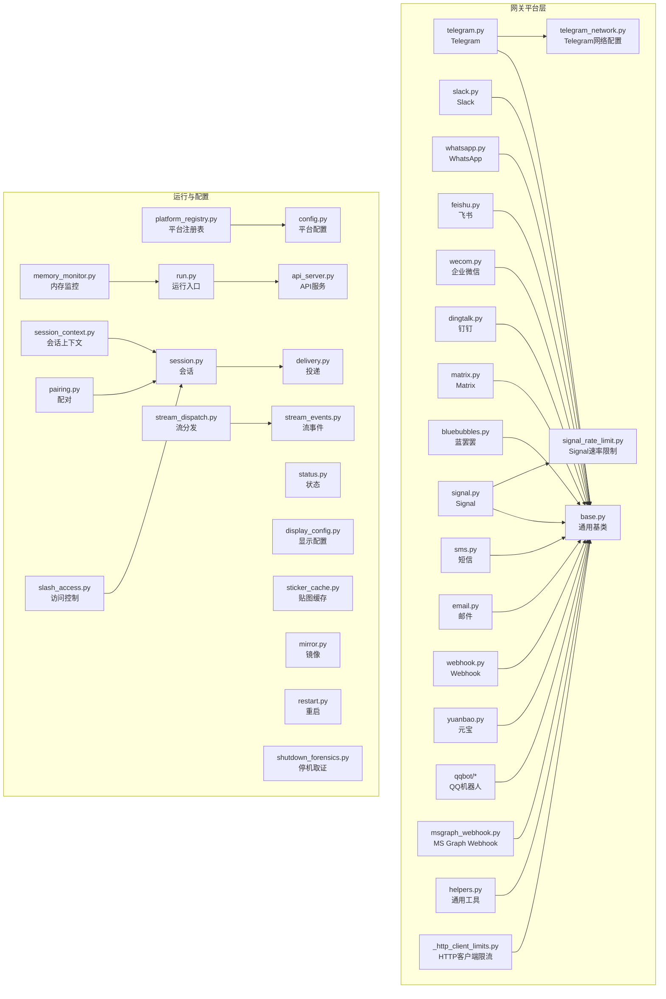
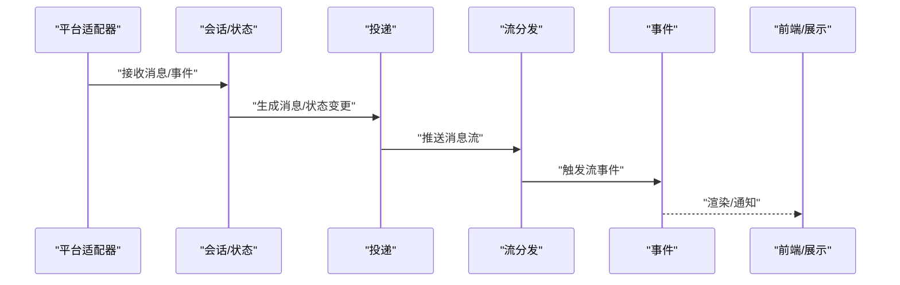
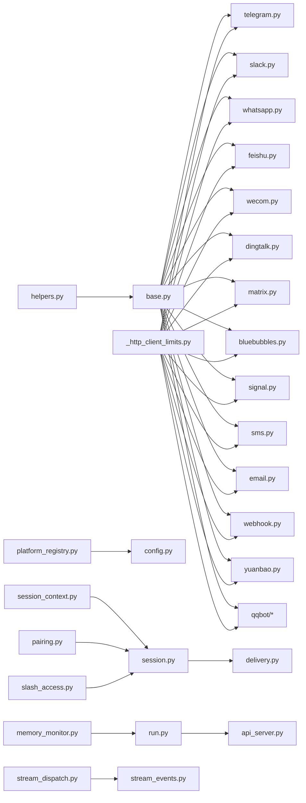

# 支持的平台

<cite>
**本文引用的文件**
- [gateway/platforms/telegram.py](file://gateway/platforms/telegram.py)
- [gateway/platforms/slack.py](file://gateway/platforms/slack.py)
- [gateway/platforms/whatsapp.py](file://gateway/platforms/whatsapp.py)
- [gateway/platforms/base.py](file://gateway/platforms/base.py)
- [gateway/platforms/helpers.py](file://gateway/platforms/helpers.py)
- [gateway/platforms/_http_client_limits.py](file://gateway/platforms/_http_client_limits.py)
- [gateway/platforms/telegram_network.py](file://gateway/platforms/telegram_network.py)
- [gateway/platforms/signal_rate_limit.py](file://gateway/platforms/signal_rate_limit.py)
- [gateway/platforms/msgraph_webhook.py](file://gateway/platforms/msgraph_webhook.py)
- [gateway/platforms/email.py](file://gateway/platforms/email.py)
- [gateway/platforms/webhook.py](file://gateway/platforms/webhook.py)
- [gateway/platforms/dingtalk.py](file://gateway/platforms/dingtalk.py)
- [gateway/platforms/feishu.py](file://gateway/platforms/feishu.py)
- [gateway/platforms/wecom.py](file://gateway/platforms/wecom.py)
- [gateway/platforms/matrix.py](file://gateway/platforms/matrix.py)
- [gateway/platforms/bluebubbles.py](file://gateway/platforms/bluebubbles.py)
- [gateway/platforms/signal.py](file://gateway/platforms/signal.py)
- [gateway/platforms/sms.py](file://gateway/platforms/sms.py)
- [gateway/platforms/yuanbao.py](file://gateway/platforms/yuanbao.py)
- [gateway/platforms/yuanbao_media.py](file://gateway/platforms/yuanbao_media.py)
- [gateway/platforms/yuanbao_proto.py](file://gateway/platforms/yuanbao_proto.py)
- [gateway/platforms/yuanbao_sticker.py](file://gateway/platforms/yuanbao_sticker.py)
- [gateway/platforms/qqbot/__init__.py](file://gateway/platforms/qqbot/__init__.py)
- [gateway/platforms/qqbot/adapter.py](file://gateway/platforms/qqbot/adapter.py)
- [gateway/platforms/qqbot/constants.py](file://gateway/platforms/qqbot/constants.py)
- [gateway/platforms/qqbot/crypto.py](file://gateway/platforms/qqbot/crypto.py)
- [gateway/platforms/qqbot/keyboards.py](file://gateway/platforms/qqbot/keyboards.py)
- [gateway/platforms/qqbot/onboard.py](file://gateway/platforms/qqbot/onboard.py)
- [gateway/platforms/qqbot/utils.py](file://gateway/platforms/qqbot/utils.py)
- [gateway/platforms/feishu_comment.py](file://gateway/platforms/feishu_comment.py)
- [gateway/platforms/feishu_comment_rules.py](file://gateway/platforms/feishu_comment_rules.py)
- [gateway/platforms/feishu_meeting_invite.py](file://gateway/platforms/feishu_meeting_invite.py)
- [gateway/platforms/wecom_callback.py](file://gateway/platforms/wecom_callback.py)
- [gateway/platforms/wecom_crypto.py](file://gateway/platforms/wecom_crypto.py)
- [gateway/platforms/whatsapp_identity.py](file://gateway/platforms/whatsapp_identity.py)
- [gateway/platforms/api_server.py](file://gateway/platforms/api_server.py)
- [gateway/platforms/__init__.py](file://gateway/platforms/__init__.py)
- [gateway/platforms/ADDING_A_PLATFORM.md](file://gateway/platforms/ADDING_A_PLATFORM.md)
- [gateway/platforms/platform_registry.py](file://gateway/platforms/platform_registry.py)
- [gateway/platforms/session.py](file://gateway/platforms/session.py)
- [gateway/platforms/session_context.py](file://gateway/platforms/session_context.py)
- [gateway/platforms/delivery.py](file://gateway/platforms/delivery.py)
- [gateway/platforms/status.py](file://gateway/platforms/status.py)
- [gateway/platforms/display_config.py](file://gateway/platforms/display_config.py)
- [gateway/platforms/sticker_cache.py](file://gateway/platforms/sticker_cache.py)
- [gateway/platforms/stream_dispatch.py](file://gateway/platforms/stream_dispatch.py)
- [gateway/platforms/stream_events.py](file://gateway/platforms/stream_events.py)
- [gateway/platforms/mirror.py](file://gateway/platforms/mirror.py)
- [gateway/platforms/pairing.py](file://gateway/platforms/pairing.py)
- [gateway/platforms/restart.py](file://gateway/platforms/restart.py)
- [gateway/platforms/shutdown_forensics.py](file://gateway/platforms/shutdown_forensics.py)
- [gateway/platforms/slash_access.py](file://gateway/platforms/slash_access.py)
- [gateway/platforms/memory_monitor.py](file://gateway/platforms/memory_monitor.py)
- [gateway/platforms/run.py](file://gateway/platforms/run.py)
- [gateway/platforms/config.py](file://gateway/platforms/config.py)
- [gateway/platforms/hook.py](file://gateway/platforms/hook.py)
- [gateway/platforms/builtin_hooks/__init__.py](file://gateway/platforms/builtin_hooks/__init__.py)
- [gateway/platforms/assets/](file://gateway/platforms/assets/)
- [gateway/platforms/channel_directory.py](file://gateway/platforms/channel_directory.py)
- [gateway/platforms/stream_consumer.py](file://gateway/platforms/stream_consumer.py)
- [gateway/platforms/ws.py](file://gateway/platforms/ws.py)
- [gateway/platforms/transport.py](file://gateway/platforms/transport.py)
- [gateway/platforms/event_publisher.py](file://gateway/platforms/event_publisher.py)
- [gateway/platforms/entry.py](file://gateway/platforms/entry.py)
- [gateway/platforms/servers.py](file://gateway/platforms/servers.py)
- [gateway/platforms/protocol.py](file://gateway/platforms/protocol.py)
- [gateway/platforms/client.py](file://gateway/platforms/client.py)
- [gateway/platforms/workspace.py](file://gateway/platforms/workspace.py)
- [gateway/platforms/range_shift.py](file://gateway/platforms/range_shift.py)
- [gateway/platforms/reporter.py](file://gateway/platforms/reporter.py)
- [gateway/platforms/install.py](file://gateway/platforms/install.py)
- [gateway/platforms/manager.py](file://gateway/platforms/manager.py)
- [gateway/platforms/eventlog.py](file://gateway/platforms/eventlog.py)
- [gateway/platforms/lsp/__init__.py](file://gateway/platforms/lsp/__init__.py)
- [gateway/platforms/lsp/cli.py](file://gateway/platforms/lsp/cli.py)
- [gateway/platforms/lsp/client.py](file://gateway/platforms/lsp/client.py)
- [gateway/platforms/lsp/eventlog.py](file://gateway/platforms/lsp/eventlog.py)
- [gateway/platforms/lsp/install.py](file://gateway/platforms/lsp/install.py)
- [gateway/platforms/lsp/manager.py](file://gateway/platforms/lsp/manager.py)
- [gateway/platforms/lsp/protocol.py](file://gateway/platforms/lsp/protocol.py)
- [gateway/platforms/lsp/range_shift.py](file://gateway/platforms/lsp/range_shift.py)
- [gateway/platforms/lsp/reporter.py](file://gateway/platforms/lsp/reporter.py)
- [gateway/platforms/lsp/servers.py](file://gateway/platforms/lsp/servers.py)
- [gateway/platforms/lsp/workspace.py](file://gateway/platforms/lsp/workspace.py)
</cite>

## 目录
1. [简介](#简介)
2. [项目结构](#项目结构)
3. [核心组件](#核心组件)
4. [架构总览](#架构总览)
5. [详细组件分析](#详细组件分析)
6. [依赖关系分析](#依赖关系分析)
7. [性能考量](#性能考量)
8. [故障排查指南](#故障排查指南)
9. [结论](#结论)
10. [附录](#附录)

## 简介
本文件系统性梳理 Hermes Agent 支持的通信与协作平台，覆盖 Telegram、Discord（通过插件）、Slack、WhatsApp、微信企业微信、飞书、钉钉、Signal、Matrix、蓝罢罢（Bluebubbles）、短信（SMS）以及 Webhook 等。内容包括消息格式约定、媒体支持、用户认证与权限控制、平台特定限制与速率限制、最佳实践、配置示例与集成步骤，并提供平台差异对比、选择建议与迁移指南，帮助用户在不同场景下做出合理决策。

## 项目结构
平台能力由网关模块统一管理，核心位于 gateway/platforms 目录，包含各平台适配器、通用基类、工具函数、速率限制与网络配置等。此外，插件体系提供 Discord 等平台的扩展支持；内置 Hook 提供运行时行为扩展；LSP 子系统用于开发期协议支持。

图表来源
- [gateway/platforms/base.py](file://gateway/platforms/base.py)
- [gateway/platforms/telegram.py](file://gateway/platforms/telegram.py)
- [gateway/platforms/slack.py](file://gateway/platforms/slack.py)
- [gateway/platforms/whatsapp.py](file://gateway/platforms/whatsapp.py)
- [gateway/platforms/telegram_network.py](file://gateway/platforms/telegram_network.py)
- [gateway/platforms/signal_rate_limit.py](file://gateway/platforms/signal_rate_limit.py)
- [gateway/platforms/msgraph_webhook.py](file://gateway/platforms/msgraph_webhook.py)
- [gateway/platforms/email.py](file://gateway/platforms/email.py)
- [gateway/platforms/webhook.py](file://gateway/platforms/webhook.py)
- [gateway/platforms/feishu.py](file://gateway/platforms/feishu.py)
- [gateway/platforms/wecom.py](file://gateway/platforms/wecom.py)
- [gateway/platforms/dingtalk.py](file://gateway/platforms/dingtalk.py)
- [gateway/platforms/matrix.py](file://gateway/platforms/matrix.py)
- [gateway/platforms/bluebubbles.py](file://gateway/platforms/bluebubbles.py)
- [gateway/platforms/signal.py](file://gateway/platforms/signal.py)
- [gateway/platforms/sms.py](file://gateway/platforms/sms.py)
- [gateway/platforms/yuanbao.py](file://gateway/platforms/yuanbao.py)
- [gateway/platforms/qqbot/__init__.py](file://gateway/platforms/qqbot/__init__.py)
- [gateway/platforms/platform_registry.py](file://gateway/platforms/platform_registry.py)
- [gateway/platforms/config.py](file://gateway/platforms/config.py)
- [gateway/platforms/run.py](file://gateway/platforms/run.py)
- [gateway/platforms/api_server.py](file://gateway/platforms/api_server.py)
- [gateway/platforms/session.py](file://gateway/platforms/session.py)
- [gateway/platforms/session_context.py](file://gateway/platforms/session_context.py)
- [gateway/platforms/delivery.py](file://gateway/platforms/delivery.py)
- [gateway/platforms/status.py](file://gateway/platforms/status.py)
- [gateway/platforms/display_config.py](file://gateway/platforms/display_config.py)
- [gateway/platforms/sticker_cache.py](file://gateway/platforms/sticker_cache.py)
- [gateway/platforms/stream_dispatch.py](file://gateway/platforms/stream_dispatch.py)
- [gateway/platforms/stream_events.py](file://gateway/platforms/stream_events.py)
- [gateway/platforms/mirror.py](file://gateway/platforms/mirror.py)
- [gateway/platforms/pairing.py](file://gateway/platforms/pairing.py)
- [gateway/platforms/restart.py](file://gateway/platforms/restart.py)
- [gateway/platforms/shutdown_forensics.py](file://gateway/platforms/shutdown_forensics.py)
- [gateway/platforms/slash_access.py](file://gateway/platforms/slash_access.py)
- [gateway/platforms/memory_monitor.py](file://gateway/platforms/memory_monitor.py)

章节来源
- [gateway/platforms/__init__.py](file://gateway/platforms/__init__.py)
- [gateway/platforms/ADDING_A_PLATFORM.md](file://gateway/platforms/ADDING_A_PLATFORM.md)

## 核心组件
- 平台适配器：各平台独立实现，继承通用基类，负责消息收发、媒体处理、用户认证与权限控制。
- 通用基类与工具：提供统一接口、错误处理、消息格式转换、会话管理等。
- 运行与配置：平台注册表、配置加载、API 服务、会话与状态管理、流式分发与事件、镜像与配对、重启与停机取证、访问控制与内存监控。
- 插件与扩展：通过插件体系扩展 Discord 等平台能力；内置 Hook 提供运行时行为扩展；LSP 子系统提供开发期协议支持。

章节来源
- [gateway/platforms/base.py](file://gateway/platforms/base.py)
- [gateway/platforms/helpers.py](file://gateway/platforms/helpers.py)
- [gateway/platforms/platform_registry.py](file://gateway/platforms/platform_registry.py)
- [gateway/platforms/config.py](file://gateway/platforms/config.py)
- [gateway/platforms/api_server.py](file://gateway/platforms/api_server.py)
- [gateway/platforms/session.py](file://gateway/platforms/session.py)
- [gateway/platforms/session_context.py](file://gateway/platforms/session_context.py)
- [gateway/platforms/delivery.py](file://gateway/platforms/delivery.py)
- [gateway/platforms/status.py](file://gateway/platforms/status.py)
- [gateway/platforms/display_config.py](file://gateway/platforms/display_config.py)
- [gateway/platforms/sticker_cache.py](file://gateway/platforms/sticker_cache.py)
- [gateway/platforms/stream_dispatch.py](file://gateway/platforms/stream_dispatch.py)
- [gateway/platforms/stream_events.py](file://gateway/platforms/stream_events.py)
- [gateway/platforms/mirror.py](file://gateway/platforms/mirror.py)
- [gateway/platforms/pairing.py](file://gateway/platforms/pairing.py)
- [gateway/platforms/restart.py](file://gateway/platforms/restart.py)
- [gateway/platforms/shutdown_forensics.py](file://gateway/platforms/shutdown_forensics.py)
- [gateway/platforms/slash_access.py](file://gateway/platforms/slash_access.py)
- [gateway/platforms/memory_monitor.py](file://gateway/platforms/memory_monitor.py)

## 架构总览
平台适配器通过统一的基类接口与运行时框架交互，消息从平台进入后经会话与状态管理，再由投递与流式分发模块分发到下游处理单元或前端展示。配置与注册表确保平台能力可插拔、可扩展。

图表来源
- [gateway/platforms/session.py](file://gateway/platforms/session.py)
- [gateway/platforms/delivery.py](file://gateway/platforms/delivery.py)
- [gateway/platforms/stream_dispatch.py](file://gateway/platforms/stream_dispatch.py)
- [gateway/platforms/stream_events.py](file://gateway/platforms/stream_events.py)
- [gateway/platforms/api_server.py](file://gateway/platforms/api_server.py)

## 详细组件分析

### Telegram 平台
- 消息格式与媒体支持：支持文本、图片、视频、音频、文件等常见媒体类型；遵循 Telegram Bot API 的消息结构与附件上传机制。
- 用户认证与权限控制：通过 Bot Token 进行认证；权限控制基于会话与通道配置，支持白名单与角色授权。
- 速率限制与网络：内置网络配置模块以优化连接稳定性；遵循 Telegram API 的速率限制策略。
- 配置与集成：在平台配置中设置 Bot Token、Webhook 或轮询模式；启用会话与投递模块以完成消息闭环。
- 最佳实践：优先使用 Webhook 提升实时性；合理设置并发与重试；对媒体文件进行压缩与缓存。

章节来源
- [gateway/platforms/telegram.py](file://gateway/platforms/telegram.py)
- [gateway/platforms/telegram_network.py](file://gateway/platforms/telegram_network.py)
- [gateway/platforms/base.py](file://gateway/platforms/base.py)

### Slack 平台
- 消息格式与媒体支持：支持块级消息、富文本、文件上传与预览；与 Slack Block Kit 兼容。
- 用户认证与权限控制：OAuth 授权流程；基于 Workspace 与 Channel 权限进行访问控制。
- 速率限制：遵循 Slack API 的速率限制与队列策略；结合内置限流模块进行退避重试。
- 配置与集成：在平台配置中设置 OAuth 令牌与 Bot Token；启用交互式组件与事件订阅。
- 最佳实践：使用事件驱动模型减少轮询；对大文件采用预签名 URL；合理组织 Block 结构提升可读性。

章节来源
- [gateway/platforms/slack.py](file://gateway/platforms/slack.py)
- [gateway/platforms/base.py](file://gateway/platforms/base.py)

### WhatsApp 平台
- 消息格式与媒体支持：支持文本、图片、视频、音频、文档、位置、联系人等；遵循 WhatsApp Business API 规范。
- 用户认证与权限控制：通过 Meta App 与 Business API 凭据进行认证；权限控制基于 Phone Number ID 与账号层级。
- 速率限制与合规：严格遵守速率限制与内容政策；提供身份校验与消息追踪。
- 配置与集成：在平台配置中设置 API 密钥、Phone Number ID 与 Webhook；启用消息路由与模板回复。
- 最佳实践：使用模板消息提升合规性；对媒体文件进行压缩与 CDN 加速；建立消息回执与失败重试机制。

章节来源
- [gateway/platforms/whatsapp.py](file://gateway/platforms/whatsapp.py)
- [gateway/platforms/whatsapp_identity.py](file://gateway/platforms/whatsapp_identity.py)
- [gateway/platforms/base.py](file://gateway/platforms/base.py)

### 微信企业微信（WeCom）
- 消息格式与媒体支持：支持文本、图片、语音、视频、文件、图文卡片等；与企业微信应用与群聊接口兼容。
- 用户认证与权限控制：通过 CorpId/Secret 与应用凭证进行认证；权限控制基于部门与成员范围。
- 速率限制与安全：遵循企业微信 API 速率限制；内置加密与回调校验模块保障数据安全。
- 配置与集成：在平台配置中设置 CorpId、Secret、AgentId 与回调地址；启用消息同步与事件订阅。
- 最佳实践：使用加密回调与签名校验；对敏感信息进行脱敏处理；合理规划消息发送频率。

章节来源
- [gateway/platforms/wecom.py](file://gateway/platforms/wecom.py)
- [gateway/platforms/wecom_callback.py](file://gateway/platforms/wecom_callback.py)
- [gateway/platforms/wecom_crypto.py](file://gateway/platforms/wecom_crypto.py)
- [gateway/platforms/base.py](file://gateway/platforms/base.py)

### 飞书（Feishu）
- 消息格式与媒体支持：支持富文本、表格、图片、文件、互动卡片等；与飞书开放平台接口兼容。
- 用户认证与权限控制：通过 App ID/Secret 与应用凭证进行认证；权限控制基于租户与应用范围。
- 速率限制与评论规则：内置评论与会议邀请专用模块，遵循飞书 API 速率限制与业务规则。
- 配置与集成：在平台配置中设置 App ID/Secret、App Type 与事件订阅；启用评论与会议邀请能力。
- 最佳实践：使用事件驱动模型；对评论与会议邀请进行幂等处理；合理组织卡片结构。

章节来源
- [gateway/platforms/feishu.py](file://gateway/platforms/feishu.py)
- [gateway/platforms/feishu_comment.py](file://gateway/platforms/feishu_comment.py)
- [gateway/platforms/feishu_comment_rules.py](file://gateway/platforms/feishu_comment_rules.py)
- [gateway/platforms/feishu_meeting_invite.py](file://gateway/platforms/feishu_meeting_invite.py)
- [gateway/platforms/base.py](file://gateway/platforms/base.py)

### 钉钉（DingTalk）
- 消息格式与媒体支持：支持文本、图片、富文本、文件等；与钉钉开放平台接口兼容。
- 用户认证与权限控制：通过 AppKey/AppSecret 与应用凭证进行认证；权限控制基于企业与部门范围。
- 速率限制与集成：遵循钉钉 API 速率限制；提供事件订阅与消息投递能力。
- 配置与集成：在平台配置中设置 AppKey/AppSecret、AgentId 与回调地址；启用消息同步与事件处理。
- 最佳实践：使用事件驱动减少轮询；对大文件采用预签名 URL；合理规划消息发送频率。

章节来源
- [gateway/platforms/dingtalk.py](file://gateway/platforms/dingtalk.py)
- [gateway/platforms/base.py](file://gateway/platforms/base.py)

### Signal 平台
- 消息格式与媒体支持：支持文本、图片、视频、音频、文件等；遵循 Signal 协议与附件规范。
- 用户认证与权限控制：通过 Signal 账号凭据进行认证；权限控制基于设备与联系人列表。
- 速率限制与网络：内置速率限制模块以应对 API 限流；优化网络连接与重连策略。
- 配置与集成：在平台配置中设置账号凭据与设备参数；启用消息同步与事件订阅。
- 最佳实践：使用本地缓存与增量同步；对媒体文件进行压缩与加密存储。

章节来源
- [gateway/platforms/signal.py](file://gateway/platforms/signal.py)
- [gateway/platforms/signal_rate_limit.py](file://gateway/platforms/signal_rate_limit.py)
- [gateway/platforms/base.py](file://gateway/platforms/base.py)

### Matrix 平台
- 消息格式与媒体支持：支持文本、图片、视频、音频、文件等；与 Matrix 客户端协议兼容。
- 用户认证与权限控制：通过访问令牌或用户名密码进行认证；权限控制基于房间与用户权限。
- 速率限制与网络：遵循 Matrix API 速率限制；优化同步与轮询策略。
- 配置与集成：在平台配置中设置 homeserver、访问令牌与房间映射；启用事件订阅与消息转发。
- 最佳实践：使用增量同步减少带宽；对媒体文件进行压缩与缓存。

章节来源
- [gateway/platforms/matrix.py](file://gateway/platforms/matrix.py)
- [gateway/platforms/base.py](file://gateway/platforms/base.py)

### 蓝罢罢（Bluebubbles）
- 消息格式与媒体支持：支持文本、图片、视频、音频、文件等；与 iOS/macOS 系统消息生态集成。
- 用户认证与权限控制：通过系统账户与设备授权进行认证；权限控制基于设备与联系人范围。
- 速率限制与网络：遵循系统消息 API 速率限制；优化网络连接与同步策略。
- 配置与集成：在平台配置中设置设备凭据与同步参数；启用消息同步与事件订阅。
- 最佳实践：使用增量同步与本地缓存；对媒体文件进行压缩与加密存储。

章节来源
- [gateway/platforms/bluebubbles.py](file://gateway/platforms/bluebubbles.py)
- [gateway/platforms/base.py](file://gateway/platforms/base.py)

### 短信（SMS）
- 消息格式与媒体支持：支持文本与二进制短信；部分提供商支持多媒体短信（MMS）。
- 用户认证与权限控制：通过短信提供商 API 凭据进行认证；权限控制基于账户与套餐。
- 速率限制与网络：遵循短信提供商 API 速率限制；优化发送队列与重试策略。
- 配置与集成：在平台配置中设置短信提供商凭据与号码映射；启用发送与回执处理。
- 最佳实践：使用模板短信提升合规性；对长短信进行拆分与合并；建立发送回执与失败重试机制。

章节来源
- [gateway/platforms/sms.py](file://gateway/platforms/sms.py)
- [gateway/platforms/base.py](file://gateway/platforms/base.py)

### 邮件（Email）
- 消息格式与媒体支持：支持 HTML/纯文本、附件、内联资源等；与 SMTP/IMAP/POP3 协议兼容。
- 用户认证与权限控制：通过邮箱凭据或 OAuth 进行认证；权限控制基于邮箱域与账户范围。
- 速率限制与网络：遵循邮箱服务商 API 速率限制；优化收发与同步策略。
- 配置与集成：在平台配置中设置 SMTP/IMAP/POP3 参数与凭据；启用收发与事件订阅。
- 最佳实践：使用模板与批量发送；对附件进行压缩与安全扫描；建立发送回执与失败重试机制。

章节来源
- [gateway/platforms/email.py](file://gateway/platforms/email.py)
- [gateway/platforms/base.py](file://gateway/platforms/base.py)

### Webhook
- 消息格式与媒体支持：支持任意 JSON/Payload；可对接第三方系统与自定义协议。
- 用户认证与权限控制：通过签名、Token 或证书进行认证；权限控制基于来源 IP 与签名验证。
- 速率限制与网络：遵循目标系统 API 速率限制；优化并发与重试策略。
- 配置与集成：在平台配置中设置目标 URL、认证方式与事件映射；启用接收与转发。
- 最佳实践：使用幂等处理与去重；对敏感数据进行脱敏；建立健康检查与告警。

章节来源
- [gateway/platforms/webhook.py](file://gateway/platforms/webhook.py)
- [gateway/platforms/base.py](file://gateway/platforms/base.py)

### 元宝（Yuanbao）
- 消息格式与媒体支持：支持文本、图片、表情包、贴图等；与元宝协议与媒体系统兼容。
- 用户认证与权限控制：通过元宝 API 凭据进行认证；权限控制基于账号与空间范围。
- 速率限制与网络：遵循元宝 API 速率限制；优化媒体上传与缓存策略。
- 配置与集成：在平台配置中设置元宝凭据与空间参数；启用消息同步与媒体处理。
- 最佳实践：使用贴图缓存与 CDN 加速；对媒体文件进行压缩与格式转换；建立媒体生命周期管理。

章节来源
- [gateway/platforms/yuanbao.py](file://gateway/platforms/yuanbao.py)
- [gateway/platforms/yuanbao_media.py](file://gateway/platforms/yuanbao_media.py)
- [gateway/platforms/yuanbao_proto.py](file://gateway/platforms/yuanbao_proto.py)
- [gateway/platforms/yuanbao_sticker.py](file://gateway/platforms/yuanbao_sticker.py)
- [gateway/platforms/base.py](file://gateway/platforms/base.py)

### QQ 机器人（QQBot）
- 消息格式与媒体支持：支持文本、图片、语音、视频、文件等；与 QQ 开放平台接口兼容。
- 用户认证与权限控制：通过 QQ App 凭据进行认证；权限控制基于群组与好友范围。
- 速率限制与网络：遵循 QQ API 速率限制；优化网络连接与重连策略。
- 配置与集成：在平台配置中设置 App 凭据与事件订阅；启用消息同步与键盘交互。
- 最佳实践：使用增量同步与本地缓存；对媒体文件进行压缩与加密存储；建立消息回执与失败重试机制。

章节来源
- [gateway/platforms/qqbot/__init__.py](file://gateway/platforms/qqbot/__init__.py)
- [gateway/platforms/qqbot/adapter.py](file://gateway/platforms/qqbot/adapter.py)
- [gateway/platforms/qqbot/constants.py](file://gateway/platforms/qqbot/constants.py)
- [gateway/platforms/qqbot/crypto.py](file://gateway/platforms/qqbot/crypto.py)
- [gateway/platforms/qqbot/keyboards.py](file://gateway/platforms/qqbot/keyboards.py)
- [gateway/platforms/qqbot/onboard.py](file://gateway/platforms/qqbot/onboard.py)
- [gateway/platforms/qqbot/utils.py](file://gateway/platforms/qqbot/utils.py)
- [gateway/platforms/base.py](file://gateway/platforms/base.py)

### 添加新平台指南
新增平台需遵循统一适配器规范，继承通用基类，实现消息收发、媒体处理、认证与权限控制，并通过平台注册表注册。参考添加平台文档以确保一致性与可维护性。

章节来源
- [gateway/platforms/ADDING_A_PLATFORM.md](file://gateway/platforms/ADDING_A_PLATFORM.md)
- [gateway/platforms/platform_registry.py](file://gateway/platforms/platform_registry.py)
- [gateway/platforms/base.py](file://gateway/platforms/base.py)

## 依赖关系分析
平台适配器之间低耦合，通过通用基类与运行时框架解耦；HTTP 客户端限流与网络配置模块为各平台提供统一的网络与限流能力；会话、状态、投递与流式分发模块贯穿所有平台，形成统一的数据通路。

图表来源
- [gateway/platforms/base.py](file://gateway/platforms/base.py)
- [gateway/platforms/_http_client_limits.py](file://gateway/platforms/_http_client_limits.py)
- [gateway/platforms/helpers.py](file://gateway/platforms/helpers.py)
- [gateway/platforms/platform_registry.py](file://gateway/platforms/platform_registry.py)
- [gateway/platforms/config.py](file://gateway/platforms/config.py)
- [gateway/platforms/run.py](file://gateway/platforms/run.py)
- [gateway/platforms/api_server.py](file://gateway/platforms/api_server.py)
- [gateway/platforms/session.py](file://gateway/platforms/session.py)
- [gateway/platforms/session_context.py](file://gateway/platforms/session_context.py)
- [gateway/platforms/delivery.py](file://gateway/platforms/delivery.py)
- [gateway/platforms/stream_dispatch.py](file://gateway/platforms/stream_dispatch.py)
- [gateway/platforms/stream_events.py](file://gateway/platforms/stream_events.py)
- [gateway/platforms/pairing.py](file://gateway/platforms/pairing.py)
- [gateway/platforms/slash_access.py](file://gateway/platforms/slash_access.py)
- [gateway/platforms/memory_monitor.py](file://gateway/platforms/memory_monitor.py)

## 性能考量
- 速率限制与退避：各平台均内置或依赖限流模块，应结合平台 API 限制策略进行退避重试与并发控制。
- 媒体优化：对图片、视频、音频等媒体进行压缩与缓存，必要时使用 CDN 加速。
- 事件驱动：优先采用事件订阅而非轮询，降低延迟与带宽消耗。
- 会话与状态：合理设计会话与状态持久化，避免重复计算与数据不一致。
- 网络与连接：优化连接池、超时与重连策略，提升稳定性与可用性。

## 故障排查指南
- 认证失败：检查平台凭据是否正确、过期或权限不足；确认回调地址与签名验证是否生效。
- 速率限制：观察限流日志与退避策略，调整并发与重试间隔；必要时升级套餐或使用多账号分摊。
- 媒体上传失败：检查文件大小、格式与存储配额；对大文件采用分片上传或预签名 URL。
- 事件丢失：启用幂等处理与去重机制；对关键事件建立回执与重放机制。
- 网络异常：检查代理、防火墙与 DNS 设置；优化连接池与超时参数。

章节来源
- [gateway/platforms/signal_rate_limit.py](file://gateway/platforms/signal_rate_limit.py)
- [gateway/platforms/_http_client_limits.py](file://gateway/platforms/_http_client_limits.py)
- [gateway/platforms/telegram_network.py](file://gateway/platforms/telegram_network.py)
- [gateway/platforms/wecom_callback.py](file://gateway/platforms/wecom_callback.py)
- [gateway/platforms/wecom_crypto.py](file://gateway/platforms/wecom_crypto.py)
- [gateway/platforms/whatsapp_identity.py](file://gateway/platforms/whatsapp_identity.py)

## 结论
Hermes Agent 的平台支持体系以统一基类与运行时框架为核心，通过插件与扩展实现对主流通信平台的灵活接入。在实际部署中，应根据业务场景选择合适的平台，结合认证、权限、速率限制与媒体策略制定最佳实践，并通过配置与集成步骤快速落地。

## 附录
- 平台差异对比与选择建议：根据消息格式、媒体支持、认证方式、速率限制与合规要求进行权衡；优先选择与业务生态契合且具备稳定 API 的平台。
- 迁移指南：在保持会话与状态兼容的前提下，逐步替换平台适配器；对媒体与事件进行映射与迁移；在灰度环境中验证迁移效果。