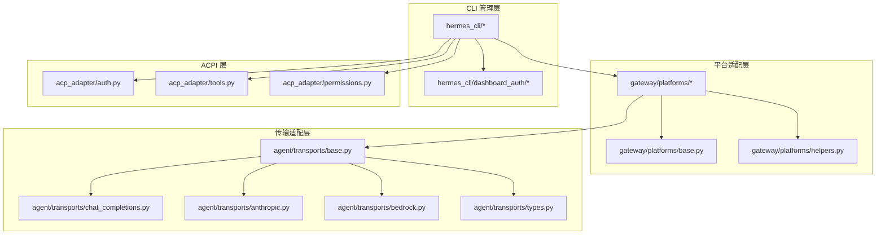
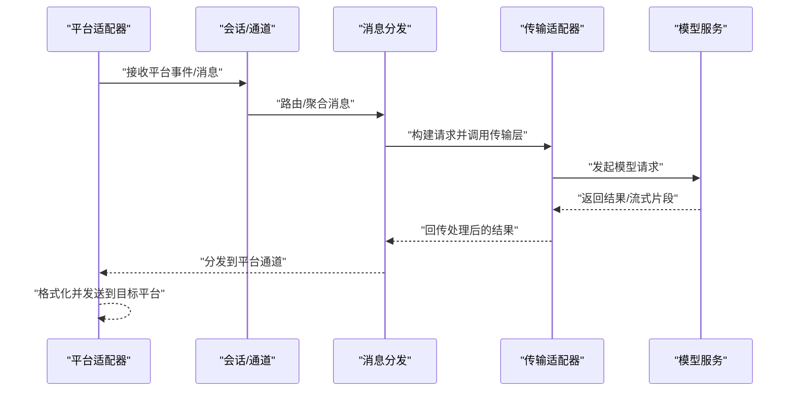
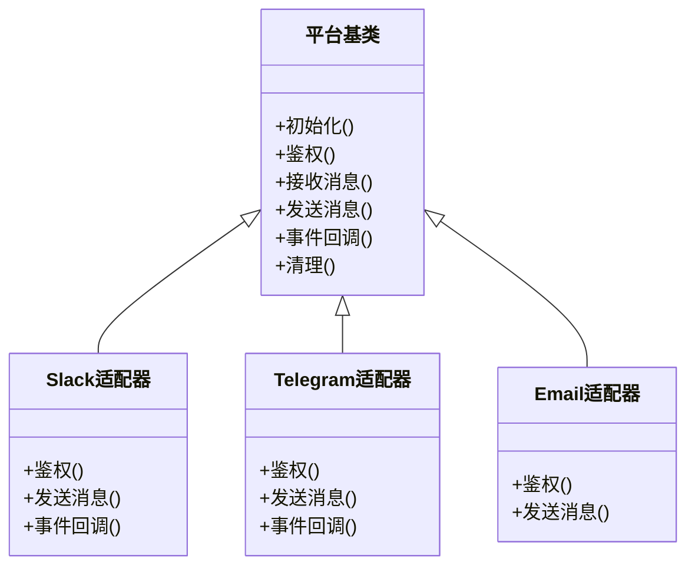
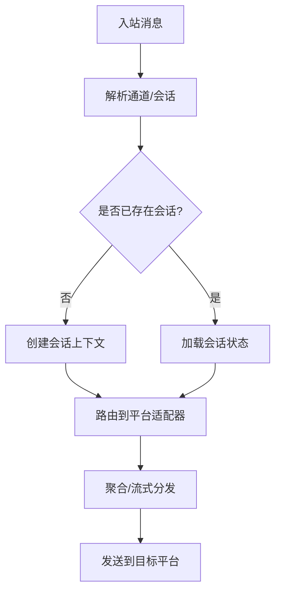
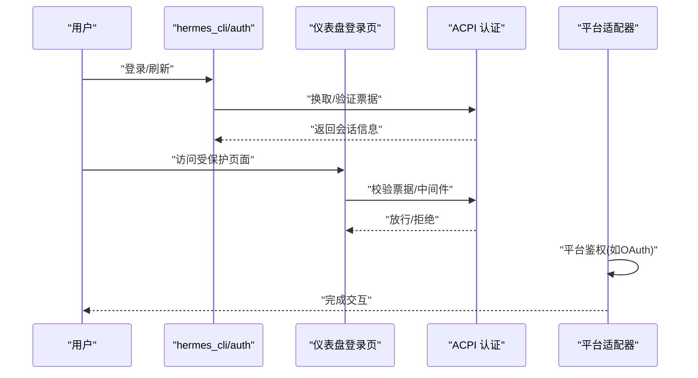
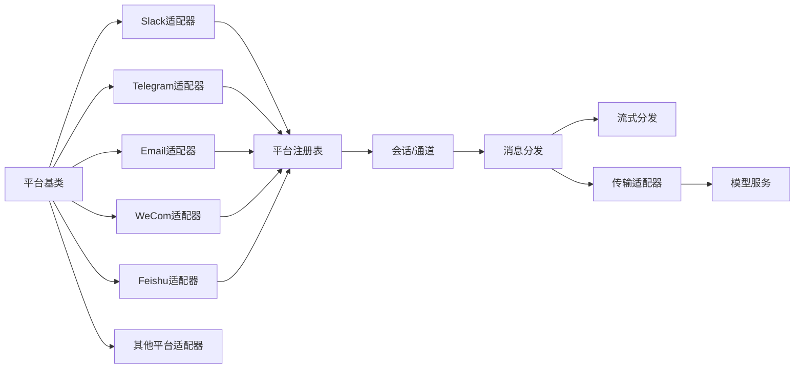

# 通信平台系统

<cite>
**本文引用的文件**
- [README.md](file://README.md)
- [gateway/platforms/base.py](file://gateway/platforms/base.py)
- [gateway/platforms/__init__.py](file://gateway/platforms/__init__.py)
- [gateway/platforms/api_server.py](file://gateway/platforms/api_server.py)
- [gateway/platforms/helpers.py](file://gateway/platforms/helpers.py)
- [gateway/platforms/_http_client_limits.py](file://gateway/platforms/_http_client_limits.py)
- [gateway/platforms/slack.py](file://gateway/platforms/slack.py)
- [gateway/platforms/telegram.py](file://gateway/platforms/telegram.py)
- [gateway/platforms/email.py](file://gateway/platforms/email.py)
- [gateway/platforms/wecom.py](file://gateway/platforms/wecom.py)
- [gateway/platforms/weixin.py](file://gateway/platforms/weixin.py)
- [gateway/platforms/matrix.py](file://gateway/platforms/matrix.py)
- [gateway/platforms/signal.py](file://gateway/platforms/signal.py)
- [gateway/platforms/whatsapp.py](file://gateway/platforms/whatsapp.py)
- [gateway/platforms/dingtalk.py](file://gateway/platforms/dingtalk.py)
- [gateway/platforms/feishu.py](file://gateway/platforms/feishu.py)
- [gateway/platforms/bluebubbles.py](file://gateway/platforms/bluebubbles.py)
- [gateway/platforms/msgraph_webhook.py](file://gateway/platforms/msgraph_webhook.py)
- [gateway/platforms/webhook.py](file://gateway/platforms/webhook.py)
- [gateway/platforms/yuanbao.py](file://gateway/platforms/yuanbao.py)
- [gateway/platforms/yuanbao_media.py](file://gateway/platforms/yuanbao_media.py)
- [gateway/platforms/yuanbao_proto.py](file://gateway/platforms/yuanbao_proto.py)
- [gateway/platforms/yuanbao_sticker.py](file://gateway/platforms/yuanbao_sticker.py)
- [gateway/platforms/qqbot/](file://gateway/platforms/qqbot/)
- [gateway/platforms/ADDING_A_PLATFORM.md](file://gateway/platforms/ADDING_A_PLATFORM.md)
- [gateway/platform_registry.py](file://gateway/platform_registry.py)
- [gateway/session.py](file://gateway/session.py)
- [gateway/channel_directory.py](file://gateway/channel_directory.py)
- [gateway/delivery.py](file://gateway/delivery.py)
- [gateway/stream_dispatch.py](file://gateway/stream_dispatch.py)
- [gateway/stream_events.py](file://gateway/stream_events.py)
- [gateway/pairing.py](file://gateway/pairing.py)
- [gateway/status.py](file://gateway/status.py)
- [gateway/config.py](file://gateway/config.py)
- [acp_adapter/auth.py](file://acp_adapter/auth.py)
- [acp_adapter/server.py](file://acp_adapter/server.py)
- [acp_adapter/session.py](file://acp_adapter/session.py)
- [acp_adapter/events.py](file://acp_adapter/events.py)
- [acp_adapter/tools.py](file://acp_adapter/tools.py)
- [acp_adapter/edit_approval.py](file://acp_adapter/edit_approval.py)
- [acp_adapter/permissions.py](file://acp_adapter/permissions.py)
- [acp_adapter/entry.py](file://acp_adapter/entry.py)
- [acp_registry/agent.json](file://acp_registry/agent.json)
- [agent/transports/base.py](file://agent/transports/base.py)
- [agent/transports/chat_completions.py](file://agent/transports/chat_completions.py)
- [agent/transports/codex.py](file://agent/transports/codex.py)
- [agent/transports/anthropic.py](file://agent/transports/anthropic.py)
- [agent/transports/bedrock.py](file://agent/transports/bedrock.py)
- [agent/transports/hermes_tools_mcp_server.py](file://agent/transports/hermes_tools_mcp_server.py)
- [agent/transports/types.py](file://agent/transports/types.py)
- [agent/azure_identity_adapter.py](file://agent/azure_identity_adapter.py)
- [agent/google_oauth.py](file://agent/google_oauth.py)
- [agent/gemini_native_adapter.py](file://agent/gemini_native_adapter.py)
- [agent/gemini_cloudcode_adapter.py](file://agent/gemini_cloudcode_adapter.py)
- [agent/credential_sources.py](file://agent/credential_sources.py)
- [agent/credential_pool.py](file://agent/credential_pool.py)
- [agent/credential_persistence.py](file://agent/credential_persistence.py)
- [hermes_cli/platforms.py](file://hermes_cli/platforms.py)
- [hermes_cli/dashboard_auth/registry.py](file://hermes_cli/dashboard_auth/registry.py)
- [hermes_cli/dashboard_auth/routes.py](file://hermes_cli/dashboard_auth/routes.py)
- [hermes_cli/dashboard_auth/ws_tickets.py](file://hermes_cli/dashboard_auth/ws_tickets.py)
- [hermes_cli/dashboard_auth/public_paths.py](file://hermes_cli/dashboard_auth/public_paths.py)
- [hermes_cli/dashboard_auth/middleware.py](file://hermes_cli/dashboard_auth/middleware.py)
- [hermes_cli/dashboard_auth/cookies.py](file://hermes_cli/dashboard_auth/cookies.py)
- [hermes_cli/dashboard_auth/audit.py](file://hermes_cli/dashboard_auth/audit.py)
- [hermes_cli/dashboard_auth/base.py](file://hermes_cli/dashboard_auth/base.py)
- [hermes_cli/dashboard_auth/prefix.py](file://hermes_cli/dashboard_auth/prefix.py)
- [hermes_cli/dashboard_auth/login_page.py](file://hermes_cli/dashboard_auth/login_page.py)
- [hermes_cli/auth.py](file://hermes_cli/auth.py)
- [hermes_cli/auth_commands.py](file://hermes_cli/auth_commands.py)
- [hermes_cli/web_server.py](file://hermes_cli/web_server.py)
- [hermes_cli/proxy/server.py](file://hermes_cli/proxy/server.py)
- [hermes_cli/proxy/adapters/](file://hermes_cli/proxy/adapters/)
- [hermes_cli/commands.py](file://hermes_cli/commands.py)
- [hermes_cli/config.py](file://hermes_cli/config.py)
- [hermes_cli/status.py](file://hermes_cli/status.py)
- [hermes_cli/browser_connect.py](file://hermes_cli/browser_connect.py)
- [hermes_cli/backup.py](file://hermes_cli/backup.py)
- [hermes_cli/doctor.py](file://hermes_cli/doctor.py)
- [hermes_cli/hooks.py](file://hermes_cli/hooks.py)
- [hermes_cli/plugins.py](file://hermes_cli/plugins.py)
- [hermes_cli/models.py](file://hermes_cli/models.py)
- [hermes_cli/tools_config.py](file://hermes_cli/tools_config.py)
- [hermes_cli/skills_config.py](file://hermes_cli/skills_config.py)
- [hermes_cli/memory_setup.py](file://hermes_cli/memory_setup.py)
- [hermes_cli/security_audit.py](file://hermes_cli/security_audit.py)
- [hermes_cli/security_advisories.py](file://hermes_cli/security_advisories.py)
- [hermes_cli/timeouts.py](file://hermes_cli/timeouts.py)
- [hermes_cli/webhook.py](file://hermes_cli/webhook.py)
- [hermes_cli/middleware.py](file://hermes_cli/middleware.py)
- [hermes_cli/managed_uv.py](file://hermes_cli/managed_uv.py)
- [hermes_cli/runtime_provider.py](file://hermes_cli/runtime_provider.py)
- [hermes_cli/service_manager.py](file://hermes_cli/service_manager.py)
- [hermes_cli/setup.py](file://hermes_cli/setup.py)
- [hermes_cli/uninstall.py](file://hermes_cli/uninstall.py)
- [hermes_cli/relaunch.py](file://hermes_cli/relaunch.py)
- [hermes_cli/psutil_android.py](file://hermes_cli/psutil_android.py)
- [hermes_cli/xai_retirement.py](file://hermes_cli/xai_retirement.py)
- [hermes_cli/azure_detect.py](file://hermes_cli/azure_detect.py)
- [hermes_cli/copilot_auth.py](file://hermes_cli/copilot_auth.py)
- [hermes_cli/dingtalk_auth.py](file://hermes_cli/dingtalk_auth.py)
- [hermes_cli/telegram_managed_bot.py](file://hermes_cli/telegram_managed_bot.py)
- [hermes_cli/gateway_windows.py](file://hermes_cli/gateway_windows.py)
- [hermes_cli/mcp_startup.py](file://hermes_cli/mcp_startup.py)
- [hermes_cli/mcp_config.py](file://hermes_cli/mcp_config.py)
- [hermes_cli/mcp_picker.py](file://hermes_cli/mcp_picker.py)
- [hermes_cli/mcp_catalog.py](file://hermes_cli/mcp_catalog.py)
- [hermes_cli/codex_runtime_switch.py](file://hermes_cli/codex_runtime_switch.py)
- [hermes_cli/codex_runtime_plugin_migration.py](file://hermes_cli/codex_runtime_plugin_migration.py)
- [hermes_cli/codex_models.py](file://hermes_cli/codex_models.py)
- [hermes_cli/model_switch.py](file://hermes_cli/model_switch.py)
- [hermes_cli/model_normalize.py](file://hermes_cli/model_normalize.py)
- [hermes_cli/model_catalog.py](file://hermes_cli/model_catalog.py)
- [hermes_cli/providers.py](file://hermes_cli/providers.py)
- [hermes_cli/profiles.py](file://hermes_cli/profiles.py)
- [hermes_cli/profile_describer.py](file://hermes_cli/profile_describer.py)
- [hermes_cli/profile_distribution.py](file://hermes_cli/profile_distribution.py)
- [hermes_cli/inventory.py](file://hermes_cli/inventory.py)
- [hermes_cli/kanban.py](file://hermes_cli/kanban.py)
- [hermes_cli/kanban_db.py](file://hermes_cli/kanban_db.py)
- [hermes_cli/kanban_decompose.py](file://hermes_cli/kanban_decompose.py)
- [hermes_cli/kanban_diagnostics.py](file://hermes_cli/kanban_diagnostics.py)
- [hermes_cli/kanban_specify.py](file://hermes_cli/kanban_specify.py)
- [hermes_cli/kanban_swarm.py](file://hermes_cli/kanban_swarm.py)
- [hermes_cli/portal_cli.py](file://hermes_cli/portal_cli.py)
- [hermes_cli/session_recap.py](file://hermes_cli/session_recap.py)
- [hermes_cli/timeout.py](file://hermes_cli/timeout.py)
- [hermes_cli/timeout.py](file://hermes_cli/timeout.py)
- [hermes_cli/timeout.py](file://hermes_cli/timeout.py)
- [hermes_cli/timeout.py](file://hermes_cli/timeout.py)
- [hermes_cli/timeout.py](file://hermes_cli/timeout.py)
- [hermes_cli/timeout.py](file://hermes_cli/timeout.py)
- [hermes_cli/timeout.py](file://hermes_cli/timeout.py)
- [hermes_cli/timeout.py](file://hermes_cli/timeout.py)
- [hermes_cli/timeout.py](file://hermes_cli/timeout.py)
- [hermes_cli/timeout.py](file://hermes_cli/timeout.py)
- [hermes_cli/timeout.py](file://hermes_cli/timeout.py)
- [hermes_cli/timeout.py](file://hermes_cli/timeout.py)
- [hermes_cli/timeout.py](file://hermes_cli/timeout.py)
- [hermes_cli/timeout.py](file://hermes_cli/timeout.py)
- [hermes_cli/timeout.py](file://hermes_cli/timeout.py)
- [hermes_cli/timeout.py](file://hermes_cli/timeout.py)
- [hermes_cli/timeout.py](file://hermes_cli/timeout.py)
- [hermes_cli/timeout.py](file://hermes_cli/timeout.py)
- [hermes_cli/timeout.py](file://hermes_cli/timeout.py)
- [hermes_cli/timeout.py](file://hermes_cli/timeout.py)
- [hermes_cli/timeout.py](file://hermes_cli/timeout.py)
- [hermes_cli/timeout.py](file://hermes_cli/timeout.py)
- [hermes_cli/timeout.py](file://hermes_cli/timeout.py)
- [hermes_cli/timeout.py](file://hermes_cli/timeout.py)
- [hermes_cli/timeout.py](file://hermes_cli/timeout.py)
- [hermes_cli/timeout.py](file://hermes_cli/timeout.py)
- [hermes_cli/timeout.py](file://hermes_cli/timeout.py)
- [hermes_cli/timeout.py](file://hermes_cli/timeout.py)
- [hermes......]
</cite>

## 目录
1. [简介](#简介)
2. [项目结构](#项目结构)
3. [核心组件](#核心组件)
4. [架构总览](#架构总览)
5. [详细组件分析](#详细组件分析)
6. [依赖关系分析](#依赖关系分析)
7. [性能考量](#性能考量)
8. [故障排除指南](#故障排除指南)
9. [结论](#结论)
10. [附录](#附录)

## 简介
本文件面向平台开发者与集成用户，系统性阐述 Hermes Agent 通信平台系统的架构设计、消息路由机制与身份验证流程。文档覆盖平台适配器模式、消息分发与会话管理、认证与授权、平台清单与扩展方法，并提供安全、性能与可维护性的最佳实践。

## 项目结构
Hermes 将“平台”抽象为统一的适配器，通过网关模块集中接入多渠道（IM、邮件、Webhook 等），并通过传输层适配不同模型服务提供商。CLI 提供配置、认证、插件与运行时管理能力；ACPI 账户控制代理提供权限与工具治理。

- 平台适配层：gateway/platforms 下按平台拆分实现，共享基类与通用辅助工具
- 传输适配层：agent/transports 下对接不同模型服务（如 Anthropic、Bedrock、Chat Completions 等）
- CLI 管理层：hermes_cli 下提供认证、配置、状态、插件等命令
- ACPI 层：acp_adapter 提供认证、事件、工具与权限治理
- 注册与运行：platform_registry、session、channel_directory、delivery、stream_* 等协调消息流转

图表来源
- [gateway/platforms/base.py](file://gateway/platforms/base.py)
- [gateway/platforms/helpers.py](file://gateway/platforms/helpers.py)
- [agent/transports/base.py](file://agent/transports/base.py)
- [agent/transports/chat_completions.py](file://agent/transports/chat_completions.py)
- [agent/transports/anthropic.py](file://agent/transports/anthropic.py)
- [agent/transports/bedrock.py](file://agent/transports/bedrock.py)
- [agent/transports/types.py](file://agent/transports/types.py)
- [hermes_cli/dashboard_auth/registry.py](file://hermes_cli/dashboard_auth/registry.py)
- [acp_adapter/auth.py](file://acp_adapter/auth.py)
- [acp_adapter/tools.py](file://acp_adapter/tools.py)
- [acp_adapter/permissions.py](file://acp_adapter/permissions.py)

章节来源
- [README.md](file://README.md)
- [gateway/platforms/__init__.py](file://gateway/platforms/__init__.py)

## 核心组件
- 平台适配器基类：定义统一接口（接收/发送消息、事件处理、鉴权钩子等），确保各平台一致性
- 传输适配器：封装与模型服务的交互细节（HTTP 客户端、流式响应、错误重试等）
- 会话与通道：维护会话上下文、路由到具体平台通道、持久化与恢复
- 消息分发：将入站消息路由至对应通道，聚合出站消息并进行流式分发
- 认证与授权：支持多种 OAuth/令牌/企业身份，结合 ACPI 进行权限与工具治理
- CLI 管理：提供安装、配置、认证、状态查询、插件与 MCP 管理等

章节来源
- [gateway/platforms/base.py](file://gateway/platforms/base.py)
- [agent/transports/base.py](file://agent/transports/base.py)
- [gateway/session.py](file://gateway/session.py)
- [gateway/channel_directory.py](file://gateway/channel_directory.py)
- [gateway/delivery.py](file://gateway/delivery.py)
- [gateway/stream_dispatch.py](file://gateway/stream_dispatch.py)
- [acp_adapter/auth.py](file://acp_adapter/auth.py)
- [acp_adapter/permissions.py](file://acp_adapter/permissions.py)
- [hermes_cli/auth.py](file://hermes_cli/auth.py)
- [hermes_cli/auth_commands.py](file://hermes_cli/auth_commands.py)

## 架构总览
下图展示从平台入口到传输层的整体调用链路，以及 ACPI 在其中的角色。

图表来源
- [gateway/platforms/api_server.py](file://gateway/platforms/api_server.py)
- [gateway/session.py](file://gateway/session.py)
- [gateway/delivery.py](file://gateway/delivery.py)
- [agent/transports/chat_completions.py](file://agent/transports/chat_completions.py)
- [agent/transports/anthropic.py](file://agent/transports/anthropic.py)
- [agent/transports/bedrock.py](file://agent/transports/bedrock.py)

## 详细组件分析

### 平台适配器架构
- 基类职责：定义统一生命周期（初始化、鉴权、消息处理、事件回调）、错误处理与日志
- 公共工具：HTTP 客户端限速、重试策略、平台特定的参数转换与校验
- 扩展指引：新增平台需实现基类接口，注册到平台注册表，配置通道与会话映射

图表来源
- [gateway/platforms/base.py](file://gateway/platforms/base.py)
- [gateway/platforms/slack.py](file://gateway/platforms/slack.py)
- [gateway/platforms/telegram.py](file://gateway/platforms/telegram.py)
- [gateway/platforms/email.py](file://gateway/platforms/email.py)

章节来源
- [gateway/platforms/base.py](file://gateway/platforms/base.py)
- [gateway/platforms/_http_client_limits.py](file://gateway/platforms/_http_client_limits.py)
- [gateway/platforms/helpers.py](file://gateway/platforms/helpers.py)
- [gateway/platforms/ADDING_A_PLATFORM.md](file://gateway/platforms/ADDING_A_PLATFORM.md)

### 消息路由机制
- 入站路由：根据通道标识与会话上下文，将消息分派到对应平台适配器
- 出站聚合：对同一会话的多次响应进行聚合，必要时进行流式分发
- 分发策略：支持直连分发与队列缓冲，保障高并发下的稳定性

图表来源
- [gateway/session.py](file://gateway/session.py)
- [gateway/channel_directory.py](file://gateway/channel_directory.py)
- [gateway/delivery.py](file://gateway/delivery.py)
- [gateway/stream_dispatch.py](file://gateway/stream_dispatch.py)

章节来源
- [gateway/session.py](file://gateway/session.py)
- [gateway/channel_directory.py](file://gateway/channel_directory.py)
- [gateway/delivery.py](file://gateway/delivery.py)
- [gateway/stream_dispatch.py](file://gateway/stream_dispatch.py)

### 身份验证流程
- 平台级鉴权：各平台适配器在初始化或首次交互前完成鉴权（如 OAuth、App Token、企业身份）
- ACPI 鉴权：账户控制代理负责统一的认证入口、会话票据与审计
- CLI 鉴权：提供命令行工具进行登录、刷新、登出与凭据管理
- Web 鉴权：仪表盘登录页、中间件与 Cookie 策略配合实现无状态访问

图表来源
- [hermes_cli/auth.py](file://hermes_cli/auth.py)
- [hermes_cli/auth_commands.py](file://hermes_cli/auth_commands.py)
- [hermes_cli/dashboard_auth/login_page.py](file://hermes_cli/dashboard_auth/login_page.py)
- [hermes_cli/dashboard_auth/middleware.py](file://hermes_cli/dashboard_auth/middleware.py)
- [hermes_cli/dashboard_auth/cookies.py](file://hermes_cli/dashboard_auth/cookies.py)
- [acp_adapter/auth.py](file://acp_adapter/auth.py)

章节来源
- [hermes_cli/auth.py](file://hermes_cli/auth.py)
- [hermes_cli/auth_commands.py](file://hermes_cli/auth_commands.py)
- [hermes_cli/dashboard_auth/login_page.py](file://hermes_cli/dashboard_auth/login_page.py)
- [hermes_cli/dashboard_auth/middleware.py](file://hermes_cli/dashboard_auth/middleware.py)
- [hermes_cli/dashboard_auth/cookies.py](file://hermes_cli/dashboard_auth/cookies.py)
- [acp_adapter/auth.py](file://acp_adapter/auth.py)

### 支持的平台与特性概览
- 即时通讯：Slack、Telegram、Matrix、Signal、WhatsApp、WeCom、WeChat、DingTalk、Feishu、BlueBubbles
- 邮件：Email
- Webhook：Webhook
- 企业集成：Microsoft Graph Webhook
- 国产生态：企业微信、钉钉、飞书、蓝鲸、Yuanbao（含媒体与贴纸）
- 平台特定功能：群组/私聊、富文本、媒体上传、事件回调、网络策略与速率限制

章节来源
- [gateway/platforms/slack.py](file://gateway/platforms/slack.py)
- [gateway/platforms/telegram.py](file://gateway/platforms/telegram.py)
- [gateway/platforms/matrix.py](file://gateway/platforms/matrix.py)
- [gateway/platforms/signal.py](file://gateway/platforms/signal.py)
- [gateway/platforms/whatsapp.py](file://gateway/platforms/whatsapp.py)
- [gateway/platforms/wecom.py](file://gateway/platforms/wecom.py)
- [gateway/platforms/weixin.py](file://gateway/platforms/weixin.py)
- [gateway/platforms/dingtalk.py](file://gateway/platforms/dingtalk.py)
- [gateway/platforms/feishu.py](file://gateway/platforms/feishu.py)
- [gateway/platforms/bluebubbles.py](file://gateway/platforms/bluebubbles.py)
- [gateway/platforms/email.py](file://gateway/platforms/email.py)
- [gateway/platforms/webhook.py](file://gateway/platforms/webhook.py)
- [gateway/platforms/msgraph_webhook.py](file://gateway/platforms/msgraph_webhook.py)
- [gateway/platforms/yuanbao.py](file://gateway/platforms/yuanbao.py)
- [gateway/platforms/yuanbao_media.py](file://gateway/platforms/yuanbao_media.py)
- [gateway/platforms/yuanbao_sticker.py](file://gateway/platforms/yuanbao_sticker.py)

### 配置方法与集成步骤
- 平台注册：在平台注册表中登记新平台，绑定通道与适配器
- 通道目录：为每个平台建立通道目录，映射会话与目标标识
- 会话上下文：设置会话超时、压缩策略与历史保留
- 传输配置：选择合适的传输适配器，配置模型服务参数与限流
- CLI 集成：通过 hermes_cli 命令完成认证、状态查看与运行时管理

章节来源
- [gateway/platform_registry.py](file://gateway/platform_registry.py)
- [gateway/channel_directory.py](file://gateway/channel_directory.py)
- [gateway/session.py](file://gateway/session.py)
- [hermes_cli/commands.py](file://hermes_cli/commands.py)
- [hermes_cli/config.py](file://hermes_cli/config.py)

### 平台特定功能、限制与最佳实践
- 速率限制：使用 HTTP 客户端限速工具，避免触发平台限流
- 事件回调：正确处理平台事件（如消息编辑、删除、成员变更）以保持状态一致
- 媒体与富文本：遵循平台 API 的媒体大小、格式与富文本限制
- 企业身份：优先使用应用级凭据与最小权限原则，定期轮换
- 流式输出：在传输层实现流式分发，提升用户体验

章节来源
- [gateway/platforms/_http_client_limits.py](file://gateway/platforms/_http_client_limits.py)
- [gateway/platforms/helpers.py](file://gateway/platforms/helpers.py)
- [gateway/stream_events.py](file://gateway/stream_events.py)
- [agent/transports/chat_completions.py](file://agent/transports/chat_completions.py)

### ACPI 权限与工具治理
- 权限模型：基于角色与资源的细粒度权限控制
- 工具审批：编辑内容与敏感操作需要审批流程
- 事件审计：记录关键操作与异常行为
- 会话隔离：确保跨平台会话数据隔离与最小暴露

章节来源
- [acp_adapter/permissions.py](file://acp_adapter/permissions.py)
- [acp_adapter/edit_approval.py](file://acp_adapter/edit_approval.py)
- [acp_adapter/events.py](file://acp_adapter/events.py)
- [acp_adapter/session.py](file://acp_adapter/session.py)
- [acp_adapter/tools.py](file://acp_adapter/tools.py)
- [acp_registry/agent.json](file://acp_registry/agent.json)

### 传输适配器与模型服务集成
- 统一基类：封装 HTTP 客户端、头部、重试与错误分类
- 具体实现：针对不同模型服务（如 Chat Completions、Anthropic、Bedrock）定制参数与流式处理
- 类型约束：使用类型定义保证请求/响应结构一致性

章节来源
- [agent/transports/base.py](file://agent/transports/base.py)
- [agent/transports/chat_completions.py](file://agent/transports/chat_completions.py)
- [agent/transports/anthropic.py](file://agent/transports/anthropic.py)
- [agent/transports/bedrock.py](file://agent/transports/bedrock.py)
- [agent/transports/types.py](file://agent/transports/types.py)

### CLI 管理与仪表盘鉴权
- 认证命令：登录、刷新、登出、查看状态
- 中间件与公共路径：区分公开与受保护路由
- WebSocket 票据：用于实时通道的鉴权与会话维持

章节来源
- [hermes_cli/auth.py](file://hermes_cli/auth.py)
- [hermes_cli/auth_commands.py](file://hermes_cli/auth_commands.py)
- [hermes_cli/dashboard_auth/registry.py](file://hermes_cli/dashboard_auth/registry.py)
- [hermes_cli/dashboard_auth/routes.py](file://hermes_cli/dashboard_auth/routes.py)
- [hermes_cli/dashboard_auth/ws_tickets.py](file://hermes_cli/dashboard_auth/ws_tickets.py)
- [hermes_cli/dashboard_auth/public_paths.py](file://hermes_cli/dashboard_auth/public_paths.py)
- [hermes_cli/dashboard_auth/middleware.py](file://hermes_cli/dashboard_auth/middleware.py)
- [hermes_cli/dashboard_auth/cookies.py](file://hermes_cli/dashboard_auth/cookies.py)
- [hermes_cli/dashboard_auth/audit.py](file://hermes_cli/dashboard_auth/audit.py)
- [hermes_cli/dashboard_auth/base.py](file://hermes_cli/dashboard_auth/base.py)
- [hermes_cli/dashboard_auth/prefix.py](file://hermes_cli/dashboard_auth/prefix.py)
- [hermes_cli/dashboard_auth/login_page.py](file://hermes_cli/dashboard_auth/login_page.py)

## 依赖关系分析
- 平台适配器依赖于基类与公共工具，同时耦合会话与通道目录
- 传输适配器独立于平台，但被消息分发调用
- ACPI 与 CLI 作为外部入口，分别负责权限治理与用户交互
- 平台注册表集中管理平台清单，避免硬编码

图表来源
- [gateway/platforms/base.py](file://gateway/platforms/base.py)
- [gateway/platforms/slack.py](file://gateway/platforms/slack.py)
- [gateway/platforms/telegram.py](file://gateway/platforms/telegram.py)
- [gateway/platforms/email.py](file://gateway/platforms/email.py)
- [gateway/platforms/wecom.py](file://gateway/platforms/wecom.py)
- [gateway/platforms/feishu.py](file://gateway/platforms/feishu.py)
- [gateway/platform_registry.py](file://gateway/platform_registry.py)
- [gateway/session.py](file://gateway/session.py)
- [gateway/delivery.py](file://gateway/delivery.py)
- [gateway/stream_dispatch.py](file://gateway/stream_dispatch.py)
- [agent/transports/chat_completions.py](file://agent/transports/chat_completions.py)

章节来源
- [gateway/platform_registry.py](file://gateway/platform_registry.py)
- [gateway/platforms/__init__.py](file://gateway/platforms/__init__.py)

## 性能考量
- 限流与退避：平台与传输层均应实施指数退避与并发限制
- 流式分发：优先采用流式输出减少首字节延迟
- 会话压缩：对长历史进行压缩与摘要，降低上下文开销
- 缓存与预热：对常用配置与会话进行缓存，缩短启动时间
- 资源隔离：容器化与进程隔离，避免平台间相互影响

## 故障排除指南
- 平台鉴权失败：检查平台凭据、作用域与过期时间；确认 ACPI 会话有效
- 消息未送达：核对通道映射、会话状态与平台回调事件
- 流式中断：检查网络稳定性、传输层重试与客户端缓冲
- 权限不足：确认 ACPI 权限与工具审批状态
- CLI 登录异常：查看中间件与 Cookie 设置，确认公共路径与前缀

章节来源
- [hermes_cli/auth.py](file://hermes_cli/auth.py)
- [hermes_cli/dashboard_auth/middleware.py](file://hermes_cli/dashboard_auth/middleware.py)
- [hermes_cli/dashboard_auth/cookies.py](file://hermes_cli/dashboard_auth/cookies.py)
- [acp_adapter/auth.py](file://acp_adapter/auth.py)
- [acp_adapter/permissions.py](file://acp_adapter/permissions.py)
- [gateway/stream_dispatch.py](file://gateway/stream_dispatch.py)

## 结论
Hermes 通信平台系统通过“平台适配器 + 传输适配器”的双层架构实现了对多渠道的统一接入与治理。结合 ACPI 的权限与工具治理、CLI 的运维能力，以及完善的流式分发与会话管理，既满足了快速集成的需求，也为扩展与维护提供了清晰的边界与最佳实践。

## 附录
- 平台扩展指南：参考平台基类与注册表，按模板实现新平台适配器
- 配置清单：使用 CLI 生成与校验配置，确保凭据与通道正确
- API 参考：平台与传输适配器的接口定义与类型约束
- 安全建议：最小权限、凭据轮换、审计与隔离

章节来源
- [gateway/platforms/ADDING_A_PLATFORM.md](file://gateway/platforms/ADDING_A_PLATFORM.md)
- [hermes_cli/commands.py](file://hermes_cli/commands.py)
- [agent/transports/types.py](file://agent/transports/types.py)