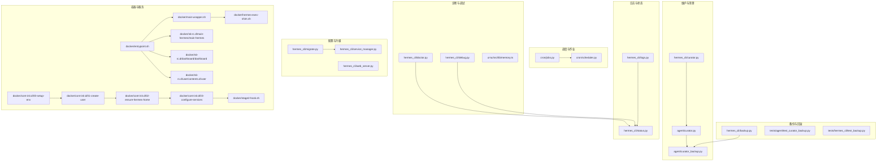
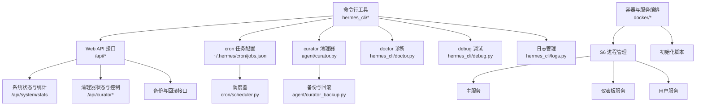
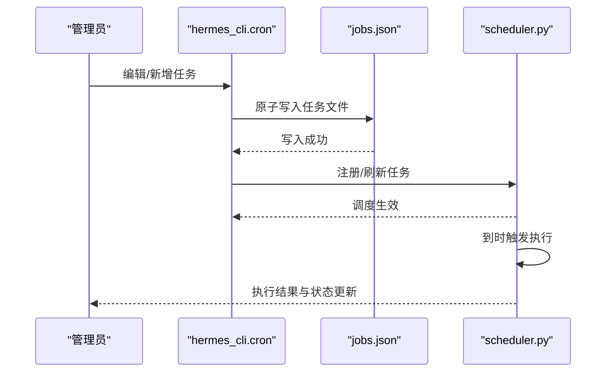
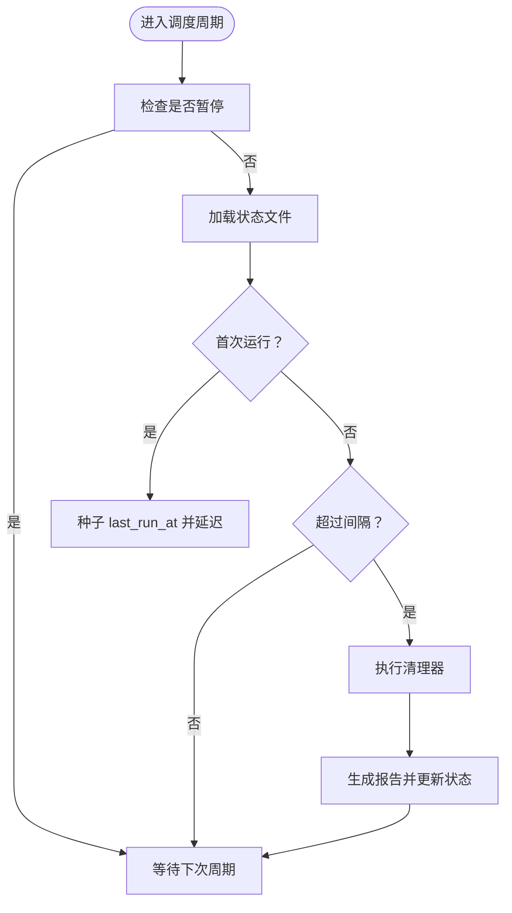
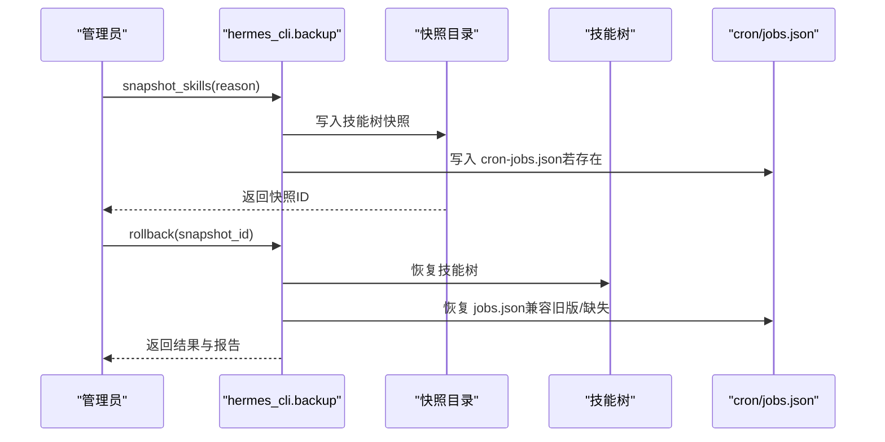
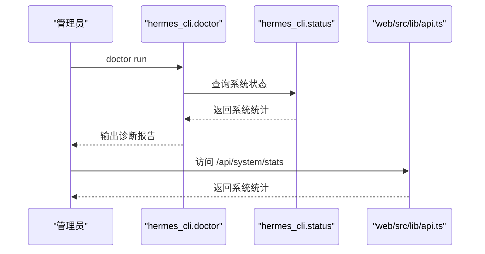
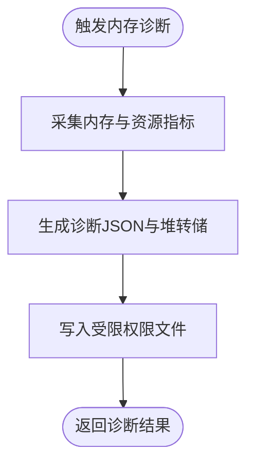
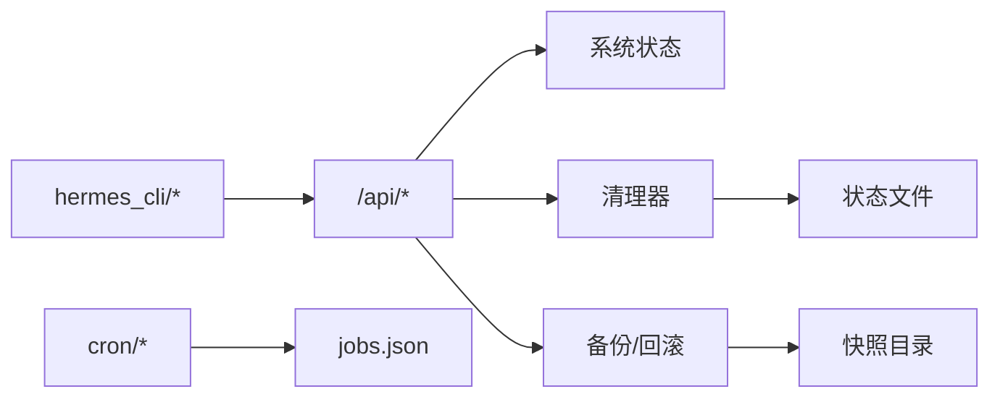

# 运维工具

<cite>
**本文引用的文件**
- [cron/jobs.py](file://cron/jobs.py)
- [cron/scheduler.py](file://cron/scheduler.py)
- [agent/curator.py](file://agent/curator.py)
- [agent/curator_backup.py](file://agent/curator_backup.py)
- [hermes_cli/curator.py](file://hermes_cli/curator.py)
- [hermes_cli/backup.py](file://hermes_cli/backup.py)
- [hermes_cli/doctor.py](file://hermes_cli/doctor.py)
- [hermes_cli/debug.py](file://hermes_cli/debug.py)
- [hermes_cli/logs.py](file://hermes_cli/logs.py)
- [hermes_cli/main.py](file://hermes_cli/main.py)
- [hermes_cli/status.py](file://hermes_cli/status.py)
- [hermes_cli/migrate.py](file://hermes_cli/migrate.py)
- [hermes_cli/service_manager.py](file://hermes_cli/service_manager.py)
- [hermes_cli/web_server.py](file://hermes_cli/web_server.py)
- [web/src/lib/api.ts](file://web/src/lib/api.ts)
- [ui-tui/src/lib/memory.ts](file://ui-tui/src/lib/memory.ts)
- [docker/entrypoint.sh](file://docker/entrypoint.sh)
- [docker/main-wrapper.sh](file://docker/main-wrapper.sh)
- [docker/hermes-exec-shim.sh](file://docker/hermes-exec-shim.sh)
- [docker/s6-rc.d/main-hermes/main-hermes](file://docker/s6-rc.d/main-hermes/main-hermes)
- [docker/s6-rc.d/user/contents.d/user](file://docker/s6-rc.d/user/contents.d/user)
- [docker/s6-rc.d/dashboard/dashboard](file://docker/s6-rc.d/dashboard/dashboard)
- [docker/cont-init.d/00-setup-env](file://docker/cont-init.d/00-setup-env)
- [docker/cont-init.d/01-create-user](file://docker/cont-init.d/01-create-user)
- [docker/cont-init.d/02-ensure-hermes-home](file://docker/cont-init.d/02-ensure-hermes-home)
- [docker/cont-init.d/03-configure-services](file://docker/cont-init.d/03-configure-services)
- [docker/stage2-hook.sh](file://docker/stage2-hook.sh)
- [docker/SOUL.md](file://docker/SOUL.md)
- [scripts/install.sh](file://scripts/install.sh)
- [scripts/install.ps1](file://scripts/install.ps1)
- [scripts/install.cmd](file://scripts/install.cmd)
- [scripts/check-windows-footguns.py](file://scripts/check-windows-footguns.py)
- [scripts/docker_config_migrate.py](file://scripts/docker_config_migrate.py)
- [tests/agent/test_curator.py](file://tests/agent/test_curator.py)
- [tests/agent/test_curator_backup.py](file://tests/agent/test_curator_backup.py)
- [tests/hermes_cli/test_backup.py](file://tests/hermes_cli/test_backup.py)
- [tests/hermes_cli/test_dashboard_admin_endpoints.py](file://tests/hermes_cli/test_dashboard_admin_endpoints.py)
- [tests/ui-tui/test_memory_diagnostics.py](file://tests/ui-tui/test_memory_diagnostics.py)
</cite>

## 目录
1. [简介](#简介)
2. [项目结构](#项目结构)
3. [核心组件](#核心组件)
4. [架构总览](#架构总览)
5. [详细组件分析](#详细组件分析)
6. [依赖关系分析](#依赖关系分析)
7. [性能考量](#性能考量)
8. [故障排查指南](#故障排查指南)
9. [结论](#结论)
10. [附录](#附录)

## 简介
本文件面向Hermes Agent的运维与平台工程团队，系统化梳理并说明自动化运维脚本、系统健康检查、性能监控、日志管理与故障诊断工具；深入讲解cron作业调度系统的配置与管理（定时任务、清理任务、维护作业）；介绍系统维护工具（curator清理器、doctor诊断工具、debug调试工具）的功能与使用方法；提供备份恢复策略、配置管理工具与版本升级流程，并覆盖监控指标采集、告警配置与性能调优建议。

## 项目结构
Hermes Agent的运维能力主要分布在以下模块：
- 调度与作业：cron子系统（任务定义、调度器）
- 维护与清理：agent/curator与hermes_cli/curator（技能树维护、清理策略、报告与状态）
- 备份与回滚：agent/curator_backup与hermes_cli/backup（快照、回滚、预更新备份）
- 诊断与调试：hermes_cli/doctor、hermes_cli/debug、ui-tui内存诊断
- 日志与状态：hermes_cli/logs、hermes_cli/status
- 配置与升级：hermes_cli/migrate、hermes_cli/service_manager、hermes_cli/web_server
- 容器与服务：docker/*（入口脚本、S6服务编排、初始化钩子）

**图表来源**
- [cron/jobs.py](file://cron/jobs.py)
- [cron/scheduler.py](file://cron/scheduler.py)
- [agent/curator.py](file://agent/curator.py)
- [agent/curator_backup.py](file://agent/curator_backup.py)
- [hermes_cli/curator.py](file://hermes_cli/curator.py)
- [hermes_cli/backup.py](file://hermes_cli/backup.py)
- [hermes_cli/doctor.py](file://hermes_cli/doctor.py)
- [hermes_cli/debug.py](file://hermes_cli/debug.py)
- [hermes_cli/logs.py](file://hermes_cli/logs.py)
- [hermes_cli/status.py](file://hermes_cli/status.py)
- [hermes_cli/migrate.py](file://hermes_cli/migrate.py)
- [hermes_cli/service_manager.py](file://hermes_cli/service_manager.py)
- [hermes_cli/web_server.py](file://hermes_cli/web_server.py)
- [docker/entrypoint.sh](file://docker/entrypoint.sh)
- [docker/main-wrapper.sh](file://docker/main-wrapper.sh)
- [docker/hermes-exec-shim.sh](file://docker/hermes-exec-shim.sh)
- [docker/s6-rc.d/main-hermes/main-hermes](file://docker/s6-rc.d/main-hermes/main-hermes)
- [docker/s6-rc.d/dashboard/dashboard](file://docker/s6-rc.d/dashboard/dashboard)
- [docker/s6-rc.d/user/contents.d/user](file://docker/s6-rc.d/user/contents.d/user)
- [docker/cont-init.d/00-setup-env](file://docker/cont-init.d/00-setup-env)
- [docker/cont-init.d/01-create-user](file://docker/cont-init.d/01-create-user)
- [docker/cont-init.d/02-ensure-hermes-home](file://docker/cont-init.d/02-ensure-hermes-home)
- [docker/cont-init.d/03-configure-services](file://docker/cont-init.d/03-configure-services)
- [docker/stage2-hook.sh](file://docker/stage2-hook.sh)

**章节来源**
- [cron/jobs.py](file://cron/jobs.py)
- [cron/scheduler.py](file://cron/scheduler.py)
- [agent/curator.py](file://agent/curator.py)
- [agent/curator_backup.py](file://agent/curator_backup.py)
- [hermes_cli/curator.py](file://hermes_cli/curator.py)
- [hermes_cli/backup.py](file://hermes_cli/backup.py)
- [hermes_cli/doctor.py](file://hermes_cli/doctor.py)
- [hermes_cli/debug.py](file://hermes_cli/debug.py)
- [hermes_cli/logs.py](file://hermes_cli/logs.py)
- [hermes_cli/status.py](file://hermes_cli/status.py)
- [hermes_cli/migrate.py](file://hermes_cli/migrate.py)
- [hermes_cli/service_manager.py](file://hermes_cli/service_manager.py)
- [hermes_cli/web_server.py](file://hermes_cli/web_server.py)
- [docker/entrypoint.sh](file://docker/entrypoint.sh)
- [docker/main-wrapper.sh](file://docker/main-wrapper.sh)
- [docker/hermes-exec-shim.sh](file://docker/hermes-exec-shim.sh)
- [docker/s6-rc.d/main-hermes/main-hermes](file://docker/s6-rc.d/main-hermes/main-hermes)
- [docker/s6-rc.d/dashboard/dashboard](file://docker/s6-rc.d/dashboard/dashboard)
- [docker/s6-rc.d/user/contents.d/user](file://docker/s6-rc.d/user/contents.d/user)
- [docker/cont-init.d/00-setup-env](file://docker/cont-init.d/00-setup-env)
- [docker/cont-init.d/01-create-user](file://docker/cont-init.d/01-create-user)
- [docker/cont-init.d/02-ensure-hermes-home](file://docker/cont-init.d/02-ensure-hermes-home)
- [docker/cont-init.d/03-configure-services](file://docker/cont-init.d/03-configure-services)
- [docker/stage2-hook.sh](file://docker/stage2-hook.sh)

## 核心组件
- cron作业系统：负责任务定义、调度与执行，支持原子写入的任务存储与状态管理。
- curator清理器：周期性评估技能使用情况，生成清理建议，支持暂停、间隔控制与状态持久化。
- 备份与回滚：提供技能树快照、回滚、预更新备份与清理策略，保障可恢复性。
- 诊断与调试：doctor诊断系统健康与配置问题，debug辅助运行时问题定位，UI内存诊断用于内存泄漏与增长趋势分析。
- 日志与状态：集中化日志输出与系统状态查询接口，便于运维观测。
- 配置与升级：迁移工具、服务管理与Web服务集成，支撑版本升级与服务治理。
- 容器与服务：通过S6进程管理与初始化脚本实现稳定的服务编排与环境准备。

**章节来源**
- [cron/jobs.py](file://cron/jobs.py)
- [cron/scheduler.py](file://cron/scheduler.py)
- [agent/curator.py](file://agent/curator.py)
- [agent/curator_backup.py](file://agent/curator_backup.py)
- [hermes_cli/curator.py](file://hermes_cli/curator.py)
- [hermes_cli/backup.py](file://hermes_cli/backup.py)
- [hermes_cli/doctor.py](file://hermes_cli/doctor.py)
- [hermes_cli/debug.py](file://hermes_cli/debug.py)
- [hermes_cli/logs.py](file://hermes_cli/logs.py)
- [hermes_cli/status.py](file://hermes_cli/status.py)
- [hermes_cli/migrate.py](file://hermes_cli/migrate.py)
- [hermes_cli/service_manager.py](file://hermes_cli/service_manager.py)
- [hermes_cli/web_server.py](file://hermes_cli/web_server.py)
- [docker/entrypoint.sh](file://docker/entrypoint.sh)

## 架构总览
下图展示运维工具在系统中的交互关系与数据流：

**图表来源**
- [web/src/lib/api.ts](file://web/src/lib/api.ts)
- [hermes_cli/status.py](file://hermes_cli/status.py)
- [hermes_cli/curator.py](file://hermes_cli/curator.py)
- [agent/curator.py](file://agent/curator.py)
- [agent/curator_backup.py](file://agent/curator_backup.py)
- [cron/scheduler.py](file://cron/scheduler.py)
- [docker/entrypoint.sh](file://docker/entrypoint.sh)
- [docker/s6-rc.d/main-hermes/main-hermes](file://docker/s6-rc.d/main-hermes/main-hermes)
- [docker/s6-rc.d/dashboard/dashboard](file://docker/s6-rc.d/dashboard/dashboard)
- [docker/s6-rc.d/user/contents.d/user](file://docker/s6-rc.d/user/contents.d/user)

## 详细组件分析

### cron作业调度系统
- 任务存储与生命周期
  - 存储位置：~/.hermes/cron/jobs.json，采用原子写入（先写临时文件再重命名），确保一致性。
  - 任务字段包含：标识、名称、调度表达式、技能集合、交付目标、重复计数、状态、启用标志、下次/上次运行时间等。
  - 状态机：scheduled（待执行）、paused（已暂停）、completed（已完成）、running（执行中）。
  - 兼容性：旧版单个skill字段会在加载时规范化为skills数组。
- 调度器行为
  - 支持多种调度表达式与显示格式，解析与校验由调度器完成。
  - 任务加载与保存遵循原子写入语义，避免部分写入导致的数据不一致。
- 常用运维操作
  - 查看/编辑任务：通过CLI或直接编辑jobs.json（推荐使用CLI以保证原子写入）。
  - 暂停/恢复：通过API或CLI切换enabled/paused字段。
  - 触发立即执行：通过CLI或API手动触发特定任务。
- 故障排查
  - 任务未触发：检查schedule表达式、enabled/paused状态、next_run_at是否正确推进。
  - 任务执行失败：查看last_status与日志，确认技能可用性与交付通道配置。

**图表来源**
- [cron/jobs.py](file://cron/jobs.py)
- [cron/scheduler.py](file://cron/scheduler.py)
- [hermes_cli/cron.py](file://hermes_cli/cron.py)

**章节来源**
- [cron/jobs.py](file://cron/jobs.py)
- [cron/scheduler.py](file://cron/scheduler.py)
- [hermes_cli/cron.py](file://hermes_cli/cron.py)
- [website/i18n/zh-Hans/docusaurus-plugin-content-docs/current/developer-guide/cron-internals.md](file://website/i18n/zh-Hans/docusaurus-plugin-content-docs/current/developer-guide/cron-internals.md)

### curator清理器与维护作业
- 功能概述
  - 周期性评估技能使用情况，生成清理建议（合并、归档、修补）。
  - 支持配置：运行间隔、最小空闲窗口、过期与归档阈值。
  - 状态持久化：包含上次运行时间、运行计数、暂停标志、最后报告路径等。
  - 异常处理：运行异常被吞掉，不影响后续调度。
- 常用运维操作
  - 查看状态：/api/curator 或 CLI curator status。
  - 暂停/恢复：/api/curator/paused 或 CLI curator pause/resume。
  - 强制运行：/api/curator/run 或 CLI curator run。
- 测试与可靠性
  - 首次运行延迟：新安装无状态文件时，应延迟至完整间隔后再触发。
  - 状态文件损坏：读取失败自动回退到默认状态。
  - 原子写入：状态文件写入过程无临时文件残留。

**图表来源**
- [agent/curator.py](file://agent/curator.py)
- [hermes_cli/curator.py](file://hermes_cli/curator.py)
- [tests/agent/test_curator.py](file://tests/agent/test_curator.py)

**章节来源**
- [agent/curator.py](file://agent/curator.py)
- [hermes_cli/curator.py](file://hermes_cli/curator.py)
- [tests/agent/test_curator.py](file://tests/agent/test_curator.py)
- [tests/hermes_cli/test_dashboard_admin_endpoints.py](file://tests/hermes_cli/test_dashboard_admin_endpoints.py)

### 备份与回滚工具
- 快照与回滚
  - 技能树快照：保存当前技能树状态，支持带原因标签与安全前置快照（回滚前）。
  - 回滚策略：按技能粒度恢复，保留新创建的任务（回滚后仍存在）。
  - cron任务恢复：从快照恢复jobs.json，兼容旧版bare列表格式与缺失文件场景。
- 预更新备份
  - 升级前自动创建“pre-update-*.zip”，受配置项pre_update_backup控制。
  - 保留策略：keep>=1，避免误删刚创建的备份。
  - CLI优先级：--no-backup优先于配置项。
- 常用运维操作
  - 创建快照：CLI snapshot或API。
  - 回滚到指定快照：CLI rollback或API。
  - 预更新备份：CLI pre-update backup或自动流程。
- 测试验证
  - 回滚前后任务一致性、缺失cron文件的兼容性、旧版快照格式兼容。

**图表来源**
- [agent/curator_backup.py](file://agent/curator_backup.py)
- [hermes_cli/backup.py](file://hermes_cli/backup.py)
- [tests/agent/test_curator_backup.py](file://tests/agent/test_curator_backup.py)
- [tests/hermes_cli/test_backup.py](file://tests/hermes_cli/test_backup.py)

**章节来源**
- [agent/curator_backup.py](file://agent/curator_backup.py)
- [hermes_cli/backup.py](file://hermes_cli/backup.py)
- [tests/agent/test_curator_backup.py](file://tests/agent/test_curator_backup.py)
- [tests/hermes_cli/test_backup.py](file://tests/hermes_cli/test_backup.py)

### doctor诊断工具
- 功能概述
  - 诊断系统健康状况、配置问题与潜在风险点，输出结构化报告。
  - 与状态查询接口配合，提供统一的健康视图。
- 常用运维操作
  - 运行诊断：CLI doctor run。
  - 结合状态：/api/system/stats 获取系统统计信息，辅助判断资源瓶颈。
- 与UI联动
  - Web端通过/api/system/stats与/api/curator等接口展示系统状态与清理器状态。

**图表来源**
- [hermes_cli/doctor.py](file://hermes_cli/doctor.py)
- [hermes_cli/status.py](file://hermes_cli/status.py)
- [web/src/lib/api.ts](file://web/src/lib/api.ts)

**章节来源**
- [hermes_cli/doctor.py](file://hermes_cli/doctor.py)
- [hermes_cli/status.py](file://hermes_cli/status.py)
- [web/src/lib/api.ts](file://web/src/lib/api.ts)
- [tests/hermes_cli/test_dashboard_admin_endpoints.py](file://tests/hermes_cli/test_dashboard_admin_endpoints.py)

### debug调试工具
- 功能概述
  - 提供运行时调试能力，辅助定位性能瓶颈、阻塞点与异常路径。
  - 可结合日志与状态接口进行综合分析。
- 常用运维操作
  - 启动调试：CLI debug run。
  - 结合日志：hermes_cli/logs聚合输出，定位异常上下文。

**章节来源**
- [hermes_cli/debug.py](file://hermes_cli/debug.py)
- [hermes_cli/logs.py](file://hermes_cli/logs.py)

### UI内存诊断（ui-tui）
- 功能概述
  - 捕获V8堆统计、进程内存、资源使用等指标，生成诊断JSON与堆转储。
  - 支持按触发类型（自动高危、自动严重、手动）生成堆转储。
- 常用运维操作
  - 触发诊断：调用performHeapDump，输出诊断文件与堆转储路径。
  - 分析增长：基于启动时刻的累计增长速率计算，识别内存泄漏趋势。
- 安全与权限
  - 诊断文件与堆转储文件设置严格权限（仅所有者可读写）。

**图表来源**
- [ui-tui/src/lib/memory.ts](file://ui-tui/src/lib/memory.ts)

**章节来源**
- [ui-tui/src/lib/memory.ts](file://ui-tui/src/lib/memory.ts)
- [tests/ui-tui/test_memory_diagnostics.py](file://tests/ui-tui/test_memory_diagnostics.py)

### 日志管理
- 日志聚合与输出
  - 通过hermes_cli/logs集中输出日志，便于运维检索与分析。
- 与诊断联动
  - doctor与debug输出可与日志结合，形成完整的故障证据链。

**章节来源**
- [hermes_cli/logs.py](file://hermes_cli/logs.py)

### 配置管理与版本升级
- 迁移工具
  - hermes_cli/migrate提供版本迁移逻辑，确保配置与数据结构演进的平滑过渡。
- 服务管理
  - hermes_cli/service_manager负责服务生命周期管理，与容器编排协同。
- Web服务集成
  - hermes_cli/web_server提供Web界面与API服务，承载运维面板与状态展示。

**章节来源**
- [hermes_cli/migrate.py](file://hermes_cli/migrate.py)
- [hermes_cli/service_manager.py](file://hermes_cli/service_manager.py)
- [hermes_cli/web_server.py](file://hermes_cli/web_server.py)

### 容器与服务编排
- 入口与包装
  - docker/entrypoint.sh作为容器入口，调用docker/main-wrapper.sh与docker/hermes-exec-shim.sh，确保环境与进程模型一致。
- S6服务编排
  - docker/s6-rc.d/main-hermes/main-hermes、docker/s6-rc.d/dashboard/dashboard、docker/s6-rc.d/user/contents.d/user分别管理主服务、仪表板与用户服务。
- 初始化脚本
  - docker/cont-init.d/*负责环境变量、用户创建、家目录与服务配置的初始化。
- 钩子与引导
  - docker/stage2-hook.sh在容器阶段2执行额外引导逻辑。

**章节来源**
- [docker/entrypoint.sh](file://docker/entrypoint.sh)
- [docker/main-wrapper.sh](file://docker/main-wrapper.sh)
- [docker/hermes-exec-shim.sh](file://docker/hermes-exec-shim.sh)
- [docker/s6-rc.d/main-hermes/main-hermes](file://docker/s6-rc.d/main-hermes/main-hermes)
- [docker/s6-rc.d/dashboard/dashboard](file://docker/s6-rc.d/dashboard/dashboard)
- [docker/s6-rc.d/user/contents.d/user](file://docker/s6-rc.d/user/contents.d/user)
- [docker/cont-init.d/00-setup-env](file://docker/cont-init.d/00-setup-env)
- [docker/cont-init.d/01-create-user](file://docker/cont-init.d/01-create-user)
- [docker/cont-init.d/02-ensure-hermes-home](file://docker/cont-init.d/02-ensure-hermes-home)
- [docker/cont-init.d/03-configure-services](file://docker/cont-init.d/03-configure-services)
- [docker/stage2-hook.sh](file://docker/stage2-hook.sh)

## 依赖关系分析
- 组件耦合
  - cron依赖jobs.json与scheduler；curator依赖状态文件与技能树；备份依赖快照目录与jobs.json。
  - CLI层与API层解耦，CLI通过API访问系统状态与执行运维动作。
- 外部依赖
  - 容器运行时（S6）、操作系统资源（/proc、fd等）、Node.js V8堆诊断能力。
- 循环依赖
  - 当前模块间无明显循环依赖，职责边界清晰。

**图表来源**
- [web/src/lib/api.ts](file://web/src/lib/api.ts)
- [cron/jobs.py](file://cron/jobs.py)
- [agent/curator.py](file://agent/curator.py)
- [agent/curator_backup.py](file://agent/curator_backup.py)
- [hermes_cli/backup.py](file://hermes_cli/backup.py)

**章节来源**
- [web/src/lib/api.ts](file://web/src/lib/api.ts)
- [cron/jobs.py](file://cron/jobs.py)
- [agent/curator.py](file://agent/curator.py)
- [agent/curator_backup.py](file://agent/curator_backup.py)
- [hermes_cli/backup.py](file://hermes_cli/backup.py)

## 性能考量
- 调度与IO
  - cron任务存储采用原子写入，避免并发写入导致的损坏；建议批量修改任务时通过CLI或API，减少频繁小写入。
- 清理器开销
  - 控制interval_hours与min_idle_hours，避免过于频繁的扫描；在低负载时段运行清理器，降低对业务的影响。
- 内存诊断
  - 使用ui-tui内存诊断定期捕获堆统计与转储，关注rss与heapUsed的增长率，及时发现泄漏。
- 容器资源
  - 通过S6管理进程生命周期，合理设置资源限制与重启策略，避免僵尸进程与资源泄露。

## 故障排查指南
- cron任务未触发
  - 检查jobs.json是否原子写入成功、enabled/paused状态、schedule表达式是否有效。
  - 参考测试用例中的表达式与状态机行为。
- curator未运行或异常
  - 检查暂停状态与上次运行时间；确认状态文件可读；观察异常吞没机制下的日志。
- 备份/回滚失败
  - 确认快照目录权限与完整性；检查jobs.json是否存在与格式正确；验证回滚前后任务一致性。
- 内存泄漏与增长
  - 使用performHeapDump生成诊断与堆转储，结合增长速率判断泄漏趋势；检查活跃句柄与请求数量。
- 容器服务异常
  - 检查S6服务状态、初始化脚本输出与钩子执行情况；核对环境变量与用户权限。

**章节来源**
- [tests/agent/test_curator.py](file://tests/agent/test_curator.py)
- [tests/agent/test_curator_backup.py](file://tests/agent/test_curator_backup.py)
- [tests/hermes_cli/test_backup.py](file://tests/hermes_cli/test_backup.py)
- [ui-tui/src/lib/memory.ts](file://ui-tui/src/lib/memory.ts)

## 结论
Hermes Agent的运维工具体系覆盖了调度、清理、备份、诊断、日志与容器编排等关键领域。通过原子写入、状态持久化与严格的测试验证，系统在复杂场景下保持稳健性。建议在生产环境中：
- 使用CLI/API进行任务与状态变更，避免直接编辑文件；
- 合理配置curator的运行间隔与阈值，结合业务低峰期执行；
- 定期执行doctor与内存诊断，建立基线与告警；
- 严格执行备份策略，确保回滚路径可用；
- 在容器部署中完善S6服务与初始化脚本，确保环境一致性。

## 附录
- 常用命令与接口参考
  - cron：编辑/新增任务、暂停/恢复、手动触发
  - curator：状态查询、暂停/恢复、强制运行
  - 备份：快照、回滚、预更新备份
  - doctor：系统诊断
  - debug：运行时调试
  - 日志：集中输出与检索
  - API：/api/system/stats、/api/curator*、/api/ops/*

**章节来源**
- [hermes_cli/cron.py](file://hermes_cli/cron.py)
- [hermes_cli/curator.py](file://hermes_cli/curator.py)
- [hermes_cli/backup.py](file://hermes_cli/backup.py)
- [hermes_cli/doctor.py](file://hermes_cli/doctor.py)
- [hermes_cli/debug.py](file://hermes_cli/debug.py)
- [hermes_cli/logs.py](file://hermes_cli/logs.py)
- [web/src/lib/api.ts](file://web/src/lib/api.ts)