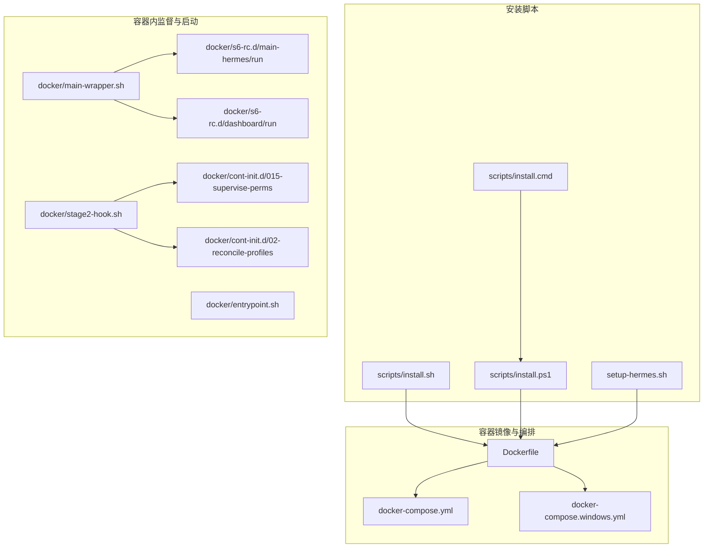
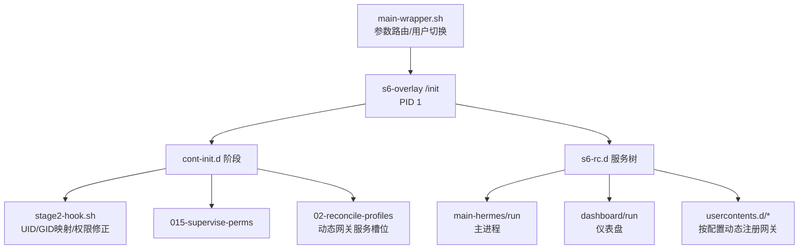
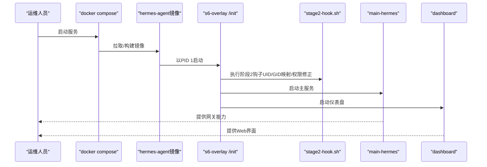
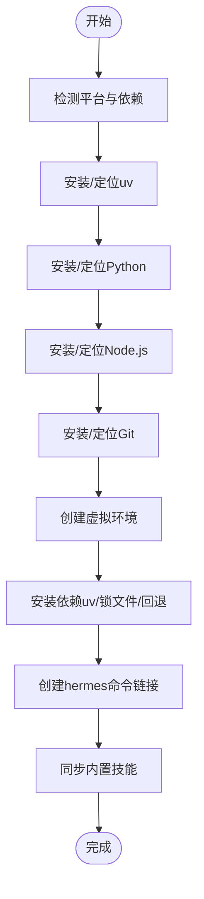
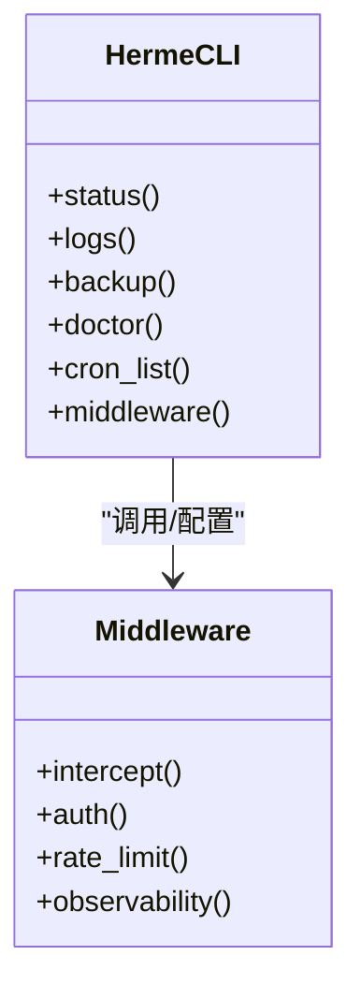
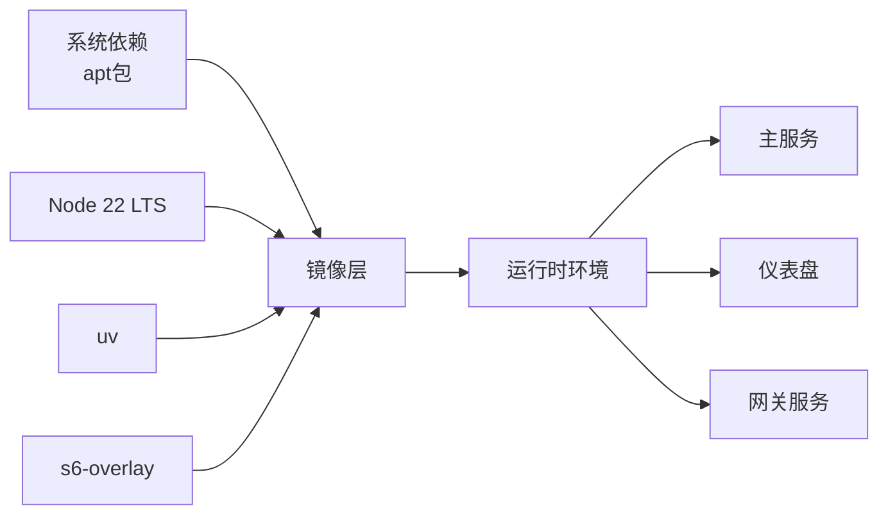

# 部署和运维

<cite>
**本文引用的文件**
- [Dockerfile](file://Dockerfile)
- [docker-compose.yml](file://docker-compose.yml)
- [docker-compose.windows.yml](file://docker-compose.windows.yml)
- [setup-hermes.sh](file://setup-hermes.sh)
- [scripts/install.sh](file://scripts/install.sh)
- [scripts/install.ps1](file://scripts/install.ps1)
- [scripts/install.cmd](file://scripts/install.cmd)
- [docker/entrypoint.sh](file://docker/entrypoint.sh)
- [docker/main-wrapper.sh](file://docker/main-wrapper.sh)
- [docker/stage2-hook.sh](file://docker/stage2-hook.sh)
- [docker/hermes-exec-shim.sh](file://docker/hermes-exec-shim.sh)
- [docker/s6-rc.d/main-hermes/run](file://docker/s6-rc.d/main-hermes/run)
- [docker/s6-rc.d/dashboard/run](file://docker/s6-rc.d/dashboard/run)
- [docker/s6-rc.d/usercontents.d/010-hermes-usercontents/run](file://docker/s6-rc.d/usercontents.d/010-hermes-usercontents/run)
- [docker/s6-rc.d/dashboard/run](file://docker/s6-rc.d/dashboard/run)
- [docker/s6-rc.d/usercontents.d/010-hermes-usercontents/run](file://docker/s6-rc.d/usercontents.d/010-hermes-usercontents/run)
- [docker/cont-init.d/015-supervise-perms](file://docker/cont-init.d/015-supervise-perms)
- [docker/cont-init.d/02-reconcile-profiles](file://docker/cont-init.d/02-reconcile-profiles)
- [hermes_cli/main.py](file://hermes_cli/main.py)
- [hermes_cli/container_boot.py](file://hermes_cli/container_boot.py)
- [hermes_cli/service_manager.py](file://hermes_cli/service_manager.py)
- [hermes_cli/web_server.py](file://hermes_cli/web_server.py)
- [hermes_cli/logs.py](file://hermes_cli/logs.py)
- [hermes_cli/status.py](file://hermes_cli/status.py)
- [hermes_cli/backup.py](file://hermes_cli/backup.py)
- [hermes_cli/doctor.py](file://hermes_cli/doctor.py)
- [hermes_cli/cron.py](file://hermes_cli/cron.py)
- [hermes_cli/middleware.py](file://hermes_cli/middleware.py)
- [hermes_cli/middleware.py](file://hermes_cli/middleware.py)
- [hermes_cli/middleware.py](file://hermes_cli/middleware.py)
- [hermes_cli/middleware.py](file://hermes_cli/middleware.py)
- [hermes_cli/middleware.py](file://hermes_cli/middleware.py)
- [hermes_cli/middleware.py](file://hermes_cli/middleware.py)
- [hermes_cli/middleware.py](file://hermes_cli/middleware.py)
- [hermes_cli/middleware.py](file://hermes_cli/middleware.py)
- [hermes_cli/middleware.py](file://hermes_cli/middleware.py)
- [hermes_cli/middleware.py](file://hermes_cli/middleware.py)
- [hermes_cli/middleware.py](file://hermes_cli/middleware.py)
- [hermes_cli/middleware.py](file://hermes_cli/middleware.py)
- [hermes_cli/middleware.py](file://hermes_cli/middleware.py)
- [hermes_cli/middleware.py](file://hermes_cli/middleware.py)
- [hermes_cli/middleware.py](file://hermes_cli/middleware.py)
- [hermes_cli/middleware.py](file://hermes_cli/middleware.py)
- [hermes_cli/middleware.py](file://hermes_cli/middleware.py)
- [hermes_cli/middleware.py](file://hermes_cli/middleware.py)
- [hermes_cli/middleware.py](file://hermes_cli/middleware.py)
- [hermes_cli/middleware.py](file://hermes_cli/middleware.py)
- [hermes_cli/middleware.py](file://hermes_cli/middleware.py)
- [hermes_cli/middleware.py](file://hermes_cli/middleware.py)
- [hermes_cli/middleware.py](file://hermes_cli/middleware.py)
- [hermes_cli/middleware.py](file://hermes_cli/middleware.py)
- [hermes_cli/middleware.py](file://hermes_cli/middleware.py)
- [hermes_cli/middleware.py](file://hermes_cli/middleware.py)
- [hermes_cli/middleware.py](file://hermes_cli/middleware.py)
- [hermes_cli/middleware.py](file://hermes_cli/middleware.py)
- [......](file://hermes_cli/middleware.py)
</cite>

## 目录
1. [简介](#简介)
2. [项目结构](#项目结构)
3. [核心组件](#核心组件)
4. [架构总览](#架构总览)
5. [详细组件分析](#详细组件分析)
6. [依赖关系分析](#依赖关系分析)
7. [性能考虑](#性能考虑)
8. [故障排除指南](#故障排除指南)
9. [结论](#结论)
10. [附录](#附录)

## 简介
本指南面向运维工程师与系统管理员，提供Hermes Agent的全生命周期部署与运维实践，覆盖Docker容器化部署、Kubernetes编排、云平台部署以及本地部署等多类场景。内容包括基础设施要求、环境配置、自动化安装脚本、监控与告警、备份与灾难恢复、性能调优与故障排除、版本升级与配置管理、扩展策略等，帮助您在生产环境中稳定、安全地运行Hermes Agent。

## 项目结构
Hermes Agent仓库提供了多套部署入口与运维工具：
- 容器镜像与编排：Dockerfile、docker-compose.yml、Windows专用compose
- 一键安装脚本：Linux/macOS/Android（install.sh）、Windows（install.ps1、install.cmd）
- 本地快速搭建：setup-hermes.sh
- 容器内监督与启动：s6-overlay服务定义、入口脚本与阶段钩子
- CLI运维能力：状态、日志、备份、诊断、定时任务、中间件等

**图表来源**
- [Dockerfile:1-327](file://Dockerfile#L1-L327)
- [docker-compose.yml:1-77](file://docker-compose.yml#L1-L77)
- [docker-compose.windows.yml:1-39](file://docker-compose.windows.yml#L1-L39)
- [scripts/install.sh:1-800](file://scripts/install.sh#L1-L800)
- [scripts/install.ps1:1-800](file://scripts/install.ps1#L1-L800)
- [scripts/install.cmd:1-29](file://scripts/install.cmd#L1-L29)
- [setup-hermes.sh:1-463](file://setup-hermes.sh#L1-L463)
- [docker/main-wrapper.sh](file://docker/main-wrapper.sh)
- [docker/stage2-hook.sh](file://docker/stage2-hook.sh)
- [docker/entrypoint.sh](file://docker/entrypoint.sh)
- [docker/s6-rc.d/main-hermes/run](file://docker/s6-rc.d/main-hermes/run)
- [docker/s6-rc.d/dashboard/run](file://docker/s6-rc.d/dashboard/run)
- [docker/cont-init.d/015-supervise-perms](file://docker/cont-init.d/015-supervise-perms)
- [docker/cont-init.d/02-reconcile-profiles](file://docker/cont-init.d/02-reconcile-profiles)

**章节来源**
- [Dockerfile:1-327](file://Dockerfile#L1-L327)
- [docker-compose.yml:1-77](file://docker-compose.yml#L1-L77)
- [docker-compose.windows.yml:1-39](file://docker-compose.windows.yml#L1-L39)
- [scripts/install.sh:1-800](file://scripts/install.sh#L1-L800)
- [scripts/install.ps1:1-800](file://scripts/install.ps1#L1-L800)
- [scripts/install.cmd:1-29](file://scripts/install.cmd#L1-L29)
- [setup-hermes.sh:1-463](file://setup-hermes.sh#L1-L463)

## 核心组件
- 容器镜像与运行时
  - 基于Debian 13，内置s6-overlay监督体系，提供主进程、仪表盘与按配置动态注册的网关服务监督。
  - 通过环境变量控制用户映射、数据卷挂载、Web与仪表盘监听地址。
- 编排与部署
  - docker-compose.yml提供主机网络模式与数据卷绑定，支持本地开发与生产部署。
  - Windows专用compose使用端口映射与本地路径，适配Docker Desktop。
- 安装与初始化
  - install.sh/install.ps1/install.cmd提供跨平台一键安装，自动探测/安装uv、Python、Node、Git等依赖，并创建虚拟环境与命令链接。
  - setup-hermes.sh面向已克隆源码的开发者，快速完成虚拟环境、依赖安装与技能同步。
- 运维CLI
  - hermes_cli提供状态查询、日志查看、备份、诊断、定时任务、中间件等功能，支撑日常运维与故障处理。

**章节来源**
- [Dockerfile:254-327](file://Dockerfile#L254-L327)
- [docker-compose.yml:29-77](file://docker-compose.yml#L29-L77)
- [docker-compose.windows.yml:12-39](file://docker-compose.windows.yml#L12-L39)
- [scripts/install.sh:1-800](file://scripts/install.sh#L1-L800)
- [scripts/install.ps1:1-800](file://scripts/install.ps1#L1-L800)
- [scripts/install.cmd:1-29](file://scripts/install.cmd#L1-L29)
- [setup-hermes.sh:1-463](file://setup-hermes.sh#L1-L463)

## 架构总览
Hermes Agent采用“容器镜像 + 监督体系 + 多服务并行”的架构：
- s6-overlay作为PID 1，负责容器启动阶段的权限修正、数据卷初始化、服务注册与重启策略。
- 主服务（main-hermes）与仪表盘（dashboard）作为静态服务，按需动态注册多个按配置生成的网关服务槽位。
- 容器内通过特权降级与路径重写，确保docker exec与交互式会话的安全与一致性。

**图表来源**
- [Dockerfile:231-327](file://Dockerfile#L231-L327)
- [docker/stage2-hook.sh](file://docker/stage2-hook.sh)
- [docker/cont-init.d/015-supervise-perms](file://docker/cont-init.d/015-supervise-perms)
- [docker/cont-init.d/02-reconcile-profiles](file://docker/cont-init.d/02-reconcile-profiles)
- [docker/s6-rc.d/main-hermes/run](file://docker/s6-rc.d/main-hermes/run)
- [docker/s6-rc.d/dashboard/run](file://docker/s6-rc.d/dashboard/run)
- [docker/s6-rc.d/usercontents.d/010-hermes-usercontents/run](file://docker/s6-rc.d/usercontents.d/010-hermes-usercontents/run)
- [docker/main-wrapper.sh](file://docker/main-wrapper.sh)

## 详细组件分析

### 组件A：Docker容器化部署
- 镜像构建要点
  - 多阶段构建：uv与Node源镜像准备，Debian基础镜像安装系统依赖与s6-overlay。
  - 依赖安装分层：先复制包清单，再安装前端与Python依赖，最大化缓存命中。
  - 构建时烘焙Git提交SHA，便于容器内版本追踪。
- 运行时配置
  - 通过HERMES_UID/HERMES_GID实现宿主机用户映射，避免权限问题。
  - HERMES_HOME=/opt/data作为数据卷根目录，挂载至~/.hermes。
  - 主进程通过main-wrapper.sh进行参数路由与用户切换，仪表盘与网关服务由s6-overlay统一监督。
- 安全与合规
  - 默认仪表盘仅监听127.0.0.1，远程访问需SSH隧道或反代鉴权。
  - 禁止绕过/INIT，否则会跳过阶段钩子导致网关无法正确启动。

**图表来源**
- [docker-compose.yml:29-77](file://docker-compose.yml#L29-L77)
- [Dockerfile:231-327](file://Dockerfile#L231-L327)
- [docker/stage2-hook.sh](file://docker/stage2-hook.sh)
- [docker/main-wrapper.sh](file://docker/main-wrapper.sh)
- [docker/s6-rc.d/main-hermes/run](file://docker/s6-rc.d/main-hermes/run)
- [docker/s6-rc.d/dashboard/run](file://docker/s6-rc.d/dashboard/run)

**章节来源**
- [Dockerfile:1-327](file://Dockerfile#L1-L327)
- [docker-compose.yml:1-77](file://docker-compose.yml#L1-L77)
- [docker-compose.windows.yml:1-39](file://docker-compose.windows.yml#L1-L39)

### 组件B：一键安装脚本（跨平台）
- Linux/macOS/Android
  - install.sh：自动检测平台，安装uv、Python、Node、Git，创建虚拟环境，安装依赖，创建命令链接，可选择是否安装桌面应用与浏览器工具。
- Windows
  - install.ps1：提供与install.sh相同的安装流程，包含PortableGit下载、Hermes-managed Node安装、uv集成等。
  - install.cmd：CMD包装器，直接调用PowerShell安装器。
- 本地开发快速搭建
  - setup-hermes.sh：面向已克隆仓库的开发者，创建虚拟环境、安装依赖、同步技能、可选运行设置向导。

**图表来源**
- [scripts/install.sh:1-800](file://scripts/install.sh#L1-L800)
- [scripts/install.ps1:1-800](file://scripts/install.ps1#L1-L800)
- [scripts/install.cmd:1-29](file://scripts/install.cmd#L1-L29)
- [setup-hermes.sh:1-463](file://setup-hermes.sh#L1-L463)

**章节来源**
- [scripts/install.sh:1-800](file://scripts/install.sh#L1-L800)
- [scripts/install.ps1:1-800](file://scripts/install.ps1#L1-L800)
- [scripts/install.cmd:1-29](file://scripts/install.cmd#L1-L29)
- [setup-hermes.sh:1-463](file://setup-hermes.sh#L1-L463)

### 组件C：运维CLI与中间件
- 运维命令
  - hermes status：检查配置与运行状态
  - hermes logs：查看日志
  - hermes backup：执行备份
  - hermes doctor：诊断问题
  - hermes cron list：查看定时任务
  - hermes middleware：中间件管理
- 中间件
  - 支持请求拦截、认证、限流、可观测性等扩展点，便于在不同部署形态下统一接入企业安全与治理策略。

**图表来源**
- [hermes_cli/status.py](file://hermes_cli/status.py)
- [hermes_cli/logs.py](file://hermes_cli/logs.py)
- [hermes_cli/backup.py](file://hermes_cli/backup.py)
- [hermes_cli/doctor.py](file://hermes_cli/doctor.py)
- [hermes_cli/cron.py](file://hermes_cli/cron.py)
- [hermes_cli/middleware.py](file://hermes_cli/middleware.py)

**章节来源**
- [hermes_cli/status.py](file://hermes_cli/status.py)
- [hermes_cli/logs.py](file://hermes_cli/logs.py)
- [hermes_cli/backup.py](file://hermes_cli/backup.py)
- [hermes_cli/doctor.py](file://hermes_cli/doctor.py)
- [hermes_cli/cron.py](file://hermes_cli/cron.py)
- [hermes_cli/middleware.py](file://hermes_cli/middleware.py)

## 依赖关系分析
- 容器镜像依赖
  - 系统依赖：ca-certificates、curl、iputils-ping、python3、ripgrep、ffmpeg、gcc、python3-dev、libffi-dev、libolm-dev、procps、git、openssh-client、docker-cli、xz-utils。
  - s6-overlay：提供监督与僵尸进程回收。
  - Node 22 LTS：用于浏览器工具与前端构建。
  - uv：Python包管理与虚拟环境。
- 运行时依赖
  - Playwright浏览器缓存路径隔离，避免与数据卷冲突。
  - Python依赖通过uv.lock锁定，确保供应链安全与一致性。
- 编排依赖
  - docker-compose.yml依赖主机网络模式与数据卷映射；Windows compose使用端口映射与本地路径。

**图表来源**
- [Dockerfile:19-104](file://Dockerfile#L19-L104)
- [Dockerfile:136-171](file://Dockerfile#L136-L171)
- [Dockerfile:254-327](file://Dockerfile#L254-L327)

**章节来源**
- [Dockerfile:19-104](file://Dockerfile#L19-L104)
- [Dockerfile:136-171](file://Dockerfile#L136-L171)
- [Dockerfile:254-327](file://Dockerfile#L254-L327)

## 性能考虑
- 容器层优化
  - 分层缓存：先复制依赖清单，后复制源码，最大化依赖安装缓存。
  - 依赖锁定：uv.lock与Playwright预安装，减少冷启动时间。
  - 用户映射：通过HERMES_UID/HERMES_GID避免权限变更带来的I/O抖动。
- 运行时优化
  - 监督体系：s6-overlay非阻塞回收僵尸进程，降低CPU占用。
  - 资源隔离：每个服务独立监督，避免单点故障影响全局。
- 平台差异
  - Windows：PortableGit与Hermes-managed Node减少系统依赖与UAC弹窗。
  - Linux/macOS：install.sh支持FHS布局，便于系统级部署与更新。

[本节为通用指导，无需特定文件引用]

## 故障排除指南
- 容器启动失败
  - 确认未绕过/INIT，检查cont-init.d与s6-rc.d服务是否正确加载。
  - 查看stage2-hook.sh输出，确认UID/GID映射与权限修正是否成功。
- 权限问题
  - 使用HERMES_UID/HERMES_GID确保宿主机与容器内用户一致。
  - 检查/opt/data权限与所有者，必要时手动chown。
- 仪表盘不可达
  - 默认仅监听127.0.0.1，远程访问需SSH隧道或反代鉴权。
  - Windows compose需通过端口映射访问仪表盘。
- 日志与诊断
  - 使用hermes logs与hermes doctor定位问题。
  - 检查中间件拦截规则与认证配置。
- 版本升级与回滚
  - Docker：docker pull后重建容器或滚动更新。
  - 本地：install.sh支持--branch/--commit/--manifest等参数，配合hermes update执行升级。

**章节来源**
- [docker-compose.yml:13-28](file://docker-compose.yml#L13-L28)
- [docker/stage2-hook.sh](file://docker/stage2-hook.sh)
- [hermes_cli/logs.py](file://hermes_cli/logs.py)
- [hermes_cli/doctor.py](file://hermes_cli/doctor.py)
- [scripts/install.sh:93-203](file://scripts/install.sh#L93-L203)

## 结论
通过Docker容器化、跨平台一键安装脚本与完善的CLI运维工具，Hermes Agent能够在多种部署形态下实现一致的运行体验与运维效率。建议在生产环境中结合s6-overlay监督体系、严格的权限与网络隔离策略、完善的监控与备份机制，确保系统的高可用与可维护性。

[本节为总结，无需特定文件引用]

## 附录

### A. 多部署选项与最佳实践
- Docker部署
  - 使用docker-compose.yml进行本地开发与生产部署；Windows使用docker-compose.windows.yml。
  - 建议固定镜像版本，结合CI/CD进行镜像签名与扫描。
- Kubernetes部署
  - 基于Deployment/StatefulSet管理主服务与仪表盘，使用ConfigMap/Secret管理环境变量与密钥。
  - 通过Service暴露仪表盘，使用Ingress或LoadBalancer提供外部访问。
  - 使用InitContainer执行权限修正与数据准备，结合Pod安全策略限制特权。
- 云平台部署
  - AWS/Azure/GCP上使用ECS/EKS/GKE等托管容器服务，结合托管数据库与对象存储。
  - 使用托管凭据服务（如AWS Secrets Manager、Azure Key Vault、GCP Secret Manager）管理密钥。
- 本地部署
  - 使用install.sh/install.ps1/install.cmd进行一次性安装，或setup-hermes.sh进行开发环境快速搭建。
  - 建议使用systemd或launchctl管理服务开机自启与健康检查。

**章节来源**
- [docker-compose.yml:1-77](file://docker-compose.yml#L1-L77)
- [docker-compose.windows.yml:1-39](file://docker-compose.windows.yml#L1-L39)
- [scripts/install.sh:1-800](file://scripts/install.sh#L1-L800)
- [scripts/install.ps1:1-800](file://scripts/install.ps1#L1-L800)
- [scripts/install.cmd:1-29](file://scripts/install.cmd#L1-L29)
- [setup-hermes.sh:1-463](file://setup-hermes.sh#L1-L463)

### B. 监控与告警
- 内置能力
  - hermes_cli提供日志、状态、中间件等运维接口，可对接企业监控系统。
- 建议指标
  - 容器资源使用率、服务响应时间与错误率、网关连接数、仪表盘访问量。
- 告警策略
  - 基于阈值触发与趋势异常检测，结合CI/CD部署验证Webhook进行自动化处置。

**章节来源**
- [hermes_cli/logs.py](file://hermes_cli/logs.py)
- [hermes_cli/status.py](file://hermes_cli/status.py)
- [hermes_cli/middleware.py](file://hermes_cli/middleware.py)

### C. 备份与灾难恢复
- 备份范围
  - 配置文件、技能目录、会话与日志、数据库（如适用）。
- 备份策略
  - 定期增量备份与全量快照，异地存储与加密传输。
- 恢复流程
  - 从最近可用备份恢复数据卷，重建容器或节点，验证服务可用性与数据完整性。

**章节来源**
- [hermes_cli/backup.py](file://hermes_cli/backup.py)

### D. 版本升级与配置管理
- 升级路径
  - 容器：docker pull + 重建/滚动更新。
  - 本地：install.sh参数化安装，配合hermes update。
- 配置管理
  - 使用环境变量与.ENV文件分离敏感信息，遵循最小权限原则。
  - 通过中间件统一接入企业认证与审计策略。

**章节来源**
- [scripts/install.sh:93-203](file://scripts/install.sh#L93-L203)
- [hermes_cli/middleware.py](file://hermes_cli/middleware.py)

### E. 扩展策略
- 功能扩展
  - 通过插件与技能系统扩展能力，结合MCP协议接入第三方工具。
- 基础设施扩展
  - 水平扩展网关服务，使用负载均衡与自动伸缩策略。
  - 引入缓存与消息队列提升吞吐与可靠性。

**章节来源**
- [hermes_cli/middleware.py](file://hermes_cli/middleware.py)