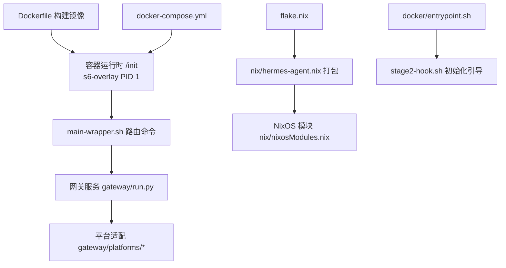
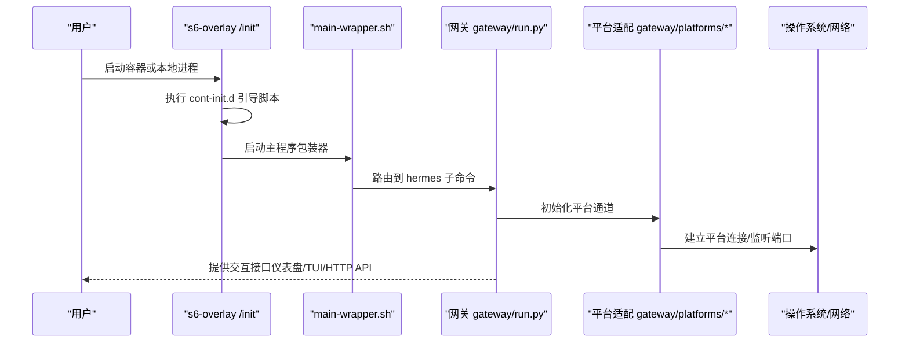
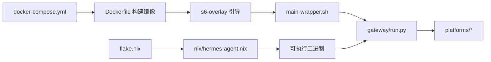

# 部署选项

<cite>
**本文引用的文件**
- [Dockerfile](file://Dockerfile)
- [docker-compose.yml](file://docker-compose.yml)
- [docker-compose.windows.yml](file://docker-compose.windows.yml)
- [flake.nix](file://flake.nix)
- [nix/hermes-agent.nix](file://nix/hermes-agent.nix)
- [nix/packages.nix](file://nix/packages.nix)
- [nix/nixosModules.nix](file://nix/nixosModules.nix)
- [nix/devShell.nix](file://nix/devShell.nix)
- [docker/entrypoint.sh](file://docker/entrypoint.sh)
- [docker/stage2-hook.sh](file://docker/stage2-hook.sh)
- [docker/main-wrapper.sh](file://docker/main-wrapper.sh)
- [.dockerignore](file://.dockerignore)
- [hermes_cli/env_loader.py](file://hermes_cli/env_loader.py)
- [gateway/run.py](file://gateway/run.py)
- [gateway/config.py](file://gateway/config.py)
- [gateway/platforms/api_server.py](file://gateway/platforms/api_server.py)
- [gateway/platforms/base.py](file://gateway/platforms/base.py)
- [gateway/session.py](file://gateway/session.py)
- [gateway/status.py](file://gateway/status.py)
- [gateway/display_config.py](file://gateway/display_config.py)
- [gateway/memory_monitor.py](file://gateway/memory_monitor.py)
- [gateway/shutdown_forensics.py](file://gateway/shutdown_forensics.py)
- [gateway/restart.py](file://gateway/restart.py)
- [gateway/stream_dispatch.py](file://gateway/stream_dispatch.py)
- [gateway/stream_consumer.py](file://gateway/stream_consumer.py)
- [gateway/stream_events.py](file://gateway/stream_events.py)
- [gateway/pairing.py](file://gateway/pairing.py)
- [gateway/channel_directory.py](file://gateway/channel_directory.py)
- [gateway/platform_registry.py](file://gateway/platform_registry.py)
- [gateway/hooks.py](file://gateway/hooks.py)
- [gateway/delivery.py](file://gateway/delivery.py)
- [gateway/session_context.py](file://gateway/session_context.py)
- [gateway/platforms/base.py](file://gateway/platforms/base.py)
- [gateway/platforms/_http_client_limits.py](file://gateway/platforms/_http_client_limits.py)
- [gateway/platforms/helpers.py](file://gateway/platforms/helpers.py)
- [gateway/platforms/qqbot/__init__.py](file://gateway/platforms/qqbot/__init__.py)
- [gateway/platforms/telegram.py](file://gateway/platforms/telegram.py)
- [gateway/platforms/slack.py](file://gateway/platforms/slack.py)
- [gateway/platforms/email.py](file://gateway/platforms/email.py)
- [gateway/platforms/matrix.py](file://gateway/platforms/matrix.py)
- [gateway/platforms/whatsapp.py](file://gateway/platforms/whatsapp.py)
- [gateway/platforms/webhook.py](file://gateway/platforms/webhook.py)
- [gateway/platforms/msgraph_webhook.py](file://gateway/platforms/msgraph_webhook.py)
- [gateway/platforms/feishu.py](file://gateway/platforms/feishu.py)
- [gateway/platforms/feishu_comment.py](file://gateway/platforms/feishu_comment.py)
- [gateway/platforms/feishu_comment_rules.py](file://gateway/platforms/feishu_comment_rules.py)
- [gateway/platforms/feishu_meeting_invite.py](file://gateway/platforms/feishu_meeting_invite.py)
- [gateway/platforms/yuanbao.py](file://gateway/platforms/yuanbao.py)
- [gateway/platforms/yuanbao_media.py](file://gateway/platforms/yuanbao_media.py)
- [gateway/platforms/yuanbao_proto.py](file://gateway/platforms/yuanbao_proto.py)
- [gateway/platforms/yuanbao_sticker.py](file://gateway/platforms/yuanbao_sticker.py)
- [gateway/platforms/weixin.py](file://gateway/platforms/weixin.py)
- [gateway/platforms/wecom.py](file://gateway/platforms/wecom.py)
- [gateway/platforms/wecom_callback.py](file://gateway/platforms/wecom_callback.py)
- [gateway/platforms/wecom_crypto.py](file://gateway/platforms/wecom_crypto.py)
- [gateway/platforms/qqbot/helpers.py](file://gateway/platforms/qqbot/helpers.py)
- [gateway/platforms/qqbot/callbacks.py](file://gateway/platforms/qqbot/callbacks.py)
- [gateway/platforms/qqbot/crypto.py](file://gateway/platforms/qqbot/crypto.py)
- [gateway/platforms/qqbot/webhook.py](file://gateway/platforms/qqbot/webhook.py)
- [gateway/platforms/qqbot/rpc.py](file://gateway/platforms/qqbot/rpc.py)
- [gateway/platforms/qqbot/session.py](file://gateway/platforms/qqbot/session.py)
- [gateway/platforms/qqbot/models.py](file://gateway/platforms/qqbot/models.py)
- [gateway/platforms/qqbot/transport.py](file://gateway/platforms/qqbot/transport.py)
- [gateway/platforms/qqbot/eventlog.py](file://gateway/platforms/qqbot/eventlog.py)
- [gateway/platforms/qqbot/message.py](file://gateway/platforms/qqbot/message.py)
- [gateway/platforms/qqbot/utils.py](file://gateway/platforms/qqbot/utils.py)
- [gateway/platforms/qqbot/exceptions.py](file://gateway/platforms/qqbot/exceptions.py)
- [gateway/platforms/qqbot/constants.py](file://gateway/platforms/qqbot/constants.py)
- [gateway/platforms/qqbot/types.py](file://gateway/platforms/qqbot/types.py)
- [gateway/platforms/qqbot/registry.py](file://gateway/platforms/qqbot/registry.py)
- [gateway/platforms/qqbot/transport.py](file://gateway/platforms/qqbot/transport.py)
- [gateway/platforms/qqbot/eventlog.py](file://gateway/platforms/qqbot/eventlog.py)
- [gateway/platforms/qqbot/message.py](file://gateway/platforms/qqbot/message.py)
- [gateway/platforms/qqbot/utils.py](file://gateway/platforms/qqbot/utils.py)
- [gateway/platforms/qqbot/exceptions.py](file://gateway/platforms/qqbot/exceptions.py)
- [gateway/platforms/qqbot/constants.py](file://gateway/platforms/qqbot/constants.py)
- [gateway/platforms/qqbot/types.py](file://gateway/platforms/qqbot/types.py)
- [gateway/platforms/qqbot/registry.py](file://gateway/platforms/qqbot/registry.py)
- [gateway/platforms/qqbot/transport.py](file://gateway/platforms/qqbot/transport.py)
- [gateway/platforms/qqbot/eventlog.py](file://gateway/platforms/qqbot/eventlog.py)
- [gateway/platforms/qqbot/message.py](file://gateway/platforms/qqbot/message.py)
- [gateway/platforms/qqbot/utils.py](file://gateway/platforms/qqbot/utils.py)
- [gateway/platforms/qqbot/exceptions.py](file://gateway/platforms/qqbot/exceptions.py)
- [gateway/platforms/qqbot/constants.py](file://gateway/platforms/qqbot/constants.py)
- [gateway/platforms/qqbot/types.py](file://gateway/platforms/qqbot/types.py)
- [gateway/platforms/qqbot/registry.py](file://gateway/platforms/qqbot/registry.py)
- [gateway/platforms/qqbot/transport.py](file://gateway/platforms/qqbot/transport.py)
- [gateway/platforms/qqbot/eventlog.py](file://gateway/platforms/qqbot/eventlog.py)
- [gateway/platforms/qqbot/message.py](file://gateway/platforms/qqbot/message.py)
- [gateway/platforms/qqbot/utils.py](file://gateway/platforms/qqbot/utils.py)
- [gateway/platforms/qqbot/exceptions.py](file://gateway/platforms/qqbot/exceptions.py)
- [gateway/platforms/qqbot/constants.py](file://gateway/platforms/qqbot/constants.py)
- [gateway/platforms/qqbot/types.py](file://gateway/platforms/qqbot/types.py)
- [gateway/platforms/qqbot/registry.py](file://gateway/platforms/qqbot/registry.py)
- [gateway/platforms/qqbot/transport.py](file://gateway/platforms/qqbot/transport.py)
- [gateway/platforms/qqbot/eventlog.py](file://gateway/platforms/qqbot/eventlog.py)
- [gateway/platforms/qqbot/message.py](file://gateway/platforms/qqbot/message.py)
- [gateway/platforms/qqbot/utils.py](file://gateway/platforms/qqbot/utils.py)
- [gateway/platforms/qqbot/exceptions.py](file://gateway/platforms/qqbot/exceptions.py)
- [gateway/platforms/qqbot/constants.py](file://gateway/platforms/qqbot/constants.py)
- [gateway/platforms/qqbot/types.py](file://gateway/platforms/qqbot/types.py)
- [gateway/platforms/qqbot/registry.py](file://gateway/platforms/qqbot/registry.py)
- [gateway/platforms/qqbot/transport.py](file://gateway/platforms/qqbot/transport.py)
- [gateway/platforms/qqbot/eventlog.py](file://gateway/platforms/qqbot/eventlog.py)
- [gateway/platforms/qqbot/message.py](file://gateway/platforms/qqbot/message.py)
- [gateway/platforms/qqbot/utils.py](file://gateway/platforms/qqbot/utils.py)
- [gateway/platforms/qqbot/exceptions.py](file://gateway/platforms/qqbot/exceptions.py)
- [gateway/platforms/qqbot/constants.py](file://gateway/platforms/qqbot/constants.py)
- [gateway/platforms/qqbot/types.py](file://gateway/platforms/qqbot/types.py)
- [gateway/platforms/qqbot/registry.py](file://gateway/platforms/qqbot/registry.py)
- [gateway/platforms/qqbot/transport.py](file://gateway/platforms/qqbot/transport.py)
- [gateway/platforms/......](file://gateway/platforms/......)
</cite>

## 目录
1. [简介](#简介)
2. [项目结构](#项目结构)
3. [核心组件](#核心组件)
4. [架构总览](#架构总览)
5. [详细组件分析](#详细组件分析)
6. [依赖关系分析](#依赖关系分析)
7. [性能考虑](#性能考虑)
8. [故障排查指南](#故障排查指南)
9. [结论](#结论)
10. [附录](#附录)

## 简介
本文件面向Hermes Agent的多平台部署需求，系统性梳理并对比五种部署方式：Docker 容器化部署、Docker Compose 编排部署、Nix 包管理部署、Kubernetes 集群部署与传统本地部署。文档覆盖适用场景、前置条件、配置步骤、环境变量、网络与存储、安全策略、部署清单、配置示例与常见问题，并提供跨平台注意事项与性能优化建议。

## 项目结构
围绕部署的关键文件与目录如下：
- 容器镜像构建：Dockerfile、.dockerignore
- 编排与运行：docker-compose.yml（含 Windows 变体）
- Nix 包与模块：flake.nix、nix/hermes-agent.nix、nix/packages.nix、nix/nixosModules.nix、nix/devShell.nix
- 运行时入口与服务编排：docker/entrypoint.sh、docker/stage2-hook.sh、docker/main-wrapper.sh
- 网关与平台适配：gateway/*、gateway/platforms/*

**图示来源**
- [Dockerfile:1-327](file://Dockerfile#L1-L327)
- [docker/main-wrapper.sh](file://docker/main-wrapper.sh)
- [gateway/run.py](file://gateway/run.py)
- [docker-compose.yml:1-77](file://docker-compose.yml#L1-L77)
- [flake.nix:1-46](file://flake.nix#L1-L46)
- [nix/hermes-agent.nix:1-251](file://nix/hermes-agent.nix#L1-L251)
- [docker/entrypoint.sh:1-28](file://docker/entrypoint.sh#L1-L28)
- [docker/stage2-hook.sh](file://docker/stage2-hook.sh)

**章节来源**
- [Dockerfile:1-327](file://Dockerfile#L1-L327)
- [docker-compose.yml:1-77](file://docker-compose.yml#L1-L77)
- [flake.nix:1-46](file://flake.nix#L1-L46)
- [nix/hermes-agent.nix:1-251](file://nix/hermes-agent.nix#L1-L251)
- [docker/entrypoint.sh:1-28](file://docker/entrypoint.sh#L1-L28)

## 核心组件
- 容器镜像与运行时
  - 基于 s6-overlay 的 PID 1 监督体系，通过 /init 启动 cont-init.d 引导脚本，再启动主服务与仪表盘。
  - 提供特权降级执行器与可选的 OpenAI 兼容 API 服务器。
- 网关与平台适配
  - 网关统一调度会话、消息流式分发与平台接入（如 Telegram、Slack、Matrix、Webhook、邮件等）。
  - 支持按需启用特定平台，通过环境变量注入密钥与配置。
- Nix 包与模块
  - 将 Python 与 Node 生态、TUI/Web 资源、技能与插件打包到单一二进制，支持多系统（Linux、macOS）与 NixOS 模块化集成。

**章节来源**
- [Dockerfile:254-327](file://Dockerfile#L254-L327)
- [gateway/run.py](file://gateway/run.py)
- [gateway/platforms/base.py](file://gateway/platforms/base.py)
- [nix/hermes-agent.nix:155-251](file://nix/hermes-agent.nix#L155-L251)

## 架构总览
下图展示从容器/本地启动到平台接入的整体流程，包括 s6-overlay 引导、网关路由与平台适配层。

**图示来源**
- [Dockerfile:303-327](file://Dockerfile#L303-L327)
- [docker/main-wrapper.sh](file://docker/main-wrapper.sh)
- [gateway/run.py](file://gateway/run.py)
- [gateway/platforms/base.py](file://gateway/platforms/base.py)

## 详细组件分析

### Docker 容器化部署
- 适用场景
  - 快速隔离运行、跨平台一致性、便于 CI/CD 集成。
- 前置条件
  - 已安装 Docker 引擎；具备拉取/构建镜像权限。
- 配置步骤
  - 构建镜像：在仓库根目录执行镜像构建（可传入 Git 提交哈希以固化版本信息）。
  - 运行容器：
    - 使用默认网关模式：映射宿主机用户 ID/GID，挂载 ~/.hermes 到 /opt/data，使用 host 网络。
    - 如需仪表盘：单独运行 dashboard 容器，绑定到 127.0.0.1 并禁用自动打开浏览器。
    - 如需启用 OpenAI 兼容 API：设置 API 服务器主机与密钥（仅在内网或受控代理后使用）。
- 环境变量
  - HERMES_UID / HERMES_GID：控制容器内 hermes 用户的 UID/GID，确保宿主机文件可读写。
  - HERMES_HOME：工作目录，默认 /opt/data。
  - API_SERVER_HOST / API_SERVER_KEY：启用网关 HTTP API 服务器（谨慎暴露）。
  - 平台密钥：根据所选平台设置对应环境变量（例如 Teams、Google Chat 等）。
- 网络与存储
  - 默认使用 host 网络；数据持久化挂载 /opt/data（即 ~/.hermes）。
  - 仪表盘默认仅监听 127.0.0.1，远程访问建议 SSH 隧道。
- 安全配置
  - 不要将仪表盘或 API 暴露至公网；如需远程访问，必须配合认证代理或 SSH 隧道。
  - 若自定义 entrypoint，请保留 /init 作为链路首段，否则会跳过引导脚本导致服务异常。
- 部署清单
  - 网关服务：构建镜像、host 网络、挂载 ~/.hermes、设置 HERMES_UID/GID、运行 gateway run。
  - 仪表盘服务：基于同一镜像、host 网络、绑定 127.0.0.1、设置 HERMES_UID/GID、运行 dashboard。
- 配置示例
  - 示例参考：docker-compose.yml 中的注释与示例环境变量。
- 常见问题
  - 容器启动后网关未工作：检查是否绕过 /init 或未正确设置 HERMES_UID/GID。
  - 文件权限问题：确认宿主机 ~/.hermes 权限与 UID/GID 对齐。
  - API 暴露风险：仅在受控网络中开启 API 服务器。

**章节来源**
- [Dockerfile:254-327](file://Dockerfile#L254-L327)
- [docker-compose.yml:1-77](file://docker-compose.yml#L1-L77)
- [docker/entrypoint.sh:1-28](file://docker/entrypoint.sh#L1-L28)

### Docker Compose 编排部署
- 适用场景
  - 需要同时运行网关与仪表盘，且希望统一管理服务生命周期与网络。
- 前置条件
  - 已安装 Docker Compose；具备与 Docker 守护进程通信权限。
- 配置步骤
  - 设置 HERMES_UID/HERMES_GID 为当前宿主机用户，确保文件所有权一致。
  - 启动：docker compose up -d。
  - 如需启用特定平台，取消对应注释并填入所需环境变量与密钥文件路径。
- 环境变量
  - 与单容器部署一致，Compose 文件中已给出示例与注释。
- 网络与存储
  - 两服务均使用 host 网络；共享 ~/.hermes 数据卷。
- 安全配置
  - 仪表盘默认仅监听 127.0.0.1；如需远程访问，使用 SSH 隧道。
  - 自定义 entrypoint 时务必保留 /init。
- 部署清单
  - 网关：host 网络、~/.hermes 挂载、gateway run。
  - 仪表盘：host 网络、~/.hermes 挂载、dashboard --host 127.0.0.1 --no-open。
- 配置示例
  - 参考 docker-compose.yml 中的注释与示例环境变量。
- 常见问题
  - 服务无法启动：检查 host 网络权限与端口占用。
  - 平台不可用：确认密钥与文件挂载路径正确。

**章节来源**
- [docker-compose.yml:1-77](file://docker-compose.yml#L1-L77)

### Nix 包管理部署
- 适用场景
  - 在 Nix 生态（NixOS、非 NixOS 的 Nix 环境）中进行可复现、可升级的本地部署。
- 前置条件
  - 已安装 Nix（带 flakes 支持）；具备网络访问以下载依赖。
- 配置步骤
  - 直接安装：nix profile install github:NousResearch/hermes-agent
  - 开发环境：nix develop 生成带虚拟环境的开发 Shell。
  - NixOS：通过 nixosModules 导出的模块在系统配置中启用 Hermes。
- 环境变量
  - 通过包装器注入：HERMES_BUNDLED_*、HERMES_WEB_DIST、HERMES_TUI_DIR、HERMES_PYTHON、HERMES_NODE 等。
  - 可通过 extraPythonPackages 与 extraDependencyGroups 扩展依赖。
- 网络与存储
  - 本地运行，无容器网络限制；数据目录位于默认 HERMES_HOME（通常为 ~/.hermes）。
- 安全配置
  - 本地运行，无需额外反向代理；注意文件权限与密钥存放。
- 部署清单
  - 安装包：nix profile install …
  - 开发 Shell：nix develop
  - NixOS 模块：在系统配置中启用相应模块。
- 配置示例
  - 参考 flake.nix 与 nix/hermes-agent.nix 中的参数与模块导入。
- 常见问题
  - 依赖冲突：使用 extraPythonPackages 时，包装器会检测核心与扩展包的命名冲突。
  - 版本不匹配：确保 pyproject.toml 与 uv.lock 与 flake 保持一致。

**章节来源**
- [flake.nix:1-46](file://flake.nix#L1-L46)
- [nix/hermes-agent.nix:1-251](file://nix/hermes-agent.nix#L1-L251)
- [nix/packages.nix](file://nix/packages.nix)
- [nix/nixosModules.nix](file://nix/nixosModules.nix)
- [nix/devShell.nix](file://nix/devShell.nix)

### Kubernetes 集群部署
- 适用场景
  - 需要在 Kubernetes 集群中以 Pod 形式运行 Hermes，结合 ConfigMap/Secret 管理配置与密钥。
- 前置条件
  - 已有可用的 Kubernetes 集群与 kubectl 权限。
- 配置步骤
  - 构建镜像并推送到镜像仓库（或使用私有仓库）。
  - 准备 ConfigMap/Secret：包含平台密钥、API 服务器密钥（如启用）、环境变量等。
  - 准备 Deployment/StatefulSet：挂载持久卷到 /opt/data，使用 hostNetwork 或通过 Service 暴露仪表盘。
  - 应用清单：kubectl apply -f <清单文件>。
- 环境变量
  - 与 Docker 部署一致，通过 ConfigMap 注入。
- 网络与存储
  - 网络：可使用 hostNetwork 简化平台接入；或通过 Service 暴露仪表盘。
  - 存储：使用 PVC 持久化 ~/.hermes。
- 安全配置
  - Secret 管理敏感信息；仪表盘与 API 服务器仅在受控网络中暴露。
- 部署清单
  - 镜像：hermes-agent:latest
  - 环境变量：HERMES_UID/GID、平台密钥、API 服务器配置
  - 卷：/opt/data -> PVC
  - 服务：ClusterIP/LoadBalancer/Ingress（按需）
- 配置示例
  - 参考 docker-compose.yml 中的环境变量与平台配置思路，转换为 Kubernetes 的 ConfigMap/Secret。
- 常见问题
  - 权限不足：确保 Pod 具有写入 /opt/data 的权限。
  - 端口冲突：hostNetwork 下注意端口占用。

**章节来源**
- [Dockerfile:254-327](file://Dockerfile#L254-L327)
- [docker-compose.yml:1-77](file://docker-compose.yml#L1-L77)

### 传统本地部署
- 适用场景
  - 在非容器环境中直接运行，适合开发调试、快速试用与最小化资源占用。
- 前置条件
  - 已安装 Python 3.12、Node.js 22、Git、SSH、FFmpeg 等运行时依赖。
- 配置步骤
  - 安装依赖：pip install -e ".[all]"（或使用 Nix 开发 Shell）。
  - 运行网关：hermes gateway run
  - 运行仪表盘：hermes dashboard --host 127.0.0.1 --no-open
- 环境变量
  - 与容器部署一致，通过环境变量注入平台密钥与 API 服务器配置。
- 网络与存储
  - 本地运行，无容器网络限制；数据目录位于默认 HERMES_HOME。
- 安全配置
  - 本地运行，注意密钥与日志安全；避免在不受信终端中运行。
- 部署清单
  - 安装：pip install -e ".[all]"
  - 运行：hermes gateway run；hermes dashboard ...
- 配置示例
  - 参考 docker-compose.yml 中的环境变量与平台配置。
- 常见问题
  - 依赖缺失：确保 Node、Git、FFmpeg 等工具可用。
  - 权限问题：确认 ~/.hermes 目录权限与当前用户一致。

**章节来源**
- [nix/devShell.nix](file://nix/devShell.nix)
- [nix/hermes-agent.nix:225-241](file://nix/hermes-agent.nix#L225-L241)

## 依赖关系分析
- 容器镜像依赖
  - s6-overlay 提供监督与引导；main-wrapper.sh 负责命令路由；stage2-hook.sh 处理初始化与权限映射。
- Nix 包依赖
  - hermes-agent.nix 将 Python 与 Node 生态、TUI/Web 资源、技能与插件打包为可执行二进制；通过 extraPythonPackages 与 extraDependencyGroups 扩展。
- 网关与平台
  - 网关统一调度，平台适配通过 gateway/platforms/* 实现；平台间通过会话与事件流进行解耦。

**图示来源**
- [Dockerfile:303-327](file://Dockerfile#L303-L327)
- [docker/main-wrapper.sh](file://docker/main-wrapper.sh)
- [gateway/run.py](file://gateway/run.py)
- [nix/hermes-agent.nix:155-251](file://nix/hermes-agent.nix#L155-L251)
- [docker-compose.yml:1-77](file://docker-compose.yml#L1-L77)
- [flake.nix:1-46](file://flake.nix#L1-L46)

**章节来源**
- [Dockerfile:303-327](file://Dockerfile#L303-L327)
- [nix/hermes-agent.nix:155-251](file://nix/hermes-agent.nix#L155-L251)

## 性能考虑
- 容器与编排
  - 使用 host 网络减少网络开销；合理设置 HERMES_UID/GID 降低权限切换成本。
  - 将 /opt/data 挂载到高性能磁盘；避免频繁小文件 IO。
- Nix 部署
  - 使用缓存与增量更新；在开发 Shell 中预热依赖以减少首次启动时间。
- 网关与平台
  - 合理配置平台并发与速率限制；对长耗时任务采用异步处理与流式输出。
- 资源监控
  - 结合内存监控与关闭取证，及时发现资源泄漏与异常退出。

**章节来源**
- [gateway/memory_monitor.py](file://gateway/memory_monitor.py)
- [gateway/shutdown_forensics.py](file://gateway/shutdown_forensics.py)

## 故障排查指南
- 容器启动后网关不可用
  - 检查是否绕过 /init；确认 cont-init.d 是否执行成功。
  - 参考：docker/entrypoint.sh 的弃用提示与 stage2-hook.sh 的职责。
- 文件权限问题
  - 确认 HERMES_UID/GID 与宿主机用户一致；检查 ~/.hermes 权限。
- API 暴露风险
  - 仪表盘与 API 服务器仅在受控网络中暴露；必要时使用 SSH 隧道。
- Nix 包冲突
  - extraPythonPackages 与核心包命名冲突会导致安装失败；包装器会检测并报错。
- 平台接入失败
  - 检查平台密钥与文件挂载路径；确认网络可达性与速率限制。

**章节来源**
- [docker/entrypoint.sh:1-28](file://docker/entrypoint.sh#L1-L28)
- [docker/stage2-hook.sh](file://docker/stage2-hook.sh)
- [nix/hermes-agent.nix:196-200](file://nix/hermes-agent.nix#L196-L200)

## 结论
Hermes Agent 提供了从单容器到 Kubernetes 的完整部署路径，既满足快速试用，也支持生产级的可复现与可观测性。选择合适的部署方式取决于团队的技术栈与运维偏好：Docker 适合快速上手与 CI/CD；Nix 适合可复现与多系统；Kubernetes 适合云原生与弹性扩缩容。无论哪种方式，都应重视环境变量、网络与存储、以及安全配置。

## 附录
- 环境变量清单（节选）
  - HERMES_UID / HERMES_GID：容器内用户映射
  - HERMES_HOME：工作目录
  - API_SERVER_HOST / API_SERVER_KEY：OpenAI 兼容 API 服务器
  - 平台密钥：Teams、Google Chat 等平台所需的客户端 ID/密钥与项目配置
- 网络与存储
  - host 网络用于简化平台接入；数据卷挂载 /opt/data（~/.hermes）
- 安全建议
  - 仪表盘与 API 服务器默认仅监听 127.0.0.1；远程访问请使用 SSH 隧道或受控代理
  - 不要将敏感密钥硬编码在镜像或配置文件中，优先使用 Secret/环境变量注入
- 跨平台注意事项
  - Windows：可参考 docker-compose.windows.yml 的差异配置
  - macOS/Linux：Nix 部署与容器部署均可使用 host 网络；注意平台依赖（如 wl-clipboard/xclip）

**章节来源**
- [docker-compose.yml:1-77](file://docker-compose.yml#L1-L77)
- [docker-compose.windows.yml](file://docker-compose.windows.yml)
- [nix/hermes-agent.nix:85-98](file://nix/hermes-agent.nix#L85-L98)